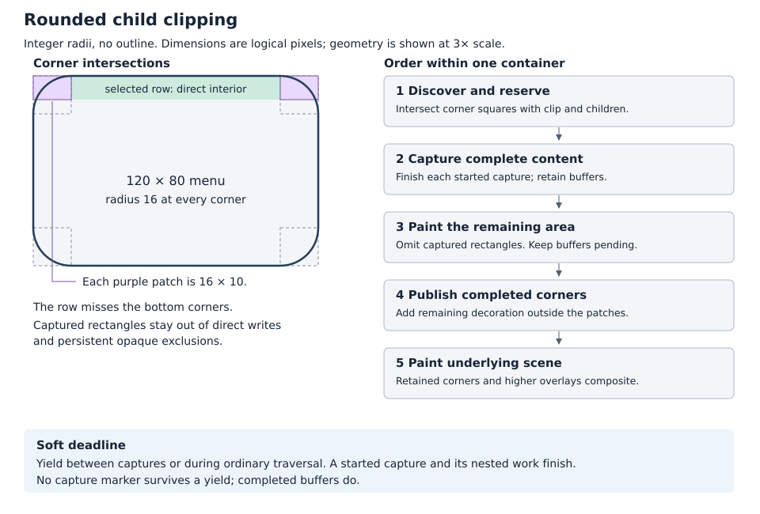

# Rounded container child clipping

**Status: Abandoned (unimplemented).** This alternative replays child painting
to capture corner regions. Work continued with the
[sparse rounded child clipping prototype](../prototypes/rounded_child_clipping.md),
which intercepts child output during a single traversal. The original proposal
is retained below for reference.

## Objective

Allow children to paint to a container's rounded boundary, including selected
rows in scrolling menus, while preserving the scene beneath its corners and
the renderer's incremental painting behavior.

## Motivation

A selected menu row can reach the top or bottom of a scrolling viewport.
Restricting it to the rectangle inscribed in the menu's rounded shape leaves
an unwanted strip of menu background. Painting the row's full rectangle leaks
color outside the menu. Capturing only the affected corner areas allows the
row to reach the curved edge without allocating a menu-sized framebuffer.

## Background

This background describes the renderer when the design was proposed. The
[paint context](../implemented/paint_context_design.md) and
[interrupted paint continuation](../implemented/interrupted_paint_continuation_design.md)
are implemented prerequisites. General ownership terminology is in the
[design glossary](../glossary.md).

Roo Windows traverses widgets from foreground to background. Completed opaque
areas become rectangular exclusions; overlays remain available to composite
above later background writes. Earlier overlay registrations appear above
later registrations. A logical paint can span several deadline-limited
attempts, with completed exclusions and overlays retained in the root's
[`ClipperState`](../../../src/roo_windows/core/clipper.h).

[`ClipperOutput::sync()`](../../../src/roo_windows/core/clipper.h) builds a
`RasterizableStack` of overlays separately from the incoming content pixels.
Making that stack transparent exposes the incoming content. Consequently,
inserting erasing masks in the existing stack cannot clip child content.

[`SurfaceWidget`](../../../src/roo_windows/core/surface_widget.cpp) and
[`Container`](../../../src/roo_windows/core/container.cpp) use border thickness
to keep direct surface painting in a safe rectangle. The
[`Decoration`](../../../src/roo_windows/decoration/decoration.cpp) rasterizer
supplies rounded fill, outline, and shadow. `Canvas` resolves many colors
against its effective background before writing; capture must preserve those
existing semantics.

[`BorderStyle::trim()`](../../../src/roo_windows/core/border_style.h) clamps
each radius to half the smaller widget dimension. This is stronger than
merely constraining adjacent radius sums: all four corner squares are
disjoint, even with unequal radii. This design preserves that rule.

## Requirements

1. Child backgrounds, selection, and interaction effects reach the curved
   boundary with the same coverage convention as the container decoration.
2. The scene beneath an uncovered corner remains visible. Outlines, shadows,
   overlapping children, nested rounded containers, and higher siblings keep
   their intended order.
3. Children that never intersect a rounded boundary retain direct painting.
   Storage scales with affected corner area, without adding fields to every
   widget or container.
4. Recursive painting reuses shared exclusion and overlay storage. Entering a
   recursion scope allocates no separate transient vectors.
5. Capturing pixels does not consume dirty flags, settle clicks, advance
   animation, or change persistent widget caches.
6. Painting makes progress across continuations. Deadlines are soft: a started
   corner capture finishes, including its nested captures, before yielding.
7. Allocation failure preserves correct clipping and permits the logical
   paint to finish with reduced visual fidelity.

## Design Overview

A **capture rectangle** is the portion of one corner square that needs child
content. Its pixels are rendered offscreen using the existing deferred
renderer. A **capture frame** is a stack-local marker that redirects output
and selects visible ranges within shared clipper storage. A **corner record**
owns the resulting buffers and progress for one participating container until
the logical paint completes or is restarted.

The container first discovers up to four capture rectangles. It captures each
rectangle's complete content, applies its rounded surface composition once,
and keeps the resulting overlay pending. It then paints the remaining area
normally. Once that work finishes, it publishes the corner overlays and the
remaining decoration for background painting to consume.



For example, a 120 by 80 pixel menu with radius 16 and a selected row occupying
the top 10 pixels needs two 16 by 10 captures, or 1,280 bytes at four bytes per
pixel. Four full 16 by 16 corners would need 4,096 bytes. These are pixel
payloads; metadata and reusable compositor scratch are additional.

The small captures satisfy the geometry and RAM requirements. Scoped markers
provide compositing isolation without duplicate working vectors. A paint
purpose separates reconstruction from ordinary refresh bookkeeping. Retained
corner records provide continuation without rerendering completed captures.

The first implementation keeps the current foreground-to-background
composition contract everywhere. Buffer capture does not introduce a second
widget drawing order or a general immediate-blending API.

## Design Details

### Discovering capture rectangles

All calculations use device coordinates after applying existing rectangular
ancestor clipping. Equations below use half-open intervals; convert to the
repository's inclusive `Box` coordinates at the geometry boundary.

For outer bounds $[x,x+w)\times[y,y+h)$ and trimmed radii $r_i$, the corner
squares are:

| Corner | Square |
| --- | --- |
| Top left | $[x,x+r_{tl})\times[y,y+r_{tl})$ |
| Top right | $[x+w-r_{tr},x+w)\times[y,y+r_{tr})$ |
| Bottom right | $[x+w-r_{br},x+w)\times[y+h-r_{br},y+h)$ |
| Bottom left | $[x,x+r_{bl})\times[y+h-r_{bl},y+h)$ |

Intersect each square with the active clip and the rectangular child viewport.
The viewport is inset by `ceil(outline_width)` so direct children cannot
overwrite the straight outline. Corner masking uses the same inner coverage
as `Decoration`, including fractional outline widths. It does not independently
approximate the radius or alpha ramp.

For each remaining corner, accumulate the bounding union of its intersections
with visible clipped children's visual bounds. Include descendant overflow
that remains subject to this container's clip, child decoration, and clean
children that contribute to the reconstructed area. Use existing conservative
visual bounds; add no per-child retained geometry. An explicitly unclipped child
can be interleaved with clipped siblings. Flattening only those siblings into
one corner would lose that ordering. When an unclipped child's visual bounds
intersect a candidate corner, use the conservative inset fallback for this
container for the logical paint. Unclipped children keep their existing escape
behavior. Unclipped children disjoint from all candidate corners remain on the
ordinary path and need no capture participation.

Stop early when no corner remains. Discard an intersection whose fill coverage
is uniformly zero; its child writes must still be suppressed by the rounded
clip. Draw an intersection directly when the shared coverage helper proves
every pixel fully covered. Mixed coverage needs capture. The initial version
uses rectangular intersections without scanline compression.

Use the coverage helper's exact pixel support at inclusive boundaries. Unit
tests cover the transition at radius-sized square edges and fractional
outlines; any required support row is included conservatively in the candidate
rectangle. The geometric diagram shows integer radii and no outline.

The familiar inset $(1-1/\sqrt{2})r$ describes an inscribed rectangle. It cannot
replace the $r$ by $r$ corner square: the curve also crosses the adjacent strips.
Unequal radii change four local bounds and masks; under current trimming they
do not require an overlapping-corner algorithm or a nine-region partition.

### Capturing complete content

Allocate an RGBA buffer for the chosen rectangle, initially transparent.
An output adapter maps device coordinates to buffer indices; local widget
origins, clip coordinates, and rasterizable sampling coordinates stay unchanged.
The adapter reports blending support and disables display blit-copy support.

Replay the participating subtree clipped to this rectangle. Capture traverses
clean and dirty contributors, preserves ordinary sibling order, and renders
the container's background through the local deferred overlays and exclusions.
This last background write resolves child decorations and other retained
foreground contributions into the buffer. A clear performed before traversal
would not resolve overlays registered later.

Bypass only the capturing owner's rounded restriction during this replay.
Nested rounded containers retain their own clipping and can use nested capture
frames. The owner supplies the existing effective background; this feature
does not change the library's treatment of translucent surface colors.

The result at this point is the container's content before its own rounded
coverage. Parent clipping is applied once to this combined content, rather
than independently to every contributing child. For normalized coverage $a$,
the conceptual operation on premultiplied content is:

$$C' = aC,\qquad \alpha' = a\alpha.$$

This is destination-in with an inside mask, or destination-out with the
complementary outside mask. Implement it using roo_display's color operations;
do not multiply both straight RGB and alpha in its stored `Color` format.


The PNG is a mathematical reference generated by
[the figure script](figures/rounded_child_clipping_figures.py), using analytic
pixel-center coverage. It is not a screenshot or a pixel-exact reference for
the current fixed-point decoration rasterizer. At $a=0.5$, two separately
masked opaque layers produce $1-(1-a)^2=0.75$ coverage instead of $0.5$.

### Decoration ownership

Every capture rectangle replaces the normal container decoration over that
rectangle. Extract the existing decoration sampling calculation into a shared
internal helper that accepts the resolved content color in place of the flat
background color. Use its existing fill coverage, outline, shadow, and
interaction ordering to finalize each captured pixel. This preserves the
current border appearance and avoids introducing a second corner rasterizer.

The corner buffer therefore owns the final surface and shadow contribution
within its rectangle. Outside it, the existing decoration supplies the rest.
Suppress the entire ordinary decoration contribution inside captured
rectangles, including its shadow; otherwise it would be blended twice. Shadow
pixels beyond a capture rectangle remain in the ordinary decoration overlay.
With zero elevation, pixels outside the surface are transparent.

For the capturing owner's interaction state, resolve content-affecting feedback
inside capture and outline/shadow feedback at the existing decoration stage.
Track that ownership explicitly so the finalizer does not tint captured
content again. Child effects remain part of child composition. Higher sibling
effects are applied only by the enclosing compositor.

### Shared capture frames

The frame has no vector members. It records entry counts into existing shared
arrays, corner records, and arenas, plus the prior output, bounds, purpose,
deadline suppression depth, and active effect state. The capture's output
buffer is allocated before
the frame marker, so it survives unwinding. Nested temporary rasters occupy
slots beyond that marker and are recycled after their pixels are resolved.
Nested corner records complete synchronously and are recycled at the same
boundary; they never become independently resumable outer records.

| State | Capture visibility and lifetime |
| --- | --- |
| Ancestor rectangular clip | Inherited in device coordinates |
| Earlier sibling exclusions and overlays | Hidden during capture; retained unchanged for enclosing composition |
| Capture-local exclusions and overlays | Visible from the marker onward; removed on exit |
| Owner and descendant interaction effects | Reestablished within their capture scopes |
| Outer active filters and press raster | Saved and restored; never baked into the buffer accidentally |
| Owned temporary decorations and shapes | Stable shared slots with used-count markers |
| Reusable `RasterizableStack` and bounded exclusions | Shared scratch; rebuilt for the active frame |

The owner starts capture before installing its own effects in the enclosing
context. Ancestor effects outside the group remain outside it. Existing output
filter chains must retain this ownership across redirection: capture starts
from its buffer adapter rather than inheriting an ancestor's temporary
`Canvas::out()` wrapper.

`addExclusion()` currently folds contained entries and removes covered
overlays. Both optimizations must stop at the active frame's lower bounds.
Overlay-spec refcount folding must also stop at that boundary. Saving array
lengths alone cannot undo mutation of an older entry. Save and restore the
single mutable `PressOverlay` as well as its scoped activation state.

Do not retain vector iterators across recursion. Arena objects referenced by
overlays need stable addresses. Change decoration/spec arena reuse to used
counts where necessary; repeated capture at a warmed high-water mark must not
allocate a new deque block on every entry and exit.

On scope exit, remove local overlay references before recycling their sources,
restore the outer frame, and invalidate the derived filter configuration.
`setBounds()` already invalidates that configuration on a changed rectangle;
frame restoration uses the same lazy `sync()` mechanism. Finish each output
write before entering capture so no active pixel stream references rebuilt
scratch.

### Normal painting and publication

The ordinary pass must not write pixels represented by pending corner buffers.
Keep the up-to-four capture rectangles in a scoped omission list, separate from
persistent exclusions. Also suppress child writes where parent fill coverage
is zero. Outside corner squares the ordinary rectangular viewport suffices.

Apply omissions to all content output paths and to exclusions and overlays
published by this subtree. Subtract omitted rectangles using a fragment visitor
that appends to shared storage; do not allocate temporary fragment vectors.
This prevents a child's full rectangular exclusion from hiding the background
needed beneath a transparent captured corner. Split child overlay clips too,
because those contributions have already been captured.

Keep the buffers pending throughout normal painting and across interruptions.
Once the container's normal work is complete:

1. End its temporary omissions.
2. Publish each corner overlay exactly once, beneath preceding higher siblings.
3. Publish the ordinary decoration restricted to the remaining region.
4. Publish only proven opaque direct-paint exclusions outside captured areas.

Captured rectangles receive no blanket persistent exclusion, even when some
pixels are fully opaque. The retained foreground buffer will composite over
subsequent background painting. Rounded containers must propagate corner damage
to the underlying scene during ordinary invalidation, including changes driven
only by a child. A retained overlay does not itself schedule a background write.
Do this before traversal; capture must not recursively invalidate the scene it
is reconstructing. Keep the owner's existing surface-paint contract outside
captured child regions, including conservative clipping of custom surface ink.

Disable raw-output shadow shortcuts and display
blit copying while their destination intersects active omissions; route through
the filtered path. The discovery rule for intersecting unclipped children keeps
their ordering representable without splitting one corner into several layers.

### Paint purpose and widget state

Expose `PaintPurpose::kCapture` through `PaintContext`. It means reconstruct the
requested region without settling refresh state. It does not authorize a new
drawing order. Normal widget `paint()` implementations continue to draw and
register overlays using the existing contract.

Framework traversal under capture ignores dirty-based skips and leaves dirty,
invalidated, and terminal-click flags intact. Empty or invisible capture clips
must not call `markCleanDescending()`. Specialized container overrides must
honor the same rule. Custom code that maintains paint caches can inspect the
purpose and use its ordinary uncached drawing path during capture.

In particular, `BlitCacheContainer` must not copy from the display, update its
safe region, or consume its cache invalidation during capture. Read-only use of
already valid immutable cached pixels is allowed only through the capture
output. Animation reads use the enclosing logical paint's retained sample;
capture never starts or settles an animation or invokes semantic callbacks.

### Soft deadlines and continuation

Check the deadline before starting each outer capture. Once it starts, suppress
deadline checks for that capture and every nested operation it triggers.
Complete composition, finalize the buffer, unwind the marker, and retain the
result before checking time again. Nested captures belong to the same atomic
unit. A container with a completed corner can yield without losing progress.

Each root-owned corner record contains owner identity, device bounds, capture
rectangles, stable buffer slots, a completed-corner bitmask, and a stage:
`capturing`, `normal_paint`, `published`, or `fallback`. No frame marker survives
a yield. A later attempt recreates temporary frames and skips completed
captures. Its normal pass uses existing dirty flags and retained exclusions;
capture itself has not consumed those flags. Retained records and overlays
are released logically at refresh completion, while storage capacity is reused.

If the deadline expires after a leaf finishes, that leaf can publish completed
work as it does today. A container yielding between captures or during normal
painting marks actual interruption and publishes no unfinished terminal state.
Elapsed time and incomplete work remain distinct conditions.

The initial implementation uses a conservative rule for mutations between
attempts: when any corner record is live and the root receives new damage,
restart painting the entire window, clear retained composition and corner
progress, and invalidate descendants. Keep the existing animation sample until
that refresh settles. This avoids stale buffers, changed capture bounds, and
owner-pointer reuse without adding a dependency graph. Roots with no corner
records retain the current selective reopen behavior. Detach, reparent, layout,
scroll, visibility, style, and content mutations must all enter this path before
old owner identities are consulted. Window teardown clears records directly.

Snapshot the owner's normal-pass dirty and surface-invalid state before corner
processing. When yielding between captures, preserve or restore that obligation
just as interrupted child traversal does today. Capture progress alone cannot
make a container clean.

Soft deadlines do not bound time spent inside an expensive custom paint or a
deeply nested capture tree. Measure the longest complete outer capture; do not
claim latency is bounded by the corner's pixel count alone.

### Storage and failure behavior

Use stable root-owned reusable slots for corner records and raster buffers.
Allocate a record only after finding work; ordinary widgets and containers gain
no stored fields. Lookup can scan the small active record range rather than
adding a hash table. A capture frame uses scalar state and four rectangles on
the C++ stack. Existing clipper scratch retains its allocation across scopes.

For $K$ retained patches with widths $w_j$ and heights $h_j$, pixel payload is
$4\sum_{j=1}^{K}w_jh_j$ bytes. Four full equal-radius corners cost $16r^2$ bytes:
4 KiB at radius 16 and 16 KiB at radius 32. Multiple unfinished containers add
their payloads; nested captures add peak temporary storage. Current uint8_t
radii permit much larger allocations, so small-menu examples are not a bound.

On a 32-bit target, budget approximately 128–192 bytes per active record for
four boxes, buffer descriptors, owner/geometry, and progress, plus roughly
64–128 stack bytes per capture frame. These are layout estimates, not measured
ABI sizes. The resource phase records actual sizes and retained capacities.
There are no new per-scope vector objects. Shared arrays and pixel slots can
grow when a new high-water mark is reached; warmed identical paints reuse them.

Reserve all pixel buffers for a container before its first capture. Use checked
size arithmetic and a nonthrowing allocation path. On failure, recycle its
pending slots and choose `fallback` for the rest of that logical paint: clip its
children to the existing conservative inset rectangle and use ordinary
decoration. Geometry and layout stay unchanged. This can temporarily leave the
old background margin, but cannot leak rectangular child pixels or starve
continuation. Report the failure once for that record. Retry allocation in a
later logical paint.

With $N$ children, discovery needs at most $4N$ rectangle intersections per
participating container. For one nonnested container, at most four clipped
replays plus one ordinary pass occur. For nested containers, count actual
widget visits across all captures: a subtree can be replayed at multiple
levels, so five times the original traversal is not a global guarantee.
Mask/finalization work is linear in captured pixels. Existing overlay evaluation
also depends on the number of active overlapping overlays. Measure both visits
and pixels, including deeply nested cases.

## Proposed API

Names below describe the intended interface; these declarations do not exist
yet. Keep marker management and corner records internal. Public changes are a
paint-purpose query and an opt-in virtual policy, with no new base-class fields.

```cpp
enum class PaintPurpose : uint8_t { kRefresh, kCapture };

class PaintContext {
 public:
  /// Identifies reconstruction that must preserve refresh bookkeeping.
  PaintPurpose purpose() const;
};

class Container : public SurfaceWidget {
 public:
  /// Clips participating children to the rounded interior when enabled.
  /// Explicitly unclipped children retain their existing escape behavior.
  virtual bool clipsChildrenToRoundedBounds() const { return false; }
};
```

Material 3 `MenuPanel` overrides `clipsChildrenToRoundedBounds()` to return
`true`. Its viewport can then occupy the panel's available interior; design
padding remains a layout choice, separate from the obsolete safety inset.
Applications with custom rounded panels can override the same policy.

Relevant internal state is deliberately small and shared:

```cpp
// Internal sketches; raster slot types reuse the clipper's stable arenas.
struct CaptureMarker {
  size_t exclusion_begin;
  size_t overlay_begin;
  size_t decoration_used;
  size_t shape_used;
  size_t spec_used;
  size_t raster_used;
  DisplayOutput* previous_output;
  Box previous_bounds;
  PaintPurpose previous_purpose;
  // Saved press raster, scoped effect state, and deadline suppression depth.
};

struct CornerRecord {
  const Container* owner;
  Box owner_bounds;
  Box patches[4];
  RasterSlot* buffers[4];
  uint8_t completed_mask;
  CornerStage stage;
};
```

`CaptureMarker` is owned by a scoped internal helper reached through
`PaintContext`'s framework access. `CornerRecord` is stored in `ClipperState`;
buffer slots track capacity and raster lifetime. The actual frame also links
to its enclosing marker on the call stack to support nesting.

Land the opt-in policy with working capture, continuation, and allocation
fallback. Earlier phases keep capture entry points internal to tests. There is
no public switch that silently enables incomplete clipping behavior.

## Implementation Plan

Authoring references: [shared C++ guidance](../../../.github/instructions/general-cpp-code-authoring-instructions.md),
[widget guidance](../../../.github/instructions/roo-windows-widget-authoring.instructions.md),
and [example guidance](../../../.github/instructions/embedded-example-authoring.instructions.md).
Each phase is one commit with focused tests and its accompanying API comments
or documentation. Proposed test targets below are added in the named phase.

### Phase 1 Shared decoration geometry

Extract coverage and decoration sampling without changing ordinary output.
Add four-corner candidate/intersection helpers using trimmed geometry and a
fragment visitor for rectangular omissions. Validate asymmetric radii, zero
sizes, translated clips, outline fractions, exact edge support, and bounding
unions. Add `//rounded_child_clip_geometry_test`; run it and
`//decoration_test`, preserving existing goldens. Document pixel conventions at
the helper declarations.

Proposed commit message:

> Rounded child clipping phase 1 shares corner coverage and region geometry.
>
> Extract decoration sampling and add tested corner intersections and omission
> iteration for the Rounded container child clipping design.

### Phase 2 Scoped shared composition storage

Introduce capture markers and the buffer output adapter. Enforce folding floors,
visible overlay ranges, stable raster lifetime, press-state restoration, and
output capability changes. Reuse scratch and arena capacity. Add internal
`//paint_capture_test` coverage for nested frames, outer-state preservation,
all output methods, coordinate mapping, and warmed allocation counts; also run
`//paint_context_test` and `//overlay_test`. Document marker ownership.

Proposed commit message:

> Rounded child clipping phase 2 adds scoped capture on shared clipper storage.
>
> Redirect output with stack markers, isolate recursive overlays and exclusions,
> and restore outer effects without allocating per-scope vectors.

### Phase 3 Nonsettling subtree reconstruction

Add the paint-purpose query and capture traversal. Audit every override of
`paintWidgetContents()`, `paintChildren()`, and paint-time cache handling.
Reconstruct clean contributors while preserving dirty, invalidation, click,
animation, and blit-cache state. Suppress nested deadline checks inside a
started capture. Extend `//paint_capture_test` with clean children, nested
surfaces, cache bypass, and late deadlines; run `//click_animation_test` and
the existing blit/scroll targets owning the affected overrides. Update the
paint-context documentation with the reconstruction contract.

Proposed commit message:

> Rounded child clipping phase 3 reconstructs subtrees without settling refresh state.
>
> Add capture purpose, clean-subtree replay, cache bypass, and atomic capture
> deadline handling while retaining the existing composition order.

### Phase 4 Rounded clipping and retained continuation

Implement pending corner records, reservation/fallback, ordinary-pass omissions,
single decoration ownership, publication, nested capture, and continuation.
Wire mutation-triggered restart before record lookup and clear records on
teardown. Land the public policy here, still defaulting to disabled. Add
`//rounded_child_clip_test` and `//rounded_child_clip_golden_test`. Validate
interruption after each corner and during normal painting, state changes between
attempts, allocation failures, unclipped children, raw-output bypass prevention,
and equality with uninterrupted output. Extend the existing continuation tests
in `//overlay_test`. Document the policy and restart tradeoff.

Proposed commit message:

> Rounded child clipping phase 4 publishes captured corners across paint continuation.
>
> Add opt-in rounded child clipping with retained buffers, scoped omissions,
> decoration replacement, soft deadlines, mutation restart, and allocation fallback.

### Phase 5 Scrolling menu adoption

Enable the policy on `MenuPanel`. Remove only geometry restrictions that existed
to protect rounded corners; retain intentional spacing. Add a scrolling menu
example under `examples/material3/menus/` showing selected rows at both curved
edges, including a submenu over a patterned background. Update
[menu documentation](../../material3_menus.md), build the example's leaf Bazel
target, and run `//material3_menu_test`, `//material3_menu_geometry_test`,
`//material3_menu_row_test`, and `//material3_menu_golden_test` with reviewed
golden changes.

Proposed commit message:

> Rounded child clipping phase 5 lets scrolling menu rows reach curved edges.
>
> Enable rounded child clipping for menu panels and add scrolling selection
> examples, geometry coverage, and rendering goldens.

### Phase 6 Resource and latency acceptance

Add `//rounded_child_clip_resource_test` and an embedded size probe. Measure
32-bit object and frame sizes, live versus retained pixel capacity, allocation
counts, subtree visits, and longest atomic capture. Use radii 0, 8, 16, 32, and
the largest supported radius; 10 and 100 rows; disjoint clips; overlapping
children; and nesting depths 1, 4, and 8. Include unchanged menu scrolling and
mutations between deadline attempts.

Acceptance requires zero `Widget`/`Container` size growth, zero corner pixel
allocation on unaffected paths, no new scope vectors, and zero capture-owned
allocation after identical peak geometry and nesting have warmed. Count known
upstream drawable allocations separately. Every fixed-state deadline case must
finish and match its uninterrupted reference. Record time and flash deltas;
soft deadlines have no hard latency threshold. Check the menu example on the
repository's supported ESP32 build setup and report the worst observed capture
time without treating host timing as a device guarantee. Update this document
with measurements before marking its scope implemented.

Proposed commit message:

> Rounded child clipping phase 6 validates retained memory and soft deadline progress.
>
> Add resource probes and nested capture workloads, report embedded costs,
> and verify warmed allocation reuse and continuation equivalence.

## Testing Plan

Run tests from the canonical `roo_windows` repository with its Bazel setup.
Start with each phase's narrow targets; broaden to the renderer, click,
scrolling, and menu suites once integration lands. Run dependent-library tests
from that library's canonical repository when implementation changes it.

Rendering references use a full-region composition in the test harness, then
apply parent coverage once. Compare sparse reads, rectangle reads, and streams;
test RGB565 output over patterned lower content as well as RGBA capture.
Exercise radius zero, unequal radii, fractional outlines, shadows, translated
and one-pixel clips, overlapping translucent child effects, nested masks, and
higher siblings. Existing effective-background semantics remain the baseline.

Continuation coverage injects deterministic time advances at capture and
ordinary-paint boundaries. Compare the completed image and terminal state with
an uninterrupted run; inspect retained ownership during every yield. Resource
coverage distinguishes live payload, retained capacity, heap allocations, and
C++ stack depth. Use sanitizers for dangling raster references and mutations
between attempts.

The design's figures are explanatory artifacts. They do not substitute for
renderer goldens or embedded measurements.

## Caveats

The main complexity is paint-state ownership, especially specialized container
overrides and raw-output optimizations. A new recursive pass cannot safely call
the existing traversal unchanged. The implementation must complete the purpose
audit before exposing rounded clipping.

Full-window restart after a mutation is deliberately conservative while capture
records exist. It can repaint more than today's selective continuation, and
continuous mutations can postpone completion. Fixed-state continuations retain
progress; finer damage tracking is separate work.

Hit testing retains the existing rectangular contract. This proposal changes
paint clipping, not touch targets. Current radius normalization and effective
background semantics also remain unchanged.

### Rejected Alternatives

#### Eraser overlays alone

They are compact, but operate on the separately accumulated overlay image and
cannot remove incoming child pixels. Capturing content supplies the destination
that the coverage operation needs.

#### A full container framebuffer

It gives simple group composition and is useful for other effects, but its
payload scales with menu area. Corner rectangles retain direct painting over
the much larger interior.

#### Masking every child separately

It reduces parent coordination but applies antialias coverage repeatedly to
overlapping layers. Complete-content capture gives one application of the
parent mask, as shown in the coverage figure.

#### Separate vectors for every capture

Independent clippers simplify isolation but duplicate working capacity and
cause transient allocations. Markers and protected prefixes provide isolation
using the root's retained storage.

#### Immediate composition in buffer mode

Back-to-front source-over drawing is natural for a framebuffer. It would also
require changes to traversal, overlay call sites, and `Canvas` background
resolution. The initial implementation keeps one established paint contract;
purpose exposes reconstruction without requiring widgets to implement two
composition strategies.

#### Interrupting inside a corner

It limits individual capture time but needs a retained traversal stack and
partly resolved compositor state. The accepted soft deadline permits atomic
corner capture and ordinary continuation between captures.

## Future Work

- Reopen only damaged capture rectangles instead of restarting the window.
- Use scanline or tile storage when measured large-radius workloads justify
  the additional lifetime and composition machinery.
- Add an immediate composition contract for broader framebuffer use, with its
  own widget compatibility design.
