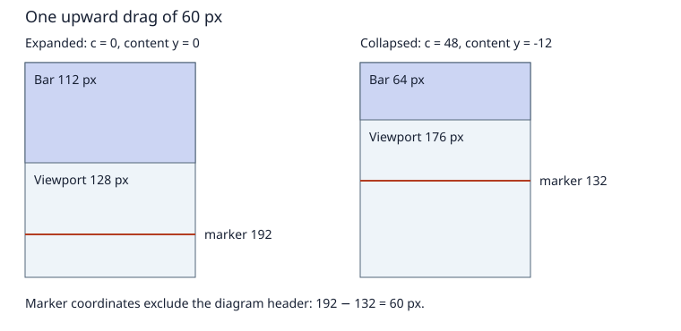

# App bar scroll behaviors

Status: implemented. All five implementation stages are complete. Validation results and resource limits are recorded below.

## Objective

Let an application choose an app-bar scroll behavior and connect it to a scrolling panel with one call, while preserving independent application callbacks and the library's low per-widget RAM cost.

## Motivation

A settings screen needs its top bar to change surface while content passes underneath. A longer equipment screen needs its large title to collapse, leaving more room for content. Today the application can implement the first effect by installing a position callback. The second requires coordinating input, content motion, bar layout, and animation. Applications should not each implement that coordination or surrender their position callback to the bar.

## Background

Project terminology follows the [design glossary](../glossary.md).

- [SimpleScrollablePanel](../../../src/roo_windows/containers/scrollable_panel.h) owns content motion, keyboard scrolling, scrollbar interaction, and a motion animation channel. `ScrollablePanel` currently aliases its blit-cache variant.
- [ScrollPosition](../../../src/roo_windows/core/scroll_position.h) reports the content origin excluding margins. Downward progress through content produces negative `y`; top overscroll can produce positive `y`.
- [WidgetEventDispatcher](../../../src/roo_windows/core/widget_event_dispatcher.h) stores the optional position callback outside the widget. Notifications carry previous and current positions. The virtual `onScrollPositionChanged()` hook remains available.
- [AppBar](../../../src/roo_windows/material3/app_bar/app_bar.h) has small, medium-flexible, and large-flexible variants, plus a flat/scrolled surface state. Before this change, flexible variants had expanded layouts without collapse transitions.
- [Scroll motion](../../../src/roo_windows/containers/scroll_motion_controller.h) includes drag resistance, fling, and spring-back. Before this change, panel layout called `update()`, whose programmatic scroll path cancels motion. That is incompatible with a viewport resizing on each collapse frame.
- [AnimationRegistry](../../../src/roo_windows/core/animation_registry.h) owns animation scheduling. Geometry and appearance are applied before painting; paint does not drive animation.

Compose exposes pinned, enter-always, and exit-until-collapsed behavior through a scroll behavior and nested-scroll connection. This proposal adopts that vocabulary and user interaction pattern, with explicit roo_windows contracts below; it does not promise identical Android physics. [Android app-bar documentation](https://developer.android.com/develop/ui/compose/components/app-bars)

## Requirements

1. Connecting a bar to a panel takes one call and no application subclass or callback replacement.
2. Support stationary surface changes, immediate expansion on reverse scrolling, and expansion only at the content's top.
3. Content and bar motion stay continuous through dragging, flinging, changing viewport height, and release settlement.
4. Ordinary position observers continue to receive actual content changes, including programmatic movement and layout correction.
5. Unconnected bars and panels incur no new instance fields. Optional state is paid for by connected screens. Connection dispatch and repeated drag/layout processing allocate no memory after initial layout. Existing glyph-paint allocations are outside this guarantee; see the measurements below.
6. Destroying, hiding, detaching, rebinding, or changing the geometry of either endpoint has defined behavior.
7. Existing scrolling, dialogs using the virtual hook, hit testing, and direct rendering remain correct.
8. Each implementation stage includes tests and consumer documentation or an example for its new functionality.

## Design Overview

A **scroll connection** is an application-owned object that participates before and after a panel consumes a scroll delta. It can consume part of that delta and observe committed positions. It is distinct from the existing callback, which observes positions but cannot consume input.

An **app-bar binding** is the Material implementation of that connection. It borrows one bar and one panel, retains the chosen policy and collapse state, and is owned by a sparse registry. It occupies no application callback slot.

The **collapse amount**, `c`, is a nonnegative pixel distance removed from the expanded bar height. Its maximum is `R`, the expanded-to-collapsed height difference. The binding retains `c`; the bar queries it for measurement and layout. No state is added to each AppBar.

The core owns registration and scroll dispatch. Material owns bar policy, geometry, and surface selection. A registry lookup supplies the connection to a panel, while a lookup by bar supplies its optional state. One binding per bar and one connection per panel are supported. This is enough for the demonstrated screen; ancestor traversal and connection chains are outside this scope.

Representative use, after adding the bar and panel to a vertical screen layout:

```cpp
using material3::AppBarScrollBehavior;

CHECK(app_bar.setScrollBehavior(
          scroller, AppBarScrollBehavior::kExitUntilCollapsed) ==
      ScrollConnectionStatus::kSuccess);

// This remains independent of the behavior connection.
scroller.setOnScrollPositionChanged(
    [this](ScrollPosition, ScrollPosition current) {
      back_to_top_.setVisibility(current.y < 0 ? Visibility::kVisible
                                              : Visibility::kGone);
    });
```

The connection meets input coordination and callback coexistence requirements. Sparse ownership meets RAM and lifecycle requirements. The existing layout and animation pipelines remain responsible for geometry and frame scheduling.

### Worked example

Take a medium bar without a subtitle: expanded height 112 px, compact height 64 px, and `R = 48`, at scale 1. Start at `c = 0`, content origin `y = 0`. An upward drag of 60 px first collapses the bar by 48 px, then scrolls content by 12 px. The final bar height is 64 px and `y = -12`.

A downward drag of 10 px with enter-always expands the bar to 74 px and leaves `y = -12`. With exit-until-collapsed it moves content to `y = -2` and keeps the bar compact. Another downward drag of 10 px first takes content to zero, then expands the bar by 8 px.



The diagram uses a 240 px screen height. The body viewport grows from 128 to 176 px. A marker initially at content coordinate 80 moves from screen coordinate 192 to 132: exactly the requested 60 px.

## Design Details

### Behavior and appearance

| Policy | Upward content gesture | Downward content gesture | Collapsed endpoint |
| --- | --- | --- | --- |
| Pinned | Content moves; surface follows position | Content moves; surface follows position | Expanded height |
| Enter always | Collapse bar first, then move content | Expand bar first, then move content | Compact height for flexible bars; zero visible height for small bars |
| Exit until collapsed | Collapse bar first, then move content | Move content to its top, then expand bar | Compact height |

A small bar with exit-until-collapsed has zero collapse range and behaves as pinned. SearchAppBar supports pinned and enter-always, with enter-always sliding the whole search app bar away. Exit-until-collapsed is rejected for SearchAppBar. Standalone SearchBar is outside scope.

A connected surface is scrolled when `c > 0` or the legal content origin is below zero. Top overscroll alone does not select the scrolled surface. Keep the existing binary surface tokens; interpolated colors are outside scope. While connected, behavior controls the effective surface. `setSurfaceState()` continues setting the underlying manual preference, which becomes visible again after disconnection. Do not overwrite that preference every frame.

Flexible bars keep their action row fixed. Interpolate the title anchor between the existing expanded title area and the compact title lane using `t = c / R`. Use expanded title typography for `t < 0.5` and compact title typography for `t >= 0.5`; this deliberate discrete switch avoids extra font rendering and opacity state. Show the subtitle only below that threshold. Measure both endpoint title geometries as needed and clip foreground to the current bar bounds. This is a first implementation contract, not a typography morph.

Small and search bars retain their full internal geometry and translate it upward by `c`, clipped to their shrinking visible bounds. Hidden controls cannot receive touches. A fully hidden bar occupies zero height without becoming `Gone`, so its binding can restore it.

Parents must honor the bar's measured height and give the body the remaining space. Support the existing vertical FlexLayout and Material scaffold arrangements; an externally fixed-height bar cannot collapse. Detect that mismatch after layout, warn once per binding, and use pinned geometry until constraints permit collapse. Honor parent bounds at every intermediate size.

### Input and consumption

Connection deltas use the same sign as content-origin movement. Pre-consumption and post-consumption must have the input sign and must not exceed the available magnitude. Validate this invariant in debug builds.

For each vertical drag or kinetic delta:

1. Offer the requested delta to the connection's pre-scroll hook.
2. Consume the remainder within legal content bounds, without applying overscroll resistance yet.
3. Offer the remaining delta to the post-scroll hook.
4. Apply existing resistance only to the remainder left after both participants reach their legal limits.
5. Publish actual content-position changes through one shared notification path.

Enter-always consumes both directions in pre-scroll, bounded by `[0, R]`. Exit-until-collapsed consumes upward motion in pre-scroll and downward remainder in post-scroll. Pinned consumes nothing. Horizontal movement remains entirely with the panel. A vertical or both-axis panel can bind; a horizontal-only panel cannot.

Eligibility must include the connection's remaining travel. Do not reject a drag solely because the content currently fits its viewport. Short content permits bar collapse and expansion; unused movement follows the existing panel overscroll policy.

Source classification is explicit: direct drag, kinetic motion, programmatic change, and geometry correction. Keyboard commands, scrollbar jumps, focus reveal, and `scrollTo*()` are programmatic. They move content without consuming distance in the bar; afterward, a zero-or-positive origin expands the bar, and a negative origin collapses it fully. Pinned stays fixed. This makes Home and back-to-top deterministic. A programmatic action cancels coordinated kinetic and settling motion.

Geometry corrections never masquerade as a reverse gesture. They clamp content and collapse state, update the surface, and report resulting content positions. Content replacement resets collapse to expanded and cancels motion; initial binding to an already scrolled panel uses the same policy as programmatic synchronization.

### Motion and layout

Keep a single kinetic timeline for a connected panel. Extract frame-to-frame displacement from the existing fling trajectory and route that displacement through the consumption sequence above. Do not launch independent flings for the bar and content or restart velocity when one reaches an endpoint. Keep the existing standalone motion path for unconnected panels.

Store the connected trajectory's previous sample in optional connection runtime state. Refactor the motion evaluator to expose displacement and remaining velocity without applying content bounds before connection dispatch. Spring-back starts only after connection consumption; spring samples affect content overscroll and do not expand or collapse the bar. A new touch cancels kinetic and settling motion once.

After kinetic motion ends, settle an intermediate collapse amount to its nearest endpoint; exactly halfway settles collapsed. Use a 150 ms cubic ease-out and the existing motion frame interval. Exit-until-collapsed can settle expanded only when content is at its top. No concurrent bar settlement and kinetic content fling are allowed. Settlement owns a bar animation channel and ends at an exact integer endpoint.

A connection-caused height change triggers a bounded layout update before computing the next content bounds. Rebase motion to the applied position while preserving trajectory time and velocity. Replace the current unconditional layout-time `update()` cancellation with a geometry reconciliation operation. External resize and theme changes also reconcile bounds; content replacement still cancels motion.

Each input/frame transaction performs at most one bar-height layout update and one subsequent content clamp. Avoid recursive layout from a position callback. During pre/post consumption, compute the panel's pending viewport extent from the height delta so bounds do not lag one frame. After layout, reconcile with the actual parent-resolved extent. Tests must cover both parent arrangements and verify the worked example's screen-space displacement.

The shared position notification path runs after geometry is committed: existing virtual hook, connection observation, then application callback. Emit once per distinct committed content change, with previous and current coordinates; a bar-only change emits no position callback. Preserve callback replacement/removal during delivery. Do not derive consumption by subtracting observer coordinates.

### Ownership and lifecycle

Add a lazy `ScrollConnectionRegistry` owned by ApplicationContext. It has two sparse maps, keyed by panel and visual-owner widget respectively, referencing the same stable connection record. The second map makes bar lookup and endpoint teardown direct, without scanning all registrations on every measurement. Core records use Widget pointers and virtual connection operations; core headers do not depend on Material.

Registration validates both endpoints before replacing anything. Endpoints must share a context. A panel already used by another bar returns `kAlreadyConnected`; rebinding the same bar releases its previous panel after validation succeeds. Repeating the identical binding is a successful no-op. Failed registration preserves the old binding.

Records use shared ownership during dispatch, as the existing scroll callback implementation does, so removal cannot destroy an executing callable. Shared ownership does not retain widgets. Destruction hooks remove endpoint entries before derived widget state is destroyed; Widget's general cleanup remains a fallback. Handle context destruction through the existing context lifetime mechanism. Rebinding and clearing during connection dispatch are rejected with `kBusy`; ordinary callback replacement remains supported. Widget moves with active connections disconnect rather than transferring borrowed derived-object identity.

Hiding or detaching either endpoint cancels kinetic and settlement tracks, clamps positions, and retains the binding and legal collapse amount. Reattachment resynchronizes geometry and surface without resuming old velocity. Destroying one endpoint disconnects both entries and cancels tracks. Restore expanded geometry and the manual surface on a surviving bar; a destroyed bar leaves the panel's legal content position intact. `clearScrollBehavior()` has the same restoration behavior.

### RAM and execution cost

No fields are added to AppBar, SearchAppBar, SimpleScrollablePanel, or Widget. ApplicationContext gains one lazy-registry pointer: typically 4 bytes on the ESP32 target, 8 on the host. An unused context allocates no registry.

The registry stores one shared `AppBarScrollConnection` in two indexes, keyed by
bar and panel. The connection itself stores endpoint pointers, dispatch depth,
raw drag coordinates, the last kinetic sample, input source, motion flags,
collapse amount and limit, behavior, and surface/constraint flags. This combines
the originally sketched record and derived state into one allocation. The
connection payload is 48 bytes on ESP32-C3 and 64 bytes on the host, excluding
the shared control block, indexes, presentation observation, and animation tracks.

Let `B` be live bindings, ordinarily 1–3 per context. Lookup is expected O(1),
worst-case O(B); registration can rehash. Index capacity is retained after removal.
A fresh host registration measured 8 allocations and 478 retained bytes,
including first registry creation and compact-font initialization. This is not
a per-binding target RAM figure; the original 80–128 byte total estimate omitted
shared registry/font/observer costs. An unused context allocates no registry.

Coordinated scrolling repeatedly measures its parent layout. FlexLayout formerly
allocated temporary vectors each time. Contexts with a scroll registry now keep
four reusable vectors per measured FlexLayout in a third registry index. These
hold measure/layout items and lines; they are initialized on first layout and
released when that layout is destroyed. This adds no FlexLayout instance field.
For `F` such layouts with `N` total child entries, retained scratch is O(F + N),
and grows when the tree grows. It remains cached after the last binding is
cleared. Contexts that never connect a bar keep the existing local-vector path.
Layout work remains proportional to the affected subtree. The compact title font
is initialized during attachment to avoid loading it on the first collapse frame.

Dispatch and repeated layout allocate nothing for an initialized, unchanged
widget tree. Starting animation tracks can allocate registry storage. Painting
text still creates existing roo_display glyph streams; this feature does not
make the entire rendering pipeline allocation-free.

## Proposed API

```cpp
namespace roo_windows {

enum class ScrollConnectionStatus : uint8_t {
  kSuccess,
  kDifferentContext,
  kUnsupportedAxis,
  kUnsupportedBehavior,
  kAlreadyConnected,
  kBusy,
};

enum class ScrollSource : uint8_t {
  kDrag, kKinetic, kProgrammatic, kGeometry,
};

// Core internal interface. Registration is initially exposed through app bars.
// Event arguments include the source panel and legal content bounds.
class ScrollConnection {
 public:
  virtual ~ScrollConnection() = default;
  virtual YDim onPreScroll(const ScrollEvent& event, YDim available) = 0;
  virtual YDim onPostScroll(const ScrollEvent& event, YDim consumed,
                           YDim available) = 0;
  virtual void onPositionChanged(const ScrollPositionEvent& event) = 0;
  virtual void onScrollFinished(const ScrollEvent& event) = 0;
};

namespace material3 {
enum class AppBarScrollBehavior : uint8_t {
  kPinned, kEnterAlways, kExitUntilCollapsed,
};

// Added to AppBar and SearchAppBar; no additional widget fields.
ScrollConnectionStatus setScrollBehavior(SimpleScrollablePanel& panel,
                                        AppBarScrollBehavior behavior);
ScrollConnectionStatus clearScrollBehavior();
bool hasScrollBehavior() const;
}  // namespace material3
}  // namespace roo_windows
```

The interface sketch describes responsibilities; implement event value types alongside the core connection header, with borrowed references valid only during dispatch. Include previous/current origins in position events and the source reason. Keep lifecycle and geometry reconciliation entry points internal to the registry. No public consumer-owned connection lifetime API is introduced in this scope.

Retain `SimpleScrollablePanel::ScrollPosition` as an alias and retain `setOnScrollPositionChanged()` unchanged. Callers do not need the core interface for ordinary observation.

Phase 2 exposes the final behavior enum with pinned implemented. Other values return `kUnsupportedBehavior` without changing an existing binding until their implementation phase lands. No silent pinned fallback for an unimplemented behavior.

## Implementation Plan

Authoring references: [C++ instructions](../../../.github/instructions/general-cpp-code-authoring-instructions.md), [widget instructions](../../../.github/instructions/roo-windows-widget-authoring.instructions.md), and [example instructions](../../../.github/instructions/embedded-example-authoring.instructions.md).

Work in the canonical roo_windows repository, inspect its Git state, and preserve unrelated edits. Use that repository's Bazel setup. These are sequential commits; a separate agent can implement the stages in order without the conversation. Do not commit unless separately requested. Update this document's status/index as stages land.

### Phase 1 — Sparse connection ownership

Add lazy registry ownership, stable records, validation, and teardown hooks. Preserve the existing callback map. Add synthetic-connection tests for both endpoint destruction orders, context destruction, moves, callback coexistence, registration failure, and removal during dispatch. Add a target resource probe comparing base widget sizes and context size before/after; zero widget-size growth and at most one context pointer are required. Record actual binding sizes and allocation counts. A binding payload exceeding the 128-byte planning range must be explained and reduced before this phase completes; active animation storage is measured separately.

Proposed commit message: **App bar scroll behaviors phase 1: add sparse scroll connection ownership.**

Add application-owned connections with endpoint cleanup and resource tests while preserving independent position callbacks.

Validation: new `scroll_connection_test` and resource target, plus `roo_windows_test`. Document the internal ownership API in its header.

### Phase 2 — Pinned behavior and consumer API

Implement registration APIs on AppBar and SearchAppBar, initial synchronization, effective surface selection, and restoration of the manual preference. Route actual position observations through the shared notification path. Convert the flexible-top-bar example from its callback setter to pinned behavior, keeping an independent application callback in a focused test.

Proposed commit message: **App bar scroll behaviors phase 2: connect pinned app bars to panels.**

Add one-call pinned behavior, surface synchronization, and a runnable example without occupying the application callback slot.

Validation: app-bar behavior tests, existing app-bar and search-bar tests, and the modified example build. Cover pre-scrolled attachment, clearing, rebinding, empty content, and top overscroll.

### Phase 3 — Scroll consumption and continuous motion

Introduce pre/post consumption and source-aware transactions. Refactor connected kinetic evaluation to emit displacement; separate geometry reconciliation from programmatic cancellation. Include connection travel in drag eligibility. Test with synthetic consumers before adding moving Material policies.

Proposed commit message: **App bar scroll behaviors phase 3: coordinate scroll consumption and viewport changes.**

Route drag and fling deltas through a connection while preserving motion across layout and retaining final-position notifications.

Validation: `scroll_motion_controller_test`, `scrollable_panel_animation_test`, and new connection tests. Check signed conservation, endpoint crossing within a frame, short content, both axes, overscroll, keyboard/scrollbar sources, and callback counts. Add worked transaction examples to the core header documentation.

### Phase 4 — Collapsing geometry and enter-always behavior

Implement flexible title transitions and clipped translation for small/search bars. Add bar settlement through AnimationRegistry. Support the existing FlexLayout and scaffold body layouts. Add an enter-always example and its leaf Bazel target, plus build coverage in `examples/BUILD`.

Proposed commit message: **App bar scroll behaviors phase 4: add enter-always app-bar motion.**

Apply compact and hidden bar geometry through coordinated scrolling, with settlement, hit testing, and visual coverage.

Validation: new behavior and geometry tests, app-bar golden tests, animation registry tests, and example build. Golden cases cover expanded, midpoint, and collapsed bars, all title alignments, subtitles, and tiny widths. Verify the worked example numerically and test fixed-height fallback.

### Phase 5 — Exit-until-collapsed behavior and completion

Implement post-scroll expansion at the content top and the small-bar pinned degeneration. Add a focused exit-until-collapsed example with its build target. Finish lifecycle integration tests across both moving policies and record measured resources and validation commands in this document.

Proposed commit message: **App bar scroll behaviors phase 5: add expansion at the content boundary.**

Complete exit-until-collapsed behavior and validate lifecycle, geometry, and callback compatibility across the supported app-bar family.

Validation: behavior tests, both new examples, `material3_dialog_test`, and relevant focus-reveal and scaffold tests. Confirm no connection dispatch or repeated drag/layout allocations, no lost fling velocity during collapse, and no animation track remaining after settlement. Mark the design implemented only after all requirements pass.

## Testing Plan

Use deterministic host tests for consumption, trajectories, state transitions, lifetime, and observer semantics. Use existing rendering fixtures and golden infrastructure for geometry, clipping, exposed-background invalidation, and touch bounds. Add focused test targets to the root BUILD and runnable examples under `examples/material3/app_bar/`.

Relevant existing targets include `//:roo_windows_test`, `//:scroll_motion_controller_test`, `//:scrollable_panel_animation_test`, `//:animation_registry_test`, `//:material3_app_bar_test`, `//:material3_app_bar_golden_test`, and `//:material3_dialog_test`. Run narrow targets per phase; run the combined affected set at completion. Use `--config=asan` for endpoint lifecycle tests. Format changed C++ with the repository configuration.

Run target resource probes for instance-size and allocation guarantees; host pointer sizes are not ESP32 measurements. Build each example with its leaf target. Manually exercise a long and short body on the emulator and a target display, checking reversals, partially collapsed release, fast fling, and touch access to compact controls. Record unperformed hardware checks explicitly.

## Caveats

Implementation and focused commits were authorized after review. Implementation must preserve unrelated repository changes and obey sandbox requirements for the canonical source repository.

The behavior names follow Compose, but typography switches discretely, surface selection remains binary, and settlement uses the fixed rule above. This keeps the first implementation bounded and testable. The largest engineering risk is coordinated layout and fling evaluation; phase 3 isolates it before Material geometry depends on it.

### Rejected Alternatives

#### Implement every behavior through the position callback

This is small and works for pinned appearance, but observes movement too late to divide input at boundaries. It also loses direction information when geometry clamps positions. The consumption contract in Design Details addresses those failures.

#### Install the behavior in the application's callback slot

This reuses existing storage but prevents independent observers and makes later setter calls silently break the behavior. The separate binding leaves that API useful.

#### Store policy and callback fields in every widget

Direct access saves a hash lookup. It charges every ordinary bar and scroller for an optional feature. The sparse registry accepts lookup and registered-binding overhead to meet the zero base-widget growth requirement.

#### Require a special app-bar subclass or a new screen container

A subclass makes optional state explicit, and a dedicated container simplifies geometry ownership. Both force applications to replace existing widget/layout composition for this common behavior. Sparse state plus supported existing parent layouts preserves the one-call integration; fixed-height constraints have an explicit fallback.

#### Implement general nested-scroll chains immediately

Chains support multiple ancestors and nested consumers, but require ordering, velocity propagation, and lifetime rules not needed by one bar and one panel. The initial single connection is deliberately internal, leaving room to generalize after a concrete second consumer exists.

## Future Work

General nested-scroll chains, multiple bars following one panel, public custom connections, continuous typography/color interpolation, velocity-directed snapping, animated programmatic scroll coordination, and saved/restored collapse state are outside this scope.

## Implementation measurements and validation

The ESP32-C3 ABI probe uses C++17 with exceptions and RTTI disabled:

| Type | Before | After |
| --- | ---: | ---: |
| Widget | 24 | 24 |
| SimpleScrollablePanel | 168 | 168 |
| AppBar | 148 | 148 |
| SearchAppBar | 204 | 204 |
| ApplicationContext | 208 | 216 |
| AppBarScrollConnection | absent | 48 |

Sizes are bytes. Context growth is one 4-byte pointer plus 4 bytes of alignment
padding, an explicit exception to the original one-pointer total-size estimate.
The host resource tests measure initial registration and verify zero allocations
in 1,000 dispatch iterations and repeated drag/layout operations under both
LayoutScaffold and FlexLayout. Full repaint was measured separately: the
nine-character title allocates nine existing glyph streams per frame.

Reproduce the ABI and object-code probes with:

```sh
python3 tools/scroll_connection_size_probe.py \
  --compiler ~/.platformio/packages/toolchain-riscv32-esp/bin/riscv32-esp-elf-g++ \
  --library-root ~/Documents/Arduino/roo \
  --output /tmp/scroll_sizes.o --code-size
```

For a pre-change archive, add `--source-root /path/to/archive`. The selected
objects (connection, context, widget, panel, FlexLayout, app bar and Material
behavior) total 72,969 text bytes with `-Os`, versus 54,271 before: +18,698.
This includes template instantiations before linker deduplication/dead stripping,
and parsing-only benchmark platform/logging stubs. It is an object-code cost
indicator, not a linked firmware-size delta.

Validation from the canonical library repository:

```sh
bazel test //:scroll_connection_test //:app_bar_scroll_behavior_test \
  //:scroll_connection_resource_test //:roo_windows_test \
  //:scroll_motion_controller_test //:scrollable_panel_animation_test \
  //:animation_registry_test //:material3_dialog_test \
  //:material3_layout_scaffold_test //:text_field_keyboard_avoidance_test \
  //:flex_layout_test --test_output=errors
bazel test --config=asan //:scroll_connection_test \
  //:app_bar_scroll_behavior_test //:flex_layout_test --test_output=errors
bazel build //examples/material3/app_bar/basic_top_bar:basic_top_bar \
  //examples/material3/app_bar/enter_always:enter_always \
  //examples/material3/app_bar/exit_until_collapsed:exit_until_collapsed
```

The eleven focused/regression targets and all three AddressSanitizer targets pass. All three example targets build. New expanded, midpoint and collapsed
render goldens pass. Existing `material3_app_bar_test` and
`material3_app_bar_golden_test` also ran: their flat-surface expectations conflict
with the independently committed SurfaceBright theme change; their expectations
and existing goldens were preserved. The behavior suite covers conservation,
reverse input, kinetic continuation and exact spring endpoints, release settling,
programmatic reset, fixed constraints, search/small variants, callback coexistence,
reentrant binding rejection, hide/clear/replacement, and registration lifetimes.
Physical-display and interactive emulator gesture checks remain unperformed.
