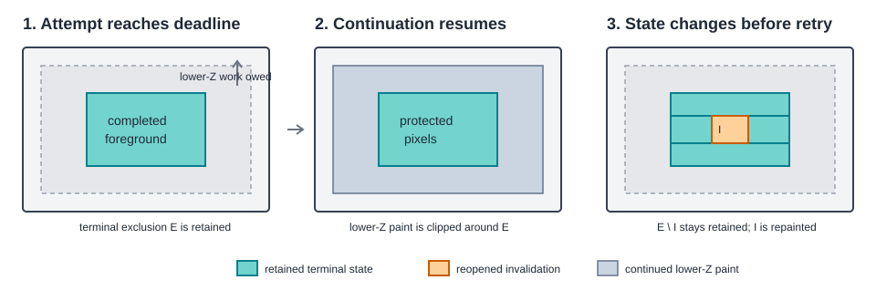

# Roo Windows Interrupted Paint Continuation Design

## Implementation status

**Implemented.** This is a retroactive design for the deadline-interruption
handling present in the current source tree. It documents the decisions and
invariants behind an implementation distributed across the application loop,
root window, widget traversal, invalidation propagation, and clipper storage.
Dependency status is recorded in the [status index](../README.md).

Because the implementation is complete, this document omits an implementation
plan and links the implemented code and regression coverage directly.

## Objective

Make a deadline-limited refresh a truly incremental continuation of one
logical paint. Completed foreground work remains protected across attempts,
while a state change between attempts reopens a conservative bound around the
affected geometry and widget subtrees.

## Motivation

Paint deadlines bound the amount of rendering work performed in one
application-loop iteration. Yielding an unfinished paint lets the application
service user events promptly and target a higher frame rate instead of getting
stuck in one slow traversal. This is especially important when a display is
slow or a widget tree cannot be rendered within the desired frame interval.

That scheduling strategy works only when each attempt makes forward progress
without corrupting completed output. The default minimum refresh budget in
[`Application`](../../../src/roo_windows/core/application.cpp) is 200 ms, but a
slow-rendering widget or a large refresh region sent to a slow SPI display can
still exceed it. In the original failure, a navigation destination was drawn,
then erased by later parent-surface paint, and remained erased. The widget was
clean on the retry, but the exclusion that had protected its pixels belonged
to the discarded clipper instance.

Restarting the entire interrupted redraw fixed the erased pixels but destroyed
incrementality: every retry revisited already-completed slow widgets and
allowed the same prefix to repeat indefinitely. In that state, short deadlines
made the application yield often but did not help it finish frames. Retaining
completed paint state and selectively invalidating it turns each bounded paint
attempt into useful progress, preserving both responsiveness and eventual
frame completion.

## Background

Roo Windows paints directly to the display without a full-frame backing
buffer. Widget traversal runs from foreground to background. After a widget
finishes, it publishes terminal paint state to the
[`Clipper`](../../../src/roo_windows/core/clipper.h):

- an exclusion prevents later, lower-Z drawing from overwriting pixels whose
  final direct color is already present; and
- an overlay or decoration is composited above later drawing.

This write-once ordering is described more generally by the
[paint context design](paint_context_design.md). It means dirty flags alone are
not enough to resume a partial traversal. A clean foreground widget is skipped
on retry, so its previously published exclusion and overlay state must still
exist.

This design uses the following terms:

| Term | Meaning |
| --- | --- |
| Logical paint | A sequence that starts with fresh clipper state, shares one animation-time sample, incorporates later mutations through declared invalidations, and ends after a complete refresh. |
| Paint attempt | One deadline-bounded call that performs part or all of a logical paint. |
| Continuation | A later attempt that resumes a logical paint after its deadline was exceeded. |
| Terminal paint state | Exclusions, overlays, and decorations published only after a widget paint scope has completed. |
| Reopen | Remove retained terminal state in invalidated geometry and mark the intersecting widget subtree for repaint. |

## Requirements

### Correctness requirements

1. A completed logical paint produces the same visible result as an
   uninterrupted paint of the final widget state, provided widgets report the
   bounds affected by each mutation.
2. A completed widget remains protected from lower-Z paint on every retry.
3. A widget that did not finish publishes no exclusion, overlay, or decoration
   claiming that its pixels are final.
4. A state change between attempts preserves retained state outside a
   conservative bound around the geometry that can change.
5. A continuation observes one click-animation time sample. Animation
   progression, semantic click settlement, and presentation-pin bounds commit
   only at logical-paint boundaries.
6. Actual paint interruption is represented explicitly. Dirty state and an
   expired deadline are not used as substitutes.

### Incrementality requirements

1. A clean completed widget is not repainted on a retry unless a later
   invalidation intersects it.
2. A newly invalidated rectangle follows the existing parent propagation path
   once. `Widget::setDirty()` does not perform a second root lookup.
3. Each container accumulates invalidation for its own surface but propagates
   only the newly supplied rectangle to descendants.
4. Pending redraw scope survives a timeout and includes invalidations raised
   while the logical paint is unfinished.

### Embedded requirements

1. The design uses neither a framebuffer nor a second persistent copy of the
   clipper vectors.
2. Clipper buffers retain their allocation across ordinary paints and
   continuations.
3. Selective invalidation can use a temporary vector inside the invalidation
   call, but repeated paints do not allocate and immediately discard the
   persistent working buffers.
4. Deadline checks stop traversal at widget boundaries. A leaf paint that has
   started is allowed to finish and publish terminal state.

## Design Overview

One logical paint consists of one or more paint attempts. The root-owned
[`ClipperState`](../../../src/roo_windows/core/clipper.h) outlives those
attempts. A fresh attempt clears its contents while retaining vector capacity;
a continuation keeps the exclusions and overlay descriptors published by the
completed foreground prefix.

When traversal reaches the deadline, an explicit interruption flag propagates
up the active widget call stack. Widgets that completed before the flag was set
have already published terminal state. The interrupted widget and its active
ancestors do not publish terminal state while unwinding. On retry, clean
completed widgets are skipped, and their retained exclusions protect them as
the unfinished lower-Z traversal continues.

If application state changes between attempts, the root records the changed
device-space bounds. Before the next attempt it subtracts those bounds from
retained exclusions and overlay clips, then invalidates only intersecting
descendants. Retained state outside the changed bounds continues to protect
completed output.



The logical-paint lifecycle is:

```text
fresh attempt
  -> clear retained contents, keep allocations
  -> sample animation frame time
  -> paint foreground to background

deadline exceeded
  -> retain completed terminal state
  -> retain pending redraw bounds
  -> freeze animation advancement
  -> return incomplete

continuation
  -> reopen state changed between attempts
  -> resume with retained exclusions and overlays
  -> repeat until complete

complete
  -> commit presentation-pin bounds
  -> settle the click-animation refresh
  -> allow the next logical frame to advance
```

## Design Details

### Cross-file ownership

| Area | Responsibility |
| --- | --- |
| [`Application`](../../../src/roo_windows/core/application.cpp) | Does not tick or resample click animation during a continuation; reports refresh completion only after the drawing context closes. |
| [`ApplicationContext`](../../../src/roo_windows/core/application_context.h) | Exposes the root's one-bit continuation state so normal dirty propagation does not stop at an already-dirty ancestor. |
| [`MainWindow`](../../../src/roo_windows/core/main_window.cpp) | Owns continuation state, retained clipper storage, pending redraw bounds, and the bounds of mutations that must reopen retained state. |
| [`ClipperState` and `Clipper`](../../../src/roo_windows/core/clipper.h) | Retain terminal paint state, selectively subtract invalidated geometry, rebuild per-attempt filters, and carry the explicit interruption signal. |
| [`PaintContext`](../../../src/roo_windows/core/paint_context.cpp) | Gives widget and container paint code a narrow path to report actual interruption. |
| [`Widget`](../../../src/roo_windows/core/widget.cpp) | Treats a leaf paint as atomic and publishes generic decoration and direct-paint exclusion only when the active paint stack was not interrupted. |
| [`Container`](../../../src/roo_windows/core/container.cpp) | Stops between children, marks interrupted traversal, preserves its unfinished surface invalidation, and reopens descendants by the new invalidation delta. |
| [`BlitCacheContainer`](../../../src/roo_windows/containers/blit_cache_container.cpp) | Invalidates an incomplete cache using the explicit interruption signal instead of inferring interruption from the clock. |

### Completion frontier and explicit interruption

`Clipper::isDeadlineExceeded()` and `Clipper::wasPaintInterrupted()` answer
different questions:

- deadline exceeded means the attempt must yield; and
- paint interrupted means a widget or container stopped before completing its
  current paint obligation.

`Widget::paintWidgetContents()` checks the deadline before starting a leaf. If
the deadline has already elapsed, it calls
`PaintContext::markPaintInterrupted()` and returns without painting.
`Container::paintWidgetContents()` checks again after child traversal. When
children stopped at the deadline, it restores its dirty and invalidated state,
marks the attempt interrupted, and defers its surface paint.

The interruption flag is monotonic for one attempt. Because foreground
children publish their terminal state before traversal advances, entries
created before the flag are a completed prefix. Once the flag is set,
`Widget::paintWidget()` suppresses decoration and direct-exclusion publication
for the interrupted scope and every ancestor that is still unwinding.

Dirty state is deliberately independent. An animating widget can finish its
current paint and immediately remain dirty for the next frame. That widget
must publish terminal state for the frame it just drew. Conversely, checking
the clock after a leaf finishes does not make that completed leaf interrupted.
The root still yields the attempt, but the leaf's valid terminal state is
retained.

The same signal protects click animation. A final click frame provisionally
clears the clicking state; if its enclosing paint is interrupted, the state is
restored so the controller cannot retire a frame that was not fully emitted.

### Retained clipper state

`MainWindow` owns one `ClipperState`. Constructing `ClipperOutput` for a fresh
logical paint clears exclusions, overlays, decorations, and overlay shapes.
Constructing it with `resume = true` keeps those entries. Both paths clear
attempt-local scratch: bounded exclusions and the overlay-spec call stack.

Retained overlay descriptors reference raster sources. Decorations and smooth
shapes therefore live in deques so their addresses remain stable, and the
press-overlay object lives in `ClipperState` rather than in the short-lived
`ClipperOutput`. `ClipperOutput::sync()` rebuilds its transient filter stack
from the retained descriptors whenever output bounds or retained state change.

Only terminal state survives. The canvas, active overlay-spec stack, bounded
exclusion cache, and display filter chain are reconstructed for every attempt.

### Redraw bounds and changed-state bounds

The root tracks two different regions:

- `redraw_bounds_` is the complete output area still owed by the logical
  paint; and
- `continuation_invalid_bounds_` is the area whose retained terminal state
  became stale after an attempt returned incomplete.

On timeout, `redraw_bounds_` becomes the union of the attempt's original redraw
bounds and invalidations collected during the attempt. Replacing it with only
the old bounds would lose new work; replacing it with only new work would lose
unfinished work.

The UI loop is single-threaded. External event processing resumes after the
attempt has set the continuation flag, so any state-changing invalidation
between attempts is collected in `continuation_invalid_bounds_`. Before retry,
`MainWindow` passes that region to both `ClipperState::invalidate()` and
`invalidateDescending()`.

### Propagating invalidation without another tree walk

Containers normally stop propagating a dirty rectangle when they are already
dirty and their invalid region contains it. During a continuation that shortcut
would hide the precise new rectangle from `MainWindow`, whose ancestors are
still dirty from unfinished work.

`ApplicationContext::hasPaintContinuation()` disables only that early return.
The rectangle then follows the ordinary recursive `setDirty()` propagation to
the root in one $O(d)$ walk for tree depth $d$. `Widget::setDirty()` does not
call `getMainWindow()`, avoiding a second ancestry walk at every level.

`MainWindow::propagateDirty()` and `MainWindow::childInvalidatedRegion()` both
union their root-space rectangles into `continuation_invalid_bounds_`. The two
entry points cover dirty propagation and explicit invalidated-region
notification without introducing a root-specific path in `Widget`.

### Reopening only newly invalidated descendants

`Container::invalidateDescending(rect)` has two responsibilities:

1. union `rect` into the container's `invalid_region_`, because the
   container's own surface still owes every accumulated invalid area; and
2. intersect the newly supplied `rect` with each child's maximum parent bounds
   and recurse with that intersection in child coordinates.

The recursion intentionally uses `rect`, not the updated `invalid_region_`.
Older invalidations were propagated when they arrived. Descending with their
union again would re-dirty completed siblings and turn a small mid-continuation
change into a large restart.

### Subtracting invalidated geometry

For each retained exclusion rectangle $E$, `ClipperState::invalidate(I)` keeps
$E \setminus I$ as at most four non-overlapping rectangles: above, below,
left, and right of the intersection. Empty fragments are omitted.

Overlay descriptors use the same subtraction on their device clip. A
descriptor whose raster extents do not intersect the invalidation is copied
unchanged. An intersecting descriptor is rebuilt for every non-empty retained
clip fragment with the original raster pointer, translation, and blending
mode. The owned decoration or shape remains in stable storage until the
logical paint ends.

Fragment production uses a callback rather than allocating a fragment vector
for every retained entry.

### Allocation policy

Exclusion and overlay vectors are persistent because their capacity is useful
across paints. Selective invalidation rebuilds each vector in a temporary
buffer reserved to twice the current element count. One central subtraction
can produce four fragments per source entry; reserving four times every time
would preallocate the geometric worst case. A two-times reserve provides
headroom without permanently paying that worst-case RAM cost, and the vector
grows normally when the actual result is larger.

`replacePreservingAllocation()` then applies this policy:

- when the rebuilt result fits the persistent vector's capacity, clear the
  persistent vector and move the elements back, retaining its allocation; or
- when the result is larger, swap in the temporary vector so the new
  high-water allocation becomes the persistent buffer.

The temporary vector and whichever smaller allocation it owns are released at
the end of the invalidation call. This avoids permanent double buffering while
also avoiding allocation churn at the stable high-water mark.

### Animation and refresh settlement

The [click-animation lifecycle](click_animation_lifecycle_design.md) defines a
completed refresh as a semantic boundary. A continuation is not another
logical animation frame:

- `Application::tick()` does not advance click animation while a continuation
  exists;
- `Application::refresh()` does not resample frame time on retries; and
- `notifyRefreshCompleted()` runs only after the logical paint completes and
  its `DrawingContext` has closed.

Presentation pins follow the same transaction boundary. Their candidate
bounds are prepared before an attempt, but `commitPresentationPinBounds()` runs
only after success.

## Proposed API

There is no new public widget-authoring API. The implemented framework-facing
surface is intentionally small:

```cpp
Clipper(ClipperState& state, DisplayOutput& out, Uptime deadline,
        bool resume = false);

void ClipperState::invalidate(const Box& bounds);

void Clipper::markPaintInterrupted();
bool Clipper::wasPaintInterrupted() const;

void PaintContext::markPaintInterrupted() const;

bool ApplicationContext::hasPaintContinuation() const;
bool MainWindow::hasPaintContinuation() const;
```

`MainWindow` alone mutates application continuation state. Widgets and
containers report interruption through `PaintContext`; they do not control the
root lifecycle directly.

## Testing Plan

The regression scope is split by abstraction:

- [`paint_context_test.cpp`](../../../test/paint_context_test.cpp) contains
  `RetainedStateReopensOnlyInvalidatedExclusionPixels` and
  `RetainedStateReopensOnlyInvalidatedOverlayPixels`, which verify rectangle
  splitting and retained-overlay composition directly.
- [`roo_windows_test.cpp`](../../../test/roo_windows_test.cpp) contains
  `DeadlineRetryPreservesCompletedChildrenAndReopensInvalidations` and
  `CompletedDirtyWidgetPublishesTerminalStateBeforeTimeout`, which exercise
  repeated `Application::refresh()` calls, progress across multiple timeouts,
  selective mutation, and the distinction between dirty and interrupted.
- Existing overlay and navigation component suites remain part of validation
  because the implementation preserves their animation-frame and composition
  boundaries across retries.
- The
  [`navigation_rail.ino`](../../../examples/material3/navigation_rail/navigation_rail.ino)
  short-deadline reproduction checks the original disappearing-destination
  behavior on the target display path.

The focused Bazel validation targets are `//:paint_context_test` and
`//:roo_windows_test`. Integration validation includes `//:overlay_test`,
`//:application_test`, and `//:material3_navigation_rail_test`. Rendering
changes also require the relevant golden target.

## Caveats

### One changed-state bounding rectangle

`continuation_invalid_bounds_` is one `Rect`. Multiple disjoint invalidations
therefore reopen their bounding envelope, including unchanged pixels between
them. This is a deliberate RAM and complexity tradeoff: correctness is
preserved, and a typical animation or interaction contributes one compact
region.

### Deadline granularity

The deadline is advisory at leaf-widget granularity. The framework does not
roll back pixels written by a leaf that starts before the deadline and finishes
after it. That leaf is considered complete; traversal yields at the next
boundary. Long-running leaf paint remains a widget-level performance problem.

### Retained arena lifetime

Invalidating an overlay clip removes or splits its descriptor, but its owned
decoration or shape stays in stable deque storage until the logical paint
finishes. Repeated invalidation during one unusually long continuation can
increase this temporary retained arena. The next fresh logical paint clears
it.

### Rejected Alternatives

#### Recreate clipper state on every attempt

This loses the terminal state of clean foreground widgets. Lower-Z parent
surfaces can then erase their pixels, which caused the original navigation-rail
failure.

#### Restart the entire redraw after every timeout

Re-dirtying the interrupted redraw bounds restores correctness but revisits
every completed slow widget. Repeated deadlines can execute the same prefix
forever, so this is not incremental progress.

#### Treat dirty or deadline-exceeded as interrupted

Dirty means future repaint obligation, not failure to finish the current
paint. Animating widgets legitimately complete and remain dirty. Likewise, a
leaf can complete after the deadline crosses. Both proxies suppress valid
terminal state and cause unnecessary redraw.

#### Find `MainWindow` from every `Widget::setDirty()`

Calling `getMainWindow()` in addition to normal parent propagation adds an
ancestry walk at each propagation level and risks $O(d^2)$ work. The one-bit
state in `ApplicationContext` lets the existing $O(d)$ path reach the root.

#### Discard all retained state after any invalidation

This is correct but reopens the entire unfinished redraw for a small mutation.
Rectangle subtraction preserves incrementality outside the changed geometry.

#### Keep two persistent clipper buffers

Permanent current/next vectors make replacement cheap but reserve close to
twice the high-water RAM for exclusions and overlay descriptors. Temporary
rebuild buffers plus copy-or-swap retain allocation where useful without that
persistent footprint.
