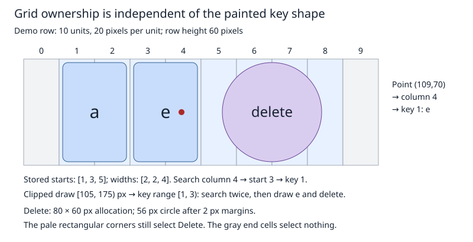

# Compact keyboard layouts and long-press alternatives

Status: Implemented. Phases 1–6 are complete. Host tests and ESP32-C3 firmware
builds pass; physical touchscreen acceptance remains manual. See the
[acceptance report](../../keyboard_layout_acceptance.md) for measurements and limits.

Implementation adjustment: AOSP Polish has nine alternatives for `a`; version 1
accepts nine alternatives (ten choices including the base). Static C++ entry
points use `Open()` to follow repository naming rules.

## Objective

Provide compact, generated keyboard layouts with efficient coordinate lookup,
round special keys, and long-press letter alternatives.

## Motivation

On a small touchscreen, holding `e` should let the user select `é` without
switching away from the alphabet. Authors should be able to declare that behavior,
and a round Enter key, in a readable layout file. Today those features require
changes to C++ tables and keyboard behavior. The tables also repeat geometry and
function information for uppercase letters, while finding a touched key walks
through the row.

## Background

Before this design, the layout types formed a pointer hierarchy: keyboard → pages → rows → keys. A page is a keyboard
screen, such as letters or symbols. Rows use integer horizontal grid units;
ordinary English letter keys occupy two units, allowing a one-unit stagger.
Each row has lowercase and uppercase key arrays. Some rows already share those
arrays when case makes no difference.

The original US layout (retained in Git history) had three
20-unit, four-row pages and 101 displayed key positions. Its uppercase arrays
add 28 records. On a conventional 32-bit ABI, `KeySpec` occupies 12 bytes, including
padding; a row occupies 16 bytes. These are ABI estimates, to be measured in the
implementation, not claims that all those bytes occupy writable RAM.

The [keyboard renderer](../../../src/roo_windows/activities/keyboard.cpp) already
uses one surface widget, borrowed immutable tables, and no per-key geometry cache.
`findKey()` scans widths in the selected row; `keyBounds(row, key)` repeats a
prefix sum. Painting walks keys once. Text delivery uses
[`TextInputEmitter::commitRune()`](../../../src/roo_windows/core/text_input.h),
which accepts one Unicode scalar. Shift, delete repeat, page switching, and an
active-only key preview already exist.

The relevant precedent in `roo_display` is the binary format described at the top
of [smooth_font_v2.cpp](../../../../roo_display/src/roo_display/font/smooth_font_v2.cpp)
in the sibling library: explicitly sized fields, blob-relative offsets, and separate index
and payload sections. Its font-specific compression and cached character map
are not needed here. This proposal borrows the format approach, not its reader.

The [design glossary](../glossary.md) supplies shared window and presentation
terminology. A [presentation pin](../../../src/roo_windows/core/presentation_pin.h)
is paint-only: the keyboard's existing preview uses one and retains input in the
keyboard. The [gesture detector](../../../src/roo_windows/core/gesture_detector.cpp)
retains a long-press target through release, but currently provides no callback
for movement during that phase.

## Requirements

1. Store immutable layouts compactly in flash, without pointers or ABI padding
   inside serialized data, runtime JSON parsing, or per-key RAM allocations.
2. Find the row in O(1) and the key within it in worst-case O(log N), where N
   is the number of keys in that row. Recover a known key's bounds in O(1).
   Include staggered rows, unequal widths, gaps, and out-of-bounds coordinates.
   Clipped drawing must locate a range once per row, then iterate its keys.
3. Let authors give special keys circular appearance, with defined touch behavior.
4. Let a text key expose ordered, case-aware diacritic alternatives on long press;
   sliding selects an alternative and release commits exactly one character.
5. Preserve existing keyboard actions, semantic text delivery, and lifecycle-safe
   cancellation. Existing layouts retain their appearance unless explicitly edited.
6. Provide readable JSON input, deterministic generated C++ assets, clear validation
   errors, and a documented migration for custom C++ layouts.

## Design Overview

A **layout blob** is an immutable, versioned byte array shared by all keyboards
using that layout. A **layout view** borrows that array and reads its records;
it neither copies the layout nor owns its lifetime.

A **key record** stores one key's horizontal start, width, appearance, action,
lowercase value, uppercase value, and optional alternative-list offset. Both cases
share geometry. Starts are prefix sums calculated by the generator.

Keys are stored in increasing start order, without overlap. Binary search over
those starts finds the key preceding a coordinate; a width check rejects gaps.
Typical rows contain 5–10 keys, requiring at most 3–4 search comparisons. Storing
starts also lets painting recover each key rectangle directly, without searching
or summing earlier widths. No separate coordinate-to-key table is stored.

An **alternative list** is an ordered list of lowercase/uppercase scalar pairs
attached to a text key. The **alternative popup** is temporary visual state for
one held key. It paints through a presentation pin; the keyboard remains the
single gesture owner. No widget tree is built for its choices.

Together, byte records remove padding and duplicated case geometry, ordered starts
provide efficient lookup, an appearance flag controls circles, and alternative
lists supply long-press content. A build-time Python generator turns JSON into
these structures. Firmware needs only a small reader and the existing renderer.

### Worked authoring example

This complete, deliberately small layout exercises unequal widths, staggering,
a round action, and accents without burying them in a full QWERTY keyboard:

```json
{
  "format": 1,
  "name": "accent_demo",
  "pages": [
    {
      "id": "letters",
      "width": 10,
      "rows": [
        {
          "offset": 1,
          "keys": [
            {"text": "a", "upper": "A", "width": 2},
            {"text": "e", "upper": "E", "width": 2,
             "alternatives": [
               {"text": "é", "upper": "É"},
               {"text": "è", "upper": "È"},
               {"text": "ę", "upper": "Ę"}
             ]},
            {"action": "delete", "width": 4, "shape": "circle"}
          ]
        },
        {
          "keys": [
            {"action": "shift", "width": 2, "shape": "circle"},
            {"action": "space", "width": 6},
            {"action": "enter", "width": 2, "shape": "circle"}
          ]
        }
      ]
    }
  ]
}
```

The first row compiles to starts `[1, 3, 5]` and widths `[2, 2, 4]`:

| Key index | Key | Occupied grid interval |
| --- | --- | --- |
| 0 | a | [1, 3) |
| 1 | e | [3, 5) |
| 2 | delete | [5, 9) |

For column 4, binary search finds the last start at or before 4: start 3, key 1.
Since `4 < 3 + 2`, the point selects `e`. Column 9 finds the delete key as a
candidate, but fails `9 < 5 + 4`, so the trailing gap selects nothing.

Holding `e` presents `e é è ę`; holding shifted `E` presents `E É È Ę`.
The base letter is included automatically as choice zero. The initial selection
is the bottom-row choice aligned above the held key; holding and releasing
without sliding commits that choice.



## Design Details

### 1. JSON contract and generation

Add `tools/keyboard_layout/compile.py` using Python's standard library, plus a
JSON Schema for editor assistance. The compiler remains the authoritative check
for constraints that cross-reference multiple fields. Proposed invocation:

```sh
python3 tools/keyboard_layout/compile.py layouts/accent_demo.json \
  --output-prefix src/roo_windows/keyboard_layout/accent_demo
```

It produces a header declaring a layout accessor and a `.cpp` containing a
`const uint8_t[] PROGMEM` blob. Generated files are checked in; normal firmware
builds do not run Python. `--check` compares regenerated bytes and declarations
without rewriting files. A size report separates records, menus, and labels.
Output has no timestamps or machine paths. Ordering follows page, row, and key
order; identical label strings and alternative lists share storage in first-use
order. Key records are not deduplicated in version 1.

`format` must be 1. `name` is a lowercase, underscore-separated identifier. Page IDs are unique strings;
page switches resolve them to their array index. Every key specifies exactly one
of `text` or `action`. Width defaults to 2; row offset defaults to 0; shape defaults
to `rounded_rect`. `upper` defaults to the exact `text` value: no locale-dependent
case conversion occurs in the compiler or device. Each text value must contain
exactly one valid Unicode scalar, excluding surrogate code points. This includes
non-BMP characters. Combining sequences and multi-character uppercase expansions
are rejected with a field-path diagnostic.

Actions are `delete`, `enter`, `shift`, `space`, and `switch_page`. A page-switch
key also requires `target` and a nonempty UTF-8 `label`, for example:

```json
{"action": "switch_page", "target": "symbols", "label": "?123", "width": 3}
```

Here `symbols` must name another page in the same input. Other actions use the
existing icons or blank space; they reject `label`, `target`, and `upper`.
`shape: "circle"` is allowed on action keys; text keys use rounded rectangles.
An entry `{"gap": 1}` advances the row cursor without creating a key. Leading
and trailing unused units, and explicit gaps, remain outside all key intervals.
Gaps occupy no records; their widths are reflected in subsequent key starts.

Version 1 accepts 1–255 pages, 1–255 rows per page, and widths of 1–255 units.
Every row contains at least one key, every key has positive integer width, and
its end must not exceed the page width. Row height remains uniform per page.
Each text key accepts at most nine alternatives, giving at most ten choices
including the base. Alternative objects accept only `text` and `upper`; recursive
submenus are rejected. Unknown fields, duplicate JSON object members, invalid
UTF-8, floats in integer fields, booleans as numbers, and oversized output are
errors. Diagnostics name the source field, such as
`pages[0].rows[0].keys[1].alternatives[2].upper`.

### 2. Binary format, version 1

All integers are unsigned and multi-byte values are big-endian, following the
font-format precedent. Offsets are absolute from the blob start. Zero is the
absent offset. The blob is at most 65,535 bytes. Tables are byte-aligned; read
fields explicitly through the repository's program-memory primitives rather than
casting bytes to packed C++ structs. Function codes are serialized values, not
C++ enum representations.

| Record | Fields in byte order | Size |
| --- | --- | ---: |
| Header | magic `RWKB` (4 bytes), version `u8=1`, page count `u8`, total size `u16` | 8 |
| Page | width `u8`, row count `u8`, row-table offset `u16` | 4 |
| Row | key count `u8`, reserved `u8=0`, key-table offset `u16` | 4 |
| Key | start `u8`, width `u8`, flags `u8`, low payload `u24`, high payload `u24`, alternatives offset `u16` | 11 |
| Alternatives | count `u8`, then count pairs `(low u24, high u24)` | 1 + 6 × count |
| Label | UTF-8 byte length `u8`, then that many bytes, no terminator | 1 + length |

The page directory immediately follows the header. The remaining canonical
section order is all row tables, all key tables, alternative lists,
then labels. The compiler rejects any offset or total-size overflow.

Flags bits 0–2 encode `text=0`, `delete=1`, `enter=2`, `shift=3`, `space=4`,
`switch_page=5`; bit 3 is circular appearance. Bits 4–7 must be zero. For text,
the two payloads are Unicode scalars. For page switches, low is the destination
page index and high is the label offset, with unused high bits zero. Other
actions have both payloads zero. Alternatives offsets are legal only on text.
A zero offset means no alternatives. The base choice is read from the key, not
repeated in the alternatives table.

A bounded validator checks header/version, exact total size, every table span,
reserved bits, indices, payloads, UTF-8, and alternative counts before use.
It also verifies positive widths, strictly increasing starts, nonoverlapping
key intervals, and ends within the page width. These invariants make both start
and end coordinates strictly increasing, as required by the drawing searches. Span arithmetic uses at least 32 bits and subtraction
checks to prevent wraparound. It does not allocate. Generated assets are valid by
construction; a runtime `Open()` performs validation once per view initialization,
never per pointer event. Unsupported or corrupt blobs return an error and an
empty output view. Version 1 exposes no external file-loading API or checksum.

### 3. Binary search, direct geometry, and clipped drawing

Let `R` be a page's row count, `C` its grid width, and `K` its number of key
positions. Let `N` be the number of keys in the selected row. Let `cw` and `rh` be positive integer cell width and row height in
pixels, and `(left, top)` the grid origin. Retain the renderer's existing grid
sizing and centering policy so conversion does not itself change key positions.
Its minimum cell and row sizes can exceed a very small widget: painting and
hit testing remain clipped to the widget bounds.

For a point in widget-local coordinates:

1. Reject outside widget bounds, or left/above the grid, before division.
2. Compute `row = (y - top) / rh` and `col = (x - left) / cw`.
3. Reject `row >= R` or `col >= C`.
4. Read the row descriptor directly. Binary-search its fixed-size key records
   for the first start greater than `col` (an upper-bound search).
5. Reject when that position is zero; otherwise take the preceding key. Reject
   when `col >= key.start + key.width`, which identifies an internal or trailing
   gap. Read the selected record at `key_table + index * 11`.

The search reads starts directly from flash; it builds no decoded start array. Boundaries use half-open intervals: a point exactly
on the right edge belongs to the next cell. Public drawing rectangles convert
`[x0, x1)` to the existing inclusive `Rect(x0, ..., x1 - 1, ...)` convention.
All intermediate coordinate calculations use widened signed arithmetic.

A key starts at `left + key.start * cw` and spans `key.width * cw` horizontally;
its row supplies `top + row * rh` vertically. This is O(1), with no prefix
walk. Use existing button margins for the painted face. Keep the full rectangular
cell allocation as the touch target, including face gutters, for both shapes.
Empty cells remain untouchable. Thus a circle's corners are intentionally part
of its touch target, a useful tolerance on a small touchscreen; no search for a
neighbor or circle-distance test is performed.

In the illustration, `left=20`, `top=40`, `cw=20`, and `rh=60`.
The point `(109, 70)` gives column 4; searching starts finds key index 1, `e`.
Its allocation is `[80,120) × [40,100)`. Column 9 is empty.
The delete allocation is `[120,200) × [40,100)`; with 2-pixel margins the circle
has diameter 56, centered at `(160,70)`. A wide action stays circular, leaving
extra horizontal space; it does not become a pill.

#### Drawing a clipped row

Find intersecting rows directly from the vertical clip and uniform row height.
For each row, let `[L, U)` be the horizontal pixel clip intersected with the grid.
Reject an empty intersection. Search twice to identify a half-open key range:

- `first`: the first key whose allocation end in pixels is greater than `L`.
- `past_last`: the first key whose allocation start in pixels is at least `U`.

Both searches return `N` when no such key exists. Start and end are calculated
from the stored start and width in O(1) per comparison. Iterate
`[first, past_last)` in order, compute each face rectangle directly, and paint
only faces intersecting the clip. A clip entirely inside a gap produces an empty
range. Allocation-based searches are conservative around face margins and circles.
No binary search occurs per painted key. When the clip spans the whole grid width,
use `[0, N)` directly and skip both searches.

For the example row, a clip `[105, 175)` in pixels starts inside `e` and ends
inside delete. Their ends are 120 and 200, so `first=1`; no key starts at or
after 175, so `past_last=3`. Drawing visits only keys 1 and 2. A clip `[200, 220)`
is entirely in the trailing gap and returns `[3, 3)`.

Hit testing takes O(log N) comparisons after O(1) row selection; known-key bounds
remain O(1). An upper-bound loop halves the remaining range each iteration and
uses at most `floor(log2(N)) + 1` comparisons for nonempty rows: at most 4 for
10 keys and 8 for the format limit of 255 keys. Rejecting a gap adds one end check.
These are comparison bounds, not target cycle-count guarantees.

For `r` intersecting rows, at most `Nmax` keys per row, and `M` visited keys,
clipped geometry traversal costs O(r × log(Nmax + 1) + M), plus rasterization.
Full painting skips searches and remains O(K), plus rasterization. Validation
and generation inspect O(pages + rows + keys + text bytes + alternative entries)
data, counting shared payloads each time they are validated through a reference;
these costs occur at setup and build time respectively. No runtime cache grows
with the number of keys.

### 4. Rendering circular actions

Compute the usual inset face rectangle first. For a circular action, center an
integer square of side `min(face_width, face_height)` within it and render that
square with corner radius half its side through the existing decoration path.
The side is capped at 510 pixels because decoration radii are byte-sized;
very large allocations keep a centered circle within that limit.
Odd side lengths retain the renderer's integer-radius convention, within one
pixel of the ideal circle. Center the action icon in that square, and retain
existing function-based colors and pressed-state blending. Empty or too-small
faces paint no glyph; their allocations still follow the hit-test contract.

Clip decoration, glyph content, and exclusions to the actual painted shape as
required by the existing decoration machinery. Do not clear the whole wide key
allocation with its button color or exclude the unpainted corners. Damage bounds
can conservatively include the allocation. Add raster goldens to confirm that
circle edges, transparent icon pixels, and background repaint correctly.

### 5. Long-press interaction and popup lifetime

Keep the detector's existing long-press timing. Add the default no-op widget hook
`onLongPressMove(x, y)` and deliver MOVE samples to the retained long-press owner
while the detector is in its long-press phase. Coordinates are widget-local,
including points outside its bounds. This does not enter drag arbitration or
transfer ownership to the popup. Preserve cancellation on detach, lost input,
and presentation coverage; re-check retained ownership after callbacks.

On long press of a text key with alternatives, replace the ordinary preview pin
with an alternatives pin, snapshot the current caps state, and select the
choice aligned above the held key.
The popup is a rounded grid with at most five choices per row, including the
base choice, in source order left-to-right then top-to-bottom. It has
`p = Scaled(4)` outer padding. Row height `h` is the normal text-key font's
`ascent - 2 * descent + Scaled(8)`: mirror the below-center font extent and add clearance,
with no further row gap. Place each baseline half an ascent below the cell center,
using the font metrics rather than the label's line-gap-based anchor.
The four corner radii are `floor(h / 2) + p`, giving a single-row pin
semicircular ends including its outer padding. The circular pressed-state overlay has
radius `h / 2`; every cell has width and height exactly `h`. One shared decoration paints
the background, rounded outline, shadow and unused cells.

Let `V` be the hosting-layer viewport and `n` the choice count. Set
`cell_width = h` so letter centers have identical horizontal and vertical pitch,
independently of the outer padding. Choose
`limit = max(1, min(5, floor((V.width - 2*p) / h)))`,
`rows = ceil(n / limit)` and `columns = ceil(n / rows)`.
Eight choices therefore use two rows of four. Do not independently measure or
expand column widths: the font-derived cell size governs both axes.

Anchor a valid bottom-row cell's center exactly above the held key center.
Prefer column `floor(columns / 2)` (the right middle for even column counts,
making the pin lean left), restricted to occupied bottom-row cells. Only if
that placement would clip horizontally, choose the closest other occupied
column that fits, favoring the larger column index on ties. Positions differ
by whole cell widths, never arbitrary pixel clamps. Keep the square cell size;
if key/cell pixel parities differ, use the nearest representable pixel position
(with at most half a pixel of center displacement). Select that anchored choice initially;
it is not necessarily the base character.

The pin's bottom edge abuts the top of the triggering key allocation. Its total
height is `rows*h + 2*p` and width is `columns*cell_width + 2*p`. If the pin
cannot fit entirely above the key, or no valid horizontal alignment fits,
retain ordinary base-letter hold behavior. Failed allocation and unsupported
corner radii above 255 pixels use the same fallback. Shadows are viewport-clipped.

Selection divides the inner grid into equal cells. Below the inner grid, extend
its bottom row down through the entire row of the original triggering key:
moving horizontally there selects the corresponding bottom-row choice. There
is no extension above the pin. Moving above its top or below the triggering
key's row immediately cancels the gesture; returning cannot revive it. Moving
outside the grid horizontally or onto an unused final-row cell clears selection
without committing; horizontal return can select again. Top/bottom padding maps
to the nearest grid row. No per-choice geometry or additional retained state is
needed.

On release, recompute selection from the release coordinates using those same
rules. Copy the selected scalar, clear the popup/press/repeat state and invalidate
old popup coverage, then commit once through `commitRune()`. No selection means
no commit. Consume one-shot Shift on a text commit as today; caps lock remains.
A long press without alternatives retains current behavior, including Shift
locking and delete repeat. Page switch behavior is unchanged.

Hide, layout change, page change, external caps change, disconnect/reconnect,
loss of presentation, input cancellation, and destruction cancel the popup
without delivery. A second pointer cannot take over the active gesture. Before
processing any popup move or release, check `hasPresentationPin()`;
when the host has removed the pin, clear alternative state and cancel that
interaction without committing a base character. Do not access the anchor from
the pin destructor. Clear local state before synchronous text delivery, because
the destination can hide the keyboard. The release path never falls through to
ordinary tap handling after an alternative was committed or canceled.

The popup retains no focus and never becomes an active editor. Its pin borrows
the keyboard only while attached and is removed before keyboard destruction.
Only one popup is live per keyboard; its choices remain in flash.

### 6. Resource budget

For the existing US layout, with no new accents and no deduplication of rows:

| Component | Existing estimate, 32-bit ABI | Proposed bytes |
| --- | ---: | ---: |
| Key records | 129 × 12 = 1,548 | 101 × 11 = 1,111 |
| Rows | 12 × 16 = 192 | 12 × 4 = 48 |
| Pages and root/header | 3 × 8 + 8 = 32 | 3 × 4 + 8 = 20 |
| Distinct labels | about 13 | 13 |
| Total | about 1,785 | 1,192 |

This is about 33% less layout data while reserving alternative offsets.
Compared with the cell-map proposal, removing 240 map bytes and 24 bytes of
row offsets saves 264 bytes, in exchange for a few comparisons per lookup. It is not a claim about total firmware size: reader and
popup code add instructions. A three-accent list costs 19 additional flash bytes;
ten such distinct lists cost 190. Tiny symbol-only layouts can grow because
there is no uppercase duplication to remove. The generator reports actual bytes.

A layout view needs a pointer and a size (typically 8 bytes on a 32-bit ABI).
Per-key RAM remains zero. The keyboard retains its existing emitter, repeat task,
and damage rectangle. Page/active-key indices replace existing pointers/indices;
add only compact popup selection/caps state and one placement rectangle, with a
budget of at most 32 extra idle bytes per keyboard. Retained capacity is one
popup state, irrespective of layout size. The active pin replaces the normal
preview and has a budget of 64 bytes for its object, excluding the allocator and
existing host bookkeeping. No decoded alternative array is retained. Measure
these budgets with the actual target ABI; reduce state before accepting a budget
overrun. Glyph drawing can retain existing font allocations; this proposal makes
no blanket allocation-free rendering claim. Label drawing also uses up to 255
bytes of temporary stack storage for its RAM text buffer; this is not retained
per-key or per-instance memory.

## Proposed API

The public reader supplies decoded values and searches in grid units. Pixel
placement, margins, and presentation remain private to `KeyboardWidget`; this
keeps a layout usable without constructing a widget or selecting a display size.
The structs below are transient return values, not serialized records or retained
per-key objects. All declarations belong to `roo_windows`.

```cpp
class KeyboardLayout {
 public:
  enum class Error : uint8_t { kOk, kInvalidData, kUnsupportedVersion };
  enum class Function : uint8_t {
    kText, kDelete, kEnter, kShift, kSpace, kSwitchPage
  };
  enum class Shape : uint8_t { kRoundedRect, kCircle };

  struct Page {
    uint8_t width = 0;  // Grid units.
    uint8_t row_count = 0;
  };

  struct Row {
    uint8_t key_count = 0;
  };

  struct Character {
    uint32_t lower = 0;
    uint32_t upper = 0;
  };

  struct Key {
    uint8_t start = 0;  // Grid units.
    uint8_t width = 0;
    Function function = Function::kText;
    Shape shape = Shape::kRoundedRect;
    Character character;  // Used only by kText.
    uint8_t target_page = 0;  // Used only by kSwitchPage.
    uint8_t label_bytes = 0;  // Used only by kSwitchPage.
    uint8_t alternative_count = 0;  // Excludes the base character.
  };

  struct KeyRange {
    uint16_t first = 0;
    uint16_t past_last = 0;
  };

  /// Creates an empty view.
  KeyboardLayout() = default;

  /// Validates borrowed PROGMEM bytes; clears out on failure.
  static Error Open(const uint8_t* data, size_t size, KeyboardLayout& out);

  /// Returns whether this view has no layout.
  bool empty() const;

  /// Returns zero for an empty view.
  uint8_t pageCount() const;

  /// Reads a page; resets out and returns false for an invalid index.
  bool readPage(int page, Page& out) const;

  /// Reads a row; resets out and returns false for invalid indices.
  bool readRow(int page, int row, Row& out) const;

  /// Reads a key; resets out and returns false for invalid indices.
  bool readKey(int page, int row, int key, Key& out) const;

  /// Reads one alternative, excluding the base; resets out on failure.
  bool readAlternative(int page, int row, int key, int alternative,
                       Character& out) const;

  /// Copies an entire page-switch label to RAM; see the buffer contract below.
  bool copyLabel(int page, int row, int key, char* buffer, size_t capacity,
                 size_t& length) const;

  /// Returns the key containing column, or -1 for a gap or invalid input.
  int findKey(int page, int row, int column) const;

  /// Returns keys intersecting [first_column, past_column), in grid units.
  KeyRange findKeyRange(int page, int row, int first_column,
                       int past_column) const;

 private:
  const uint8_t* data_ = nullptr;
  uint16_t size_ = 0;
};
```

`Open()` requires a readable region of `size` bytes. Null data, size outside
8–65,535 bytes, bad magic, or inconsistent contents produce `kInvalidData`;
a valid magic with an unrecognized version produces `kUnsupportedVersion` once
the minimum header is present. No attempt is made to parse that version's tables.
The output is reset on every failure. A successfully opened view is freely
copyable, borrows immutable bytes, and does not revalidate when copied. The bytes
must outlive every view and keyboard using them.

Indices are signed so negative inputs can be rejected before narrowing. All
record reads are O(1), including alternative lookup; irrelevant `Key` fields are
zero-initialized. A non-text key has no alternatives. An out-of-range alternative
or a call on a non-text key returns false and resets the result. Case resolution
is explicit: the widget chooses `lower` for low caps and `upper` for either high
caps state, using the popup's snapshot while selecting an alternative.

`copyLabel()` returns false and sets `length=0` for invalid indices, a non-switch
key, null buffer, or insufficient capacity, leaving buffer contents unchanged.
On success it copies exactly `label_bytes` bytes with program-memory reads and
sets `length` accordingly; it does not append a terminator. Labels contain 1–255
UTF-8 bytes. The renderer uses a bounded `char[255]` scratch buffer and passes the
returned length to `StringViewLabel`; no flash pointer is presented as a RAM string.
Copying is O(label bytes), only during label drawing, not during hit testing.

`findKey()` implements the upper-bound search in Design Details §3 and rejects
columns outside `[0, page.width)`. `findKeyRange()` clamps the requested interval
to that domain; invalid indices or an empty interval return `{0, 0}`. Otherwise
it performs the two endpoint searches, returning an ordered range within
`[0, key_count]`; a gap can return an empty range at any index. It reads only
geometry, not labels or character payloads. An interval covering the whole page
returns `{0, key_count}` without searching.

To use that grid-unit API for a pixel clip `[L, U)`, the widget calculates
`first_column = floor((L - left) / cw)` and
`past_column = ceil((U - left) / cw)` after intersection with the grid.
Because key edges are on cell boundaries, this outward rounding returns exactly
the same allocation range as the pixel-coordinate searches in §3. The widget
still clips painted faces to the original pixel clip.

For example, a renderer's row loop is:

```cpp
const auto range = layout.findKeyRange(page, row, first_column, past_column);
for (int index = range.first; index < range.past_last; ++index) {
  KeyboardLayout::Key key;
  if (!layout.readKey(page, row, index, key)) break;
  // key.start and key.width directly determine the pixel rectangle.
  // Paint the face only when it intersects the original pixel clip.
}
```

The widget's geometry helpers and added state are private. This sketch shows the
state relevant to the new resource costs; the existing emitter, repeat task,
caps state and damage tracking remain as described above.

```cpp
// Within KeyboardWidget (a private implementation class).
struct Grid {
  int cell_width, row_height, left, top;
};

KeyboardLayout layout_;  // Shared blob; no retained decoded tables.

struct AlternativeSelection {
  Rect strip_bounds_in_window;
  int8_t selected = -1;  // 0 = base, 1..9 = alternatives, -1 = none.
  uint8_t caps_snapshot = 0;
  bool active = false;
} alternatives_;

Grid grid() const;  // Returned by value, as in the current renderer.
Rect keyBounds(int row, int key) const;  // O(1) record read and arithmetic.
void findKey(XDim x, YDim y);  // Updates existing active row/key indices.
void onLongPressMove(XDim x, YDim y) override;
```

Choice count is derived from the active key. Columns are calculated once on
opening from the square cell size and the viewport, then stored in one byte; cell dimensions divide the stored popup bounds minus outer
padding by columns and rows. The existing active row/key fields
identify the base allocation, so the popup needs no extra key pointer or array.
Its `active` flag distinguishes a canceled selection from ordinary hold behavior
until the gesture ends. The existing pin host owns the visual; the keyboard
stores no additional owning pointer to it. These fields fit within the idle
budget in §6, subject to the required target-ABI measurements.

The additions to the existing `Keyboard` and `Widget` APIs are:

```cpp
// Within Keyboard; existing connect, show/hide, setTask, page and caps APIs stay.
/// Borrows layout bytes for the lifetime of this keyboard.
Keyboard(ApplicationContext& context, KeyboardLayout layout);

/// Replaces borrowed layout bytes, canceling input and resetting page/caps.
/// Preserves visibility; after startup call on the application UI thread.
void setLayout(KeyboardLayout layout);

// Generated accessors in their respective headers.
/// Returns a view over static flash storage, validated once on first use.
KeyboardLayout accentDemoLayout();
KeyboardLayout kbEngUSLayout();

// Within Widget.
/// Receives local-coordinate moves while this widget owns a long press.
/// The default implementation does nothing.
virtual void onLongPressMove(XDim x, YDim y);
```

For the application-owned keyboard, use
`app.keyboard().setLayout(kbPolPLLayout())` before startup. This avoids creating
a second task merely to choose a language. A separately hosted consumer remains:

```cpp
Keyboard keyboard(context, accentDemoLayout());
keyboard.connect(editor_application);
// Attach keyboard.getContents() and set its task as with the existing Keyboard.
```

Empty layouts render no keys and ignore pointer input. `setPage(-1)` keeps its
current hide-page meaning; other invalid page indices leave state unchanged.
A generated accessor treats validation failure as a build defect and logs a fatal
error; callers of `Open()` receive recoverable errors. Generated accessor names
convert underscore-separated JSON `name` words to lower camel case and append
`Layout` (for example, `accent_demo` → `accentDemoLayout`); the built-in US accessor
uses the explicitly maintained public spelling `kbEngUSLayout`.

The initial migration retained the legacy pointer tables for parity checks.
The approved follow-up removes those types and the legacy constructor entirely.
`KeyboardLayout` is the sole reader in `keyboard_layout.h/.cpp`; generated byte
arrays use `kLayoutData`. Existing callers must regenerate custom JSON layouts
and use the generated accessors. The generated US asset now occupies `en_us.h/.cpp`.
Every generated key and alternative has its own annotated line, with section
offsets and a format legend for debugging; the binary bytes remain unchanged.

## Implementation Plan

Authoring reference: [embedded C++ code guidance](../../../.github/instructions/embedded-cpp-code-authoring.instructions.md)
and [widget guidance](../../../.github/instructions/roo-windows-widget-authoring.instructions.md).
Each phase is one commit, including its focused tests and documentation/example
changes.

### 1. Encode and read layouts

Commit: `feat(keyboard): add binary layout compiler and validated view`

Add format documentation, schema, compiler, bounded reader, and the complete demo
above as a generation fixture. Cover every public reader operation, invalid
indices, empty views, label buffer capacities, and borrowed-view copying.
Validate exact bytes, deterministic `--check`,
field-path errors, non-BMP scalars, endianness, truncation, unsorted or overlapping
intervals, invalid references, and 65,535-byte limits. Verify that the demo totals
105 bytes (8 header + 4 page + 8 rows + 66 keys + 19 alternatives). The byte
golden and reader must agree on every section boundary; no padding or unused section is emitted.

### 2. Render and select binary layouts

Commit: `feat(keyboard): render binary layouts with binary-search lookup`

Add the constructor overload, direct geometry, generated US layout, and migration
example. Keep production call sites on the legacy path during comparison. Test
every pixel at representative sizes against an independent interval-scan oracle,
including gaps, row edges, clipping, and 255-unit rows. Compare clipped key
ranges against the same independent oracle, including clips inside gaps and
exactly on boundaries. Instrument search comparisons against the logarithmic
bound and verify that drawing searches only for the two row-range endpoints,
with no searches for full rows or individual painted keys. Compare US behavior
and raster output to legacy fixtures. Record actual blob bytes and target `sizeof` measurements.

### 3. Add round special keys

Commit: `feat(keyboard): support circular action key faces`

Implement shape-aware decoration and enable circles in the demo. Test wide and
narrow allocations, odd sizes, gutters and corner touches, icon clipping, and
pressed/repaint goldens. Round appearance must not alter coordinate ownership.

### 4. Deliver movement during long press

Commit: `feat(gestures): deliver moves to the long-press owner`

Add the no-op hook and detector dispatch, update gesture API documentation, and
add ownership tests for movement outside bounds, release, cancellation, detach
from inside callbacks, and no re-entry to drag arbitration. Existing widgets
must retain their prior callback ordering except for the new no-op moves.

### 5. Select and commit alternatives

Commit: `feat(keyboard): add long-press accent selection`

Add the alternatives pin and state machine; make the demo interactive. Cover
slide/highlight/release, corridor transitions, release-only position updates,
base choice, uppercase accents, caps lock, outside cancellation, popup fit and
allocation fallback, presentation teardown, reconnection, and reentrant delivery.
Extend existing keyboard presentation-pin tests with popup damage and clipping
coverage. Measure idle and active state against the resource budgets.

### 6. Adopt generated layouts

Commit: `refactor(keyboard): migrate built-in callers to generated layouts`

Switch repository consumers to `kbEngUSLayout()`, check in canonical US JSON, and
publish custom-layout migration instructions. Preserve the default US layout's
content and appearance; the accent demo demonstrates opt-in changes. Add a
regeneration check to the existing test workflow, run focused keyboard/input and
rendering regressions, and build an ESP32 example. Record data, total firmware
flash, and RAM deltas against the same build configuration. Document the legacy
removal as a subsequent breaking-release task, not silent API replacement.

## Testing Plan

Use host compiler/reader tests for serialization and malformed input, geometry
oracle tests for exact coordinate behavior, gesture tests for ownership and
terminal delivery, and rendering goldens for circles and popup composition.
Extend [keyboard presentation tests](../../../test/keyboard_presentation_pin_test.cpp)
and the existing semantic input regression coverage. Run the interactive example
in the emulator and on an ESP32 touchscreen to check finger travel, popup fit,
delete repeat, caps behavior, and editor focus. Target size probes distinguish
flash assets, firmware instructions, idle RAM, and active allocation overhead.
Serialize Bazel builds/tests, preserve the global disk cache and resource limits,
and keep all Bazel storage on persistent paths under `/home/dawidk`, never `/tmp`.

## Caveats

Version 1 deliberately bounds layouts to 64 KiB minus one byte and alternatives
to nine per key. Coordinate lookup is logarithmic in row key count; the original
constant-time lookup requirement is intentionally relaxed to save flash.
Runtime validation adds setup work; it does not belong on the pointer path.
The scalar-only text contract matches the current emitter but cannot encode
combining sequences or uppercase expansions such as multiple letters. Fonts must
contain the authored characters; the compiler cannot guarantee the application's
chosen font coverage. Popup suppression on a small viewport is a specified
fallback, so examples and hardware validation must exercise the intended sizes.

### Rejected Alternatives

#### Direct cell maps

A byte per grid unit provides O(1) coordinate lookup. For the current US layout,
that costs 240 map bytes plus 24 bytes of row offsets. Binary search needs only
3–4 comparisons on its 5–10-key rows, while painting searches at most twice per
intersecting row. Section 3 chooses stored starts and binary search to save those
264 bytes without per-key drawing searches.

#### Packed C++ tables or whole-blob compression

Packed C++ records offer a smaller migration but preserve pointer relocation,
case-table duplication, and ABI/access hazards. Whole-blob or run-length
compression can shrink repeated payload bytes but requires decompression storage or a
variable-length search. The byte format uses fixed records and offsets for
simple direct reads; it avoids a configurable family of bit-width encodings.

#### Per-pixel lookup and runtime geometry caches

A per-pixel byte map at 320 × 240 needs 76,800 bytes for one keyboard. Per-key
rectangles or a runtime-built map also consume RAM in every instance. Searching
shared flash records and calculating rectangles directly meet the revised
requirement without those retained costs.

#### Generic menus or a widget for each alternative

Existing menus serve focusable, independently invoked surfaces. A held-letter
strip needs one continuing touch stream and no focus change; opening a covering
surface risks canceling that stream. A paint-only pin with one gesture owner
fits the existing keyboard preview architecture and bounds active state.

## Future Work

Multi-scalar commits and composition, nested language menus, runtime file loading,
and layout-editor UI are outside this proposal. They require separate contracts;
none is needed to generate and use the layouts specified here.
