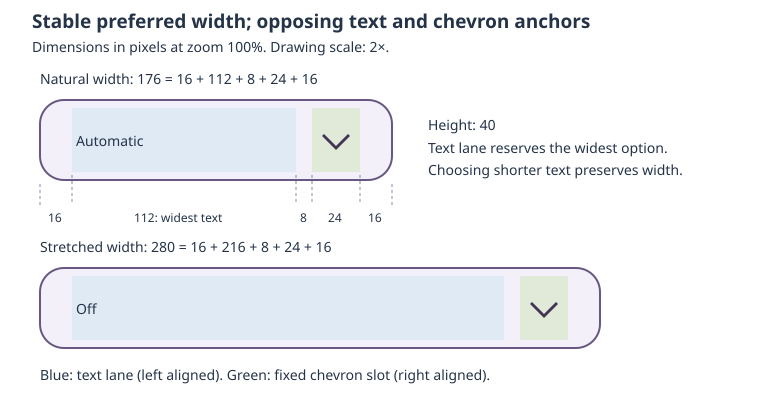

# Material 3 DropdownButton utility

Status: implemented in three focused commits. The public selector, example,
render references, and resource checks are available in the source tree.

## Objective

Add `roo_windows::material3::DropdownButton` in `material3/utilities`: a compact,
single-select control initialized from a constant string array, with stable
longest-item sizing and the appearance choices of a Material 3 button.

## Motivation

A controller often offers a short list such as Off, Automatic, and Scheduled.
Today an application must assemble menu rows, connect a presenter to a button,
remember the selection, update its label, and manage presentation lifetime.
Using the selected label alone for measurement also makes the control change
width when the user chooses another option. A utility can own this coordination
while reusing the existing menu interaction and button appearance rules.

## Background

The [design glossary](../glossary.md) defines borrowed objects, ownership, hosts,
and registrations. A widget belongs to a task; the task supplies the interaction
owner for an anchored transient menu.

[Material 3 Button](../../../src/roo_windows/material3/button/button.h) is a
`SurfaceWidget` with five variants, five size tiers, round/square shapes, and
shared click feedback. Its centered label and optional leading icon do not
provide the two opposing content alignments needed here. The existing
[button geometry helpers](../../../src/roo_windows/material3/button/internal/button_geometry.h)
already separate token geometry from the widget.

[Menu](../../../src/roo_windows/material3/menu/menu.h) provides single selection,
selected-row checkmarks, constrained scrolling, keyboard navigation, anchored
placement, outside dismissal, and focus restoration. Its root rows persist for
the lifetime of the menu object. `MenuItem::onInvoked()` runs before menu
termination; `Menu::onFinished()` runs after presentation detaches.

[DensityOverride](../../../src/roo_windows/material3/density.h) distinguishes
live application inheritance from an explicit level, including explicit zero.
Standard buttons currently read application density directly; menus carry a
policy that defaults to explicit zero. The
[density design](../proposed/material3_density_design.md) describes runtime geometry refresh.
`getSuggestedMinimumDimensions()` is a cheap content-size query, while natural
size adds padding and `onMeasure()` resolves parent constraints.

## Requirements

- Construct the control directly from a constant array of UTF-8 string pointers,
  without application-owned menu rows, duplicated labels, or callbacks per item.
- Retain one selected index and provide programmatic selection and notification
  of changes made through the menu.
- Replace the choices at runtime using borrowed strings, with an explicit new
  selection and a clear point at which old storage can be released.
- Display the selected text on the left and a down-chevron on the right. The
  entire button activates one single-select menu.
- Prefer enough width for the widest item, padding, a gap, and the chevron.
  Choosing another item must not change the preferred width or height.
- Support all existing button size, shape, and variant choices, plus an explicit
  density override and return to application inheritance.
- Respect smaller parent constraints without text painting over the chevron.
- Support touch and keyboard operation, selected-row focus, cancellation, and
  safe owner detachment and destruction using framework conventions.
- Keep closed-instance storage independent of the number of options. Allocate
  menu widgets only for a presentation, and release them after it closes.

## Design Overview

`DropdownButton` derives directly from `SurfaceWidget`. It owns its button
surface, while the existing `Menu` owns presentation behavior. It has no child
label or icon widgets. Internal shared button appearance functions supply the
same colors, elevation, corners, and press morph as `Button`; no new public
button base class is introduced.

The **option table** is a caller-owned array of string pointers. The table and
strings remain valid and unchanged until a successful replacement or destruction.
`setItems()` replaces the whole table; it does not copy the strings. The
**committed selection** is the index used by the closed button and public
accessors. A **menu session** is an active-only allocation containing a menu,
its owned rows, a pending invoked index, and terminal cleanup work. Pending
selection belongs to that session until presentation has detached.

A pair of cached text dimensions records the maximum width and height across
the option table. It makes preferred-size queries constant-time and keeps the
control stable across selection changes. This cache contains no string copies.
The menu session supplies expensive structure only during use; the button's
selection remains available after that structure is released.

```cpp
#include "roo_windows/material3/utilities/dropdown_button.h"

using namespace roo_windows::material3;

static constexpr const char* kOperatingModes[] = {
    "Off", "Automatic", "Scheduled"};

DropdownButton mode(context, kOperatingModes, ButtonVariant::kOutlined);
mode.setSize(ButtonSize::kSmall);
mode.setShape(ButtonShape::kSquare);
mode.setDensityOverride(DensityOverride::Explicit(Density::kMinus2));
mode.setSelectedIndex(1);  // Automatic; no interactive-change notification.
mode.setOnInteractiveChange([&mode] {
  ApplyOperatingMode(mode.selectedIndex());
});
// Later, replace the table and explicitly choose the new initial selection.
static constexpr const char* kExtendedModes[] = {
    "Off", "Automatic", "Scheduled", "Maintenance"};
mode.setItems(kExtendedModes, 2);  // Scheduled; no interactive notification.
// Add mode to the application's layout using the normal borrowed/adopted API.
```

The default selection is the first item. In the example, Automatic remains
left-aligned even when a parent stretches the button. The chevron follows the
right edge, and selecting Off preserves the width reserved for the widest item.



The figure illustrates geometry, not raster output. At zoom 100%, its assumed
maximum text width is 112 px, horizontal padding is 16 px, gap is 8 px, and the
chevron slot is 24 px. Natural width is 176 px; stretching to 280 px adds space
to the text lane without moving its left anchor. Both rows use a 40 px height.

## Design Details

### Option storage and selection

The pointer/count constructor borrows `const char* const*`; an array-reference
overload deduces the count. Do not accept an `initializer_list`, whose temporary
pointer table would dangle. Static arrays of string literals are the simplest
use; runtime-built tables and strings are supported with the same borrow
contract. Labels are NUL-terminated UTF-8 strings. Counts are bounded by
`UINT16_MAX`, matching the menu's 16-bit row indexing. Empty strings and duplicate
labels are valid, and indices distinguish duplicates. Null entries, a null table
with nonzero count, or an excessive count are invalid. Construction checks these
preconditions in debug builds and falls back to an empty control in release;
replacement returns false without changing the current control.

An empty table uses `(nullptr, 0)` at construction or
`setItems(nullptr, 0, kNoSelection)` for replacement. `selectedIndex()` returns
`kNoSelection`, `selectedText()` returns an empty view, and the button is
non-clickable and non-focusable. It retains its configured visual enabled state
and shows only the chevron; applications can additionally disable it with the
inherited `setEnabled(false)`. A nonempty table always has a valid selection.

`setSelectedIndex(index)` returns false for an out-of-range index, including
`kNoSelection`, without changing any state. A valid index returns true, cancels
an active or finishing session, and updates the label without emitting an
interactive notification. Selecting the already selected index still cancels
that session but does not repaint. User re-selection dismisses the menu without
emitting a change. Cancellation never changes the committed selection.

### Replacing choices

`setItems(items, count, selected_index)` and its array-reference overload
replace the complete option table. The selected index refers to the **new**
table; the array overload defaults to its first entry. The pointer/count
overload requires an explicit selection argument, avoiding ambiguity between an
array selection and a pointer count in a two-argument call. For an empty
replacement, zero or `kNoSelection` is accepted and normalized to `kNoSelection`. All other
out-of-range selections reject the replacement. No selection is carried across
by index or string equality: this avoids silently assigning a different meaning
to the old index after reordering, and handles duplicate labels unambiguously.
Callers that want to preserve an application value find its new index themselves.

Validate the entire incoming table and index, and compute its aggregate text
metrics into local values before modifying the control. On success, silently
cancel active presentation and pending action delivery, destroy its rows, then
install the new pointer/count, selection, and metrics. Request layout and
invalidate the full button interior, since the new longest label can change its
natural dimensions. This operation never triggers interactive-change delivery,
even when the selected text or index changes. Passing the same pointer/count
still performs replacement and recalculates metrics.

Successful return is the end of every old borrow by this widget and its menu:
the caller can release old table/string storage immediately, except bytes also
borrowed by the replacement. A previously returned `selectedText()` view has the
lifetime of its underlying caller-owned bytes; it is not an owned snapshot.
After rejection, the original borrow remains active and the incoming table is
not retained. In-place mutation while borrowed is unsupported; prepare a new
table, call `setItems()`, then release old storage. The table itself is borrowed
as well as its strings, so a local pointer array must also outlive its use.

### Surface, text, and geometry

Use the current button `label-large` typography for every size, preserving its
actual current behavior. Reuse the button size-token table, reduced small-button
horizontal padding, normal outer margins, shape-morph default, and all five
variant palettes. A shared immutable down-chevron asset is selected at
compile time by `SCALED_ROO_ICON` for the configured display zoom, so only that
artwork size is linked. Each button size still supplies its own nominal
icon-slot token; the slot contains whichever is larger, the token or the
artwork anchor. The glyph always points down, including while the menu is open.

Move the existing button palette/elevation/shape-resolution code into
`material3/button/internal/button_appearance.{h,cpp}`. Functions accept the
current theme, variant, size, shape, enabled/pressed state, click-animation
sample, and dimensions as needed. `Button` and `DropdownButton` delegate to
these functions. Keep `Button`'s object layout and public API unchanged. This
extraction is mechanical and must preserve existing button goldens.

At construction and successful table replacement, measure every option once
using the actual typography and font options. A text block includes both advance and ink overhang; use the
union of the horizontal advance interval and ink extents, with the corresponding
origin adjustment in painting. This avoids clipping negative-bearing glyphs
while still preserving spaces. Cache the maximum block width and the maximum
vertical footprint, including the text style line height for nonempty labels.
Empty labels contribute zero. Scan by pixel metrics, never by byte count.

`requestLayoutDescending()` rebuilds the text cache before delegating to the
base implementation. It is the explicit refresh path when shared typography
or scale inputs change. Ordinary selection, variant, shape, size, and density
changes do not rescan strings: the current button text style is independent of
those settings. `onMeasure()` and cheap size queries consume the same cache;
painting measures only the selected label as required by the text renderer.

Let $L$ be cached maximum text width, $T$ cached maximum text height, $I_w$ and
$I_h$ the resolved chevron slot dimensions, $G$ the button icon gap, and $P_l$,
$P_r$, $P_t$, $P_b$ the shared button padding. Reserve $G$ whenever $L>0$.
Suggested content dimensions are

$$W_c=L+G+I_w,\qquad H_c=\max(T,I_h).$$

Natural dimensions are

$$W_n=P_l+W_c+P_r,\qquad H_n=P_t+H_c+P_b.$$

Feed the resolved density and $H_c$ into `ResolveButtonPadding()`. Preserve its
default rounding and compact content floor, including treatment of transparent
icon margins. Use wide signed intermediates and saturate to representable
layout dimensions before narrowing. Margins remain outside these dimensions.
`onMeasure()` resolves $W_n,H_n$ with the supplied width/height specifications;
these are preferences, not a refusal to honor tighter constraints.

Paint within the padded content rectangle. Reserve the rightmost $I_w$ pixels
for the chevron, then the gap; the remaining rectangle is the text lane.
Left-align the selected text block and vertically center both slots. Extra
width belongs to the text lane. When width is insufficient, clip text at the
lane boundary without ellipsis. Shrink the text lane to zero first; clamp all
rectangles to available bounds, allowing the chevron itself to clip only when
the parent is narrower than its slot. This also defines zero-width/height cases.
Alignment is physical left/right as requested; automatic RTL mirroring is
outside this utility's initial scope.

Use `paint(PaintContext&)` with the surface pipeline. Resolve transparent glyph
pixels against the effective surface, paint disjoint text and icon slots, and
exclude only settled regions before lower surface work. Do not pre-clear and
then overwrite text pixels. Variant setters invalidate old and new decoration
extents when elevation changes. Disabled colors come from the button palette;
automatic disabled styling must not apply a second time.

### Density and live configuration

One `DensityOverride` governs both the button and its menu. It defaults to
inheritance. `setDensityOverride({})` restores that behavior; explicit zero
pins both to spacious geometry. Pass the policy into `MenuPolicy::density`,
thereby deliberately overriding standalone Menu's explicit-zero default. The
composite has one predictable compactness setting, while button size/shape/
variant affect only the trigger, not menu row typography or appearance.

Resolve inheritance live from the application theme. Density changes eligible
vertical whitespace, not text, chevron artwork, horizontal padding, or gap.
Setters that change geometry cancel the current session, request layout, and
invalidate the button. Variant/shape changes also close the session so the
visible trigger and future menu have a single configuration boundary.
A recursive shared-theme geometry refresh closes any active session and
refreshes the cache. The next open builds rows from the new theme. There is no
independent density cache, theme observer, or menu-style customization API.

### Presentation and input

`showMenu()` first checks that the control is enabled, nonempty, attached to an
eligible task, and has capturable source geometry. Empty, disabled, or ownerless
controls return `kInteractionOwnerUnavailable`; uncapturable geometry returns
`kAnchorUnavailable`. A current session, including pending cleanup, returns
`kAlreadyPresented`. Other admission failures propagate `MenuShowResult`.
The method returns failures without changing selection or firing notifications.

Construct one owned `MenuGroup` and one `MenuRow<OptionItem>` per option, with
`OptionItem` derived from `StandardMenuItem`. Each item borrows its string and
holds its index and a session reference. Initialize the selectable flag for
all rows and the selected flag for the committed index. Configure expressive,
standard-color, single-select rows and default leaf dismissal. `onInvoked()`
only records its index in the session; it never calls application code.

Present with `Menu::show(*getTask(), *this, MenuPlacement::kBelowStart)`. Keep the
presenter's existing width calculation, viewport clamping, above/below fallback,
and scrolling: the menu need not equal the button width. After successful
admission, focus the selected row using `requestFocus()`; normal focus reveal
scrolls it into view. Retain that row pointer only during admission, rather than
adding another index-to-row table. Failure destroys the unused session.

Opening occurs on confirmed click delivery, including framework Enter/Space
activation. Arrow Down also opens on key-down; consume repeats while open.
Merely receiving focus does not open the menu. Once open, Menu handles arrows,
Home/End, activation, Escape/Back, and outside interaction. Menu termination
restores focus using its existing task scope. Opening/dismissal alone does not
call the inherited interactive-change handler.

Anchor placement follows Menu's snapshot contract: it is captured when opened.
Explicit control configuration and shared geometry refresh close the menu.
Applications that move an ancestor by scrolling or other external layout while
the menu is open must call `dismissMenu()` before that move; this initial utility
does not introduce continuous anchor tracking.

### Completion and lifetime

Menu invocation still has row and presenter frames on the stack. To allow a
selection handler to destroy the control or immediately open another menu,
terminal delivery is deferred until those frames unwind:

1. `Menu::onFinished()` records the finish reason and schedules one session-owned
   `roo_scheduler::Executable` at normal priority. The menu is already detached;
   no application callback runs here.
2. The executable clears its pending execution ID. It copies the pending index,
   finish reason, and owner reference into locals, then asks the owner to finish
   the session. The owner stops presentation observation and destroys the
   session before notifying application code. The executable makes no subsequent
   access to its own storage after this handoff.
3. Only an action finish with a valid invoked index commits that index. Update
   the selected label and invalidate it, then call `triggerInteractiveChange()`
   once when the index changed. This is the last owner access: the handler can
   destroy the control or open another session.

`isMenuOpen()` becomes false once terminal delivery detaches the presentation,
but `showMenu()` continues to return `kAlreadyPresented` until cleanup completes.
`selectedIndex()` remains the old value during this short finishing interval.
`dismissMenu()` cancels active presentation and pending delivery, preserves the
committed selection, and guarantees that no change callback follows. An explicit
setter during that interval cancels the pending action before applying its value.

Observe effective presentation only for the session lifetime through
`context().presentations()`. Hidden/detached transitions, including
`detached_since_delivery`, silently cancel. Check source eligibility again before
committing a pending action so a deferred observer cannot race a detach. Disabling
the control cancels through `notifyStateChanged()`. Destruction unregisters
observation, cancels the scheduled executable, and destroys the presenter while
suppressing completion scheduling. The session's derived Menu destructor calls
`prepareForDerivedDestruction()` before session/item state becomes invalid.
Context shutdown uses the existing lifetime-aware widget/context conventions;
cleanup must not dereference an expired context.

All methods and string-table access are confined to the UI thread. The design
adds no lifetime registry, strong widget ownership, or recurring scheduler work.

### Resource cost

Let $N$ be option count and $B$ total UTF-8 bytes across all options. Typical use
is 3–20 short labels; the API's upper bound is the existing menu row-index limit,
not a promise that such a large menu fits embedded RAM.

On a 32-bit target, the estimated additional closed payload was approximately
24 bytes: table pointer (4), count and selected index (8), session pointer (4),
text dimensions (4), density byte and one packed appearance byte (2), rounded
for alignment. Set an acceptance ceiling of `sizeof(SurfaceWidget) + 32` bytes
on ESP32-C3. This excludes the caller's constant table and any optional handler
stored in the existing event service. There is no closed menu heap allocation.

Opening constructs $N$ rows and therefore uses $O(N)$ live RAM. The existing
[menu ABI audit](../implemented/material3_menus_design.md#design-details)
records roughly 464 bytes for Menu plus implementation, 56 for a group, 104 for
a row, 32 for a standard item, and 48 for a generated text slot on its audited
32-bit configuration. These are historical estimates, not current guarantees.
Adding index/owner payload and row pointers gives a useful estimate of
approximately $0.6\text{ KiB} + 200N$ bytes before allocator overhead and other
menu presentation storage: roughly 1.8 KiB for six items. Measured host peak
tracked allocations for six items were 3,480 bytes above the pre-open baseline;
this includes the menu, presenter, renderer, scheduler, and allocator activity,
so it is not an isolated menu-object size. Destroying the session
releases row vectors and retained capacity as well as live rows.

Construction, table replacement, and explicit typography refresh scan $B$ bytes,
with font metric lookup costs supplied by the font implementation. Preferred dimensions,
selection access, and programmatic index changes are $O(1)$ outside session
cancellation; cancellation destroys $O(N)$ rows. Opening includes $O(N)$ row
construction plus menu text measurement proportional to $B$. Existing Menu
single-selection updates visit $N$ rows. Closed painting processes only the
selected string. No new allocation occurs in geometry helpers or steady-state
painting; upstream font rendering retains its existing allocation behavior.

## Proposed API

New public header: `src/roo_windows/material3/utilities/dropdown_button.h`.
Namespace: `roo_windows::material3`; `utilities` is a directory, not another
namespace. Definitions live in the matching `.cpp`. Each installed table remains
immutable for its borrow duration; runtime catalog changes replace the table.

```cpp
class DropdownButton : public SurfaceWidget {
 public:
  static constexpr size_t kNoSelection = static_cast<size_t>(-1);

  /// Creates a selector borrowing the immutable table and all its strings.
  DropdownButton(ApplicationContext& context, const char* const* items,
                 size_t count, ButtonVariant variant = ButtonVariant::kFilled);

  /// Deduces the size of a caller-owned constant string-pointer array.
  template <size_t N>
  DropdownButton(ApplicationContext& context, const char* const (&items)[N],
                 ButtonVariant variant = ButtonVariant::kFilled)
      : DropdownButton(context, items, N, variant) {}

  /// Silently cancels presentation and pending completion before destruction.
  ~DropdownButton() override;

  /// Replaces borrowed choices and selection silently; rejects invalid input.
  /// Successful return releases old borrows not shared by the new table.
  bool setItems(const char* const* items, size_t count,
                size_t selected_index);

  /// Replaces choices using a caller-owned array and its deduced count.
  template <size_t N>
  bool setItems(const char* const (&items)[N], size_t selected_index = 0) {
    return setItems(items, N, selected_index);
  }

  /// Returns the current number of options.
  size_t itemCount() const;

  /// Returns the committed index, or kNoSelection for an empty table.
  size_t selectedIndex() const;

  /// Returns a borrowed view of the committed label, empty for an empty table.
  roo::string_view selectedText() const;

  /// Selects a valid index silently; invalid indices return false unchanged.
  bool setSelectedIndex(size_t index);

  ButtonSize size() const;
  void setSize(ButtonSize size);
  ButtonShape shape() const;
  void setShape(ButtonShape shape);
  ButtonVariant variant() const;
  void setVariant(ButtonVariant variant);
  DensityOverride densityOverride() const;
  void setDensityOverride(DensityOverride density);

  /// Opens an anchored menu and reports admission failure without notification.
  MenuShowResult showMenu();

  /// Cancels presentation and pending selection delivery without notification.
  void dismissMenu();

  /// Reports an admitted, still-presented session, excluding pending cleanup.
  bool isMenuOpen() const;

  // Uses inherited setEnabled() and setOnInteractiveChange().
  // Rendering, geometry, presentation, and input overrides omitted here.

 private:
  class Session;
  void refreshTextMetrics();
  void completeSession();

  const char* const* items_;
  size_t count_;
  size_t selected_index_;
  std::unique_ptr<Session> session_;
  Dimensions text_metrics_;
  DensityOverride density_;
  uint8_t variant_ : 3;
  uint8_t size_ : 3;
  uint8_t shape_ : 1;
  // Fixed default shape morph needs no per-instance setting.
};
```

Defaults are filled, small, round, inherited density, and index zero for a
nonempty table. Add Doxygen contracts to each accessor and setter in the actual
header, including the session-cancellation rules above. Do not expose arbitrary
label/icon setters or a mutable Menu reference that could break selection
synchronization. All new public entry points land with working behavior in
phase 2; no placeholder API is published between phases.

## Implementation Plan

Authoring references: [C++ guidance](../../../.github/instructions/general-cpp-code-authoring-instructions.md),
[widget guidance](../../../.github/instructions/roo-windows-widget-authoring.instructions.md),
and [example guidance](../../../.github/instructions/embedded-example-authoring.instructions.md).

### Phase 1 — Share button appearance without changing rendering

Extract internal appearance resolution and reuse existing geometry helpers.
Keep standard Button's storage, public API, default geometry, and painting
unchanged. Add focused helper coverage only where the existing button tests do
not cover the extraction. No utility header is exposed in this phase.

Validation: `//:material3_button_test`, `//:material3_density_geometry_test`,
`//:material3_density_golden_test`, and `//:material3_component_surface_theme_test`;
compare all affected existing render references without refreshing them.

Proposed commit message:

> Material 3 DropdownButton phase 1: share standard button appearance resolution.
>
> Extract stateless appearance helpers for the proposed DropdownButton utility
> while preserving standard button behavior and geometry. Validate the shared
> paths with existing button, density, and theme coverage.

### Phase 2 — Deliver the complete selector and usage example

Add `utilities/dropdown_button.{h,cpp}`, the borrowed-table API, cached metrics,
button surface, runtime table replacement, single-select session, cancellation,
deferred terminal delivery, and density policy. Add `//:material3_dropdown_button_test` and a build-covered
`examples/material3/utilities/dropdown_button/operating_mode` sketch using three
constant labels. The sketch demonstrates programmatic initialization, selection
notification, replacement with a maintenance-mode choice table, and the same
parameters shown above. Document storage lifetime and notification timing
alongside the example.

Tests cover empty/single/duplicate/UTF-8 labels, invalid indices, selection versus
re-selection, failed admission, keyboard focus and reveal, cancellation, hidden
ancestors, disablement, context/owner destruction, callback-driven destruction
and reopening, and setters during pending completion. Replacement tests cover shorter/longer
lists, reordered and duplicate labels, empty-to-nonempty transitions, explicitly
chosen new selection, rejected invalid input preserving the original state,
replacement while open or finishing, and immediate release of old heap-backed
tables/strings under ASan. Geometry coverage compares
all five sizes/variants, both shapes, inherited/explicit density, long ink
extents, stretched/clipped bounds, and stable size across selected indices.
Verify callback observation sees updated selection and a fully released session.

Validation: the new focused target, menu and transient lifetime targets, and the
example build. Run lifetime tests under ASan. These checks complete the public
API in this commit; none of its advertised behavior is deferred to phase 3.

Proposed commit message:

> Material 3 DropdownButton phase 2: add a constant-array single-select utility.
>
> Implement stable sizing, configurable button appearance and density, and
> lifecycle-safe menu selection under material3/utilities. Include focused
> behavioral coverage and an operating-mode example for the proposed design.

### Phase 3 — Record rendering and embedded cost acceptance

Add `//:material3_dropdown_button_golden_test` and
`//:material3_dropdown_button_resource_test`. Review closed filled, open outlined,
and compact constrained references. Verify ordinary Button references remain
unchanged by the extraction.

Measure ESP32-C3 object layout and closed construction for 0, 1, 6, and 20
labels. Require the 32-byte closed-object delta and no utility-owned heap for
closed selectors after font-cache warmup. Measure six-item first open and
post-close heap, and require no retained growth over 100 open/close cycles.
Report whole-process peak tracked heap separately from the estimated menu
object size. No synthetic test asserts guessed menu object sizes.

Validation: new golden/resource targets, the example build, the full `bazel test
...` suite, and applicable ASan coverage from the source repository. Update this
design's status and the index with measured results.

Proposed commit message:

> Material 3 DropdownButton phase 3: record rendering and resource acceptance.
>
> Add reviewed closed/open render references and embedded size and lifetime
> measurements for the DropdownButton design. Verify compact idle storage,
> released menu sessions, and unchanged standard-button rendering.

## Testing Plan

Run commands from the canonical `roo_windows` source repository using its Bazel
launcher and default Arduino ESP32 profile. The three focused targets
separate behavior/geometry, render references, and resource lifetime. Existing
menu, presentation, button, density, and theme tests guard reused behavior.
ASan exercises destruction and reentrant handlers; an ESP32-C3 ABI probe
measures object size. The operating-mode example has compile coverage. The
full `bazel test ...` suite passed all 120 test targets on 2026-10-09.

The ESP32-C3 ABI probe reports 24 bytes for `SurfaceWidget`, 40 bytes for
`Button`, and 52 bytes for `DropdownButton`: a 28-byte dropdown payload,
within the 32-byte limit. After font caches are warmed, constructing and
measuring closed 0-, 1-, 6-, and 20-choice selectors adds no tracked live heap.
For a six-choice menu, host tracked allocations peak at 3,480 bytes above
pre-open and retain 336 bytes after first close in shared framework caches.
Retained tracked heap stays flat across 100 further open/close cycles. Closed
selector storage and menu-session release pass their acceptance checks. Flash
delta and hardware interaction measurements remain unrecorded.

## Caveats

The installed table and its bytes must survive until successful replacement or
widget destruction. Whole-table replacement suits short embedded settings lists;
a very large catalog needs a different model. Menu rows are eager within each session and are not virtualized.
Compact density reduces the actual interactive footprint in accordance with the
existing density contract; this proposal adds no invisible touch expansion.
The utility's combined behavior is Roo-specific and does not claim to implement
a separately standardized Material component.

### Rejected Alternatives

#### Derive from Button and hide label/icon setters

Inheritance would reuse surface methods, but callers could still mutate label
and icon through a Button reference, bypassing the selected-index contract.
It also retains an unnecessary label view and icon pointer and still needs new
content layout, longest-label sizing, and density handling. A SurfaceWidget with
shared stateless appearance functions avoids those conflicting responsibilities.

#### Compose a button, a label, and an icon as persistent child widgets

Composition offers independent child APIs but retains multiple widget objects
and introduces child measurement/input coordination for two paint slots.
Direct painting keeps the small fixed-content control cheaper and simpler.

#### Retain a populated Menu while closed

Persistent menus make repeated opening cheaper, but retain approximately
$0.6\text{ KiB}+200N$ bytes per closed selector using the estimate above.
Several idle controls on one settings page magnify that cost. Active-only
sessions trade open-time allocation for the repository's RAM-first preference.

#### Measure all strings on every preferred-size query

This minimizes cache state but makes common parent layout queries depend on
option count and text length. Four bytes of aggregate cached metrics replace
repeated scans, with explicit refresh through the existing recursive layout API.

## Future Work

Owned strings, incremental list edits, disabled individual choices,
placeholder/unselected states for nonempty tables, automatic RTL mirroring,
continuous anchor tracking, and virtualized large menus are separate extensions.
