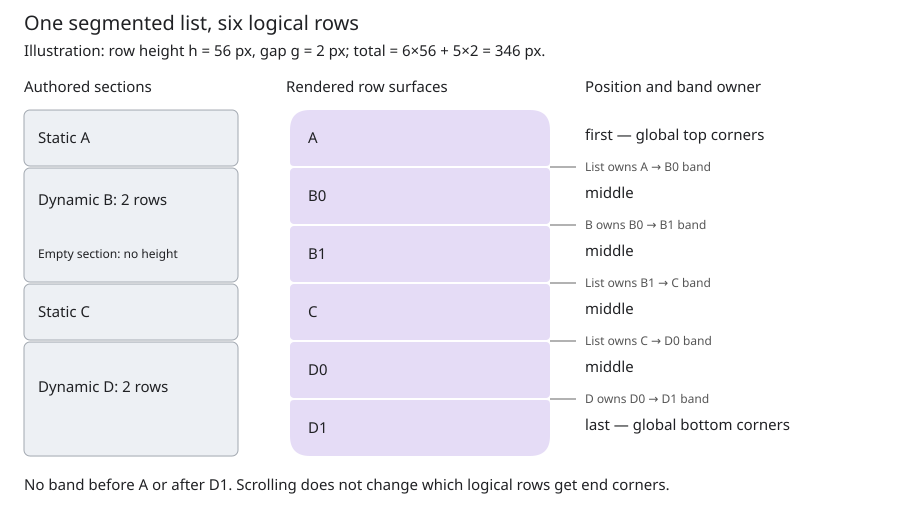

# Material 3 dynamic list composition

## Objective

Allow a Material 3 list to mix ordinary rows and virtualized collections while
presenting one continuous list with consistent row shapes, spacing, dividers,
selection, and input behavior.

## Implementation status

All five phases are implemented. Validation results below record host tests,
emulator build coverage, and the ESP32-C3 ABI audit. Physical-device interaction
has not been validated in this change.

## Motivation

A settings page can contain a fixed “Add device” row, a changing collection of
devices, and a fixed “Advanced” row. Before this change, `material3::List` accepted only
`ListEntry` children. Putting a `ListLayout` beside that list creates independent
visual groups; wrapping the entire dynamic collection in one `ListEntry` gives
the collection one row surface. Neither produces the same appearance as adding
the device rows individually.

Application code must not calculate end corners, insert separator widgets, or
rebuild one widget per model element to achieve that appearance.

## Background

The [existing lists design](../implemented/material3_lists_design.md) separates
content (`ListItem`), a Material row surface (`ListEntry`), and sequencing
(`List`). `ListRow<Item>` owns one item inline and binds it to its row.
`ListItem` already supports custom leading, trailing, and body widgets.

The original [List implementation](../../../src/roo_windows/material3/list/list.cpp)
resolves first/middle/last/single positions across non-gone direct rows, measures
variable row heights, and owns the separator bands. Selected states can affect
both row shape and gap geometry. Its original selection snapshot was captured
on insertion; this design replaces it with authoritative logical selection.

[ListLayout](../../../src/roo_windows/containers/list_layout.h) borrows a
`ListModel` and owns a prototype plus a pool of recycled widgets. The model
binds each recycled widget to an index. The prototype determines a uniform row
height, and the ancestor viewport determines which rows are materialized.
Originally recycling happened in `paintChildren()`. The pool retains its peak
capacity. `ListLayout` provides no Material list context or separator policy.

[SimpleScrollablePanel](../../../src/roo_windows/containers/scrollable_panel.h)
provides scrolling independently of either list. This proposal preserves that
composition. Ownership terms follow the [project glossary](../glossary.md).

## Requirements

1. Support a sole dynamic collection, multiple collections, and arbitrary
   alternation with ordinary Material rows in one parent list.
2. Use the same Material row treatment as ordinary lists:
   global end shapes, exactly one appropriate separator between neighbors,
   consistent selection treatment, and no section padding or group corners.
   Gaps within dynamic sections must be uniform and independent of selection;
   suppressing a divider changes its painting, not the reserved space.
3. Handle empty collections, count changes, content changes, and hidden sections
   without stale neighbors or extra space.
4. Keep widget storage proportional to the viewport, not the model size. Do not
   add state to every `Widget`, `ListEntry`, or `ListItem` for this feature.
5. Make standard Material rows easy to author, retaining custom row content and
   surfaces through the existing Material primitives.
6. Preserve binding lifetimes, cancel obsolete interactions on recycling, and
   support keyboard traversal across materialized and unmaterialized rows.
7. Preserve existing static-list and generic `ListLayout` APIs and behavior
   except for corrections needed to safely share the recycling machinery and
   the explicit single-selection contract defined below.

## Design Overview

Introduce `material3::DynamicList`, a Material adapter over `ListLayout`, and
allow `List::add()` to accept it. A **section** in this document means one
direct child of `List`: either a static entry or a dynamic collection. It is
an implementation boundary, with no visual group boundary. A **logical row**
is one non-gone static entry or one model element, whether materialized or not.
A **pooled row** is a reusable widget temporarily bound to a logical row.

`List` sequences logical rows across sections. It owns policy and determines
the context of each row from global neighbors. `DynamicList` obtains that
context when binding pooled rows, supplies their geometry, and paints internal
separator bands using the same resolver as `List`. `ListEntry` continues to
own each individual row surface. There is no additional enclosing row surface.
Dynamic sections use a constant gap resolved from parent policy; selection can
change row appearance and divider visibility without changing their stride.

The default authoring path is a typed model plus a framework factory for
`ListRow<Item>`. Custom factories must produce `ListEntry` subclasses. Arbitrary
widgets remain supported inside the item's slots, and generic `ListLayout`
remains available for completely non-Material content. This keeps custom
content flexible while providing reliable Material row boundaries.

For example, the authored sequence below has six logical rows:

```text
List: static A, dynamic B[2], dynamic Empty[0], static C, dynamic D[2]
Rows: A(first), B0(middle), B1(middle), C(middle), D0(middle), D1(last)
```



The section representation meets mixed composition without eagerly expanding
the models. Shared context and separator resolution provide visual equivalence;
typed row factories provide the convenient authoring path; generic recycler
hooks keep Material policy out of the base container.

## Design Details

### Section storage and flattened traversal

Replace `List`'s entry vector and parallel selected-byte vector with one private
vector of tagged records. Each record contains a raw `Widget*`, a kind tag
(entry or dynamic section), and a static multiple-selection bit. Single
selection is stored as one location in the parent list, or as an independent
index in an opt-in single-selection model.
The typed insertion overloads establish the tag; no RTTI, pointer tagging,
wrapper widget per static row, or public generic child protocol is needed.

Dynamic sections store a borrowed `List*` while attached. That reverse link is
needed because changing the count or selection can change neighboring static
rows even when no pooled child changes. `List::clear()` clears this link before
detachment. Only `List` can install it; one section belongs to one parent.

During context resolution, walk sections and obtain their logical counts.
Cache a logical start index per dynamic section and the total row count in the
parent. A static `kGone` row or gone section contributes zero; an invisible
section reserves its geometry, matching existing visibility semantics. Models
present their filtered sequence directly: hiding pooled widgets is not a way
to filter data. Empty sections have zero height and no separators.

Positions use the complete logical count, never the pool size or visible
viewport range. One remaining row is `kSingle`; an offscreen first row remains
the first row. Two adjacent nonempty sections have precisely the same boundary
as two rows within a section. A nested `List` remains a separate visual group
and is not another accepted section type.

### Row content and model contract

The model provides count, typed binding, cheap per-index visual state, and
section-wide interaction state. Per-index state contains model-owned selection
state, selection participation, and divider inset hints. Enabled state and focus-target policy are uniform
across every row in a dynamic section; neither can vary by model index. The
focus-target policy is none, row surface, or descendant. Descendant policy
requires each enabled row to contain an eligible focus target in its slots.
These properties are available without creating widgets, so an offscreen
neighbor can influence a visible row's separator and keyboard navigation can
skip an entire ineligible section.
Defaults cover an enabled, unselected, non-invokable text row with no focus
target. Its selection flag is ignored in parent single-selection mode: the parent supplies that state by
comparing the row's location with its stored selection.

Binding updates an already constructed pooled row. The framework calls
`refreshFromItem()` afterward, applies the resolved visual context and the
section-wide enabled state, and measures/layouts the row. The model does not
set list position, style, or separator spacing. State metadata and the bound item's behavior
must agree; debug checks verify the realizable portions of this contract.

The normal row owns its item and slot widgets for the pool's lifetime. Text
views must refer to model storage valid until the binding is released, or
to storage owned by that pooled row. The model must not bind every row to one
shared mutable `ListItem` or share one slot widget between simultaneous rows.
Before invalidating backing storage, the application initiates a model reset
which clears old bindings; after mutation it publishes the new model. Ordinary
content notifications are for backing storage whose lifetime remains valid.

The model supplies `unbind(Row&)` to release model-owned references and action
captures while the old backing storage is still valid. It must clear borrowed
views in the inline-owned item and custom slot widgets as well as any callbacks
that retain model data. The default no-op is suitable only when the binding
retains no such state. The framework clears its own text-slot views without
reading the old item again or destroying prepared slot storage. The inline-owned
item and its prepared slot widgets remain attached throughout; reset does not
use `ListEntry::clearItem()`. The next `bind()` fully initializes model-dependent
state before `refreshFromItem()` runs. `prepare()` remains once per allocation.

No framework item-ID registry is introduced. Indices are valid for one model
revision. A synchronous action may report its bound index; reset cancels old
interactions and releases their callbacks before indices change. Application
work that outlives a binding uses a domain ID instead. The append-only example
restores its known selected index directly, without searching the model. After structural reset, pending gestures and logical focus
are canceled. This avoids claiming that index 7 still identifies the same
device after a reorder.

### Geometry and separators

Each dynamic section uses a fixed row surface height `h`, resolved from its
prototype at the parent's width. All its rows use that height. Distinct dynamic
sections can use different prototypes/heights; static entries retain their
existing variable-height measurement. Variable-height and expanding dynamic
rows are outside this feature. The API documentation requires a prototype
whose configured text/slot layout represents the whole section.

Extract the existing list context, gap, and divider calculations into private
shared helpers. Reuse the current tokens and policy precedence, including the
existing segmented-with-dividers behavior; this is not a redesign of tokens.
For dynamic sections, resolve one gap `g` using the existing gap helper with
both rows unselected and divider presence determined solely by the parent's
divider mode. This preserves the ordinary unselected spacing and reserves the
divider's space even when selection suppresses its paint. Selection never adds
or removes space between dynamic rows. For `n` rows:

```text
rowTop(i) = i * (h + g)
sectionHeight(n) = n*h + (n-1)*g     for n > 0
sectionHeight(0) = 0
```

There is no trailing band inside a section. The parent measures, lays out, and
paints the band between the last row of one nonempty section and the first row
of the next. The dynamic section owns all its internal bands. The same
policy-derived gap also applies at a section boundary with a dynamic row on
either side, so entering or leaving a dynamic section introduces no spacing
seam. Boundaries between two static entries retain their existing
selection-dependent spacing. A shared divider
geometry function accepts row bounds and resolved hints instead of requiring
a materialized `ListEntry`. Thus an edge divider is still correct when the
preceding row is just outside the viewport.

Dynamic row margins and section padding are zero. Item content padding remains
inside `ListEntry`. Gaps are real noninteractive bands, not margins painted as
part of a row. Position arithmetic uses `YDim` and checked wider intermediates;
it must not reuse `List`'s current `int16_t` total-height accumulator. Heights
outside `Rect`'s representable range fail a documented `CHECK` during layout;
the implementation must not compress row heights to make them fit.

Use stride arithmetic for total height and viewport lookup in every selection
mode. Locate a candidate row by dividing the section-local offset by `h + g`,
then check intersection with its actual surface bounds and clamp to the model
range. An offset inside a gap does not hit the preceding row. Paint intersecting
divider bands separately, including one whose preceding row is offscreen.
No prefix scan or per-model-row offset storage is needed. Theme, width or parent
policy changes recompute the prototype height and gap once per section.

### Recycler integration

Refactor `ListLayout` to expose protected virtual operations for content extent,
locating a viewport's row range, sequential row bounds, binding, and model-change
notification. Default implementations preserve its uniform generic geometry.
`DynamicListBase` overrides those operations to apply Material context and
bands. The existing ring buffer, attachment, clipping, and reuse stay shared.
Keep these operations internal/protected, not an application strategy API.

Explicitly handle zero count, empty intersection, wholly offscreen sections,
count shrink, and zero pool capacity before division or modulo. Clamp both
range ends to the model, and never fabricate one row for an empty viewport.
Reserve enough rows during layout for the viewport plus two edge/focus rows.
Retain capacity after shrink; do not allocate/deallocate pool widgets on scroll.

Binding must finish before a pooled subtree is painted or accepts input. The
existing paint-time range synchronization can remain for scroll changes, but
it must perform no pool growth and must be safe on repeated interrupted paint
attempts. Expose the same synchronization routine to keyboard materialization.
Once a logical paint attempt starts, do not rotate/rebind rows merely because
painting resumes. Content mutation invalidates the affected region and starts
a new binding revision before that region is repainted.

`ListEntry` currently deletes empty text slots and allocates when their class
changes. A dynamic row therefore needs explicit preparation: add a protected
no-state hook to retain prepared text-slot storage in a recycled subclass.
The typed convenience factory creates that subclass of `ListRow<Item>`.
Models configure the slot set/text policies once in `prepare(row)` using
representative content whose storage lasts for the row's lifetime; prototype
preparation must not retain replaceable model backing storage. The recycler
prepares all pool rows during layout. Empty text hides a prepared slot without
destroying it. Binding cannot add slots or change text-widget classes. The
default headline convenience factory prepares its one label automatically.
Custom factories observe the same prepared-slot contract.

Wrapped `TextBlock` content can still allocate through its existing string and
layout implementation. The no-allocation scrolling guarantee covers the
framework recycler and prepared one-line/string-view rows. Wrapped/custom
content must document and budget its own binding costs; this proposal does not
claim to solve the separate text-system allocation work.

### Selection ownership and participation

Two explicit ownership modes share the same rendering and input machinery:

- Parent-wide selection uses `ListSelectionPolicy`: `kSingle` owns one
  `ListRowLocation` spanning static rows and dynamic sections; `kMultiple` stores
  static flags in section records and dynamic flags in application models.
- `DynamicSingleSelectionListModel<Row>` owns one optional index for its own
  section. Its parent must use `kNone`; conflicting ownership fails `CHECK`.
  Multiple such models form independent groups in one visual list. Static
  actions do not clear their selections.

`SelectionParticipation::{kSelectable,kAction}` separates selection from
invocation. An action still invokes, focuses, and receives normal press feedback,
but cannot acquire selection or clear another row's selection. Static items
expose `selectionParticipation()`; `InvokableListItemBase` provides
`setSelectionParticipation()`. Configure it before insertion/binding. Dynamic
models expose participation in `rowState(index)` so offscreen programmatic
selection never constructs or scans rows. A bound item's participation can
further exclude its activation; model metadata is authoritative for offscreen
requests. Selection eligibility does not change keyboard eligibility.

For parent-wide single selection, store a direct-child pointer and local index
(zero for a static entry). A null pointer means no selection. `select(entry)`
and `select(section,index)` validate membership, participation, reset state and
bounds. Invalid requests return false; selecting the same location is a no-op.
Disabled/offscreen rows can be selected programmatically without focusing or
scrolling. `clearSelection()` clears the location. Single selection is never
inferred by searching model flags.

#### Per-item model notifications

`DynamicListModel<Row>::onSelectionChanged(int index, SelectionState state)` is
a virtual no-op by default. `SelectionState` is an enum with `kSelected` and
`kDeselected`, not a boolean argument.

In parent single mode, commit the new location and visible control state first,
then notify the old model of deselection and the new model of selection. A
switch inside one model produces two per-item notifications. The optional
parent `onSingleSelectionChanged(location)` hook remains available and follows
model notifications. Mode changes and reset clearing also notify; destruction
suppresses notifications. The model does not need to maintain a second selection
index in this mode.

In multiple mode, a row/control activation requests the opposite of
`rowState(index).selected`. The model's hook updates that backing flag; the list
then rereads metadata and synchronizes visible controls. A model may reject a
request by leaving the flag unchanged. `List::setSelected(section,index,state)`
uses the same path for programmatic changes. Selecting another row does not
clear existing flags. External data changes still use the existing model
notifications. Static multiple flags use the existing `setSelected(entry,bool)`.

`selection_follows_press` applies to selectable rows and participating controls
in parent modes; `kAction` rows are always excluded. When false, activation
invokes the action without modifying authoritative selection. Offscreen rows
receive current selection when bound; updates walk sections and visible rows,
never all model indices.

#### Standard controls and lifetime safety

Radio and checkbox convenience items expose a selection control. In an active
selection group, the framework owns that control's interactive-change routing
and synchronizes it through `applySelection(SelectionState)`. Both the row and
its control enter the same logical operation. `invokeSelection()` reports the
application action without running the control's default toggle a second time.
Controls are synchronized before action delivery. Disabling selection or
unbinding restores ordinary item invocation. Switches and arbitrary controls
remain independent unless a custom item explicitly implements these hooks.
Application code should use item invocation/model hooks rather than replace a
managed control's interactive-change handler.

State-free item/container hooks avoid new base-row fields. Stack-scoped guards
protect callback delivery: reset, recycling, clear, and destruction cancel
pending row access, and reentrant single-selection changes supersede pending
selection notifications. A callback may clear/reset the view. Models must
survive their callbacks. Cleanup hooks cannot mutate selection or list structure;
parent clear rejects reselection and recursive clear is a no-op.

#### Single-selection convenience model

The helper provides `selectedIndex()` (`-1` means none), `select(index)`,
and `clearSelection()` (equivalent to `select(-1)`). It owns the index and supplies
selection metadata; callers only implement content binding. Its optional
protected `onSelectionChanged(index,state)` reports the committed transition,
old deselection before new selection, after visual synchronization. A hook may
clear/reset the view, but cannot destroy the model or recursively change the
same helper's selection; recursive changes fail `CHECK`.

An internal `SelectionListener` connects the helper to one dynamic section.
This is needed for `model.select()` to update visible widgets without requiring
application calls to `modelItemChanged()`. The helper holds one non-owning
listener pointer, with no concrete view pointer in application subclasses. The
section attaches on construction and disconnects before destruction. A helper
can attach to at most one section at a time; sharing fails `CHECK`. This is a
single notification connection, not an observer collection. It carries only
functional change delivery, not virtual calls for checking author invariants.
Selection changes from prepare/bind/unbind are forbidden by the model contract.
Model lifetime
must exceed section lifetime, as with the existing model contract.

Reset releases bindings but preserves the helper's index. Appending therefore
preserves selection without callbacks, scans, or save/restore code. Before
removal/reorder, the application must clear or remap selection while bindings
are released. The framework does not infer stable identity from a reused index.
`clearSelection()` also clears an index whose data was already removed; its
old-index notification must not dereference that removed element.

The device example uses the helper, marks both fixed rows `kAction`, and leaves
parent selection at its default. No selection-forwarding List subclass,
per-device callbacks, selected-ID lookup, manual radio refresh, or
`selection_follows_press` override is needed. Its List subclass only supplies
full-width layout.

### Updates and invalidation

Retain `modelChanged()`, `modelRangeChanged(begin, end)`, and
`modelItemChanged(index)`, adding a reset pair for backing-storage replacement.
All operations occur on the UI context, outside paint. Count changes and
structural resets re-resolve global positions and request parent layout.
Content notifications refresh materialized rows and their neighboring bands;
Selection changes within dynamic sections repaint rows and bands without
changing section geometry. Parent policy changes and changes affecting a
static/static boundary request layout. At first implementation, conservatively
re-resolve parent contexts on
every notification; do not retain a dirty-range index or observer list.

`beginModelReset()` first marks the section as resetting, then cancels input
and releases every outstanding pool binding, including inactive rows retained
in the pool. Rows already unbound are not unbound again. It publishes the
section's zero logical contribution and requests parent layout/invalidation
before clearing parent-owned selection, and clears that selection only when it still points into
that section. The resulting selection-change notification is the final
operation: all binding cleanup and section/parent state updates finish before
notification. Neither the reset method nor its notification helper accesses the
section or parent after that callback, including through cleanup guards whose
destructors would write to either object.

This ordering allows the selection-change callback to call `List::clear()`:
an adopted section can be destroyed during the callback, and a borrowed section
can be detached. Destruction finds no outstanding bindings to release again.
Callers must not call `endModelReset()` on a section destroyed by the callback;
a surviving borrowed section remains resetting and can complete its reset while
detached. The reset caller keeps the borrowed model and old backing storage
alive through cleanup. Once `beginModelReset()` returns, it may immediately
destroy that storage.

Cleanup itself is non-reentrant: `unbind()` and focus/gesture cancellation hooks
must not mutate list structure or selection, destroy the section/list/model,
or call reset APIs. Such application changes belong in the final selection
notification or after `beginModelReset()` returns. A cleanup-in-progress bit in
the adapter's existing flags enables `CHECK` validation at list mutation and
reset entry points; clear this bit before delivering the final notification.
This restriction ends before the selection callback, where the selection and
clear rules above apply normally.

Until `endModelReset()` publishes the new model, the section performs no model
reads (apart from releasing old bindings during begin-reset cleanup), binding,
or keyboard materialization; parent traversal treats it as
contributing zero logical rows. Reset keeps prepared row and slot allocations.
`endModelReset()` publishes the new count, requests layout/rebinding, and ends
the reset guard before returning. Nested resets on the same section and an
unmatched `endModelReset()` are contract violations enforced with `CHECK`.
Ordinary model notifications during reset are likewise invalid; the end call
publishes all changes.

Reordering or inserting/removing items before an
existing index requires this reset protocol, even when count is unchanged.
The application can restore selection after `endModelReset()` by resolving its
own domain ID. Content-only updates and append/end-truncation notifications
preserve selection at an existing index; truncation past the selected index
clears it. A section becoming empty also clears selection into it. Mutations in
other sections never clear or rebase the stored location.

Explicit `List::clear()` clears selection before detaching children. Making
the selected static entry or section gone clears its location during structural
context resolution, without scanning its model. Invisible rows retain selection
because they still participate in layout. Disabling a selected row retains
selection. Recycling a pooled widget clears its interaction state but never
the logical selection. Selection is not represented by framework flags or
offsets allocated per dynamic model element.

`ListEntry` retains its existing shape/overlay renderer. A change to first/last
position invalidates the old and new boundary pixels; count shrink or a section
becoming empty invalidates its vacated area and adjacent bands. Containers keep
their established foreground-first surface pipeline. Internal/boundary divider
painters fill only their owned bands and exclude those pixels before background
fill. A dynamic section's background delegates to its owning list so gaps match
the parent's surface, including lists with specialized background overrides.

### Input and recycling lifetimes

Before a pooled row changes logical index, hide it using the existing widget
visibility lifecycle. This clears focus, pressed/clicking state, and gestures
in the subtree. Then call `unbind()` for its old binding and clear framework
text views before binding the new index. Rows leaving the active range are
unbound when hidden, even if their allocations remain in the pool. Destruction
also releases outstanding bindings while the borrowed model is still alive.
Content-only refresh at the same index updates the existing binding without
hiding the row or canceling eligible focus; `bind()` must replace obsolete
model-dependent state on that path too. Refresh all model-owned flags on every
bind. Do not let an old
pointer-up or click animation invoke the newly bound item. Pool entries are
borrowed attached children whose allocations remain owned by the recycler;
detach them before destroying the pool, preserving the current lifetime fix.

The parent handles Up/Down in logical row order. It skips invisible/gone or
disabled static rows and static rows with no eligible focus target. It skips an
entire dynamic section when the section is invisible/gone, disabled as a widget,
resetting, empty, has section-wide enabled state false, or has focus-target
policy none. Ancestor visibility and enabled state must also permit focus,
matching the focus manager's eligibility rules. Invisible sections retain
geometry and selection but are skipped before any keyboard materialization;
offscreen visible sections remain eligible. Within an eligible dynamic section
it moves directly to the adjacent index; no per-index eligibility search is
needed. It resolves the focused section/local index from the focus manager's current
widget and active binding range, and materializes the target synchronously. Row-surface policy targets the row itself; descendant policy
targets the first eligible descendant when moving down and the last when moving
up. It then calls the existing focus manager so the enclosing scroll panel
reveals that widget. A section boundary does not wrap focus; reaching the
whole-list boundary returns the key unhandled. Ordinary slot key handling takes
precedence over list navigation. Offscreen rows are not fabricated in
`getChildrenCount()` for generic focus traversal.

Skipping whole sections can still produce a distant target. In that case,
replace the active recycled range with a bounded window around the target;
never materialize the intervening indices. Preserve that window until focus
reveal completes, then resume viewport synchronization.

Changes to section-wide interaction state use `modelChanged()`, refresh all
materialized rows, and clear focus if its target becomes ineligible. Bindings
must preserve the uniform policy, including eligible descendant availability;
per-row enabled or focusability overrides are outside this contract.
Hiding or disabling a section through widget APIs likewise clears physical and
logical focus through the visibility/enabled lifecycle. Making it visible or
enabled again does not restore focus automatically.

Touch scrolling can recycle a focused row and clear focus. Logical focus is
cleared at the same time. A content-only notification preserves focus at that
index; a structural reset clears it. No stable focus identity across reorders
is promised. All materialization happens before calling the focus manager, not
inside its recursive child enumeration.

### RAM and work bounds

Let `S` be direct sections, `N` total dynamic model elements, `D` dynamic
sections, `V_j` the retained pool capacity of dynamic section `j`, and `V` the
number of materialized rows processed across sections. Static
row allocations and application model storage are outside the recycler cost.

On a 32-bit target, a tagged section record is expected to occupy 8 B versus
the current 4 B entry pointer plus 1 B selected byte: approximately +3 B per
static row, while removing one 12 B vector control block from `List`. A dynamic
collection costs one record, irrespective of its element count. No base widget
or ordinary row gains a data member. New virtual hooks add code/vtable entries.

Budget up to 20 B of parent scalar state (logical count, an 8 B single-selection
location, a pointer to the active invocation guard, and clear/destruction flags),
and 24 B of adapter overhead per dynamic section (owner pointer, logical prefix,
section-vector index, gap, flags, and selection-listener interface vptr). Row height and extent calculation
reuse the recycler. Logical focus is derived from the focus manager's real
focused subtree and the active range, avoiding a second focus record that could
outlive visibility changes.
The typed model bridge uses the existing model vtable/reference; it adds no
per-row callback storage. Selection routing reuses standard controls' existing
interactive-change handler storage. The optional single-selection model costs
16 B total on ESP32-C3 versus 4 B for the basic model: one observer pointer, one
index, a callback guard and alignment. The existing prototype factory is stored
once per section.
Only the small factory bridge is templated; geometry, context and recycling
live in a shared non-template base to limit compiled code growth.

Pool storage is `O(sum(V_j))` rows plus one prototype per section and the
existing pool/Panel pointer arrays (approximately 8 B per allocated row on a
32-bit ABI). For a 320 px viewport and 56 px rows, budget eight pooled rows
plus a prototype per populated section. Ten sections can consequently retain
about ninety row objects after being visited: there is no global shared pool.
Separate sections with very few elements cap their allocation by element count.
Empty sections retain previously allocated capacity but materialize zero rows.

Count and section-prefix resolution is `O(S)` in every selection mode: sum
model-reported counts of participating sections, without enumerating elements.
Reading or replacing the stored single-selection location is `O(1)`; validating
a static entry against the section vector can cost `O(S)`. Resolving a given
row's single-selection state is `O(1)`. Multiple-selection state is read only
for materialized rows and adjacent divider neighbors, with no selection-discovery
scan. Applying contexts to static/materialized rows costs `O(S + V)`.

Dynamic viewport-range lookup is `O(1)` per section, and scrolling/context work
is `O(S + V)` in every selection mode, independent of `N`. Checking adjacent
divider state adds only a bounded number of metadata reads per materialized
row or section boundary. Keyboard navigation checks section-wide interaction
state and static-row eligibility in at most `O(S)` work, plus target
materialization and focus resolution within its widget subtree. It does not
scan dynamic model indices for eligibility. Data reads must be in-memory,
synchronous and
allocation-free. A model containing expensive storage lookups needs its own
cached view.

## API

The following APIs are implemented; existing APIs stay available. `Row` must
derive from `ListEntry`. The typed model uses a private `ListModel` bridge that
casts the factory-validated row type once; callers need no `Widget&` casts.

```cpp
struct DynamicListRowState {
  bool selected = false;  // Used only in SelectionMode::kMultiple.
  DividerInsetHint divider_inset_hint = {};
  SelectionParticipation participation = SelectionParticipation::kSelectable;
};

enum class DynamicListFocusTarget : uint8_t {
  kNone,
  kRowSurface,
  kDescendant,
};

struct DynamicListSectionState {
  bool enabled = true;  // Applies to every row in the section.
  DynamicListFocusTarget focus_target = DynamicListFocusTarget::kNone;
};

template <typename Row>
class DynamicListModel /* internal ListModel bridge */ {
 public:
  virtual ~DynamicListModel() = default;
  virtual int elementCount() const = 0;
  virtual void prepare(Row& row) const {}  // once per allocated row
  virtual void bind(int index, Row& row) const = 0;
  virtual void unbind(Row& row) const {}  // release borrowed data/action captures
  virtual DynamicListRowState rowState(int index) const { return {}; }
  virtual DynamicListSectionState sectionState() const { return {}; }
  virtual void onSelectionChanged(int index, SelectionState state) {}
};

template <typename Row = ListRow<RadioListItem>>
class DynamicSingleSelectionListModel : public DynamicListModel<Row> {
 public:
  int selectedIndex() const;
  bool select(int index);  // -1 clears selection.
  void clearSelection();
 protected:
  void onSelectionChanged(int index, SelectionState state) override {}
};

class DynamicListBase : public ListLayout {
 public:
  void beginModelReset();  // guards selection, cancels input, releases bindings
  void endModelReset();    // publishes count, rebinds and requests parent layout
  // Existing modelChanged/modelRangeChanged/modelItemChanged remain available.
 private:
  friend class List;
  List* owner_ = nullptr;
  int logical_start_ = 0;
  int section_index_ = 0;
  YDim gap_ = 0;
  uint8_t flags_ = 0;
  // Overrides the protected recycler geometry/binding/notification hooks.
};

template <typename Row = ListRow<HeadlineListItem>>
class DynamicList : public DynamicListBase {
 public:
  using PrototypeFn = std::function<std::unique_ptr<Row>()>;
  DynamicList(ApplicationContext&, DynamicListModel<Row>&);
  DynamicList(ApplicationContext&, DynamicListModel<Row>&, PrototypeFn);
  // No extra instance state: bridges forward to the shared base.
};

// A location in one List; never points at a recycled row widget.
struct ListRowLocation {
  Widget* section = nullptr;  // Direct ListEntry or DynamicListBase child.
  int index = 0;             // Zero for a static entry.
};

// Additions to List (public):
void add(DynamicListBase& section);
void add(std::unique_ptr<DynamicListBase> section);
bool select(ListEntry& entry);                       // kSingle only
bool select(DynamicListBase& section, int index);    // kSingle only
void clearSelection();
ListRowLocation selection() const;                  // Empty outside kSingle.
bool setSelected(ListEntry& entry, bool selected);  // kMultiple only

// Protected hook; no per-instance std::function storage:
virtual void onSingleSelectionChanged(ListRowLocation selection) {}

// New private single-selection state in List:
ListRowLocation selection_;
```

The default constructor supplies a context-constructed row with retained text
slots. The headline specialization also prepares its default label. Other row
types use `prepare()` to establish fixed content structure and prototype height;
a custom factory supplies constructor arguments or a specialized row surface.
Custom row factories must implement the prepared-text retention behavior when
using the standard text slots. Adoption/borrowing follows existing `List::add`
semantics. The model outlives the dynamic section; borrowed sections/rows outlive
the list or are explicitly cleared before destruction. The framework does not
store a `WidgetRef` after attachment.

A headline-only consumer needs no custom prototype:

```cpp
using DeviceRow = ListRow<HeadlineListItem>;
class DeviceModel : public DynamicListModel<DeviceRow> {
 public:
  int elementCount() const override { return devices.size(); }
  void bind(int i, DeviceRow& row) const override {
    row.item().setHeadline(devices[i].name);  // stable model-owned string
  }
  void unbind(DeviceRow& row) const override {
    row.item().setHeadline({});  // release the borrowed model string
  }
  // Application-owned devices storage omitted.
};

// Model and borrowed rows are constructed before list, destroyed after it.
DeviceModel model;
DynamicList<> devices(context, model);
ListRow<HeadlineListItem> heading(context, "Devices");
ListRow<HeadlineListItem> footer(context, "Advanced");
List list(context);
list.setStyle(ListStyle::kSegmented);
list.add(heading);
list.add(devices);
list.add(footer);
// Put list inside the existing SimpleScrollablePanel.
```

Removing the two static insertions yields a sole dynamic list; adding another
`DynamicList` yields another collection in the same group. A model can instead
bind `ListRow<SwitchListItem>` or a specialized `ListEntry` with arbitrary
content. Switch state, current domain ID, and action binding are reset per bind.

For a single-select list, the application initializes selection explicitly:

```cpp
ListSelectionPolicy policy;
policy.mode = SelectionMode::kSingle;
list.setSelectionPolicy(policy);
list.select(devices, 3);  // Model index, whether materialized or not.
list.select(footer);     // Replaces the dynamic selection immediately.
list.clearSelection();
```

This example assumes the model contains at least four elements. Neither call
reads model selection flags. An application subclass overrides the change hook
to map the selected section/index to a device ID and update its domain state.

A dynamic section is publicly insertable only after the complete row-surface,
geometry and recycling path is implemented. No placeholder public API silently
renders it as a single row. Protected prerequisite hooks land with working
generic defaults; the public feature is published in Phase 3 below.

## Implementation Plan

Follow the [code-authoring skill](../../../.github/skills/roo-windows-code-authoring/SKILL.md),
[embedded C++ guidance](../../../.github/instructions/embedded-cpp-code-authoring.instructions.md),
and [widget guidance](../../../.github/instructions/roo-windows-widget-authoring.instructions.md).

### Phase 1: Extract shared sequencing and separator calculations

Commit: `refactor(list): share row context and separator resolution`.
Extract helpers taking metadata/bounds, retain static output, and widen list
vertical accumulation to `YDim`. Add static boundary/selected-divider regression
coverage and update internal documentation. Validate `//:material3_list_test`,
including equivalent pixels before/after and heights above 32767 px.

### Phase 2: Make recycling geometry and preparation extensible

Commit: `refactor(list-layout): expose safe recycling and geometry hooks`.
Implement the protected hooks, empty/offscreen bounds, checked extents, input
reset on reuse, repeatable paint continuation, and prepared text retention.
Preserve the existing uncommitted lifetime/margin fixes when implementing this
phase. Extend `//:list_layout_lifetime_test` and `//:material3_list_test` for
empty, clipped, shrinking and reused rows, slot allocation counts, destruction,
and interrupted painting. Document the fixed-geometry and preparation contract.

### Phase 3: Publish dynamic sections and typed standard factories

Commit: `feat(list): compose recycled Material rows with static entries`.
Add the tagged parent records, adapter/model APIs, global positions, explicit
parent-owned single selection, model-owned multiple selection, section-owned
internal dividers and parent-owned boundary dividers,
notifications/reset, and logical keyboard traversal together. Add
`//:material3_dynamic_list_test` covering static/dynamic equivalence, interactions,
and lifetimes, plus build-covered
`//examples/material3/lists/dynamic_devices:dynamic_devices` demonstrating a
changing model between fixed rows. Document sole/multiple dynamic usage and
custom factories in the example and public headers in this commit.
Include single-selection tests across static/dynamic boundaries, offscreen
selection, resets, mode transitions, automatic invocation selection, callback
reentrancy, and repeated selection of the same location. Use a model whose
metadata-read counter rejects full-model traversal during single-selection
changes; verify that recycling preserves logical selection. Demonstrate explicit
initial selection and radio-accessory synchronization in the example.
Test uniform section enable/focus policies, whole-section keyboard skipping,
bounded materialization across distant sections, and descendant-only focus
targets in offscreen rows. Verify section-state changes clear ineligible focus
without clearing selection.
Test Up/Down across invisible nonempty dynamic sections and invisible static
rows in both directions: navigation reaches the next eligible row without
binding skipped sections, while their geometry and selection remain intact.
Cover hiding a focused section, showing it again, and an offscreen visible
section that must still be materialized and focused.
Test callback-driven reselection during clear/reset, allowed selection into
another section during reset, recursive clear, and checked nested/unmatched
reset calls. Free the old model storage immediately after `beginModelReset()`
and then rebind; verify inactive retained rows hold no stale views or action
captures, prepared item/slot attachments survive, and no new prepared-slot
allocations occur. Check that `unbind()` runs once per released binding and
that no model reads or binding occur after begin-reset cleanup until end-reset
publication. Test a reset selection-change callback that clears the parent with
both adopted and borrowed sections: adopted destruction is safe under ASan,
each binding is released exactly once before notification, and the surviving
borrowed section can end its reset while detached. Verify forbidden mutation
from cleanup hooks fails its `CHECK`, and that notification return performs no
access to a destroyed section or parent.

### Phase 4: Validate visual output and target resource cost

Commit: `test(list): cover mixed dynamic list rendering and resource bounds`.
Add goldens to the dynamic-list target for section seams, offscreen ends,
selected states, divider policies, and theme/width changes. Exercise the example
with touch and keyboard, count changes during pending clicks, and first/last
sections becoming empty. Record ESP32 ABI sizes and row-allocation counts here;
acceptance requires no new base-widget/base-row fields and no per-model-row
framework allocation. Compare prepared one-line models with 100 and 10,000
elements at the same viewport: pool storage must be equal after warmup.
Verify equal row strides for all selection patterns and divider suppression,
including dynamic/static seams. Measure viewport updates for 100 and 10,000
elements in every selection mode; metadata reads and binds must stay bounded
by viewport rows and section boundaries, not model size. Report call counts
and elapsed time. Run tests
serially using the persistent Bazel output/cache configuration; never place
Bazel storage under `/tmp` or override the global resource limits.

### Phase 5: Simplify selection and action participation

Commit: `Material 3 dynamic lists Phase 5: simplify model selection and action participation`.

Add enum-based per-item notifications for parent single/multiple modes,
participation metadata and static action configuration, standard-control routing
and synchronization, guarded callback dispatch, and the optional independent
single-selection model. Measure its incremental ESP32-C3 cost and cover
programmatic, row, control, reset, reentrant, and destructive callback paths.
Update the device example to remove application selection plumbing, then build
its emulator target and run static-list/menu compatibility checks.

## Testing Plan

Use a small eager `List` as the reference for row surfaces, contexts, and
unselected geometry. Assert the explicit uniform-gap contract separately where
selected static rows would normally change spacing. Cover all-static, all-dynamic, and mixed
sequences, including empty/gone sections and rows crossing the viewport edges.
Do not test only whether a factory returns a `ListEntry`.

Focused targets are `//:material3_list_test`, `//:list_layout_lifetime_test`, and
the new `//:material3_dynamic_list_test`. The dynamic example is the integration
build. Input tests exercise keyboard materialization and touch recycling with
slot controls; lifetime tests use adopted and borrowed rows and ASan where
available. Allocation and metadata-call counters establish the resource claims.
The phased validations above define the individual cases and exit criteria.

## Validation results (2026-09-25)

The initial 20 tests in `//:material3_dynamic_list_test` pass, including 12 exact
framebuffer comparisons with eager lists and four reviewed goldens (mixed,
selected, offscreen, and changed theme/background). Tests cover reset/reentrant
cleanup, adopted destruction, borrowed detachment, touch cancellation, separator
hit testing, distant keyboard materialization, descendant controls, interrupted
painting, width changes, and multiple collections.

The dynamic-list, static-list, and generic recycler targets also pass under
ASan. Compatibility targets `material3_menu_row_test`, `material3_menu_test`,
and `click_animation_test` pass. The revised
`//examples/material3/lists/dynamic_devices:dynamic_devices` emulator target
builds successfully and starts under the emulator without an error during an
eight-second smoke run. Interactive touch/key walkthroughs and physical-device
checks remain manual.

The resource test performs 20 one-row viewport updates after warmup. Both model
sizes retain seven pooled rows plus one prototype; preparation and binding
counts are independent of model size. Times below are host measurements, not
MCU performance guarantees.

| Selection mode | Model rows | Prepared rows | Metadata reads | Binds | Elapsed (µs) |
| --- | ---: | ---: | ---: | ---: | ---: |
| None | 100 | 8 | 40 | 20 | 10468 |
| None | 10000 | 8 | 40 | 20 | 10711 |
| Single | 100 | 8 | 40 | 20 | 11396 |
| Single | 10000 | 8 | 40 | 20 | 10721 |
| Multiple | 100 | 8 | 80 | 20 | 10780 |
| Multiple | 10000 | 8 | 80 | 20 | 11049 |

`benchmarks/material3_dynamic_list_size_probe.sh`, run with the installed
`riscv32-esp-elf-g++` and `riscv32-esp-elf-nm`, measures these ESP32-C3 ABI sizes
with exceptions and RTTI disabled:

| Type | Bytes |
| --- | ---: |
| `Widget` | 24 |
| `Container` | 44 |
| `ListLayout` | 124 |
| `List` | 88 |
| `ListEntry` | 88 |
| `ListItem` | 4 |
| `DynamicListBase` | 148 |
| `DynamicList<>` | 148 |
| `ListRow<HeadlineListItem>` | 104 |

The adapter adds 24 bytes over `ListLayout`; the typed facade adds no state.
The selection extension measures 4 B for the basic model, 16 B for the optional
single-selection helper, and 44 B for `InvokableListItemBase`. Participation
shares the existing invokable-item flag byte.
No fields were added to `Widget`, `Container`, `ListEntry`, or `ListItem` for
this feature. Pools retain peak capacity per section, as specified above.

### Selection convenience validation

Nine additional focused tests cover programmatic, row, and radio selection;
offscreen rebinding; independent groups; append reset; explicit action exclusion;
parent model notifications; checkbox multiple selection without double toggles;
return to unmanaged control behavior; rejected/opt-out interactions; reentrant
notifications; callback destruction; and ownership checks. All 29 dynamic tests,
static-list tests, and recycler lifetime tests pass under ASan.
The resource table above records the initial implementation before per-item
participation metadata; the bounded-work test continues to compare equal counts
for 100 and 10,000 rows rather than require those historical absolute counts.

## Caveats

The fixed-height constraint applies to each dynamic section. Expanded bodies
and heterogeneous row heights belong in static rows or separately sized dynamic
sections. Geometry represents logical rows independently of their allocated
widgets; reaching the framework's coordinate limit is an error, not permission
to change the row height.

The first implementation keeps per-section pools. There is no shared
viewport-sized allocation across arbitrarily many sections. Uniform dynamic
spacing intentionally differs from static lists when selection would change
the gap: hidden dividers retain their space, and selected pairs do not acquire
extra spacing. Row shapes and colors still reflect selection.

### Rejected Alternatives

#### Selection-dependent gaps inside dynamic sections

Variable gaps require either a prefix scan to locate the viewport or retained
per-row geometry. Uniform gaps provide direct lookup and bounded RAM while
preserving selection through row shapes, colors and divider visibility. The
geometry contract above reserves space independently of divider paint.

#### Discover single selection from per-row flags

The current static list's first-selected-snapshot rule makes a dynamic model
require a worst-case full traversal. Independent per-section selections also
require arbitration across sections. The parent-owned location provides global
exclusivity directly; per-row flags are reserved for multiple selection. See
Selection ownership for the explicit initialization and reset contracts.

#### Accept any Widget in List

This is convenient for generic composition but cannot guarantee row surfaces,
corner treatment, invocation, or divider hints. Requiring `ListEntry` at the
recycled-row boundary provides those contracts; arbitrary body/slot widgets
remain available as described in Row content and model contract.

#### Wrap the entire ListLayout in a ListEntry

This reuses the existing insertion API, but gives a whole collection one set of
corners and one interaction surface. It cannot provide the geometry illustrated
above without reproducing list policy inside application code.

#### Eagerly instantiate every model row

This gives straightforward layout and focus, and remains appropriate for small
lists. It defeats `ListLayout`'s memory purpose. The pool cost and fixed-height
tradeoff are quantified in RAM and work bounds.

#### Require every application to supply a generic prototype and cast Widget

Existing generic factories remain useful, but making them the only path repeats
Material setup and unchecked type casts. A typed model and framework factory
keep the common path short while sharing the non-template implementation.

#### Introduce a general flattened widget tree or per-row offset index

A general provider hierarchy and global recycler can reduce retained pools,
but add ownership, routing and index maintenance
to a feature with only two concrete section kinds. The tagged representation
and fixed-stride geometry meet this proposal without those mechanisms.

## Future Work

Per-row enabled state and focusability may be added if concrete use cases
require them. The initial API deliberately keeps both uniform per dynamic
section. Such an extension must define navigation across long runs of
ineligible rows and preserve bounded materialization and descendant targeting.

Variable-height virtualization, automatic focus preservation by application
item IDs, and a shared pool across many sections are separate extensions. They
are not required for fixed-height dynamic sections to match ordinary Material
rows under this design.
