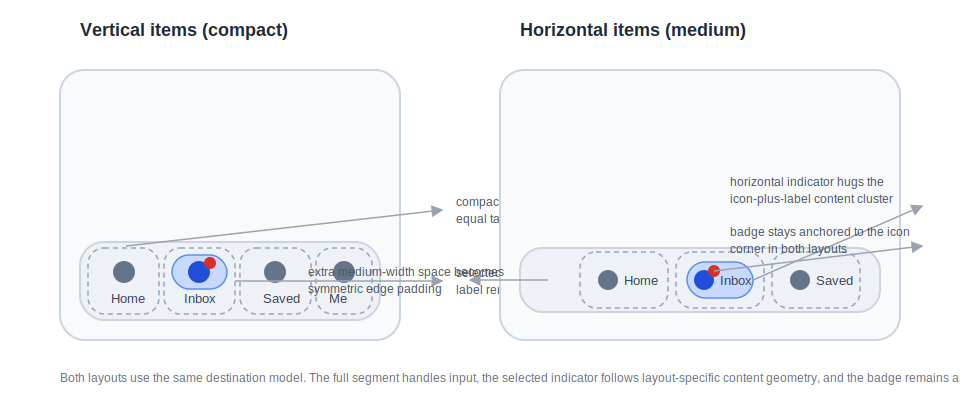

# Roo Windows Material 3 Navigation Bar Design

## Implementation status

**Implemented.** All five documented phases are present in the source tree,
focused unit and golden tests, and the Material 3 navigation-bar example. The
status of existing and outstanding prerequisites is recorded in the
[status index](../README.md).

## Objective

Add a Material 3 navigation bar family to `roo_windows` that closes on the
current shared framework APIs and the current Material 3 flexible navigation
bar guidance:

- a persistent bottom bar that spans the full window width,
- vertical destinations for compact layouts and horizontal destinations for
  medium layouts,
- three to five stable top-level destinations with one selected at a time,
- always-visible labels, optional selected icons, and optional badges,
- semantic invocation and reselection hooks without per-destination stored
  callbacks,
- and `paint(PaintContext&)`-based rendering that fits the current widget paint
  pipeline.

The result is a new Material 3 navigation bar family that lands beside the
existing rail work. It targets the current flexible navigation bar rather than
the deprecated baseline bar, and it deliberately leaves adaptive scaffolds,
safe-area handling, and hide-on-scroll wrappers out of the base component.

## Motivation

`roo_windows` already has a Material 3 badge helper, a `PaintContext`-based
paint pipeline, and a design for Material 3 navigation rail. What it still
lacks is the bottom navigation surface that Material now expects on compact and
many medium layouts.

The flexible navigation bar became the recommended Material 3 variant in 2025.
Landing it as its own family closes a common top-level navigation gap,
establishes the missing sibling for a future adaptive bar-or-rail scaffold, and
does so without stretching list, tab, or rail abstractions into a shape they do
not naturally fit.

## Background

### Current Starting Point in `roo_windows`

At design time, there was no checked-in Material 3 navigation bar
implementation.

The nearest current navigation surfaces are:

- [src/roo_windows/containers/navigation_rail.h](../../../src/roo_windows/containers/navigation_rail.h)
- [src/roo_windows/containers/navigation_panel.h](../../../src/roo_windows/containers/navigation_panel.h)
- [docs/material3_navigation_rail_design.md](../proposed/material3_navigation_rail_design.md)

Those surfaces are useful architectural context, but they are not the right
public shape for a bottom navigation bar:

1. the legacy rail is a leading-edge vertical container with owned strings and
   per-destination `std::function<void()>` callbacks,
2. the Material 3 rail design adds a header slot and collapsed / expanded rail
   layouts that do not belong to every bottom bar,
3. and neither surface captures the flexible navigation bar's compact vertical
   items, medium horizontal items, or destination reselection guidance.

The new navigation bar should therefore land as a sibling family, not as a
mutation of the rail.

### Landed Shared Primitives

Two checked-in surfaces directly constrain this design.

The badge helper is already available in
[src/roo_windows/material3/badge/badge.h](../../../src/roo_windows/material3/badge/badge.h):

1. `material3::Badge` is not a `Widget`,
2. badge text is stored inline with no heap allocation,
3. badge geometry is resolved from owner-supplied anchor bounds plus
   `BadgePlacement`,
4. and badge paint is already defined as
   `paint(PaintContext&, const Theme&) const`.

The paint-context pipeline is also already established in
[src/roo_windows/core/paint_context.h](../../../src/roo_windows/core/paint_context.h)
and [src/roo_windows/core/widget.h](../../../src/roo_windows/core/widget.h):

1. widget paint goes through `paint(PaintContext&)`,
2. exclusions protect already-settled pixels from later paint,
3. and container surfaces still paint after their children.

The navigation bar design must therefore reuse `material3::Badge` and
`PaintContext`. It should not invent a bar-local badge type, a baseline-era
`Canvas` paint path, or a second callback/overlay system.

### Material 3 Signals

This document is aligned against the current Material 3 navigation bar
references:

- [Overview](https://m3.material.io/components/navigation-bar/overview)
- [Specs](https://m3.material.io/components/navigation-bar/specs)
- [Guidelines](https://m3.material.io/components/navigation-bar/guidelines)

The main product signals carried into this design are:

1. the recommended variant is the flexible navigation bar, not the deprecated
   baseline bar,
2. the bar is a bottom-aligned navigation surface for compact and medium
   windows,
3. the intended destination count is three to five,
4. every destination keeps a visible label,
5. compact layouts use vertical items while medium layouts use horizontal
   items,
6. compact items divide the available width equally,
7. horizontal items keep a fixed token-backed width and extra width becomes
   symmetric edge padding,
8. only one destination shows the active indicator at a time,
9. badges overlap the icon in both layouts,
10. reselecting the already-selected destination is a meaningful action,
11. swiping between destinations is not part of the component contract,
12. and hide-on-scroll is presentation policy rather than base bar state.

### Local Design References

The most relevant local references are:

- [material3_navigation_rail_design.md](../proposed/material3_navigation_rail_design.md)
- [../implemented/material3_badge_design.md](../implemented/material3_badge_design.md)
- [../implemented/paint_context_design.md](../implemented/paint_context_design.md)
- [widget_authoring.md](../../widget_authoring.md)

Those references imply five important local constraints:

1. badge support belongs on opt-in hosts rather than on every base instance,
2. selection ownership should stay on the container rather than on individual
   destinations,
3. paint order must respect the current settled-foreground-plus-exclusion
   rules,
4. per-instance RAM cost matters more than speculative generality,
5. and adaptive wrappers should sit outside the base widget family unless they
   are required for correctness.

## Requirements

### Functional Requirements

1. Support the current Material 3 flexible navigation bar with vertical
   destinations for compact layouts and horizontal destinations for medium
   layouts.
2. Support one selected destination at a time.
3. Support three to five destinations as the intended design range, while
   allowing fewer during construction and focused tests.
4. Reject attempts to add more than five destinations.
5. Support separate inactive and selected icons per destination.
6. Support optional dot and text / number badges on some destinations without
   adding badge state to every destination instance.
7. Keep destination order fixed; the bar itself is not a scrolling or
   reordering surface.
8. Paint the bar as a full-width bottom surface with no drop shadow.
9. Keep selection visuals static in v1; animated selection transitions are out
   of scope for the initial landing.

### Interaction Requirements

1. Destination hit-testing must use the full destination segment bounds in both
   layouts.
2. Clicking an enabled destination must invoke a semantic bar callback.
3. Clicking a different destination must update the selected index.
4. Clicking the already-selected destination must invoke an explicit reselection
   hook.
5. Hovered, focused, pressed, disabled, selected, and activated visuals must
   flow through the existing widget state model.
6. Badge paint ordering must remain correct under the current `PaintContext`
   exclusion pipeline.
7. The base API must not require per-destination stored `std::function`
   callbacks.
8. The base API must not imply swipe-to-switch or hide-on-scroll behavior.
9. Keyboard operation must use the framework-owned `FocusManager`; the bar
   must not keep a second focused-index or key-armed state.
10. Tab and Shift+Tab must enter and leave destinations through ordinary
    focus-manager traversal. Arrow keys must move between destinations in the
    bar's visual row without changing selection. Enter and Space must use the
    framework primary-activation lifecycle.
11. Disabled destinations must be absent from keyboard traversal and cannot be
    activated. A selection change must not move keyboard focus.

### API Requirements

1. Expose one persistent `material3::NavigationBar` container.
2. Expose one badge-free `NavigationBarDestination` base widget.
3. Expose one opt-in `BadgedNavigationBarDestination` subclass that reuses the
   landed `material3::Badge` helper.
4. Keep standard destination labels as non-owning `roo::string_view`.
5. Keep labels always visible; do not add selected-only or unlabeled modes.
6. Use `paint(PaintContext&)` for widget paint; do not add a legacy `Canvas`
   path.
7. Keep adaptive window-class switching, bottom insets, FAB coordination, and
   hide-on-scroll wrappers out of the base bar API.

### Embedded Constraints

1. Do not allocate on paint, click, hover, focus, or layout paths.
2. Keep `NavigationBarDestination` free of badge fields, child vectors, owned
   strings, and per-instance callback storage.
3. Keep the incremental badge cost on `BadgedNavigationBarDestination` limited
   to one inline `Badge` plus any required packed state.
4. Keep badge placement derived from icon geometry rather than stored as a
   permanent per-instance policy field.
5. Keep adaptive layout policy on the bar, not on each destination.
6. Use pointer-size-aware size-budget assertions for the new public types.

## Design Overview

The public surface has three layers:

1. `material3::NavigationBar` is the persistent bottom container.
2. `material3::NavigationBarDestination` is the compact clickable destination
   widget.
3. `material3::BadgedNavigationBarDestination` is the opt-in badge-aware
   subclass that adds one inline `material3::Badge`.

The family lands beside the current rail work rather than trying to fold bar
and rail into one public abstraction. The two components share high-level
concepts, but their layout axes, indicator geometry, badge treatment, and
adaptive responsibilities are different enough that a shared public type would
either overpay RAM or blur semantics.

`NavigationBar` owns:

- the outer bottom surface,
- the destination sequence,
- the current vertical-or-horizontal layout mode,
- and the selected destination index.

`NavigationBarDestination` owns:

- its label,
- its inactive and selected icon references,
- its item-local active-indicator paint,
- and its full-segment interaction handling.

`BadgedNavigationBarDestination` adds only:

- one inline `material3::Badge`,
- icon-anchored badge layout,
- and the badge-aware paint ordering needed by the current `PaintContext`
  pipeline.



The core decisions are:

1. add a dedicated flexible navigation bar family instead of reviving the
   deprecated baseline bar,
2. keep the base destination badge-free and pay for badge state only on an
   opt-in subclass,
3. keep labels always visible and keep label fitting policy intentionally
   narrow,
4. reuse the landed `material3::Badge` helper with the icon as the badge anchor
   in both layouts,
5. keep container-owned selection and semantic callbacks,
6. and leave adaptive switching, insets, and hide-on-scroll behavior outside
   the base bar.

## Design Details

### Type Split and Adaptive Boundary

`NavigationBar` derives from `Container`.

That is the same storage-driven decision used by the rail design. The bar owns
one meaningful outer surface and one dedicated destination sequence. Deriving
from `Container` avoids paying for `Panel`'s generic child vector on top of a
specialized `std::vector<NavigationBarDestination*>`.

`NavigationBarDestination` derives from `BasicWidget`.

That keeps the common destination cheap. A destination paints indicator, icon,
label, and state feedback, but it does not own the bar background behind it.

`BadgedNavigationBarDestination` derives from `NavigationBarDestination`.

That follows the same badge-host rule as the landed badge design and the rail
design: the base widget stays badge-free, and only the badge-aware subclass
pays for the inline badge storage and badge layout logic.

The adaptive boundary is explicit:

1. the base bar exposes an explicit vertical-or-horizontal layout setter,
2. a future scaffold decides when a window class should use the bar versus the
   rail,
3. the base bar does not own bottom safe-area padding, scroll listeners, or FAB
   avoidance policy.

### `NavigationBar` Container

The bar stores:

- a vector of destination pointers,
- one selected-index field,
- and one vertical-or-horizontal layout bit.

There is no header slot, divider flag, shadow flag, or container-visibility
flag in v1. The flexible navigation bar is a simpler surface than the rail:
its identity is the bottom container itself.

#### Layout Algorithm

The layout algorithm is:

1. resolve the bar's token-backed outer bounds and content rect,
2. resolve the token-backed height for the current layout mode,
3. place every destination inside that content rect,
4. push the current layout mode into every destination,
5. keep the destination order stable from logical start to logical end,
6. and keep all badge geometry inside each destination's logical bounds.

In vertical layout, the destination segments divide the available content width
equally:

$$
segment\_width = \left\lfloor \frac{W}{N} \right\rfloor
$$

where $W$ is the inner content width and $N$ is the destination count.

In horizontal layout, the bar uses a fixed token-backed item width $I$ and
turns extra width into symmetric edge padding:

$$
edge\_padding = \max\left(0, \left\lfloor \frac{W - N \cdot I}{2} \right\rfloor\right)
$$

If the available width is too small for the preferred horizontal layout, edge
padding compresses to zero before item widths shrink. If width is still too
small after that, the bar divides the remaining width equally across all
destinations. The component does not add label shrinking, label wrapping, or
adaptive destination reordering to hide that shortage.

That layout policy is deliberate. The bar stays predictable and RAM-cheap, and
the higher-level adaptive scaffold remains responsible for choosing a bar,
horizontal bar, or rail before layout becomes pathological.

#### Surface Paint and Invalidation

`NavigationBar` paints only bar-owned surface content:

- the container fill resolved from the current navigation bar tokens,
- and no shadow, divider, or overlay stack in v1.

That surface stays on the current `Container` pipeline:

1. destination children paint first,
2. the bar surface paints afterward through `paint(PaintContext&)`,
3. child exclusions preserve already-settled destination pixels,
4. and no bar-local finalize stage is introduced.

Invalidation rules stay narrow:

1. changing selection invalidates only the old and new selected destinations,
2. changing layout mode invalidates and relayouts the full bar,
3. adding or clearing destinations invalidates the full bar,
4. and badge-content changes invalidate only the owning destination because the
   badge stays inside destination bounds.

### `NavigationBarDestination`

Each base destination stores:

- a non-owning label,
- an inactive icon pointer,
- an optional selected-icon pointer,
- and packed bits for the current layout mode and selected state.

The base destination is intentionally direct-painted.

It does not create child label widgets, child badge widgets, or per-item child
vectors. That keeps the base-case RAM predictable and avoids carrying list-like
or rail-header machinery into a bar destination.

#### Indicator Geometry

Every destination has two distinct rectangles:

1. the **target rect**, which is the full destination bounds and is used for
   hit-testing, hover, focus, press, and invalidation,
2. the **indicator rect**, which is smaller and tracks the selected visual
   treatment.

In vertical layout, the indicator is icon-focused. The label remains visible
below the icon, but it sits outside the selected pill.

In horizontal layout, the indicator hugs the horizontal icon-plus-label content
cluster.

That split matches the flexible navigation bar guidance and keeps the selected
state legible without turning the whole segment into a filled button.

#### Label Policy

Standard destination labels stay intentionally narrow:

1. the widget stores one non-owning `roo::string_view`,
2. the supported contract is one line of brief text,
3. the widget does not wrap, ellipsize, hyphenate, or shrink text,
4. and when an ancestor forcibly undersizes the bar, labels clip rather than
   triggering a second fitting policy.

That is the correct tradeoff for this component. Material explicitly expects
short labels, and the library should not burden every destination instance with
dynamic text-fitting behavior that only compensates for unsupported usage.

#### Selected Icon Fallback

When the selected-icon pointer is configured, the selected state uses it.
Otherwise the selected state reuses the inactive icon with selected-state tint.

That matches the Material guidance and keeps the public API semantic rather than
forcing a second icon asset when the theme can already distinguish the state.

### Badge Integration

Badges reuse the landed `material3::Badge` helper. The bar does not define a
`NavigationBarBadge` struct, a badge mode enum, or a bar-local badge text
buffer.

`BadgedNavigationBarDestination` stores one inline `Badge badge_` and owns the
geometry translation needed to map Material bar placement onto the shared badge
API.

#### Badge Placement

The icon is the badge anchor in both layouts.

That is the key simplification relative to the rail design. Material places
navigation bar badges on the icon corner in both vertical and horizontal item
layouts, so the owner can reuse the same anchor rule everywhere:

1. resolve the icon bounds,
2. use logical top-end in LTR and logical top-start in RTL,
3. apply the shared badge helper's current dot and text geometry,
4. and keep the badge inside the destination target rect.

There is no placement setter in v1 because the spec does not need one.

#### Badge and Indicator Relationship

The badge does **not** enlarge the selected indicator in either layout.

That decision is deliberate. The badge is an adornment attached to the icon,
not part of the primary indicator silhouette. Keeping indicator geometry badge-
free matches the spec imagery, simplifies the base destination geometry, and
avoids turning badge visibility into another source of indicator relayout.

#### Badge Overflow Policy

In v1, the badge stays inside the full destination bounds in both layouts.

That keeps the badged destination on the simple paint and invalidation path:

1. no `ParentClipMode::kUnclipped`,
2. no custom `getInkInsets()` override,
3. no old-versus-new badge envelope bookkeeping outside widget bounds,
4. and ordinary destination invalidation remains sufficient when badge content
   changes.

If future token changes ever require badge overhang outside destination bounds,
the extension should be made on the shared badge-host pattern, not by adding a
bar-local overflow system.

### Paint Model

The navigation bar follows the current `PaintContext` paint pipeline exactly.

`NavigationBarDestination::paint(PaintContext&)` paints destination-owned
foreground content:

- selected indicator,
- icon,
- label,
- and any state-local direct pixels that belong to the destination.

`BadgedNavigationBarDestination::paint(PaintContext&)` settles the badge first
and then delegates the lower-z destination content draw.

That order is required by the current badge and widget authoring rules:

1. `badge_.paint(ctx, theme())` emits the badge's direct pixels, rounded
   decoration, and exclusion,
2. the remaining destination content then paints underneath that settled badge
   region,
3. and the shared widget pipeline later contributes the destination's own
   exclusion bounds.

No navigation bar code path reintroduces a separate `Canvas` paint hook, a
custom finalize stage, or a bar-local overlay stack.

### Selection Ownership and Callbacks

Selection is bar-owned.

The bar stores one selected index and pushes derived selected state into its
destination children. That keeps the single-selected-destination rule in one
place and removes the need for a per-destination callback field.

Click handling is:

1. clicking an enabled destination always calls
   `NavigationBar::onDestinationInvoked(int index)`,
2. if the destination differs from the current selection, the bar updates the
   selected index and then calls
   `NavigationBar::onSelectedIndexChanged(int old_index, int new_index)`,
3. if the destination is already selected, the bar instead calls
   `NavigationBar::onSelectedDestinationReselected(int index)`.

All three hooks are virtual no-ops.

That gives higher-level adapters a semantic seam for top-level navigation and
scroll-to-top behavior without paying for stored callbacks on every
destination.

The bar also auto-selects the first destination added when it is currently
empty. After that point, the public contract keeps one destination selected for
as long as the bar has at least one destination.

### Keyboard Operation and Focus

`NavigationBarDestination` is focusable through its inherited clickable-widget
default. It is the destination, rather than the `NavigationBar` container,
that receives keyboard focus and the focused state overlay. This keeps the
full destination target rect as the focus affordance and lets the existing
`FocusManager` retain ownership of focused-widget lifetime.

Selection and focus are deliberately independent:

1. **Selection** is the bar-owned, persistent top-level content choice. Exactly
   one enabled or disabled destination may be selected while the bar is
   non-empty.
2. **Focus** is the transient keyboard target. Moving focus does not select a
   destination, repaint its selected indicator, invoke callbacks, or alter the
   selected index.
3. Invoking a focused destination follows the ordinary click contract: a new
   destination becomes selected after `onDestinationInvoked`, while invoking
   the selected destination calls only the reselection hook. Focus remains on
   that destination in either case.

#### Tab Entry and Exit

The bar does not consume `KeyCode::kTab`. Its destination children remain in
their stable logical insertion order, so the implemented focus manager's
depth-first traversal provides the contract directly:

1. Tab from a preceding eligible control enters the first enabled destination.
2. Shift+Tab from a following eligible control enters the last enabled
   destination.
3. Tab from the last enabled destination and Shift+Tab from the first enabled
   destination leave the bar and continue in the containing active root's
   normal traversal order (including the framework's root-level wrap policy).
4. If a destination is disabled, hidden, detached, or otherwise ineligible,
   it is skipped; it never becomes the Tab entry target.

This is intentionally not a bar-local Tab loop. Capturing Tab inside a
bottom-navigation row would make the rest of the active UI unreachable and
would conflict with `FocusManager::moveFocus(root, backwards)`.

#### Arrow-Key Movement

All flexible-navigation-bar variants lay their destinations out in one
horizontal row, even when a destination's icon and label are vertically
stacked. Therefore Left and Right are the bar's local directional keys in both
`kVertical` and `kHorizontal` layouts.

`NavigationBar::onKeyEvent()` handles `KeyCode::kLeft` and `KeyCode::kRight`
on down and repeat by calling
`context().focus().moveFocusDirection(*this, direction)`. That uses the
implemented allocation-free geometry scan, accepts only eligible descendants,
and does not wrap. The visual left/right direction automatically follows the
actual mirrored geometry in RTL; no separate logical-direction mapping is
stored by the bar.

At either end, or for Up/Down, the bar returns `false`. Normal ancestor
bubbling and then the application directional-traversal fallback can move
focus to an eligible control outside the bar. The bar never changes selection
while handling an arrow key.

#### Activation, Disabled Destinations, and Restoration

The bar adds no bespoke Enter/Space handler. An unhandled Enter or Space on a
focused enabled destination is armed on key-down and invokes the same
release-based `onClicked()` path as touch on the matching key-up, through the
framework's primary-activation fallback. Repeat does not activate a
destination. This preserves pressed feedback and prevents duplicate navigation
from held keys.

Disabled destinations remain visible in their disabled visual state, may stay
selected if the host disables the current destination, but are ineligible for
Tab and directional traversal and cannot be activated. Implementations must
not silently select a neighboring destination merely because the selected one
is disabled; that policy belongs to the host's navigation model.

The bar stores no focus-restoration pointer or focused index. Focus restoration
is the framework's responsibility: `FocusManager` clears focus before a
disabled, hidden, or detached destination becomes ineligible, and any
containing focus scope restores an eligible target according to its normal
scope policy. When the bar remains attached, changing selection or completing
keyboard activation leaves focus on the invoked destination. When a host
replaces a bar or its page, it must rely on the active scope's restoration
policy rather than retaining a destination pointer in the bar.

### Theme Resolution

The bar resolves its defaults from the active `Theme` and the current flexible
navigation bar tokens:

- bar container color,
- vertical and horizontal bar heights,
- vertical segment spacing and horizontal item width,
- edge padding,
- active-indicator shape and padding,
- selected icon tint,
- selected label color,
- inactive icon tint,
- inactive label color,
- and typography for the always-visible label.

The design explicitly targets the flexible navigation bar token set rather than
the deprecated baseline variant. Selected label color follows the current
flexible navigation bar guidance rather than the older baseline mapping.

Badge colors stay owned by the shared badge helper. The bar does not shadow
them with a second badge palette.

### RTL and Bottom-Edge Semantics

The navigation bar remains a bottom-edge component in both text directions.

Logical start / end semantics apply to:

- the destination ordering across the bar,
- horizontal icon / label ordering,
- badge gravity,
- and any layout math that uses start versus end offsets.

The outer surface itself does not become a leading-edge or trailing-edge
component in RTL; only the internal logical geometry mirrors.

### RAM Budget

The design keeps the base case explicit.

Target budgets for host-side tests are:

1. `NavigationBarDestination`:
   `sizeof(BasicWidget) + sizeof(roo::string_view) + 2 * sizeof(void*) + 8`
2. `BadgedNavigationBarDestination`:
   `sizeof(NavigationBarDestination) + sizeof(Badge) + 4`
3. `NavigationBar`:
   `sizeof(Container) + 3 * sizeof(void*) + 12`

The important accounting rule is not the exact host-build byte count. It is the
shape:

1. base destinations stay badge-free,
2. the badged subclass pays for exactly one inline badge helper,
3. the bar itself carries only the destination vector and compact selection /
   layout state,
4. and the design does not add stored strings, per-item callbacks, or scaffold
   state to the common case.

## Proposed API

### Core Types

```cpp
namespace roo_windows {
namespace material3 {

enum class NavigationBarLayout : uint8_t {
  kVertical,
  kHorizontal,
};

class NavigationBarDestination : public BasicWidget {
 public:
  explicit NavigationBarDestination(ApplicationContext& context,
                                    roo::string_view label = {},
                                    const MonoIcon* icon = nullptr,
                                    const MonoIcon* selected_icon = nullptr);

  roo::string_view label() const;
  void setLabel(roo::string_view label);

  const MonoIcon* icon() const;
  void setIcon(const MonoIcon* icon);

  const MonoIcon* selectedIcon() const;
  void setSelectedIcon(const MonoIcon* icon);

  bool selected() const;
  NavigationBarLayout layout() const;

  bool isClickable() const override;
  Dimensions getSuggestedMinimumDimensions() const override;
  void paint(PaintContext& ctx) const override;

 protected:
  void onClicked() override;
  Rect iconBounds() const;

 private:
  friend class NavigationBar;
  void setLayoutFromBar(NavigationBarLayout layout);
  void setSelectedFromBar(bool selected);

  roo::string_view label_;
  const MonoIcon* icon_;
  const MonoIcon* selected_icon_;
  uint8_t layout_ : 1;
  uint8_t selected_ : 1;
};

class BadgedNavigationBarDestination : public NavigationBarDestination {
 public:
  explicit BadgedNavigationBarDestination(
      ApplicationContext& context, roo::string_view label = {},
      const MonoIcon* icon = nullptr,
      const MonoIcon* selected_icon = nullptr);

  const Badge& badge() const;
  void hideBadge();
  void setBadgeDot();
  void setBadgeText(roo::string_view text);
  void setBadgeValue(unsigned int number);

  void paint(PaintContext& ctx) const override;

 protected:
  void onLayout(bool changed, const Rect& rect) override;

 private:
  void relayoutBadge();

  Badge badge_;
};

class NavigationBar : public Container {
 public:
  static constexpr uint8_t kMaxDestinations = 5;

  explicit NavigationBar(ApplicationContext& context);

  NavigationBarLayout layout() const;
  void setLayout(NavigationBarLayout layout);

  int selectedIndex() const;
  void setSelectedIndex(int index);

  int destinationCount() const;

  bool add(NavigationBarDestination& destination);
  bool add(std::unique_ptr<NavigationBarDestination> destination);
  void clear();

  ColorRole containerRole() const override;
  void paint(PaintContext& ctx) const override;

 protected:
  int getChildrenCount() const override;
  const Widget& getChild(int idx) const override;
  Widget& getChild(int idx) override;
  Dimensions onMeasure(WidthSpec width, HeightSpec height) override;
  void onLayout(bool changed, const Rect& rect) override;
  bool onKeyEvent(const KeyEvent& event) override;

  virtual void onDestinationInvoked(int index) {}
  virtual void onSelectedIndexChanged(int old_index, int new_index) {}
  virtual void onSelectedDestinationReselected(int index) {}

 private:
  void updateSelectionFromDestination(NavigationBarDestination& destination);
  void propagateLayoutToDestinations();

  std::vector<NavigationBarDestination*> destinations_;
  int8_t selected_index_;
  uint8_t layout_ : 1;
};

}  // namespace material3
}  // namespace roo_windows
```

### API Notes

1. `NavigationBarDestination` intentionally has no badge setter surface.
   Callers that want badges opt into `BadgedNavigationBarDestination`.
2. Labels are always visible in v1. There is no label-visibility enum.
3. `BadgedNavigationBarDestination` does not expose a placement setter in v1.
   Badge placement is derived from the icon corner in both layouts.
4. `selectedIndex()` returns `-1` only when the bar is empty.
5. Adding the first destination auto-selects it if no selection exists yet.
6. The design targets the current flexible navigation bar; it does not add a
   second public API for the deprecated baseline variant.
7. The new family lands beside the current rail work; it does not mutate
   `roo_windows::NavigationRail` into an adaptive bar-or-rail surface.

## Implementation Plan

Implementation work for these phases follows the repo-local
[roo_windows widget authoring instruction](../../../.github/instructions/roo-windows-widget-authoring.instructions.md).

### Phase 1: Declare the Navigation Bar Types and Size Budgets

Code slice:

1. Add the public enum and class declarations in the Proposed API.
2. Keep the base destination badge-free and add the badged destination as a
   separate subclass.
3. Add pointer-size-aware size-budget assertions for
   `NavigationBarDestination`, `BadgedNavigationBarDestination`, and
   `NavigationBar`.
4. Do not add adaptive-scaffold or hide-on-scroll entry points in this phase.

Proposed commit message:

> Material 3 navigation bar Phase 1: declare the bar family.
>
> Add `material3::NavigationBar`, `NavigationBarDestination`, and
> `BadgedNavigationBarDestination`, together with size-budget tests that keep
> badge cost off the base destination type.

Validation: add `material3_navigation_bar_test` and run
`bazel test //:material3_navigation_bar_test` from the `roo_windows`
workspace.

### Phase 2: Implement the Base Destination Widget

Code slice:

1. Implement vertical and horizontal measurement for
   `NavigationBarDestination`.
2. Implement always-visible label paint, selected-icon fallback, and the two
   indicator geometries.
3. Keep the base destination on `paint(PaintContext&)`; do not add a legacy
   `Canvas` entry point.
4. Add focused tests and goldens for vertical and horizontal enabled,
   disabled, selected, unselected, and focused destinations.

Proposed commit message:

> Material 3 navigation bar Phase 2: implement the base destination widget.
>
> Add vertical and horizontal `NavigationBarDestination` paint, including
> always-visible labels, selected-icon fallback, and the flexible navigation
> bar indicator geometry.

Validation: run `bazel test //:material3_navigation_bar_test` and
`bazel test //:material3_navigation_bar_golden_test` with destination-focused
cases.

### Phase 3: Implement the Bar Container and Selection Model

Code slice:

1. Implement `NavigationBar` add / clear / selection behavior and the five-
   destination cap.
2. Auto-select the first destination added and wire clicks through the
   container-owned selection model.
3. Implement the vertical equal-width layout and horizontal fixed-width-plus-
   edge-padding layout.
4. Add explicit reselection behavior through
   `onSelectedDestinationReselected(int index)`.
5. Paint the bar-owned container fill on the current `Container` surface path.
6. Add the keyboard contract: focusable destinations, Left/Right local
   traversal through `FocusManager`, framework Enter/Space activation, and no
   selection change on focus movement.

Proposed commit message:

> Material 3 navigation bar Phase 3: implement the container and selection
> model.
>
> Add the persistent `NavigationBar` surface, destination sequencing,
> container-owned selection and keyboard focus traversal, and reselection
> callbacks for top-level navigation.

Validation: run `bazel test //:material3_navigation_bar_test` with focused
selection, reselection, add / clear, layout, focus-versus-selection, and
keyboard cases.

### Phase 4: Add the Badge-Aware Destination Subclass

Code slice:

1. Implement `BadgedNavigationBarDestination` on top of the landed
   `material3::Badge` helper.
2. Use icon-corner anchoring in both layouts.
3. Keep badges inside destination bounds and keep indicator geometry badge-
   free.
4. Keep badge paint ordering on the current `PaintContext` path and do not add
   a bar-local badge renderer or badge text buffer.
5. Add focused tests and goldens for vertical and horizontal badge placement,
   RTL mirroring, and `999+` value capping.

Proposed commit message:

> Material 3 navigation bar Phase 4: add badged destinations.
>
> Add `BadgedNavigationBarDestination` on top of the shared badge helper,
> including icon-corner badge placement in both layouts and correct badge-first
> paint ordering without inflating the base destination type.

Validation: run `bazel test //:material3_navigation_bar_test` and
`bazel test //:material3_navigation_bar_golden_test` with badge-focused and
RTL-focused cases.

### Phase 5: Add Example Coverage

Code slice:

1. Add a representative Material 3 example sketch under
   `examples/material3/navigation_bar/navigation_bar.ino`.
2. Exercise both vertical and horizontal layouts in that example.
3. Keep the example focused on the base bar family rather than on a larger
   adaptive scaffold.
4. Add focused example build coverage for the new example path.

Proposed commit message:

> Material 3 navigation bar Phase 5: add example coverage.
>
> Add a representative navigation bar example that exercises compact and medium
> item layouts and keeps the new family visible in example builds.

Validation: run `bazel test //:material3_navigation_bar_test`, run
`bazel test //:material3_navigation_bar_golden_test`, and build the example
that hosts `examples/material3/navigation_bar/navigation_bar.ino`.

## Testing Plan

Validation coverage should include:

1. `material3_navigation_bar_test` for defaults, auto-select-first behavior,
   destination-count limits, label lifetime contract, selection changes,
   reselection callbacks, layout switching, and size-budget assertions.
2. `material3_navigation_bar_golden_test` for vertical and horizontal
   destinations, selected and unselected states, selected-icon fallback,
   container rendering, and badge placement.
3. RTL-focused render cases for destination ordering, horizontal icon / label
   mirroring, and badge gravity.
4. Example compilation for `examples/material3/navigation_bar/navigation_bar.ino`.
5. Keyboard tests using a real `ApplicationContext::focus()` / `FocusManager`,
   not a bar-local fake focus index, covering:
   - Tab entry at the first enabled destination, Shift+Tab entry at the last,
     and Tab / Shift+Tab exit from the bar;
   - Left/Right down and repeat movement in both layouts, RTL geometry, and
     no-wrap handoff at either edge;
   - focus movement without a selection or callback change;
   - Enter/Space key-down/key-up activation, pressed feedback, reselection,
     and no activation on repeat;
   - disabled destinations skipped by Tab and arrows, rejected activation, and
     preservation of an explicitly selected disabled destination; and
   - focus retained across selection changes plus focus clearing/restoration
     when the focused destination is disabled, detached, or its containing
     scope changes.

## Caveats

### Rejected Alternatives

#### Implement the Deprecated Baseline Navigation Bar

This was rejected.

Material now recommends the flexible navigation bar. Spending the initial
landing on the deprecated baseline variant would lock the API to the wrong
measurements and selected-label color mapping, then force a second migration.

#### Generalize the Rail Family into One Adaptive Public Navigation Surface

This was rejected.

The bar and rail share some concepts, but they are not one storage shape. The
rail owns a header slot and leading-edge layouts, while the bar owns bottom
segmentation, reselection behavior, and medium-width horizontal items. One
public hybrid would either carry unrelated state on every instance or blur the
adaptive boundary that should stay on a higher-level scaffold.

#### Put Badge State on Every Destination

This was rejected.

The landed badge design and the rail design both treat badge support as opt-in.
Making every destination carry badge fields would violate that RAM-first rule
for the common case.

#### Auto-Switch Layout Mode Inside the Base Bar

This was rejected.

Automatic switching requires window-class policy, width thresholds, and likely
future inset or scaffold knowledge. That belongs to a higher-level adaptive
surface, not to a base bar that should stay cheap and deterministic.

#### Add Hide-on-Scroll, Safe-Area, or FAB Coordination to the Base Bar

This was rejected.

Those are presentation concerns, not intrinsic bar state. Carrying them on the
base component would overpay RAM for every instance and would couple a small
navigation widget to infrastructure that is still broader than this design.

## Future Work

1. Add an adaptive navigation scaffold that switches between
   `material3::NavigationBar` and the future Material 3 rail family.
2. Add an accessibility-aware hide-on-scroll wrapper once the repo has a stable
   presentation shell for scroll-driven chrome.
3. Add bottom-inset integration once `roo_windows` has a stable scaffold-level
   inset abstraction.
4. Add animated selection-indicator transitions after the static bar family is
   landed and profiled independently.
