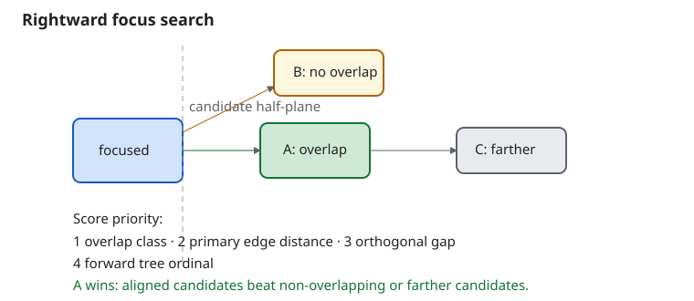

# Roo Windows Non-Touch Input and Keyboard Navigation Design

## Objective

Add framework-level support for non-touch displays to `roo_windows`, with
keyboard navigation as the first-class new input path and mouse / pointer
support as a later extension, while preserving the existing touch model and
embedded resource bounds.

## Motivation

Before this work, `roo_windows` contained many of the visual concepts needed
for non-touch interaction, but not the runtime machinery. It already:

- stored `hover` and `focused` bits on `Widget`,
- resolved hover, focus, selected, activated, dragged, and pressed overlays in
  the shared paint path,
- and several Material 3 component designs already referred to focused and hovered
  visuals.

At the same time, its runtime was explicitly touch-centric:

- `Application` owned a `TouchSensor` and a `GestureDetector`,
- the event loop drained only touch input,
- widget interaction was routed through touch gesture callbacks,
- there was no focus manager,
- there was no keyboard event model,
- there were no focus traversal contracts,
- and emulation was wired to a fake touch controller rather than host keyboard
  or mouse events.

That mismatch required more than a few key handlers. It required
framework-owned input routing, task-local focus and activation state, and
component-specific key behavior.

The existing semantic endpoint for simple controls is already `onClicked()`:
touch gesture recognition eventually schedules that callback through the
shared click-animation controller. Keyboard support therefore needs a second
way to reach the same endpoint, with keyboard-specific press and release
handling, but it does not need a new cross-input action taxonomy. Controls for
which a key means something other than click, such as sliders and text fields,
can express that meaning in `onKeyEvent()`.

## Background

**Status: Implemented with a scoped-focus follow-on.** Key acquisition,
task-local focus and traversal, simple-control activation, scroll/value-control
navigation, structured navigation surfaces, and hardware-keyboard text entry
are implemented. `FocusScope` is declared, but presenter-scope entry,
containment, exit, and restoration remain the P1.6b work specified by
[Transient surface hosting](../proposed/transient_surface_host_design.md).
Automatic popup source capture remains Future Work. The
[status index](../README.md) records the wider dependency state.

### Original Baseline in `roo_windows`

When this design was proposed in 2026-07:

- [src/roo_windows/core/application.h](../../../src/roo_windows/core/application.h)
  and [src/roo_windows/core/application.cpp](../../../src/roo_windows/core/application.cpp)
  owned the top-level event loop and routed only touch input.
- [src/roo_windows/core/touch_sensor.h](../../../src/roo_windows/core/touch_sensor.h)
  polled the underlying display for touch state and emitted `DOWN` / `MOVE` /
  `UP` samples.
- [src/roo_windows/core/gesture_detector.h](../../../src/roo_windows/core/gesture_detector.h)
  translated those raw samples into gesture callbacks such as `onDown()`,
  `onShowPress()`, `onSingleTapUp()`, `onDragStart()`, `onDrag()`,
  `onDragFinished()`, and `onFling()`.
- [src/roo_windows/core/widget.h](../../../src/roo_windows/core/widget.h) exposed a
  touch-oriented interaction surface. Its state bits included
  `kWidgetHover` and `kWidgetFocused`, but there were no public or protected
  mutators for either state and no focus traversal API.
- [src/roo_windows/core/widget.cpp](../../../src/roo_windows/core/widget.cpp)
  already accounted for hover and focus in overlay opacity, transient paint
  bounds, and invalidation.
- [src/roo_windows/core/task.h](../../../src/roo_windows/core/task.h),
  [src/roo_windows/core/task.cpp](../../../src/roo_windows/core/task.cpp),
  [src/roo_windows/core/main_window.h](../../../src/roo_windows/core/main_window.h),
  and [src/roo_windows/core/main_window.cpp](../../../src/roo_windows/core/main_window.cpp)
  already defined the active-layer routing boundaries for tasks, popups, and
  dialogs, but only for touch.
- [src/roo_windows/widgets/text_field.h](../../../src/roo_windows/widgets/text_field.h)
  and [src/roo_windows/widgets/text_field.cpp](../../../src/roo_windows/widgets/text_field.cpp)
  contained a shared `TextFieldEditor` and `KeyboardListener`, but they were
  wired to the on-screen [activities/keyboard.h](../../../src/roo_windows/activities/keyboard.h)
  surface, not to a hardware keyboard source.
- [src/roo_windows/material3/list/list.h](../../../src/roo_windows/material3/list/list.h)
  already carried `pressed`, `focused`, and `hovered` inside
  `ListEntryVisualContext`, proving that some families already expect focus and
  hover to exist as real runtime concepts.
- [emulation/main.cpp](../../../emulation/main.cpp) set up a fake touch controller
  for host emulation. It did not bind host keyboard or mouse events into the
  library.
- [library.json](../../../library.json) described the project as a
  touch-based UI library.

### Existing Local Seams Worth Reusing

Several local pieces already fit a keyboard-first extension.

1. [src/roo_windows/core/application_context.h](../../../src/roo_windows/core/application_context.h)
   established the pattern of centralized runtime services. The implemented
   model gives attached UI tasks their own focus manager and retains the
   context manager only as a compatibility fallback for legacy unattached
   routes.
2. [src/roo_windows/core/widget_event_dispatcher.h](../../../src/roo_windows/core/widget_event_dispatcher.h)
   already centralizes sparse widget-related event state in application-owned
   storage rather than charging every widget instance.
3. [src/roo_windows/core/click_animation.h](../../../src/roo_windows/core/click_animation.h)
   and the main-window-owned click animation pipeline already give the library
   a standard pressed-feedback path.
4. [src/roo_windows/core/widget.cpp](../../../src/roo_windows/core/widget.cpp)
   already has the shared invalidation and overlay math needed when hover or
   focus starts and stops.
5. The touch path itself worked and remains the touch path. It does not
   need to be redesigned into an abstract pointer engine before keyboard
   navigation lands.

### Local Design Signals That Already Acknowledge the Gap

Several local design docs explicitly assume touch-primary behavior or defer
keyboard / pointer focus routing:

- [material3_split_button_design.md](../proposed/material3_split_button_design.md)
  explicitly says v1 does not add per-segment hover or keyboard-focus routing
  because touch is still the primary interaction model.
- [material3_menus_design.md](../proposed/material3_menus_design.md) explicitly avoids a
  hover-only interaction model for embedded touch targets.
- [../implemented/material3_slider_design.md](../implemented/material3_slider_design.md) defers keyboard
  focus movement APIs beyond what the base framework supports.
- [material3_text_fields_design.md](../proposed/material3_text_fields_design.md) assumes
  focused and hovered visuals will eventually come from the framework's widget
  state model.

Those docs were reasonable when the base framework had no non-touch story.
This design fills that gap.

### Constraints

The new interaction model must respect four existing framework constraints.

1. Touch behavior must remain compatible.
   Existing touch-driven widgets, tests, and examples must not need a broad
   rewrite.
2. Hot interaction paths must avoid allocation.
   Focus changes, key dispatch, hover updates, click animation, and paint-time
   invalidation must stay allocation-free.
3. Layer ownership already matters.
   Tasks, popups, and dialogs are real routing boundaries in the current
   framework. Keyboard focus must obey those same boundaries.
4. Non-touch input sources are not display features.
   A hardware keyboard, keypad, rotary encoder, USB HID host, BLE remote, or
   host-emulator key stream must not be forced through
   `roo_display::Display`.

## Requirements

### Functional Requirements

1. A keyboard-only user must be able to operate the active UI without touch.
2. Each key route must retain one task focus owner. A window-hosted transient
   explicitly selects that task's manager and activates its presenter scope;
   focus or z-order must not choose the owner implicitly.
3. Focused widgets must show focused visuals through the shared widget-state
   model when their paint path uses that model.
4. Mixed-input systems must be supported: touch-only, keyboard-only,
   touch-plus-keyboard, and later keyboard-plus-pointer.
5. Activating a focused clickable from the keyboard must reach the same
   existing `onClicked()` semantic as a successful touch click.
6. Focus movement into an offscreen descendant must reveal that descendant in
   its nearest scroll container.
7. Hardware keyboard text entry must work without requiring the on-screen
   keyboard popup.
8. Existing touch input must keep working unchanged when no keyboard or
   pointer source is present.

### API Requirements

1. Input acquisition must become independent of the touch-capable display.
2. `Application` must support optional non-touch input sources without forcing
   existing touch-only callers onto a new construction pattern.
3. `Widget` must gain focusability, focus request, and key-event hooks.
4. `Widget` must gain real hover and focus mutators so the existing bits can
   become live state.
5. The framework must expose container override points for focus traversal and
   preferred initial focus.
6. The keyboard path must not synthesize fake touch coordinates.
7. The base framework must provide semantic defaults so simple clickables do
   not each need bespoke key handling.

### Embedded Constraints

1. Do not allocate on focus transfer, key dispatch, hover changes, paint, or
   pointer move.
2. Keep per-widget storage overhead small; retain routing and interaction state
   in task- or application-owned runtime services.
3. Preserve the current click animation and overlay invalidation behavior.

### Non-Goals for the First Implementation

The first keyboard-first rollout does not need to ship full desktop pointer
behavior.

The following are explicitly deferred:

- right-click context menus,
- drag-and-drop,
- mouse text selection,
- multi-pointer gesture support,
- a full accessibility tree or screen-reader surface,
- platform IME integration,
- and every desktop-specific shortcut convention.

Those may be useful later, but they are not required to make non-touch
displays usable.

## Design Overview

The design extends the framework in layers.

1. Retain the current touch pipeline for touch.
2. Route optional key sources through an application-owned input router to an
   explicitly selected task.
3. Give each task its own focus manager, editor, and keyboard-activation state;
   retain the application-context manager only for the legacy non-task path.
4. Extend `Widget` with focus and key-event hooks and reuse the existing click
   semantic for simple keyboard activation.
5. Roll out keyboard behavior across widget families incrementally.
6. Add mouse / pointer behavior later on top of the same focus and lifecycle
   model, while defining pointer routing only when it is implemented.

The key design rule is:

> Keyboard interaction is not modeled as synthetic touch.

Touch callbacks are coordinate-rich gesture callbacks with tap slop,
show-press, fling, and touch-target expansion semantics. Keyboard navigation
has none of those properties. The correct model is focus plus key dispatch,
with activation reusing the existing click semantic.

The implemented runtime shape is:

```text
TouchSensor -> GestureDetector -> touched widget path
KeySource   -> ApplicationInputRouter -> bound Task -> focus / key / click
```

Touch remains direct-widget routing. Keyboard adds focus and key routing; its
simple-control fallback joins the existing click path only after a valid
keyboard press-and-release lifecycle.

The retained touch path satisfies functional Requirement 8. Explicit
source-to-task routing and task-local state satisfy functional Requirements 1
and 2 and API Requirements 1 and 2. Widget hooks, component adoption, and
fallback activation satisfy the implemented portions of functional
Requirements 3 through 7 and API Requirements 3 through 7. P1.6b supplies the
remaining presenter containment and preferred-initial-focus behavior.

## Design Details

### Input Source Abstraction

The implemented [`KeySource`](../../../src/roo_windows/core/key_source.h) is a
non-blocking producer-owned source. `connect(Task&)` binds it explicitly to one
task in that task's application; a source and task each participate in at most
one route. `disconnect()` is idempotent, and the source destructor disconnects
automatically. A derived source stops and quiesces producer-specific callbacks
before base destruction disconnects its route; application destruction also
disconnects every source before destroying tasks.

The private application input router owns the incoming route list and performs
all draining and delivery on the UI thread. `drain()` preserves source order,
writes at most `max_events`, and leaves the remainder queued. `notifyReady()`
wakes the destination application after a producer makes input drainable. The
[physical input routing design](display_input_routing_design.md) defines the
connection, readiness, thread-affinity, and teardown contracts in full.

Each tick drains a four-event stack buffer at most four times. Consuming all
16 events schedules an immediate follow-up tick. This bounds input work per
tick without dropping queued events.

`Application` retains an overload that accepts a borrowed compatibility key
source and an explicit `enable_touch` flag. Multi-task code uses
`KeySource::connect(task)` for each additional explicit route.

Compatibility rule:

- existing `Application(env, display)` keeps its touch behavior,
- the compatibility `Application(env, display, keys, enable_touch)` overload
  routes `keys` to the latest task created through `addTask()`,
- new callers connect a `KeySource` to their selected task explicitly,
- callers with no touch hardware pass `enable_touch == false`.

The existing touch pipeline remains concrete. A general `TouchSource` is not
needed to add keyboard support, and a public pointer interface does not land
before pointer routing exists.

### Key Event Type

The exact `KeyCode`, `KeyPhase`, `PhysicalKey`, modifier, and `KeyEvent`
definitions live in
[`key_source.h`](../../../src/roo_windows/core/key_source.h). `KeyEvent` stores
phase, logical code, modifiers, physical-switch identity, and an optional
Unicode scalar in eight bytes.

The first keyboard pass only needs enough expressiveness for:

- focus traversal,
- activation,
- cancel / dismiss,
- value adjustment,
- text entry,
- and edit navigation.

Physical switch identity and logical meaning are distinct fields in one event.
A `kCharacter` down or repeat carries a Unicode scalar; every production
transition carries the `PhysicalKey` that pairs press, repeat, and release, and
`rune` is zero for other cases. Modifier bits are Shift, Control, Alt, and Meta.
Sources reject invalid Unicode scalar values. Space uses `KeyCode::kSpace`: an
editor consumes it as text, while other widgets use it only as an activation
key.

### Key Dispatch Order

The implemented ordinary-task route in
[`Task::dispatchKeyEvent()`](../../../src/roo_windows/core/task.cpp) is
target-first and consumption-based:

1. Deliver the event to the task's focused widget, then bubble it through that
   widget's ancestors, nearest first. The application-context focus target is
   used only for the legacy non-task route.
2. On an unhandled Back or Escape down, call `Task::requestBack()`. That method
   offers the window's root transient slot first, then the task's
   `NavigationHost`, then its optional task callback.
3. On an unhandled Tab down or repeat, traverse forward or backward according
   to Shift.
4. On an unhandled directional down or repeat, run geometry traversal.
5. On an unhandled Enter or Space transition, run the task's primary-activation
   fallback. Other keys remain unhandled.

This is the current pre-P1.6b order. Display-wide hosted presentation changes
Back and Escape ordering: while an eligible hosted root is active, the root
transient receives those keys before task-local widgets, navigation, or editor
fallback. It also absorbs ordinary keys from non-owner tasks and constrains
owner keys to the active presenter scope. Phase 3 of
[Transient surface hosting](../proposed/transient_surface_host_design.md)
implements and tests that delta; it does not retroactively describe the
current ordinary-task dispatcher.

Controls consume keys that have local meaning before traversal fallback. Text
editors consume character, caret, deletion, Home, End, Enter, and Space input.
Sliders consume directional value keys. Scroll containers consume scrolling
keys only when descendants and intervening ancestors leave them unhandled.

Repeat events are delivered to widget and ancestor handlers for repeated value
or scroll changes. Tab traversal also honors repeat; framework activation
continues to ignore repeat.

### Keyboard Activation Lifecycle

Each `Task` stores one armed-widget pointer and one physical-key identity;
widgets gain no per-instance key-state field.

- An unhandled Enter or Space down on an enabled clickable arms the focused
  widget and sets its pressed state.
- The matching key up activates only if the same widget is still focused,
  enabled, attached, and inside the active scope.
- Activation clears the armed and pressed state before queuing the existing
  click semantic through the shared click-animation controller, so the click
  callback can synchronously remove the widget safely.
- Focus change, scope change, disable, hide, detachment, destruction, or a
  mismatched release cancels the arm and clears pressed state.
- Repeat never activates or re-arms.

The primary action calls the existing show-press and single-tap-up hooks at the
widget's local center. Those hooks use the existing click-animation controller
and schedule exactly one existing `onClicked()` semantic.

### Runtime Interaction Ownership

The implemented ownership split follows the lifetime of each kind of state:

- `Application` owns the private input router and drains ready sources before
  pointer service and refresh.
- Each `Task` owns its `FocusManager`, `TextFieldEditor`, and incomplete
  Enter/Space activation.
- `Widget::focusManager()` resolves to the containing task's manager.
- `ApplicationContext::focus()` remains a compatibility fallback for widgets
  attached through the legacy `Application::add()` path, which does not create
  a `Task`.

This split lets multiple explicitly routed tasks retain independent focus and
edit state while keeping acquisition and producer teardown application-owned.
The touch pipeline remains unchanged.

### Focus Manager

The design assigns focus ownership to `FocusManager`. The implemented runtime
now gives each `Task` its own manager; the remaining extension is switching
that manager temporarily into a presenter-owned scope.

The current `FocusManager` owns:

- the currently focused widget,
- the current legal focus root, and
- the logic that validates whether a focus target is still visible,
  enabled, attached, and within the active scope.

Its implemented responsibilities are:

1. honor `requestFocus()` calls,
2. move focus forward, backward, or directionally,
3. clear focus when the widget is hidden, disabled, detached, or leaves the
   active scope,
4. and update the widget's focused bit.

P1.6b adds presenter-scope admission, entry, initial focus, exit, and
restoration without adding manager storage.

#### Focus Scope Storage and Resolution

Ordinary task content is the implicit base scope represented by the task
manager's existing focused-widget and legal-root pointers; `Task` embeds no
`FocusScope`. Each focus-capturing presenter embeds a `FocusScope` containing
its active root, its last focused descendant, and the base-task focus candidate
to restore. On a 32-bit target this costs 12 bytes per presenter and preserves
the declared `FocusScope`, `FocusManager`, and `Task` sizes. It avoids a focus-
history map, fixed unused capacity, and allocation during scope changes.

The manager admits a presenter scope only while its task-panel base root is
active. Same-owner host replacement can preflight the incoming scope against
the exact outgoing scope, but it still exits the outgoing scope before entering
the incoming one. The shared host's one-presentation limit therefore needs no
intrusive stack: the manager performs one base-to-presenter transition and the
matching presenter-to-base transition. Component-owned menu levels remain
inside the same presenter scope. A second independently owned focus scope is
rejected rather than pushed.

The record also exposes a zero-storage `clearRememberedFocus()` operation.
Every presenter operation that replaces, detaches, or deletes a descendant
calls it before changing an inactive scoped tree. The manager's ordinary
subtree-detachment notification covers current focus in the active tree. On
entry, the manager finds the remembered presenter address by scanning the
current live root before dereferencing it. On exit it performs the same scan in
the live base root before dereferencing the saved base-task address. An address
not found in the applicable tree is cleared. This keeps reopen memory without
registering inactive presenter scopes or retaining an arbitrary scope stack.

Ordinary task content supplies the base scope. An interactive transient does
not become a task: its shared host receives an existing interaction owner
explicitly, attaches a reusable structural boundary that resolves to that task,
and enters the presenter scope through that task's `FocusManager`. While
active, the scope root replaces the task panel as the manager's legal traversal
root. Even an empty active presenter scope suppresses the legacy
application-context focus fallback. The host exits the scope before detachment.
It never chooses the focused, topmost, or most recently touched task.

Persistent popup tasks already retain independent task-local focus. Merely
showing one does not redirect a physical source; `KeySource::connect()` remains
the explicit routing operation. The built-in on-screen keyboard routes semantic
text through the editor connection rather than stealing the editor task's
physical-key focus. Automatic popup route switching is outside this design and
is recorded in Future Work.

#### Presenter Initial Focus (P1.6b)

When a presenter scope becomes active, the manager chooses initial
focus in this order:

1. previously focused descendant within that same scope, if still valid,
2. the scope root's preferred focus child, if one is supplied,
3. otherwise the first focusable descendant in traversal order.

This gives dialogs, menus, and structured surfaces a zero-storage hook for
sensible default focus without putting component policy in the task manager.

#### Mixed-Input Behavior

Touch and keyboard continue to use distinct routes. Ordinary touch activation
does not implicitly move keyboard focus. A text field explicitly requests its
task's focus when editing begins; other components request focus only when that
behavior is part of their own contract. Hover does not imply focus, and focus
remains sticky until an explicit focus change, presenter-scope change, or target
invalidation. Future primary-pointer routing defines its own focus-transfer
policy with the pointer API.

#### Focus Lifetime and Tree Mutation

Raw focus pointers require mandatory lifecycle notification.
`Container::detachChild()` calls
the containing `Task::onSubtreeDetaching(child)` before changing parent links
or applying parent-owned deletion. While the tree is intact, the task cancels
an armed descendant and editor session, and its manager clears a focused
descendant and removes focused visual state. The context manager receives the
same notification for the legacy non-task path.

`Widget::~Widget()` calls `FocusManager::onWidgetDestroying(*this)` as an
exact-match fallback before sparse event handlers are removed. Normal attached
subtree removal still uses the pre-detachment path because that path can see and
clear descendant state while parent links remain intact.

Visibility and enabled-state changes notify the manager before applying the
transition. When the changed subtree contains focus, the manager clears focus.
P1.6b scope exit clears visible presenter focus, remembers that presenter
target, and restores a validated base target. The remembered presenter target
persists until explicit inactive-tree invalidation or scope destruction.

A focus target is eligible only when it is focusable, has non-empty laid-out
bounds, remains attached below the active scope root, and it and every ancestor
through that root are visible and enabled.

### Widget Contract Changes

`Widget` already stored focus and hover bits. Its implemented public contract in
[`widget.h`](../../../src/roo_windows/core/widget.h) now provides
`isFocusable()`, boolean `requestFocus()`, `onFocusChanged()`, `onKeyEvent()`,
`setFocused()`, and `setHover()`.

If an eligible focused widget leaves Enter or Space unhandled, the framework's
keyboard-activation fallback:

- verifies that the widget is clickable and enabled,
- shows pressed / click animation feedback from the widget's local center,
- and queues the existing `onClicked()` semantic through the same
  main-window-owned click-animation controller used by touch.

This fallback is framework dispatch logic, not a new virtual widget action.
Widgets override `onKeyEvent()` only when their keys have control-specific
meaning. For example, a slider handles arrows and Home / End directly, while a
text field handles editing keys and characters directly. Touch continues to
reach `onClicked()` through gesture recognition, so an input-origin parameter
would have no truthful role in this design.

The focus and hover mutators reuse the same invalidation and
interaction-bounds logic already used by pressed, selected, activated, and
dragged state.

The base framework must not try to emulate keyboard interaction by injecting
fabricated touch streams. That would
incorrectly reuse touch-specific semantics such as tap slop, show-press timing,
sloppy hit bounds, and fling recognition.

### Traversal Model

The focus manager provides a default traversal model plus a small set of
container enumeration and reveal hooks.

#### Forward / Backward Traversal

Tab uses depth-first child storage order and Shift+Tab uses reverse child
storage order over eligible descendants. Traversal wraps within the active
scope; a scope with one eligible widget retains it.

#### Directional Traversal

Directional traversal performs one allocation-free tree scan. Candidates must
lie in the requested half-plane relative to the focused bounds' center. The
score is the lexicographic tuple:

1. `0` for overlap on the orthogonal axis, otherwise `1`,
2. primary-axis edge distance,
3. orthogonal-axis gap,
4. forward traversal ordinal.

Directional traversal does not wrap. The traversal ordinal makes ties
deterministic without storing a candidate vector.



This makes D-pad and arrow-key navigation work on lists, menus, grids, and
split layouts without every container needing a bespoke neighbor table.

#### Container Override Points

`Widget::focusChildCount()` and `focusChildAt()` expose the allocation-free
traversal tree, while `revealFocusedDescendant()` lets a clipping container
handle reveal. Components that need roving or control-specific movement consume
the corresponding key in `onKeyEvent()` before framework traversal. P1.6b adds
only `preferredFocusChild()` for presenter initial-focus selection; it does not
add a generic `nextFocusable()` contract.

#### Focus Reveal

When focus moves to a descendant inside a clipped scroll container, the nearest
scrollable ancestor must reveal it.

This is required for keyboard-only usability.

After transfer, the manager walks outward from the target. The first ancestor
whose `revealFocusedDescendant()` returns true owns the reveal. A scroll
container performs the minimum scroll needed to expose the full target when it
fits; when the target exceeds the viewport, it exposes the target's leading
edge.

### Component Adoption Strategy

The core framework supplies routing and focus mechanics; widget families add
their own control semantics where the simple-click fallback is insufficient.

#### Simple Clickables

This includes:

- legacy buttons,
- Material 3 buttons and icon buttons,
- FABs,
- checkboxes,
- radio buttons,
- switches,
- dialog footer buttons,
- and simple navigation items that already route through
  `setOnInteractiveChange()`.

The implemented base behavior gives these controls keyboard support with
minimal component-specific code:

- become focusable,
- accept the shared Enter / Space activation fallback,
- and rely on the shared focused / pressed visuals.

This is the highest-value early adoption slice.

#### Value Controls

Sliders and similar controls need more than primary activation.

Affected surfaces include:

- [src/roo_windows/widgets/slider.h](../../../src/roo_windows/widgets/slider.h),
- [src/roo_windows/material3/slider/slider.h](../../../src/roo_windows/material3/slider/slider.h),
- [src/roo_windows/material3/slider/range_slider.h](../../../src/roo_windows/material3/slider/range_slider.h),
- and scroll containers such as
  [src/roo_windows/containers/scrollable_panel.h](../../../src/roo_windows/containers/scrollable_panel.h).

They implement control-specific keyboard handling in `onKeyEvent()`:

- Left / Down -> decrement,
- Right / Up -> increment,
- Home / End -> min / max,
- PageUp / PageDown for coarse movement where appropriate,
- and focus reveal inside scrolling parents.

Touch-scroll handlers alone are not enough because they assume pointer
motion rather than discrete value deltas.

#### Text Entry

Text entry has its own task-local editor. The implemented editor provides:

- shared mutable editing state,
- cursor blink scheduling,
- insertion of printable runes,
- caret movement with Left / Right,
- Home / End,
- selection extension with Shift,
- Enter / commit,
- forward Delete and backward deletion,
- and task-local focus-versus-edit ownership.

The implemented policy is:

- when an editable text field gains focus, it enters edit mode immediately,
- typed characters go straight to the shared editor,
- Tab and Shift+Tab move focus out of the field,
- Enter confirms,
- Escape or Back cancels editing and remains unhandled for task-level Back,
- and hardware-key focus does not automatically show the software keyboard.

This preserves the current touch-only software-keyboard path while making the
field usable on keyboard-only targets.

#### Compound and Structured Controls

Compound families require component-owned policy because they do not naturally
fall out of the simple clickable model.

1. Dialogs

   Legacy [Dialog](../../../src/roo_windows/dialogs/dialog.h) participates in
   the root Back slot but retains its direct compatibility structure and does
   not gain a presenter scope. New Material 3 dialogs gain focus containment,
   initial focus, keyboard button traversal, and Escape dismissal through
   P1.6b hosting and the
   [Material 3 dialog design](../proposed/material3_dialogs_design.md).

2. Lists and list-derived navigation surfaces

   [List](../../../src/roo_windows/material3/list/list.h) drives focused state
   into each row's resolved visual context and consumes component-specific
   navigation keys. Focus and selection remain distinct.

3. Menus, tabs, drawers, rails, and bars

   Implemented tabs, navigation bars, rails, and the existing composite menu
   consume component-specific movement where needed and preserve the
   distinction between focused and selected destinations. The proposed
   Material 3 menu uses the P1.6b presenter scope.

4. Childless compound widgets

   [material3_split_button_design.md](../proposed/material3_split_button_design.md)
   explicitly deferred per-segment hover and keyboard-focus routing because the
   framework had no such model.

   Its component design owns the remaining choice of real child focus targets
   or another bounded representation. The keyboard core does not invent
   virtual focus nodes before that consumer closes the decision.

### Task, Popup, and Dialog Integration

Focus ownership must align with the existing layer model.

Primary implementation surfaces are:

- [src/roo_windows/core/main_window.h](../../../src/roo_windows/core/main_window.h),
- [src/roo_windows/core/main_window.cpp](../../../src/roo_windows/core/main_window.cpp),
- [src/roo_windows/core/task.h](../../../src/roo_windows/core/task.h),
- [src/roo_windows/core/task.cpp](../../../src/roo_windows/core/task.cpp),
- [src/roo_windows/core/navigation_host.h](../../../src/roo_windows/core/navigation_host.h),
- and [src/roo_windows/dialogs/dialog.h](../../../src/roo_windows/dialogs/dialog.h).

The integration rules are:

1. A task's permanently attached `TaskPanel` is its manager's implicit base
   root; replacing navigation content does not replace that root.
2. Hiding, disabling, detaching, or deleting focused task content clears its
   focused descendant.
3. P1.6b dialogs and menus explicitly select an interaction-owner task and
   enter their presenter scope through that manager.
4. Closing a hosted presenter restores focus through the same manager's base
   task scope when possible.
5. Persistent popup tasks retain independent focus, and visibility does not
   redirect a connected physical source.
6. Every focus request, including one initiated by a touch-aware component,
   remains constrained by that manager's active legal root.
7. Legacy dialogs retain the direct compatibility path and therefore do not
   gain P1.6b focus containment or restoration.

### Emulation and Platform Work

The implemented host seam is
[`FltkKeySource`](../../../fake/roo_windows/fake/fltk_key_source.h). It converts
host key events into the same bounded source contract and uses the shared
native-host handoff described by the physical input routing design. Examples
pass that source through the compatibility constructor; their first UI
`addTask()` becomes its destination, providing an end-to-end keyboard smoke
path in the emulator. Multi-source applications use explicit `connect()` calls.

On real hardware, different devices can provide these new sources:

- matrix keypads,
- rotary encoders with push action,
- USB HID host keyboards,
- BLE remotes,
- or board-specific GPIO button clusters.

Those integrations implement `KeySource`. They do not extend the meaning of
`roo_display::Display`.

## Proposed API

The authoritative implemented declarations are:

- [`key_source.h`](../../../src/roo_windows/core/key_source.h) for `KeyCode`,
  `KeyPhase`, `PhysicalKey`, modifiers, `KeyEvent`, and the source-owned
  `connect()` / `disconnect()` / readiness contract;
- [`widget.h`](../../../src/roo_windows/core/widget.h) for focusability, focus
  requests and notifications, key handling, focus-child enumeration, reveal,
  and focus/hover state mutation;
- [`focus_manager.h`](../../../src/roo_windows/core/focus_manager.h) for current
  task-local focus, traversal, eligibility, and lifecycle cleanup;
- [`task.h`](../../../src/roo_windows/core/task.h) for the task-owned focus
  manager, editor, key dispatch state, and semantic Back entry point; and
- [`application.h`](../../../src/roo_windows/core/application.h) for the
  touch-only and compatibility key-source constructors.

This document does not duplicate those declarations because their physical-key
and source-lifetime details have evolved since the initial proposal. P1.6b's
zero-storage `FocusManager` accessors, one-level `FocusScope` operations, and
`Widget::preferredFocusChild()` are specified in the
[Transient surface hosting Proposed API](../proposed/transient_surface_host_design.md#proposed-api).
No pointer API lands before working pointer routing exists.

### Migration and Compatibility

The migration preserves current touch-only callers.

Compatibility rules:

1. Existing `Application(env, display)` continues to work.
2. If no key source is provided, behavior is unchanged.
3. Existing touch-driven widgets keep their current touch semantics.
4. Explicit `KeySource::connect(Task&)` is the current multi-task routing API;
   the constructor overload remains a compatibility convenience.
5. Widgets that do not override new key hooks still compile and remain
   keyboard-inert unless the base semantics already make sense.

The important compatibility goal is behavioral, not just source-level:
touch-only UIs retain their existing interaction behavior after the
keyboard-first core lands.

## Implementation Plan

Authoring references: follow the
[embedded C++ code authoring instruction](../../../.github/instructions/embedded-cpp-code-authoring.instructions.md)
and the
[roo_windows widget authoring instruction](../../../.github/instructions/roo-windows-widget-authoring.instructions.md).

### Phase 1: Key Acquisition — Implemented

Add `KeySource`, bounded draining, optional keyboard-only construction, source
tests, and host-emulator source plumbing.

Proposed commit message:

> Non-touch input phase 1: add bounded key acquisition
>
> Add bounded borrowed key input, keyboard-only application construction,
> emulator wiring, and focused acquisition tests from the non-touch input
> design.

Validation: run the new key-source target and build the emulator.

The later
[physical input routing design](display_input_routing_design.md) replaced
constructor-only borrowing with explicit source-owned task connections and
readiness notification; it is the authoritative routing contract.

### Phase 2: Focus Manager and Widget State Plumbing — Implemented Base

Add task-local focus ownership, lifecycle notifications, eligibility checks,
focus state hooks, traversal, and the declared presenter record. Tests detach,
delete, hide, and disable focused descendants from inside callbacks. Active
base-to-presenter entry/exit, restoration, and inactive-scope memory clearing
remain the P1.6b Phase 1 slice in the transient-host plan.

Proposed commit message:

> Non-touch input phase 2: add lifecycle-safe focus ownership
>
> Add task-local focus ownership, framework focus state plumbing, mandatory
> tree-mutation notifications, allocation-free traversal, and mutation-focused
> tests from the non-touch input design without increasing base widget size.

Validation: run focus-manager, widget, container, and task targets.

### Phase 3: Simple Clickables and Key Dispatch — Implemented

1. Route task keys target-first and bubble unhandled events through ancestors.
2. Make simple clickables focusable by default.
3. Map a matching Enter / Space press and release to the existing click
   semantic.
4. Add Tab, Shift+Tab, and directional traversal.

This delivers the first end-to-end keyboard story for common buttons. Hosted
dialog focus containment is deliberately not claimed by this phase: P1.6b adds
the manager mechanics, and the Material 3 dialog phase adopts them. Legacy
dialogs retain the compatibility behavior described above.

Proposed commit message:

> Non-touch input phase 3: route keys and activate focused controls
>
> Add target-first routing, deterministic traversal, release-based activation,
> examples, and interaction tests from the non-touch input design.

Validation: run key-source, task, focus-manager, button, click-animation, and
emulator targets.

### Phase 4: Scroll Containers and Value Controls — Implemented

1. Add focus reveal to scroll containers.
2. Add keyboard scrolling to scrollable panels where appropriate.
3. Add increment / decrement / min / max key handling to sliders and range
   sliders.
4. Make switches, checkboxes, and radio buttons keyboard-operable.

This phase makes settings-style UIs viable without touch.

Proposed commit message:

> Non-touch input phase 4: navigate value and scroll controls
>
> Add focus reveal, keyboard scrolling, value-control key behavior, component
> examples, and boundary and repeat tests from the non-touch input design.

Validation: run slider, scroll-container, simple-control, traversal, and
emulator targets.

### Phase 5: Existing Structured Navigation Surfaces — Implemented

1. Add list row focus policy and visual-context plumbing.
2. Add keyboard navigation to the existing composite menu.
3. Add tabs, navigation bar, and navigation rail traversal policy.
4. Use real child focus for the implemented compound controls that require it.

This phase turns the keyboard core into a real application-navigation model.
Material 3 menus, drawers, and other new presenters retain adoption work in
their component designs.

Proposed commit message:

> Non-touch input phase 5: add structured keyboard navigation
>
> Add list visual focus, menu and destination traversal, compound-control
> adoption, component examples, and focus-versus-selection tests from the
> non-touch input design.

Validation: run list, menu, navigation-family, traversal, and emulator targets.

### Phase 6: Text Entry — Implemented

1. Expand `TextFieldEditor` to support caret movement and selection by key.
2. Add hardware-keyboard text editing policy to text fields.
3. Keep software-keyboard behavior intact for touch-only targets.
4. Make editable fields enter edit mode immediately on hardware-key focus;
   keep read-only fields focusable without entering edit mode.

This phase makes the library genuinely usable on keyboard-only displays rather
than only navigable.

Proposed commit message:

> Non-touch input phase 6: edit text from hardware keyboards
>
> Extend the shared editor with Unicode entry, caret and selection movement,
> commit and cancel policy, mixed-input examples, and editor tests from the
> non-touch input design.

Validation: run text-field, keyboard-activity, key-dispatch, back-dispatch, and
emulator targets.

## Testing Plan

Core validation covers:

1. focus state transitions,
2. focus changes across task and popup boundaries plus P1.6b presenter-scope
   entry, exit, and restoration,
3. Tab and directional traversal,
4. focus reveal inside scroll containers,
5. keyboard primary-action dispatch,
6. slider and value-control keyboard behavior,
7. text-field editing by hardware keyboard,
8. and emulator smoke coverage for host keyboard input.

Each implemented phase runs the existing touch tests for the components it
changes. The emulator supplies the end-to-end host-keyboard smoke path. Current
compile-time checks bound `sizeof(Widget)` and `sizeof(KeyEvent)`. P1.6b adds
target-ABI probes showing that repurposing the third `FocusScope` pointer and
exposing the current legal root do not change `FocusManager`, `FocusScope`, or
`Task` size.

## Caveats

Directional traversal is an O(n) scan. Key events are infrequent and embedded
interfaces normally contain few focusable widgets, so constant storage is
preferred over neighbor tables or cached vectors.

Ordinary task dispatch currently offers Back and Escape to the focused widget
before calling `Task::requestBack()`. P1.6b intentionally changes that order
while a hosted root is active so the eligible root transient wins before a
task-local editor or other content. Tests must cover both orders rather than
treating the P1.6b rule as already implemented everywhere.

### Rejected Alternatives

#### Model Keyboard as Synthetic Touch

Rejected because touch callbacks are not generic activation callbacks.

Touch has:

- coordinates,
- slop thresholds,
- show-press timing,
- long-press promotion,
- scroll deltas,
- fling velocity,
- and sloppy hit-target expansion.

Keyboard navigation has none of those properties. Synthesizing fake touch would
hide the real missing abstraction, which is focus plus key dispatch. Simple
keyboard activation can reuse the existing click semantic after dispatch has
validated the keyboard lifecycle.

#### Put Keyboard and Mouse APIs on `roo_display::Display`

Rejected because non-touch inputs often come from devices unrelated to the
display itself.

The right abstraction boundary is producer-owned input sources routed by the
application, not a display object that suddenly becomes a keyboard host.

#### Let Every Widget Family Invent Its Own Local Focus Model

Rejected because focus scope, modality, and traversal must work across the
whole active UI tree, not only within one component family.

Each key route needs one task-local focus owner, and a hosted presenter must use
that same explicit owner. Component-local policy builds on that owner instead
of creating an unrelated focus service.

#### Delay Keyboard Until Mouse Is Also Ready

Rejected because keyboard navigation is the smallest change that makes
non-touch displays useful.

Mouse support is valuable, but it brings hover routing, wheel policy, and
desktop-specific interaction questions that are not required to unblock the
user's immediate need.

#### Force Every Popup to Capture Focus

Rejected because a persistent popup is already a separate task with independent
focus, while physical input stays on the task selected by
`KeySource::connect()`. The built-in on-screen keyboard sends semantic text to
its connected editor and does not require a global focus-capture enum. An
automatic route-switching policy waits for a concrete popup consumer.

#### Store Remembered Focus in a Hash Map

Rejected because scope changes would allocate or require fixed unused
capacity. The scheduled host charges one fixed three-pointer record only to a
focus-capturing presenter, reuses its third pointer to remember displaced base
focus, and supports exactly one presenter scope above the task's implicit base.

#### Activate on Key Down

Rejected because it cannot represent Space's held pressed state and makes key
repeat prone to duplicate actions. Arm-on-down and activate-on-up provide a
defined cancellation point.

#### Add Pointer APIs Before Pointer Routing

Rejected because an unimplemented API would freeze an unvalidated contract.
Pointer types land together with working routing and tests.

## Future Work

Pointer and mouse support adds pointer acquisition, hover routing,
primary-button focus transfer, wheel bubbling, and emulator coverage on top of
the focus and key-routing contracts defined here. Platform IME,
accessibility, context menus, drag-and-drop, and mouse text selection remain
separate designs.

Persistent popup tasks can gain automatic physical-source capture only after a
concrete consumer defines when a visible popup redirects a source, how the
previous task route is restored, and how source and task teardown cancel that
transition. Until then, visibility does not change `KeySource::connect()`.

A packaging follow-up will update [library.json](../../../library.json), README
text, and usage documentation to advertise keyboard-only and mixed-input use
now that the runtime and emulator paths are implemented. This is a discovery
gap, not a runtime dependency. Childless compound controls such as split
buttons retain their component-owned focus-granularity decision.
