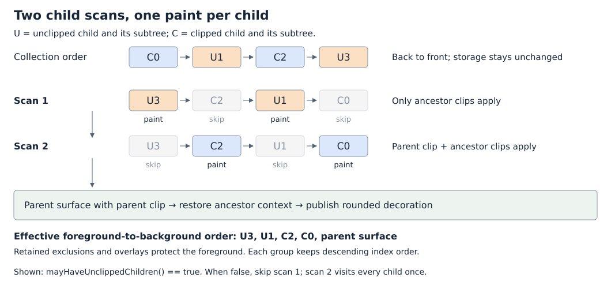
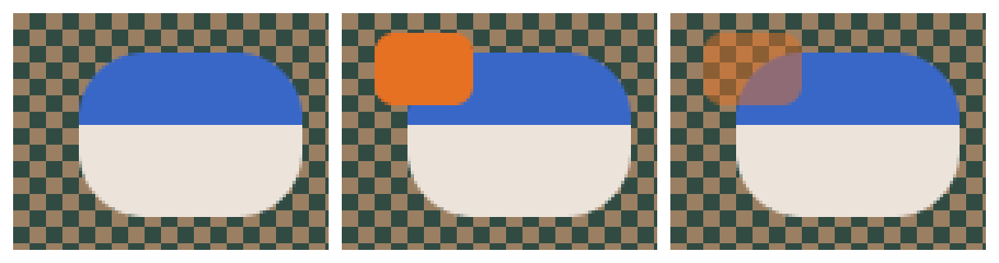

# Unclipped children above clipped siblings

**Status: Implemented; all three original phases are complete.**
Updated on 2026-10-05 for the [synchronous production baseline](../in_progress/rounded_child_clipping_design.md#p0-align-rounded-state-with-synchronous-painting).
Grouping and mask bypass remain; saved traversal progress and interruption
support have been removed. The Implementation Plan records the original stages.
This extends the
[sparse rounded child clipping prototype](../prototypes/rounded_child_clipping.md).
It does not revive the [abandoned corner capture design](../abandoned/rounded_child_clipping_design.md).

## Objective

Place explicitly unclipped children above clipped siblings in every container,
while allowing them to escape a rounded parent with smooth boundaries, low RAM
use, and one display write per settled pixel.

## Motivation

A menu needs to clip its scrolling rows to its rounded outline, while an
explicitly unclipped child can need to display an overhanging badge or control
feedback. Before this design, the prototype clipped both kinds of child.

Requiring authors to insert every unclipped child above every clipped child
would reject harmless arrangements of disjoint siblings. Instead, this design
makes unclipped children a foreground group during traversal. Authors keep
their child collections in their existing layout order.

## Background

The [paint context design](../implemented/paint_context_design.md) describes
foreground-to-background painting: completed opaque output creates exclusions,
and translucent decorations remain overlays above subsequent drawing. The
[current paint contract](../README.md#current-paint-contract) defines their
synchronous lifetime. Shared terminology is in the
[design glossary](../glossary.md); widget contracts are in the
[widget-authoring instructions](../../../.github/instructions/roo-windows-widget-authoring.instructions.md).

Before this design, [`Container::paintChildren()`](../../../src/roo_windows/core/container.cpp)
visits children from highest index to lowest. `ParentClipMode::kUnclipped`
skips the immediate parent's rectangular canvas clip. Ancestor clips remain
in force. Some controls, including
[`RadioButton`](../../../src/roo_windows/material3/radio_button/radio_button.h),
already use that mode by default.

The prototype wraps all of an opted-in container's contents in
[`RoundedClipOutput`](../../../src/roo_windows/core/rounded_clip.h). Fractional
boundary colors accumulate before the parent's coverage is applied. Deferred
child overlays and exclusions also reference the active rounded mask. Skipping
just the rectangular canvas clip therefore does not allow rounded overflow.

Arbitrary interleaving is harder than bypassing that output adapter. Suppose a
clipped red child is in front of an unclipped blue child, at a pixel with 50%
parent coverage. Red is buffered, but bypassing the adapter could emit blue and
exclude the pixel before red is published. Putting blue in the same buffer
would incorrectly apply the parent's coverage to blue as well. Grouping all
unclipped children in front removes this case.

## Requirements

1. Explicitly unclipped children escape their immediate parent's clip while
   respecting ancestor clipping.
2. Antialiased child and parent boundaries retain correct composition, including
   translucent foreground decorations and overlapping rounded ancestors.
3. Each child belongs to one drawing pass. The algorithm does not replay child
   painting to reconstruct corners or overwrite settled pixels.
4. Additional traversal storage is independent of child count and pixel area.
   Ordinary widgets and containers acquire no new instance fields.
5. Paint order, touch precedence, and restoration of uncovered content agree.
   Disjoint siblings require no author-enforced insertion order.
6. Each refresh finishes both groups and the surface. Later refreshes rebuild
   changed content without reusing stale colors or deferred source references.
7. The unclipped-above-clipped order applies to every container. Components
   that guarantee all their direct children are clipped retain a single child
   scan.

## Design Overview

Every container that may have unclipped children has two **child groups**,
derived from each direct child's existing `ParentClipMode`. A group includes
that child's entire subtree:

- **Unclipped group:** above all clipped siblings; bypasses this parent's clip.
- **Clipped group:** below the unclipped group; obeys this parent's clip.

Within each group, the highest child index is still foremost. The child vector
is never rearranged. Grouping is independent of
`clipsChildrenToRoundedBounds()` and therefore remains stable across changes to
a container's shape or clipping policy. Layout and keyboard focus traversal
retain collection order.

`Container::mayHaveUnclippedChildren()` is a constant-time virtual capability
query, defaulting to `false`. A false result guarantees that every direct child
is clipped in every supported configuration. The renderer skips the unclipped
scan and visits all children once under the parent's clip. A true result permits
unclipped children and selects two filtered scans; it does not assert that any
unclipped child currently exists.

`Panel` and all other containers accepting caller-provided children return
`true`. Built-in components that control their direct children's configuration
keep the default or explicitly override an inherited true result with false.
The child-paint hook is invoked once per selected child during a synchronous
paint. There is no second traversal of a completed subtree.



For example, children stored back-to-front as `C0, U1, C2, U3` paint in the order
`U3, U1, C2, C0`, followed by the parent's surface. `U` denotes unclipped and
`C` denotes clipped. For a
[`Panel`](../../../src/roo_windows/core/panel.h) subclass containing a clipped
scrolling body and an unclipped badge, the badge paints above the body regardless
of which was added first. Each group's internal order still matters.

Unclipped opaque pixels use ordinary foreground exclusions. Their translucent
edges remain foreground overlays. Clipped children use the existing sparse
boundary buffer underneath those contributions. This satisfies the composition
and RAM requirements without an additional boundary color array.

## Design Details

### Declaring whether unclipped children are possible

Treat `false` as a correctness promise, not a best-effort optimization hint.
The promise concerns direct children only: a clipped direct child containing
unclipped descendants does not require its parent to return true. Conversely,
a fixed number of children or a restricted child type does not prove that their
clip modes are controlled by the container.

Use constant overrides describing every supported configuration. Do not scan
children, maintain a count, or return false just because the current collection
is empty or currently all clipped. Returning true unnecessarily costs the extra
scan; returning false incorrectly can clip a child that should escape. A debug
assertion in the existing single scan checks each visited child's mode without
adding a validation traversal. It is an authoring error to violate the promise.

The implementation audit must cover all child-accepting APIs, including borrowed
children, typed children, model-provided slots, and mutable child accessors. The
current source identifies these override responsibilities:

| Container family | Required declaration |
| --- | --- |
| [`Panel`](../../../src/roo_windows/core/panel.h) and its general layout subclasses, including `ListLayout`, `FlexLayout`, and `TaskPanel` | `Panel` overrides true; subclasses inherit it. Returning false instead requires control of every direct child's clip mode. |
| [`Holder`](../../../src/roo_windows/containers/holder.h), [`SimpleScrollablePanel`](../../../src/roo_windows/containers/scrollable_panel.h), [`BlitCacheContainer`](../../../src/roo_windows/containers/blit_cache_container.h), [`HorizontalPageHost`](../../../src/roo_windows/containers/horizontal_page_host.h) | Override true for caller-provided content/pages; `ScrollableBlitPanel` inherits true. |
| [`MainWindow`](../../../src/roo_windows/core/main_window.h), [`TransientHostLayer`](../../../src/roo_windows/core/transient_surface_host.h) | Override true for supplied task/popup/presentation content; `MainWindow` preserves pin placement while adopting the same group order. |
| [`LayoutScaffold`, `PaneLayout`, `GridLayout`](../../../src/roo_windows/material3/layout_scaffold/layout_scaffold.h); [`AppBar`, `SearchBar`, `SearchAppBar`](../../../src/roo_windows/material3/app_bar/app_bar.h); [`DialogScaffold`](../../../src/roo_windows/material3/dialog/dialog_scaffold.h) | Override true for arbitrary slots, body, or derived chrome. Derived hosts such as `SnackbarHost` inherit true. |
| [`ExpandablePanel`, `ListEntry`, `List`](../../../src/roo_windows/material3/list/list.h); [`MenuGroup`](../../../src/roo_windows/material3/menu/menu.h), [`MenuGroupStack`, `MenuOverlay`](../../../src/roo_windows/material3/menu/menu_surface.h) | Override true for supplied contents, item slots, rows, groups, or panels. |
| [`Tabs`](../../../src/roo_windows/material3/tabs/tabs.h), Material 3 [`NavigationBar`](../../../src/roo_windows/material3/navigation_bar/navigation_bar.h) and [`NavigationRail`](../../../src/roo_windows/material3/navigation_rail/navigation_rail.h) | Override true even though accepted child types are restricted: callers can configure their clip modes. |
| [`SnackbarWidget`](../../../src/roo_windows/material3/snackbar/snackbar.h), [`DialogActionStrip`](../../../src/roo_windows/material3/dialog/dialog_scaffold.h) | Return true conservatively because mutable control accessors expose direct children; ownership alone does not guarantee clipped modes. |
| [`MenuPanel`](../../../src/roo_windows/material3/menu/menu_surface.h), [`DatePickerPanel`](../../../src/roo_windows/material3/date_picker/date_picker_internal.h) | Retain false for their internally controlled direct children. In particular, `MenuPanel` owns its clipped viewport; arbitrary menu rows are descendants of that viewport. |

Inherited true implementations satisfy the contract without redundant overrides.
A new subclass exposing arbitrary child insertion must override a false base
implementation. A component with even one deliberately unclipped internal child
also returns true. Document these rules with the widget-authoring guidance when
the API lands; keep fixed components' child configuration covered by tests.

### Paint traversal and clip lifetime

Separate preparing a retained rounded record from activating its mask. Prepare
or find the owner's record before either child pass, but leave the incoming
canvas output and active ancestor mask unchanged during the unclipped pass.
Record preparation alone must not mask exclusions or accumulate overlays.
A fresh owner record still triggers the prototype's owner-surface invalidation
and child traversal, even when only the backdrop changed. Make that decision
explicit instead of relying on this owner already being the active mask.

Evaluate `mayHaveUnclippedChildren()` once when selecting each child traversal.
For a rounded-clipping owner, the effective operation order is:

```text
prepare this owner's retained record, without activating its mask
invoke the virtual paintChildren(ctx) hook once when child traversal is needed
  when mayHaveUnclippedChildren() is true:
    pass 1: paint unclipped direct children using the incoming context
  activate this owner's mask and output adapter
    true: pass 2 paints only clipped children using the parent-bounded context
    false: one scan paints all children using the parent-bounded context
  restore the incoming context
activate this owner's mask and output adapter for its own surface paint
restore the incoming context
publish the completed rounded decoration through the ancestor context
```

The conditional child loops live in the base `Container::paintChildren()`
implementation. The false path skips both the first loop and release-build mode
filtering in the remaining loop; debug mode assertions run during that loop.
The owner-surface path establishes its own short scope over the same retained
record after the child hook returns. Both scopes reuse the existing boundary
colors; activation does not reset them. Scope guards restore canvas output and
the active mask on scope exit.

This preserves the one-call contract for overrides such as
[`ListLayout::paintChildren()`](../../../src/roo_windows/containers/list_layout.h),
which synchronizes visible children before delegating to the base. An override
that performs child painting itself must use the same group order and clip
scopes. Existing custom traversal sites must be audited in the implementation;
calling the whole virtual hook twice is not the algorithm.
[`MainWindow`](../../../src/roo_windows/core/main_window.cpp) keeps its
presentation-pin and root-layer behavior while grouping its direct children.

Direct writes, deferred overlays, and exclusions must observe the same active
mask at each step. An unclipped child can itself create a rounded scope; its
mask then links directly to the active ancestor, skipping this parent. The
retained `RoundedClip::parent` links are fixed for the current paint. Temporarily
rewriting those links would change the meaning of already retained exclusions.

The parent surface remains below both child groups. Its boundary composition,
outline, and shadow use the existing rounded decoration. Immediate child-shadow
and blit shortcuts remain disabled where the prototype already disables them;
this change adds no bypass around their mask-safety checks.

### Why one boundary buffer remains sufficient

Let `C` be the completed clipped content, including the opaque parent fill;
`a` the parent's coverage; and `B` the scene behind the parent. The existing
boundary result is `R = a*C + (1-a)*B`.

An unclipped foreground contribution with color `U` and opacity `u` produces:

$$
F = u U + (1-u)\left[a C + (1-a)B\right].
$$

The ordinary foreground compositor already provides that outer operation.
When `u = 1`, it can emit and exclude the pixel before processing lower content.
When `0 < u < 1`, it retains an overlay until lower content supplies the final
color. The unclipped contribution never enters this parent's boundary buffer.
Ancestor masks still apply to the resulting group through the existing nesting
mechanism.



In this reference image, left to right: the clipped group alone, an opaque
unclipped foreground child, and the same child at 50% opacity. The
[figure generator](figures/rounded_unclipped_children_figures.py) uses 16-by-16
subpixel area samples and the formula above, then enlarges pixels without
interpolation. This is an illustrative composition reference, not captured
renderer output. Implementation tests use the existing
`Decoration` coverage routine for exact pixel expectations.

### Touch order and invalidation

Use one internal group-order convention for all sibling-order decisions. Paint
and touch searches visit the unclipped group first, then the clipped group,
with descending indices inside each group. Background invalidation traverses
the reverse: clipped group first, then unclipped group, with ascending indices.
For containers returning false from `mayHaveUnclippedChildren()`, each search
stage and reverse invalidation use one unfiltered sibling scan. Use the same
capability contract across these ordering consumers, regardless of the
container's clipping policy.

Touch handling preserves the existing eligibility tests, interceptors, and
exact-target-before-sloppy-target policy. Apply group order within each existing
search stage; an unclipped child's sloppy area must not take precedence over a
clipped child's exact target merely because the group is in front. An existing
occlusion stop ends that search stage across both groups, rather than allowing
the second loop to continue behind the blocker. This design changes sibling
precedence, not touch geometry or whether visual overflow is a touch target.

Before this design,
[`invalidateBeneathDescending()`](../../../src/roo_windows/core/container.cpp)
walked ascending child indices until it found the subject. It now uses
the reverse effective paint order, including recursive descent to a subject
inside a child subtree. Otherwise hiding an unclipped child can fail to repaint
a clipped sibling underneath it whose raw index is higher.

A clip-mode change is also a stacking change in every parent.
[`setParentClipMode()`](../../../src/roo_windows/core/widget.cpp) already hides
the old presentation and shows the new one. Both operations must invalidate
using their respective old and new group membership and full affected visual
bounds, including decoration and descendant overflow. No geometric overlap
check selects ordering: it is stable as children move.

### Synchronous paints

The owner prepares its rounded record, then local descending-index loops paint
the unclipped and clipped groups in order. Only the clipped group and surface
activate the owner's mask. After both groups and surface finish, the owner
publishes its decoration once through normal widget finalization.

A scoped reconstruction flag covers the traversal so clean foreground overlays
and clean clipped children still contribute when the rounded boundary is
rebuilt. Masking remains separate: an unclipped subtree reconstructs through
ancestor masks. No preliminary child walk or child replay is needed.

Geometry and deferred sources stay in stable arena slots for the current paint.
Fresh paints clear descriptors and colors while preserving reusable capacity.
Mutations use ordinary invalidation for the next complete refresh. Saved phase,
child cursor, publication flags, and continuation repair are absent.

### RAM and CPU costs

Let `n` be the number of direct children, `k` the number of participating rounded
owners participating in one paint, and `d` the depth of active rounded scopes.
For a collection with constant-time indexed access, a full traversal performs
one capability query and the following child work:

| Capability | Child visits | Release-build group checks | Child-paint calls |
| --- | ---: | ---: | ---: |
| `false` | `n` | 0 | At most `n` |
| `true` | `2n` | `2n` | At most `n` |

For 8 children, the false path visits 8 rather than 16 entries; for 32 children,
32 rather than 64. This saves a list scan without any census or per-child cache.
Custom collections with more expensive indexed access retain that lookup cost.
There is no pairwise overlap search, sorting, or per-child scratch list.

The new virtual method adds no instance data or new vptr: `Container` is already
polymorphic. It adds a shared vtable entry (one pointer, normally 4 bytes on the
32-bit target) per emitted container vtable, plus code for overrides. Include
that flash cost in the target report. Do not add a stored capability flag.

The original phase/cursor implementation added 8 bytes per rounded record.
Synchronous integration removes that progress and the former fresh/publication
flags: the ESP32-C3 rounded record is now 72 bytes, down from 84. Geometry,
boundary color capacity, and arena layout need no added arrays. Widget remains
24 bytes, Container 44 bytes, and ClipperState 240 bytes.

Local traversal counters and scope restoration use constant stack space per
active level, so total traversal stack remains O(d) in addition to the existing
widget and filter call stacks. Measure compiled frames; source-level local
counts are not a stack-size measurement. Retained added progress is O(k), and
warm paints add no allocations. A zero-radius or otherwise non-rounded
container uses grouped traversal without a rounded progress record or
fractional boundary color payload.

The extra scan adds index lookup and branch work. Boundary sampling and child
rasterization are not doubled. Touch search and reverse invalidation also use
one sibling scan per search stage for an owner returning false, or at most two
filtered scans for an owner returning true. The implementation must measure these
paths rather than infer device timing from host paint benchmarks.

## Proposed API

Add one public const virtual method to `Container`:

```cpp
/// Whether any direct child can be ParentClipMode::kUnclipped.
/// False guarantees all direct children remain clipped in every supported
/// configuration. Override with true when accepting caller-provided children.
virtual bool mayHaveUnclippedChildren() const { return false; }
```

`Panel` supplies the conservative implementation for its descendants:

```cpp
bool mayHaveUnclippedChildren() const override { return true; }
```

A built-in subclass that fully controls its children's modes can override an
inherited true implementation with false. Such an override requires the same
guarantee as the base default. Keep these methods constant-time and free of
child scans or mutable capability bookkeeping.

Expand the documentation of `clipsChildrenToRoundedBounds()` and
`ParentClipMode` with the grouping contract. The new method selects an
equivalent fast path for guaranteed-clipped children; it is not a switch that
disables unclipped semantics for arbitrary children, and grouping does not
depend on rounded clipping.

Internal helpers separate record preparation, scoped reconstruction, and mask
activation. They retain geometry, colors, and mask-parent links for one paint;
traversal progress is local. Painting, touch handling, and reverse invalidation
share the group-selection convention. Scope exit restores output and masking
without changing captured colors or ancestor links.

Introduce the capability method with its overrides and complete traversal
behavior in the same implementation step. The existing prototype contract
remains documented until that step enables paint, input, and invalidation
behavior together; no placeholder public behavior is needed.

## Implementation Plan

The following completed phases describe the original implementation. Their
interruption-specific work and tests were superseded by synchronous integration
in production-plan P0; they are historical evidence, not current requirements.

Authoring references: [shared C++ guidance](../../../.github/instructions/general-cpp-code-authoring-instructions.md),
[widget guidance](../../../.github/instructions/roo-windows-widget-authoring.instructions.md),
and [example guidance](../../../.github/instructions/embedded-example-authoring.instructions.md).

### 1. Separate rounded record lifetime from mask activation

**Implemented.**

Proposed commit: `Separate rounded clip preparation from activation`.

Refactor the internal clipper/container boundary to prepare a record without
activating it, then enter and leave scoped output routing over that record.
Preserve the current all-descendants-clipped behavior in this commit. Add focused
coverage for nested restoration, repeated activation without clearing colors,
and interruption before activation. Update internal lifetime comments.

Validation: existing rounded, masked-exclusion, and overlay tests pass; new
lifetime tests prove that retained mask links and colors survive scope changes.

### 2. Implement grouped painting, input, and restoration together

**Implemented.**

Proposed commit: `Paint unclipped children above clipped siblings`.

Add `mayHaveUnclippedChildren()` and audit all container subclasses against
the declaration table, including inherited APIs and mutable child accessors.
Implement the conditional two filtered scans for every container, the
unfiltered single scan when false, rounded owner-surface scope, phase/cursor
continuation, matching touch order, and reverse invalidation. Audit existing
child-paint hooks. Update public comments,
widget-authoring guidance, and the prototype report, and extend the existing
[rounded scrolling example](../../../examples/material3/menus/rounded_scrolling/rounded_scrolling.ino)
with an unclipped overhang inserted below a clipped child in collection order.

Add focused rendering and interaction coverage in the same commit: reversed
insertion order; order within each group; opaque and translucent overhangs;
nested ancestor masks; hide/move/clip-mode changes; exact versus sloppy input;
and deadlines in both groups, at their transition, and during surface paint.
Include a background-only repaint with initially clean contributors and a
mutation during each continuation phase. Compare completed frames with an
uninterrupted reference and count device writes and child-paint calls. Verify
that components returning false never enter the unclipped phase, visit each child
once, and produce identical pixels to an all-clipped control returning true. Test
true declarations on arbitrary-child families with a supplied unclipped child,
and check fixed components' direct-child modes across their supported variants.
Add a debug contract test for an invalid false declaration.

Validation: those tests pass with sanitizers; existing ordinary-container,
radio/checkbox/switch, badge, menu, and continuation regressions pass; the
example builds. The rule applies independently of rounded clipping and is
enabled only with all three ordering consumers and continuation handling in
place.

### 3. Verify resource costs and document the result

**Implemented.**

Proposed commit: `Validate grouped rounded child traversal costs`.

Extend the existing
[resource test](../../../test/rounded_child_clip_resource_test.cpp) and
[target size probe](../../../benchmarks/rounded_child_clip_size_probe.cpp).
Measure 0, 8, and 32 direct children with all-clipped owners returning false and
owners returning true with all-clipped, all-unclipped, and mixed groups. Use warm
paints and fixed geometry. Record capability queries, child visits, paint calls,
allocations, target object sizes, vtable/code size, stack frames, and median CPU
time against the pre-change branch. Include a guaranteed-all-clipped container
as the baseline and `MenuPanel` as a real component that skips the unclipped
scan.

Acceptance: no added warm allocations or boundary color storage; unchanged base
object sizes; at most 8 added bytes per rounded record; one capability query
per uninterrupted child traversal; at most `n` direct-child visits when false
and `2n` when true; and no duplicate completed-child paint calls.
Investigate and remove additional work outside those bounds before
landing. Publish CPU and stack measurements without treating host time as an
ESP32 display-bus result. Run the full library regression suite, then update this
document and the status index to implemented.

Validation: the 0/8/32-child matrix passes for the guaranteed-clipped,
grouped-all-clipped, grouped-all-unclipped, and mixed paths. Warmed paints add
no allocations; capability queries, child visits, and paint calls meet their
exact bounds. Target `Widget`, `Container`, and `ClipperState` sizes are
unchanged, while `RoundedClip` grows by the accepted 8 bytes. Target vtable,
code, and stack figures and three-run host CPU medians are recorded in the
[prototype report](../prototypes/rounded_child_clipping.md).

## Testing Plan

Run from the canonical `roo_windows` repository, following its
[test setup](../../../README.md). Use
[rounded rendering tests](../../../test/rounded_child_clip_test.cpp) for coverage
and write counts, [core tests](../../../test/roo_windows_test.cpp) for traversal
and restoration, and [overlay tests](../../../test/overlay_test.cpp) for deferred
composition. Expected colors must be computed independently from the new
traversal, using the established decoration coverage and foreground blending.

The current acceptance matrix covers grouping, nested masks, overflow,
input precedence, damage restoration, and repeated synchronous refreshes.
Include rounded and non-rounded parents with interleaved modes and both
capability paths. Slow children must finish both groups in the same refresh.
Validate fresh source lifetimes, changes between refreshes, and damage raised
while painting. Compare colors and count each settled pixel at most once per
paint, including hardware copies when enabled.

Focused targets pass in optimized and ASan configurations, along with the
repository regressions and example build. The prototype report records the
resource measurements that validate the limits in Design Details.

## Caveats

Every container now uses group stacking when its capability permits unclipped
children. An unclipped child intentionally positioned beneath a clipped sibling
will move above it visually. Existing callers must review that change,
including controls whose default mode is unclipped. Disjoint layout rectangles
do not prove that shadows or animated feedback are disjoint.

The default false declaration requires a source audit before adoption. A custom
container accepting arbitrary children must override it or inherit true from a
general container such as `Panel`. Being a built-in component is insufficient
for returning false: configurable slots and known unclipped internal
controls require true. No runtime census repairs an incorrect declaration.

The grouping is local to direct children. A descendant marked unclipped escapes
its immediate parent's clip, not every rounded ancestor. It does not become a
root presentation pin or move ahead of unrelated parent subtrees.

The prototype's opaque/enabled-owner restriction, unsupported owner-wide
ripple/disabled composition, conservative mutation restart, and allocation
failure policy remain outside this change. Partial implementations must not
advertise arbitrary interleaving support.

### Rejected Alternatives

#### Require insertion order to match the groups

This needs only one direct-child scan, but rejects disjoint siblings and couples
layout collection order to clipping policy. Automatic grouping in Design
Overview spends one extra scan to remove that authoring constraint.

#### Preserve order when geometric overlap tests prove it safe

Only overlap at fractional parent boundaries causes the buffering conflict.
Bounds can reject many harmless cases cheaply, but conservative bounds have
false positives; exact tests must account for decorations and descendant
output. Real conflicts still need a defined ordering or a more general
compositor. Fixed grouping avoids both geometry-dependent behavior and that
additional mechanism.

#### Support arbitrary interleaving with more boundary state

Separately accumulating inside and outside contributions could retain arbitrary
sibling order. It adds boundary storage and composition rules for nested masks,
overlays, and continuation. The fixed foreground group meets this proposal's
requirements with the existing single boundary color array.

#### Change paint order alone

This is a smaller rendering patch, but leaves touch precedence and uncovered
content restoration using a different sibling order. Design Details makes all
three consumers agree in the same implementation step.
