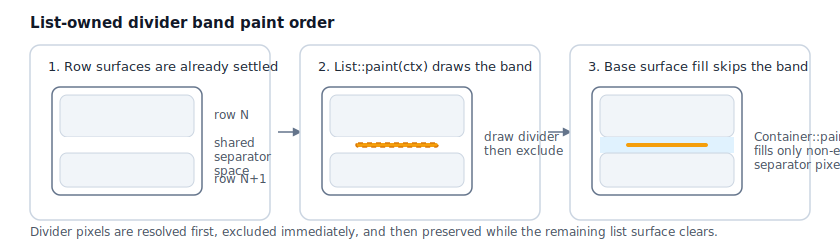

# Roo Windows Material 3 Lists Design

## Objective

Add a Material Design 3 list family to `roo_windows` that is suitable for:

- interactive lists,
- non-interactive lists,
- settings-like grouped screens,
- dropdown and popup menus,
- expandable and collapsible rows,
- custom row visuals,
- and future reuse across multiple Material 3 surfaces.

The result should be a general-purpose list system, not a settings-specific
special case.

## Motivation

`roo_windows` already has adjacent pieces that overlap with list-like UI, but
none of them are a good fit for the Material 3 list family as currently
defined.

Current nearby surfaces include:

- `ListLayout`, which is geared toward recycled fixed-height elements,
- `ScrollablePanel`, which is a scrolling surface rather than a list model,
- `VerticalLayout` and `FlexLayout`, which are generic layout containers,
- and existing composites such as menus and radio lists.

The Material 3 list family needs a better abstraction because it combines:

- variable-height rows,
- explicit row surface behavior,
- configurable slots,
- selection modes,
- expandable content,
- menu reuse,
- and strong visual rules around shape, gaps, dividers, and interaction states.

This design deliberately aims for one coherent list family that can later serve
lists, menus, and adjacent Material 3 surfaces with shared primitives.

## Background

### Current Status in `roo_windows`

As of 2026-05, the list family is partially implemented through Phase 6. The
public API, row-local `ListEntry` infrastructure, baseline `List` sequencing,
generic `ListRow<Item>` ownership bridge, and usage-review example are all
landed. The current code also resolves expressive position-aware row shapes and
list-owned divider bands through the current `PaintContext` exclusion pipeline.
The landed code is still the low-level substrate rather than the full
authoring story described later in this document: wrapped supporting text,
stock clickable rows, row-to-affordance delegation, reusable
checkbox/radio/navigation convenience items, expand/collapse behavior, and
menu reuse remain future work.

What exists today:

- Material 3 controls under `roo_windows/material3` currently include
   `FlexCard`, `Checkbox`, `RadioButton`, and `Switch`.
- `material3::StandardListItem` exists as a constructor-configured descriptor
   with lightweight text values and stable borrowed slot widgets.
- `material3::ListEntry` exists as a direct `Container` row surface with
   stable slot binding, row-local measurement and layout, and row-owned text
   widgets for standard overline, headline, and supporting content, plus
   expressive position-aware border-style resolution.
- `material3::ListRow<Item>` exists as a thin ownership helper that packages
   one inline item with one `ListEntry` without adding a second row model.
- `material3::List` exists as a direct `Container` shell with list-owned API
   for variant, style, selection, divider policy, row insertion, row stacking,
   row-context propagation, separator-band gap resolution, and list-owned
   divider-band painting from `paint(PaintContext&)`.
- `examples/material3/lists/lists.ino` exists as the low-level Phase 4
   usage-review sketch and compiles under the emulation harness.
- `FlexLayout` is implemented and already used by `material3::FlexCard`, so it
   is no longer just a future direction for generic composition.
- `ListLayout` remains the existing recycled fixed-height list container.
- `ScrollablePanel` remains a content-agnostic scrolling surface.
- existing list- and menu-like composites still sit on older primitives rather
   than on shared Material 3 row primitives.

What does not exist yet:

- no selection-driven corner-radius override beyond the current position-based
   expressive shapes,
- no actual wrapped or ellipsized list text behavior in `ListEntry`,
- no stock clickable/navigation row type or row-to-affordance click
   delegation,
- no reusable checkbox/radio/avatar convenience item surface,
- no implemented `ExpandablePanel` behavior,
- no Material 3 menu implementation built from shared list-row primitives,
- no reusable expand/collapse body path.

The rest of this document records the chosen architecture for the remaining
phases and keeps the already landed Phase 1 / Phase 2 / Phase 3 pieces aligned
with that direction.

### Material 3 Sources

This document is aligned against the Material 3 lists documentation:

- [Overview](https://m3.material.io/components/lists/overview)
- [Specs](https://m3.material.io/components/lists/specs)
- [Guidelines](https://m3.material.io/components/lists/guidelines)

Where the Material site states behavior in text, including the dynamic token
tables under Specs / Tokens & specs, this document treats that as
authoritative. Where important behavior appears only in imagery, this document
either records an image-backed observation or marks the point as provisional.

### Android OSS Signals

Because `roo_windows` already follows Android concepts in several places, it is
reasonable to use Android open-source implementations as implementation
evidence where the Material site is underspecified.

The strongest current signals are:

1. Material Android `ListItemLayout` explicitly models row position as first,
   middle, last, or single, and updates drawable state from that position.
2. Material Android `ListItemCardView` documents stateful expressive defaults
   for standard, segmented, selected, pressed, and hovered treatment.
3. Compose Material 3 expressive defines `ListItemShapes` with separate
   default, selected, pressed, focused, hovered, and dragged shapes.
4. Compose segmented lists compute base shape from item index and count, which
   directly supports segmented groups without introducing a separate content
   model.
5. Compose expressive also defines dragged elevation and dragged shape, which is
   a strong compatibility signal for future reorder support.
6. Material Android expressive supports swipe-to-reveal and other gesture-aware
   list surfaces, which reinforces the decision to keep row visuals and list
   structure separate from specialized interaction containers.

These signals support the current architecture:

1. keep `ListItem` content-focused,
2. keep `ListEntry` responsible for row-surface rendering and interaction
   states,
3. keep `List` responsible for position-aware and group-aware policy,
4. allow specialized future containers to add behaviors such as reordering or
   swipe handling without changing the basic item model.

### Local Framework Context

The most relevant current `roo_windows` surfaces are:

- `ListLayout`: fixed-height, recycled list container,
- `ScrollablePanel`: outer scroll surface,
- `FlexLayout`: implemented generic composition tool and preferred direction
   for new container-level composition,
- `VerticalLayout`: older vertical composition helper,
- existing menu and radio-list composites,
- current Material 3 controls: `material3::FlexCard`, `material3::Checkbox`,
   `material3::RadioButton`, and `material3::Switch`.

More specifically, the current composite stack looks like this:

- `menu::Menu` is built from `ScrollablePanel` plus `VerticalLayout`.
- `RadioList` is built from `ListLayout` plus `HorizontalLayout` and the
   legacy `roo_windows::RadioButton` widget.

That means there is still no shared row primitive spanning lists and menus,
which is exactly the architectural gap this design is trying to close.

The design in this document assumes that scrolling is orthogonal to list
semantics, and that the long-term layout direction for generic container
composition should favor `FlexLayout` over `VerticalLayout`.

### Embedded Authoring Constraints

The updated widget authoring guidance makes RAM cost a first-order API design
constraint, not a follow-up implementation detail. Lists are especially
sensitive because even modest screens can keep dozens of row objects alive at
the same time.

Approximate 32-bit ESP32 reference sizes used by this document, derived from
the current headers where possible:

- pointer / `vptr` / `Widget*`: 4 B,
- `Rect`: 10 B,
- `WidgetRef`: about 8 B (`Widget*` plus ownership flag and padding),
- `Widget`: 24 B (`ApplicationContext&`, parent pointer, one 10-byte `Rect`,
   state bits, and the `vptr`; this matches the 32-bit `static_assert` in
   `widget.h`),
- `BasicWidget`: about 28 B (`Widget` plus one byte each for packed padding
   and margins, plus tail padding),
- `StringViewLabel`: about 48 B (`BasicWidget`, `roo::string_view`, font
   reference, `Color`, `Gravity`, and tail padding),
- `Container`: about 44 B (`Widget` plus two cached 10-byte `Rect`s),
- `Panel`: about 56 B before vector capacity (`Container` plus one
   `std::vector<Widget*>` control block),
- `FlexLayout`: about 104 B before child-vector and measure-vector capacity
   (`Panel` plus five enum settings, gaps, compact padding/margins, minimum
   dimensions, and one `std::vector<ChildMeasure>` control block).

Standard-library wrappers such as `std::function<...>` and `std::string` are
still toolchain-dependent, so this document should not treat them as
header-derived constants. For this section, the only standard-library storage
assumption baked into the numbers above is the usual three-pointer
`std::vector` control block on an ESP32-class 32-bit toolchain.

The important multiplication factor is per row, not per list. A single `List`
can afford list-level policy and one private child vector, but a
`ListEntry` cannot casually inherit from `FlexLayout`, own a dynamic child
vector, copy large appearance structs, or store callbacks that most rows never
use.

This has two direct consequences for the list design:

1. Visual variation should normally be compact data: variant, style, position,
   selection state, divider policy, text policy, and alignment bits.
2. Class hierarchy should be reserved for storage variation: text-only rows,
   rows with real widget slots, expandable rows, owning dynamic rows, and fully
   custom content.

The original version of this document treated one text widget per occupied text
slot as too expensive. That is no longer the right trade-off. With
`StringViewLabel` now landing at roughly 48 B on 32-bit targets, the common
path can afford one widget for each occupied standard text slot and gain a much
simpler implementation model for measurement, layout, invalidation, and future
text behavior. The remaining constraint is to keep the cheap path on
`StringViewLabel` for one-line text and reserve heavier widgets such as
`TextBlock` for rows that actually opt into wrapping, max-lines, or ellipsis.

If text-widget RAM later becomes the real pressure point, the better next step
is still lighter text widgets rather than a return to direct-painted text.
Likely follow-ups are a one-line `Widget`-derived label that omits
`BasicWidget`, gravity, color, and possibly even stored font when specialized
to a fixed theme font, plus a non-owning `StringViewBlock` family and a more
bounded lightweight variant for short text and small fixed line counts.

Standard text content can therefore stay lightweight at the `ListItem`
boundary while still being materialized as child text widgets inside the row
surface. Child widgets are now expected not only for leading, trailing, body,
and custom content, but also for the standard text slots themselves.

## Requirements

### Functional Requirements

1. Support both Material 3 expressive and baseline list variants.
2. Support Material 3 style list items with configurable leading, content, and
   trailing regions.
3. Support standard and segmented visual styles where applicable.
4. Support interactive and non-interactive lists.
5. Support use of the same underlying item primitives in lists and menus.
6. Support grouped lists and multiple stacked lists on the same screen.
7. Support expandable and collapsible list items, with animation.
8. Support arbitrary list content, including fully custom row visuals.
9. Support selection-related affordances and policies when needed.
10. Support divider and gap configuration independently.
11. Support heterogeneous item heights.
12. Support text content that can wrap or ellipsize according to explicit
    policy.
13. Keep the first list API compatible with a future drag-reorder extension,
    even if reordering initially ships in a specialized container.

### Memory and Allocation Requirements

1. Minimize dynamic allocation and RAM overhead.
2. Allow simple lists to declare their content as member variables and add them
   without heap allocation.
3. Support lean standard item variants for common cases when that materially
   reduces per-item RAM usage.
4. Continue to support richer dynamic forms alongside the low-allocation path.
5. Keep visual variants and row state in packed policy structs rather than in
   separate subclasses.
6. Split concrete item classes only when the split changes stored fields or
   avoids a meaningful per-row RAM cost.
7. Keep the common text-widget path cheap enough that standard rows can use one
   text widget per occupied slot without needing a second non-widget text
   rendering model.
8. Document the approximate per-instance RAM cost of the base row, standard
   item variants, optional features, and each implementation phase.

### Layout Requirements

1. Keep the list abstraction independent from scrolling.
2. Allow the outer scroll container to host multiple lists or sections.
3. Allow rows to measure to different heights.
4. Make expand/collapse affect measured height and trigger ordinary relayout.
5. Favor `FlexLayout` over `VerticalLayout` for long-term container
   composition.
6. Follow Material alignment guidance: most rows are middle-aligned, and rows
   that are 88dp or taller, or contain three or more lines of text, shift to
   top alignment where applicable.
7. Leave room for future drag and reorder visuals, including dragged elevation,
   dragged shape, and index-aware relayout.

### Text and Content Requirements

1. Define public semantics in terms of explicit content and layout policy, with
   one-line, two-line, and three-line variants provided as presets.
2. Make text policy configurable per slot, including:
   - enabling or disabling supporting text,
   - allowing label and supporting text to wrap or truncate,
   - maximum number of lines,
   - vertical alignment policy for leading and trailing visuals.
3. Provide convenience constructors or presets for one-line, two-line, and
   three-line rows.
4. Keep supporting text aligned with Material guidance of roughly one to three
   lines in common list use cases.
5. In the baseline generic path, `leading`, `trailing`, and `body` widget
   identity should stay fixed for the lifetime of a binding. Replacing those
   widgets should require rebinding a different item or row wrapper.

### Extensibility Requirements

1. Support custom list items through a pure-virtual interface rather than a
   single concrete inheritance tree.
2. Provide a concrete standard Material 3 row implementation.
3. Make expandable content reusable outside lists.
4. Avoid a Cartesian-product class hierarchy across line count, visual variant,
   leading slot, trailing slot, selection, expansion, menu usage, and segment
   position.
5. Allow follow-up item classes, especially reusable owning `ListItem`
   implementations, to expose semantic mutable APIs for common cases such as
   pictograms, drawables, navigation affordances, and concrete selection
   controls without making the baseline generic item equally heavy.

## Design Overview

### Scope

The initial design focuses on:

1. a general Material 3 list family built from `List`, `ListEntry`,
   `ListItem`, and the standard item family,
2. variable-height rows and expandable content using ordinary measurement and
   relayout,
3. composition with outer scroll surfaces such as `ScrollablePanel`,
4. shared item primitives that can later be reused by menus,
5. a clear ownership model for shape, selection visuals, and divider behavior.

### Core Structure

The design has three layers:

1. Shared item primitives.
2. List containers.
3. Outer surfaces such as scrollable screens and menus.

At a high level:

- `List` is a concrete column-oriented `Container` with list-specific child
   APIs.
- `ListEntry` is a concrete row host and the reusable Material row surface.
- the baseline API should center on `ListEntry` plus `StandardListItem`.
   The first follow-up convenience layer should favor reusable `ListItem`
   implementations, including items that own their slot widgets while
   exposing borrowed pointers to the row. Thin convenience row wrappers are a
   later option only if baseline usage proves item-level reuse is still too
   awkward.
- `ListItem` is a pure-virtual content interface exposing individual text,
    policy, and widget accessors.
- `StandardListItem` is the baseline generic item type, configured up front and
    bound with stable widget identity.
- lean text-only items, semantic pictogram or drawable items, and owning
   convenience items for navigation or common controls are possible follow-up
   variants, not part of the baseline implementation target. Thin row
   wrappers remain optional later if a specific surface still needs them.
- `ExpandablePanel` provides reusable expandable body behavior.

### Key Decisions

1. Scrolling is orthogonal to list semantics.
2. `List` stays column-oriented while hiding generic layout mutation APIs.
3. `ListEntry` derives directly from `Container`, not from `FlexLayout`.
4. `ListEntry` uses a custom row layout rather than exposing itself as a
   generic flex container.
5. The list family treats Material variants and styles as explicit
   configuration.
6. Row visuals are split between content (`ListItem`), row surface
   (`ListEntry`), and group context (`List`).
7. Standard text content is simple enough that one cheap text widget per
   occupied slot is acceptable in the common path.
8. Visual variants are policy bits and theme lookups, not subclasses.
9. Concrete subclasses are introduced only for materially different storage
   profiles.
10. Expandability is represented by optional content such as `ExpandablePanel`,
    not by fields stored on every `ListEntry`.

Design review position: the baseline split is the right first implementation
target. It keeps the per-row object small, makes list-owned policy explicit,
and leaves a measured Phase 4 checkpoint for convenience APIs instead of
pre-committing RAM to unproven row variants.

## Design Details

### Composition Model

#### Lists Are Independent from Scrolling

The preferred composition is:

- `ScrollablePanel` as the outer scroll surface,
- wrapping a flex column,
- containing one or more lists or list sections,
- including expandable rows or nested subsections.

This matches Android-style screens with multiple stacked sections, but also
keeps the list primitive reusable in non-scrollable contexts and popup menus.

#### List Containers Use Direct Column Composition

The list container layer is built around a column-based container model that
uses list-specific row APIs rather than exposing a generic layout surface.

This model is a good fit because the list family needs:

- variable-height rows,
- expandable rows,
- grouped sections,
- general-purpose composition.

This conclusion applies to the list container layer, not to the row widget
itself. `List` should stay column-oriented without publicly inheriting from
`FlexLayout`. `ListEntry` should not derive from `FlexLayout`.

Operationally, `List` should use a simple vertical stacking algorithm rather
than the full generic `FlexLayout` surface:

- `List` stores only `ListEntry` children and exposes only list-specific
   insertion and policy APIs,
- `List::onMeasure()` measures each visible row at the resolved list width and
   sums row heights plus list-owned gaps,
- `List::onLayout()` assigns full-width row bounds and stacks entries from top
   to bottom,
- row position, divider visibility, and list-owned visual context are resolved
   by `List`, not by caller-supplied generic layout params.

#### Rows Are Specialized Material Surfaces

The reusable primitive is a general Material row surface that can be used in:

- arbitrary lists,
- menus,
- navigation lists,
- settings-like screens,
- plain informational lists.

`ListEntry` is a specialized `Container` with a known, small child set and a
custom row layout. That is the right base because the row lives on a
performance-sensitive path and should avoid `Panel`'s dynamic child pointer
vector where practical while preserving recursive rendering, invalidation,
measurement, and touch dispatch.

This is also consistent with the current framework split: `Panel` is the
general multi-child container with a child vector, while `Container` supports
small fixed child sets through custom `getChild()` / `getChildrenCount()`
implementations.

### Content Model

#### One-Line / Two-Line / Three-Line Are Presets

List content should be modeled through explicit text and alignment policy rather
than fixed named row categories.

The core row configuration should describe:

- whether headline text is present,
- whether supporting text is present,
- whether overline text is present,
- maximum lines for headline and supporting text,
- wrapping or ellipsize policy for each text slot,
- alignment policy for leading and trailing visuals,
- density and padding presets.

In the standard path, those text slots should be stored as lightweight string
views and painted by the row implementation using theme-provided typography.
They should not be represented as separate label widgets unless the caller is
using a fully custom row. This keeps a one-line list item close to one string
view plus policy bits, instead of one row object plus one child widget.

Convenience presets then map to Material-like one-line, two-line, and
three-line defaults.

#### Static Content Must Stay First-Class

`roo_windows` generally tries to minimize RAM usage and dynamic allocation.

For lists, the design should work naturally for code such as:

```cpp
class PumpSettingsScreen {
 public:
   explicit PumpSettingsScreen(ApplicationContext& context)
      : list_(context),
        pool_mode_entry_(context),
        pool_mode_item_(
           StandardListItemInit::TwoLine("Pool pump", "Auto")),
        solar_delta_entry_(context),
        solar_delta_item_(StandardListItemInit::TwoLine(
           "Solar delta",
           "Starts when the roof loop exceeds the pool by 4 C")),
        safety_lock_entry_(context),
        safety_lock_switch_(context),
        safety_lock_item_(StandardListItemInit::OneLine(
           "Safety lock", nullptr, &safety_lock_switch_)) {
   pool_mode_entry_.setItem(pool_mode_item_);
   solar_delta_entry_.setItem(solar_delta_item_);
   safety_lock_entry_.setItem(safety_lock_item_);

      list_.add(pool_mode_entry_);
      list_.add(solar_delta_entry_);
      list_.add(safety_lock_entry_);
   }

 private:
   List list_;
   ListEntry pool_mode_entry_;
   StandardListItem pool_mode_item_;
   ListEntry solar_delta_entry_;
   StandardListItem solar_delta_item_;
   ListEntry safety_lock_entry_;
   StandardListItem safety_lock_item_;
   material3::Switch safety_lock_switch_;
};
```

This implies:

- list containers should build on the existing non-owning child model already
  available through `WidgetRef`, so statically declared child items remain a
  natural and explicit path,
- the baseline API must support statically declared entries and constructor-
   configured items without heap allocation,
- lean convenience types are deferred until the baseline path proves too heavy
   or too verbose in real usage,
- low-level custom rows should still be able to spell out `ListEntry` plus a
   separate `ListItem` when that split is actually useful,
- changing which widget occupies a slot should happen through rebinding a
   different item or row wrapper, not by mutating a bound generic item.

#### ListEntry as a Public Primitive

`ListEntry` is intended to stay narrow. In Phase 1 its public methods fall
into two groups:

- app-facing low-level binding: `hasItem()`, `item()`, `setItem()`,
   `clearItem()`, and owner-driven `refreshFromItem()`,
- list-owned policy plumbing: `setVisualContext()` and `visualContext()`.

What it intentionally does **not** expose in Phase 1:

- no direct `setLeading()` / `setTrailing()` / `setBody()` API on the entry
   itself,
- no per-entry selection or divider setters,
- no generic child-management API beyond the bound-item model.

Operationally, `setItem()` either binds into an empty row or replaces the
current binding, `clearItem()` leaves the row empty and detaches any attached
slot children, and `refreshFromItem()` is only a manual reread of the current
item model. During one binding, slot widget identity is fixed.

That split is deliberate. Content lives on the item; sequence-aware appearance
lives on the list; `ListEntry` stays the reusable Material row surface in the
middle.

#### ListEntry Ownership

`ListEntry` follows the same child-ownership model as other `roo_windows`
containers.

- `List::add(ListEntry& entry)` is non-owning. The entry must outlive the list
   membership.
- `List::add(std::unique_ptr<ListEntry> entry)` adopts the entry using the
  existing parent-owned widget model under the hood. `clear()` destroys adopted
  entries and detaches borrowed ones.
- `ListEntry::setItem(ListItem& item)` is a non-owning low-level binding. The
   bound item must outlive the entry or be cleared first.
- The item's current `leading`, `trailing`, and `body` widgets are borrowed
  through that binding and stay fixed until `clearItem()` or another
  `setItem()` call.
- If higher-level convenience items are added later, they should usually own
   any embedded widgets internally and expose borrowed slot pointers through
   the `ListItem` interface, so the reusable convenience stays at the item
   layer rather than forcing a dedicated row type.

#### Item Mutation Semantics

The baseline `StandardListItem` should be effectively immutable once
constructed.

- `StandardListItem` is configured up front through a constructor init object
  rather than through arbitrary post-bind setters.
- It should not expose `setLeading()`, `setTrailing()`, `setBody()`, or other
  setters that replace slot widgets while bound.
- It exposes non-const accessors to the already configured borrowed widgets as
   a convenience, but those accessors must not change slot identity.
- One `ListItem` should be bound to at most one `ListEntry` at a time. Binding
  the same item into two entries at once should be rejected, at least in debug
  builds.

`refreshFromItem()` remains useful as an owner-driven escape hatch for custom
or follow-up mutable item implementations, but its contract is narrower than in
the previous design:

1. reread text, policies, alignments, and other lightweight item state,
2. observe visibility or enablement changes on the already bound widgets if
   those changes affect layout or painting,
3. request relayout and repaint,
4. never replace attached slot widgets.

Changing which widget occupies a slot is no longer a supported mutation on the
generic path. To do that, the caller should either:

1. clear and rebind a different item, or
2. use a more specialized owning item implementation, or, only if needed,
   a local row helper that owns the concrete widget set.

This avoids the back-pointer and structural child-reconciliation complexity of
the earlier design while preserving a narrow manual refresh path for custom
items that truly need mutable text or policy fields.

If a caller toggles visibility or other layout-relevant state on a widget that
is already attached through a bound item, the caller owns the corresponding row
refresh. The generic item should not grow a large family of forwarding helpers
for widget methods that already exist on the widgets themselves.

#### What Belongs on the Item vs the Row

The preferred split is:

- `ListItem` and its subclasses own content semantics and compact stored data,
- `ListEntry` owns row rendering, attachment of the stable child widgets, and
  list-provided visual context,
- owning convenience item implementations should normally own concrete
   child-widget lifetime and any semantic APIs that depend on knowing the exact
   widget type when the same convenience should work in both lists and menus,
- row wrappers are reserved for the smaller set of cases that truly need
   row-surface-specific behavior beyond what a shared item can express.

That gives a clean place for follow-up mutable convenience:

- item classes are the right home for compact semantic content such as
   headline-only text, supporting text, pictograms, static drawables, and
   reusable convenience items that own common controls such as switch,
   checkbox, radio, or navigation affordances,
- row wrappers remain available for cases that need row-surface-specific
   behavior or outer-surface glue that should not leak into shared items,
- the generic `StandardListItem` stays the low-level fallback that accepts
  arbitrary pre-existing widgets but does not try to be the best API for every
  common case.

For example, a future `PictogramListItem` can expose `setPictogram()` because
it stores a lightweight semantic value rather than an arbitrary widget pointer.
A future `SwitchListItem` can expose `setOn()` because it owns a concrete
`material3::Switch` accessory widget while still participating in the same
generic row host used by both lists and menus.

### Expand and Collapse

The Material 3 guidelines describe expand & collapse as a parent-child list
interaction. On Android, the guidelines explicitly call for a container
transform-style transition that expands a list item vertically across the
screen.

The implementation should separate:

- expansion state and parent-child structure,
- list-surface transition behavior,
- reusable layout or animation helpers.

A dedicated reusable widget or helper can provide:

- expanded/collapsed state,
- animation progress,
- measured full content height,
- clipped intermediate height during animation,
- ordinary relayout propagation.

List surfaces can then choose whether to use that support for an inline reveal,
or a more spec-aligned container-transform transition where appropriate.

### Visual Behavior Ownership

Visual behavior is part of the API design because some aspects of the spec
affect ownership boundaries.

The intended ownership model is:

- `ListItem` owns content semantics only,
- `ListEntry` owns row-level visual treatment and state layers,
- `List` owns position-aware and group-aware visual behavior,
- outer surfaces such as menus reuse the same item primitives while applying
   surface-specific container rules.

This means shape and selection visuals are part of the list-and-entry contract,
not just local row implementation details.

#### Surface Paint Contract

`ListEntry` owns row-local surface treatment through
`ListEntryVisualContext`, `containerRole()`, and `getBorderStyle()`. `List`
owns any pixels that live between rows rather than inside a row, including
segmented separator bands and visible divider bands.

The paint contract is therefore:

1. row widgets paint their own content and row surfaces through the ordinary
   `Container` path,
2. `List::paint(PaintContext&)` paints each visible divider band in shared
   separator space,
3. `List::paint(PaintContext&)` immediately registers the same local band with
   `PaintContext::addExclusion()`,
4. `List::paint(PaintContext&)` then delegates to `Container::paint(ctx)` so
   the remaining list surface clears only pixels that were not already
   settled.

Because exclusions affect only later paint, a divider band must be fully
resolved before it is excluded. Divider geometry stays derived from existing
row bounds, `ListDividerPolicy`, item inset hints, and the resolved
`ListEntryVisualContext`; the design does not add extra per-row child widgets,
cached raster state, or callback state for divider ownership.

Repaint and invalidation consequences:

1. dirty row repaint stays row-local because divider bands live on the list,
   not on the rows,
2. invalidated list repaint redraws any intersecting separator bands before
   the base surface clear,
3. each divider pixel and each remaining background pixel is written once per
   pass, which matches the direct-to-framebuffer exclusion model.



### Variants and Styles

Spec-backed conclusions:

1. Expressive lists are recommended for new designs.
2. Baseline lists remain available.
3. Expressive lists add highlighted selection states and customizable slots.
4. Baseline lists use square corners and standard colors.
5. Standard and segmented are visual styles and do not change list behavior.

Proposed implementation defaults:

1. `List` exposes a variant setting with at least `baseline` and `expressive`.
2. `List` exposes a style setting with at least `standard` and `segmented`
   where the chosen variant supports it.
3. Expressive is the default for new Material 3 list APIs.
4. Baseline remains available for compatibility and for products that want the
   older visual treatment.

### Token-Backed Visual Defaults

The Material 3 specs expose enough list sizing, spacing, shape, and color
information through text and token tables to use those values as first-pass API
defaults.

Expressive defaults backed by the current Material specs and measurements:

1. List container corner radius is 16dp.
2. Expressive list item corner radius is 4dp for the item-local shape model.
3. Horizontal row padding is 16dp on both sides.
4. Vertical row padding is 10dp top and bottom.
5. Common horizontal spacing between slots is 12dp.
6. Leading icon size is commonly 20dp, although Android examples also treat
   some icon-button-like content as height-filling.
7. Leading avatar size is 40dp.
8. Expressive segmented lists use gaps between items rather than dividers as
   the primary grouping mechanism.

Baseline defaults backed by the current Material specs and measurements:

1. Baseline list items use square corners.
2. Baseline horizontal padding is 16dp.
3. Baseline horizontal spacing is 16dp.
4. Baseline leading icon size is 24dp.
5. Baseline one-line and two-line rows generally use 8dp vertical padding,
   increasing to 12dp for taller rows.
6. Baseline three-line rows use top alignment for leading and trailing visuals,
   and for label placement when the row is 88dp or taller.
7. Baseline divider defaults remain explicit and spec-visible: full-width or
   inset, with inset dividers commonly using 16dp start and 24dp end padding.

These values should be represented as theme or style defaults, not as hard
coded constraints. The API should allow callers to override icon size,
container shape, spacing, and padding when a product needs a custom layout.

### Token-Backed Color Roles

Shared list color-role defaults:

1. Row background/container uses `surface` by default.
2. Label text uses `on-surface`.
3. Overline, supporting text, trailing text, trailing icon, and leading icon
   use `on-surface-variant`.
4. Divider uses `outline-variant`.
5. Avatar container uses `primary-container`.
6. Avatar text uses `on-primary-container`.

These are good default role assignments for `StandardListItem`, but should stay
theme-driven so future menu-specific or app-specific surfaces can override
them.

### Selection, Shape, and Divider Behavior

#### Selection

Spec-backed conclusions:

1. A list has only one selection mode at a time.
2. The selected state applies to the entire list item.
3. In a selected item with a selection control, both the list item and the
   control show a selected state.
4. Single-select lists use radio buttons.
5. Multi-select lists use checkboxes or switches.
6. Selection lists use only one selection interaction per list item.

The proposed behavior is that selection influences:

- state-layer opacity,
- container color role,
- row shape,
- divider suppression behavior with neighboring selected rows.

Implementation-backed conclusion from Material Android and Compose:

1. Expressive selected rows remain individually rounded rather than merging into
   one large pill-shaped selected run.
2. Selection changes emphasis and highlight treatment first; it does not, by
   default, flatten intermediate row corners.
3. Adjacent selected rows influence divider visibility only through explicit
   divider policy; they do not automatically form one combined outer shape.
4. Baseline selected rows keep baseline shape rules and rely primarily on color
   and state treatment for emphasis.

#### Shape

Spec-backed conclusions:

1. Baseline list items have square corners.
2. Expressive lists have round corners.
3. Standard and segmented are visual style choices, not behavior changes.

Token-backed and implementation-backed conclusions:

1. Expressive list containers use a 16dp outer corner radius.
2. Expressive list items use a 4dp item-local corner radius.
3. Material Android explicitly models first, middle, last, and single item
   positions.
4. Material Android and Compose both model interaction-state-specific shapes,
   including selected and pressed states, and Compose additionally models
   focused, hovered, and dragged shapes.

The proposed default behavior is:

1. Baseline rows use square corners throughout.
2. Expressive rows use a rounded per-item shape, with 4dp as the initial
   default token.
3. Visually contained expressive groups apply an outer 16dp container shape.
4. The API tracks first, middle, last, and only-row position because shape,
   spacing, divider policy, and segmented-list tuning depend on it.
5. Selection and interaction states can replace or morph the default shape for
   a row, rather than merely painting an overlay on top of a fixed outline.
6. The first implementation should not assume that adjacent selected rows merge
   into one combined outline.

#### Divider and Gap Policy

Divider behavior remains list-owned.

Spec-backed conclusions:

1. Gaps or dividers can separate list items and groups.
2. Material guidance recommends gaps for contained lists.
3. Material guidance recommends limiting dividers to uncontained or complex
   lists when stronger separation is necessary.

The proposed default behavior is:

1. Expressive contained lists default to gaps rather than dividers.
2. Baseline and uncontained lists default to dividers.
3. Divider inset is derived from list policy plus entry-provided content hints.
4. The list decides whether a divider is full-width or inset.
5. Selection does not automatically imply merged selected runs.
6. Divider color defaults to `outline-variant`.

### Lists vs Menus

Lists and menus share item primitives, but not identical visual rules.

Shared between lists and menus:

- content slots,
- text policies,
- state layers,
- accessory placement,
- standard item variants,
- and the preferred higher-level convenience layer: reusable `ListItem`
   implementations, including ones that own common accessory widgets.

List-specific by default:

- grouped row shape based on row position,
- list-owned divider policy,
- selected-run shape behavior.

Menu-specific by default:

- popup surface behavior,
- menu-specific shape defaults,
- menu dismissal rules,
- submenu affordances,
- a flatter row treatment where the menu surface owns most of the outer shape.

### Layout Direction

The long-term recommendation is to standardize on `FlexLayout` as the main
layout engine for generic vertical and horizontal composition.

This recommendation applies to generic layout containers and to list-level
composition. It does not imply that every composite row widget should inherit
from `FlexLayout`. For Material list rows, a custom `Container` remains the
preferred implementation.

Practical note:

- `VerticalLayout` is still used by existing composites such as `menu::Menu`,
   so any migration to `FlexLayout` should be incremental rather than assumed to
   have already happened.
- `HorizontalLayout` is likewise still present in older composites such as
   `RadioListItem`.

### Use Cases and Hierarchy

The design pressure comes from a small set of recurring cases, not from every
possible Material token combination:

- static settings screens: 10-40 rows, usually text plus an occasional control,
- popup and overflow menus: short one-line rows with menu-specific policy,
- rich forms: generic slotted rows with real leading, trailing, or body
  widgets,
- long homogeneous lists: better served by `ListLayout` or a future recycled
  Material adapter,
- fully custom rows: direct `ListItem` implementations.

That leads to three decisions:

1. The baseline implementation should optimize the generic path:
   `ListEntry` + `StandardListItem` + `List`.
2. Visual dimensions such as baseline vs expressive, segmented vs standard, and
   row position are policy, not subclasses.
3. Lean simple-item variants and owning convenience items are the first
   follow-up candidates. A generic `ListRow<Item>` ownership bridge is also a
   reasonable early helper because it does not create a content-specific row
   family. Thin row wrappers should be considered only after baseline usage
   shows that item-level reuse still misses a clear RAM or ergonomics win.

Storage rules for the baseline path:

- standard text values stay lightweight in the bound item, but the row
   materializes them as child text widgets,
- widget slots are borrowed `Widget*` by default,
- owning slot adapters, if needed, belong in follow-up types,
- callbacks stay virtual or on child widgets,
- appearance overrides stay as shared theme or token pointers.

Possible follow-up types include `HeadlineListItem`,
`SupportingTextListItem`, `PictogramListItem`, `DrawableListItem`, owning
convenience items for navigation or common controls, and, only if item-level
reuse later proves insufficient, thin row wrappers that embed or own the
appropriate item and widget state. Those types should reuse the same
`ListEntry` architecture rather than introducing a second row model.

The first concrete follow-up surface that makes sense is therefore:

- `ListRow<Item>` as a generic bridge from an owned `Item` to a real
   `ListEntry`,
- text-only items such as `HeadlineListItem` and `SupportingTextListItem`,
- visual items such as `AvatarSupportingTextItem` and
   `PictogramSupportingTextItem`,
- interaction items such as `NavigationListItem`, `CheckboxListItem`,
   `RadioListItem`, and `SwitchListItem`.

### Per-Instance Footprint Budget

Using the same 32-bit ESP32 assumptions as above, plus the usual 12 B
`std::vector` control block and 24 B `std::string` control block where those
types appear, approximate baseline targets are:

| Type | Approx. RAM | Notes |
|------|------------:|-------|
| `List` | ~80 B plus vector capacity | one per list/group; direct `Container`, two small vectors, compact list policies, and one dirty-context flag |
| `ListEntry` | ~84 B | `Container` row surface plus item pointer, six cached slot/text child pointers, and packed visual context |
| `StandardListItem` | ~52 B | rich non-owning descriptor: three text views, three compact text policies, three slot pointers, divider hint, and packed alignment bits |
| `StringViewLabel` | ~48 B per occupied text slot | default widget for one-line standard overline, headline, or supporting text |
| `TextBlock` | ~112 B plus line-vector capacity | current opt-in wrapped-text widget; this assumes one owned 24 B `std::string` and one 12 B `std::vector` control block on the ESP32 toolchain |
| `ExpandablePanel` | ~60 B | reusable body widget: `Container`, one `WidgetRef`, two animation counters, and one expanded flag |
| Owning slot adapter | +4 B per slot over raw pointer | `WidgetRef` ownership flag and padding |

Likely follow-up targets, to be measured against the baseline implementation:

- `HeadlineListItem`: ~16 B,
- `SupportingTextListItem`: ~28-32 B,
- `PictogramListItem` or `DrawableListItem`: still expected to stay lean when
    they avoid additional wrapped-text widgets or extra content controls,
- owning convenience items for controls or navigation: expected to cost at
   least one concrete accessory widget plus the item storage that exposes it,
- thin row wrappers: still possible later, but intentionally not the first
   convenience layer.

Typical row totals on a 32-bit target are therefore closer to:

- one-line standard row: `ListEntry` + `StandardListItem` + one
   `StringViewLabel`, about 184 B before leading, trailing, or body widgets,
- two-line standard row: about 232 B,
- three-line standard row with three cheap labels: about 280 B,
- wrapped supporting-text row: roughly 64 B above the corresponding
   cheap-label row when one `TextBlock` replaces one `StringViewLabel`.

Those wrapped-text numbers are intentionally based on the current `TextBlock`
implementation. A future non-owning `StringViewBlock` or bounded lightweight
block variant would lower the opt-in cost without changing the high-level text
policy model.

These numbers intentionally exclude child widgets such as `Switch`, `Checkbox`,
custom icons, or body content, because those widgets are real content that the
application asked for. The budget is about making the common text-widget path
acceptable while still avoiding invisible framework cost on rows that do not
use heavier capabilities.

For comparison, a naive all-in-one row design would add all of the following
to every row:

- dynamic child-vector storage from `Panel` or `FlexLayout`,
- three text widgets regardless of whether the row uses them,
- leading, trailing, body, and selection-affordance `WidgetRef` fields,
- expansion state and animation fields,
- copied appearance override structs,
- stored `std::function` callbacks.

That shape still compounds quickly because it pays for every optional behavior
up front, whether or not a row uses it. The problem is no longer the presence
of one cheap label widget per occupied slot; it is paying for unused vectors,
callbacks, affordance storage, and expansion state on every row.

## Proposed API

### Baseline Types

The baseline API should revolve around these types:

- `List`: concrete list container.
- `ListEntry`: concrete row host and reusable Material row surface.
- `ListItem`: pure-virtual content interface.
- `StandardListItem`: constructor-configured generic standard content
   descriptor with stable slot widgets.
- `ExpandablePanel`: reusable expandable body widget.

Possible follow-up convenience types, if baseline usage justifies them:

- `HeadlineListItem`,
- `SupportingTextListItem`,
- `PictogramListItem` or `DrawableListItem`,
- owning convenience items such as navigation, switch, checkbox, or radio
   items that internally keep the concrete accessory widget,
- thin row wrappers only if a later surface needs row-specific behavior beyond
   what shared items provide.

### Supporting Configuration Types

Phase 1 should freeze a small, explicit set of public enums and policy
structs. They should use the same style as existing `material3` widgets:

- `enum class ListVariant : uint8_t { kBaseline, kExpressive };`
- `enum class ListStyle : uint8_t { kStandard, kSegmented };`
- `enum class SelectionMode : uint8_t { kNone, kSingle, kMultiple };`
- `enum class SelectionAffordance : uint8_t {
      kNone,
      kCheckmark,
      kCheckbox,
      kRadio,
      kSwitch,
   };`
- `enum class AffordancePlacement : uint8_t { kLeading, kTrailing };`
- `enum class DividerMode : uint8_t { kNone, kFullWidth, kInset };`
- `enum class TextOverflowPolicy : uint8_t { kWrap, kTruncate };`
- `enum class VerticalVisualAlignment : uint8_t { kMiddle, kTop };`
- `enum class ListItemPosition : uint8_t {
      kSingle,
      kFirst,
      kMiddle,
      kLast,
   };`

The first public structs should stay similarly focused:

```cpp
struct ListTextPolicy {
   TextOverflowPolicy overflow = TextOverflowPolicy::kTruncate;
   uint8_t max_lines = 1;
};

struct ListSelectionPolicy {
   SelectionMode mode = SelectionMode::kNone;
   SelectionAffordance affordance = SelectionAffordance::kNone;
   AffordancePlacement placement = AffordancePlacement::kTrailing;
   bool selection_follows_press = true;
};

struct ListDividerPolicy {
   DividerMode mode = DividerMode::kNone;
   uint8_t start_inset = 0;
   uint8_t end_inset = 0;
   bool suppress_between_selected = true;
};

struct ListEntryVisualContext {
   ListVariant variant = ListVariant::kExpressive;
   ListStyle style = ListStyle::kStandard;
   ListItemPosition position = ListItemPosition::kSingle;
   bool selected = false;
   bool enabled = true;
   bool pressed = false;
   bool focused = false;
   bool hovered = false;
   bool show_divider = false;
};
```

This is enough policy surface for the first implementation. Anything beyond
this should stay internal until a real use case forces it public.

The selection-affordance fields are list-level defaults or helper hints. They
do not imply that `ListEntry` stores a separate affordance widget field for
every row; the visible affordance should still be supplied as ordinary leading
or trailing content.

### Baseline Class Shape

The baseline implementation should convert the earlier sketch into the
following concrete public direction.

```cpp
struct StandardListItemInit {
   roo::string_view overline = {};
   roo::string_view headline = {};
   roo::string_view supporting = {};
   ListTextPolicy overline_policy = {};
   ListTextPolicy headline_policy = {};
   ListTextPolicy supporting_policy = {};
   Widget* leading = nullptr;
   Widget* trailing = nullptr;
   Widget* body = nullptr;
   VerticalVisualAlignment leading_alignment =
         VerticalVisualAlignment::kMiddle;
   VerticalVisualAlignment trailing_alignment =
         VerticalVisualAlignment::kMiddle;
   DividerInsetHint divider_inset_hint;
   bool prefer_top_text_alignment = false;

   static StandardListItemInit OneLine(
      roo::string_view headline, Widget* leading = nullptr,
         Widget* trailing = nullptr);
   static StandardListItemInit TwoLine(
      roo::string_view headline,
      roo::string_view supporting, Widget* leading = nullptr,
         Widget* trailing = nullptr);
   static StandardListItemInit ThreeLine(
      roo::string_view headline,
      roo::string_view supporting,
      roo::string_view overline = {}, Widget* leading = nullptr,
         Widget* trailing = nullptr, Widget* body = nullptr);
};

class ListItem {
 public:
   virtual ~ListItem() = default;

   virtual roo::string_view overlineText() const { return {}; }
   virtual roo::string_view headlineText() const { return {}; }
   virtual roo::string_view supportingText() const { return {}; }

   virtual ListTextPolicy overlinePolicy() const {
      return ListTextPolicy{};
   }
   virtual ListTextPolicy headlinePolicy() const {
      return ListTextPolicy{};
   }
   virtual ListTextPolicy supportingPolicy() const {
      return ListTextPolicy{};
   }

   virtual Widget* leading() const { return nullptr; }
   virtual Widget* trailing() const { return nullptr; }
   virtual Widget* body() const { return nullptr; }

   virtual VerticalVisualAlignment leadingAlignment() const {
      return VerticalVisualAlignment::kMiddle;
   }
   virtual VerticalVisualAlignment trailingAlignment() const {
      return VerticalVisualAlignment::kMiddle;
   }
   virtual DividerInsetHint dividerInsetHint() const {
      return DividerInsetHint{};
   }
   virtual bool preferTopTextAlignment() const {
      return false;
   }
};

class ExpandablePanel : public Container {
 public:
   explicit ExpandablePanel(ApplicationContext& context);

   void setContent(WidgetRef content);
   void clearContent();
   void setExpanded(bool expanded, bool animate = true);
   bool isExpanded() const;
   bool isAnimating() const;
   void setAnimationDuration(uint16_t millis);
};

class ListEntry : public Container {
 public:
   explicit ListEntry(ApplicationContext& context);

   bool hasItem() const;

   // Returns nullptr when no item is currently bound.
   ListItem* item();
   const ListItem* item() const;

   // Non-owning. `item` must outlive this entry or be cleared first.
   // Binding is exclusive: an item can be attached to at most one entry at a
   // time. Rebinding detaches the previous item, removes its slot children,
   // then attaches the new one. Slot widget identity stays fixed during one
   // binding.
   void setItem(ListItem& item);

   // Clears the current binding and detaches any attached slot children.
   void clearItem();

   // Owner-driven refresh hook for mutable custom items. This rereads text,
   // policies, alignments, and layout-relevant state from the current item and
   // requests relayout / repaint. It does not replace bound slot widgets. If
   // no item is bound, this is a no-op.
   void refreshFromItem();

   // Primarily list-owned. App code normally reads this but does not drive it.
   void setVisualContext(const ListEntryVisualContext& context);
   const ListEntryVisualContext& visualContext() const;
};

class StandardListItem : public ListItem {
 public:
   explicit StandardListItem(const StandardListItemInit& init = {});

   roo::string_view overlineText() const override;
   roo::string_view headlineText() const override;
   roo::string_view supportingText() const override;

   ListTextPolicy overlinePolicy() const override;
   ListTextPolicy headlinePolicy() const override;
   ListTextPolicy supportingPolicy() const override;

   Widget* leading() const override;
   Widget* trailing() const override;
   Widget* body() const override;

   VerticalVisualAlignment leadingAlignment() const override;
   VerticalVisualAlignment trailingAlignment() const override;
   DividerInsetHint dividerInsetHint() const override;
   bool preferTopTextAlignment() const override;

   // Convenience only. These expose the already configured borrowed widgets;
   // callers must not replace slot identity while the item is bound.
   Widget* leadingWidget();
   Widget* trailingWidget();
   Widget* bodyWidget();
};

template <typename Item>
class ListRow : public ListEntry {
 public:
   template <typename... Args>
   explicit ListRow(ApplicationContext& context, Args&&... args)
         : ListEntry(context), item_(std::forward<Args>(args)...) {
      setItem(item_);
   }

   Item& item() { return item_; }
   const Item& item() const { return item_; }

 private:
   Item item_;
};

class List : public Container {
 public:
   explicit List(ApplicationContext& context);

   void setVariant(ListVariant variant);
   void setStyle(ListStyle style);
   void setSelectionPolicy(const ListSelectionPolicy& policy);
   void setDividerPolicy(const ListDividerPolicy& policy);

   // Non-owning. `entry` must outlive the list membership.
   // `ListRow<Item>` participates here because it is still a `ListEntry`.
   void add(ListEntry& entry);
   // Owning. The list adopts the entry through the normal parent-owned widget
   // model internally.
   void add(std::unique_ptr<ListEntry> entry);
   void clear();
};
```

Possible follow-up convenience types should stay provisional until the baseline
API above exists and has been exercised on real screens. Phase 4 now answers
that question: the baseline path is viable as the low-level substrate, but the
remaining work should add higher-level authoring surfaces rather than keep
pushing common list cases onto ad hoc `ListEntry` subclasses. The likely
direction is a mix of lean value-based item families and thin or typed row
wrappers that bind or own the appropriate item and widget set.

This reviewed shape preserves the architectural split already established in
the rest of the document:

1. `ListItem` exposes individual content, policy, and widget accessors only.
2. `ListEntry` owns row rendering, interaction visuals, and fixed-child
    container behavior.
3. `ExpandablePanel` is reusable outside lists and is not list-specific.
4. `List` owns sequence-aware policy such as variant, style, divider, and
    selection behavior.
5. Standard text values stay lightweight at the `ListItem` boundary but are
   materialized as child text widgets by `ListEntry`, and generic widget slots
   stay structurally stable for the lifetime of a binding.

### Phase 1 Review Decisions

Phase 1 should close the previously open API questions with the following
decisions.

1. The smallest useful `ListItem` API is a set of individual text, policy,
   widget, and layout-hint accessors. It should not own row-surface logic,
   selection state, or divider policy.
2. Section headers and footers should stay outside `List` in the first API.
    They can be ordinary sibling widgets in the surrounding flex column.
    This keeps `List` focused on row sequencing rather than section semantics.
3. `ListEntry` follows the normal parent-child ownership model: borrowed when
   added by reference, adopted when added by `std::unique_ptr<ListEntry>`.
   `setItem(ListItem&)` is likewise a non-owning low-level binding.
   `refreshFromItem()` is a manual reread hook for mutable custom items, not a
   generic structural resync mechanism.
4. `StandardListItem` should be construction-time configured and should not
   offer arbitrary widget-replacement setters after `setItem()`.
5. `setVisualContext()` is primarily list-owned. Application code can inspect
   `visualContext()`, but the list should normally be the only object driving
   per-entry group context.
6. Selection policy should live on `List`, while `ListEntry` only renders the
   already-resolved visual context. A visible selection affordance should be a
   leading or trailing content widget, not a separate field on every entry.
7. Menus should reuse `ListEntry` directly in Phase 1 and Phase 2.
    If menu-specific defaults later prove awkward, add a thin wrapper then,
    rather than baking menu concerns into the first list API.
8. The first implementation should freeze only the baseline generic path.
   A generic `ListRow<Item>` bridge is acceptable early because it only
   packages one owned item with one real row surface; it does not mean that
   items can be added directly to `List`.
9. The first follow-up convenience layer should favor reusable item families,
   including item implementations that own common control widgets. Typed row
   wrappers should remain deferred unless item-level reuse later proves
   insufficient.
10. `ListEntry` should not store expandable body pointers or animation state.
   Expandability belongs in `ExpandablePanel` or in a custom item that exposes
   body content.

### Usage Examples

#### Example 1: Static Settings Section

Baseline static usage is explicit, but allocation-free and easy to reason
about.

```cpp
class PumpSettingsSection {
 public:
   explicit PumpSettingsSection(ApplicationContext& context)
         : list_(context),
           pool_mode_entry_(context),
           pool_mode_item_(
                 StandardListItemInit::TwoLine("Pool pump", "Auto")),
           solar_delta_entry_(context),
           solar_delta_item_(StandardListItemInit::TwoLine(
                 "Solar delta",
                 "Starts when the roof loop exceeds the pool by 4 C")),
           safety_lock_entry_(context),
           safety_lock_switch_(context),
           safety_lock_item_(StandardListItemInit::OneLine(
                 "Safety lock", nullptr, &safety_lock_switch_)) {
      pool_mode_entry_.setItem(pool_mode_item_);
      solar_delta_entry_.setItem(solar_delta_item_);
      safety_lock_entry_.setItem(safety_lock_item_);

      list_.add(pool_mode_entry_);
      list_.add(solar_delta_entry_);
      list_.add(safety_lock_entry_);
   }

   List& widget() { return list_; }

 private:
   List list_;
   ListEntry pool_mode_entry_;
   StandardListItem pool_mode_item_;
   ListEntry solar_delta_entry_;
   StandardListItem solar_delta_item_;
   ListEntry safety_lock_entry_;
   StandardListItem safety_lock_item_;
   material3::Switch safety_lock_switch_;
};
```

#### Example 2: Adopted Rows

When rows are created dynamically, the preferred ownership bridge is a generic
`ListRow<Item>` rather than a bespoke one-off row subclass.

```cpp
class ScheduleList {
 public:
   explicit ScheduleList(ApplicationContext& context) : context_(context), list_(context) {}

   void addSlot(roo::string_view title,
                      roo::string_view detail) {
         auto row = std::make_unique<ListRow<StandardListItem>>(
                  context_, StandardListItemInit::TwoLine(title, detail));
      list_.add(std::move(row));
   }

   List& widget() { return list_; }

 private:
   ApplicationContext& context_;
   List list_;
};
```

This example is one of the main reasons to keep the bridge generic: the common
pattern is simply one owned item plus one row host. A templated `ListRow<Item>`
removes boilerplate without inventing a content-specific row hierarchy.

#### Example 3: Possible Post-Baseline Convenience Layer

If baseline usage proves too verbose, a follow-up convenience layer should
start with reusable item implementations that can own common widgets and be
bound by both lists and menus. For example:

```cpp
class PumpSettingsSection {
 public:
   explicit PumpSettingsSection(ApplicationContext& context)
         : list_(context),
        pool_mode_(context, Pictogram::kPool, "Pool pump", "Auto"),
        solar_delta_(context, Pictogram::kSolar, "Solar delta",
           "Starts when the roof loop exceeds the pool by 4 C"),
        safety_lock_(context, "Safety lock") {
      safety_lock_.item().setOn(false);

      list_.add(pool_mode_);
      list_.add(solar_delta_);
      list_.add(safety_lock_);
   }

 private:
   List list_;
   ListRow<PictogramSupportingTextItem> pool_mode_;
   ListRow<PictogramSupportingTextItem> solar_delta_;
   ListRow<SwitchListItem> safety_lock_;
};
```

The point of this example is evaluative, not prescriptive. Phase 4 now shows
that the baseline examples are good low-level coverage, but still do not cover
common authoring tasks such as clickable rows, expressive shape completion,
real divider rendering, wrapped supporting text, and row-level selection
affordance delegation. The important part is where the APIs live: pictogram or
drawable mutators belong on compact item families, and concrete interactive
control setters should first live on owning item implementations that can be
reused by either list rows or menu rows.

### Phase 4 Capability Audit

The Phase 4 example and the landed `material3::List` /
`material3::ListEntry` / `material3::StandardListItem` code support only a
subset of the desired list feature set.

| Feature | Phase 4 status | Notes |
| --- | --- | --- |
| Segmented expressive list with row gaps | Implemented | `ListStyle::kSegmented` uses list-owned separator bands: with divider mode `kNone` the full segmented gap is kept, and with visible dividers the separator shrinks to the divider-band thickness required by the shared-band model. |
| Rounded expressive row corners, including softer inner corners between adjacent items | Implemented | `ListEntry::getBorderStyle()` resolves expressive first/middle/last/single radii directly from `ListEntryVisualContext`, using `Scaled(16)` outer corners and `Scaled(4)` inner corners. |
| Leading or trailing icons | Partial | Any borrowed widget can occupy the leading or trailing slot, so existing widgets such as `Icon` can be bound manually. There is no list-specific icon convenience surface yet. |
| Avatars | Missing | There is no avatar-specific helper item, `ListRow<Item>` bridge usage, or example in the landed list API. |
| Clickable rows for navigation or drill-in | Missing in the stock list types | `ListEntry` is a `Container`, so `setOnInteractiveChange()` alone does not make it clickable. A custom subclass can add click handling, but the list API does not provide it yet. |
| Optional wrapping or truncation for supporting text | Missing | `ListTextPolicy` exists as data, but `ListEntry` currently binds single-line `StringViewLabel`s and does not apply wrap, max-lines, or ellipsis policy. |
| Leading and trailing checkboxes or radio buttons | Partial | Existing `material3::Checkbox` and `material3::RadioButton` widgets can be slotted manually into leading or trailing positions, but there are no reusable owning convenience item types or list-managed placement helpers yet. |
| Gaps between rows and groups | Partial | Segmented inter-row gaps work inside one list. Larger group spacing still lives outside `List` in surrounding layout. |
| Dividers | Implemented | `List` paints visible divider bands from `paint(PaintContext&)`, applies `PaintContext::addExclusion()` to those settled separator pixels, and lets `Container::paint(ctx)` clear the remaining list surface. |
| Single-select and multi-select lists | Partial | `ListSelectionPolicy` resolves selected state for one or many pre-marked rows, but rows do not toggle themselves and the list does not create or wire selection controls. |
| Selection affecting corner radii | Missing | Selected expressive rows currently change container color only; border radii remain position-driven rather than selection-driven. |
| Clicking the row acting like clicking the affordance | Missing | There is no row-owned press/click proxy path for embedded checkbox, radio, or switch controls. |

### Post-Phase-4 Example Targets

The next example pass should be split across at least two focused screens,
rather than one oversized scrollable screen. The current
`examples/material3/lists/lists.ino` can remain the low-level baseline example,
and the next phases should add at least the following targets.

#### Example 4: Visual Catalog Screen

This target example should prove expressive shape, icon and avatar slots,
gaps versus dividers, and real supporting-text wrap/truncate behavior on a
narrow screen.

The snippet below is intentionally sketched at the future convenience-item
layer, not at today's exact explicit-`ListEntry` binding syntax.

```cpp
class VisualCatalogScreen : public SimpleScrollablePanel {
 public:
    explicit VisualCatalogScreen(ApplicationContext& context)
          : SimpleScrollablePanel(context),
             content_(context, FlexDirection::kColumn),
             contacts_(context),
             status_(context),
             owner_(context, "DW", "Dawid Wojcik", "Pool owner"),
             roof_loop_(context, wifi_24(), "Roof loop network",
                "Supporting text wraps to a second line on narrow screens"),
             freeze_guard_(context, warning_24(), "Freeze guard",
                "Inset dividers and ellipsized supporting text should both render"),
             schedule_sync_(context, schedule_24(), "Schedule sync",
                "Selected segmented rows should react to first/middle/last shape") {
         contacts_.setStyle(ListStyle::kSegmented);

         auto inset_dividers = ListDividerPolicy{};
         inset_dividers.mode = DividerMode::kInset;
         inset_dividers.start_inset = 72;
         inset_dividers.end_inset = 24;
         status_.setDividerPolicy(inset_dividers);

         contacts_.add(owner_);
         contacts_.add(roof_loop_);

         status_.add(freeze_guard_);
         status_.add(schedule_sync_);

         content_.add(contacts_);
         content_.add(status_);
         setContents(content_);
    }

 private:
    FlexLayout content_;
    List contacts_;
    List status_;
   ListRow<AvatarSupportingTextItem> owner_;
   ListRow<PictogramSupportingTextItem> roof_loop_;
   ListRow<PictogramSupportingTextItem> freeze_guard_;
   ListRow<PictogramSupportingTextItem> schedule_sync_;
};
```

#### Example 5: Interaction and Selection Screen

This target example should prove row clickability, leading and trailing
affordance placement, single-select versus multi-select behavior, and row
click delegation.

Like the previous example, this sketch shows the intended convenience-item
surface rather than the baseline explicit row-binding mechanics.

```cpp
class InteractionCatalogScreen : public SimpleScrollablePanel {
 public:
    explicit InteractionCatalogScreen(ApplicationContext& context)
          : SimpleScrollablePanel(context),
             content_(context, FlexDirection::kColumn),
             navigation_(context),
             sort_order_(context),
             alerts_(context),
          next_task_(context, inbox_24(), "Next task", "Open task details"),
          owner_(context, "DW", "Assigned owner", "Open schedule"),
          priority_first_(context, "Priority first"),
          due_date_first_(context, "Due date first"),
          freeze_guard_alerts_(context, "Freeze guard alerts"),
          solar_assist_alerts_(context, "Solar assist alerts") {
       next_task_.item().setOnInvoked(
          [&]() { openTaskDetail(); });
       owner_.item().setOnInvoked(
          [&]() { openSchedule(); });

         auto single = ListSelectionPolicy{};
         single.mode = SelectionMode::kSingle;
         single.affordance = SelectionAffordance::kRadio;
         single.placement = AffordancePlacement::kLeading;
         sort_order_.setSelectionPolicy(single);
       sort_order_.add(priority_first_);
       sort_order_.add(due_date_first_);

         auto multi = ListSelectionPolicy{};
         multi.mode = SelectionMode::kMultiple;
         multi.affordance = SelectionAffordance::kCheckbox;
         multi.placement = AffordancePlacement::kTrailing;
         alerts_.setSelectionPolicy(multi);
       alerts_.add(freeze_guard_alerts_);
       alerts_.add(solar_assist_alerts_);

         navigation_.add(next_task_);
         navigation_.add(owner_);

         content_.add(navigation_);
         content_.add(sort_order_);
         content_.add(alerts_);
         setContents(content_);
    }

 private:
      void openTaskDetail();
      void openSchedule();

    FlexLayout content_;
    List navigation_;
    List sort_order_;
    List alerts_;
   ListRow<NavigationListItem> next_task_;
   ListRow<AvatarNavigationListItem> owner_;
   ListRow<RadioListItem> priority_first_;
   ListRow<RadioListItem> due_date_first_;
   ListRow<CheckboxListItem> freeze_guard_alerts_;
   ListRow<CheckboxListItem> solar_assist_alerts_;
};
```

## Implementation Plan

Implementation work for these phases follows
[roo-windows-code-authoring](../.github/skills/roo-windows-code-authoring/SKILL.md).

### Phase 1: Baseline API Declarations and Review

Code slice:

1. Add the public enums, policy structs, and class declarations described in
   Proposed API.
2. Add Doxygen comments that state the stable-slot binding contract and the
   list-owned visual-context contract.
3. Add compile-focused tests and `sizeof(...)` checks for the baseline public
   types.
4. Any callable entry points that land before behavior is implemented must use
   temporary `LOG(FATAL) << "Unimplemented: material3::<type>::<method>"`
   behavior unless a safe degenerate no-op is explicitly documented.

Proposed commit message:

> Material 3 lists Phase 1: declare the baseline list API.
>
> Add the initial `List`, `ListEntry`, `ListItem`, `StandardListItem`, and
> `ExpandablePanel` contracts from `docs/material3_lists_design.md`, including
> policy structs, Doxygen comments, temporary unimplemented behavior, and size
> checks for the baseline RAM budget.

Validation: add `material3_list_test` and run
`bazel test //:material3_list_test` from the `roo_windows` workspace.

### Phase 2: Shared Row Infrastructure

Code slice:

1. `ListEntry` as a custom `Container` with manual row layout.
2. token-driven row padding, spacing, and color hooks.
3. row visual context for position, variant, style, selection, and divider
   state.
4. widget-backed standard text slots, using cheap labels for one-line content
   and leaving room for heavier wrapped-text widgets when needed.
5. cached attached-slot child pointers on `ListEntry`, with attachment and
   detachment happening only on bind, clear, and rebind.
6. `refreshFromItem()` as a manual reread path for mutable custom items that
   keep the same slot widgets.

Proposed commit message:

> Material 3 lists Phase 2: implement the reusable row surface.
>
> Implement `ListEntry` as the fixed-child Material row host described in
> `docs/material3_lists_design.md`, including cheap text-slot widgets,
> slot attachment, row visual context, and refresh behavior without adding a
> per-row child vector or a second direct-paint text path.

Validation: run `bazel test //:material3_list_test` and include focused cases
for row measurement, text policy, stable slot identity, bind, clear, rebind,
and refresh.

### Phase 3: Baseline End-to-End List

Code slice:

1. `StandardListItem`,
2. text policies for one-line, two-line, and three-line content,
3. slot support for leading, trailing, and body regions,
4. `List` as the concrete column-oriented container,
5. row sequencing,
6. variant, style, divider, and selection policy propagation.

Proposed commit message:

> Material 3 lists Phase 3: wire standard items through list sequencing.
>
> Add the baseline `StandardListItem` descriptor and concrete `List` container
> from `docs/material3_lists_design.md`, including static multi-row usage,
> row-position propagation, selection context, and divider policy resolution.

Validation: run `bazel test //:material3_list_test` with static multi-item,
borrowed-entry, adopted-entry, selected-state, and divider/gap cases.

### Phase 4: Baseline Usage Review

Code slice:

1. a static settings section,
2. an adopted-row list built from `ListRow<StandardListItem>`,
3. a menu prototype or similar short-form list.

Exit criteria:

1. The examples compile without heap allocation beyond the list container's
   normal child-storage path or explicitly adopted rows.
2. Measured `sizeof(ListEntry)`, `sizeof(StandardListItem)`, and `sizeof(List)`
   stay within the budgets in this document or the excess is justified here.
3. Call sites do not need arbitrary post-bind widget-replacement setters.
4. If a generic ownership bridge such as `ListRow<Item>` lands here, it must
   stay a thin `ListEntry` + owned-item adapter rather than a second row model.
5. Content-specific convenience items remain deferred unless this review
   records a measured RAM reduction or a clear call-site simplification.

Proposed commit message:

> Material 3 lists Phase 4: validate baseline list usage.
>
> Exercise the baseline `ListEntry` plus `StandardListItem` API from
> `docs/material3_lists_design.md` on representative settings, adopted-row, and
> menu-prototype call sites, and update the RAM table and follow-up decisions
> from the measured results.

Validation: run `bazel test //:material3_list_test`, and build the emulation
example or prototype that hosts the representative static settings screen.

### Phase 5: Generic Row Bridge

Code slice:

1. Add `ListRow<Item>` as a tiny ownership helper over `ListEntry`.
2. Keep `List` row-based: the helper should bridge owned items to rows rather
   than let items be added directly to `List`.
3. Convert the adopted-row and convenience sketches to use `ListRow<Item>`
   where the explicit `ListEntry` plus owned-item pair is otherwise boilerplate.
4. Add focused tests showing that `ListRow<Item>` adds no new row behavior and
   preserves the same `ListEntry` contracts.

Proposed commit message:

> Material 3 lists Phase 5: add the generic `ListRow<Item>` bridge.
>
> Add `ListRow<Item>` from `docs/material3_lists_design.md` as a thin
> ownership adapter over `ListEntry`, and update the examples to use it where
> explicit entry-plus-item storage is only ownership glue.

Validation: run `bazel test //:material3_list_test` with focused `ListRow`
ownership and binding cases, and build the representative example that uses
owned rows.

### Phase 6: Row Shapes and Dividers

Code slice:

1. Implement expressive and baseline row border shapes, including segmented
   first/middle/last/single shape resolution and selected-state shape
   overrides.
2. Paint list-owned divider bands from `List::paint(PaintContext&)`, deriving
   their bounds from `ListDividerPolicy`, `DividerInsetHint`, and resolved
   `show_divider`, then register local exclusions before delegating the
   remaining surface fill to `Container::paint(ctx)`.
3. Keep these effects derived from `ListEntryVisualContext`, row bounds, and
   policy data rather than introducing extra per-row child state or cached
   divider geometry.
4. Add focused visual tests and a narrow example pass for shapes and dividers
   before widening the scope to text policy or convenience items.

Proposed commit message:

> Material 3 lists Phase 6: add row shapes and list-owned divider bands.
>
> Implement expressive row shaping and list-owned divider-band painting from
> `docs/material3_lists_design.md`, driven entirely by resolved row visual
> context, row bounds, and divider policy.

Validation: run `bazel test //:material3_list_test`, add focused row-shape and
divider cases, and run the visual catalog example or golden target covering
segmented shapes and divider insets.

### Phase 7: Text Policy Widgets

Detailed text-policy direction:

1. Do not switch all standard text slots to `TextBlock`; that would make the
   common one-line path too expensive.
2. Keep standard text in `StandardListItem` as `roo::string_view` plus
   `ListTextPolicy`; the public item model should not force callers to provide
   text widgets for ordinary rows.
3. Let `ListEntry` choose the concrete text-slot widget class from policy, not
   from measured string length:
   - `max_lines == 1` with truncation keeps the cheap one-line label path,
   - any wrap or multi-line policy switches that slot to a block-style widget.
4. The current wrapped-text implementation may use `TextBlock` as the first
   block widget, but only rows that opt into wrap or multi-line text should pay
   that cost.
5. If a non-owning `StringViewBlock` or bounded lightweight block lands later,
   it should replace the wrapped-text slot implementation behind the same
   policy surface.
6. A slot widget class may change only during bind, clear, rebind, or explicit
   `refreshFromItem()` when the policy class changes; never during paint.
7. Custom items can still bypass this standard text-slot machinery entirely by
   exposing their own body or custom content widgets.

Code slice:

1. Add an internal text-slot mode distinction for cheap single-line versus
   wrapped/multi-line standard text.
2. Implement `ListTextPolicy` handling for wrap, truncate, and max-lines.
3. Keep one-line rows on the cheapest label path.
4. Add focused tests for text measurement, widget selection by policy,
   max-lines, ellipsis, and policy changes through `refreshFromItem()`.

Proposed commit message:

> Material 3 lists Phase 7: implement standard text policy.
>
> Implement `ListTextPolicy` from `docs/material3_lists_design.md` using a
> cheap one-line label path for default rows and a heavier block-text path only
> for rows that opt into wrap or multi-line behavior.

Validation: run `bazel test //:material3_list_test` with focused text-policy
cases and build the visual catalog example that exercises wrapped supporting
text.

### Phase 8: Visual Convenience Items

Code slice:

1. Add compact item families for the common non-interactive authoring cases:
   `HeadlineListItem`, `SupportingTextListItem`, `AvatarSupportingTextItem`,
   and `PictogramSupportingTextItem`.
   `HeadlineListItem` and `SupportingTextListItem` should stay text-only;
   avatar and pictogram items should own only the leading visual they need and
   keep standard text as lightweight `roo::string_view` plus policy data.
2. Keep those types at the item layer so the same content model can later be
   reused by lists and menus.
3. Pair them with `ListRow<Item>` in the convenience examples instead of
   inventing content-specific row subclasses.
4. Expand the visual-catalog example to cover icon/avatar rows and text-only
   convenience items.

Proposed commit message:

> Material 3 lists Phase 8: add visual convenience item families.
>
> Add text-only, pictogram, and avatar convenience items to
> `docs/material3_lists_design.md`, and exercise them through the generic
> `ListRow<Item>` bridge.

Validation: run `bazel test //:material3_list_test` with focused convenience-
item binding cases and build the visual catalog example.

### Phase 9: Row Invocation and Navigation

Code slice:

1. Add a clickable row path so row presses become first-class without storing
   `std::function` state on every plain `ListEntry`.
2. Add `NavigationListItem` and `AvatarNavigationListItem` as the first
   invocation-oriented convenience items.
   Those items should own only the visual affordances they need, plus an
   invoke-oriented callback surface paid only by rows that opt into
   navigation-style behavior.
3. Keep row press delegation explicit: clicking the row should trigger the same
   invoke path as the item's affordance or callback surface.
4. Add a focused navigation example before mixing invocation with selection.

Proposed commit message:

> Material 3 lists Phase 9: add row invocation and navigation items.
>
> Introduce a clickable row path and navigation-oriented convenience items from
> `docs/material3_lists_design.md`, without making every plain row carry
> callback state.

Validation: run `bazel test //:material3_list_test` with focused invocation
and row-click cases, and build the interaction example's navigation section.

### Phase 10: Selection Convenience Items

Code slice:

1. Add `CheckboxListItem`, `RadioListItem`, and `SwitchListItem` with owned
   accessory widgets and configurable leading or trailing placement.
   Those items should expose semantic setters such as `setChecked()`,
   `setSelected()`, or `setOn()` rather than leaking raw slot-widget mutation
   into ordinary call sites.
2. Support list-authored single-select and multi-select examples where row
   presses toggle or select the same state as the embedded affordance.
3. Keep base `ListEntry` and `List` storage flat; only opt-in control items
   should pay for embedded control widgets or callbacks.
4. Complete the interaction-catalog example with checkbox, radio, and switch
   cases.

Proposed commit message:

> Material 3 lists Phase 10: add selection convenience items.
>
> Add checkbox, radio, and switch convenience items to
> `docs/material3_lists_design.md`, including placement options,
> row-to-affordance delegation, and single/multi-select example coverage.

Validation: run `bazel test //:material3_list_test` with focused interaction
cases for row-to-affordance delegation and single/multi-select behavior.

### Phase 11: Expand and Collapse

Code slice:

1. Add `ExpandablePanel` as a reusable widget outside the list-specific API.
2. Implement expanded/collapsed measurement, clipped intermediate height, and
   animation progress.
3. Add list usage patterns that expose expandable body content without storing
   expansion state on every `ListEntry`.

Proposed commit message:

> Material 3 lists Phase 11: add reusable expand and collapse support.
>
> Implement `ExpandablePanel` from `docs/material3_lists_design.md` as the
> optional body widget for expandable rows, with measured-height animation,
> relayout propagation, and focused tests that keep expansion state out of
> ordinary `ListEntry` instances.

Validation: run `bazel test //:material3_list_test` and the relevant golden
target once expandable-row goldens are added.

### Phase 12: Menu Reuse

Code slice:

1. Reuse `ListEntry` and `ListItem` primitives in the Material 3 menu path.
2. Keep menu surface behavior, dismissal rules, and menu-specific defaults
   outside the list container.
3. Add tests that verify menu rows reuse shared item primitives while applying
   menu-owned outer-surface behavior.

Proposed commit message:

> Material 3 lists Phase 12: reuse list rows in Material 3 menus.
>
> Apply the shared row primitives from `docs/material3_lists_design.md` to the
> Material 3 menu path while keeping popup surface behavior and menu defaults
> separate from list-owned sequencing policy.

Validation: run `bazel test //:material3_list_test` plus the Material 3 menu
test target introduced with this phase.

### RAM Checkpoints by Phase

Each implementation phase should update a measured `sizeof(...)` table in the
design note or implementation review. Expected incremental costs are:

1. Phase 2 adds `ListEntry`: about 84 B per row, with no child vector and no
   heap allocation on row paint or layout paths, plus about 48 B for each
   occupied one-line `StringViewLabel` text slot.
2. Phase 3 adds `StandardListItem`: about 52 B, and `List`: about 80 B
   plus child-vector capacity proportional to row count.
3. Phase 4 adds no new core types; it measures whole-screen RAM
   for the usage examples above.
4. Phase 5 adds `ListRow<Item>` only as ownership glue; it should not increase
   the size of plain `ListEntry`, `StandardListItem`, or `List`.
5. Phase 6 should keep `ListEntry` close to the Phase 2/3 budget. Shape and
   divider behavior should stay derived from policy and visual context rather
   than add new per-row child vectors or callback state.
6. Phase 7 keeps one-line rows on the cheap label path; wrapped rows should pay
   the heavier current block-widget cost only when they opt in, with room for
   future lighter `StringViewBlock`-style replacements.
7. Phase 8 may add lightweight visual convenience items, but any extra RAM
   should live in the item or its owned accessory widget, not in plain rows.
8. Phase 9 should keep base `ListEntry` size flat; invocation or callback
   storage belongs only to opt-in interactive rows or items.
9. Phase 10 likewise keeps base row/list storage flat; embedded selection
   controls should be paid only by opt-in convenience items.
10. Phase 11 adds `ExpandablePanel`: about 60 B only for rows that actually
   expose expandable body content.
11. Phase 12 should not increase `ListEntry` size; menu-specific state belongs
   to the menu surface or menu wrapper.

Any implementation that materially exceeds these budgets should either revise
the class shape or explicitly justify the extra RAM in this document.

## Testing Plan

### Unit and Behavior Tests

Add focused tests for the core logic first:

1. `ListEntry` measurement and layout for common slot combinations.
2. top vs middle alignment behavior for taller rows and three-line rows.
3. list position propagation for first, middle, last, and single rows.
4. borrowed vs adopted `ListEntry` lifetime behavior.
5. owner-driven `refreshFromItem()` re-reads current item text, policies, and
   layout hints correctly without replacing slot widgets.
6. selection mode behavior and selected-state propagation.
7. divider and gap policy resolution.
8. bound `leading`, `trailing`, and `body` widget identity remains stable until
   `clearItem()` or rebind, and rebinding detaches the old children before
   attaching the new ones.
9. expand/collapse measurement and animated height behavior.
10. if a convenience layer lands later, it correctly binds its embedded standard
   items.

These tests should be narrow and behavior-scoped rather than broad integration
tests.

### Golden and Rendering Tests

Add golden-style rendering tests for the most important visual states:

1. expressive vs baseline rows,
2. standard vs segmented styles,
3. selected vs unselected rows,
4. gap vs divider treatment,
5. representative one-line, two-line, and three-line items,
6. contained list groups and list-plus-menu reuse cases.

Goldens are especially important for shape, spacing, and state-layer behavior.

### Interaction and Integration Tests

Add integration-level tests for:

1. multiple lists inside a single `ScrollablePanel`,
2. simple statically declared multi-item lists built from `ListEntry` plus
   `StandardListItem`,
3. adopted rows built from a small owning row subclass,
4. selection controls embedded in rows,
5. expand/collapse inside a larger scroll surface,
6. reuse of shared primitives in menus,
7. future convenience layers stay thin adapters over the baseline row
   architecture.

### Practical Test Notes

Testing should follow existing `roo_windows` practice and known constraints:

1. Prefer running targeted `bazel test ...` commands from the `roo_windows`
   directory/workspace so that `roo_windows` uses its own Bazel module and test
   configuration.
2. Widgets added via `Application::add()` must outlive the application unless
   ownership is transferred; tests should prefer owned `WidgetRef` inputs where
   appropriate.
3. Golden update mode cannot write through the Bazel sandbox to workspace paths;
   when goldens need refresh, run the built test binary directly with
   `ROO_UPDATE_GOLDENS=true` and `BUILD_WORKSPACE_DIRECTORY` set to the
   workspace root.
4. At the time of writing, running `bazel test ...` from the `roo_windows`
   directory/workspace is the intended gating path and is passing.
5. In this frontend workspace, `lib/roo_windows` is symlinked into the main
   tree, so repository-level git status and diff for `roo_windows` work should
   be checked from the target repo when needed.

## Caveats

### Rejected Alternatives

#### Fully Mutable `StandardListItem`

The baseline rejects arbitrary post-bind widget-replacement setters such as
`setLeading()`, `setTrailing()`, and `setBody()`. Supporting those setters
requires either an item-to-entry back-pointer or stale-child reconciliation
machinery, both of which add RAM and subtle lifetime behavior to the generic
path. The chosen design keeps slot widget identity stable and uses explicit
clear-and-rebind for structural changes.

#### Content-Specific APIs on `ListEntry`

The baseline rejects content-specific convenience directly on `ListEntry`, such
as `setLeadingPictogram()` or `setTrailingSwitch()`. Those APIs make every row
pay for content-specific state even when unused. Compact semantic item types
and owning convenience item implementations are the right follow-up locations
when real usage justifies them. Thin row wrappers remain a later fallback when
row-surface-specific behavior truly cannot live on shared items.

#### Aggregate `ListItemContent`

The baseline rejects returning one aggregate `ListItemContent` struct plus a
separate layout struct from the virtual item interface. Individual accessors
make the stable-slot contract visible and keep structural widget identity
separate from lightweight text and policy values.

### Accepted Trade-Offs

1. Custom `ListItem` implementations override more small virtual accessors
   instead of filling one aggregate struct.
2. Changing slot widget identity requires rebinding, which is more explicit at
   call sites.
3. When a bound widget changes visibility in a way that affects measurement,
   the owner must refresh the row explicitly.
4. Value-based pictogram or drawable items require a follow-up review before
   `ListEntry` learns additional semantic painting cases.

## Future Work

The following improvements are compatible with the baseline design but outside
the initial implementation scope:

1. lean text-only item types such as `HeadlineListItem` and
   `SupportingTextListItem`,
2. value-based pictogram or drawable item types with direct row painting
   support,
3. owning convenience item types for common controls such as switch,
   checkbox, radio, or navigation items that can be reused in both lists and
   menus,
4. lighter one-line standard text widgets derived directly from `Widget`,
   potentially specialized to fixed theme fonts and stripped of optional state
   such as stored color or gravity,
5. a non-owning `StringViewBlock` family and a bounded lightweight block
   variant for short wrapped text and small fixed line counts,
6. a lightweight section helper if ordinary sibling widgets prove too verbose,
7. a menu wrapper if real menu migration shows that menu defaults are awkward
   on bare `ListEntry`,
8. drag-reorder support with dragged elevation and dragged shape,
9. swipe-to-reveal or similar specialized gesture containers,
10. deeper token coverage after the first API is stable.
