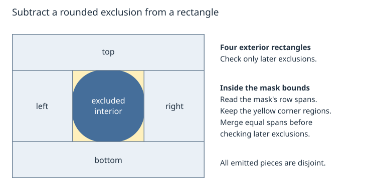
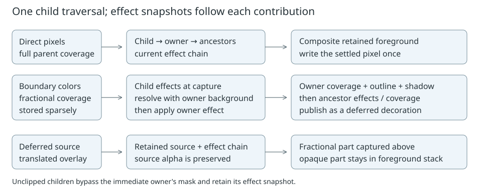
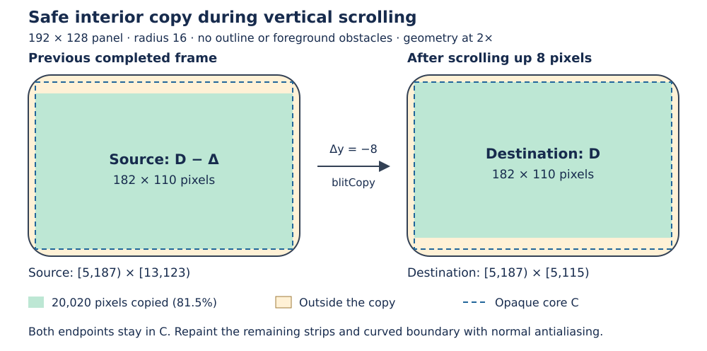

# Sparse rounded child clipping

**Status: In progress; revised for synchronous painting on 2026-10-05.**
The paint contract is the synchronous one introduced by
[15a71e91](https://github.com/dejwk/roo_windows/commit/15a71e91), which removes
interruption. Rounded-clipping stages I1–I9 were implemented on
prototype/rounded-child-clipping through
[8a61b433](https://github.com/dejwk/roo_windows/commit/8a61b433). The former P2
repair helpers were committed on round-repair as [9d484e25](https://github.com/dejwk/roo_windows/commit/9d484e25)
and are now retired from this plan. P3 continuation repair is cancelled.

P0 is implemented by merging the synchronous and rounded-prototype histories.
P1 implements bounded subtraction in
[baf5c3ab](https://github.com/dejwk/roo_windows/commit/baf5c3ab).
P4 implements owner-effect composition in five reviewable commits: existing
helper extraction, the effect primitive, optional rasterizer support, renderer
integration, and resource checks/documentation. P5 implements the private,
non-executing safe-copy planner. P6 executes those plans from the existing
cache in [7c3c9369](https://github.com/dejwk/roo_windows/commit/7c3c9369).
P7 is implemented locally and makes menu adoption follow the global scrolling
cache policy. P8 is the remaining stage; stage IDs are preserved for
delegation.
No remaining stage depends on interruption or its possible future replacement.

This document captures the original output-interception proposal and its
production plan. The [prototype report](https://github.com/dejwk/roo_windows/blob/8a61b433/docs/design/prototypes/rounded_child_clipping.md)
retains historical measurements and reproduction commands. The
[child-grouping design](https://github.com/dejwk/roo_windows/blob/8a61b433/docs/design/implemented/rounded_unclipped_children_design.md)
defines the grouping behavior to preserve; its continuation machinery is
superseded by this revision. The
[corner-capture alternative](https://github.com/dejwk/roo_windows/blob/8a61b433/docs/design/abandoned/rounded_child_clipping_design.md)
remains abandoned.

## Objective

Ship smooth clipping of child content to rounded containers, with low RAM and
CPU cost, preserved damage-based rendering, and effective scroll blitting on
devices that support it.

## Motivation

A selected menu row has rounded corners of its own. As it scrolls through a
menu's rounded exterior, both shapes must remain visible with smooth coverage.
A rectangular viewport cannot produce that result. Stationary padding hides
much of the problem but leaves a straight cutoff during scrolling.

The prototype demonstrates the desired pixels without a framebuffer or replay
of child painting. Production work must preserve that result across refreshes,
interaction effects, and hardware copying of already rendered scroll content.

## Background

The [glossary](../glossary.md), [paint context design](../implemented/paint_context_design.md),
and [current paint contract](../README.md#current-paint-contract) define shared
rendering and ownership terms. Rendering visits foreground before background.
Exclusions protect settled output; translucent decorations remain deferred
until lower content supplies their backdrop.

Application::refresh() and DisplayWindow::refresh() are synchronous void
operations with no deadline argument. Animations are sampled before layout;
painting completes before click settlement. Scheduling deadlines decide when
painting starts. They do not interrupt drawing. New invalidations raised during
paint remain eligible for the next refresh.

Composition records have one-paint lifetimes. Reusable storage can retain
capacity across paints, but each paint starts with fresh exclusions, overlays,
and boundary accumulators. A completed display image and its cache-validity
metadata can survive between refreshes. This differs from keeping partial
composition or traversal progress.

### Current rounded implementation

- [RoundedClip](../../../src/roo_windows/core/rounded_clip.h) retains corner
  geometry and fractional boundary colors in an optional window-owned arena.
- [Container](../../../src/roo_windows/core/container.cpp) prepares a record,
  paints grouped children, paints its surface, and publishes a rounded
  decoration. Its former phase/cursor checkpoints are omitted in P0.
- [Scoped routing](../../../src/roo_windows/core/paint_context.h) separates
  preparation, active masking, and contributor reconstruction.
- [MaskedExclusion](../../../src/roo_windows/core/exclusion.h) shares the
  existing opaque row spans. [ExclusionFilter](../../../src/roo_windows/core/exclusion_filter.h)
  subtracts ordinary and masked exclusions without retaining output fragments.
- Deferred rounded overlays now batch point reads and forward surviving row
  spans through the source rasterizer.
- Material menus use full-height viewports, horizontal gutters, and vertical
  padding that travels with their content. Their viewport derives from the
  `ScrollablePanel` policy alias. It uses `SimpleScrollablePanel` by default
  and `ScrollableBlitPanel` when `ROO_WINDOWS_ENABLE_BLIT_CACHE=1` is defined
  consistently for the program.

### Completed child-order extension

In the prototype, every container permitting unclipped children paints those
direct children above its clipped children. An unclipped subtree escapes its
immediate parent's mask and retains ancestor clipping. Paint, touch precedence,
and restoration use matching order. Layout and focus retain collection order.

The constant-time mayHaveUnclippedChildren() capability avoids the extra
filtered scan for containers guaranteeing clipped direct children. Panel
returns true; MenuPanel returns false for its controlled viewport child.
Each selected child paints once in a synchronous paint, although
grouped containers inspect direct-child indices in two filtered scans.

### Remaining work

1. Measure complete device scroll performance, peak stack, and retained RAM
   after integration. Historical measurements include now-obsolete state.

## Requirements

1. Preserve antialiasing at parent and child boundaries. No hard-edge fallback
   is permitted to save memory or handle unusual geometry.
2. Invoke ordinary child painting at most once per synchronous traversal; do
   not replay children to reconstruct a different part of their image.
3. Write each settled pixel at most once per paint, counting hardware-copy
   destinations as writes. Later refreshes redraw declared damage normally.
   Preserve clean output outside that damage.
4. Add no instance fields to Widget or Container. Allocate optional rendering
   state only for users of the feature; store colors only at fractional edges.
5. Bound exclusion-processing stack independently of exclusion count and
   corner radius. Fixed scenes add no warmed paint/scroll allocations.
6. Preserve the implemented grouping, input, and overflow contracts.
7. Support ordinary owner tint, ripple, and disabled styling consistently
   across direct output, deferred decorations, and buffered boundaries.
8. Reuse a substantial opaque interior during scrolling whenever the device
   supports blitCopy and source/destination correctness can be proven. Repaint
   corners and exposed strips normally. Menu integration is part of completion.
9. Preserve ordinary rectangular rendering fast paths and the existing
   exception-free, RTTI-free embedded build.
10. Use synchronous paint lifetimes. Add no partial-paint checkpoints, repair
    dependency graph, retry protocol, or deadline checks.

The first production scope requires opaque clipping-owner fills and the
widget-authoring contract for resolved direct output. Transparent owners,
arbitrary destination-dependent drawing, and arbitrary interleaving of child
groups are outside this scope. Transparent children and deferred overlays over
an opaque owner remain supported.

## Design Overview

### Original proposal: intercept output, retain only fractional colors

Children use their normal drawing code. A temporary output adapter classifies
their pixels against the active parent's rounded content boundary:

| Coverage | Action |
| --- | --- |
| Zero | Drop the contribution. |
| Full | Forward through the existing compositor and exclusions. |
| Fractional | Accumulate unmasked subtree color in sparse boundary storage. |

The parent's coverage is applied once after its clipped subtree has supplied
the boundary color. For child color S with coverage b, opaque parent fill P,
parent coverage a, and backdrop B:

$$
C=bS+(1-b)P,\qquad F=aC+(1-a)B.
$$

For example, b = 1/2 and a = 1/4 give
F = S/8 + P/8 + 3B/4. Applying a separately to each child layer would change
that composition. Actual implementation uses the existing color arithmetic
and decoration coverage, including their rounding.

Deferred child overlays contribute their fractional samples when registered.
Their retained wrappers subsequently expose only fully covered interior
samples. One completed RoundedDecoration combines captured content, owner
fill, outline, and shadow with the lower scene. Children are not asked to paint
again. Nested scopes retain the active mask chain.

### Implemented extension: separate the foreground group

Record preparation precedes both child groups. Unclipped children use the
incoming ancestor context; clipped children and the owner surface activate
this owner's mask. Scope guards restore routing on every return. Fresh clean
unclipped descendants are also reconstructed so their translucent decorations
survive scrolling underneath them.

### Production additions

- **One-paint arena lifetime:** records remain alive until deferred composition
  finishes. The next paint resets their contents and reuses capacity. Local
  traversal order replaces saved phases and child cursors.
- **Subtraction depth budget:** a limit shared by ordinary and masked recursive
  subtraction. Exhausting it selects iterative span filtering for that piece.
- **Certified copy region:** a rectangle of a completed cached composition
  whose pixels remain reusable under a translation. It excludes stationary
  foreground and fractional coverage from enclosing masks.

The first two keep state and stack small. The copy region preserves scroll
performance without storing an image in RAM. All use renderer state or the
existing optional blit wrapper; ordinary widgets acquire no new bookkeeping.

## Design Details

### Shared exclusions and bounded subtraction

Keep the implemented bounds-plus-mask representation and conservative pruning.
An exclusion protects only the intersection of its bounds with every active
ancestor's fully opaque row interval. Fractional colors stay in the compositor.
Do not flatten masks back into retained corner rectangles.

P1 implements one shared budget of eight live subtraction frames.
ExclusionFilter::fillRect and fillMaskedRect dispatch to their respective
subtraction helpers only while budget remains; the ordinary-to-masked
transition does not reset it. At zero, fillRectIteratively processes the
remaining rectangle through ExclusionUnion membership and next-change queries.
Rechecking earlier exclusions is safe because the rectangle already excludes
them. Runs are clamped to the input rectangle with 32-bit intermediates, even
when membership reports an unlimited visible suffix.

ExclusionUnion::bandEnd bounds the rows with identical exclusion spans: it
stops at ordinary rectangle edges or the earliest masked band boundary.
Fallback emits each visible horizontal run across that whole band. For example,
two exclusions covering adjacent center strips leave two full-height exterior
rectangles, even when no single descriptor covers their combined middle.
The depth parameter lives on the call stack; no filter or widget field is added.

Use the caller's existing buffered writer. Fully visible/covered rectangles
retain their bulk paths; the fallback advances through horizontal runs and
proven constant row bands. It allocates no fragment list or row-sized array
and invokes no child paint hook. Different recursive pieces remain disjoint.

The ESP32-C3 GCC 14.2.0 -Os probe records 96-byte subtraction frames and
64-byte fallback frames. Its conservative call-chain bounds are 1,504 B for
fillRects and 1,664 B for writeRects, including dispatch, buffered writers, and
mask-query callees. Both pass the 2 KiB filter-only gate, so the limit remains
eight. The wrapped output and complete renderer call chain are outside this
gate; P8 measures those. See the [P1 resource report](../prototypes/rounded_child_clipping.md#bounded-subtraction-p1)
for methodology and reproduction.

### Synchronous state and lifetime

P0 integrates routing, masks, and grouping with the synchronous baseline. A rounded owner prepares its record, paints unclipped children using
the incoming mask, activates its own mask for clipped children and surface,
and publishes its decoration. Ordinary local loops perform these steps once.
There is no saved RoundedPaintPhase, next_child cursor, or resume-only
publication flag. Keep the separation between preparation and activation:
unclipped children still need the incoming ancestor mask. Each owner prepares
exactly one record; same-owner reuse within a paint was continuation state and
is removed. The owner pointer remains only as an identity key. Nested owners
append later records before the outer surface and decoration retrieve theirs,
so the required record is not necessarily the arena's last entry.

Retain reconstruction of clean contributors whenever a rounded boundary must
be rebuilt. This supplies missing fractional colors and deferred foreground
overlays even when only the backdrop or a clipped sibling changed. That
intra-paint need remains after removal of continuation. Any reconstruction
marker lives only for the active traversal; it is not saved progress.

Deferred sources outlive the child's paint call. Therefore masks, sparse
colors, replacement decorations, and effect snapshots remain in stable arena
storage until the current paint has consumed them. Active mask ancestry still
determines clipping. Remove the structural-parent repair chain, repair bounds,
repair flags, retired-slot bookkeeping, and repair scratch introduced by old
P2. No damage-closure scan runs between refreshes.

At the next fresh paint, clear dependent descriptors/composition inputs before
resetting or reusing their source slots. Preserve reusable geometry and vector
capacity, but release borrowed widget/source references when clearing the old
paint. Replacing or destroying a subtree between refreshes must leave no stale
source reachable by the next paint. Check this lifetime without consulting a
detached owner or rasterizer. This cleanup is necessary for deferred sources;
it does not require selective continuation repair.

Keep the main baseline's invalidation contract: newly raised damage schedules
a subsequent refresh and must not be erased by end-of-paint cleanup. Painting
does not promise a transactional snapshot of arbitrary reentrant tree changes.
No new support for destroying the active traversal is introduced. Animation
sampling and click settlement follow the current synchronous refresh path.

### Owner interaction effects

P4 captures each participating widget's OverlaySpec once when entering its
paint scope. An immutable `PaintEffect` stores its device clip rectangle, flat
tint or a borrowed pointer to the paint's shared ripple, and a pointer to its
enclosing effect.
Disabled styling is a tint toward the already prepared canvas background,
with the existing disabled-content opacity. Point feedback retains its
existing overlay geometry and receives ancestor effects like other foreground.

The snapshot chain is separate from the rounded-mask chain. For example, an
ordinary pressed child inside a disabled rounded owner needs both effects,
even though only the owner contributes a mask. An unclipped child still
inherits its owner's styling while escaping that owner's mask.

For a tint color $t$ and opacity $a$, the straight-RGB transform is
$T(c) = (1-a)c + at$. Source alpha describes coverage and is preserved.
This lets deferred foreground and its background receive the same effect:

$$T(hc + (1-h)b) = hT(c) + (1-h)T(b).$$

Here $h$ is foreground coverage, $c$ its straight RGB, and $b$ the underlying
resolved color. This property avoids a group framebuffer. Integer rounding can
differ from composing the complete group first; reference tests allow two
ARGB8888 channel units, or one RGB565 channel code, for the tested combinations.
This is not a general transparent-group or destination-dependent blend API.

The implementation applies that rule in three places:

1. **Direct interior pixels.** The current effect chain is the bottom input of
   the clipper's foreground stack. Deferred overlays above it already carry
   their own sampled effects. Uniform tints keep uniform-rectangle queries.
2. **Fractional boundary pixels.** Each rounded record remembers the active
   effect at preparation. Captured contributors receive only effects inside
   that limit. `RoundedDecoration` resolves the owner's background with those
   contributors, applies its own effect once, then applies fill/outline
   coverage and shadow. The published decoration inherits remaining ancestor
   effects through its wrapper or an enclosing boundary capture.
3. **Deferred overlays.** `RoundedOverlay` retains the appropriate effect chain
   as well as its source translation and masks. Point, rectangle, and uniform
   reads apply effects using device coordinates, preserving source alpha.
   Ordinary decorations resolve their own styling and receive only ancestor
   effects from this wrapper. Their existing ripple geometry is retained.

`PaintEffect` is a plain retained scope record. `PaintEffectStack` is the
rasterizable adapter for an explicit `[first, limit)` slice. Raster reads and
modulation use the same slice: ordinary overlays select all ancestors, while
boundary capture excludes the owner whose group is still being resolved. The
clipper keeps one paint-local stack adapter for direct foreground; deferred
wrappers create short-lived adapters over their retained records.

Rectangle evaluation traverses scopes layer by layer, carrying a uniform
accumulator until a partial or varying layer actually changes pixel values.
Flat layers blend constant colors into clipped row spans using roo_display's
bulk operators. Ripples provide a rectangle at a time; an opaque full layer
can restore uniformity. Large queries use bounded tiles. For example, a small
flat scope inside a larger flat scope needs clipped span blends, not a chain
walk for every pixel. Point batches gather surviving ripple coordinates and
use indexed bulk blends, including interleaved inside/outside coordinates.

`PaintEffectStack::applyRect` resolves the tint before applying it with
`roo_display`'s SourceAtop bulk operators, so chain rounding remains identical
to sparse point application. A uniform
chain costs $O(S)$ to resolve for $S$ scopes, plus $O(N)$ modulation for $N$
varying source pixels. Varying layers still require pixel arithmetic, but
virtual sampling calls occur per layer/tile, not per pixel. SourceAtop preserves
the source coverage and exact transparent RGB while sharing `roo_display`'s
precision setting with the rest of the compositor.

A partially masked overlay evaluates only surviving opaque spans. Rejected
pixels remain transparent. Rectangle scratch is bounded at 64 colors per
buffer; point gathering uses 32 entries. There are no heap scratch buffers,
child replays, or recursion through effect depth. RoundedDecoration checks its
uniform interior before sampling fill/outline boundaries. See the
[bulk-path measurements](../prototypes/rounded_child_clipping.md#bulk-effect-composition)
for the RAM/CPU tradeoff and target-stack limits.

Outline colors receive owner styling; the owner's own shadow keeps Decoration's
shadow color and coverage. Ancestor styling affects the child's complete layer,
including its shadow. The ordinary path uses the same retained effect scopes,
so enabling rounded clipping does not change interior effect ordering. This
also fixes inherited styling on ordinary deferred foreground. Goldens remain
unchanged for the existing scenes.

Effect snapshots live in stable optional arena slots. The input model permits
one active press animation, so every ripple effect borrows the single
`PressOverlay` stored inline in `ClipperState`; that object remains unchanged
until the paint consumes all deferred sources. A new paint clears previous
dependent overlays and resets the effect slot count, while preserving vector
capacity for reuse. Ripples require no arena slot or heap allocation. No fields
are added to Widget or Container. `hasContentEffects()` also guards
raw cache copies, including caches in an unclipped child group. Active inherited
styling uses ordinary painting until copy eligibility is proven in P5/P6.
The rounded adapter advertises neither destination blending nor blit copying;
interior-copy support remains P6.

### Blit geometry: prove both endpoints

The source pixels already contain final display colors. A pixel from a rounded
edge includes its old backdrop, so copying it into an opaque interior is wrong.
Conversely, copying opaque content onto a rounded edge overwrites its coverage.
Hardware copies therefore require full enclosing-mask coverage at both ends.

For a content translation Δ, let:

- S be the previously certified source rectangle after content damage.
- C be a candidate rectangle inside every current enclosing opaque mask and
  current visible viewport. Relevant clip geometry must match its certificate;
  geometry changes invalidate reuse.
- F be current foreground pixels that copying must neither read nor overwrite.
  Use ordinary exclusions, conservative masked-exclusion bounds, and
  conservative extents of translucent overlays, pins, unclipped foreground,
  and active effects. Precise masked spans remain a paint-filter concern.

Choose a destination rectangle D within:

$$
D \subseteq C\cap(S+\Delta)\cap(C+\Delta)
              \setminus\left(F\cup(F+\Delta)\right).
$$

The source is D − Δ. The C + Δ and F + Δ terms protect source reads after
higher foreground has already painted in this traversal. Previous foreground is
already excluded from S. Clip D to actual damage/output bounds as well.

In the unoccluded example, a 192×128 panel has radius 16 and no outline.
One fully opaque core C is [5,187)×[5,123). Scrolling up eight pixels gives
D = [5,187)×[5,115), sourced from [5,187)×[13,123): 20,020 pixels, or 81.5%
of the panel. These are half-open mathematical rectangles; roo_display::Box
uses inclusive maxima. Repaint the remaining strips and fractional corners.

P5 keeps one certified rectangle per existing cache. Within the current
translated overlap, the planner evaluates a balanced inscribed core and
horizontal and vertical opaque cores. Each builder intersects exact ancestor
mask spans at the source and destination. The planner then subtracts foreground
safely and selects the largest proven result. Its recursive search is limited
to eight levels and 256 visited nodes. Candidates of 256 pixels or less also
switch to the constant-stack iterative fallback, which keeps the largest safe
remainder. This is a search-cost cutoff, not a minimum copy area: P8 will choose
any device copy threshold from measured copy-versus-repaint time. Exact
maximum-area packing of every curved sliver is outside this release.

Certification requires unchanged translated content and either an opaque cached
composition or a uniform, unchanged opaque backdrop behind its transparent
parts. A stationary patterned backdrop must not be copied as moving content.
Reject changed scale, shape, effects, content, or coordinate mapping. A rounded
descendant moving with the cached composition does not itself invalidate that
composition; the enclosing stationary clips are the endpoint constraints.

Fresh rounded reconstruction is not itself a content change. It asks clean
contributors to supply edge colors and deferred overlays again; their completed
interior pixels can still be reused. Preserve the certificate through that
reconstruction request, while actual content, backdrop, or effect changes
invalidate it. Test this distinction so the fresh-scope path cannot silently
disable every scroll copy.

### Blit execution and menu integration

P6 replaces the prototype's blanket mask rejection with the endpoint proof.
Generic output filters continue reporting blitCopy as unavailable. Only the
framework cache, after proving the rectangle, calls the raw device's copy
operation.

Reserve the destination exclusion before copying. Complete the overlap-safe
device copy, consume the pending translation, and register the destination as
settled output before continuing child painting. The exclusion protects it
for this paint only. Uncopied strips and boundaries render normally, with each
selected child invoked at most once.

Use the synchronous call order to simplify source certification. Compute a
candidate safe rectangle after consuming the old copy request and before
traversing the cache's children. Keep it in the existing cache state so content
invalidations during or after that traversal also shrink or clear it. Do not
overwrite those invalidations with an earlier candidate at the end of paint.
Only a subsequent refresh can use the resulting rectangle as a copy source;
the previous refresh has then completed, including lower-layer composition.
No pending-completion registry, deferred certificate callback, or retained
partial-frame certificate is needed.

Certificates retain geometry and validity information, not pointers into the
previous paint's mask arena. Existing movement, damage, visibility, and effect
paths invalidate reuse. A no-op refresh must not repeat a consumed translation.

Capture foreground restrictions before traversing the cache's own children.
Their later exclusions describe cached content, not foreground occluders.
Do not use mutable descriptor-vector indices as permanent ownership markers:
tail pruning can change those indices. Compute conservative safe candidates
while foreground state is available, then retain only candidate geometry.

Every eligible nonempty copy in the acceptance scenes must execute; the current
greater-than-half-panel heuristic must not suppress a useful smaller interior.
P8 measures command overhead before selecting a documented small-copy cutoff.
Devices without copy support use ordinary painting with identical pixels.

P7 connects `MenuViewport` through the existing `ScrollablePanel` policy alias.
The alias selects `SimpleScrollablePanel` by default and
`ScrollableBlitPanel` when `ROO_WINDOWS_ENABLE_BLIT_CACHE=1`. The option changes
class layout and must therefore be consistent across all translation units.
The runtime device-capability check remains in `BlitCacheContainer`, so an
enabled build safely falls back to ordinary painting when the current device
cannot copy its framebuffer. Explicit simple and cached classes remain
available for components that need a fixed policy.

The menu's transparent surface ownership, horizontal gutters, moving vertical
padding, group geometry, scrollbar behavior, selection, and borrowed-child
teardown remain unchanged. The existing wrapper is the only cache. Widget,
Container, and `SimpleScrollablePanel` acquire no fields.

The ESP32-C3 ABI probe measures `MenuPanel` as 280 B with the default policy
and 352 B with caching enabled. `MenuViewport` changes from 168 B to 240 B,
matching the 72 B difference between the two scroll-panel implementations.
The representative three-level menu payload changes from 5,528 B to 5,744 B
when all three live panels use the cache. Neither mode adds a paint-time heap
allocation.

### Resource accounting and complexity

Let K be rounded scopes in one paint, r_i their radii, E ordinary/masked exclusion
descriptors, D active mask depth, H rows queried, and V emitted visible runs.
Geometry and boundary-color payload scale with the sum of r_i. Current geometry
construction scans corner regions in O(r_i²); unchanged geometry reuses tables.
Descriptor storage is O(E), independent of radius. Nested span queries cost
O(D); iterative fallback uses constant scratch space and can cost
O((H + V) E D) in a conservative worst case. Bound recursion separately from
the existing widget nesting stack.

Recorded target measurements through I7: Widget 24 B, Container 44 B,
ClipperState 240 B; rounded record 84 B, optional shared arena 80 B, replacement
decoration 100 B, overlay wrapper 24 B, masked descriptor 12 B. At radius 16,
geometry/color capacity is 660 B, giving 844 B with the record and replacement
decoration, before arena, vectors, allocation overhead, and exclusions. A
working descriptor copy can add another 12 B per relevant masked exclusion.
The decoration is a replacement, so this is not a net-delta heap figure.

Those numbers are historical measurements, not a fresh maximum-stack claim for
I9. Its batched point reader adds two 32-element int16 arrays, 128 source bytes
of local storage before compiler layout. P8 remeasures complete call chains,
retained capacity, effect snapshots, and cache state after synchronous
integration.
P4 records current effect storage and complete host paint high-water samples
in the [owner-effects resource report](../prototypes/rounded_child_clipping.md#owner-effects-p4).
Target-board maximum stack, driver cost, and final blit state remain P8 gates.
Report first-use growth separately from warmed allocations and peak live RAM.
P0 also records savings from deleting traversal/repair state. Treat the values
above as historical costs, not the sizes of the current synchronous baseline.

Retain the shared arena's existing new/vector allocation model. No fixed
framebuffer-sized pool or per-widget reserve is added. This proposal treats
arena allocation exhaustion as fatal; it never disables antialiasing or emits
an incomplete boundary. A recoverable rendering-budget API is outside this
release.

## Proposed API

Integrate the prototype public hooks with their existing grouping semantics:

~~~cpp
bool clipsChildrenToRoundedBounds() const override { return true; }
// Preserve the prototype Panel capability for caller-provided children.
bool mayHaveUnclippedChildren() const override { return true; }
~~~

A rounded Panel can hold a clipped ScrollableBlitPanel and an unclipped badge.
The badge remains in front, escapes only that Panel's mask, and constrains the
cache's source and destination proof. Fixed owners controlling all child modes
keep the existing false capability fast path.

No new public clipping mode or mandatory widget field is proposed. Internal
contracts, introduced with their implementation and tests, are:

| Contract | Storage / lifetime |
| --- | --- |
| Rounded composition records | Stable optional arena slots for one paint; reusable capacity between paints. No saved traversal or repair state. |
| Bounded exclusion subtraction | Scalar depth argument plus constant fallback scratch; one writer per input batch. |
| Owner effect snapshot | Optional arena record, immutable until this paint finishes. |
| Blit plan | Source/destination boxes for one operation; empty means ordinary paint. |
| Source certificate | Existing cache safe rectangle and validity state, usable by the next refresh; no mask pointers or completion callbacks across frames. |

P5 introduces the tested private blit planner while ordinary painting remains
the safe fallback. P6 enables copies with integration tests. Do not expose
placeholder public methods. Public comments now allow owner tint, ripple, and
disabled styling. Resolved opaque direct output is still required; arbitrary
transparent groups and destination-dependent direct blending remain outside
the contract.

## Implementation Plan

Authoring references: [C++ guidance](../../../.github/instructions/general-cpp-code-authoring-instructions.md),
[widget guidance](../../../.github/instructions/roo-windows-widget-authoring.instructions.md),
[example guidance](../../../.github/instructions/embedded-example-authoring.instructions.md),
and [design guidance](../../../.github/instructions/general-design-authoring-instructions.md).
Each implementation step is one reviewable commit containing its focused tests
and relevant documentation/example updates. Preserve unrelated work and local overrides.

### Implemented stages, mapped to history

I1–I9 describe commits on the prototype branch. Their validation column
records historical evidence, including tests for the former interruption model.
Those tests do not impose a continuation requirement on this revision. The
synchronous contract from 15a71e91 supersedes their interruption assumptions;
P0 validates the combined renderer after removing obsolete rounded state.

| Stage | Actual commit | Implemented slice | Evidence |
| --- | --- | --- | --- |
| I1 | [1b7da40c](https://github.com/dejwk/roo_windows/commit/1b7da40c) — Prototype sparse antialiased clipping for container children | Write/drop/buffer routing, deferred overlays and decoration, nested masks, initial continuation, MenuPanel opt-in, example and resource probes. | rounded_child_clip_test; resource test; target probe; prototype pixel figures. |
| I2 | [e8d84393](https://github.com/dejwk/roo_windows/commit/e8d84393) — Let scrolling menu rows reach rounded panel edges | Full-height menu viewport, scrolling vertical padding, divider coordinates. | Menu geometry/pixel tests and reviewed submenu golden. |
| I3 | [48003266](https://github.com/dejwk/roo_windows/commit/48003266) — Store rounded exclusions as shared scanline masks | Shared-mask descriptors, filtering, conservative pruning, invalidation splitting, blit guards. | All output paths, storage, resumed descriptors, allocation and page-host regressions. |
| I4 | [8e32ebc6](https://github.com/dejwk/roo_windows/commit/8e32ebc6) — Optimizing fillRect in face of round-rect masks | Recursive ordinary/masked subtraction and equal-span coalescing. | Subdivision pixels, disjoint writes, exterior rectangles, and command batching. [aed06f01](https://github.com/dejwk/roo_windows/commit/aed06f01) documents this stage. |
| I5 | [bffbe0a7](https://github.com/dejwk/roo_windows/commit/bffbe0a7) — Separate rounded clip preparation from activation | Stable prepared records and scoped activation/restoration; unclipped design phase 1. | paint_context_test lifetime, activation, and nested-scope cases. |
| I6 | [4447e58b](https://github.com/dejwk/roo_windows/commit/4447e58b) — Paint unclipped children above clipped siblings | Grouping, capability audit, input/restoration order, phase/cursor progress; unclipped design phase 2. | Grouped rendering, interaction, interruption, example overhang, authoring guidance. |
| I7 | [be05e78f](https://github.com/dejwk/roo_windows/commit/be05e78f) — Rounded unclipped children phase 3: validate grouped traversal costs | 0/8/32-child matrix, target size/vtable/stack script, completed extension status. | No added warmed allocations; n/2n visits, one child paint, 8 B record growth. |
| I8 | [aa1d502a](https://github.com/dejwk/roo_windows/commit/aa1d502a) — Fix unclipped overlays disappearing during rounded scrolling | Explicit reconstruction scope for clean unclipped descendants, without activating the immediate parent mask. | Transparent/nested foreground, scrolling, interruption and scope restoration. |
| I9 | [8a61b433](https://github.com/dejwk/roo_windows/commit/8a61b433) — Batch rounded overlay reads through ancestor mask spans | Whole-rectangle forwarding, translated point batches, surviving row reads, transparent rejection. | RoundedOverlayTest point/span/uniform and composition/filter cases. |

[a19b540e](https://github.com/dejwk/roo_windows/commit/a19b540e) archives the
abandoned alternative; it is not an implementation stage. The Wi-Fi repository's
17084da updates its Security-menu golden for I2 and adds no renderer mechanism.

### P0. Align rounded state with synchronous painting

**Status: Implemented in the merge of prototype/rounded-child-clipping into
the synchronous main branch on 2026-10-05.** RoundedPaintPhase, next_child,
fresh/publication flags, resume constructors, and masked invalidation repair
are removed. One RoundedRepaintScope reconstructs both child groups; masks,
deferred overlays, and grouped paint/input order retain their existing behavior.

ESP32-C3 GCC 14.2.0 with -Os, -fno-exceptions, and -fno-rtti reports RoundedClip
72 B (previously 84 B), Widget 24 B, Container 44 B, ClipperState 240 B, arena
80 B, and masked descriptor 12 B. Geometry and warmed-allocation checks remain.
The implementation and ported tests below form this completed stage's scope.

**Depends on:** I1–I9 and main [15a71e91](https://github.com/dejwk/roo_windows/commit/15a71e91).
**Files:** container, rounded_clip, clipper, paint_context; prototype rendering,
masked-exclusion and resource tests, examples, and related authoring docs.

Apply the synchronous contract to the rounded implementation in one adaptation
commit. Preserve write/drop/buffer routing, masked descriptors, grouped children,
batched overlay reads, and menu edge geometry. Use local traversal order and
one-paint arena lifetimes. Remove phase/cursor checkpoints and omit all former
P2 repair infrastructure. Update remaining prototype callers to void refresh()
with no deadline. Integration of the branch histories must preserve this contract.

Port useful pixel, grouping, input, and resource tests to the new API. Remove
continuation-only cases; cover repeated complete refreshes, backdrop-only
damage, clean unclipped overlays during scrolling, nested clips, source teardown
between refreshes, and invalidations raised during paint. Verify one write per
settled pixel and one selected-child paint per traversal. Measure sizes against
both the synchronous main baseline and the historical prototype. Record the
new baseline and update prototype documentation/example guidance in this commit.

**Commit summary:** Sparse rounded child clipping P0: merge and simplify synchronous painting.

Align rounded state with the synchronous renderer, preserve its pixel and
grouping contracts, and remove obsolete traversal and repair state.

### P1. Bound recursive subtraction

**Status: Code and tests committed in
[baf5c3ab](https://github.com/dejwk/roo_windows/commit/baf5c3ab); supporting
resource-report and documentation updates accompany P4e.**
The shared eight-frame budget, iterative row-band fallback, depth-forcing and
coverage regressions, allocation checks, and reproducible target stack gate
are complete. [Results and resource deltas](../prototypes/rounded_child_clipping.md#bounded-subtraction-p1)
record the acceptance evidence. The work description below defines this stage's
completed scope.

**Depends on:** P0; algorithm from I4. **Files:** [exclusion_filter.h](../../../src/roo_windows/core/exclusion_filter.h),
[exclusion.h](../../../src/roo_windows/core/exclusion.h),
[masked exclusion tests](../../../test/masked_exclusion_test.cpp),
[subdivision tests](../../../test/masked_exclusion_subdivision_test.cpp),
[target probe](../../../benchmarks/rounded_child_clip_size_probe.sh), resource report.

Implement the shared eight-frame budget and iterative fallback described above.
Keep bulk and buffered paths; test forcing fallback at depths 0, 1, and 8.
Use ordinary-only, masked-only and mixed lists with 0/1/8/64/256 exclusions,
nested masks, negative/offscreen bounds, and fragmented streams. Compare pixels,
single writes, and batch counts with the existing coverage oracle. Measure the
target filter call chain and meet the 2 KiB filter-only gate.

**Proposed commit:** Sparse rounded child clipping P1: bound exclusion subtraction.

Add a shared recursion budget and iterative span fallback with output-equivalence,
write-count, and target-stack checks; document the selected limit.

### Retired stages P2 and P3

P2's repair-dependency helpers were committed in
[9d484e25 — round clip repair](https://github.com/dejwk/roo_windows/commit/9d484e25).
They tracked structural scope ancestry and visual bounds, expanded damage,
retired dependent descriptors, and retained reusable repair scratch. The normal
paint loop still restarted the window; P3 integration had not landed.

The [historical P2 report](https://github.com/dejwk/roo_windows/blob/9d484e25/docs/design/in_progress/rounded_child_clipping_design.md)
records seven optimized targets (142 tests), four ASan targets (84 tests), and
ESP32-C3 measurements: RoundedClip 84→96 B, arena 80→88 B, plus a lazy 36 B
scratch object and descriptor buffers. These are historical results, not new
validation of the synchronous design.

P2 is retired from the production scope; P3 is cancelled. Their repair metadata,
helpers, tests, and planned mutation/detach hooks are not prerequisites. Reuse
only generic frame-cleanup or lifetime coverage that P0 needs. This revision
does not implement a smaller version of continuation repair.

### P4. Complete owner-effect composition

**Status: P4a–P4e implemented; bulk effect fixes folded into their original stages.**
The [owner-effects report](../prototypes/rounded_child_clipping.md#owner-effects-p4)
records reference coverage, allocation costs, target sizes, and full-paint
host stack measurements. The scrolling example demonstrates owner ripple
and a pause/resume control for disabled styling. Target-board full-stack and
display-bus acceptance remain P8.

**Depends on:** P0. **Files:** [overlay_spec](../../../src/roo_windows/core/overlay_spec.h),
widget modulation, rounded_clip, clipper,
[decoration](../../../src/roo_windows/decoration/decoration.cpp);
[overlay](../../../test/overlay_test.cpp) and rounded rendering tests, example.

Implement immutable effect snapshots and consistent interior/boundary ordering.
Cover owner tint/ripple/disablement, nested owner and child effects, unclipped
foreground, fractional outlines, and changes between refreshes. Check RGB565 and ARGB8888
against a test-only reference compositor; use established coverage independently
of the routing implementation. Compare ordinary and rounded owners away from
edges. Update public restrictions and demonstrate owner feedback in the example.
Record effect storage and full stack cost; no fields on ordinary widgets.

#### P4a. Extract existing paint helpers

**Commit:** [6a947b0c](https://github.com/dejwk/roo_windows/commit/6a947b0c).

Move decoration, press-overlay configuration, and overlay-scope methods from
clipper.h to clipper.cpp. Extract lazy arena access and point-overlay emission.
Keep the existing modulation, shared ripple storage, mask routing, and paint
order. The moved method bodies are unchanged apart from whitespace.

Validation: rounded_child_clip_test, overlay_test, paint_context_test,
rounded_child_clip_resource_test, and horizontal_page_host_render_test pass
in an isolated source checkout containing only this refactoring.

**Commit message:** Sparse rounded child clipping P4: extract paint helpers without changing rendering.

Separate behavior-preserving paint preparation from owner-effect composition.

#### P4b. Introduce the paint-effect primitive

**Commit:** [f7fae558](https://github.com/dejwk/roo_windows/commit/f7fae558).

Add [PaintEffect](../../../src/roo_windows/core/paint_effect.h) with immutable
scope bounds and borrowed ripple/ancestor references. Add PaintEffectStack for
explicit chain slices, coverage-preserving modulation, and bulk rectangle and
point composition with bounded scratch. This is behavior-neutral preparation: the
renderer still uses its existing modulation path. The primitive's new color
semantics are exercised directly before any renderer integration.

Validation: [paint_effect_test](../../../test/paint_effect_test.cpp) checks
alpha preservation, inner-to-outer order, exclusive scope limits, disjoint
bounds, partial flat scopes, restored uniformity, ripple rectangle/batch call
counts, transparent RGB, and scalar-equivalent modulation. The primitive target
passes in the intermediate checkout, which also builds the unchanged renderer.

**Commit message:** Sparse rounded child clipping P4b: introduce the paint-effect primitive.

Add bounded tint/ripple snapshots and composition tests without changing
renderer call sites, as preparation for owner-effect composition.

#### P4c. Prepare rasterizers for retained effects

**Commit:** [f23122a7](https://github.com/dejwk/roo_windows/commit/f23122a7).

Add optional effect-chain support to RoundedOverlay, including bulk point and
surviving-span rectangle application, and a resolved-outline
argument to Decoration. Existing callers use the null defaults and retain
their rendering behavior. Keep effect scope capture and the rounded boundary
routing on the old path until P4d.

Validation: [paint_effect_rasterizer_test](../../../test/paint_effect_rasterizer_test.cpp)
covers translated effect-only overlays, nested masks, point/rectangle/uniform
reads, alpha preservation, and fractional outline substitution. Both new test targets pass in this intermediate checkout.

**Commit message:** Sparse rounded child clipping P4c: prepare rasterizers for retained effects.

Add optional overlay effects and resolved outlines, preserving existing caller
defaults, with focused rasterizer coverage before renderer integration.

#### P4d. Enable consistent owner-effect composition

**Commit:** [b9a509b9](https://github.com/dejwk/roo_windows/commit/b9a509b9).

Capture immutable effect scopes with the shared ripple and switch direct
output, deferred overlays, rounded boundaries, and outlines together. Remove the old widget
filters and include the conservative inherited-effect blit guard. These paths
share effect ordering and must switch in the same commit. Update the public
styling contract on Container.

Validation: [rounded_owner_effect_test](../../../test/rounded_owner_effect_test.cpp)
checks RGB565/ARGB8888 reference pixels and shared-ripple routing. The
[page-host rendering regression](../../../test/horizontal_page_host_render_test.cpp)
checks inherited-effect blit rejection against full repaint. All eight focused
targets pass, including the primitive/rasterizer tests and P4a regressions.

**Commit message:** Sparse rounded child clipping P4d: enable consistent owner-effect composition.

Apply retained owner effects once to interior and boundary content, preserving
group ordering and coverage, with reference pixels and the blit safety guard.

#### P4e. Document and measure owner effects

Add allocation checks, target size/frame probes, and the host full-stack probe,
including the P1 stack-report helper used by the measurement script. Update
the scrolling example and this design/report with the implementation sequence,
resource costs, and remaining target-board acceptance work.

Validation: all 106 root regression targets and the explicit host stack probe
pass (107 targets total). The six affected rendering targets are checked under ASan. The emulator example build and target
size/frame probe retain their existing results. No golden images change.

**Commit message:** Sparse rounded child clipping P4e: document and measure owner effects.

Record resource costs and incremental validation, add the reusable measurement
support, and demonstrate owner feedback and disabled styling in the example.

### P5. Plan safe interior copies through masks

**Status: Implemented.**
`Clipper::planBlitCopy()` returns a device-coordinate source/destination pair
without executing it. The planner borrows current masks, exclusions, and
overlay descriptors. It allocates no heap storage and adds no persistent cache
field: the existing 8-byte source certificate remains sufficient, while the
returned two-box plan is 16 transient bytes. Active content effects and
background-deferral scopes conservatively return an empty plan.

**Depends on:** P1. **Files:** [blit_plan](../../../src/roo_windows/core/blit_plan.cpp),
[clipper](../../../src/roo_windows/core/clipper.h), and
[blit-plan tests](../../../test/blit_plan_test.cpp). Coordinate read-only
clipper queries with the P4 owner.

Implement the source/destination proof, foreground subtraction, and one-rectangle
selection, without enabling device copies yet. Include previous/current
occlusion, translucent foreground, masks above and inside the cache, positive
and negative motion on both axes, diagonal motion, outlines and nested clips.
For every planned pixel, assert both endpoint proofs against an independent,
test-only per-pixel oracle; production planning uses rectangles and row spans.
The 192×128/radius-16/eight-pixel example must recover at least its 20,020-pixel
core. Return an empty plan for stale or unprovable inputs. Document the private
planner contract and proposed per-cache metadata cost.

Validation: `//:blit_plan_test` covers the reference 20,020-pixel core, both
axes and both directions, diagonal motion, asymmetric nested masks, outlines,
previous source validity, ordinary foreground, conservative masked-exclusion
bounds, translucent overlay extents, bounded-search fallback, and stale inputs.
Every selected pixel is checked by the independent oracle. P6 consumes these
plans from the framework cache.

**Proposed commit:** Sparse rounded child clipping P5: prove safe interior blit regions.

Plan one reusable rectangle using both endpoint masks and foreground restrictions,
with geometry-oracle and copied-area acceptance tests; retain paint fallback.

### P6. Execute interior copies in synchronous paints

**Status: Implemented in
[7c3c9369](https://github.com/dejwk/roo_windows/commit/7c3c9369).**
`BlitCacheContainer` consumes each pending translation once and asks the P5
planner for one certified source/destination pair. It registers the destination
as an exclusion before issuing the raw device copy, so the normal single child
traversal paints only exposed strips and rounded boundary pixels. Generic
filtered outputs continue to report no copy capability.

The existing 8-byte `blit_safe_region_` remains the cross-refresh certificate;
P6 adds no cache field or retained allocation. The cache publishes the next
certificate immediately before traversing its children. Invalidation during
that traversal therefore shrinks the published rectangle directly, and a frame
that begins background deferral clears it. Active inherited effects reject both
planning and certification. Pending translations accumulate in 32-bit fields
and fall back to ordinary paint if a planner coordinate would exceed 16 bits.

**Depends on:** P4, P5. **Files:** blit_cache_container, clipper; page-host and
rounded blit rendering tests.

Replace mask-wide rejection with certified copies. Exclude copied destinations
before subsequent painting, consume pending deltas once, and establish safe
geometry for the next refresh using the synchronous lifetime above. Treat
overlays and incoming output effects as part of the proof. Count physical writes
including blits. Compare each frame with copying disabled under scroll reversal,
large deltas, foreground changes, and successive content invalidations. Include
fresh rounded reconstruction with unchanged cached interiors, damage raised
during painting, and a following refresh with no scroll. Copied destinations
receive no subsequent writes in that paint; boundaries match the reference.
Document the certificate lifetime and invalidation contract in this commit.

Validation covers rounded owners, moving rounded descendants, stationary
foreground, scroll reversal, large moves, fresh rounded reconstruction,
successive invalidation, and damage raised by a child during painting. Tests
compare copied frames with complete repaint references and verify that ordinary
painting does not write any copied destination pixel later in the same paint.
The previous half-panel execution heuristic is removed: every nonempty proven
plan is executed. P8 retains responsibility for a measured device-specific
copy-versus-repaint cutoff.

**Proposed commit:** Sparse rounded child clipping P6: copy certified rounded interiors.

Enable mask-aware copies with same-paint destination exclusions and simple
cross-refresh source certificates, including overlap and invalidation tests.

### P7. Enable cached scrolling in menus

**Status: Implemented locally; pending review.**

**Depends on:** P6. **Files:** [menu_surface](../../../src/roo_windows/material3/menu/menu_surface.h),
rounded scrolling example, [menu geometry](../../../test/material3_menu_geometry_test.cpp),
[golden](../../../test/material3_menu_golden_test.cpp) and resource tests;
Wi-Fi flow tests in its canonical repository.

Use the existing scroll-cache wrapper in MenuViewport while preserving ownership
and layout contracts. Test both blit-capable and non-blitting devices, actual
selected rows crossing each edge, clean unclipped overlays, scrollbar changes,
submenu dismissal, and content replacement. Demonstrate actual copies in the
menu integration test, not just a synthetic BlitCacheContainer. Compare output
with full repaint and account for the MenuPanel object-size increase. Review
golden differences; correct blitting alone must not change the rendered image.

Implementation selects the existing wrapper through the global
`ROO_WINDOWS_ENABLE_BLIT_CACHE` policy. The default remains the 168 B simple
viewport. With caching enabled, real menu scrolling executes certified copies
on capable devices, compares equal to a forced full repaint, and leaves copied
destinations untouched by ordinary painting. A device that reports no copy
support takes the ordinary path. Existing menu lifecycle and golden suites run
in both configurations.

Validation runs the menu geometry, lifecycle, golden, and rounded-clipping
targets in both configurations, plus scroll-animation, app-bar binding, and
dialog teardown tests for other users of the alias. The `roo_windows_wifi`
Material 3 flow passes in both configurations. The rounded integration test
checks selected content at the top and bottom panel curves, copy execution,
single-write destinations, and equality with a forced full repaint. The golden
output is unchanged.

**Proposed commit:** Sparse rounded child clipping P7: cache rounded menu scrolling.

Connect menu viewports to certified blit reuse, preserving menu geometry and
teardown, with real-menu copy counts, pixels, examples, and size measurements.

### P8. Complete resource and device acceptance

**Depends on:** P0, P1, P4–P7. **Files:** benchmarks, resource tests, examples and this
design/report. Renderer edits require rerunning their owning stage's tests.

Measure radii 0/8/16/32/64, 1/4/8 nested clips, 1/8/64/256 exclusions, both
child groups, owner effects, and repeated damage/replacement between refreshes.
Report target peak stack, live and retained heap, allocations, pixels, commands,
median and p95 frame time, plus maximum synchronous refresh duration. Compare
the P0 baseline, final ordinary-paint path, and final blit path using the same
scene and dependency revisions. Fixed warmed scenes must add zero allocations;
base Widget/Container sizes stay unchanged. Stress paths must stay within the
configured task stack with at least 25% measured headroom.

For the physical-device acceptance scene, use 192×128/radius-16 scrolling by
eight pixels, with and without a stationary badge. On a blit-capable device,
an unoccluded frame copies at least the example's 20,020 pixels and never copies
fractional enclosing-mask pixels. Select any small-copy cutoff from measured
copy-versus-repaint time: retain a copy only when median time improves by at
least 5%, with no more than 5% p95 regression. The large-interior case must
pass; failure blocks completion and sends work back to P5/P6. Non-blitting
devices must retain matching pixels and stay within 5% median host CPU of P0
for unchanged supported scenes, measured across five isolated runs.

Run focused ASan tests, full repository regressions, emulator examples, and the
ESP32 -fno-exceptions/-fno-rtti build. Preserve the user's local dependency
override; separately validate the committed dependency versions in an isolated
checkout. Record exact board, display driver, revisions, build flags and logs.
Physical measurements are an explicit handoff when hardware is unavailable;
keep this design in progress until that gate is complete.

**Proposed commit:** Sparse rounded child clipping P8: validate production resource limits.

Record reproducible device and target resource acceptance, final regression
coverage, and measured copy thresholds; publish the completed API contract and
move this design to implemented only after every gate passes.

### Delegation and integration order

| Workstream | Start | Serial work | Shared-file coordination |
| --- | --- | --- | --- |
| Synchronous integration | I1–I9 and synchronous contract from 15a71e91 | P0 | One owner simplifies renderer state and ports tests; exclude retired P2. |
| Exclusion filtering | P0 complete | P1 | Own exclusion_filter and masked tests; publish the depth/fallback contract before P5. |
| Owner composition | P0 complete | P4 | Own rounded_clip, clipper, widget effects and decoration. |
| Blit planning | P1 complete | P5 complete | Planner and independent geometry-oracle tests prove the safe-copy contract; no device copy is enabled. |
| Blit execution and menus | P4 and P5 complete | P6 complete; P7 complete locally | Keep cache/copy changes together; coordinate Wi-Fi validation separately. |
| Acceptance | All active code stages complete | P8 | Report exact dependencies, synchronous refresh duration, and hardware availability. |

P0, P1, P4, P5, and P6 are complete, and P7 is implemented locally. P2 and P3
have no remaining dependants. An agent receives
its stage, dependency commits, file ownership,
validation commands, and acceptance criteria from this document. It returns a
commit, test results, and measured deltas. Concurrent agents must not rewrite
shared renderer files independently. Rebase on accepted dependency commits and
update stage status after its tests pass.

## Testing Plan

Run from the canonical roo_windows repository after P0 has adapted the
prototype targets to the synchronous API. The focused set is:

~~~sh
bazel test //:rounded_child_clip_test //:masked_exclusion_test \
  //:paint_context_test //:overlay_test //:rounded_owner_effect_test \
  //:rounded_child_clip_resource_test \
  //:horizontal_page_host_render_test //:application_test -c opt \
  --per_file_copt='external/roo_testing.*/.*@-Wno-error=stringop-truncation' \
  --test_output=errors
~~~

The warning override addresses the existing host Wi-Fi shim warning. Use the
repository's ASan configuration for synchronous source-lifetime tests; run
//:all after integrating the stages. New private planner targets belong in BUILD
in their owning commits. Do not reinstate deadline/continuation/repair test
targets. Port relevant mutation coverage to successive complete refreshes.

Rendering references must be independent of traversal and exclusion decisions;
existing Decoration coverage can supply shape samples. Acceptance covers
correct images, per-paint write counts, actual copy destinations, grouped child
paint counts, deferred-source lifetime, batching, warmed allocations, stack,
and refresh duration. P6 replaces blanket no-blit expectations with safe reuse
and unsafe-region rejection. Per-stage cases are the completion criteria.

Historical validation: six focused targets passed on 2026-10-04 at I9 with the
local roo_display override at d1000f9. The subsequent P2 report records its own
results. Neither establishes correctness after synchronous integration. P0
establishes the synchronous baseline; its acceptance results are recorded in
the [prototype report](../prototypes/rounded_child_clipping.md#synchronous-integration).

## Caveats

Synchronous painting occupies the UI thread until drawing completes. This
design reduces work through batching and blitting but does not bound refresh
duration or restore mid-paint input handling. P8 reports that cost explicitly.
Changes raised while painting follow the existing next-refresh contract.

Copy support is a display capability. This design adds no framebuffer to a
device that lacks it. Driver copies must preserve overlapping source data;
test both motion directions. Active effects, patterned backdrops, or foreground
occlusion can reduce the certified rectangle, but a mask elsewhere in the
scene is not a reason to disable every cache.

Child grouping is part of the prototype's API behavior, including controls such as
RadioButton that default to unclipped. Preserve its input and restoration
semantics during synchronous integration and blit changes. Opaque-owner and direct-output limits
remain explicit even after the implementation becomes production-ready.

### Rejected Alternatives

#### Replay children for corner tiles

The [archived design](https://github.com/dejwk/roo_windows/blob/8a61b433/docs/design/abandoned/rounded_child_clipping_design.md) describes a
different capture strategy. Replaying painting introduces repeated work and
additional state/lifetime obligations. Retain output interception and one
selected-child traversal.

#### Full framebuffer or corner-square storage

These simplify arbitrary compositing at an area-dependent RAM cost. Sparse
fractional colors and existing deferred overlays meet this design's scope.

#### Restore corner-row exclusion expansion

It duplicates shared geometry per exclusion and revives radius-dependent
descriptor growth. Shared masks plus bounded processing retain the implemented
storage advantage.

#### Copy the rounded bounding rectangle

This copies old backdrop mixtures and overwrites antialiased corners. Endpoint
coverage proofs and ordinary boundary rendering are required instead.

#### Permanently disable copies whenever masks exist

This is the prototype's conservative fallback. It loses a provably reusable
interior during common scrolling and does not satisfy production requirement 8.

## Future Work

- Any future interruption or partial-widget rendering needs a separate
  design. No continuation state or repair API is reserved for it here.
- Reuse shape tables across translations without rebuilding absolute geometry.
- Copy several disjoint certified rectangles when measured savings justify
  additional copy ordering and certificate state.
- General transparent clipping-owner/group composition and a recoverable
  rendering-memory budget, each with its own resource contract.
