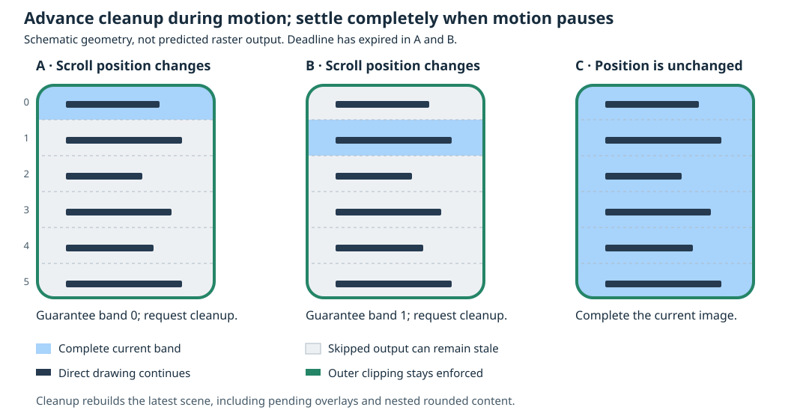
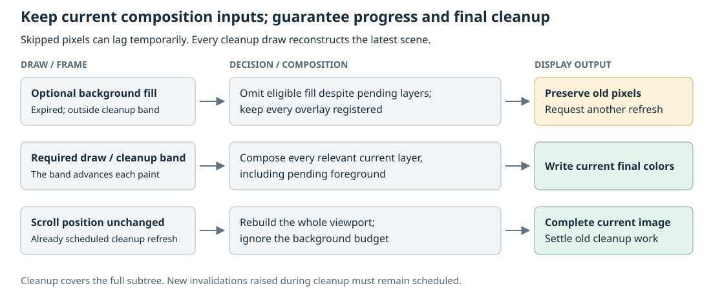

# Selective accelerated redraw

**Status: In progress, revised 2026-10-06.** P1 is implemented in
[d6f31a8b](https://github.com/dejwk/roo_windows/commit/d6f31a8b). The background
policy and public accelerated scroller remain under development. This revision
chooses temporary composition lag with guaranteed cleanup. P2a removes the
pending-decoration veto and equal-color restriction from the initial fill
helper; it supersedes the previously proposed per-decoration owner tags.

The design builds on synchronous painting and the landed rounded-mask and
owner-effect composition. The remaining blit/resource work in the
[rounded clipping design](../in_progress/rounded_child_clipping_design.md)
is independent; this proposal does not require rounded interior blit reuse.

## Objective

Improve perceived scrolling smoothness and UI-thread availability on slow
displays by allowing an explicitly selected scroller to postpone background
surface output while continuing current drawing, with guaranteed progress and
a complete image once movement pauses.

## Motivation

On a direct-to-display device, erasing the spaces between moving labels can
cost more transfer time than drawing the labels. Completing all that erasure
before servicing input or sampling the next scroll position delays the next
visible response. Some applications would accept temporary trails behind the
labels in exchange for more frequent foreground updates.

Segmented lists also have differently colored row surfaces, rounded corners,
and shadows. Requiring every decoration to finish, or requiring a row's fill
to match the viewport color, would exclude much of this intended workload.

The experiment is to spend a limited amount of time on those background fills
and their deferred composition, spread cleanup over successive moving frames,
and restore the complete image when movement stops. Temporary composition lag
is acceptable; stationary remnants left behind after cleanup are not. This produces stale pixels or ghosting, not a
physically meaningful motion blur. Its usefulness must be measured on a real
display as well as checked for rendering correctness.

## Background

The [current paint contract](../README.md#current-paint-contract) is synchronous:
`Application::refresh()` and `DisplayWindow::refresh()` return `void` and have no
deadline parameter. Animation sampling and layout precede drawing. Click
settlement follows closure of the drawing context. The old
[interrupted-paint continuation](../implemented/interrupted_paint_continuation_design.md)
mechanism is retired. Scheduling deadlines control when a refresh starts.

Rendering visits foreground before background. A
[container](../../../src/roo_windows/core/container.cpp) paints its children,
then its surface. [Exclusions](../../../src/roo_windows/core/exclusion.h)
prevent later drawing from overwriting resolved pixels. Overlays and decorations
can remain pending until a lower surface supplies their background.
[Widget authoring](../../../.github/instructions/roo-windows-widget-authoring.instructions.md#painting-model)
requires one final color per written pixel; clearing first and painting text on
top is not an acceptable optimization.

A surface fill is therefore not necessarily expendable. It can resolve a
ripple, shadow, translucent foreground, or rounded boundary. The landed
[RoundedClip](../../../src/roo_windows/core/rounded_clip.h) stores fractional
edge contributions for the current paint, and
[PaintEffect](../../../src/roo_windows/core/paint_effect.h) carries owner styling
until composition finishes. Their storage retains capacity, but their contents
are rebuilt each refresh.

[SimpleScrollablePanel](../../../src/roo_windows/containers/scrollable_panel.h)
provides scrolling without a framebuffer cache. The ordinary `ScrollablePanel`
alias currently selects `ScrollableBlitPanel`, which adds a
[BlitCacheContainer](../../../src/roo_windows/containers/blit_cache_container.h).
Copying an old display region is safe only while its cache metadata proves that
it contains the current scene. Shared ownership terms follow the
[glossary](../glossary.md).

## Requirements

1. Make the visual compromise explicit and opt-in. Existing applications retain
   complete repaint behavior by default.
2. Continue ordinary drawing and traversal while allowing temporary staleness
   wherever an eligible background operation is omitted. This includes pending
   decorations and foreground that depends on that operation. Compose every
   emitted pixel normally from current scene inputs; preserve clipping and
   background contributions needed to build rounded-edge colors.
3. Finish every traversal and close every drawing context normally. Preserve
   animation sampling, touch hit testing, and click settlement; do not retain
   traversal progress or partially composed colors across frames.
4. Revisit every skipped visible region during continued scrolling, including
   when mandatory painting already exceeds the time allowance. Once the sampled
   position stops changing, complete the current image on the next scheduled
   cleanup refresh. Do not leave permanent stale pixels or rely on another input
   event to erase them.
5. Treat external damage, content changes, hiding, revealing, and geometry
   changes conservatively. Stale output must not become a valid blit source.
6. Keep ordinary widgets free of per-instance budget or cleanup state. Bound
   optional persistent state independently of content size and frame count;
   fixed scenes must allocate nothing during warmed scrolling.
7. Measure foreground update intervals and input delivery delay. Do not promise
   preemption or a hard frame-time limit for an indivisible slow draw.

## Design Overview

Introduce three concepts:

- An **advisory paint budget** is one absolute time limit for a refresh. It is
  readable during paint and never causes a framework return, retry, or yield.
  A drawing operation finishes after starting, even when it crosses the limit.
- A **deferrable background fill** is an explicit request to erase a plain
  surface area. Under an active scroller policy, eligible parts can preserve
  the display's previous pixels. Ordinary `clear()`, `fillRect()`, drawing,
  and overlay/decoration registration still execute normally. Pending layers
  that need an omitted background draw can remain visually stale; when drawing
  proceeds, all relevant layers are composed normally.
- **Background cleanup pending** is one bit on the opted-in scroller: some of
  its viewport needs a fresh complete scene. It is not a saved frame or an
  exact damage region. A rotating band index distributes erasure during
  movement; neither field owns rasterizers or rounded-mask records.

Add `AcceleratedScrollablePanel`, derived from `SimpleScrollablePanel`.
Ordinary scrollers stay unchanged. Its lexical paint scope permits eligible
background fills in its clipped content subtree and its own surface. The
scope borrows scroller state only until that call returns. The default
`Container::paint()` uses the new fill helper, so layout and row backgrounds
participate without changing each label or icon. Custom drawing must explicitly
use the helper to make its own background operation optional.

Keep all decoration layers in their existing order in the compositor. Pending
layers do not veto an otherwise eligible skip, regardless of their type. This
accepts temporal lag in ordinary decoration, generic overlays, and captured
foreground waiting in a completed nested `RoundedDecoration`. It adds no
classification or owner metadata to overlay descriptors. Background operations
that feed an active rounded mask's fractional edge buffer still run normally.

Every paint still visits the complete current scene in the existing order.
After the budget expires, eligible background bands are left alone, except for
one mandatory band chosen in viewport coordinates. The next moving paint
advances that band. Whenever anything was deferred, the scroller invalidates
its viewport for another normal refresh. If its position has not changed at
that refresh, all background painting completes regardless of the budget.

The visual contract is bounded staleness in paint opportunities, followed by
complete settlement. It does not guarantee that every foreground contribution
reaches the display in each moving frame. The scroller owns the cleanup
obligation; the renderer needs a guarded fill helper and cache-safety plumbing.
No partial composition or traversal is resumed in a later frame.



For the illustrated 96-pixel-high viewport and 16-pixel bands, there are six
bands. Frame A guarantees current output in band 0; frame B guarantees it in
band 1. Direct drawing continues elsewhere, while omitted background operations
can also delay pending foreground. Active rounded-edge accumulation proceeds
normally. Once the sampled position stops changing, frame C completes the
entire current image. Band boundaries divide optional work; they never
inset the child viewport or clip away the top and bottom content.

## Design Details

### Advisory time, with no interruption machinery

`DisplayWindow` stores a configurable `roo_time::Duration`, defaulting to zero
(unlimited). Positive values produce an absolute deadline at the start of
`refreshPaint()`, before animation sampling and layout. Thus those costs consume
the allowance too. Saturate addition at `Uptime::Max()`; reject negative values
with the repository's checked-precondition convention.

Pass that deadline through the drawing adapter and root paint call into the
stack-owned `Clipper`. `PaintContext::paintBudgetExceeded()` reads it through
its existing clipper pointer. The unlimited path returns false without reading
the clock. Context translation/clipping shares the same deadline; entering a
widget never starts a fresh allowance. Budget changes take effect on the next
refresh.

The query uses monotonic uptime only to decide optional work. It must not
advance an animation or service input inside painting. Generic widget traversal,
drawing primitives, rounded composition, and semantic settlement do not query
it. Direct calls to `refresh()` also use the configured allowance; complete
traversal remains mandatory.

### Which background work is eligible

`PaintContext::clearDeferrableBackground()` has the same color and clip as
`clear()`. With no active eligible scroller scope, it is exactly a normal clear.
Inside a scope, divide its clipped device rectangle at viewport band boundaries
and classify each resulting rectangle. A rectangle is deferrable only when all
of these conditions hold:

| Condition | Reason |
| --- | --- |
| It lies inside the scroller's permitted viewport region. | No preserved pixels escape the opted-in surface. |
| The resolved background is opaque. Its color can differ from the scroller's. | An explicitly offered surface fill can be deferred regardless of its palette; semantic changes force a complete paint. |
| It is wholly in the opaque interior of every active rounded mask. | A fill feeding fractional-edge accumulation supplies composition data and must run. |
| No active content effect applies. | Retain the existing conservative fallback for inherited/current subtree modulation. |
| It is outside the mandatory band and the advisory budget has expired. | Preserve progress even when mandatory work overruns. |

Do not inspect the pending overlay stack to decide whether this operation can
skip. It remains registered for normal composition. Scroller admission still
rejects pre-existing overlapping foreground layers at scope entry, protecting
external surfaces such as popups. Layers introduced by the admitted subtree
subsequently share its temporal-accuracy tradeoff, without per-layer identities
or priority tests.

Dropping the equal-color condition does not make arbitrary color changes safe
to defer. Admission still permits only scroll-generated damage and existing
cleanup. Selection, theme, and content changes force the complete-paint path.
The distinction is the cause of repaint and the explicitly optional operation,
not whether two surfaces happen to have the same color.

At scope entry compute the geometric visible viewport from the display, widget
bounds, and ancestor child clips, independently of the root damage rectangle.
Respect unclipped-child rules in this ancestor walk. Intersect that viewport
with a conservative rectangular opaque interior from enclosing rounded masks.
Use the rounded geometry's inscribed rectangle, with integer endpoints verified
by `containsOpaque()`.
Remember this rectangle with the device viewport for comparison on the next
paint. Descendant masks still undergo the per-fill test. Changes to this
interior, the viewport, or the resolved background force a complete paint.
Areas outside the conservative rectangle always use ordinary painting,
including the full-height scrolled content at the top and bottom. This keeps
active rounded-edge accumulation complete. A completed nested clipping owner's
edge is different: its mask is no longer active, and its pending
`RoundedDecoration` can wait for a lower background fill inside the currently
permitted region. Its final display output is allowed to lag until cleanup.

The helper does not split a custom drawable into foreground and background.
For example, an opaque full-row tile remains mandatory in its entirety. A
custom plot can draw its current marks with resolved backgrounds, register
normal exclusions, then offer the remaining plain surface through this helper.
Returning early from ordinary `paint()` is not authorized by budget expiry.

### Pending composition can lag; its inputs remain current

Skipping an eligible background operation emits no pixels there. It can postpone
an ordinary shadow, a generic overlay, or child-edge content carried by a nested
`RoundedDecoration`. Accept that temporal inaccuracy inside the admitted
viewport. Do not remove any of those layers from the stack: a subsequent draw
that does proceed must still compose every relevant current layer in the usual
order. Standard decoration registration and raster wrappers need no policy tags.



For a segmented row, paint its text and icons normally, offer its remaining
interior to the background helper using the row's own color, and register its
decoration normally. After the deadline, a lower optional fill can preserve old
pixels in the gaps and around the row, even with that decoration pending. On a
mandatory cleanup band, the fill runs and resolves the complete current stack.
Newly sampled scene state wins; no old draw command is replayed.

`Container::fastDrawChildShadow()` currently resolves a child's decoration via
a mandatory `Canvas::clear()`. Route that framework-owned backdrop operation
through the same background helper. Its coverage handling must retain the
helper's preservation/cache semantics, so skipped pixels do not become valid
blit content. Arbitrary foreground drawing remains on its ordinary path.

Keep rounded accumulation unchanged. The active-mask eligibility check prevents
omitting fills that supply fractional boundary colors to an intermediate
buffer. An already constructed nested rounded decoration can subsequently be
suppressed at display output by an omitted backing fill; it is rebuilt from
current contributors on the next refresh. This distinction preserves normal
composition for pixels we write while allowing some clipped foreground to lag
at pixels we intentionally leave untouched.

Transient feedback can also miss a display update where it depends on an
omitted fill. Click settlement still follows a finished traversal and closed
drawing context; no guarantee that every animation sample was displayed is
added. Content/interaction invalidations use the complete-repaint path below.

### Protecting preserved pixels during the current traversal

Merely omitting a fill is insufficient: a lower ancestor can overwrite the
same pixels later. After choosing to skip an eligible rectangle, register it
through an internal `preserveBackground()` operation and record cleanup pending
on the active scope. This operation reuses ordinary rectangular exclusion
subtraction because eligibility already proved full opaque mask coverage.
Coalesce adjacent skipped bands before adding rectangles.

This is an explicit exception to the usual meaning of an exclusion. These
pixels are **protected from later writes in this paint**, but are not certified
as current scene pixels. Keep the operation separate from public
`addExclusion()`, set a sticky `backgroundDeferred()` flag on the current
clipper, and prohibit cache-validity inference from exclusions alone. Do not
expose a general public operation for claiming stale pixels as finished.

Foreground already written in the rectangle remains protected as usual. Where
no current foreground was written, zero writes intentionally preserve old
pixels. Mandatory fills pass through the existing output route, masks, effects,
and exclusion filter, so they still write each surviving pixel only once.
Later drawing cannot overwrite a preserved rectangle during this paint. Its
exclusion can suppress pending decoration or captured foreground as well as the
fill. It changes output coverage, not the stored composition inputs. Active
fractional-edge accumulation was protected by the eligibility check; all pending
layers remain available at pixels where drawing does proceed.

The extra rectangles, flag, and active-scope pointer are reset for every paint.
Only existing vector capacity can survive. No pointer to a scope, clip record,
background plan, or effect survives in the scroller.

### Progress and the complete-paint boundary

Use a fixed band height of 16 device pixels in the first implementation. For a
visible viewport starting at `y0` with height `H`, define

\[
N = \lceil H / 16 \rceil,\qquad
B_i = [y_0 + 16i,\ \min(y_0 + H - 1, y_0 + 16(i+1) - 1)].
\]

On a moving paint, band `next_band` is mandatory wherever a participating fill
intersects it. Other eligible bands paint while time remains. Check time once
before each band, not inside a display write. Advance `next_band` modulo `N`
after that traversal; do not reset it for another scroll delta or a direction
reversal. No attempt is made to prioritize a global background pass: each
container still handles its own surface after its children.

For an unchanged geometric viewport, every visible pixel omitted by this
policy is revisited within at most `N` consecutive eligible moving paints. In
the selected band no participating background operation can defer, so pending
composition there resolves against the latest scene too. Ordinary damage must
reconstruct the full affected subtree on every cleanup opportunity; merely
clearing a background or leaving children clean would not satisfy this bound.

Advance the cursor even with an already expired budget, and do not restart it
because another scroll delta arrived. A stationary old glyph, shadow, or edge
fragment therefore cannot be forgotten indefinitely while movement continues.
This bounds age in paint opportunities, not milliseconds. New movement can make
an already repaired band stale again, so simultaneous whole-viewport accuracy
is required at settlement rather than throughout a fling.

A complete paint is required for the first paint, an unlimited budget, an
unchanged sampled scroll position, or any reset described below. It ignores the
budget for background operations and resets the band cursor. Cleanup pending
already requested this refresh: completion must not depend on another touch or
animation event, even when a finger is held still. With no concurrent new
invalidation, that refresh restores the normal renderer's entire current image
and clears cleanup pending. No stale stationary pixels remain after settlement.

A complete cleanup can overrun the advisory budget. Guaranteed settlement takes
priority over maintaining the accelerated moving-frame duration.

### Invalidation and lifecycle stay local to the scroller

Comparing scroll positions alone cannot distinguish a scroll from a popup
being removed or a selection changing at the same time. Preserving such foreign
pixels would be an unintended artifact. Use the existing virtual invalidation
paths on the subclass to maintain a conservative `complete_required` bit.

The subclass overrides `propagateDirty()`, both `invalidateDescending()`
overloads, and `invalidateBeneathDescending()`, delegates to the base, and
requires a complete paint for changes not generated by its own scroll update
or cleanup request. This includes descendant content changes and damage from
above. Do not add damage-reason fields throughout the widget tree.

Add one protected no-op `SimpleScrollablePanel::onScrollUpdate(bool active)`
hook. Bracket only its framework-owned content movement and scrollbar range
updates in `applyScrollResult()` with this hook. End the bracket before
`notifyScrollPositionChanged()` invokes virtual/user callbacks. The accelerated
subclass exempts invalidations in that bracket; callback-driven content changes
remain ordinary damage and force a complete paint. Geometry/layout-driven
changes outside that bracket also force a complete paint.

After a paint that actually deferred work, invalidate the whole viewport using
a separate local cleanup-request guard. This conservatively propagates normal
damage, including backdrop damage required by rounded ancestors, without
setting `complete_required`. The current traversal has already consumed its
previous dirty state. New invalidations must survive ancestor finalization and
be considered by `DisplayWindow::nextPaintDeadline()` after drawing closes.
This is a cleanup obligation, not an animation track: it does not sample time,
advance motion, add a timer, or recursively call `refresh()`.

At the next opportunity, fresh animation/input state wins. A changed scroll
position allows another accelerated traversal. An unchanged position performs
one complete cleanup, even while a finger is held still. No input event or
motion-finished callback is needed to trigger that refresh. External damage
forces a complete paint even if scrolling continues.

Consume the old pending and complete-required bits before executing a complete
paint, not after it, so new invalidations raised inside paint survive. Reset
baseline validity on content replacement, size changes, detachment, hiding, and loss of effective
presentation; chain the existing scroller presentation callback. Compare actual
device viewport and opaque-interior geometry at paint entry to catch ancestor
movement and clip changes. Empty/offscreen paints do not establish a baseline
or schedule cleanup. Ordinary reveal invalidation restores the latest scene.
Destruction requires no task cancellation beyond existing scroller behavior,
because this feature owns no scheduled callback or registry entry.

At scope entry, inherited content effects or already registered foreground
exclusions/overlay bounds intersecting the viewport disable deferral and leave
baseline validity false. Such a paint does not prove that the visible pixels
belong to an unmodified scroller. The first subsequent unobscured, unmodulated
paint must complete before deferral resumes. This also handles an effect's
removal: checking only the current effect would miss its old display pixels.
Descendant active content effects still use the conservative per-fill fallback.
Descendant pending overlays do not veto skipping; their state changes reach the
subclass through normal invalidation.

Admission also requires the current damage clip to cover the permitted visible
viewport. A partial repaint falls back to ordinary painting and leaves a full
cleanup request pending when needed. An ancestor cannot silently narrow a
cleanup into a band and have it reported as a complete viewport repair.

### Scope boundaries and blit safety

The outermost accelerated scroller owns deferral. Nested accelerated scrollers
run their ordinary paint path and establish no second background plan. Suspend
the helper around their painting and around unclipped child groups, so their
own fills complete. Pending contributors from those traversals can still wait
for an outer background operation inside the permitted viewport; they share
its cleanup obligation. Outside the viewport, all output completes normally.
The scrollbar uses ordinary draw operations. All scopes unwind lexically.

`AcceleratedScrollablePanel` deliberately derives from the non-blitting base.
For a nested `BlitCacheContainer`, an active deferral scope disables raw copies
and invalidates its saved source region before delegating to normal painting.
There is no attempt to copy ghosted backgrounds to a new location.

An enclosing cache can start painting before it reaches the accelerated
scroller. Therefore the nested-cache entry check alone is insufficient. After
painting its child, every cache must also check the clipper's sticky
`backgroundDeferred()` flag and discard its reusable region when set, including
when the child scheduled cleanup during that paint. The propagated cleanup
invalidation also removes the region from ancestor caches. A previously valid
copy made before this frame's first deferral is allowed: its source was a
complete image, and copied destinations remain normal exclusions. No new source
region derived from an approximate frame is published. The sticky check can
conservatively disable reuse in an unrelated later cache for that one paint.

Cover both entry and post-child checks in tests; bypassing them through
`rawOut()` is not supported. Later rounded-interior blit reuse must obey the
same validity rule. Combining partial-quality backgrounds with hardware scroll
copying is intentionally outside the first version.

### State and cost

Let `K` be the number of participating surface clears visited, `N` the viewport
band count, `D` the maximum active rounded-mask depth, `A` the scroller's ancestor
count, and `O` and `E` the overlay and exclusion descriptor counts at scope
entry. A 320-pixel-high viewport has `N = 20`; a sparse list often has one layout
clear plus several nested layout clears.

Viewport/admission work takes `O(A + O + E)` per scroller paint, plus computation
of enclosing opaque interiors from the rounded geometry. The enabled fill path
classifies at most `K * N` rectangles, with `O(K * N * (1 + D))` eligibility
work: `containsOpaque()` tests rectangle endpoints, and pending overlays are
not scanned for each band. Normal exclusion/composition costs remain on draws
that proceed. Up to `K * N` extra exclusion rectangles can be emitted before
adjacency coalescing. Each `roo_display::Box` has an 8-byte payload; retained
vector capacity and allocator overhead are additional. Counts are independent
of scroll history but can grow with scene complexity.

| Storage | Proposed incremental cost |
| --- | --- |
| Ordinary `Widget`, `Container`, `SimpleScrollablePanel`, `Canvas`, `PaintContext` | Zero bytes; no optional per-instance fields. |
| `DisplayWindow` | One duration, 8-byte payload, retained even with an unlimited budget. |
| Stack-owned `Clipper` | One 8-byte deadline, one scope pointer, one boolean; approximately 16–24 bytes with alignment. |
| Accelerated scroller | Approximately 40 bytes on a 32-bit target; private state shown below. No heap-owned damage list. |
| Active scope | Approximately 32–48 stack bytes for viewport/band, borrowed state, and previous scope. No shared background color or persistent owner identity is required. Nested scrollers suspend rather than add plans. |
| Retained overlays and rounded records | Zero extra bytes for policy classification; existing composition storage is unchanged. |
| Existing exclusion storage | Extra live rectangles for this paint; high-water capacity retained, not a retained partial image. |

The disabled helper path is one scope test followed by the existing clear, with
no clock reads, band splitting, or allocation. Active checks stay in the helper;
ordinary pixel output gets no deadline branch. Decoration registration and
rounded-boundary capture still run; the saving is skipped background composition
and display output, not elimination of the tree traversal. Initial capacity
growth follows the current clipper allocation model. Test warmed allocation
counts and measure ABI sizes, incremental stack, and linked code size instead of treating payload
estimates as measured results.

For scale, a 240 by 320 RGB565 viewport is 153,600 pixel bytes. At an assumed
20 Mbit/s pixel transfer rate that is about 61 ms before command/setup overhead.
Omitting 50,000 eligible background pixels saves about 40 ms of that transfer,
before helper overhead. A device with cheap fills, a framebuffer, or opaque
row-sized foreground tiles has a very different balance. This is an arithmetic
example, not a device benchmark or a promised speedup.

## Proposed API

The budget setter and query landed in P1; the background helper and scroller
are proposed or under development. Existing refresh signatures remain intact.
Decoration registration has no new policy API or ownership metadata.

```cpp
// DisplayWindow: affects the next refresh; zero means unlimited.
void setAdvisoryPaintBudget(roo_time::Duration budget);

// PaintContext: read-only advice, and an explicit optional-erasure operation.
bool paintBudgetExceeded() const;
void clearDeferrableBackground() const;

// SimpleScrollablePanel: no state in the base; no application callback inside
// the bracket. Subclasses overriding this hook must chain the base hook.
protected:
  virtual void onScrollUpdate(bool active);
```

The new scroller uses the existing contents/direction constructor conventions:

```cpp
class AcceleratedScrollablePanel : public SimpleScrollablePanel {
 public:
  AcceleratedScrollablePanel(ApplicationContext& context, WidgetRef contents,
                             Direction direction = Direction::kVertical);

  // Force the next viewport paint to be complete and request it normally.
  void requestCompleteRedraw();

 private:
  // Sketch of persistent state; paint/invalidation/presentation overrides
  // implement the contracts above. These fields never refer to paint records.
  ScrollPosition last_position_;
  roo_display::Box last_viewport_;
  roo_display::Box last_opaque_interior_;
  roo_display::Color last_background_;
  uint16_t next_band_ = 0;
  bool baseline_valid_ = false;
  bool cleanup_pending_ = false;
  bool complete_required_ = true;
  bool in_scroll_update_ = false;
  bool requesting_cleanup_ = false;
};
```

Representative adoption for a large log list with segmented row surfaces:

```cpp
app.window().setAdvisoryPaintBudget(roo_time::Millis(16));
AcceleratedScrollablePanel log_view(app.context(), WidgetRef(log_rows));
// Attach log_view using the application's normal ownership/layout API.
```

The budget alone never opts existing scrollers into weaker rendering. Constructing
the accelerated class explicitly accepts temporary trails in eligible fills;
with an unlimited budget it behaves as a complete-paint scroller. Use
`requestCompleteRedraw()` before a capture or whenever application policy demands
a clean frame during movement. It does not synchronously paint or cancel motion.

The public query is usable as soon as it lands. The fill helper lands with exact
`clear()` behavior outside internal test scopes. Publish the accelerated class
only when admission, cleanup, lifecycle, and blit guards are complete; no public
opt-in silently performs a partly implemented protocol.

## Implementation Plan

Follow the [C++ authoring guidance](../../../.github/instructions/general-cpp-code-authoring-instructions.md),
[widget guidance](../../../.github/instructions/roo-windows-widget-authoring.instructions.md),
and, for the runnable comparison, [example guidance](../../../.github/instructions/embedded-example-authoring.instructions.md).
Each phase is one independently validated commit.

### P1 — Expose advisory time without changing painting

Implemented in [d6f31a8b](https://github.com/dejwk/roo_windows/commit/d6f31a8b).

Thread the configured absolute deadline from `DisplayWindow` to `PaintContext`
through the existing adapter/root/clipper path. Add public API documentation and
manual-clock tests for unlimited, expired, shared-context, and next-refresh
configuration behavior. Assert that a slow ordinary widget still finishes,
animation time is sampled once, and click settlement stays after context close.

**Proposed commit message:** `Selective accelerated redraw P1: expose an advisory paint budget.`

Validate `//:paint_context_test`, `//:application_test`, and
`//:click_animation_test`. No widget consumes the budget in this phase.

### P2 — Implement guarded plain-background deferral

This foundational slice keeps the initial conservative veto for every pending
overlay and same-color fills. P2a removes those restrictions under the temporal
accuracy contract before the public scroller is enabled.

Add the internal lexical scope, conservative geometry/overlay eligibility,
preservation helper, coalescing, and per-paint flag. Route default container
clears through `clearDeferrableBackground()` and suspend permission for unclipped
child groups. Add the entry and post-child blit safeguards in this same commit;
keep scopes internal to tests until a real owner supplies cleanup.

Introduce `//:background_deferral_test`. Compare disabled output with the normal
renderer, count physical writes, and verify deliberate zero-write regions,
mandatory bands, matching-color admission, overlays, owner effects, nested
rounded boundaries, scope suspension, and both cache directions. Document the
narrow preservation exception in widget-authoring guidance, retaining the
ordinary exclusion rule. Re-run rounded composition and existing blit cases.

**Proposed commit message:** `Selective accelerated redraw P2: defer eligible fills within a guarded paint scope.`

### P2a — Allow pending composition to share background deferral

Remove the per-fill pending-overlay veto and shared-color eligibility check.
Retain the active-mask geometry and active-content-effect guards, ordinary
raster inputs, and the entry admission check for pre-existing overlapping
layers. Route the fast child-shadow backdrop through the optional helper. Add
no owner fields or per-decoration classification. Update helper and widget
contract documentation to describe temporary lag in pending foreground as well
as surface decoration, with cleanup owned by the opting-in scroller.

Extend `//:background_deferral_test` with contrasting segmented-row colors,
ordinary rounded fills/outlines/shadows, generic overlays, and captured nested
rounded content waiting on an omitted fill. Verify that skipping is allowed
with those descriptors pending, while ordinary draws still compose them and
active fractional-edge accumulation still receives its necessary backgrounds.
Test fast-shadow/deferred-shadow routes and scope suspension. Check zero writes
in skipped regions, exact reference colors at every emitted pixel, single
writes, unchanged descriptor sizes, and warmed allocations. No public scroller
is exposed before P4 supplies the mandatory cleanup obligation.

**Proposed commit message:** `Selective accelerated redraw P2a: allow temporal lag in pending composition.`

### P3 — Add scroller admission and reset tracking

Add the no-op scroll-update hook and internal scroller state helper, keeping the
public accelerated class unavailable. Bracket movement before user callbacks;
implement reset decisions using existing invalidation and presentation hooks.
Add focused harness tests for simultaneous motion/content changes, popup
reveal, resize, ancestor movement, clip changes, replacement, detach/reattach,
empty clips, and callback-driven mutations. Update the scroller's hook docs.

**Proposed commit message:** `Selective accelerated redraw P3: distinguish scroll erasure from required repaint.`

Validate the new harness and `//:scrollable_panel_animation_test`; ordinary
scroll motion and connection callbacks must preserve their existing order.

### P4 — Connect progress and guaranteed cleanup

Publish `AcceleratedScrollablePanel`, wire the scope and band cursor, and use
normal viewport invalidation to request cleanup. Include public docs and API
compile coverage. Extend the focused test with a manual clock and pixel-counting
display: expiry before any optional fill, expiry mid-band, sustained motion,
reversal, held-still drag, final fling sample, nested opt-in, forced complete
redraw, and pending invalidation surviving an ancestor's paint finalization.
Use distinctive old pixels in gaps and nested rounded-edge regions that direct
foreground drawing never touches. With a budget expired on every moving frame,
verify each such pixel resolves to the current scene within a full band cycle.
Advance current content while testing so replaying old composition cannot pass.
Then stop at each possible cursor position and stop generating input/animation
work: the already scheduled next refresh must produce the complete reference
image and return the application to idle. Also verify new invalidation during
cleanup remains scheduled; it must not be erased by clearing the old obligation. Add the documented cleanup-only exception to the
widget guidance on paint-time invalidation; animation remains registry-driven.

**Proposed commit message:** `Selective accelerated redraw P4: add an opt-in scroller with progressive background cleanup.`

Validate `//:background_deferral_test`, `//:application_test`,
`//:scrollable_panel_animation_test`, and click/rounded regressions touched by
integration. No production component or Wi-Fi screen opts in automatically.

### P5 — Demonstrate and measure the tradeoff

Add `examples/simple/scrolling_log/scrolling_log.ino` and its leaf Bazel target.
Show an offline segmented log with contrasting row and viewport surfaces,
ordinary rounded row decoration, a complete/accelerated comparison, and a fixed
16 ms budget under a rounded parent. Provide emulator and documented
physical-device setup. Keep exhaustive stress cases in tests/benchmarks.

Measure 240 by 320 and 320 by 480 viewports, 1/20/100 eligible clears,
0/8/32 overlays, rounded depths 0/1/3, and sparse versus opaque-row foreground.
Include ordinary decoration and content-carrying nested rounded decoration;
report their costs and maximum measured pixel age separately.
Use scripted 2/8/24-pixel scroll deltas for at least 300 moving refreshes per
case, then stop. Compare ordinary simple scrolling, enabled deferral, and
available hardware blitting separately. Record transferred pixels/bytes,
median/p95 refresh duration, foreground update interval, input-ready-to-dispatch
latency, final cleanup duration, allocations, retained exclusions, stack, and
linked flash. State the display, bus speed, compiler, and optimization flags.

Acceptance gates: current output in each selected band, no incorrect deferred
pixel surviving a full rotation for a stable viewport, exact complete-cleanup
pixels at the next unchanged-position refresh, no duplicate physical writes,
no warmed allocations for fixed scenes, unchanged ordinary widget sizes,
no more than 2% median ordinary-paint CPU overhead over repeated runs, at most
128 bytes incremental peak stack and 8 KiB linked flash in the size probe.
On a measured transfer-bound scene with at least half the pixels eligible for
deferral, require at least a 15% reduction in p95 foreground update interval
and input dispatch delay relative to complete simple scrolling. Report the
unbudgeted cleanup spike separately. Review recorded motion on hardware for
readability and objectionable ghosting.

These are release gates, not claimed measurements. A correctness failure blocks
release. Failure of the cost or performance gates leaves the feature
experimental and the design in progress; do not widen adoption or add a more
complex scheduler to rescue it. Publish results and revise the proposal before
further optimization. On passing, update the design status and usage guidance;
individual application adoption remains explicit.

**Proposed commit message:** `Selective accelerated redraw P5: demonstrate and measure deferred scrolling backgrounds.`

## Testing Plan

Use repository-root Bazel targets and the existing manual-time, recording-display,
rounded rendering, and allocation-counting fixtures. The new focused target owns
intentional stale-output assertions and final-image comparisons; existing
application, scrolling, click, rounded-mask, owner-effect, and cache coverage
protects surrounding contracts. Test all output routes already exercised by
rounded tests, with mandatory primitives unchanged.

The example gets compile coverage and a manual emulator check. Physical-device
measurements establish the benefit and visual acceptability; emulator fill
speed cannot establish either. Documentation-only adoption of this proposal
requires link/figure validation, not a runtime test-suite run.

## Caveats

The budget cannot shorten mandatory rasterization, block transfers already in
progress, layout, or a foreground-heavy custom draw. A complete cleanup can take
as long as today's full paint. Input acquisition can happen independently, but
UI-thread event delivery still waits for the refresh to return. There is no
hard latency guarantee and no transactional whole-window image guarantee during
opted-in scrolling.

Repeated stale text can look like duplicate labels, not pleasant blur. A
background change that carries meaning must trigger a complete redraw. Pending
foreground and feedback can temporarily lag too; the hard quality requirement
is progress and final cleanup, not full foreground freshness in each moving
frame. Active-effect fallbacks and opaque row tiles can leave little eligible
work. Applications should select this class after comparing it
with ordinary and hardware-blitted scrolling on their actual device.

The main framework changes are deliberately limited but real: budget plumbing,
the explicit background helper and lexical scope, invalidation observation in
one scroller subclass, and cache guards. They are necessary to prevent an
omitted surface from being repainted by an ancestor or mistaken for valid cache
content. A scroller-only early return cannot provide those properties.

### Rejected Alternatives

#### Restore framework-wide interruption and continuation

It can stop between arbitrary widgets, but needs cross-frame traversal,
composition, cleanup, and settlement state. It conflicts with the completed
synchronous model and is unnecessary for the selected background compromise.

#### Make every drawing routine deadline-aware

It offers fine granularity but spreads checks across primitives and can omit
required intermediate composition inputs or leave a draw partly executed. Keep
the decision at the explicit surface operation, with the active-mask guard,
as described under [eligibility](#which-background-work-is-eligible).

#### Block deferral for every decoration or require a matching fill color

This is easy to prove safe but excludes the intended segmented-list workload:
rows have distinct surfaces, and broad decoration bounds cover most background
bands. The chosen temporal contract permits pending layers to lag wherever an
eligible background operation skips, while requiring prompt cleanup.

#### Drop optional decorations from the raster stack

A mandatory draw behind a pending shadow still needs it in the final color.
Budgeting decides whether an eligible background operation emits pixels; it
does not change which layers participate in a draw that proceeds. Retain all
descriptors until the paint ends.

#### Classify each decoration as background or mandatory foreground

This preserves a stronger moving-frame freshness guarantee but adds policy
metadata and attribution rules to every retained overlay. The earlier owner
pointer proposal costs 4 payload bytes per descriptor on a 32-bit target
(80 bytes for 20 descriptors), plus any padding and retained spare capacity.
The accepted contract allows temporal lag in those contributions, so that
classification is unnecessary. Band progress and unconditional settlement
prevent permanent remnants without it.

#### Retain an exact union of deferred damage

It can reduce later cleanup, but requires subtraction, movement/reveal tracking,
and lifetime rules for every outstanding piece. One viewport obligation and
one cursor meet this experiment's bounded-state requirement. Precise window
damage is a separate optimization, not a prerequisite.

#### Skip the entire surface or defer all rounded work

Some background operations supply colors to an active rounded-edge accumulator,
not directly to the screen. Omitting those inputs can change the final colors
of pixels we do emit. Keep the fully-opaque active-mask eligibility condition.
A nested rounded contributor already waiting in the overlay stack can share
output deferral and is reconstructed on later cleanup.

#### Add a cleanup animation track or independent timer

A separate driver can tune cleanup cadence, but duplicates paint scheduling and
requires lifecycle cancellation. Normal damage already requests one later
refresh and becomes quiescent after an unchanged-position cleanup.

#### Add framebuffer rendering or blend with old screen pixels

A framebuffer can enable atomic presentation and intentional temporal filtering,
but adds area-proportional RAM and often requires display readback or another
buffer. Neither is needed to evaluate omitted background writes on the current
direct rendering path.

## Future Work

Precise damage unions, stronger per-frame foreground freshness through overlay
classification, composable policies for expensive custom drawables, and safe
reuse of approximate scrolling images are separate designs. Classification is
only worth revisiting if the measured temporal artifacts justify its cost. Adopt this policy in Material components or `roo_windows_wifi` only
after the measured experiment justifies that visual tradeoff. None is required
for the cleanup or correctness contracts above.
