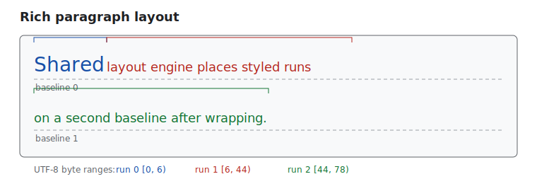

# Roo Windows Text System Design

## Objective

Complete the text stack with a reusable paragraph-layout core and an opt-in
rich-text widget while preserving the implemented, lightweight paths for
single-style text. The design must remain suitable for RAM-constrained targets
and direct-to-framebuffer painting.

**Implementation status: in progress.** `TextBlock` already implements the
plain-text portion. Shared rich layout and `RichTextBlock` remain. See the
[design status index](../README.md).

## Motivation

`TextBlock` now covers practical wrapped labels, but its line breaker and
paint artifacts are private. Adding styled spans directly would duplicate
layout logic or make every plain paragraph pay for rich-text state. A shared,
non-owning layout input and opt-in rich widget close that gap.

## Background

The current widget family is:

- [`StringViewLabel`](../../../src/roo_windows/widgets/text_label.h), a
  non-owning single-line label;
- [`TextLabel`](../../../src/roo_windows/widgets/text_label.h), an owning,
  mutable single-line label;
- [`TextBlock`](../../../src/roo_windows/widgets/text_block.h), an owning
  single-style paragraph widget; and
- [`TextField`](../../../src/roo_windows/widgets/text_field.h), a single-line
  editor backed by one shared `TextFieldEditor`.

`TextBlock` already defaults to word wrapping and supports explicit newlines,
UTF-8-safe hard breaks and ellipsis, start/center/end/justify alignment,
`maxLines()`, width-keyed caching, ink bounds, and single-pass tiled painting.
These behaviors and golden coverage are implemented in
[`text_block.cpp`](../../../src/roo_windows/widgets/text_block.cpp) and
[`text_block_test.cpp`](../../../test/text_block_test.cpp). They are the
compatibility baseline, not future work.

Fonts expose glyph metrics and horizontal string measurement, not a browser
shaping engine. The first rich-text release therefore lays out UTF-8 at valid
code-point boundaries using active `roo_display::Font` behavior. It does not
add bidi reordering, ligatures, language-specific hyphenation, or
grapheme-cluster editing.

## Requirements

1. Preserve existing `TextBlock`, `TextLabel`, and `StringViewLabel`
   source and rendering behavior.
2. Keep simple labels free of paragraph vectors and single-style paragraphs
   free of style/span tables.
3. Use one breaking, truncation, alignment, and run-placement engine for plain
   and rich paragraphs.
4. Use half-open UTF-8 byte ranges. Validate each public span boundary as a
   code-point boundary.
5. Support mixed font and foreground color in `RichTextBlock` v1. Line
   metrics must accommodate every run.
6. Preserve current breaking: forced `\n`, ASCII whitespace opportunities,
   then a UTF-8-safe hard break.
7. Preserve current alignment: paragraph-final and truncated lines are not
   justified.
8. Allocate only while rebuilding layout during measurement, reuse retained
   vector capacity, and never allocate in `paint()`.
9. Paint non-surface foreground content through `PaintContext` without
   pre-clearing or writing any pixel through multiple colors.
10. Metric changes invalidate layout and call `requestLayout()`.
    Foreground-color-only changes dirty the widget without reflow.
11. Reject invalid model updates and retain the previous model. Debug builds
    may additionally assert.
12. Inline objects, backgrounds, decorations, markup parsing, bidi shaping,
    hyphenation dictionaries, and multi-line editing are outside v1.

## Design Overview

Introduce an internal `text::ParagraphLayouter`. It consumes borrowed text
and spans and writes caller-owned layout storage. `TextBlock` supplies one
implicit style; `RichTextBlock` supplies owned text, style, and span tables.
Neither the layouter nor cached output owns text or fonts.

```text
 StringViewLabel / TextLabel        TextBlock             RichTextBlock
          (unchanged)            one implicit style     style + span tables
                                        \                    /
                                         ParagraphLayouter
                                   caller-owned lines and runs
                                                  |
                                      one PaintContext tile draw
```

The split keeps RAM proportional to capability. Plain `TextBlock` retains one
line cache. Only `RichTextBlock` pays for styles and per-line runs.



## Design Details

### Model and ownership

The internal input is a borrowed view:

```cpp
namespace roo_windows::text {

struct TextStyle {
  const roo_display::Font* font;
  roo_display::Color color;
};

struct StyleSpan {
  uint32_t begin;
  uint32_t end;
  uint16_t style_index;
};

struct ParagraphView {
  roo::string_view text;
  const TextStyle* styles;
  size_t style_count;
  const StyleSpan* spans;
  size_t span_count;
};

}  // namespace roo_windows::text
```

`TextStyle` contains only metric-affecting font and paint-only foreground
color. Its non-null font is borrowed for the widget lifetime, matching current
font ownership. Transparent color resolves from the parent at paint time.

`RichTextBlock` owns its string and vectors. Spans are sorted, non-overlapping,
non-empty, cover all text, reference valid styles, and use UTF-8 boundaries.
Setters validate a candidate before swapping it in. Empty text uses empty
tables. The public API replaces one complete `AttributedText`, avoiding
temporarily inconsistent independent setters.

### Layout artifacts and RAM

```cpp
struct LayoutRun {
  uint32_t begin;
  uint32_t end;
  uint16_t style_index;
  int16_t x;
  int16_t advance;
};

struct LayoutLine {
  uint32_t first_run;
  uint16_t run_count;
  int16_t advance;
  int16_t ascent;
  int16_t descent;
  uint16_t stretchable_spaces;
  bool ends_paragraph;
};

struct ParagraphLayout {
  std::vector<LayoutRun> runs;
  std::vector<LayoutLine> lines;
  Dimensions dimensions;
};
```

Ranges are offsets rather than source pointers, so cache storage can move safely and
future source lookup remains possible. The 32-bit build gets `static_assert`
ceilings of 20 bytes each for `LayoutRun` and `LayoutLine`. A two-line,
four-run rich label therefore uses at most 120 bytes of cache payload before
vector overhead.

Phase 1 measures the migrated plain cache. If generic artifacts increase a
two-line `TextBlock` object-plus-cache by at most 16 bytes, it uses them.
Otherwise the layouter writes a compact single-style adapter. Both paths use
identical breaking decisions. This bounded measurement closes the only
representation choice that cannot be resolved from the current source alone.

### Validation and breaking

Validation scans UTF-8 once while checking ordered spans and rejects malformed
text. Layout walks text and span boundaries monotonically.

At overflow, the layouter chooses the latest whitespace break, then the latest
fitting code-point boundary, then one complete code point to guarantee
progress. Boundary whitespace is omitted, matching `TextBlock`. Forced
newlines preserve empty lines and mark paragraph endings. Runs split at line
and style boundaries; adjacent runs with equal style coalesce.

Line ascent and descent are maxima across runs. The baseline is
`line_top + ascent`; the next line starts after `ascent + descent`.
`TextBlock` retains its current uniform `font.metrics().maxHeight()` spacing.

### Alignment and truncation

Start, center, and end use measured line advance. Justification counts eligible
ASCII spaces across runs and distributes extra pixels as quotient plus
left-to-right remainder. It never stretches tabs, edge whitespace,
paragraph-final lines, or ellipsized lines.

`maxLines() == 0` remains unlimited. Truncation drops later lines. Ellipsis
shortens the last visible line at UTF-8 boundaries until three, two, or one
dots fit. Dots use the last retained code point's style, or the paragraph's
first style for an empty line.

### Measurement, caching, and painting

The cache key contains model revision, width, wrap mode, alignment, max lines,
and ellipsis mode. Colors are excluded; font changes advance model revision.

`getSuggestedMinimumDimensions()` returns maintained unwrapped dimensions
without width-dependent measuring. Exact work occurs in `onMeasure()`, per
the [widget authoring guidance](../../widget_authoring.md). `onLayout()`
updates ink insets. `paint()` consumes a valid cache and never grows vectors.

Both paragraph widgets remain `BasicWidget`: text is foreground, not a
surface. One paragraph tile resolves glyphs, justified gaps, remaining line
width, and inter-line bands against the background supplied by
`PaintContext`. It never prefills the widget rectangle. The painter groups
compatible adjacent runs and retains no canvas, surface, or parent pointer.

### Editor seam

UTF-8 offsets provide source-to-line metadata for a future editor. Editing
state does not enter `RichTextBlock`; a multi-line editor will use a separate
widget/controller pair so read-only text pays no cursor, selection, mutation,
or scheduler cost. Grapheme-aware movement requires its own design.

## Proposed API

```cpp
namespace roo_windows {

struct TextStyle {
  const roo_display::Font* font;
  roo_display::Color color = roo_display::color::Transparent;
};

struct StyleSpan {
  uint32_t begin;
  uint32_t end;
  uint16_t style_index;
};

struct AttributedText {
  std::string text;
  std::vector<TextStyle> styles;
  std::vector<StyleSpan> spans;

  bool isValid() const;
};

class RichTextBlock : public BasicWidget {
 public:
  RichTextBlock(ApplicationContext& context, AttributedText value,
                roo_display::Alignment alignment);

  const AttributedText& attributedText() const;
  bool setAttributedText(AttributedText value);
  void setAlignment(roo_display::Alignment alignment);
  void setWrapMode(TextWrapMode wrap_mode);
  void setTextAlign(TextAlign text_align);
  void setMaxLines(uint16_t max_lines);
  void setEllipsize(bool ellipsize);
};

}  // namespace roo_windows
```

All public declarations receive Doxygen contracts. An invalid constructor value
logs `LOG(WARNING) << "Invalid attributed text; using empty text"` and creates
an empty widget because constructors cannot report failure. The setter returns
`false` and preserves its old value. Existing enums remain public and both
paragraph widgets default to wrapping. No entry point lands before its behavior
is implemented and tested.

## Implementation Plan

Authoring reference: follow the
[embedded C++ guidance](../../../.github/instructions/embedded-cpp-code-authoring.instructions.md)
and [widget guidance](../../../.github/instructions/roo-windows-widget-authoring.instructions.md).

### Phase 1: Extract and measure the shared layouter

Move existing breaking, truncation, and alignment into internal layouter types.
Migrate `TextBlock` without public changes. Add size assertions and a 32-bit
cache-size test, applying the 16-byte decision threshold above. Extend unit and
golden tests for pixel-identical explicit breaks, UTF-8 hard breaks,
justification, and ellipsis; keep the plain-text example current.

Validation: `bazel test //:text_block_test` and
`bazel build //:roo_windows`.

Proposed commit message: `Text system phase 1: extract the paragraph layouter`

`text_system_design.md` phase 1 moves TextBlock's implemented layout rules
into a measured shared core and preserves its golden output.

### Phase 2: Add validated rich layout

Add model types, atomic validation, mixed-style runs, mixed-font line metrics,
and tests. Cover malformed UTF-8, invalid boundaries, gaps, overlaps, bad
indices, coalescing, cross-span wrapping, and mixed metrics. Expose no widget.

Validation: `bazel test //:paragraph_layout_test //:text_block_test`.

Proposed commit message: `Text system phase 2: lay out validated style spans`

`text_system_design.md` phase 2 adds atomic attributed-text validation and
mixed-font layout while retaining TextBlock compatibility.

### Phase 3: Add `RichTextBlock`

Implement the non-surface widget and Doxygen contracts. Add measurement,
invalidation, color-only mutation, clipping, alignment, justification,
truncation, and mixed-style golden tests. Add an example and a size regression
test for `RichTextBlock` and representative cache payload.

Validation: `bazel test //:rich_text_block_test //:text_block_test` and build
the new example target.

Proposed commit message: `Text system phase 3: add the rich text block widget`

`text_system_design.md` phase 3 adds opt-in RichTextBlock, its single-pass
rendering tests, RAM guard, and example.

### Phase 4: Integrate real consumers

Adopt `RichTextBlock` only where mixed styling is required; retain existing
`TextBlock` uses elsewhere. Add focused consumer tests and update each
affected example. Move this design to implemented and update the status index.

Validation: affected component tests plus
`bazel test //:rich_text_block_test //:text_block_test`.

Proposed commit message: `Text system phase 4: integrate rich paragraph consumers`

`text_system_design.md` phase 4 adopts RichTextBlock at real mixed-style call
sites and closes the design.

## Testing Plan

Unit tests cover validation, UTF-8 boundaries, breaking, mixed metrics,
coalescing, justification, truncation, cache keys, and invalidation. Goldens
cover plain compatibility, style changes across wraps, mixed baselines,
clipping, alignment, and transparent color resolution. Size tests enforce
artifact ceilings and optional-widget RAM cost. Library and example builds
provide public API compile coverage.

## Caveats

Rich text necessarily has heap-backed style, span, line, and run vectors. That
cost is isolated in `RichTextBlock`; constant labels should keep using
`StringViewLabel`, mutable single lines `TextLabel`, and single-style
paragraphs `TextBlock`.

V1 inherits font-level shaping and ASCII whitespace breaking. It does not
claim correct shaping or ordering for scripts requiring more.

### Rejected Alternatives

#### Add spans to `TextBlock`

Rejected because every plain paragraph would acquire rich-model storage.

#### Store code-point indices

Rejected because rendering and `string_view` use byte ranges. Validated byte
offsets allow zero-copy slices.

#### Expose independent model setters

Rejected because text, styles, and spans can be inconsistent between calls.
Atomic replacement makes failure and invalidation predictable.

#### Use a widget per span or word

Rejected because widget state, ownership, dispatch, and allocation would scale
with fragments. Compact runs provide sufficient paint granularity.

#### Include backgrounds and decorations in v1

Rejected because their geometry changes composition and ink-bound contracts.
Font and foreground color establish the engine first.

## Future Work

- Design a grapheme-aware multi-line editor/controller using source mappings.
- Add Unicode breaking, bidi, shaping, and hyphenation after footprint analysis.
- Design inline objects and span backgrounds/decorations with baseline,
  invalidation, and single-pass rules.
- Add markup adapters that produce validated `AttributedText` outside widgets.
