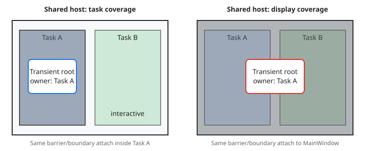

# Display runtime Phase 7 modal hosting design

## Objective

Add explicit task-modal and display-modal presentation policies with defined
coverage, input barriers, focus restoration, admission, Back routing, and
teardown.

This is Phase 7 of the
[display runtime and cross-application input design](display_surface_generalization_design.md)
and builds on task-local focus and explicit key bindings from Phases 3 and 6.

## Motivation

A modal surface needs an owning task for focus and keyboard semantics, but its
visual and input coverage is not always task-sized. Making coverage explicit
prevents a dialog in one region from accidentally blocking a whole display and
prevents a display-wide surface from leaving sibling tasks interactive.

## Background

The current root transient and scrim live in
[`MainWindow`](../../../src/roo_windows/core/main_window.h). The
[transient presentation lifetime design](../in_progress/transient_presenter_lifetime_design.md)
provides registration and teardown rules, while Phase 3 makes `UiTask` the
focus owner. Phase 4 defines task Back ordering, and Phase 6 identifies the
originating task for every key event.

Phase 7 assigns every modal presentation both an owning `UiTask` and one fixed
coverage policy.

## Requirements

### Coverage requirements

1. A task-modal presentation must paint and scrim only inside its task panel.
2. A display-modal presentation must paint in the window's top modal band and
   scrim the complete display extent.
3. Every modal presentation must retain one owning task for focus, key, Back,
   and teardown even when hosted outside that task panel.
4. Modal content must resolve `getUiTask()` to its owner through structural
   ancestry.
5. Coverage must not change after presentation starts.

### Input requirements

1. Task-modal pointer and key barriers must block underlying content only in
   the owner task.
2. Other tasks must remain pointer- and key-interactive while a task-modal
   presentation is open.
3. A display-modal barrier must block ordinary pointer and key delivery to
   every non-owner task in its window.
4. Back or Escape from any task in that window must first close the display-
   modal presentation.
5. No modal state or Back request may propagate to another application.

### Focus requirements

1. Opening a modal must save the owner's focused widget, then move focus to the
   first eligible modal descendant or clear focus when none exists.
2. Closing must restore the saved widget only when it remains eligible and
   attached to the owner task's non-modal content.
3. Saved focus must be invalidated before its subtree detaches or is destroyed.
4. Other tasks must retain their focus state while display-modal input is
   suspended.
5. Modal focus containment must not create an application- or window-global
   focus manager.

### Admission requirements

1. Each task may own at most one task-modal presentation.
2. Each display window may own at most one display-modal presentation.
3. Different tasks may hold task-modal presentations simultaneously.
4. Starting a display-modal presentation while any task-modal presentation is
   active must return `kHostBusy`.
5. Starting a task-modal presentation while a display-modal presentation is
   active must return `kHostBusy`.
6. A failed start must preserve focus, content, and every active presentation.

### Embedded requirements

1. Opening, input routing, Back, closing, and focus restoration must not
   allocate beyond explicitly transferred owned presentation content.
2. Hosts and scrims must be inline state owned by `UiTask` or `DisplayWindow`.
3. Presentation teardown must be safe under reentrant close callbacks.
4. No modal operation may use RTTI, exceptions, or shared ownership.

### Non-goals

- Nested modal stacks in one task or window.
- One modal surface covering several displays.
- Auxiliary-task exceptions to a display-modal barrier.
- Cross-application Back propagation.
- Relaxing the initial task/display admission exclusions.

## Design Overview

The two coverage policies use distinct structural hosts:



Task-modal content is the top child inside its `TaskPanel`. Display-modal
content is attached to `MainWindow`'s final band through a `DisplayModalPanel`
that overrides task lookup with the owning task. Both use the same
`ModalPresentation` controller and focus protocol.

## Design Details

### Presentation controller

`ModalPresentation` is a non-copyable controller containing a `WidgetRef`
content root, scrim color, close callback, and active host registration. The
caller can borrow or transfer content ownership. Back always closes the active
modal as the one semantic step; modal content does not veto dismissal.

`ModalPresentationRef` mirrors the repository's other ownership references and
lets `showModal()` borrow or own the controller. The host owns an owning ref
until close; borrowed controller and content storage must outlive registration.

Coverage is passed to start and stored in the registration. There is no setter
while active.

### Task-modal host

Each `UiTask` owns one inline `TaskModalPanel` above its ordinary content. When
inactive it has no child, paints nothing, and does not participate in hit
testing. When active it covers the task-local inclusive rectangle
`Rect(0, 0, width - 1, height - 1)` and paints in this order:

1. existing task content;
2. task-bounds scrim; and
3. modal content.

Its hit path ends inside modal content or the scrim barrier; it never descends
to ordinary content. Sibling task panels remain normal `MainWindow` children.

### Display-modal host

`DisplayWindow` owns one inline `DisplayModalPanel` in `MainWindow`'s final
band, above task panels, popups, non-modal presentations, pins, and their
scrims. The panel covers the complete display bounds and paints its scrim
before modal content.

The panel stores a borrowed owning `UiTask*` and overrides `getUiTask()` so
focus, editor, and task services resolve correctly despite its display-level
attachment. Owner teardown closes the presentation before the task pointer is
cleared.

While a display modal is active, the owner's `FocusManager` recognizes the
`DisplayModalPanel` as its one alternate structural root in addition to its
primary `TaskPanel`. Focus requests outside those roots still fail. Modal close
removes the alternate root before ordinary focus restoration, so the display-
hosted subtree cannot retain focus after detachment.

### Pointer and key barriers

Normal `MainWindow` hit testing checks the display-modal panel first. When it is
active, no underlying path is built. Without it, task z-order operates normally
and an active task-modal panel blocks only descent within its own task.

`UiTask::dispatchKeyEvent()` first asks its window for an active display modal.
Back and Escape close it regardless of source task. Other events from a
non-owner task are consumed by the barrier without changing that task's focus
or armed state. Owner events route only through modal descendants and their
task-local focus manager.

With no display modal, an active task modal receives its owner's events before
ordinary content. Other task sinks remain unchanged.

### Focus save and restore

The host stores one raw saved-focus pointer plus the owning task generation.
This is safe because `UiTask::onSubtreeDetaching()` clears the saved pointer
whenever the saved subtree leaves the task. No field is added to `Widget`.

Opening saves the current pointer, installs modal content, and requests the
first eligible focus target using task traversal constrained to the modal
panel. If none exists, it clears owner focus so underlying content cannot
receive keys.

Closing first clears focus inside modal content, detaches modal content, then
restores the saved widget only when the task generation is unchanged and the
focus manager still considers it eligible within ordinary task content. A
callback that focuses another widget suppresses restoration.

### Admission and reentrancy

Window admission tracks one display registration and a count of active
task-modal registrations. Validation finishes before ownership or focus moves.
The two conflict checks therefore cannot partially open a presentation.

Every registration has a generation. Close marks it inactive and detaches
content before invoking the close callback. Recursive close is a no-op; a
callback can open a new presentation, whose generation prevents the outer
close from clearing new state.

### Back ordering

For an event associated with task `T`, the complete order is:

1. close the window display-modal presentation;
2. close `T`'s task-modal presentation;
3. ask `T`'s non-modal transient;
4. ask direct content or the current destination; and
5. pop `T`'s navigator when its generation is unchanged and depth exceeds one.

Programmatic Back requires an explicit `UiTask&` and uses the same order.
Display-modal close is handled even when another task originated the request.

### Compatibility and teardown

Existing application-level dialog APIs target the first user-created
compatibility task and request display-modal coverage. They are deprecated and
removed in Phase 8. New code calls `UiTask::showModal()` explicitly.

Application teardown marks input unavailable, closes the display-modal host,
closes every task-modal host, cancels bindings and interaction state, and then
detaches ordinary task content. Close callbacks run while endpoints and widget
ancestry remain valid.

### Resource budget

Each `UiTask` adds one inactive task-modal slot, saved-focus pointer, and
generation; the accepted target increase is at most four pointers plus eight
bytes. `DisplayWindow` adds the corresponding display slot and modal panel; its
accepted increase is the slot/panel sizes plus two pointers and eight bytes.

Inactive modal hosts allocate nothing and add no paint or hit-test traversal
beyond one predictable active check. Warm open, close, Back, barrier, and focus
restore paths allocate nothing.

## Proposed API

```cpp
enum class ModalCoverage : uint8_t { kTask, kDisplay };

enum class ModalStartResult {
  kStarted,
  kHostBusy,
  kAlreadyPresented,
  kOwnerStopping,
  kWrongThread,
};

class ModalPresentation {
 public:
  ModalPresentation(WidgetRef content, roo_display::Color scrim);
  ~ModalPresentation();

  ModalPresentation(const ModalPresentation&) = delete;
  ModalPresentation& operator=(const ModalPresentation&) = delete;

  bool isShowing() const;
  void close();
};

class UiTask {
 public:
  ModalStartResult showModal(ModalPresentationRef presentation,
                             ModalCoverage coverage);
  bool hasTaskModal() const;
};

class DisplayWindow {
 public:
  bool hasDisplayModal() const;
};
```

All declarations receive Doxygen coverage, ownership, callback, focus, and
thread contracts. `close()` is idempotent and must run on the owning UI thread
after application start.

## Implementation Plan

Implementation follows the
[embedded C++ guidance](../../../.github/instructions/embedded-cpp-code-authoring.instructions.md).

### Phase 7: distinguish task-modal and display-modal hosts

1. Add modal controller/reference types, inline task/display host panels, and
   admission bookkeeping.
2. Implement exact scrim geometry, paint bands, pointer barriers, and
   owner-task ancestry for display-hosted content.
3. Add focus save/contain/restore, complete Back ordering, reentrant close, and
   teardown.
4. Migrate dialog internals and retain deprecated application forwarding to the
   first compatibility task.
5. Add focused behavioral tests and task/display coverage goldens; record size,
   flash, and allocation deltas.

Focused validation:

```sh
bazel test //:modal_host_test //:ui_task_test //:application_test \
  //:key_event_binding_test //:transient_presentation_lifetime_test \
  //:roo_windows_test
bazel build //...
```

The phase is complete when admission, both input barriers, focus restoration,
Back ordering, reentrant teardown, and both goldens pass with zero steady-state
allocation.

Proposed commit: `feat: add explicit modal coverage policies`

Proposed commit body:

> Display runtime Phase 7 adds task-modal and display-modal presentation hosts.
> Enforce exact coverage, input barriers, owner-task focus, admission, Back,
> and teardown semantics from `display_modal_hosting_design.md`.

## Testing Plan

`modal_host_test` owns admission, routing, focus, Back, and reentrancy. Golden
tests verify task-bounds versus display-bounds scrims and final-band z-order.
Existing transient lifetime tests cover controller and endpoint destruction.

Tests include simultaneous task modals in disjoint and overlapping tasks, a
display modal opened from each task, saved-focus removal, and all conflicting
start combinations.

## Caveats

A display modal blocks a same-display software-keyboard task. Text entry in
that surface therefore uses hardware input or a keyboard on another display.
This is the deterministic consequence of whole-display modality.

### Rejected Alternatives

#### Infer coverage from widget bounds

Rejected because layout geometry does not state which sibling tasks input must
block. Coverage is an explicit semantic property.

#### Use a window-global focus manager

Rejected because modal content belongs to one task and must restore that task's
focus without erasing focus retained by siblings.

#### Permit nested modal stacks

Rejected because Back, scrim composition, focus restoration, and cross-task
admission would require an ordering policy absent from current use cases.

#### Allow task and display modals concurrently

Rejected because their barrier and Back precedence would be surprising and is
unnecessary for the first explicit policy.

## Future Work

Nested presentations and an explicit auxiliary-task exception require separate
designs with revised admission, focus, and Back rules.
