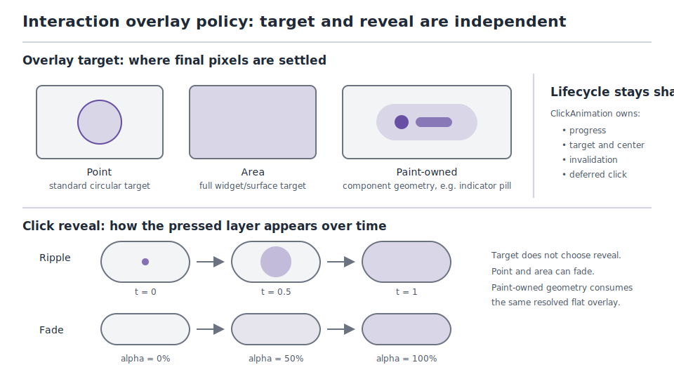

# Roo Windows Interaction Overlay Reveal Design

## Implementation status

**Proposed.** None of the defined scope is implemented. The existing point and
area ripple paths, widget-local click-animation view, paint context, and
navigation-bar paint-owned fade are implemented prerequisites. Dependency
status is recorded in the [status index](../README.md).

## Objective

Extend the shared interaction-overlay pipeline so click feedback can reveal a
state layer either with the existing expanding ripple or with a smooth fade.

The design separates:

- the **target** that receives an interaction overlay,
- the **reveal** used while click feedback progresses,
- and the shared click-animation lifecycle that supplies progress, deferred
  click delivery, and invalidation.

The first paint-owned adopter is
[`material3::NavigationBarDestination`](../../../src/roo_windows/material3/navigation_bar/navigation_bar.h).
Its indicator pill keeps component-owned geometry while state resolution and
fade progress move into the framework.

## Motivation

[`Widget::OverlayType`](../../../src/roo_windows/core/widget.h) currently
distinguishes point and area overlays, but both use the same circular ripple
reveal. Material 3 navigation destinations instead reveal the pressed state
layer by increasing its opacity over the indicator pill.

The navigation bar currently implements that fade directly in
[`InteractionOverlayFor()`](../../../src/roo_windows/material3/navigation_bar/navigation_bar.cpp).
That works, but duplicates interaction-state resolution, click-progress
handling, and animation retirement assumptions that belong to the shared
framework pipeline. More components will need non-ripple feedback, so the
framework needs one reusable extension rather than additional component-local
animation code.

## Background

### Current Overlay Pipeline

The current interaction path has three relevant layers:

1. [`ClickAnimation`](../../../src/roo_windows/core/click_animation.h) is the
   single controller owned by `MainWindow`. It tracks one target, click center,
   normalized progress, confirmation, deferred click delivery, and transient
   invalidation.
2. [`OverlaySpec`](../../../src/roo_windows/core/overlay_spec.h) resolves the
   active widget states into a flat base overlay and, during an active click,
   a circular [`PressOverlaySpec`](../../../src/roo_windows/core/overlay_spec.h).
3. [`Widget::paintWidgetModded()`](../../../src/roo_windows/core/widget.cpp)
   applies a point shape, an area filter, or the animated press overlay before
   invoking widget content paint.

The existing [`click-animation customization
design`](../implemented/click_animation_customization_design.md) deliberately
makes `Widget::getClickAnimation()` a widget-local view. Components can already
use its progress for properties such as button corner radius without adding
per-instance animation state.

### Current Coupling

Two implementation details currently equate click animation with ripple
rendering:

- `OverlaySpec::is_click_animation_in_progress()` returns whether its
  `PressOverlaySpec` is enabled.
- `Widget::paintWidgetModded()` treats an in-progress click animation as
  already painted after installing the press overlay.

A fade has no expanding `PressOverlaySpec`, but it still needs per-frame paint,
dirty propagation, final-frame settlement, clicking-state retirement, and
deferred click delivery. Animation activity must therefore become independent
from ripple presence.

### Navigation-Bar Geometry

A navigation destination has two distinct geometries:

- the full destination rectangle used for hit testing, focus, and
  invalidation,
- and the smaller indicator pill that owns the interaction state layer.

An area overlay would tint the full destination and, in the vertical layout,
would incorrectly include the label below the pill. The indicator remains
paint-owned by `NavigationBarDestination`; the framework supplies only the
resolved overlay color and animation state.

### Authoring Constraints

This design follows the
[`roo_windows` widget-authoring guidance](../../../.github/instructions/roo-windows-widget-authoring.instructions.md):

- add no stored state to `Widget` or navigation destinations,
- avoid allocation on paint and animation paths,
- prefer virtual policy hooks over per-instance strategy objects,
- preserve foreground-first, final-color-only paint,
- and keep invalidation conservative enough to restore transient pixels.

## Requirements

### Functional Requirements

1. Preserve the existing point-ripple and area-ripple behavior by default.
2. Add a fade reveal for point and area overlay targets.
3. Add a paint-owned target for components whose interaction geometry is not
   the widget's point circle or full area.
4. Keep `ClickAnimation` as the single lifecycle and progress source.
5. Let paint-owned widgets read the resolved flat overlay through the current
   `PaintContext::overlaySpec()` frame.
6. Migrate `NavigationBarDestination` from its local fade calculation to the
   shared pipeline.
7. Preserve navigation selection timing, reselection callbacks, badges,
   keyboard focus, and both compact and horizontal layouts.

### State-Layer Requirements

1. Hover, focus, selection, activation, press, and drag continue to combine
   using the existing additive-opacity and saturation semantics.
2. Fade progress scales only the clicking pressed contribution. Other active
   state layers remain at their settled opacity.
3. A long-held press settles at full pressed opacity after the fade completes.
4. A quick tap continues the fade to its full frame before deferred click
   delivery.
5. The first version is fade-in only. Removal after release follows the
   existing click-animation retirement behavior.
6. Navigation selection remains a persistent indicator-container state, not
   an additional selected interaction layer.

### Paint and Invalidation Requirements

1. `is_click_animation_in_progress()` must report timeline activity for both
   ripple and fade reveals.
2. Ripple presence must be exposed separately from timeline activity.
3. Every active fade frame marks the target dirty and invalidates its existing
   transient parent bounds, exactly as an active ripple frame does.
4. Point fade remains clipped to the standard point-overlay circle.
5. Area fade continues to use the current bounded area filter and descendant
   overlay behavior.
6. Paint-owned targets apply no framework-chosen geometry. Their `paint()`
   implementation consumes the resolved flat overlay and settles final pixel
   colors directly.
7. A fade path must not prefill a target and then redraw foreground content
   over it with a different color.

### Compatibility Requirements

1. Existing widgets that override only `getOverlayType()` retain ripple
   behavior.
2. `showClickAnimation()` retains its current meaning: whether the shared
   click timeline starts and click delivery is deferred through it.
3. Existing custom animation consumers such as Material 3 button shape morphs
   continue to read the same `ClickAnimation::progress()`.
4. Existing `OVERLAY_NONE` widgets remain outside automatic state-layer
   resolution.
5. Existing ripple golden output and interaction bounds remain unchanged.

### Embedded Requirements

1. Per-widget RAM increase is `0 B`.
2. `sizeof(Widget)`, `sizeof(SurfaceWidget)`, and
   `sizeof(NavigationBarDestination)` do not increase.
3. `ClickAnimation` gains no additional controller state.
4. Paint-time and animation-time heap allocation count remains zero.
5. The additional policy is represented by virtual return values and
   stack-resolved `OverlaySpec` fields, not retained strategy objects.
6. The modded widget paint frame does not grow by more than one byte-aligned
   scalar plus compiler padding; implementation validation records the actual
   host stack delta.

## Design Overview

### Orthogonal Target and Reveal Policies

The framework keeps target and reveal as separate decisions.

| Component family | Overlay target | Click reveal |
| --- | --- | --- |
| Checkbox, radio, switch | Point | Ripple |
| Surface and button | Area | Ripple |
| Opt-in point or area widget | Point or area | Fade |
| Navigation destination | Paint-owned indicator | Fade |



The target answers **where and by whom** final overlay pixels are settled:

- `OVERLAY_POINT`: the framework owns the standard circular target,
- `OVERLAY_AREA`: the framework owns the widget-area target,
- `OVERLAY_CUSTOM`: the widget owns target geometry and compositing,
- `OVERLAY_NONE`: the widget has no interaction overlay.

The reveal answers **how the clicking pressed layer becomes visible**:

- `kRipple`: expand the existing circular press overlay,
- `kFade`: increase the pressed-layer alpha with click progress.

`OVERLAY_CUSTOM` is not another animation style. It is a paint-ownership
boundary analogous to other `PaintContext`-based component paint: the
framework resolves state, while the component resolves geometry.

### Ownership Split

The final ownership model is:

- `MainWindow`'s `ClickAnimation` owns time, target, click center,
  confirmation, and deferred delivery.
- `Widget` supplies target and reveal policy through virtual hooks.
- `OverlaySpec` resolves current state into a flat overlay, optional ripple,
  and independent animation-activity flag.
- `Widget::paintWidgetModded()` owns automatic point and area compositing plus
  animation invalidation.
- A custom-overlay widget owns only the component-specific final geometry.

No component owns a second timer, task, callback, or retained animation
descriptor.

### Scope

In scope:

- ripple and fade click-overlay reveals,
- automatic point and area fade,
- paint-owned flat fade targets,
- navigation-bar adoption,
- state-layer role and selection-policy hooks needed by that adoption,
- focused unit, render, golden, and example-build validation.

Out of scope:

- fade-out after release,
- component-specific durations,
- component-specific easing curves,
- multiple simultaneous click-animation targets,
- arbitrary framework-owned smooth-shape clipping,
- replacement of custom property animations such as button corner morphs,
- changes to gesture recognition or deferred click timing.

## Design Details

### Overlay Target Extension

`Widget::OverlayType` gains `OVERLAY_CUSTOM` while retaining its existing name
and enumerators for source compatibility.

`OVERLAY_CUSTOM` means:

1. the widget participates in overlay state resolution,
2. `OverlaySpec` can become modded for hover, focus, press, drag, and fade,
3. the shared paint path drives click-animation invalidation and retirement,
4. the framework does not apply `base_overlay()` to a point or area,
5. the widget reads `ctx.overlaySpec()` and composites the resolved overlay
   into its own final paint geometry.

The default interaction insets for `OVERLAY_CUSTOM` are zero. A custom widget
whose interaction paint escapes logical bounds overrides the existing
`getInteractionInsets()` or transient-paint bounds hooks.

### Click Reveal Policy

`Widget` gains one virtual policy hook returning `ClickOverlayAnimation`.
The default is `kRipple`, so existing widgets do not change.

The hook is queried only while resolving an active clicking state. It does not
change hover, focus, selected, activated, dragged, or non-animated pressed
state rendering.

The reveal policy is virtual rather than stored because:

- most widget classes have one compile-time behavior,
- no current use case changes reveal style per instance,
- a virtual return adds no object RAM,
- and introducing a stored enum on every widget violates the base-widget cost
  rule.

### ClickAnimation Remains a Timeline

[`ClickAnimation`](../../../src/roo_windows/core/click_animation.h) remains
concrete and shared. Its duration, progress, center, target, and delivery
semantics do not change.

The overlay reveal is selected by the target widget during `OverlaySpec`
resolution. The controller does not store or dispatch a renderer. This keeps
custom property consumers independent: a button can continue to morph its
corner radius while its ordinary overlay uses the default ripple.

### Resolved OverlaySpec Model

`OverlaySpec` separates four outputs:

1. `base_overlay()`: the resolved flat state layer,
2. `press_overlay()`: the optional expanding ripple,
3. `is_click_animation_in_progress()`: whether the shared click timeline still
   requires frames,
4. the compact resolved target classification exposed by `is_point()`,
   `is_area()`, and `is_custom()`.

`press_overlay().enabled` no longer defines animation activity. A convenience
accessor, `has_press_overlay()`, states whether the current frame includes a
ripple.

The inert spec remains all-zero and unmodded:

- transparent base overlay,
- disabled flag false,
- animation-in-progress flag false,
- press-overlay enabled false.

The resolved target replaces the existing `is_point_` boolean with a private
one-byte target enum. Animation activity adds one boolean to each
stack-resolved `OverlaySpec`; neither change adds widget or controller fields.
Implementation keeps these scalars adjacent and measures the resulting
`sizeof(OverlaySpec)` rather than assuming a packing result.

Two `Clipper` call sites currently use animation activity as a proxy for an
installed ripple: surface-decoration construction and scoped press-overlay
retirement. They switch to `has_press_overlay()`. Automatic decoration ripple
application is additionally disabled for `is_custom()`. Decoration applies
`base_overlay()` automatically only when `is_area()` is true. A custom target
therefore remains paint-owned, while an area fade still modulates its surface
decoration without receiving an unconfigured or stale `PressOverlay` pointer.

### Fade Alpha Resolution

Fade uses the existing linear `ClickAnimation::progress()` so the navigation
bar retains its current timing.

Let:

- $t$ be click progress clamped to $[0, 1]$,
- $A_s$ be the additive opacity of active non-press states,
- $A_p$ be the resolved pressed-state opacity.

The fade-frame opacity is:

$$
A_{fade}(t) = \min(255, A_s + \lfloor t A_p \rfloor)
$$

This matches the navigation bar's current integer truncation and additive
state-layer combination. It also prevents the fade from reducing a hover or
focus layer that was already visible before the press.

State resolution follows these rules:

- clicking plus `kFade`: use $A_{fade}(t)$,
- clicking plus `kRipple`: preserve the current ripple color and alpha
  calculation,
- pressed without an active clicking timeline: include full $A_p$ in the flat
  overlay,
- clicking whose animation pointer is temporarily null: use $t = 1$ for the
  final settled frame,
- disabled: preserve the existing disabled-content filter and do not create a
  click overlay.

The default `Widget::getOverlayOpacity()` remains the single additive-opacity
resolver. When the widget is clicking with `kFade`, that method reads the
widget-local `ClickAnimation` once and scales only its pressed contribution.
Existing overrides of `getOverlayOpacity()` remain authoritative;
`OverlaySpec` does not duplicate the widget state loop or introduce a second
public opacity API.

The first implementation deliberately preserves existing ripple arithmetic,
including its combination with other active state layers. Ripple goldens must
not change as a side effect of extracting fade resolution.

### Automatic Point and Area Fade

For `OVERLAY_POINT` plus `kFade`, `base_overlay()` contains the progressively
resolved color. The existing `MakePointOverlay()` path applies that color to
the standard point circle. No `PressOverlaySpec` is installed.

For `OVERLAY_AREA` plus `kFade`, the existing area `OverlayFilter` applies the
progressively resolved color. Surface decoration and descendant behavior stay
on the current area-overlay path.

The paint path no longer uses this control flow:

```cpp
if (spec.is_click_animation_in_progress()) {
  // Assumed already drawn as a ripple.
}
```

Instead it performs these independent operations:

1. install `press_overlay()` when `has_press_overlay()` is true,
2. otherwise apply `base_overlay()` according to the overlay target,
3. call widget content paint exactly once,
4. drive the next animation frame whenever
   `is_click_animation_in_progress()` is true,
5. retire `isClicking()` after the final frame using the existing sequence.

That separation is the central framework change.

### Paint-Owned Overlay Contract

For `OVERLAY_CUSTOM`, `Widget::paintWidgetModded()` invokes content paint
without applying a framework point shape or area filter. The current
`OverlaySpec` remains available through `PaintContext::overlaySpec()`.

A paint-owned widget follows this contract:

1. resolve its component geometry,
2. read `ctx.overlaySpec().base_overlay()`,
3. blend that color into the geometry's background color,
4. draw foreground assets once against that final background,
5. exclude only regions whose final pixels are settled,
6. paint lower-Z background geometry afterward.

This is the same foreground-first rule already required by the widget-authoring
guidance. The framework does not draw a temporary translucent pill and then
redraw icons over it.

The current scope uses `OVERLAY_CUSTOM` with `kFade`. A custom ripple target
can inspect `press_overlay()` but remains responsible for its own
reveal-specific compositing. General arbitrary-shape ripple clipping is not
part of this design.

### Overlay Color Role

`Widget::effectiveOverlayColorRole()` becomes virtual. The default
implementation stays unchanged:

- point overlays use the parent container role,
- other automatic targets use the widget's effective container role.

`NavigationBarDestination` overrides it:

- selected destination: `ColorToken::kSecondaryContainer`,
- unselected destination: the parent bar's effective role,
- missing or undefined parent role: `ColorToken::kSurface`.

This keeps color selection in the same framework resolver used by other
overlays without pretending that the destination owns a full rectangular
surface.

### Selection Overlay Policy

`Widget` gains `useOverlayOnSelection()`, parallel to
`useOverlayOnActivation()` and `useOverlayOnPress()`. Its default is true,
preserving current behavior.

`getOverlayOpacity()` includes `InteractionState::kSelected` only when this
hook returns true. `setSelected()` still invalidates and notifies state changes
regardless of the overlay policy.

`NavigationBarDestination` returns false because its selected state already
owns the persistent secondary-container indicator. Adding the generic selected
state layer would double-apply selection emphasis.

### Navigation-Bar Adoption

`NavigationBarDestination` changes from `OVERLAY_NONE` to `OVERLAY_CUSTOM` and
returns `ClickOverlayAnimation::kFade`.

Its paint method replaces:

```cpp
InteractionOverlayFor(*this, indicator_role)
```

with:

```cpp
ctx.overlaySpec().base_overlay()
```

The existing foreground-first paint order remains:

1. icon tiles are drawn against the final indicator background,
2. label tiles use the indicator background only where the layout places the
   label inside the pill,
3. the pill settles remaining indicator pixels,
4. the inherited bar surface settles the rest of the destination.

`InteractionOverlayFor()` is deleted. Indicator geometry, content colors,
selection commit on touch release, deferred `onClicked()` delivery, badge
placement, and exclusion behavior stay unchanged.

### Repaint and Retirement Sequence

The fade uses the existing click lifecycle:

1. `onShowPress()` or quick `onSingleTapUp()` starts `ClickAnimation` and sets
   clicking state.
2. `OverlaySpec` resolves the frame using current progress.
3. Widget paint settles a ripple or flat overlay.
4. An unfinished frame calls `setDirty()` and invalidates
   `maxParentBounds()`.
5. The full final frame is painted at progress `1`.
6. The shared widget path clears clicking state.
7. `ClickAnimation::tick()` invalidates previous and current transient bounds
   and delivers a confirmed deferred click once the widget is clean.

No new scheduler task or invalidation hook is introduced. Paint-owned fade
stays inside destination bounds, so the navigation destination needs no new
overflow override.

### RAM, Stack, and Flash Impact

Per-instance RAM impact:

| Type | Expected delta |
| --- | ---: |
| `Widget` | `0 B` |
| `SurfaceWidget` | `0 B` |
| `NavigationBarDestination` | `0 B` |
| `ClickAnimation` | `0 B` |

`OverlaySpec` gains one animation-activity boolean in clipper-owned per-paint
storage. This is transient renderer state, not multiplied by the number of
widgets in the retained tree.

Flash increases by:

- two virtual default hooks and one newly virtual existing resolver,
- small navigation-destination policy overrides,
- one fade opacity branch,
- and the custom-target paint branch.

The implementation records `sizeof(OverlaySpec)` and the existing widget size
budgets in tests. No heap allocation is added. The hot path performs one
additional reveal-style branch only while a widget is clicking.

### Source Compatibility

Existing subclasses compile unchanged:

- `getOverlayType()` remains available with all existing enumerator values,
- the new reveal hook has a ripple default,
- the new selection-policy hook has the current true default,
- making `effectiveOverlayColorRole()` virtual changes dispatch but not its
  call signature,
- `OverlaySpec::press_overlay()` remains available.

`is_click_animation_in_progress()` keeps its name but broadens its documented
meaning from "ripple is enabled" to "the click timeline still needs frames."
Callers that need a ripple test use the new `has_press_overlay()` accessor.

## Proposed API

### Widget Policy

```cpp
class Widget {
 public:
  enum OverlayType {
    OVERLAY_NONE,
    OVERLAY_AREA,
    OVERLAY_POINT,
    OVERLAY_CUSTOM,
  };

  /// Selects how the clicking pressed layer becomes visible.
  enum class ClickOverlayAnimation : uint8_t {
    kRipple,
    kFade,
  };

  /// Returns the target/compositing policy for interaction overlays.
  virtual OverlayType getOverlayType() const { return OVERLAY_POINT; }

  /// Returns the reveal used by the clicking pressed overlay.
  virtual ClickOverlayAnimation getClickOverlayAnimation() const {
    return ClickOverlayAnimation::kRipple;
  }

  /// Returns whether selected state contributes a generic interaction layer.
  virtual bool useOverlayOnSelection() const { return true; }

  /// Returns the effective container role used to resolve overlay color.
  virtual ::roo_windows::material3::ColorToken
  effectiveOverlayColorRole() const;
};
```

The enum remains nested in `Widget`, close to the existing `OverlayType`, and
uses no stored policy field.

### Resolved Overlay State

```cpp
class OverlaySpec {
 public:
  /// Returns true while the click timeline requires another paint frame.
  bool is_click_animation_in_progress() const {
    return click_animation_in_progress_;
  }

  /// Returns true when this frame contains an expanding press ripple.
  bool has_press_overlay() const { return press_overlay_spec_.enabled; }

  /// Returns true when the framework owns an area overlay target.
  bool is_area() const { return target_ == Target::kArea; }

  /// Returns true when the framework owns a point overlay target.
  bool is_point() const { return target_ == Target::kPoint; }

  /// Returns true when the widget owns overlay geometry and compositing.
  bool is_custom() const { return target_ == Target::kCustom; }

  /// Returns the resolved flat interaction layer for this frame.
  roo_display::Color base_overlay() const { return base_overlay_; }

  /// Returns the ripple description; enabled is false when no ripple exists.
  const PressOverlaySpec& press_overlay() const {
    return press_overlay_spec_;
  }

 private:
  enum class Target : uint8_t {
    kNone,
    kArea,
    kPoint,
    kCustom,
  };

  Target target_;
  bool click_animation_in_progress_;
};
```

### Navigation Destination Policy

```cpp
class NavigationBarDestination : public BasicWidget {
 public:
  OverlayType getOverlayType() const override { return OVERLAY_CUSTOM; }

  ClickOverlayAnimation getClickOverlayAnimation() const override {
    return ClickOverlayAnimation::kFade;
  }

  bool useOverlayOnSelection() const override { return false; }

  ::roo_windows::material3::ColorToken
  effectiveOverlayColorRole() const override;
};
```

No API lands before its behavior. Phase 1 lands automatic fade with the reveal
hook; Phase 2 adds `OVERLAY_CUSTOM` and its navigation consumer together.

## Implementation Plan

Implementation follows the
[`roo_windows` code-authoring guidance](../../../.github/skills/roo-windows-code-authoring/SKILL.md),
the shared
[`embedded C++ guidance`](../../../.github/instructions/embedded-cpp-code-authoring.instructions.md),
and the
[`roo_windows` widget-authoring guidance](../../../.github/instructions/roo-windows-widget-authoring.instructions.md).

### Phase 1: Separate click activity from ripple rendering and add automatic fade

1. Add `Widget::ClickOverlayAnimation` and the default
   `getClickOverlayAnimation()` hook.
2. Add explicit click-animation activity storage and `has_press_overlay()` to
   `OverlaySpec`.
3. Replace `OverlaySpec::is_point_` with the compact resolved target and add
   `is_area()` while preserving the existing `is_point()` accessor.
4. Preserve the existing ripple resolution branch and output.
5. Add fade opacity resolution for point and area targets.
6. Refactor `Widget::paintWidgetModded()` so ripple installation, flat-overlay
   painting, and animation invalidation are independent operations and content
   is painted exactly once.
7. Change `Clipper` decoration and scoped-overlay checks that specifically need
   ripple presence to use `has_press_overlay()` rather than the broadened
   animation-activity accessor.
8. Extend `overlay_test` with focused automatic point-fade and area-fade
   render tests, final-frame settlement, long-press behavior, quick-tap
   deferred delivery, area-decoration modulation without a press overlay, and
   unchanged ripple coverage.
9. Record `sizeof(OverlaySpec)` and confirm the existing widget size assertions
   remain unchanged.

Proposed commit message:

> Interaction overlay reveal Phase 1: add automatic fade feedback.
>
> Separate click-animation activity from ripple presence in `OverlaySpec`, add
> the RAM-neutral `ClickOverlayAnimation` widget policy, and teach the shared
> point and area paint paths to render progressive flat fades while preserving
> existing ripple output and click retirement behavior. Cover both reveal
> styles in `overlay_test` under the interaction-overlay-reveal design.

Validation:

```sh
bazel test //:overlay_test
bazel test //:material3_button_test //:material3_tabs_test
```

### Phase 2: Add paint-owned overlays and migrate navigation destinations

1. Add `OVERLAY_CUSTOM` with zero default interaction insets and framework
   animation/invalidation participation.
2. Make `effectiveOverlayColorRole()` virtual without changing its default
   result.
3. Add `useOverlayOnSelection()` and gate only the selected-state opacity
   contribution on it.
4. Change `NavigationBarDestination` to paint-owned fade policy, override its
   selected/unselected overlay role, and consume
   `ctx.overlaySpec().base_overlay()` in indicator paint.
5. Delete `InteractionOverlayFor()` and retain existing indicator geometry and
   foreground-first exclusion order.
6. Update navigation unit tests for the new policy, add render coverage for
   intermediate fade opacity and final settlement in vertical and horizontal
   layouts, and retain existing badge and selection goldens.
7. Keep the existing navigation-bar example unchanged as the user-visible
   demonstration. Add the missing `material3_navigation_bar_example_build`
   Bazel target around the existing
   [`material3_navigation_bar_example_build.cpp`](../../../test/material3_navigation_bar_example_build.cpp)
   compile harness so the example remains build-covered without mutating
   `emulation/main.cpp`.
8. Re-run size budgets for `NavigationBarDestination` and
   `BadgedNavigationBarDestination`.

Proposed commit message:

> Interaction overlay reveal Phase 2: migrate navigation destinations to paint-owned fade.
>
> Add the custom overlay target, overlay-role and selection-layer policy hooks,
> then replace the navigation bar's local interaction-progress calculation
> with the shared `OverlaySpec` fade while preserving pill geometry, selection
> timing, badges, and foreground-first paint. Add focused navigation unit and
> render coverage under the interaction-overlay-reveal design.

Validation:

```sh
bazel test //:overlay_test
bazel test //:material3_navigation_bar_test
bazel test //:material3_navigation_bar_golden_test
bazel test //:material3_navigation_bar_example_build
```

## Testing Plan

The implementation validates four layers:

1. **Resolution:** `OverlaySpec` distinguishes active animation, optional
   ripple, and progressive flat overlay at start, intermediate, and final
   progress.
2. **Rendering:** point fade remains circular, area fade remains bounded, and
   existing point/area ripple pixels do not regress.
3. **Lifecycle:** long press, quick release, cancellation, final-frame
   settlement, invalidation, and deferred click delivery behave identically
   across ripple and fade.
4. **Navigation integration:** vertical and horizontal indicator pills consume
   shared fade state without tinting out-of-pill label pixels; selected,
   unselected, focused, disabled, and badged destinations retain their current
   geometry and semantics.

Primary targets:

```sh
bazel test //:overlay_test
bazel test //:material3_button_test //:material3_tabs_test
bazel test //:material3_navigation_bar_test
bazel test //:material3_navigation_bar_golden_test
bazel test //:material3_navigation_bar_example_build
```

Tests that sample animation progress use the existing host `delay()` pattern
with broad interior assertions rather than exact millisecond boundaries. Static
goldens remain deterministic and do not capture a wall-clock-dependent
intermediate frame.

## Caveats

### Fixed Timing

Fade uses the existing 200 ms click timeline and linear progress. This is a
closed v1 decision: it matches the navigation bar's current implementation and
avoids changing deferred click timing. Component-specific duration or easing
requires a separate design because duration currently controls both visual
settlement and click delivery.

### Fade-In Without Fade-Out

The overlay reaches full pressed opacity and retires through the existing
click lifecycle. It does not start a second release animation. Adding fade-out
would require the controller to represent a release phase and keep repainting
after clicking state is cleared; that is outside this scope.

### Paint-Owned Responsibility

`OVERLAY_CUSTOM` deliberately gives geometry ownership to the component.
Incorrect custom paint can still tint the wrong region or violate write-once
ordering. The API limits shared responsibility to state resolution and
lifecycle; navigation tests demonstrate the required paint pattern.

### Rejected Alternatives

#### Add `OVERLAY_FADE` as a fourth overlay type

Rejected because point versus area describes target geometry, while ripple
versus fade describes temporal reveal. Combining both into one enum creates a
cross-product of point-ripple, area-ripple, point-fade, area-fade, and custom
variants and makes future additions harder.

#### Subclass or replace `ClickAnimation`

Rejected because the shared controller already provides the correct target,
progress, confirmation, invalidation, and deferred delivery. Polymorphic
animation controllers would add ownership questions and either per-widget
storage or dynamic allocation without improving overlay compositing.

#### Add a navigation-bar-only fade helper

Rejected because it leaves click activity coupled to ripple presence and
causes every later fade component to duplicate progress, state-layer, and
retirement logic.

#### Generalize the framework to arbitrary smooth overlay shapes

Rejected for this scope because arbitrary clipping through direct framebuffer
paint, descendants, exclusions, and surface decorations is substantially
larger than the fade requirement. The navigation destination already knows its
pill geometry and can settle it correctly through paint-owned composition.

#### Store reveal policy on each widget

Rejected because current widget classes have fixed reveal behavior. A virtual
hook supplies the same capability with zero per-instance RAM.

## Future Work

- Add named easing curves only with a component whose specification requires a
  curve different from the shared linear click timeline.
- Design release-phase feedback for a future component that requires fade-out
  rather than immediate retirement after the full click frame.
- Generalize custom ripple clipping only when a concrete component requires an
  arbitrary non-circular reveal shape.
