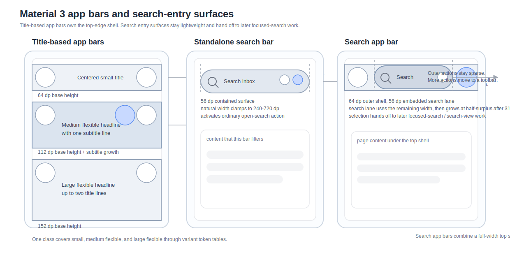

# Roo Windows Material 3 App Bars and Search Surfaces Design

## Implementation status

**Proposed.** None of the defined scope is implemented. The status of existing and outstanding prerequisites is recorded in the [status index](../README.md).

## Objective

Add a Material 3 top-edge shell family to `roo_windows` that closes the
largest remaining gap between the existing scaffold work and full
application-level shells.

The design covers:

- title-based top app bars in the Material 3 small, medium flexible, and
  large flexible variants,
- the Material 3 search app bar,
- a standalone Material 3 search-bar entry surface for page-local search,
- token-backed geometry, color, and scroll-state treatment that fit the
  existing theme and surface pipeline,
- child-widget composition for navigation affordances and essential trailing
  actions,
- and a narrow handoff from search entry surfaces to a later focused-search /
  search-view design.

The result is a first-class app-bar family for `roo_windows`, not a
`FlexLayout` recipe, not a reuse of the bottom-toolbar API, and not a thin
reskin of the current text-field editor.

## Motivation

`roo_windows` now has a checked-in adaptive scaffold design, navigation
surfaces, bottom and floating toolbars, text fields, snackbars, and a design
for non-touch input. What it still does not have is the top-edge shell surface
that most real applications use to frame a page.

That missing piece shows up immediately in practical screens:

- list-detail pages need a back affordance, title, and one or two page actions,
- home pages often need a search-first shell rather than a plain title row,
- and settings or dashboard pages commonly need a standalone search entry near
  the content they filter.

Without a dedicated app-bar design, each application would either hand-pack a
header from generic layouts, misuse the toolbar family for top-edge structure,
or treat a search entry point as a normal text field even when no inline
editing is supposed to happen in that surface.

## Background

### Current Status in `roo_windows`

As of 2026-07, `roo_windows` does not have a Material 3 app-bar family or a
Material 3 search-bar entry surface under `src/roo_windows/material3/`.

What exists today:

- [material3_layout_scaffold_design.md](material3_layout_scaffold_design.md)
  already defines one top-bar slot on the scaffold,
- [material3_toolbars_design.md](material3_toolbars_design.md) already closes
  on bottom and floating toolbars and explicitly excludes top app bars,
- [material3_text_fields_design.md](material3_text_fields_design.md) already
  defines the shared editor direction for real text editing,
- [non_touch_input_design.md](../implemented/non_touch_input_design.md) already defines the
  focus-layering and semantic-action direction for keyboard and pointer input,
- [src/roo_windows/core/theme.h](../../../src/roo_windows/core/theme.h) already
  provides the surface-role vocabulary needed for app-bar and search-surface
  colors,
- and the current surface and container pipeline already supports theme-backed
  surfaces, child-widget composition, overlay state, and bounded repaint.

What does not exist yet:

- no `material3/app_bar/` implementation,
- no search-bar entry widget,
- no search-app-bar widget,
- no focused-search or search-view surface,
- no top-app-bar example sketch,
- and no app-bar-focused test or golden target.

The current Material 3 theme exposes color and state-layer tokens, but not the
Material 3 typography scale. Consequently, the named typography roles in this
document are required token inputs, not APIs that already exist. Phase 1 must
either land the shared Material 3 typography-token prerequisite or remain
declaration-only; app bars must not silently substitute unrelated legacy
`font_h*()` globals and call the result token-backed.

That current state forces two design constraints.

First, the search entry surfaces in this document must stay intentionally
narrow. They should open or hand off to later search workflows, but they should
not require the full focused-search stack or the shared text editor to exist
before the entry surfaces can land.

Second, top app bars should reuse the current child-widget model for actions.
They should not introduce a second button, avatar, or overflow-action contract
just for the header family.

### Material 3 Signals

This document is aligned against the current Material 3 references for app bars
and search:

- [App bars overview](https://m3.material.io/components/top-app-bar/overview)
- [App bars specs](https://m3.material.io/components/top-app-bar/specs)
- [App bars guidelines](https://m3.material.io/components/top-app-bar/guidelines)
- [Search overview](https://m3.material.io/components/search/overview)
- [Search specs](https://m3.material.io/components/search/specs)
- [Search guidelines](https://m3.material.io/components/search/guidelines)

The strongest product signals carried into this design are:

1. the supported top-edge family now has four variants: search app bar, small,
   medium flexible, and large flexible,
2. app bars are page-shell surfaces for navigation, page identity, and one or
   two essential actions,
3. if a page has more actions than that, those actions belong in a toolbar, not
   as an ever-growing trailing app-bar strip,
4. app-bar containers span the full available width and keep straight corners,
5. small app bars use the default one-row header height, while medium flexible
   and large flexible variants reserve taller expanded heights for larger
   headlines,
6. search bars use the contained style in current Material 3 Expressive;
   divided search is baseline-only and not recommended,
7. a search app bar is a global search entry point, while a standalone search
   bar usually filters content in the current view,
8. activating a search app bar or search bar opens focused search and later a
   search view; the unfocused bar is not the full search workflow,
9. on scroll, the app-bar container separates from body content through color
   fill rather than a drop shadow,
10. the embedded search container in a search app bar changes color on scroll,
11. right-to-left layouts mirror leading and trailing placement,
12. and search entry surfaces can host one or two trailing widgets, but the
   family should stay visually disciplined rather than growing into a dense
   control strip.

### Scope Boundary With Later Search Work

This design intentionally closes only the entry surfaces.

In scope:

- small / medium flexible / large flexible app bars,
- leading- and center-aligned title layouts,
- optional subtitle support,
- a standalone `SearchBar` entry surface,
- a `SearchAppBar` for global or home-screen search entry,
- host-driven scroll-state treatment,
- and the widget-level activation contract that opens later focused search.

Out of scope:

- focused-search suggestion and result lists,
- docked and full-screen search-view layouts,
- query editing, selection, IME, and cursor ownership,
- search scrims, predictive back, and result-lane animation,
- automatic overflow collapsing of app-bar actions,
- and app-bar-owned toolbar, drawer, or route-dispatch policy.

Those out-of-scope behaviors belong to a later search-workflow design, which is
already called out separately in
[material3_roadmap.md](../../material3_roadmap.md).

### Local Design References

The most relevant local references are:

- [material3_layout_scaffold_design.md](material3_layout_scaffold_design.md)
- [material3_toolbars_design.md](material3_toolbars_design.md)
- [material3_text_fields_design.md](material3_text_fields_design.md)
- [non_touch_input_design.md](../implemented/non_touch_input_design.md)
- [material3_icon_buttons_design.md](material3_icon_buttons_design.md)
- [../.github/instructions/roo-windows-widget-authoring.instructions.md](../../../.github/instructions/roo-windows-widget-authoring.instructions.md)

Those references close the main local constraints:

1. top app bars belong in the scaffold's top slot rather than inside body-local
   layout recipes,
2. child action semantics stay on child widgets whenever a bar hosts real
   action widgets,
3. search entry is not text editing in this phase; the shared editor direction
   remains owned by the text-field work,
4. keyboard and pointer activation must route through the same focus and action
   model as the rest of the widget tree,
5. scroll compression, hide-on-scroll, and route ownership stay on the host or
   future shell controller rather than on every app-bar instance,
6. and the public API should stay close to existing widget naming and
   ownership, with `WidgetRef` composition where the bar truly hosts child
   widgets.

### Embedded Constraints

The repo-local widget authoring rules apply directly here.

Relevant 32-bit reference sizes already used by adjacent design docs are:

- `Widget`: about `24 B`,
- `Container`: about `44 B`,
- `WidgetRef`: about `8 B`,
- `std::vector<...>` control block: about `12 B`.

App bars and search bars are low-multiplicity shell surfaces. Most screens will
host zero or one of each. That changes the RAM tradeoff relative to list rows
or large button grids.

This design therefore makes five direct decisions:

1. `AppBar`, `SearchBar`, and `SearchAppBar` are surface-owning widgets.
2. They may use `Container` as the child-host base because the family has a
   small, structurally bounded child set and does not justify a new generic
   fixed-slot child-host abstraction in `core/`.
3. Title, subtitle, and search-label content are non-interactive text child
   widgets. They own text measurement, line breaking, ink bounds, invalidation,
   and final glyph paint; the app-bar classes only assign their slot bounds.
4. App bars use custom fixed-slot measurement and layout rather than deriving
   from or nesting `FlexLayout`. The slot geometry is small and prescribed,
   while the current general flex implementation carries dynamic child and
   measurement storage and allocates temporary vectors during measurement.
5. Scroll observation, focused-search orchestration, and overflow policy stay
   outside the base widgets so every instance does not pay for controller state
   it may never use.

## Requirements

### Functional Requirements

1. Support title-based Material 3 app bars in the small, medium flexible, and
   large flexible variants.
2. Support a standalone Material 3 `SearchBar` entry surface.
3. Support a Material 3 `SearchAppBar` whose primary content is a search entry
   surface rather than a title.
4. Support optional leading navigation or branding content on all app-bar
   variants.
5. Support up to two trailing action widgets on title-based app bars.
6. Support an optional one-line subtitle on medium flexible and large flexible
   app bars; keep the small variant single-line in the initial implementation.
7. Support leading-aligned and centered title layouts on title-based app bars.
8. Support caller-supplied display text on `SearchBar` and `SearchAppBar`
   without requiring those widgets to own live editable query state.
9. Support one or two trailing widgets inside a `SearchBar` entry surface.
10. Support one or two outer trailing widgets on `SearchAppBar` when the host
    chooses to attach them.
11. Keep focused-search results, docked search view, and full-screen search
    view out of the base family.

### Interaction Requirements

1. Child widgets hosted in app-bar slots keep full control over click, hover,
   focus, selection, overlay, and deferred `onClicked()` behavior.
2. `SearchBar` and the search-entry region inside `SearchAppBar` must activate
   through the ordinary widget click / semantic-action path.
3. Keyboard Enter and Space on a focused search entry surface must trigger the
   same open-search action as touch activation.
4. The base family must not introduce an app-bar-local overflow-menu callback
   path.
5. The base family must not observe descendant scroll position or automatically
   compress, hide, or re-expand itself.
6. RTL must mirror leading and trailing slot placement while keeping the
   internal order of multiple trailing widgets stable within the logical
   trailing strip.

### Layout Requirements

1. All app-bar containers span the full available width and keep straight
   corners.
2. The title-based variants use the following base heights:

   | Variant | Base height | Title typography | Title line budget |
   | --- | ---: | --- | ---: |
   | Small | 64dp | title large | 1 |
   | Medium flexible | 112dp | headline medium | 2 |
   | Large flexible | 152dp | display small | 2 |

3. A subtitle, when supported by the selected variant's token table, selects
   the Material 3 expanded subtitle height: `136dp` for medium flexible and
   `176dp` for large flexible. This keeps the title and subtitle line boxes
   intact below the control row. Small bars remain a single-line title surface.
4. `SearchBar` uses a `56dp` contained search container with rounded corners.
5. `SearchBar` should measure to a natural width clamped to the range
   `240-720dp`, but it must still accept narrower parent-constrained widths on
   very small embedded screens by shrinking the text lane rather than refusing
   layout.
6. `SearchAppBar` uses one full-width `64dp` outer container and an internal
   `56dp` search entry lane.
7. Let `A` be the horizontal space left for the search-entry lane in
   `SearchAppBar` after outer leading / trailing widgets and edge insets are
   reserved. The embedded search lane width is `min(A, 720dp)`.
8. On compact widths, the search-entry lane consumes all remaining width.
9. On wider widths where the `720dp` cap leaves slack, the search-entry lane stays
   start-aligned inside the central strip so its reading edge tracks the page
   content start.

### Color and Content Requirements

1. Title-based app bars resolve the flat container from
   `Theme::color.surface`.
2. Title-based app bars resolve the scrolled container from
   `Theme::color.surfaceContainer`.
3. `SearchBar` in standalone mode resolves its container from
   `Theme::color.surfaceContainerHigh`.
4. `SearchAppBar` resolves the embedded search-entry container from
   `Theme::color.surfaceContainer` when flat and
   `Theme::color.surfaceContainerHighest` when scrolled.
5. App-bar headline and subtitle text resolve from `Theme::color.onSurface`.
6. Search-entry display text resolves from `Theme::color.onSurfaceVariant`.
7. The base family does not own overflow icons, badges, or other promoted
   action treatments; those remain on adjacent widgets composed into the bar.

### Memory and Allocation Requirements

1. Do not allocate on paint, hover, press, focus, or normal layout passes.
2. Do not add search-editor state, suggestion storage, or result-model storage
   to `SearchBar` or `SearchAppBar`.
3. Keep title, subtitle, and search display content as non-owning
   `roo::string_view` values owned by their text children. The public app-bar
   setters forward to those children and do not retain duplicate views.
4. Keep child-widget hosting bounded and small; this family should not expose
   arbitrary child lists.
5. Add pointer-size-aware size-budget assertions for `AppBar`, `SearchBar`,
   and `SearchAppBar`.
6. Use one private non-interactive `AppBarText` child type across the family.
   It stores a non-owning view, a Material typography role, a color role, a
   one- or two-line budget, and a fixed two-entry line cache. It resolves the
   active theme without allocating during measurement, layout, or paint. Do
   not use the owning, dynamically cached `TextBlock` for these shell strings.

## Design Overview

The public family has four pieces:

1. `AppBarVariant`, `AppBarTitleAlignment`, and `AppBarSurfaceState` define the
   small set of public configuration enums.
2. `material3::AppBar` is the title-based top-bar widget for the small, medium
   flexible, and large flexible variants.
3. `material3::SearchBar` is the standalone search-entry surface used near the
   content it filters.
4. `material3::SearchAppBar` is the full-width top bar whose primary surface is
   a search entry lane rather than a title stack.

`AppBar` owns:

- the straight top-edge container,
- one title text child and, when populated, one subtitle text child,
- a leading slot,
- and up to two trailing action slots.

`SearchBar` owns:

- the rounded contained search surface,
- one search-display text child,
- an optional leading widget or a default passive search glyph,
- and one or two trailing widget slots.

`SearchAppBar` owns:

- the straight full-width top-edge container,
- one outer leading slot,
- one shared search-entry lane with the same internal geometry vocabulary as
  `SearchBar`,
- one search-display text child inside that lane,
- up to two trailing widgets inside that search-entry lane,
- and up to two outer trailing slots.

The decisive ownership split is:

- app bars own shell geometry and shell background,
- text children own text measurement, clipping, invalidation, and paint,
- action children own child action semantics,
- search entry surfaces own only the unfocused entry treatment,
- and later focused-search controllers own query editing, suggestions,
  results, and search-view presentation.



The core decisions are:

1. do not reuse `DockedToolbar` as the top-edge shell,
2. use one `AppBar` class with a variant enum instead of three public classes
   that only differ in token tables,
3. keep `SearchBar` and `SearchAppBar` as entry surfaces rather than editor
   widgets,
4. use fixed-slot app-bar layout with composed text children rather than
   direct text paint or a nested general-purpose `FlexLayout`,
5. keep host-driven scroll and compression policy outside the base widgets,
6. and keep the family visually narrow so more than two essential actions still
   push the page toward a toolbar or another surface rather than bloating the
   app bar.

## Design Details

### Surface Ownership, Child Hosting, and RAM Cost

All three public widgets derive from `Container`.

That is the right tradeoff for this family even though the slot counts are
structurally bounded:

- each widget owns a semantically meaningful surface,
- each widget may host a small number of real child widgets,
- the family is low multiplicity,
- and `Container` already provides the ownership, touch descent, invalidation,
  and repaint plumbing needed for those child widgets.

The design does not add a new reusable fixed-slot child-host base in `core/`
just for app bars. That framework change would be broader than this family
needs.

To keep the per-instance cost bounded despite the `Container` base:

1. text children are stored by value and attached as borrowed children; there
   is no heap ownership or layout-container child around them,
2. text children use non-owning views and fixed-capacity line metadata,
3. all children are limited to fixed semantic slots,
4. there is no app-bar-local overflow controller, search presenter, or route
   controller stored on the widget,
5. and host-driven behaviors such as scroll collapse and search-view handoff
   stay outside the base widgets.

The low-multiplicity assumption matters. A page may contain several buttons or
many list rows, but it rarely contains many simultaneous app bars. Using the
existing `Container` ownership path is therefore a better overall tradeoff than
inventing a new generic infrastructure layer to save a small amount of RAM on a
rare shell widget.

The same argument does not justify nesting `FlexLayout`. An app bar has a
prescribed leading slot, text lane, and trailing strip rather than a caller-
defined flow. A small custom `onMeasure()` / `onLayout()` implementation can
measure the occupied slots and assign their rectangles without the two
persistent vectors and temporary measurement vectors used by the general flex
algorithm. Composition is retained where it removes behavioral duplication --
text and actions -- while fixed shell geometry stays on the shell widget.

### `AppBar` Variant Geometry and Headline Layout

`AppBar` covers the three title-based variants through one shared layout model
backed by variant token tables.

Common geometry across all title-based variants:

- full-width straight container,
- one optional leading slot,
- up to two trailing slots,
- `48dp` action tap targets,
- `4dp` outer edge inset before the first and after the last action tap target,
- a `16dp` title inset only when no leading navigation control is present.

Variant-specific tokens are limited to:

- base container height,
- title typography,
- subtitle typography,
- top and bottom title-stack insets,
- and the default alignment.

The title block rules are:

1. all variants use one bounded `AppBarText` title child; small configures
   it for one line, while medium flexible and large flexible configure it for
   at most two.
2. medium flexible and large flexible app bars allow up to two title lines.
3. subtitles are one line on medium flexible and large flexible variants;
   small bars do not support a subtitle in the initial implementation.
4. subtitles use a by-value `AppBarText` that is gone when empty. Both
   text children are non-interactive and are not public action slots.
5. centered alignment centers the whole title block after leading / trailing
   slot reservation rather than pretending the actions do not exist.
6. small bars place the navigation, title, and actions in one compact row;
   medium flexible and large flexible bars use a `56dp` upper control row and
   place their expanded title stack below it. This follows Android Material 3's
   `MediumTopAppBar` and `LargeTopAppBar` expanded layout.

The widget does not attempt to auto-upgrade a title from one variant to another
based on measured text length. The caller or host chooses the intended
variant.

The widget also does not own scroll collapse. In the initial implementation a
flexible variant is a fixed expanded presentation. A later shell controller
may drive continuous expanded height and title interpolation without changing
the bar's semantic variant. Abruptly switching `variant()` at a threshold is
not the compression contract: it would produce a discontinuous layout jump
and conflate component identity with transient scroll state.

### Scroll-State Treatment and Repaint Behavior

Material 3 distinguishes between a flat state and an on-scroll state.

This design models that difference explicitly through `AppBarSurfaceState`:

- `kFlat` means the header visually merges with the background,
- `kScrolled` means the header resolves the separated container role.

The state affects only container and local text colors. It does not imply any
automatic height change.

That split keeps repaint behavior clean:

1. changing surface state dirties the visible app-bar bounds because the full
   background role changes,
2. changing title or subtitle is forwarded to its text child, which invalidates
   its old and new ink/layout bounds; a line-count change also requests parent
   layout,
3. changing variant invalidates the full bar bounds because the widget height
   can change,
4. and child-widget hover / press / focus changes stay on the existing child
   widget invalidation paths.

No pixel is intentionally redrawn twice in different colors in the same pass.
The app-bar surface and composed children use the existing container surface,
exclusion, and child-paint pipeline; the app bar does not paint a second copy of
text owned by a child.

### `SearchBar` as an Entry Surface, Not an Editor

`SearchBar` is a search entry surface, not a specialized `TextField`.

That is the central search decision in this document.

`SearchBar` contains only:

- one non-interactive `AppBarText` display child,
- one optional leading widget slot,
- and up to two trailing widget slots.

It does not store:

- a mutable query buffer,
- selection or cursor state,
- a `TextFieldEditor*`,
- suggestion data,
- or a search-result model.

The activation contract is therefore simple:

1. if a child widget consumes the interaction, that child owns the action,
2. otherwise activating the search surface triggers the widget's ordinary
   `onClicked()` path,
3. and the host or later search controller decides what focused-search surface
   to open.

This aligns with the roadmap split. The app shell can land a correct visual
search entry point now, while a later focused-search design decides how query
editing and result presentation work.

Layout inside the search container uses custom fixed-slot geometry:

- `24dp` leading and trailing padding in standalone mode,
- `12dp` edge padding in the private embedded search-app-bar layout,
- `4dp` gap between the leading glyph or leading widget and the text lane,
- and `4dp` gap between the text lane and each trailing widget lane.

If no leading widget is supplied, `SearchBar` paints a passive search glyph.
That keeps the default entry surface lightweight and visually correct without
requiring a child widget for the most common case.

The display child renders plain entry text. The widget does not try to
distinguish "hint" from "query" semantics in this entry-only phase. Callers can
show `Search`, `Search inbox`, or the last confirmed query string by choosing
the text they pass in.

### `SearchAppBar` Composition and Adaptive Width

`SearchAppBar` is not just `SearchBar` stretched to the full window width.

It owns two layers of structure:

1. the straight full-width top-edge container,
2. and an internal contained search-entry lane that follows search-surface
   geometry and colors.

The internal lane shares its token vocabulary and painting helper with
`SearchBar`, but `SearchAppBar` remains its own public type because it also
owns:

- one outer leading slot,
- one outer trailing strip,
- the adaptive central-lane width rule,
- and the flat-versus-scrolled color relationship between the outer bar and the
  embedded search lane.

The internal search-entry lane is not a live editor in this phase. Like
`SearchBar`, it hosts a non-interactive `AppBarText` for caller-supplied
display text and activates ordinary search-open semantics when tapped or
keyboard-activated.

The width rule fills the available central strip up to a `720dp` cap. This is
predictable under embedded constraints and avoids an otherwise arbitrary
partial-growth function.

The host remains responsible for whether additional outer trailing actions are
shown. `SearchAppBar` does not auto-collapse those actions into an overflow
menu when space is tight.

### Focus and Non-Touch Behavior

This family follows the current non-touch-input design direction.

The focusable pieces are:

- the search surface itself on `SearchBar`,
- the search-entry region on `SearchAppBar`,
- and any hosted child action widgets.

The traversal model is:

1. leading action first,
2. then the main search surface or title-based children in visual order,
3. then internal trailing search widgets,
4. then outer trailing search-app-bar widgets.

Title text and subtitle text are not separate focus targets.

`SearchAppBar` must restrict its own hit and focus bounds to the embedded
search-entry lane. Outer padding and unused wide-screen slack are not search
activation targets. Child widgets are tested first and retain their normal
touch paths. The concrete implementation must override the relevant geometric
hit-path behavior; deriving from `Container` alone does not provide this
region-specific click contract.

Back and Escape do not have search-surface-local behavior in this document.
Those keys are owned by the later focused-search workflow once there is an
actual search-view or focused-search state to dismiss. Until then,
`SearchBar` and `SearchAppBar` behave like ordinary clickable widgets.

## Proposed API

Suggested public surface:

```cpp
enum class AppBarVariant : uint8_t {
  kSmall,
  kMediumFlexible,
  kLargeFlexible,
};

enum class AppBarTitleAlignment : uint8_t {
  kLeading,
  kCentered,
};

enum class AppBarSurfaceState : uint8_t {
  kFlat,
  kScrolled,
};

class AppBar : public Container {
 public:
  explicit AppBar(ApplicationContext& context,
                  AppBarVariant variant = AppBarVariant::kSmall);

  void setVariant(AppBarVariant variant);
  AppBarVariant variant() const;

  void setTitleAlignment(AppBarTitleAlignment alignment);
  AppBarTitleAlignment titleAlignment() const;

  void setSurfaceState(AppBarSurfaceState state);
  AppBarSurfaceState surfaceState() const;

  void setTitle(roo::string_view title);
  roo::string_view title() const;

  void setSubtitle(roo::string_view subtitle);
  roo::string_view subtitle() const;

  void setLeading(WidgetRef widget);
  void setTrailing(uint8_t index, WidgetRef widget);
};

class SearchBar : public Container {
 public:
  explicit SearchBar(ApplicationContext& context);

  void setDisplayText(roo::string_view text);
  roo::string_view displayText() const;

  void setLeading(WidgetRef widget);
  void setTrailing(uint8_t index, WidgetRef widget);

  bool isClickable() const override { return true; }
};

class SearchAppBar : public Container {
 public:
  explicit SearchAppBar(ApplicationContext& context);

  void setSurfaceState(AppBarSurfaceState state);
  AppBarSurfaceState surfaceState() const;

  void setDisplayText(roo::string_view text);
  roo::string_view displayText() const;

  void setLeading(WidgetRef widget);
  void setInnerTrailing(uint8_t index, WidgetRef widget);
  void setTrailing(uint8_t index, WidgetRef widget);
};
```

API notes:

1. `AppBar` uses one class plus `AppBarVariant` rather than separate public
   `SmallAppBar`, `MediumFlexibleAppBar`, and `LargeFlexibleAppBar` classes.
   The behavioral model is the same; only token tables and line budgets differ.
2. `SearchBar` and `SearchAppBar` use ordinary widget click semantics for the
   "open search" action. No search-specific callback interface is added.
   Their implementations must explicitly opt into clickability; `Container`
   does not do that merely because it owns a surface.
3. Every constructor takes `ApplicationContext&`, matching the required
   `Widget` / `Container` construction contract.
4. Title, subtitle, and search-display setters forward to by-value text child
   widgets. Those widgets are returned by the protected child enumeration but
   are not exposed as replaceable public slots. Empty subtitle text marks the
   subtitle child gone.
5. Passing a null `WidgetRef` clears an action slot. Indexed trailing setters
   accept only indices `0` and `1`; other indices fail explicitly in debug/test
   builds and do not mutate the widget in release builds. Replacing a slot
   detaches the previous child before attaching the new one, preserving
   `WidgetRef` ownership.
6. Each concrete class implements `getChildrenCount()` and both `getChild()`
   overloads over its text children and occupied action slots; the public API
   does not expose an arbitrary child collection.
7. If declarations land before the full paint / measurement behavior, methods
   that cannot yet behave correctly should emit
   `LOG(FATAL) << "Unimplemented: Material 3 app bars"` or the narrower
   surface-specific equivalent rather than silently painting the wrong
   geometry.

## Implementation Plan

Authoring reference:
[embedded-cpp-code-authoring.instructions.md](../../../.github/instructions/embedded-cpp-code-authoring.instructions.md)
and
[roo-windows-widget-authoring.instructions.md](../../../.github/instructions/roo-windows-widget-authoring.instructions.md).

### Phase 1: Declare the App-Bar Family and Shared Token Tables

Code slice:

1. Add a new `src/roo_windows/material3/app_bar/` directory with declarations
   for `AppBar`, `SearchBar`, `SearchAppBar`, and the small enum surface.
2. Add shared token tables for title-based variants and the standalone and
   private embedded search-entry layouts.
3. Add the private bounded non-owning `AppBarText` child, with Material
   typography/color-role resolution, a fixed two-line cache, focused
   measurement / wrapping / ellipsis / invalidation tests, and no allocations
   during normal measure, layout, or paint.
4. Land or explicitly depend on shared Material 3 typography roles for title
   large, headline medium, display small, and subtitle text.
5. Add pointer-size-aware size-budget tests for `AppBarText` and the three
   public app-bar widget types, including the incremental cost of their by-value
   text children.
6. Keep behavior that is not implemented yet behind explicit
   `LOG(FATAL) << "Unimplemented: ..."` stubs rather than placeholder drawing.

Proposed commit message:

> Material 3 app bars Phase 1: declare app-bar and search-bar types.

Validation: add `material3_app_bar_test` and run
`bazel test //:material3_app_bar_test`.

### Phase 2: Implement the Standalone Search Bar Entry Surface

Code slice:

1. Implement `SearchBar` measurement, contained-surface paint, and bounded
   hit-testing.
2. Implement the passive leading-search-icon path, optional leading child slot,
   by-value `AppBarText` display child, and one- or two-widget trailing
   strip.
3. Implement standalone color handling and keyboard activation through the
   normal click path.
4. Add focused tests and goldens for passive-leading, custom-leading,
   one-trailing, and two-trailing configurations, plus narrow-width fallback.

Proposed commit message:

> Material 3 app bars Phase 2: add the standalone search bar.

Validation: run `bazel test //:material3_app_bar_test` and
`bazel test //:material3_app_bar_golden_test` with standalone-search cases.

### Phase 3: Implement the Title-Based AppBar Variants

Code slice:

1. Implement `AppBar` measurement and layout for small, medium flexible, and
   large flexible variants.
2. Compose the bounded `AppBarText` title and subtitle children, then implement
   leading and centered title alignment plus the leading and trailing
   action-slot geometry.
3. Implement flat and scrolled container treatment, RTL mirroring, and the
   full-bar invalidation path for variant changes.
4. Add focused tests and goldens for small, centered small, medium flexible,
   large flexible, subtitle, scrolled, and RTL configurations.

Proposed commit message:

> Material 3 app bars Phase 3: implement title-based app bars.

Validation: run `bazel test //:material3_app_bar_test` and
`bazel test //:material3_app_bar_golden_test` with title-based cases.

### Phase 4: Implement SearchAppBar and Scaffold Integration Coverage

Code slice:

1. Implement `SearchAppBar` outer-slot layout, embedded search-entry lane, and
   the adaptive width rule from this design.
2. Implement flat and scrolled color coordination between the outer container
   and the embedded search-entry lane, including its by-value
   `AppBarText` display child.
3. Add behavior tests proving that child actions consume their own taps while
   taps in the search-entry lane trigger the ordinary search-open action.
4. Add a representative example under `examples/material3/app_bars/` showing a
   title-based app bar, a search app bar, and a standalone search bar inside
   `LayoutScaffold`.

Proposed commit message:

> Material 3 app bars Phase 4: add search app bars and examples.

Validation: run `bazel test //:material3_app_bar_test`,
`bazel test //:material3_app_bar_golden_test`,
`bazel test //:material3_layout_scaffold_test`, and build the example under
emulation.

## Testing Plan

Validation coverage should include:

1. `material3_app_bar_test` for variant measurement, subtitle line-budget
   behavior,
   search-bar width fallback, adaptive search-app-bar width resolution, slot
   replacement and clearing, invalid slot indices, ordering, RTL mirroring,
   and search-entry hit-testing (including rejection of outer slack).
2. `material3_app_bar_golden_test` for small, centered small, medium flexible,
   large flexible, subtitle, standalone search bar, and search app bar states
   in both flat and scrolled presentations.
3. `material3_layout_scaffold_test` reruns because the app-bar family is meant
   to occupy the scaffold's top slot.
4. Example compilation for the new app-bar example sketch under the emulation
   harness.
5. Focus and keyboard-activation reruns for the touched slice once the
   non-touch-input work is present in code.

## Caveats

### Rejected Alternatives

#### Paint Title and Search Text Directly in Each App-Bar Widget

This was rejected because the apparent RAM saving moves reusable text-widget
behavior into the shell classes. Direct painting would make app bars own font
measurement, line breaking, ellipsis, alignment, ink bounds, and text-specific
invalidation. It would also duplicate that behavior between `AppBar`,
`SearchBar`, and `SearchAppBar`.

Instead, non-interactive text children own those responsibilities. The children
are stored by value, use non-owning strings, and have bounded line metadata, so
composition does not require heap allocation or nested layout containers.

#### Implement App Bars as `FlexLayout` Trees

This was rejected because the prescribed app-bar slots do not need the general
CSS flex algorithm. The current `FlexLayout` keeps dynamic child and cached-
measurement vectors and builds temporary vectors during measurement. Correctly
modeling the title stack would also introduce a nested layout.

The app-bar classes therefore retain small custom fixed-slot measurement and
layout. This is not a second general layout system: it only reserves leading
and trailing action strips, computes the remaining text lane, and assigns
bounds to the composed children.

#### Reuse `DockedToolbar` as the Top App Bar

This was rejected because the toolbar design already closes on a different
semantic family.

Toolbars are bottom or floating action surfaces with grouped child layout and
explicit overflow composition. App bars are top-edge page shells whose main
content is page identity or search entry. Reusing the toolbar public type would
blur those roles, keep the wrong naming on the API, and encourage too many
actions in the top-edge shell.

#### Make `SearchBar` a Thin `TextField` Variant

This was rejected because a search entry surface is not automatically a live
editor in this roadmap phase.

The current text-field direction intentionally routes real editing through the
shared application-owned editor. Pulling that machinery onto every search entry
surface now would add state, couple app-shell work to focused-search work, and
force the search family to answer query-editing questions that this document is
explicitly leaving to a later design.

#### Give Every App Bar Built-In Scroll and Overflow Policy

This was rejected because it would store high-level controller policy on every
base widget and would reopen shell-level ownership that belongs above the
component family.

The scaffold, route host, or future shell controller can decide when a flexible
bar compresses, whether a search app bar stays pinned, and when a page's action
set needs a toolbar. The base widgets only need to paint the currently selected
presentation.

### Local Tradeoff: Headline Clipping at the Supported Line Budget

Material guidance prefers not to truncate medium flexible and large flexible
headlines. This design still enforces a concrete line budget because the
widget's height is finite and embedded screens can be much narrower than the
canonical phone widths.

The chosen local rule is:

- small app bars paint one line,
- medium flexible and large flexible app bars paint up to two lines,
- and text beyond that line budget is clipped rather than introducing marquee
  behavior or app-bar-local horizontal scrolling.

That tradeoff keeps the widget deterministic and cheap. Applications that need
longer titles should choose the larger flexible variant or shorten the display
text they pass in.

## Future Work

1. Add a focused-search / search-view design that closes on query editing,
   suggestion and result lists, scrims, predictive back, and docked versus
   full-screen search presentation.
2. Add optional image and logo support for title-based app bars if a concrete
   set of application examples shows that text-only title blocks are too
   restrictive.
3. Add a shell-level controller or helper for scroll-driven app-bar
   compression, hide-and-reveal, and search-view handoff once the navigation
   and back-behavior design is written.
