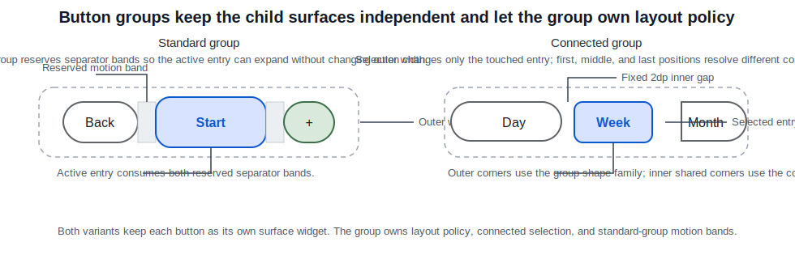

# Roo Windows Material 3 Button Groups Design

## Implementation status

**Proposed.** None of the defined scope is implemented. The status of existing and outstanding prerequisites is recorded in the [status index](../README.md).

## Objective

Add a Material 3 button-group family to `roo_windows` that covers:

- standard button groups for expressive clusters of related actions,
- connected button groups as the Material 3 expressive replacement for
  segmented buttons,
- label entries with an optional leading icon and icon-only entries,
- group-owned size, shape, layout, and connected-selection policy,
- reuse of the existing surface-overlay and click-animation pipeline,
- and a pay-for-what-you-use design that does not add group-only RAM cost to
  every standalone [material3::Button](../../../src/roo_windows/material3/button/button.h).

This document defines the final public family. It does not require placeholder
APIs to land before their behavior exists: the connected-group half of the
family lands first, and the standard-group container lands only when its
layout behavior is implemented.

## Motivation

`roo_windows` already has a landed Material 3
[button](../implemented/material3_buttons_design.md), but it still lacks the grouped action
surface used for expressive clustered actions, connected view switchers, and
small filter sets. The existing
[widgets::ToggleButtons](../../../src/roo_windows/widgets/toggle_buttons.h) control
is icon-only, single-select, and painted in a pre-Material-3 style.

The missing piece is not another standalone button variant. It is a grouped
component family whose layout and ownership rules differ from standalone
buttons: standard groups reserve motion space inside the group, and connected
groups own selection and first/middle/last corner geometry.

## Background

### Current Status in `roo_windows`

The current checked-in Material 3 button work already provides most of the
primitive seams this design needs:

- [../implemented/material3_buttons_design.md](../implemented/material3_buttons_design.md) and the landed
  [src/roo_windows/material3/button/button.h](../../../src/roo_windows/material3/button/button.h)
  define `material3::Button` as a standalone momentary surface widget with
  token-backed size, shape, outline, elevation, and press-shape morph.
- `BorderStyle` already supports per-corner radii, so first/middle/last item
  shapes do not need a new decoration primitive.
- The existing widget pipeline already provides area overlays, click
  animation, pressed state, activated state, and interactive-change hooks.
- The repo also has a legacy grouped-button design note,
  [material3_segmented_buttons_design.md](material3_segmented_buttons_design.md),
  but no checked-in segmented-button implementation under `src/roo_windows/`.

What does not exist today:

- no `material3::IconButton` implementation,
- no Material 3 button-group widget family,
- no grouped container that reserves internal motion bands for expressive
  standard groups,
- no connected group that owns single-select, multi-select, and
  selection-required behavior,
- and no Material 3 migration target for
  [widgets::ToggleButtons](../../../src/roo_windows/widgets/toggle_buttons.h).

### Material 3 Signals

The current Material 3 button-group references are:

- [Overview](https://m3.material.io/components/button-groups/overview)
- [Specs](https://m3.material.io/components/button-groups/specs)
- [Guidelines](https://m3.material.io/components/button-groups/guidelines)

The decisive signals carried into this design are:

1. Material 3 defines two variants: `standard` and `connected` button groups.
2. Standard groups are expressive action clusters. The group reserves space
   between entries so the active entry can change shape and width without
   changing the group's outer width.
3. Connected groups replace expressive segmented buttons. They are the
   selectable variant and support single-select, multi-select, and
   selection-required patterns.
4. Connected groups do not affect adjacent entries when one entry is pressed
   or selected.
5. Both variants support five sizes, round and square shape families, and
   mixed label-button and icon-button content.
6. Standard groups use size-dependent between-space tokens:

   | Size | Separator band (dp) |
   | --- | ---: |
   | XS | 18 |
   | S | 12 |
   | M | 8 |
   | L | 8 |
   | XL | 8 |

7. Connected groups use a fixed `2dp` inner gap and a size-dependent
   connected-radius table:

   | Size | Inner gap (dp) | Connected square / inner radius (dp) |
   | --- | ---: | ---: |
   | XS | 2 | 4 |
   | S | 2 | 8 |
   | M | 2 | 8 |
   | L | 2 | 16 |
   | XL | 2 | 20 |

8. Text buttons and standard icon buttons are not the right group content.
   The group component expects contained button treatments.

### Local Framework Constraints

The relevant local references are:

- [../implemented/material3_buttons_design.md](../implemented/material3_buttons_design.md)
- [material3_icon_buttons_design.md](material3_icon_buttons_design.md)
- [material3_segmented_buttons_design.md](material3_segmented_buttons_design.md)
- [../.github/instructions/roo-windows-widget-authoring.instructions.md](../../../.github/instructions/roo-windows-widget-authoring.instructions.md)

Those references close the main local constraints:

1. Standalone `material3::Button` remains lean. Group position, connected
   selection state, and standard-group layout choreography do not move onto
   every standalone button instance.
2. The group family reuses the existing overlay and click-animation pipeline.
   It does not add a second ripple or press-feedback subsystem.
3. Per-instance RAM is the dominant cost. Group-only policy stays on the
   group, and rare behavior does not turn into stored optional fields on every
   entry.
4. The current framework only provides child ownership on `Container`, which
   is surface-owning. This design accepts a transparent `Container` base for
   both group variants rather than widening the core widget hierarchy for one
   component family.

That last point is an explicit tradeoff. The group containers do not advertise
their own visual surface, but the existing `Container` base already provides
the child attachment, touch descent, layout propagation, and invalidation
plumbing the family needs. Adding a new generic non-surface child-host base to
`core/` would be a larger framework change than this component family
justifies today.

## Requirements

### Functional Requirements

1. Add both Material 3 variants: `ButtonGroup` for standard groups and
   `ConnectedButtonGroup` for connected groups.
2. Support two entry families:
   - a label entry with an optional leading icon,
   - and an icon-only entry.
3. Support the existing `ButtonSize` and `ButtonShape` vocabularies so grouped
   and standalone buttons share size and shape selectors.
4. Support connected-group single-select, multi-select, and
   selection-required behavior.
5. Keep every group in one row. No wrapping or second-line layout is part of
   v1.
6. Keep standard-group outer width stable while an entry is pressed.
7. Allow standard groups to mix label and icon-only entries.
8. Allow connected groups to distribute extra width across entries when the
   parent gives them more width than their natural minimum.

### Interaction Requirements

1. Each entry remains its own clickable surface widget.
2. Hover, focus, press, and click-animation treatment reuse the existing
   widget state and overlay pipeline.
3. Connected selection is group-owned and projected onto entries through
   activated state.
4. Standard groups do not own selection; they read the currently pressed entry
   first and the first activated entry second when resolving expressive layout.
5. Standard-group press transitions relayout the whole group because entry
   frames move. Connected-group selection does not relayout the group.
6. Group-level state changes continue to participate in the existing
   interactive-change callback path.

### API Requirements

1. Expose separate public types for standard and connected groups.
2. Expose separate public entry widgets for label-bearing and icon-only group
   content.
3. Keep size and shape group-owned in v1. Per-entry size or shape overrides
   are not part of the public surface.
4. Keep entry content narrow:
   - one line of text plus optional leading icon,
   - or icon only.
5. Do not expose arbitrary child slots, multiline labels, trailing icons, or
   text-button content in v1.
6. Do not land `ButtonGroup` declarations early as stubs. The standard-group
   API lands only when the layout behavior exists.

### Embedded Constraints

1. Do not allocate on paint, press, animation, or selection-update paths.
2. Do not add group-only state to every standalone `material3::Button`.
3. Do not add per-entry callback objects.
4. Keep group-owned selection state compact. One group-level bitmask is the
   canonical state for connected groups.
5. Discuss the base-case RAM cost of the new entry widgets and the group
   containers explicitly.

## Design Overview

The public family is split into four widget types:

1. `material3::ButtonGroup`
2. `material3::ConnectedButtonGroup`
3. `material3::ButtonGroupButton`
4. `material3::ButtonGroupIconButton`

`ButtonGroup` is the expressive, non-selectable standard-group container.
`ConnectedButtonGroup` is the selectable connected-group container.

`ButtonGroupButton` and `ButtonGroupIconButton` are group-aware surface-owning
entries. They reuse the standalone button token vocabulary where the geometry
and color treatment really match, but they do not reuse the standalone
`material3::Button` leaf type directly. Group-specific layout context,
connected first/middle/last shapes, and connected selected-state color
treatment remain inside the group-entry family.

The decisive ownership split is:

- the group owns size, shape, child sequencing, and connected selection,
- the standard group also owns expressive separator-band layout,
- each entry owns only its content, style, and surface paint,
- and standalone buttons stay free of group-only state.



## Design Details

### Public Family and Type Split

The design keeps grouped and standalone buttons separate on purpose.

`material3::Button` remains the standalone momentary action widget.
`ButtonGroupButton` is the grouped label-bearing entry. `ButtonGroupIconButton`
is the grouped icon-only entry.

That split avoids two bad outcomes:

1. bloating the standalone button with group position, group pointer, and
   connected selected-state logic,
2. or forcing icon-only group entries to share the label-bearing button's
   token and layout path.

The grouped entry widgets still share internal helpers with the landed button
implementation where the data is truly the same:

- one-line text measurement,
- optional leading-icon layout,
- disabled-state composites,
- and contained style color-role resolution.

What remains group-specific is:

- connected selected-state treatment,
- connected first/middle/last corner resolution,
- and standard-group separator-band layout.

### Group Containers and Surface Ownership

Both group containers derive from `Container` and keep a transparent surface:

- `background()` stays transparent,
- `containerRole()` stays undefined,
- `getBorderStyle()` stays zero,
- and `getElevation()` stays zero.

This is an intentional framework compromise, not a hidden assumption. The
groups use `Container` because the current framework only attaches children,
descends touches, and propagates layout through that base. The groups do not
introduce a visible group-level card, outline, or elevation.

The choice is still reasonable for this family because:

- the group bounds are a real layout and invalidation root,
- standard groups must relayout and repaint as a strip when an entry is
  pressed,
- connected groups need one owner for child enumeration and selection
  projection,
- and the number of groups on a screen is small enough that one transparent
  `Container` control block is acceptable.

### Standard Group Layout and Motion Bands

`ButtonGroup` is the expressive variant.

Its natural layout is computed in two parts:

1. each entry is measured at its resting natural width,
2. and a size-dependent separator band is inserted between each adjacent pair.

If the resting entry widths are $w_0, w_1, \dots, w_{n-1}$ and the size token
selects separator band $g$, the group's natural width is:

$$
W_{standard} = \sum_{i=0}^{n-1} w_i + (n - 1)g
$$

The group reports that resting width to its parent. The parent never sees the
active-entry expansion directly.

The standard-group active-entry choreography is deliberately narrow in v1:

- the currently pressed entry is the active entry,
- if no entry is pressed, the first activated entry is the active entry,
- the active entry expands into the separator band on each side that exists,
- adjacent entries shift to accommodate that expansion,
- adjacent entries do not animate their own content width independently,
- and the group's outer width remains fixed.

This is a deliberate simplification. The Material guidance describes adjacent
entries changing width, but it does not publish enough numeric choreography to
justify a more complex multi-entry width animation in v1. Reserving separator
bands and letting only the active entry consume them captures the expressive
effect without adding more per-entry animation state.

The standard group does not own selection. If a caller wants a persistent
emphasis state, it sets `setActivated(true)` on one or more entries and the
group uses the first activated entry as the resting active entry when nothing
is pressed.

### Connected Group Layout and Selection Ownership

`ConnectedButtonGroup` is the selectable variant.

It uses one group-owned canonical selection mask. The group stores a
`uint32_t selection_mask_`, which is enough for practical button-group counts
without any per-entry selected field. Each entry's visible selected state is
projected through `setActivated()` when the mask changes.

The connected-group natural width is:

$$
W_{connected} = \sum_{i=0}^{n-1} w_i + (n - 1) \cdot 2dp
$$

where each $w_i$ is the entry's connected natural width.

Connected-group width behavior is closed as follows:

- when the parent gives the group its natural width, entries keep their natural
  widths,
- when the parent gives the group extra width, that extra width is distributed
  evenly across all visible entries,
- when the parent gives the group less than its natural width, the group keeps
  natural entry widths and relies on the parent layout or clipping policy
  rather than introducing an internal compression algorithm,
- and connected-group selection never relayouts the strip.

Selection ownership is group-local:

1. clicking an enabled entry always routes through the group,
2. the group updates the canonical mask according to mode and
   `selection_required_`,
3. the group projects activated state onto the affected entries,
4. the group fires its interactive-change path only when the mask changed,
5. and only then does the child's own click hook continue.

This matches the repo's current pattern for grouped selection controls: one
owner keeps the rules, children render the resolved state.

### Connected First / Middle / Last Shapes

Connected groups need position-aware corner radii.

The shape resolution is:

- `single`: exposed corners use the group's current shape family on all four
  corners,
- `first`: leading outer corners use the group's current shape family and
  trailing inner corners use the connected inner-radius token,
- `middle`: all four corners use the connected inner-radius token,
- `last`: leading inner corners use the connected inner-radius token and
  trailing outer corners use the group's current shape family.

For `ButtonShape::kRound`, exposed outer corners are fully round and inner
corners use the connected inner-radius table. For `ButtonShape::kSquare`, both
outer and inner corners use the connected square-radius table.

Connected selected-state shape changes are also closed in v1:

- selected entries keep the same first/middle/last edge ownership,
- selected round groups morph the exposed outer corners toward the connected
  square-radius table,
- selected square groups morph the exposed outer corners toward the round
  family,
- and inner shared corners remain on the connected inner-radius table.

This matches the Material signal that selected buttons swap between round and
square treatment without changing adjacent entries.

### Entry Content Model and Style Surface

`ButtonGroupButton` supports:

- one-line label text,
- an optional leading icon,
- and four contained styles: filled, filled tonal, outlined, elevated.

`ButtonGroupIconButton` supports:

- icon-only content,
- and three contained icon styles: filled, filled tonal, outlined.

There is no text-button or standard-icon-button entry in v1. Those styles do
not have the contained surface treatment the button-group component expects.

Entry measurement follows the existing landed button and planned icon-button
docs wherever the numbers are the same:

- label-bearing entries use the same one-line content metrics as standalone
  `material3::Button` for matching sizes,
- icon-only entries use the same size, shape, and icon-slot vocabulary as the
  icon-button design,
- and no multiline text path or trailing-icon mode is added.

### Paint Ownership and Invalidation

The paint and invalidation model is different for the two variants.

For `ButtonGroup`:

- the group container itself paints no visible surface,
- each entry paints its own fill, outline, overlay, and content,
- press transitions can move entry frames,
- and the group invalidates its full interior when the active entry changes or
  when click-animation progress changes enough to move frames.

That full-strip invalidation is acceptable because standard groups are short,
single-row composites. It avoids partial stale-band bugs when multiple entry
frames move at once.

For `ConnectedButtonGroup`:

- the group container paints no visible surface,
- entry frames are stable after layout,
- selection changes invalidate only the entries whose activated state changed,
- and press or click animation stays local to the touched entry.

This keeps the higher-frequency interaction path cheap for the selectable
variant.

### RAM Cost

Approximate 32-bit ESP32-class costs are:

#### `ButtonGroupButton`

- `BasicSurfaceWidget` base: about the same order as standalone
  `material3::Button`,
- non-owning label: 8 B,
- optional icon pointer: 4 B,
- one owner pointer: 4 B,
- packed style and position bits: about 1-2 B.

Approximate total: about `64-76 B` under the current host-build
`BasicSurfaceWidget` layout and expected final packing.

#### `ButtonGroupIconButton`

- `BasicSurfaceWidget` base,
- icon pointer: 4 B,
- owner pointer: 4 B,
- packed style and position bits: about 1-2 B.

Approximate total: about `56-68 B`.

#### `ButtonGroup` / `ConnectedButtonGroup`

- transparent `Container` base,
- one `std::vector<Widget*>` child-pointer control block,
- one size enum,
- one shape enum,
- and, for `ConnectedButtonGroup`, one `uint32_t selection_mask_`, one mode
  bit, and one `selection_required_` bit.

The important accounting rule is structural rather than byte-perfect:

- selection lives once per connected group,
- standard-group motion policy lives once per standard group,
- and standalone buttons never pay for either one.

The implementation lands with pointer-size-aware budget tests that lock these
sizes down.

## Proposed API

```cpp
namespace roo_windows {
namespace material3 {

enum class ButtonGroupButtonStyle : uint8_t {
  kFilled,
  kFilledTonal,
  kOutlined,
  kElevated,
};

enum class ButtonGroupIconStyle : uint8_t {
  kFilled,
  kFilledTonal,
  kOutlined,
};

enum class ConnectedButtonGroupSelectionMode : uint8_t {
  kSingle,
  kMultiple,
};

enum class ButtonGroupItemPosition : uint8_t {
  kSingle,
  kFirst,
  kMiddle,
  kLast,
};

class ButtonGroupButton : public BasicSurfaceWidget {
 public:
  explicit ButtonGroupButton(
      ApplicationContext& context, roo::string_view label = {},
      ButtonGroupButtonStyle style = ButtonGroupButtonStyle::kFilled);

  roo::string_view label() const;
  void setLabel(roo::string_view label);

  const MonoIcon* icon() const;
  void setIcon(const MonoIcon* icon);

  ButtonGroupButtonStyle style() const;
  void setStyle(ButtonGroupButtonStyle style);

  bool isClickable() const override { return true; }
  Dimensions getSuggestedMinimumDimensions() const override;
  void paint(PaintContext& ctx) const override;

 protected:
  void onClicked() override;

 private:
  friend class ButtonGroup;
  friend class ConnectedButtonGroup;
  void setResolvedPosition(ButtonGroupItemPosition position);
};

class ButtonGroupIconButton : public BasicSurfaceWidget {
 public:
  explicit ButtonGroupIconButton(
      ApplicationContext& context, const MonoIcon* icon = nullptr,
      ButtonGroupIconStyle style = ButtonGroupIconStyle::kFilled);

  const MonoIcon* icon() const;
  void setIcon(const MonoIcon* icon);

  ButtonGroupIconStyle style() const;
  void setStyle(ButtonGroupIconStyle style);

  bool isClickable() const override { return true; }
  Dimensions getSuggestedMinimumDimensions() const override;
  void paint(PaintContext& ctx) const override;

 protected:
  void onClicked() override;

 private:
  friend class ButtonGroup;
  friend class ConnectedButtonGroup;
  void setResolvedPosition(ButtonGroupItemPosition position);
};

class ButtonGroup : public Container {
 public:
  explicit ButtonGroup(ApplicationContext& context);

  ButtonSize size() const;
  void setSize(ButtonSize size);

  ButtonShape shape() const;
  void setShape(ButtonShape shape);

  void add(ButtonGroupButton& entry);
  void add(ButtonGroupIconButton& entry);
  void add(std::unique_ptr<ButtonGroupButton> entry);
  void add(std::unique_ptr<ButtonGroupIconButton> entry);
  void clear();

 protected:
  int getChildrenCount() const override;
  const Widget& getChild(int idx) const override;
  Widget& getChild(int idx) override;
  Dimensions onMeasure(WidthSpec width, HeightSpec height) override;
  void onLayout(bool changed, const Rect& rect) override;

 private:
  void handleEntryStateChange();
  void propagatePositions();

  std::vector<Widget*> entries_;
  ButtonSize size_;
  ButtonShape shape_;
};

class ConnectedButtonGroup : public Container {
 public:
  explicit ConnectedButtonGroup(ApplicationContext& context);

  ButtonSize size() const;
  void setSize(ButtonSize size);

  ButtonShape shape() const;
  void setShape(ButtonShape shape);

  ConnectedButtonGroupSelectionMode selectionMode() const;
  void setSelectionMode(ConnectedButtonGroupSelectionMode mode);

  bool selectionRequired() const;
  void setSelectionRequired(bool required);

  uint32_t selectionMask() const;
  void setSelectionMask(uint32_t mask);
  int selectedIndex() const;
  bool isSelected(int index) const;

  void add(ButtonGroupButton& entry);
  void add(ButtonGroupIconButton& entry);
  void add(std::unique_ptr<ButtonGroupButton> entry);
  void add(std::unique_ptr<ButtonGroupIconButton> entry);
  void clear();

 protected:
  int getChildrenCount() const override;
  const Widget& getChild(int idx) const override;
  Widget& getChild(int idx) override;
  Dimensions onMeasure(WidthSpec width, HeightSpec height) override;
  void onLayout(bool changed, const Rect& rect) override;

  virtual void onSelectionChanged(uint32_t old_mask, uint32_t new_mask) {}

 private:
  void handleEntryClick(Widget& entry);
  void propagatePositions();
  uint32_t normalizedMask(uint32_t mask) const;

  std::vector<Widget*> entries_;
  uint32_t selection_mask_;
  ButtonSize size_;
  ButtonShape shape_;
  ConnectedButtonGroupSelectionMode mode_;
  bool selection_required_;
};

}  // namespace material3
}  // namespace roo_windows
```

### API Notes

1. `selectionMask()` is the canonical connected-group state.
2. `selectedIndex()` is a single-select convenience and returns `-1` when the
   canonical mask does not encode exactly one selected entry.
3. `ButtonGroup` is not declared in Phase 1. It lands only in the phase that
   implements standard-group layout choreography, so no placeholder behavior is
   exposed.
4. `ButtonGroup` does not own selection. If a caller wants a persistent active
   look in a standard group, it uses the existing `setActivated(true)` API on
   the child entry.
5. `ConnectedButtonGroup` owns connected selection. Callers do not toggle
   child activated state directly once the child is attached.
6. The public API does not reinterpret or extend the existing
   `material3::Button` symbol.

## Implementation Plan

Implementation work for these phases follows the repo-local
[roo_windows widget authoring instruction](../../../.github/instructions/roo-windows-widget-authoring.instructions.md).

### Phase 1: Land Group Entries and Connected Groups

Code slice:

1. Extract shared internal button-measurement and contained-style helpers from
   the landed `material3::Button` implementation where the data already
   matches group-entry needs.
2. Add `ButtonGroupButton` and `ButtonGroupIconButton`.
3. Add `ConnectedButtonGroup` with:
   - group-owned `selection_mask_`,
   - single-select, multi-select, and selection-required rules,
   - connected first/middle/last border shapes,
   - even extra-width distribution,
   - and entry-position propagation.
4. Add an example under `examples/material3/button_groups/` that shows:
   - an icon-only connected group,
   - and a label-bearing connected group.
5. Add focused tests for:
   - mask normalization,
   - selection-required behavior,
   - round and square first/middle/last geometry,
   - and disabled-state colors.

Proposed commit message:

> Material 3 button groups Phase 1: land connected groups.
>
> Add grouped entry widgets and `ConnectedButtonGroup`, including
> group-owned selection, connected corner geometry, focused tests, and a
> connected-group example.

Validation: run `bazel test //:material3_button_group_test` with focused
connected-group cases, then build the button-groups example in the emulation
workflow.

### Phase 2: Land Standard Group Layout Choreography

Code slice:

1. Add `ButtonGroup`.
2. Implement size-dependent separator bands and resting-width measurement.
3. Implement active-entry resolution from pressed state first and activated
   state second.
4. Implement active-entry expansion into reserved separator bands while keeping
   the group's outer width stable.
5. Add example coverage for:
   - mixed label and icon-only standard groups,
   - and one resting activated state.
6. Add focused tests for:
   - stable outer width,
   - old-active to new-active invalidation,
   - and round versus square standard-group geometry.

Proposed commit message:

> Material 3 button groups Phase 2: land standard groups.
>
> Add `ButtonGroup` with separator-band layout, active-entry choreography,
> focused tests, and standard-group example coverage.

Validation: run `bazel test //:material3_button_group_test` with focused
standard-group layout cases, then run the emulation example build again.

### Phase 3: Add Focused Visual Coverage and Migration Notes

Code slice:

1. Add golden coverage for representative connected and standard group states.
2. Add migration notes from `widgets::ToggleButtons` to
   `ConnectedButtonGroup`.
3. Update nearby Material 3 example indexes or doc links so the new family is
   discoverable next to buttons and icon buttons.

Proposed commit message:

> Material 3 button groups Phase 3: add visual coverage and migration notes.
>
> Add focused golden coverage and document the migration path from the legacy
> grouped icon-strip control.

Validation: run `bazel test //:material3_button_group_test
//:material3_button_group_golden_test` from the `roo_windows` workspace.

## Testing Plan

Validation for this family covers three layers.

1. API and state behavior:
   - connected single-select, multi-select, and selection-required semantics,
   - `selectionMask()` normalization,
   - `selectedIndex()` behavior,
   - add / clear child ownership,
   - and pointer-size-aware size-budget assertions.
2. Measurement and layout behavior:
   - standard-group resting width,
   - connected-group even stretch distribution,
   - icon-only and label-bearing entry widths,
   - first/middle/last position propagation,
   - and round versus square connected radii.
3. Visual coverage:
   - representative filled, tonal, outlined, and elevated entry states,
   - connected selected and unselected states,
   - standard active-entry expansion,
   - disabled states,
   - and mixed icon-plus-text layouts.

The intended focused targets are:

- `bazel test //:material3_button_group_test`
- `bazel test //:material3_button_group_golden_test`

## Caveats

### Rejected Alternatives

#### Reuse Standalone `material3::Button` as the Group Child Type

This was rejected because it would either:

- add group-only state to every standalone button instance,
- or force the group to infer connected first/middle/last geometry through a
  public API that the standalone button does not need.

The grouped entry family can share internal helpers with standalone buttons
without making the standalone leaf type carry grouped semantics.

#### Introduce a New Generic Non-Surface Child-Host Base in `core/`

This was rejected because the current framework has exactly one broad child
hosting path, `Container`, and button groups are the only immediate new
consumer of a non-surface multi-child host. Widening the core widget hierarchy
for this one family is a larger framework change than the feature needs.

The chosen design uses a transparent `Container` and records that compromise
explicitly.

#### Merge Connected Button Groups into the Legacy Segmented-Button API

This was rejected because expressive connected button groups and classic
segmented buttons no longer share the same Material component definition.

Connected groups use:

- a `2dp` gap rather than the older grouped-outline model,
- contained button and icon-button visuals,
- and the newer expressive standard-group sibling.

Keeping them separate avoids a mixed API that cannot describe either family
cleanly.

#### Animate Neighbor Widths in Standard Groups

This was rejected in v1 because the Material guidance does not publish enough
numeric choreography to justify more complex multi-entry width animation, and
the narrower separator-band model already captures the expressive effect while
keeping state and invalidation simple.

The chosen design lets only the active entry consume reserved bands. Adjacent
entries shift but do not animate their own content widths independently.

## Future Work

1. Add overflow-collapse behavior for trailing entries at compact widths if a
   real product needs the responsive presentation pattern from the Material
   guidance.
2. Add explicit narrow / default / wide width selectors for standard-group
   label entries if a real product needs per-entry manual width authoring.
3. Revisit a generic non-surface child-host base only if more component
   families need one.
4. Add standalone selectable `Button` or selectable `IconButton` only if a
   concrete consumer needs those surfaces outside a group.