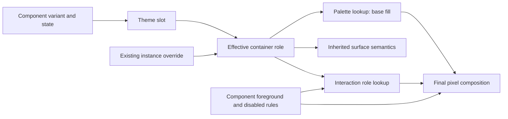

# Material 3 Component Surface Theme

Status: **Proposed.** Theme ownership and consuming components are implemented;
the component-theme API and reconciliation defined here are not.

## Objective

Allow applications to select neutral surface color roles independently for
Material 3 components through a shared theme, with defaults reconciled against
the Material 3 specification.

## Motivation

Changing `surfaceContainerHigh` in the palette changes dialogs, date pickers,
and standalone search bars together. An application cannot change all dialogs
independently without subclassing widgets. Existing card instance overrides
help individual cases but do not provide application-wide component defaults.

Centralizing role selection also exposes inconsistencies between some widgets'
painted backgrounds, reported roles, and specification defaults. The refactoring
corrects these while making deliberate application customization straightforward.

## Background

### Existing contracts

The [theme ownership design](../implemented/theme_color_tokens_design.md)
separates framework appearance from Material appearance. Application `Theme`
owns its framework settings and borrows a `Material3Theme`, which must outlive
the application and widgets. See the [glossary](../glossary.md) for shared
ownership terminology.

[Material3Theme](../../../src/roo_windows/material3/theme.h) contains literal
palette colors and precomputed ARGB interaction layers. `ColorToken` identifies
a palette role and occupies one byte. `kNone` represents absence of a role,
not a transparent color. [Material3Container](../../../src/roo_windows/material3/container.h)
resolves its role to a background, inheriting the actual parent background
with `kNone`, without adding instance storage.

The source audit used revision `828f3ab9`. Relevant findings:

- `FlexCard` caches style defaults in fields also used for explicit overrides.
  Its generic `FlexLayout` ancestry inherits background from its parent;
  publishing a card role alone does not establish an owned card fill.
- Filled unselected toggle icon buttons paint `surfaceContainer` but report
  `surfaceVariant` as their container role.
- Non-vibrant menu rows borrow list role selection rather than menu defaults.
- Tabs choose strip and individual tab backgrounds separately.
- Filled fields hard-code the same surface token in fill and interaction paths;
  outlined fields use the actual ancestor background.
- Navigation bars use `surface`; segmented lists use `surfaceContainer` as an
  intentional RGB565 contrast adjustment.

### Specification authority

Material 3 is authoritative for component defaults. Existing code, goldens,
earlier Roo designs, and platform implementations do not override it.

The audit on 2026-09-27 read the official site's published content and token
tables at revision **`2026-09-23_06-10-05`**. These are the public data loaded by
the JavaScript site, not third-party transcriptions. Select the token family
matching the implemented variant. Within the specification, exact component
tokens take precedence over conflicting prose or diagram captions; conflicts
are recorded below.

| Source | Specification | Published token table |
| --- | --- | --- |
| S1 | [App bars](https://m3.material.io/components/app-bars/specs) | [Tokens](https://m3.material.io/_dsm/data/dsdb-m3/2026-09-23_06-10-05/TOKEN_TABLE.3ec622835c7987b5.json) |
| S2 | [Search](https://m3.material.io/components/search/specs) | [Tokens](https://m3.material.io/_dsm/data/dsdb-m3/2026-09-23_06-10-05/TOKEN_TABLE.07341534518f78d0.json) |
| S3 | [Cards](https://m3.material.io/components/cards/specs) | [Tokens](https://m3.material.io/_dsm/data/dsdb-m3/2026-09-23_06-10-05/TOKEN_TABLE.100ebfb4332adab1.json) |
| S4 | [Dialogs](https://m3.material.io/components/dialogs/specs) | [Tokens](https://m3.material.io/_dsm/data/dsdb-m3/2026-09-23_06-10-05/TOKEN_TABLE.0b1e39a67d5bafdc.json) |
| S5 | [Date pickers](https://m3.material.io/components/date-pickers/specs) | [Tokens](https://m3.material.io/_dsm/data/dsdb-m3/2026-09-23_06-10-05/TOKEN_TABLE.01c5310367774eb8.json) |
| S6 | [Menus](https://m3.material.io/components/menus/specs) | [Tokens](https://m3.material.io/_dsm/data/dsdb-m3/2026-09-23_06-10-05/TOKEN_TABLE.385a28e5d3bb3dd0.json) |
| S7 | [Lists](https://m3.material.io/components/lists/specs) | [Tokens](https://m3.material.io/_dsm/data/dsdb-m3/2026-09-23_06-10-05/TOKEN_TABLE.6c818a16475113bd.json) |
| S8 | [Navigation bar](https://m3.material.io/components/navigation-bar/specs) | [Tokens](https://m3.material.io/_dsm/data/dsdb-m3/2026-09-23_06-10-05/TOKEN_TABLE.52865380210a9b69.json) |
| S9 | [Navigation rail](https://m3.material.io/components/navigation-rail/specs) | [Tokens](https://m3.material.io/_dsm/data/dsdb-m3/2026-09-23_06-10-05/TOKEN_TABLE.5b55bd7cc1ea6e29.json) |
| S10 | [Tabs](https://m3.material.io/components/tabs/specs) | [Tokens](https://m3.material.io/_dsm/data/dsdb-m3/2026-09-23_06-10-05/TOKEN_TABLE.6039f0080a95df1e.json) |
| S11 | [Text fields](https://m3.material.io/components/text-fields/specs) | [Tokens](https://m3.material.io/_dsm/data/dsdb-m3/2026-09-23_06-10-05/TOKEN_TABLE.60990dd98dea0998.json) |
| S12 | [Buttons](https://m3.material.io/components/buttons/specs) | [Tokens](https://m3.material.io/_dsm/data/dsdb-m3/2026-09-23_06-10-05/TOKEN_TABLE.1c4257f8804f9478.json) |
| S13 | [Icon buttons](https://m3.material.io/components/icon-buttons/specs) | [Tokens](https://m3.material.io/_dsm/data/dsdb-m3/2026-09-23_06-10-05/TOKEN_TABLE.0fe2282006ae098b.json) |
| S14 | [Switch](https://m3.material.io/components/switch/specs) | [Tokens](https://m3.material.io/_dsm/data/dsdb-m3/2026-09-23_06-10-05/TOKEN_TABLE.33b1b2925d9ff561.json) |

## Requirements

1. Independently customize implemented neutral component surfaces, including
   existing visual variants and flat/scrolled states.
2. Default to applicable Material component tokens and document intentional
   visual changes from current Roo behavior.
3. Keep actual backgrounds, inherited role semantics, and interaction rendering
   consistent while preserving component foreground and disabled-state rules.
4. Preserve explicit instance override precedence and inherited-background
   semantics.
5. Add no widget-instance storage or allocations on paint, layout, scroll, or
   interaction paths. Keep generic framework appearance separate.
6. Provide discoverable component groups, initialized defaults, and clear
   application-owned lifetime and compatibility contracts.

Scope is neutral surface selection and the companion corrections needed by
migrated paths. Typography, geometry, elevation, animation, global interaction
opacities, and comprehensive component-color customization are separate work.

## Design Overview

A **component surface slot** is a named `ColorToken` in the shared Material theme.
It selects a palette role without owning another literal color or widget state.
A **component group** is a named plain struct collecting one family's slots.

Add `Material3Theme::components`, used as
`material.components.textField.filledContainer`. The palette defines a role's
color; the component group chooses the role. Grouping supports IDE completion
and provides a stable home for later component settings.

For example, changing `card.filledContainer` to `kSurfaceContainerLow` affects
all filled cards without explicit overrides. Dialog defaults remain independent.
A card with `setContainerRole(kSurfaceContainerHighest)` keeps its explicit
choice. Changing the palette value for low subsequently affects every consumer
that selects low.



Shared slots and unified selection satisfy requirements 1 and 3. Source-backed
defaults satisfy requirement 2. Existing override flags and shared storage
satisfy requirements 4 and 5. Default member initialization and the ownership
example below satisfy requirement 6.

## Design Details

### Complete slot inventory

These are the complete **27** slots. Paths are relative to `components` and
describe enabled resting surfaces. Token names omit `md.comp.`; palette names
use existing C++ spelling instead of the specification's `md.sys.color.*` names.

| Slot | Default palette role | Specification token / mapping |
| --- | --- | --- |
| `layoutScaffold.container` | `surfaceContainerLowest` | Roo page-shell policy; no direct M3 component token |
| `appBar.flatContainer` | `surface` | S1 `app-bar.container.color` |
| `appBar.scrolledContainer` | `surfaceContainer` | S1 `app-bar.on-scroll.container.color` |
| `searchBar.container` | `surfaceContainerHigh` | S2 `search-bar.container.color` |
| `searchAppBar.flatContainer` | `surface` | S1 outer `app-bar.container.color` |
| `searchAppBar.scrolledContainer` | `surfaceContainer` | S1 outer `app-bar.on-scroll.container.color` |
| `searchAppBar.flatSearchContainer` | `surfaceContainer` | S1 `app-bar.search.container.color` |
| `searchAppBar.scrolledSearchContainer` | `surfaceContainerHighest` | S1 `app-bar.search.on-scroll.container.color` |
| `card.elevatedContainer` | `surfaceContainerLow` | S3 `elevated-card.container.color` |
| `card.filledContainer` | `surfaceContainerHighest` | S3 `filled-card.container.color` |
| `card.outlinedContainer` | `surface` | S3 `outlined-card.container.color` |
| `dialog.basicContainer` | `surfaceContainerHigh` | S4 `dialog.container.color`; includes alert dialogs |
| `dialog.fullScreenContainer` | `surface` | S4 `full-screen-dialog.container.color` |
| `datePicker.container` | `surfaceContainerHigh` | S5 `date-picker.modal.container.color`, `date-picker.docked.container.color`, `date-input.modal.container.color` |
| `menu.baselineContainer` | `surfaceContainer` | S6 `menu.container.color` |
| `menu.expressiveContainer` | `surfaceContainerLow` | S6 `menus.standard.container.color`, `menus.standard.menu-item.container.color` |
| `list.standardContainer` | `surface` | S7 `list.list-item.container.color` |
| `list.segmentedContainer` | `surface` | S7 `list.list-item.segmented.container.color` |
| `navigationBar.container` | `surfaceContainer` | S8 `nav-bar.container.color`; baseline `navigation-bar.container.color` agrees |
| `navigationRail.collapsedContainer` | `surface` | S9 `nav-rail.collapsed.container.color` |
| `navigationRail.expandedContainer` | `surface` | S9 `nav-rail.expanded.container.color`; persistent, non-modal |
| `tabs.primaryContainer` | `surface` | S10 `primary-navigation-tab.container.color` |
| `tabs.secondaryContainer` | `surface` | S10 `secondary-navigation-tab.container.color` |
| `textField.filledContainer` | `surfaceContainerHighest` | S11 `filled-text-field.container.color` |
| `button.elevatedContainer` | `surfaceContainerLow` | S12 `button.elevated.container.color` |
| `toggleIconButton.filledUnselectedContainer` | `surfaceContainer` | S13 `icon-button.filled.unselected.container.color` |
| `switchControl.unselectedTrack` | `surfaceContainerHighest` | S14 `switch.unselected.track.color` |

Date-picker modes deliberately share one slot: their implementation shares a
panel and the three applicable tokens agree. Compact full-screen promotion
continues to use the date-picker slot, not the general full-screen dialog slot.
The field launching a docked picker follows the text-field group.

Rails and tabs have separate slots for existing public variants. Embedded
search has independent slots because its defaults differ from standalone search.
Scaffold's preserved page-background choice is explicitly Roo policy, not a
claimed Material requirement. Generic panels, flex/pane/grid layouts and the
framework theme acquire no Material slots.

### Reconciliation and source conflicts

| Current behavior | Required behavior | Evidence |
| --- | --- | --- |
| Navigation bar uses `surface` | `surfaceContainer` | S8 exact container tokens |
| Full-screen dialog uses `surfaceContainerHigh` | `surface` | S4 exact full-screen token |
| Segmented rows use `surfaceContainer` | `surface` | S7 segmented token |
| Standard expressive menu panel uses `surfaceContainer` | `surfaceContainerLow` | S6 expressive standard token |
| Standard menu rows borrow list roles | Independent menu row/panel policy | S6 menu token families |
| Filled unselected toggle reports `surfaceVariant` | Report its configured resting surface role | S13 expressive token |
| Card role can disagree with inherited generic fill | Resolve card fill from its selected role | S3 and existing surface contract |

The official data contains these conflicts and variant distinctions:

- [Dialog prose](https://m3.material.io/_dsm/content/m3/2026-09-23_06-10-05/79c01ab5-d09a-4f6c-9aca-f76d310583bc.json)
  lists high for full-screen dialogs. S4 maps the precise root, resting header,
  and action-bar tokens to `surface`. Use the exact tokens; basic dialogs stay high.
- [Rail prose](https://m3.material.io/_dsm/content/m3/2026-09-23_06-10-05/98fe42bd-9bb1-4307-9e92-e61e57c3e9da.json)
  describes an optional `surfaceContainer` fill. S9 distinguishes persistent
  collapsed/expanded `surface` from expanded modal `surfaceContainer`. The
  existing persistent rail follows the former. No modal rail is added here.
- S13 contains older `filled-icon-button.*` and expressive
  `icon-button.filled.*` families. Use the latter for Roo's expressive toggle;
  do not substitute the older unselected highest role.
- S6 contains baseline `menu.*` and expressive `menus.standard.*` /
  `menus.vibrant.*`. Use one family consistently across the whole row.

Menu reconciliation includes fixed companion selection tokens so changes remain
readable: baseline selected rows use `secondaryContainer` / `onSecondaryContainer`;
standard expressive selected rows use `tertiaryContainer` / `onTertiaryContainer`;
vibrant selected rows use `tertiary` / `onTertiary`. Vibrant resting rows/panels
remain `tertiaryContainer` / `onTertiaryContainer`. Selected layer sources use
their corresponding foreground. These S6 corrections are internal defaults,
not new public accent slots. List overrides must never change menu surfaces.

This is a surface-color reconciliation, not certification of every existing
component against all Material requirements. Unrelated geometry, opacity, and
behavior discrepancies remain outside scope.

### Valid values and inheritance

New slots accept `kSurface` and the five `kSurfaceContainer*` roles. These neutral
roles share the existing foreground contract. Only the two rail slots also
accept `kNone`, supporting the spec's optional fill through existing inheritance:
inherit actual parent background and semantic role, rather than resolve an
absent token or paint transparent black. Detached rails retain framework fallback.

An internal helper validates a slot at lookup. Invalid configuration asserts in
debug builds and falls back to that slot's documented default in release builds.
No public registry or “use default” sentinel is needed. Existing explicit card
overrides retain their broader `ColorToken` contract, including `kNone`.

Neutral slots do not accept accent/inverse/error tokens, which need paired
foreground customization. Opaque neutral palette colors are supported; this
proposal adds no new alpha-composition contract.

### Resolution, rendering, and invalidation

Select the component's current variant/state, then use an explicit instance
override when present, otherwise its theme slot. Reuse that selection for owned
surface semantics and base fill. Never infer roles by comparing literal colors.

`Material3Container` already resolves fills for most panels. Direct-paint
components share a local role-selection helper between semantic and paint
paths. `FlexCard` adds a Material-aware `background()` override without changing
generic `FlexLayout`. Tabs use the same variant slot for the strip and children;
foreground composites use the resulting fill. Menu groups and scrolling gaps
inherit panel fill, while rows use menu policy independently of list defaults.

Interaction layers are distinct from resting fills. Preserve component-specific
foreground sources, including elevated-button primary and filled-unselected
toggle on-surface-variant. Where a path explicitly indexes interaction state by
container role, use the selected role rather than its former constant. Preserve
the existing hooks for layer source/compositing; add no per-widget policy state.

Disabled rendering follows the component's disabled token. Filled fields,
buttons, and filled toggle buttons retain their on-surface disabled fills rather
than receiving a blanket translucent enabled fill. Switches use the configured
unselected track in disabled track composition because S14 derives that token
from the track's default role. Composite foregrounds against the actual relevant
background at the existing paint point. Do not rewrite unrelated foreground
uses of the same palette role, such as the switch icon, as track overrides.

Outlined fields retain actual ancestor background without a new slot. Selected
expressive list rows retain their selection role; list slots govern unselected
rows. Date-picker compact promotion preserves picker surface semantics.

Role lookup is live and uncached. Themes are normally immutable after setup;
mutating owned theme data does not schedule a repaint. Applications that mutate
it must do so on the UI task between completed frames, then invalidate affected
subtrees through existing APIs. Mutation during suspended paint continuation is
outside the contract. No theme event system or synchronization is introduced.

### Card override compatibility

Use the existing `kOverrideContainerRole` bit as authority. Without it, resolve
the style's current theme slot; with it, return the explicit token. Clearing an
override restores theme lookup rather than a cached historical default.

Preserve explicit overrides across `setStyle()`, matching today's implementation;
correct the header comment that currently says they reset. Compare effective
roles before/after setters and invalidate the interior and descendants when
appearance changes. Preserve `containerRoleOverride()`'s observable value:
effective default when no override is set, explicit token otherwise. Document
this behavior; the internal bit still distinguishes the cases.

No additional instance setters are introduced. Existing application subclasses
overriding virtual surface methods keep their explicit behavior.

### Resources, ownership, and palette changes

The completed component theme contains 27 one-byte enums in nonempty groups:
27 bytes, alignment 1. Assert both. Appending it to the documented 928-byte,
four-byte-aligned Material theme is expected to produce 956 bytes, a 28-byte
increase including padding. Verify the supported target ABI. `Theme` retains
its existing pointer and every widget size remains unchanged.

Lookup adds fixed field loads and validation to existing variant branches and
color resolution: constant work in widget count and tree depth. Rail `kNone`
retains the existing ancestor walk; no new traversal is introduced. There are
no paint-path allocations, per-widget theme pointers, strings, registries, or
theme copies. Report actual linked flash/data deltas during acceptance.

Applications own long-lived customized Material theme storage. Copying
`DefaultTheme()` alone copies its pointer, not the Material object. Never point
a retained `Theme` at a temporary local copy.

Changing only component slots or literal neutral surface colors does not require
rebuilding state layers: they derive from foreground colors. Changing layer-source
colors such as `onSurface` does require rebuilding them; framework colors also
remain independent after `MakeFrameworkTheme()`. A general palette/state builder
is separate work. The example below changes only slots.

## Proposed API

Place named public groups in `material3/component_theme.h`. Move the existing
`ColorToken` definition unchanged into `material3/color_token.h` to avoid an
include cycle. `material3/theme.h` includes both transitively, preserving current
include usage, numeric values, and state-table dimensions.

Representative declarations:

```cpp
/// Selects neutral fills for the three Material card styles.
struct CardTheme {
  ColorToken elevatedContainer = ColorToken::kSurfaceContainerLow;
  ColorToken filledContainer = ColorToken::kSurfaceContainerHighest;
  ColorToken outlinedContainer = ColorToken::kSurface;
};

/// Selects the filled-field surface; outlined fields inherit their background.
struct TextFieldTheme {
  ColorToken filledContainer = ColorToken::kSurfaceContainerHighest;
};

/// Selects basic/alert and full-screen dialog surfaces independently.
struct DialogTheme {
  ColorToken basicContainer = ColorToken::kSurfaceContainerHigh;
  ColorToken fullScreenContainer = ColorToken::kSurface;
};

/// Collects application-wide component surface defaults.
struct ComponentTheme {
  LayoutScaffoldTheme layoutScaffold;
  AppBarTheme appBar;
  SearchBarTheme searchBar;
  SearchAppBarTheme searchAppBar;
  CardTheme card;
  DialogTheme dialog;
  DatePickerTheme datePicker;
  MenuTheme menu;
  ListTheme list;
  NavigationBarTheme navigationBar;
  NavigationRailTheme navigationRail;
  TabsTheme tabs;
  TextFieldTheme textField;
  ButtonTheme button;
  ToggleIconButtonTheme toggleIconButton;
  SwitchTheme switchControl;
};

/// Composes Material palette, interactions, and component defaults.
struct Material3Theme {
  ColorScheme color;
  StateLayerTheme state;
  ComponentTheme components{};
};
```

The inventory defines the exact fields and initializers for all remaining named
groups. They have no methods, private state, inheritance, or vtables. Use
`switchControl` because `switch` is a C++ keyword. One grouping level is enough:
`textField.filledContainer` does not need a `filled` subobject.

Application setup, before widget construction:

```cpp
material3::Material3Theme MakeApplicationMaterialTheme() {
  material3::Material3Theme result = DefaultTheme().material3Theme();
  result.components.card.filledContainer =
      material3::ColorToken::kSurfaceContainerLow;
  result.components.textField.filledContainer =
      material3::ColorToken::kSurfaceContainer;
  return result;
}

const Theme& ApplicationTheme() {
  static const material3::Material3Theme material = MakeApplicationMaterialTheme();
  static const Theme theme = {
      material3::MakeFrameworkTheme(material), &material};
  return theme;
}
```

The trailing default-initialized member preserves aggregate source initialization
supplying only `color` and `state`. It does not preserve binary ABI; rebuild
library and application together. `memset` is not default construction.

Introduce each group only with its consuming implementation commit. Intermediate
commits expose only implemented groups; the sketch describes the completed API.
There are no accepted-but-ignored public settings requiring warning stubs.

## Implementation Plan

Authoring references: [C++ guidance](../../../.github/instructions/general-cpp-code-authoring-instructions.md),
[widget guidance](../../../.github/instructions/roo-windows-widget-authoring.instructions.md),
and [example guidance](../../../.github/instructions/embedded-example-authoring.instructions.md).
Each phase maps to one commit and updates API documentation and the affected
component designs' color contracts with links to this document.

### Phase 1: Foundation and cards

Extract the unchanged enum, add component storage initially containing only
`CardTheme`, add internal validation, and migrate card defaults, overrides and
background together. Extend theme tests and add `material3_card_theme_test`.
Cover actual fill/child semantics against a differently colored parent, explicit
override precedence, clear/style changes, fallback validation, and unchanged size.

Add a build-covered `examples/material3/theme/surface_roles` example teaching
card surface customization; extend it as other groups land.

Proposed commit message:

> Component surface theme, phase 1: add shared card surface defaults.
>
> Introduce compact component-theme storage and live card role resolution,
> preserve explicit overrides, and add focused coverage and a theme example
> following the component surface theme design.

Validation: `//:theme_color_tokens_test`, new card-theme target,
`//:material3_container_test`, and new example compile target.

### Phase 2: Panels, dialogs, and search

Add scaffold, app-bar, standalone/embedded search, dialog and date-picker groups
with all their consumers. Split dialog roles using the existing variant; keep
date-picker promotion on its own slot. Extend the example with independent
dialog styling. Test flat/scrolled, basic/full-screen and picker presentation
selection and actual fills. Review full-screen dialog golden changes against S4.

Proposed commit message:

> Component surface theme, phase 2: theme panel and search surfaces.
>
> Add panel surface slots, reconcile full-screen dialog defaults to Material
> tokens, and cover variant selection and themed rendering in this design.

Validation: focused app-bar, dialog, scaffold, date-picker and docked-date-picker
tests, affected goldens, and example builds.

### Phase 3: Navigation and tabs

Add bar, rail and tab groups. Correct bar default to container; retain persistent
rail defaults from S9. Unify strip/child fills and relevant foreground composites.
Support rail inheritance without a new mode field. Cover both rail layouts and
tab variants, custom-parent inheritance, and navigation selection on customized
surfaces. Update navigation example documentation alongside the feature.

Proposed commit message:

> Component surface theme, phase 3: theme navigation and tab containers.
>
> Apply shared defaults, correct the navigation-bar role, and verify inherited
> rails and consistent child rendering as specified in this design.

Validation: navigation-bar, navigation-rail and tabs unit/golden targets and
their existing example builds.

### Phase 4: Lists and menus

Add list/menu groups together to establish their independence. Restore S7's
segmented default and document the explicit override restoring the old RGB565
choice. Resolve menu rows from menu policy using existing owner/variant data,
with no new row storage. Detached rows use their visual variant and existing
color-style flag; baseline and standard expressive rows select the corresponding
menu slot even without an owner.

Reconcile panel, row, selection, foreground and layer-source roles together
against S6. Test baseline, expressive standard/vibrant, selected, disabled,
scrolling gaps, submenus, and detached rows. Distinct list/menu slot colors catch
accidental delegation; recycled list rows must not retain old role values.
Update list/menu example notes with reviewed golden changes.

Proposed commit message:

> Component surface theme, phase 4: separate list and menu surface policies.
>
> Add independent slots, reconcile segmented and expressive menu defaults,
> and test selection, recycling and gaps under this design's role contract.

Validation: `//:material3_list_test`, `//:material3_dynamic_list_test`,
`//:material3_menu_row_test`, `//:material3_menu_test`,
`//:material3_menu_golden_test`, and affected example builds.

### Phase 5: Filled control surfaces

Add filled-field, elevated-button, filled-unselected-toggle and switch-track
groups. Unify role/fill selection, reconcile toggle semantics, and preserve
transparent variants and independent foreground tokens. Test customized fills
in enabled, disabled, hovered, focused, pressed and selected states, including
outlined inheritance and switch icon independence. Extend the example with
filled fields and update existing control example documentation.

Proposed commit message:

> Component surface theme, phase 5: unify themed control fill and role selection.
>
> Add remaining neutral control slots, reconcile toggle semantics, and validate
> interaction and disabled composition as defined by this design.

Validation: focused button, switch, toggle-icon-button and text-field tests,
applicable goldens, and example builds.

### Phase 6: Integrated acceptance and costs

Add an integrated surface-role rendering fixture with default/customized
light/dark palettes and RGB565 output. Assert the final 27-byte payload, unchanged
widget sizes, and supported-target theme delta. Update the
[target baseline](../../material3_target_baseline.md), release notes and example
instructions. Record source rationale for changed defaults; mark this design
implemented only when its scope passes.

Proposed commit message:

> Component surface theme, phase 6: record rendering acceptance and target costs.
>
> Verify the completed contract, document migration and storage impact, and
> record the specification-backed golden changes from this design.

Validation: integrated fixture, affected suites after integration, example build,
and the baseline document's supported-target build/size procedure. Exit criteria:
no widget growth or new hot-path allocations, the documented shared payload,
and every changed default traceable to the inventory or companion reconciliation.
Investigate excess cost instead of silently raising the budget.

## Testing Plan

Use the leaf `roo_windows` Bazel workspace; targets above are relative to it.
Existing focused targets are in [BUILD](../../../BUILD). Add only the proposed
card and integrated targets; extend component tests for other coverage.

Unit tests cover selection, precedence, initialization compatibility, inheritance,
invalid settings and size contracts. Rendering tests check actual fill and
foreground/state composition, not only getters. Distinct palette colors expose
role mistakes; representative light/dark RGB565 palettes establish visual
acceptance. Review spec corrections before updating goldens.

Target checks measure singleton storage, representative widget sizes, linked
flash/data deltas and existing allocation/resource contracts. Tests mutating
theme data explicitly invalidate after completed frames; they do not imply
automatic theme notifications.

## Caveats

The documented reconciliations intentionally change default images. Applications
can explicitly restore previous neutral fills using the corresponding slots.
There is no global legacy-default switch. Role selection cannot guarantee
contrast for arbitrary palette values; component foreground roles remain intact.

The current palette lacks `surfaceBright` and `surfaceDim`. Adding them requires
a separate enum/state-table audit. This scope covers the six existing neutral
surface roles. The pinned official data records decisions; later spec updates
require a reviewed inventory/test update, never runtime or build-time fetching.

### Rejected Alternatives

#### Global palette changes only

Already supported and useful, but cannot distinguish components sharing a role.
The shared component slots supply the missing selection described above.

#### A role member and setter on every container

Useful for isolated changes but insufficient for shared defaults. Even a byte
can grow an aligned widget. Reuse card override storage and add zero bytes to
other instances instead.

#### A registry or virtual provider

Supports arbitrary third-party keys, but adds dispatch and lifetime machinery
for a fixed 27-slot problem. Direct members provide constant lookup, completion,
and an inspectable 27-byte payload.

#### Literal component colors

Permit arbitrary branding but duplicate palette data and lose semantic roles.
They also require paired foreground/state configuration. Neutral role selection
is the bounded capability required here.

#### Preserve every current default

Retains known mismatches and the RGB565-specific list choice as library policy.
Material tokens are authoritative; application overrides express alternatives.

## Future Work

- Paired foreground, outline, accent and inverse-role customization.
- A palette/state builder and a separate live theme-notification contract.
- Slots for modal rails, expanded search, sheets and FABs as implementations land.
- Independent modal/docked date-picker styling when those presentations acquire
  separate appearance policies.
