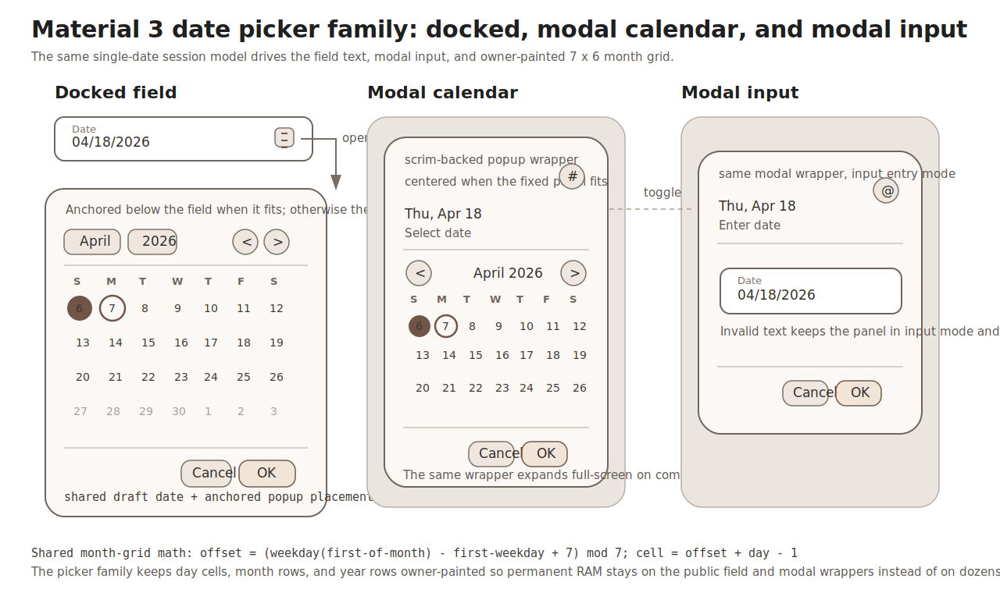

# Roo Windows Material 3 Date Picker Design

## Implementation status

**Proposed.** None of the defined scope is implemented. The status of existing and outstanding prerequisites is recorded in the [status index](../README.md).

## Objective

Add a Material Design 3 single-date picker family to `roo_windows` that fits
the framework's embedded-first widget model and closes directly on the current
popup, scrim, and planned Material 3 text-field infrastructure.

The design provides:

- one compact date-only value type instead of a timezone-bearing wall-time
  type,
- one reusable calendar selection substrate with owner-painted month and year
  views,
- one modal date picker that uses a scrim-backed popup wrapper and falls back
  to a full-screen presentation on compact tasks,
- one modal date input presentation that shares the same draft state,
  validation, and confirmation flow,
- one docked date-picker field that reuses the landed
  [material3::TextField](material3_text_fields_design.md) surface and opens an
  anchored calendar popup below the field when that popup fits,
- compile-time localized month labels, weekday labels, headlines, and numeric
  date parsing or formatting selected by `ROO_WINDOWS_LANG`,
- selected, today, disabled, and outside-month day states without creating 42
  child widgets,
- and a rollout plan that lands the modal calendar first and then layers modal
  input and docked behavior on top of the already-planned text-field seam.

The first family is single-date only. It does not land date-range selection,
multi-month layouts, or time picking.

## Motivation

`roo_windows` already has Material 3 buttons, lists, badges, sliders, sheets,
and text-field design work, but it still lacks any checked-in date-picker
primitive.

That gap matters for three reasons:

1. Applications currently have to reinvent civil-date math, month navigation,
   parsing, validation, popup placement, and confirmation behavior each time a
   screen needs date input.
2. The checked-in [Material 3 text-field design](material3_text_fields_design.md)
   explicitly calls out picker-style fields as the next layer on top of the
   text-field family.
3. Material 3 treats date picking as a standard interaction pattern with three
   distinct presentations: docked, modal calendar, and modal input. Without a
   library implementation, `roo_windows` cannot offer a consistent embedded
   answer for any of them.

The library therefore needs one closed single-date picker family that matches
its popup, paint, RAM, and localization constraints instead of another
application-specific composite.

## Background

### Current Status in `roo_windows`

As of 2026-05, the relevant pieces are:

- popup-task infrastructure in
  [src/roo_windows/core/application.h](../../../src/roo_windows/core/application.h)
  and [src/roo_windows/core/main_window.h](../../../src/roo_windows/core/main_window.h),
  which already host temporary popup children above ordinary content and below
  the dialog layer,
- the shared [Scrim](../../../src/roo_windows/widgets/scrim.h) widget used by other
  modal surfaces,
- the shared [ScrollablePanel](../../../src/roo_windows/containers/scrollable_panel.h)
  path for drag and fling behavior,
- the checked-in [Material 3 text-field design](material3_text_fields_design.md),
  which already closes the future `material3::TextField` API and explicitly
  leaves room for picker-field follow-on work,
- the checked-in [Material 3 menus design](material3_menus_design.md), which
  already closes the anchored-popup placement algorithm that docked pickers
  should reuse,
- the checked-in [non-touch input design](non_touch_input_design.md), which
  already closes the future focus and semantic-action model that pickers should
  align with,
- and the checked-in [Material 3 sheets design](material3_sheets_design.md),
  which already establishes the local pattern of full-window popup wrappers
  plus `Scrim` for modal surfaces.

What does not exist yet:

- no Material 3 date picker under `src/roo_windows/material3/date_picker`,
- no Material 3 icon-button family under `src/roo_windows/material3`,
- no application-owned wall-clock service in
  [src/roo_windows/core/application_context.h](../../../src/roo_windows/core/application_context.h),
- no localized month-name or weekday-name tables in `roo_windows` or
  `roo_locale`,
- and no public date-only type that separates civil dates from wall time and
  timezone.

Those gaps drive the design directly:

1. the family needs its own date-only type,
2. today-highlighting cannot be implicitly sourced from `ApplicationContext`,
3. docked placement must reuse the anchored-popup algorithm instead of opening
   a second popup-positioning subsystem,
4. header affordances cannot block on a not-yet-landed icon-button package,
5. and the month grid cannot be modeled as one child widget per day cell.

### Material 3 Signals

This document is aligned against the Material 3 date-picker references:

- [Overview](https://m3.material.io/components/date-pickers/overview)
- [Specs](https://m3.material.io/components/date-pickers/specs)
- [Guidelines](https://m3.material.io/components/date-pickers/guidelines)

The product signals that matter most here are:

1. Material 3 defines three single-date presentations: docked date picker,
   modal date picker, and modal date input.
2. Docked pickers pair a text field with a dropdown calendar and are the
   preferred presentation on medium and expanded windows.
3. Modal calendar pickers are the preferred compact-window presentation and
   expand to a full-screen layout when the dialog-sized surface does not fit.
4. Modal input is the right compact-window path for dates that are far in the
   past or future and are more efficiently typed than paged.
5. Selected dates, today's date, disabled dates, and outside-month dates are
   visually distinct.
6. Month navigation and year jumps are normal parts of the component model.
7. Both docked and modal presentations use explicit confirm and cancel
   actions; selecting a day updates draft state immediately but does not commit
   until confirmation.
8. Date ranges are part of the broader Material family, but they use a
   different visual grammar and interaction model from single-date selection.

### Local Framework Constraints

The most relevant local references are:

- [material3_text_fields_design.md](material3_text_fields_design.md)
- [material3_menus_design.md](material3_menus_design.md)
- [material3_sheets_design.md](material3_sheets_design.md)
- [non_touch_input_design.md](non_touch_input_design.md)
- [widget_authoring.md](../../widget_authoring.md)
- [roo-windows-widget-authoring.instructions.md](../../../.github/instructions/roo-windows-widget-authoring.instructions.md)

Those references close six local constraints:

1. keep per-instance RAM low and move temporary popup state off closed fields,
2. reuse the shared popup-task and scrim infrastructure,
3. reuse `material3::TextField` for editable date input instead of creating a
   second text-entry subsystem,
4. keep day cells, month rows, and year rows owner-painted instead of turning
   them into dozens of child widgets,
5. align future keyboard and D-pad behavior with the non-touch design instead
   of synthesizing touch taps,
6. and keep API callbacks on virtual hooks rather than per-instance
   `std::function` members.

## Requirements

### Functional Requirements

1. Support single-date selection through a modal calendar picker.
2. Support a modal input presentation that shares the same selection model,
   validation rules, and confirm or cancel flow.
3. Support a docked date-picker field with an anchored popup calendar when the
   popup fits the available task bounds.
4. Support automatic promotion from the docked popup to the modal wrapper when
   the fixed docked panel would crop required 48 dp targets.
5. Support month paging and direct year jumps.
6. Support min and max bounds plus an overridable enablement hook for
   application-specific disabled dates.
7. Support localized month labels, weekday labels, static strings, and numeric
   parse or format rules selected by `ROO_WINDOWS_LANG`.
8. Support selected, today, disabled, and outside-month visuals.
9. Reuse popup tasks, `Scrim`, and the planned `material3::TextField` family
   rather than introducing separate overlay or input subsystems.
10. Keep a clear follow-on seam for date-range selection without paying for
    range-selection state on every single-date picker.

### Interaction Requirements

1. Modal presentation must block interaction with the content beneath it.
2. Modal and docked presentations must both maintain a draft date that commits
   only on OK and rolls back on Cancel or outside dismissal.
3. Selecting a day must update the draft date, headline, and input text
   immediately.
4. The docked field must open its picker on focus, tap, or trailing-affordance
   activation and keep text entry active while the picker is open.
5. The docked field text and popup calendar must share one draft model while
   the picker is open.
6. Invalid or incomplete typed input must disable OK and paint the field in an
   error state.
7. Outside-month day cells must paint for orientation but must not accept
   selection.
8. Month paging, year jumping, popup placement, and day hit-testing must not
   allocate on the hot path.
9. When the non-touch framework lands, focus movement and semantic activation
   must flow through that framework's focused-widget and action hooks.

### API Requirements

1. Expose a compact public date-only type independent of timezone and wall
   time.
2. Keep the public picker family to `ModalDatePicker` and
   `DockedDatePickerField`; keep the month grid, month list, and year list
   helpers internal.
3. Base `DockedDatePickerField` on the landed `material3::TextField`, not on
   the legacy [widgets/text_field.h](../../../src/roo_windows/widgets/text_field.h)
   API.
4. Expose shared default strings and parse or format providers through shared
   const helpers plus overridable virtual hooks.
5. Use virtual hooks for acceptance, dismissal, and date enablement rather
   than per-instance callback storage.
6. Expose an explicit `today` setter because `ApplicationContext` does not
   currently provide wall time.
7. Do not expose public range-selection APIs in the first family.
8. Do not land public docked entry points before editable text-field
   integration and anchored popup presentation both work end to end.

### Embedded Constraints

1. Do not create 42 day-cell widgets or one child widget per year row.
2. Do not allocate on paint, hit-testing, month paging, year jumps, or popup
   reposition.
3. Keep month labels, weekday labels, and numeric formatting tables shared per
   language rather than storing them on each picker.
4. Keep temporary popup, year-list, and draft state off closed docked fields.
5. Use owner-painted icon affordances for header controls instead of waiting on
   a separate icon-button family.
6. Add pointer-size-aware size-budget assertions for the public picker types.

## Design Overview

### Scope

In scope:

- single-date modal calendar picking,
- single-date modal input,
- docked field plus anchored popup,
- compact-task fallback from docked to modal,
- localized strings and numeric parsing or formatting,
- explicit today highlighting,
- and min or max bounds plus application-defined disabled dates.

Out of scope:

- date-range selection,
- time picking,
- multi-month layouts,
- runtime locale switching,
- implicit wall-clock discovery from `ApplicationContext`,
- and bespoke date-picker animations.

### Core Structure

The family has two public entry points and four shared internal pieces:

1. `material3::CivilDay` is the compact date-only value type.
2. `material3::ModalDatePicker` is the full-window scrim-backed modal picker.
3. `material3::DockedDatePickerField` is the editable text field that opens an
   anchored picker when that picker fits and promotes to modal when it does
   not.
4. An internal `DatePickerSession` owns the temporary draft date, visible
   month, current panel mode, and parse-validation state for one open picker.
5. An internal `DatePickerPanel` owns the Material 3 surface, header, body,
   action row, and optional modal-input field.
6. An internal owner-painted `MonthGridView` paints the 7 x 6 month grid.
7. An internal owner-painted `YearListView` and `MonthListView` handle direct
   month or year jumps without child-per-row RAM.

The key architectural decisions are:

1. use one modal class with an `entryMode` enum instead of separate public
   modal-calendar and modal-input classes,
2. keep the panel and grid helpers internal because applications asked for date
   pickers, not a general-purpose calendar widget,
3. keep docked and modal flows on one shared temporary session model so typing,
   day taps, confirm, and cancel follow the same rules,
4. owner-paint the day grid, month list, year list, and header icon controls,
5. promote the docked field to modal on compact tasks instead of cropping a
   fixed popup below the field,
6. and keep public callbacks on virtual hooks while shared language and codec
   tables stay singleton-like and compile-time.



## Design Details

### Date Model and Locale Data

The public value type is `CivilDay`, not `roo_time::DateTime`.

`CivilDay` stores one signed 32-bit day index in the civil Gregorian calendar.
`CivilDay::Invalid()` reserves one sentinel value for "no date selected".
The public API exposes only date-relevant operations: construction from year,
month, and day; extraction back to year, month, and day; day-of-week lookup;
and day-wise arithmetic.

The implementation reuses the existing civil-date algorithms already present in
`roo_time` for conversion and weekday derivation, but it does not expose
timezone, hour, minute, second, or wall-time semantics on the picker API.

Localization is handled by two shared singleton-like helpers:

1. `DatePickerStrings`, which contains the language-specific month names,
   narrow weekday labels, first weekday, and static UI strings,
2. `DateTextCodec`, which parses and formats the numeric date representation
   used by modal input and the docked field.

Both helpers are selected by `ROO_WINDOWS_LANG`, matching the existing dialog
string-constant pattern. English and Polish tables land with the first family
because `roo_windows` already uses compile-time language selection and already
ships Polish dialog strings. Runtime locale switching stays out of scope.

Because `ApplicationContext` does not currently expose wall time, today
highlighting is explicit state on `ModalDatePicker` and
`DockedDatePickerField`. Leaving `today` invalid disables the today-ring
visual.

### Shared Session State and Surface Ownership

`DatePickerPanel` is the surface-owning widget in the family.

It owns:

- the outer rounded Material 3 container,
- the headline and supporting-label band,
- the day-grid or list body,
- the action-row divider,
- two action buttons,
- and the optional modal-input `material3::TextField` child.

It does not own one widget per day, month, or year.

Open-picker session state lives in an internal `DatePickerSession` object with
these fields:

- committed value,
- draft value,
- visible month,
- min and max bounds,
- today value,
- entry mode,
- panel mode (`day`, `month-list`, `year-list`, or `input`),
- and one parse-validation bit.

`ModalDatePicker` owns that session for its entire visible lifetime. A closed
`DockedDatePickerField` does not. The field stores only durable state that must
survive while the picker is closed: committed value, visible month seed,
today, and bounds. When the field opens, it creates a temporary session and
binds its text buffer to that session until confirmation or dismissal.

This keeps the expensive temporary state off every closed field while still
giving docked and modal variants the same behavioral contract.

### Calendar Grid Geometry

The month view is always a fixed 7 x 6 grid.

That choice is closed for three reasons:

1. it keeps the surface height stable across months,
2. it avoids layout churn when moving between 28-, 29-, 30-, and 31-day
   months,
3. and it lets the day-grid hit-test stay arithmetic instead of widget-based.

Let:

- $w_0$ be the weekday of the first day of the visible month,
- $w_f$ be the locale's first weekday from `DatePickerStrings`,
- and $d$ be a day number in the visible month.

The leading offset count is:

$$
o = (7 + w_0 - w_f) \bmod 7
$$

The zero-based cell index for day $d$ is:

$$
i = o + d - 1
$$

The grid coordinates are then:

$$
row = \left\lfloor i / 7 \right\rfloor, \quad col = i \bmod 7
$$

Hit-testing uses that same mapping in reverse. The day grid therefore needs no
child objects at all.

Each grid cell reserves a 48 dp touch target. The visible selected state is a
token-backed circle or rounded container centered inside that target. Today is
drawn as a ring when it is not selected. Disabled days and outside-month days
paint with their own subdued roles. Outside-month cells are display-only and
never accept selection.

### Header Controls and Month or Year Navigation

The header has three owner-painted control groups:

1. previous and next month arrows,
2. the current month or year trigger,
3. the calendar or input toggle affordance.

Those controls are owner-painted instead of `material3::IconButton` children
because there is no checked-in icon-button family in `src/roo_windows/material3`
today and the date picker does not need to block on that package.

The modal flow uses two body modes beyond the main day grid:

- `year-list`, entered by activating the year trigger,
- `input`, entered by activating the edit toggle.

The docked flow uses two non-input body modes beyond the main day grid:

- `month-list`, entered by activating the month trigger,
- `year-list`, entered by activating the year trigger.

`MonthListView` is a short owner-painted list of 12 months. `YearListView` is
an owner-painted scrollable list hosted inside `ScrollablePanel`. Neither view
creates one widget per row.

Selecting a month or year updates the visible month immediately. The draft date
is then resolved as follows:

1. if the previous draft day number exists in the new month and the resulting
   day is within bounds and enabled, keep that same numeric day,
2. otherwise clear the draft date and disable OK until the user picks a valid
   day or enters a valid date.

That rule keeps navigation deterministic without silently clamping the draft to
an unrelated day.

### Modal Presentation and Compact Full-Screen Fallback

`ModalDatePicker` is a full-window popup wrapper hosted in a popup task.

It owns:

- one `Scrim`,
- one `DatePickerPanel`,
- one open-state bit,
- and one dismiss-reason enum.

The wrapper chooses between two presentations:

1. a centered fixed-size dialog-style panel when that panel fits while keeping
   the day-grid targets and action row intact,
2. a full-window presentation when the fixed panel would crop those required
   targets.

This keeps the public API small while still matching Material's compact-window
guidance. The decision is local to the component; it does not introduce a new
global window-size policy.

Modal show and hide are immediate in the first family. There is no picker-
specific open or close animation in v1. The scrim therefore repaints only on
attach or detach, not on every frame of a custom motion path.

### Modal Input Mode

`ModalDatePicker` covers both modal calendar and modal input.

`entryMode()` chooses the initial body mode. The header toggle swaps between
day-grid and input presentations.

The input presentation hosts one outlined `material3::TextField` child that is
bound to the same `DatePickerSession` draft state as the calendar body. The
field placeholder comes from `DateTextCodec::placeholder()`.

Mode transitions are closed as follows:

1. switching from calendar to input always copies the current draft date into
   the input text when that draft is valid,
2. switching from input to calendar first parses the current text,
3. if parsing succeeds and the date is within bounds and enabled, the draft and
   visible month update and the panel enters day view,
4. if parsing fails or the date is invalid, the panel stays in input mode and
   paints the field in error.

OK is enabled only while the session holds a valid draft date.

### Docked Field, Anchored Popup, and Modal Promotion

`DockedDatePickerField` derives from `material3::TextField`.

It is editable, not read-only. That choice is deliberate because the Material 3
docked variant exposes both direct numeric input and calendar interaction in
the same component. The field uses the normal Material 3 text-field surface,
keeps a trailing calendar affordance, and opens its picker when focused,
clicked, or triggered through that affordance.

While the picker is open:

- the field text is bound to the shared session draft,
- valid typed input updates the visible month and highlighted day
  immediately,
- invalid or incomplete input disables OK and paints the field in error,
- and cancel or outside dismissal restores the pre-open field text and value.

Anchored popup placement reuses the same full-screen-overlay and candidate-
placement strategy already closed in [material3_menus_design.md](material3_menus_design.md).
The docked picker prefers a below-start placement aligned to the field. When
that fixed-size popup would crop required targets even after clamping to the
visible bounds, `DockedDatePickerField` promotes itself to `ModalDatePicker`
instead of showing a cropped popup.

That gives the field one public entry point while still respecting the
component-level responsive guidance from Material 3.

### Selection, Validation, and Commit Rules

Every open picker session has one committed value and one draft value.

The rules are:

1. opening a picker seeds the draft from the committed value,
2. selecting a day updates the draft immediately,
3. typing a complete valid date updates the draft immediately,
4. typing an invalid or incomplete date leaves the committed value unchanged
   and marks the draft invalid,
5. pressing OK commits the draft into the durable value,
6. pressing Cancel or tapping outside dismisses the picker and restores the
   durable value,
7. changing bounds does not rewrite the currently committed value; it only
   constrains future selections and disables OK until the draft becomes valid.

This keeps the component predictable for callers that already own state and do
not want hidden mutation when bounds change.

### RAM Impact

The design deliberately keeps the permanent public types much smaller than a
widget-per-cell implementation would.

Approximate 32-bit target costs are:

- `CivilDay`: 4 B,
- `DatePickerBounds`: 8 B,
- `DockedDatePickerField`: one committed `CivilDay`, one visible-month seed,
  one today `CivilDay`, one `DatePickerBounds`, and one open-state bit on top
  of the landed `material3::TextField` base,
- `ModalDatePicker`: one temporary `DatePickerSession`, one `Scrim`, two action
  buttons, and one optional input child,
- no per-day widgets,
- no per-year-row widgets,
- and one shared set of language tables and codec helpers per build, not per
  picker.

The one notable permanent cost is the explicit `today` field. That field is
accepted because `ApplicationContext` does not currently provide a wall-clock
service and the library still needs a straightforward way to paint today's
state.

### Repaint and Invalidation Consequences

The family has five repaint-sensitive regions:

1. header controls and headline,
2. month-grid or list body,
3. optional input field,
4. action row,
5. popup or modal wrapper bounds.

The chosen paint contract is:

1. day selection dirties only the old and new target cells plus the headline or
   field text region,
2. month changes dirty the body and the header label band,
3. mode changes dirty the whole body region because the body switches between
   grid, list, and input compositions,
4. year-list scrolling repaints only the scrolled visible region through the
   existing scrollable-panel path,
5. docked popup reposition invalidates the union of the old and new popup
   bounds,
6. modal attach or detach invalidates the full task once for scrim visibility,
   but there is no custom per-frame scrim animation in v1.

## Proposed API

```cpp
namespace roo_windows::material3 {

class CivilDay {
 public:
  CivilDay();

  static CivilDay Invalid();
  static CivilDay FromYmd(int16_t year, uint8_t month, uint8_t day);

  bool isValid() const;
  int16_t year() const;
  uint8_t month() const;
  uint8_t day() const;
  roo_time::DayOfWeek dayOfWeek() const;

  CivilDay addDays(int32_t days) const;
};

struct DatePickerBounds {
  CivilDay first = CivilDay::Invalid();
  CivilDay last = CivilDay::Invalid();
};

enum class DatePickerEntryMode : uint8_t {
  kCalendar,
  kInput,
};

enum class DatePickerDismissReason : uint8_t {
  kConfirm,
  kCancel,
  kOutsideTap,
  kProgrammatic,
};

struct DatePickerStrings {
  roo_time::DayOfWeek first_weekday = roo_time::kSunday;
  roo::string_view headline_select_date = {};
  roo::string_view headline_input_date = {};
  roo::string_view ok_label = {};
  roo::string_view cancel_label = {};
  roo::string_view month_names[12];
  roo::string_view weekday_narrow[7];
};

class DateTextCodec {
 public:
  virtual ~DateTextCodec() = default;

  virtual bool parse(roo::string_view text, CivilDay& out) const = 0;
  virtual size_t format(CivilDay day, char* out, size_t out_size) const = 0;
  virtual roo::string_view placeholder() const = 0;
};

const DatePickerStrings& DefaultDatePickerStrings();
const DateTextCodec& DefaultDateTextCodec();

class ModalDatePicker : public Container {
 public:
  explicit ModalDatePicker(ApplicationContext& context);

  void setValue(CivilDay day);
  CivilDay value() const;

  void setToday(CivilDay day);
  CivilDay today() const;

  void setBounds(DatePickerBounds bounds);
  DatePickerBounds bounds() const;

  void setDisplayedMonth(CivilDay day);
  CivilDay displayedMonth() const;

  void setEntryMode(DatePickerEntryMode mode);
  DatePickerEntryMode entryMode() const;

  void open(Application& app);
  void dismiss(
      DatePickerDismissReason reason = DatePickerDismissReason::kProgrammatic);
  bool isOpen() const;

 protected:
  virtual bool isDateEnabled(CivilDay day) const { return true; }
  virtual const DatePickerStrings& datePickerStrings() const;
  virtual const DateTextCodec& dateTextCodec() const;
  virtual void onAccepted(CivilDay day) {}
  virtual void onDismissed(DatePickerDismissReason reason) {}
};

class DockedDatePickerField : public TextField {
 public:
  explicit DockedDatePickerField(
      ApplicationContext& context, roo::string_view label,
      TextFieldVariant variant = TextFieldVariant::kOutlined);

  void setValue(CivilDay day);
  CivilDay value() const;

  void setToday(CivilDay day);
  CivilDay today() const;

  void setBounds(DatePickerBounds bounds);
  DatePickerBounds bounds() const;

  void setDisplayedMonth(CivilDay day);
  CivilDay displayedMonth() const;

  void openPicker();
  void dismissPicker(
      DatePickerDismissReason reason = DatePickerDismissReason::kProgrammatic);
  bool isPickerOpen() const;

 protected:
  virtual bool isDateEnabled(CivilDay day) const { return true; }
  virtual const DatePickerStrings& datePickerStrings() const;
  virtual const DateTextCodec& dateTextCodec() const;
  virtual void onAccepted(CivilDay day) {}
  virtual void onDismissed(DatePickerDismissReason reason) {}
};

}  // namespace roo_windows::material3
```

This API keeps the public family narrow:

- `CivilDay` closes the date-only value problem,
- `ModalDatePicker` covers both modal calendar and modal input through
  `DatePickerEntryMode`,
- `DockedDatePickerField` covers docked plus modal promotion,
- and the grid and list helpers stay internal until there is a concrete need
  for a standalone calendar widget.

No public picker method lands before its full end-to-end behavior works. There
is no planned public stub that logs and drops requests for docked or modal
input behavior.

## Implementation Plan

Authoring reference:
[embedded-cpp-code-authoring.instructions.md](../../../.github/instructions/embedded-cpp-code-authoring.instructions.md)
and
[roo-windows-widget-authoring.instructions.md](../../../.github/instructions/roo-windows-widget-authoring.instructions.md).

### Phase 1: Add `CivilDay`, Bounds, and Locale Helpers

Code slice:

1. Add `CivilDay`, `DatePickerBounds`, `DatePickerStrings`, and
   `DateTextCodec` under `src/roo_windows/material3/date_picker`.
2. Reuse the existing civil-date math from `roo_time` internally while keeping
   the public picker API date-only.
3. Add shared English and Polish strings plus numeric parse or format codecs.
4. Add focused tests for conversion, weekday rotation, invalid sentinel,
   bounds behavior, and parse or format success or failure.

Proposed commit message:

> Material 3 date pickers Phase 1: add civil-day and locale helpers.
>
> Land the compact date-only value type, picker bounds, and shared compile-time
> strings and numeric codecs that the date-picker family reuses without paying
> for month or weekday tables on every widget instance.

Validation: run `bazel test //:material3_date_picker_test`.

### Phase 2: Add the Shared Calendar Panel and Modal Calendar Picker

Code slice:

1. Add the internal `DatePickerSession`, `DatePickerPanel`, `MonthGridView`,
   `MonthListView`, and `YearListView` helpers.
2. Implement owner-painted day-grid measurement, hit-testing, today or
   selected visuals, disabled-state paint, and year jumping.
3. Add `ModalDatePicker` with `Scrim`, centered presentation, and compact
   full-screen fallback.
4. Add pointer-size-aware size-budget assertions for `ModalDatePicker`.
5. Add golden coverage for centered modal, compact full-screen, today,
   selected, disabled, outside-month, month-list, and year-list states.

Proposed commit message:

> Material 3 date pickers Phase 2: add the modal calendar picker.
>
> Implement the shared calendar surface, owner-painted month and year views,
> and the scrim-backed `ModalDatePicker` wrapper with fixed dialog and compact
> full-screen presentations plus golden coverage for the main visual states.

Validation: run `bazel test //:material3_date_picker_test` and
`bazel test //:material3_date_picker_golden_test`.

### Phase 3: Add Modal Input Mode on Top of Material 3 Text Fields

Code slice:

1. After the text-field work from [material3_text_fields_design.md](material3_text_fields_design.md)
   lands, add the modal input body using one outlined `material3::TextField`.
2. Bind the field text to the shared draft session and codec-driven placeholder
   text.
3. Implement calendar-to-input and input-to-calendar switching with the closed
   validation rules from this design.
4. Add tests and goldens for valid input, invalid input, incomplete input,
   error-state paint, and mode toggling.

Proposed commit message:

> Material 3 date pickers Phase 3: add modal input mode.
>
> Reuse the landed Material 3 text-field family inside `ModalDatePicker`, bind
> it to the shared draft session, and cover parsing, validation, and mode
> switching with focused behavior and golden tests.

Validation: run `bazel test //:material3_date_picker_test` and
`bazel test //:material3_date_picker_golden_test`.

### Phase 4: Add the Docked Field and Anchored Popup Path

Code slice:

1. Add `DockedDatePickerField` as a `material3::TextField` subclass with a
   trailing calendar affordance.
2. Reuse the anchored-popup placement algorithm from
   [material3_menus_design.md](material3_menus_design.md) for the docked panel.
3. Share one temporary session between the field text and the popup body.
4. Add automatic promotion to `ModalDatePicker` when the docked popup cannot
   fit while preserving required target sizes.
5. Add tests and goldens for anchored placement, field or popup draft sync,
   confirm or cancel rollback, outside dismissal, and modal promotion.

Proposed commit message:

> Material 3 date pickers Phase 4: add the docked field path.
>
> Introduce `DockedDatePickerField`, wire it to the shared draft session and
> anchored popup presenter, and promote it to the modal wrapper on compact
> tasks so the docked family stays usable without cropped targets.

Validation: run `bazel test //:material3_date_picker_test` and
`bazel test //:material3_date_picker_golden_test`.

### Phase 5: Add Example Coverage and In-Repo Usage Updates

Code slice:

1. Add an emulation-ready Material 3 date-picker example that demonstrates
   modal calendar, modal input, docked popup, and modal promotion.
2. Update any in-repo picker-style usage that benefits from the new family.
3. Keep the example aligned with the approved API names and visual states from
   this design.

Proposed commit message:

> Material 3 date pickers Phase 5: add example coverage.
>
> Ship an emulation-ready example for the modal and docked picker flows and
> update in-repo usage sites so the new family is demonstrated and exercised in
> the same repo that implements it.

Validation: run `bazel test //:material3_date_picker_test`,
`bazel test //:material3_date_picker_golden_test`, and build the new example
target added in this phase.

## Testing Plan

Testing is split into behavior, visual coverage, and example coverage.

Behavior coverage goes in `material3_date_picker_test` and verifies:

- `CivilDay` conversion, arithmetic, and invalid-state behavior,
- locale weekday rotation and codec parse or format behavior,
- draft-versus-committed selection rules,
- min or max bounds and `isDateEnabled()` handling,
- modal input validation and mode switching,
- docked field and popup draft synchronization,
- outside dismissal rollback,
- and modal promotion when anchored popup presentation does not fit.

Visual coverage goes in `material3_date_picker_golden_test` and verifies:

- centered modal calendar,
- compact full-screen modal calendar,
- modal input valid and invalid states,
- docked closed and open states,
- month-list and year-list bodies,
- selected, today, disabled, and outside-month day states,
- and language-sensitive weekday ordering and month labeling.

Example coverage is one emulation-ready picker example that builds in the same
workspace as the implementation and demonstrates the modal and docked flows.

Keyboard-specific traversal tests belong in a later non-touch follow-on once
the framework-level focus manager from [non_touch_input_design.md](non_touch_input_design.md)
lands. The picker family itself still keeps its public hooks aligned with that
future model from the start.

## Caveats

The first modal calendar phase is independent. The modal-input and docked
phases intentionally sequence behind the landed Material 3 text-field family.
That is a real dependency, not an open design question.

The family also keeps localization compile-time for the first implementation.
That matches current `roo_windows` practice but does mean there is no runtime
locale switching in v1.

### Rejected Alternatives

#### Reuse `roo_time::DateTime` as the public picker value type

This was rejected.

`DateTime` carries timezone and wall-time semantics that the picker does not
want and should not silently invent. It is also materially larger than a single
32-bit civil-day index. A date picker needs a civil date, not a midnight wall
time in an arbitrary timezone.

#### Build the calendar as 42 child widgets and one year-row widget per year

This was rejected.

That shape is the wrong tradeoff for `roo_windows`. It multiplies permanent RAM
for day cells and year rows, complicates hit-testing, and makes repaint or
layout churn depend on a large widget tree. Arithmetic hit-testing and owner-
painted rows are the correct embedded-first model here.

#### Base the docked picker on a read-only field

This was rejected.

The docked Material 3 picker exposes both typed input and calendar interaction.
A read-only field would force the library into a picker-only interpretation of
the component and would no longer match the docked Material behavior. The
docked field therefore stays editable and binds its text buffer to the open
picker session.

#### Reuse the legacy `Dialog` base for modal presentation

This was rejected.

The legacy dialog scaffold owns the wrong chrome, button model, and callback
storage for a Material 3 date picker. The picker needs its own surface,
headline, toggle affordance, and compact full-screen fallback. Reusing popup
tasks plus `Scrim` keeps the modal surface on the same temporary-overlay path
already used by the rest of the newer Material 3 work.

#### Include date-range selection in the first family

This was rejected.

Date range selection needs a second selected endpoint, in-range fill paint,
different headline rules, and broader month-navigation behavior. Carrying that
state in the first single-date family would bloat every picker instance and
obscure the simpler single-date API that applications need first.

## Future Work

1. Add a date-range picker family on top of the same civil-day and locale
   helpers once the single-date family is stable.
2. Add runtime locale switching if `roo_locale` grows shared runtime data
   tables instead of today's compile-time language IDs only.
3. Add an application-owned wall-clock service to `ApplicationContext` so
   today's date can be supplied automatically instead of through explicit
   setters.
4. Add picker-specific motion once the repo has a shared popup-animation story.
5. Add keyboard-focused traversal tests and shortcuts after the framework-level
   non-touch work lands.