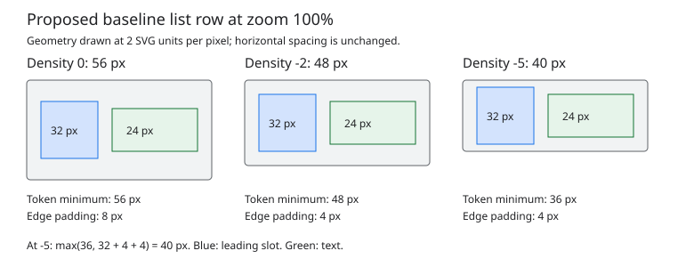

# Material 3 density

Status: partially implemented. Phases 1–4 (recursive refresh, component geometry,
public density, and the runtime example) and phases 6–7 (explicit list/row and
menu-chain overrides) are implemented and validated on the host. Rendering and
embedded resource acceptance remain proposed (phase 5).

## Objective

Add application-wide Material 3 density customization and explicit list/menu
overrides with predictable geometry, unchanged default rendering, and runtime
relayout.

## Motivation

A settings screen on a small controller display can spend much of its height on
whitespace inside fields and list rows. Applications currently select smaller
button variants or customize layouts individually. They cannot compact supported
Material components together while retaining the chosen typography and icons.

## Background

[The design glossary](../glossary.md) defines shared ownership, task, and transient
presentation terminology. The existing [component surface theme design](../implemented/material3_component_surface_theme_design.md)
places application-owned defaults in `Material3Theme`, borrowed through `Theme`.
The [theme declarations](../../../src/roo_windows/material3/theme.h) currently
contain colors, interaction layers, and component surface roles.

[Display scaling](../../../src/roo_windows/core/theme.h) uses `Scaled()` and
`ROO_WINDOWS_ZOOM` to translate authored dp dimensions into pixels. Density is
another input: it changes eligible whitespace before that translation. It does
not change display DPI, fonts, or icon asset selection.

Angular Material's [current M3 theming guidance](https://github.com/angular/components/blob/main/guides/theming.md#density)
(accessed 2026-10-06) documents levels 0 through -5, reducing eligible dimensions
by four units per step until component minimums apply. It excludes certain task
and popup components. This proposal adopts that scale as a reference and defines
Roo-specific mappings below; it does not claim identical geometry across Material
implementations or copy Angular's contextual behavior.

Current geometry is component-local: buttons have five size token sets, fields
have a 56 dp container, and lists have 56/72/88 dp minimum row bands. Standalone
checkboxes and radios already measure only their 18/20 dp glyphs. There is no
internal whitespace to remove from those controls.

`Widget::requestLayout()` requests work up the parent chain; it does not mark
all descendants. Static containers can skip children that have not requested
layout. Dynamic lists measure a non-attached prototype and retain row stride
and materialized rows. Repainting alone cannot update these geometries.

## Requirements

- Existing applications at the default setting retain their geometry and images.
- Applications can select one compactness level before construction or change it
  between completed UI frames without rebuilding firmware.
- Supported controls retain readable text, icons, labels, outlines, and content
  gaps at every level and display zoom.
- Natural dimensions, measurement, layout, paint, and hit testing agree after a
  change, including lists with recycled rows and detached content later attached.
- Explicit parent constraints remain authoritative. Application-authored margins,
  padding, and fixed dimensions remain under application control.
- Density resolution uses no ancestor lookup and allocates nothing during
  geometry resolution or painting. Explicit choices add compact storage only
  to participating list owners and their existing row context.
- Component participation, touch behavior, ownership, and runtime update
  responsibilities are documented rather than inferred from input hardware.

## Design Overview

**Density** is a one-byte enum with six named levels from 0 to -5.
Zero selects existing geometry; more negative values remove eligible whitespace.
One value lives in each application-owned `Material3Theme`. Geometry resolvers
read it live through the existing theme pointer, with no widget copies for buttons and fields. Lists and menus additionally
carry an optional override policy, described below.

**Eligible dimensions** are explicitly listed component tokens. Their authored
values decrease in dp, then pass through `Scaled()`. **Content floors** are
pixel-space lower bounds derived from actual text and icon metrics; they prevent
token reduction from clipping content. Density does not multiply entire widgets.

Initial support covers standard buttons, filled/outlined text fields, and
baseline/expressive list rows, including dynamic lists. Checkbox/radio glyphs
remain unchanged; surrounding list rows supply compact spacing. Other component
families keep existing geometry. This bounded scope avoids inventing mappings
for every Material component at once.

A new recursive layout request marks an entire subtree, including hidden
attached descendants. The application first changes its owned theme value, then
calls `requestLayoutDescending()` and `invalidateDescending()` on the display
root and any retained detached roots whose cached geometry must be refreshed.
These operations schedule work rather than painting synchronously. The root
selects the tree to refresh; it does not scope the shared density setting.
No theme event registry or density-change listener is introduced.

The shared value supplies application defaults; explicit token
rules preserve content and default compatibility. The subtree operation meets
the runtime requirement without forcing callers to know each component's caches.



The figure uses the one-line baseline row rule at zoom 100%, with a
24 px text block, a 32 px leading slot, and no application margins. It shows
requested row heights 56, 48, and 36 px; the last is raised to the 40 px content
floor. This illustrates the implemented geometry rule rather than raster output.

## Design Details

### Geometry rules

Let `d` be the signed integer value of a valid density enumerator. For an eligible total dimension authored as `b` dp,
resolve `max(min_dp, b + 4*d)` in dp, then scale. For symmetric edge padding
whose total participates in the same four-dp reduction, each edge resolves
`max(edge_min_dp, edge_base_dp + 2*d)`. Apply each rule to the tokens below;
never apply the reduction to every dimension found in a component.

After scaling, raise eligible heights to their component content floor. Perform
arithmetic in signed intermediates and clamp before narrowing to compact types.
Round using existing `Scaled()` behavior. At level zero preserve the existing
measurement and rounding path exactly; this includes current odd-pixel button
padding results and existing content that exceeds nominal tokens.

| Component | Eligible dp tokens | Content floor / preserved geometry |
| --- | --- | --- |
| Standard button, all five sizes | Selected token height minus 4 dp/step, dp floor 24 | Actual label/icon height plus `Scaled(4)` pixels on each vertical edge; horizontal padding, icon gap, icon size, and typography unchanged |
| Filled/outlined field | Container height 56 minus 4 dp/step, dp floor 36 | Reserve body and small-label line heights plus 4 dp per vertical edge for filled fields; outlined fields reserve body/icon height plus 4 dp per edge |
| Baseline list row | Band minimum 56/72/88 minus 4 dp/step, dp floor 36; vertical padding 8 minus 2 dp/step, floor 4 per edge | Tallest measured slot plus resolved padding; body gap, horizontal padding, slot gap, avatars, and text metrics unchanged |
| Expressive list row, standard/segmented | Same band minimum rule; vertical padding 10 minus 2 dp/step, floor 4 per edge | Same content floor; existing body gap, segment gap, separator thickness, and corner tokens preserved |
| Checkbox/radio | None | Glyph footprint, state layer, and artwork unchanged |

For button floors, reuse existing
content metrics and symmetric padding calculation, raising the target height
sufficiently to retain that per-edge minimum after integer rounding. Resolve
round shapes against actual dimensions; clamp square and pressed corner radii
to half the smaller measured dimension. Explicit tight constraints can still
clip content as they do today; floors govern natural/requested geometry.

For fields, use a state-independent floor so focus, editing, or floating-label
transitions never resize a field. Filled fields always reserve both text lines
and any larger icon height. Outlined fields retain the extra half-label height
above the container. Assistive text, its 4 dp gap, horizontal slots, notches,
and stroke widths retain existing rules. Measurement and `slots()` must use
one resolver for container height, including RTL and editor geometry.

For lists, compute the floor from the same measured slots used for layout,
including leading/trailing controls, avatars, multiline text, and custom content.
Only the row band participates; appended body content retains its spacing.
For the figure's single-line row at `d=-5`, padding is 4 dp per side, the reduced
minimum is 36 dp, and a 24 px block fits at 36 px. The illustrated 40 px floor
uses a **32 px leading slot**, which dominates the 24 px text block:
`max(36, 32 + 4 + 4) = 40`. The artwork identifies both blocks.

### Participation and popup behavior

Eligibility is defined by component family, not by attachment context. Standard
buttons and fields inside a dialog still follow the application setting. Dialog
chrome, calendar grids, navigation, tabs, switches, icon buttons,
progress indicators, badges, scaffold rulers, generic widgets, and Material 2
components remain unchanged in this scope. Internally reused eligible controls
also follow density, including date-picker numeric input. Full-screen text
extraction currently uses Material 2 editor controls, whose geometry stays
unchanged; the Material 3 source follows current density on return. No implicit
density reset occurs at a transient host. Menu rows have their own explicit
policy, defaulting to level zero as described below.

This explicit distinction avoids an ancestor search or hidden per-widget mode.
It differs from Angular's popup policy. Extending density to a new family requires
its own token and content-floor contract plus focused acceptance coverage.

### Touch targets

Compact layout footprints are also the exact hit rectangles. Preserve existing
sloppy-touch expansion, including the framework's current 50-pixel minimum and
exact-hit-before-sloppy dispatch order. Do not change that value to a density
or zoom-dependent token in this proposal. Overlapping expanded regions retain
existing sibling traversal precedence; do not create overlapping exact bounds.

There is no new promise of a 48 dp target or automatic pointer/touch mode.
Applications intended for touch keep level zero or provide adequate explicit
spacing. Parent-owned clickable rows retain their existing invocation routing;
checkbox/radio spacing must not introduce duplicate semantic activation.
Density never overrides application padding or margins to force a denser screen.

### Runtime relayout and caches

Add virtual `Widget::requestLayoutDescending()`, whose default calls
`requestLayout()`. `Container` calls it for every structural child, including
invisible/gone children, then requests its own layout. This parallels existing
`invalidateDescending()` and needs no RTTI or external child registry.

`ListLayout` overrides the operation to include its detached prototype and every
allocated pool row before delegating to container traversal. Duplicate visits
are harmless but avoid them where the pool and attached child sets overlap.
On the next measurement, remeasure the prototype and recompute row stride;
on layout, recompute the visible index range, row positions, and required pool
capacity using the new stride. No model reset or selection reset occurs.

List geometry retained by `List` and section layout is recomputed on measurement
and layout, not only when data changes. Preserve pixel scroll offset and clamp
it to the new content extent through existing scrolling behavior. The visible
logical item can change after compaction; preserving a logical scroll anchor is
outside this scope. Focus and selection remain associated with logical items;
newly materialized rows bind current visual context and read current density.

After changing density, the application calls `requestLayoutDescending()` then
`invalidateDescending()` on each affected root. Together these request new sizes
and positions and repaint the subtree, including controls whose appearance
changes without a bounds change. Existing layout damage handling must cover
pixels vacated by shrunken controls and cached rendering ancestors. All calls run on the application's UI thread between completed frames,
outside paint, layout, or list synchronization. Active gesture/animation policies
remain unchanged; subsequent dispatch uses the new completed layout.

The application mutates its owned Material theme, which widgets borrow as const.
Every application sharing that theme must refresh its own complete display tree;
refreshing a smaller subtree does not limit the setting to that subtree and can
leave siblings with stale geometry. Detached roots not explicitly refreshed are
safe on reattachment only when their
attachment path requests recursive layout; add that request to the relevant
attachment path rather than retain a density revision counter in every widget.
Custom widgets caching density-derived values participate by overriding the
recursive request and clearing their caches before the base implementation.

### Ownership, compatibility, and costs

Append default-initialized density storage after `components`, preserving aggregate
source initialization with omitted trailing fields. The library and application
must be rebuilt together. `ComponentTheme` stays its existing compact surface
contract; its 27-byte size assertion remains valid.

`Density` uses `int8_t` as its underlying type: one byte, alignment 1, no
private state, vtable, or heap ownership. The existing documented four-byte-aligned 956-byte Material theme is
expected to absorb this byte in trailing padding; verify actual host/target
sizes rather than promise ABI stability. `Theme` and `Widget` instance sizes
remain unchanged. Initial shared-density consumers had unchanged sizes; override
participant deltas are accounted for
in the explicit override contract. Adding a virtual method adds vtable entries,
not a second per-instance vptr.

Each geometry lookup adds a field load, signed addition, and minimum/maximum
operations: constant work independent of widget count and tree depth. No new
ancestor walk, persistent cache, allocation, or floating-point operation is needed.
Let `N` be structural widgets and `P` detached prototype/pool widgets reached by
one refresh. Requests take O(N + P) visits plus existing parent propagation.
With tree height `H`, the conservative worst bound including that propagation
is O((N + P)*H); ordinary attached paths coalesce once layout is requested.
Traversal uses O(H) call stack, with no new retained RAM. A typical settings
screen has tens of widgets; large dynamic lists visit allocated rows, not all
model items. Smaller strides can increase the existing row pool at layout time,
so runtime switching is not guaranteed allocation-free. Steady-state measure
resolution and paint retain their existing allocation contracts.

### Explicit list and menu density overrides

A compact device list can coexist with spacious action menus. `DensityOverride`
is a one-byte policy containing either **inherit the application setting** or an
explicit `Density`, including level zero. Inheritance is a distinct state; zero
must remain available to pin a component to its original geometry. Invalid
explicit enum casts assert in debug and become explicit level zero in release,
never accidentally selecting inheritance.

`List` defaults to inheritance. It stores one policy and supplies that policy in
`ListEntryVisualContext` to static rows, dynamic prototypes, and recycled rows.
Rows resolve inheritance live against their theme; the owner never snapshots the
shared value. A standalone `ListEntry` also defaults to inheritance and exposes
an override setter that updates its existing context. Once a row belongs to a
list or menu, the owner supplies its policy; per-item exceptions are outside this
scope. A row setter is intended for standalone rows, including those attached to
generic containers. Embedded slot controls retain their own density behavior:
the row policy compacts only row whitespace, not its descendant subtree.

`MenuPolicy` defaults to **explicit level zero**. The same policy governs the
root panel and every submenu; callers can explicitly select inheritance. Bare
`MenuEntry` rows also default to explicit zero. This corrects a current mismatch:
menus are documented as density-independent, but their `ListEntry` substrate
currently reads shared density before imposing a fixed menu height minimum.
Default menus under a compact shared theme will now retain level-zero geometry.

Menu rows reuse the 56/72/88 dp list band and variant-specific vertical padding
rules, preserving existing level-zero geometry. The authored menu minimum
(48 dp baseline, 56 dp expressive) decreases by 4 dp per step with a 28 dp floor
and enters the same band resolver, before content floors and parent constraints.
The larger list band still dominates ordinary rows. Owner-painted trailing
content contributes to the content floor: actual shortcut line height, icon and
check/arrow token height, and the badge's 24 dp reserved lane height. Each has
resolved vertical padding on both edges. Measurement and layout use the same
resolver; there is no fixed-height post-measure clamp to defeat compaction.
At zero, preserve legacy geometry, including legacy adornment placement.
Panel padding, group gaps, separators, corner radii, width tokens, and icon/text
metrics remain unchanged. The existing list figure illustrates the shared band
and content-floor rule; menus additionally include the trailing lane in that floor.

List/standalone-row setters and clear operations schedule recursive layout and
repaint on the affected subtree, on the UI thread between frames. The list first
propagates its policy, then requests recursive layout so detached prototype and
pool caches also refresh. Newly bound rows receive current owner policy.
Existing logical focus, selection, pixel scroll offset, and clamp rules apply.
`Menu::setPolicy()` keeps its existing closed-menu-only contract; configuring
an active menu is invalid. On the next admission, policy reaches the root and
all subsequently constructed submenus. Shared-theme mutation still requires
explicit refresh on every affected root, including open menus that inherit.
The menu overlay remeasures requested panels and lays out requested descendants
within their allocated presentation bounds. Reopening or reanchoring recomputes
the root panel placement; density refresh alone preserves those bounds.

Resolution is O(1): a policy test and the existing validated enum resolver, with
no parent traversal, registry, revision counter, or hot-path allocation. Payload
cost is one byte in `List`, one in `ListEntryVisualContext` (already stored in
every row), and one in `MenuPolicy`. Alignment can increase instance sizes by
more than one byte; measure host deltas and record them when completing phase 7.
`Widget`, `Theme`, and `Material3Theme` gain no override storage. Family-wide
settings and arbitrary subtree inheritance remain out of scope.

Host measurements (GCC, 64-bit pointers) compare the pre-extension headers at
`83a6c88a` with the completed extension using the same size-probe compiler
arguments; private menu state uses the existing `ROO_WINDOWS_MENU_ABI_PROBE`
symbols. The [menu size probe](../../../benchmarks/material3_menu_size_probe.cpp)
now includes list/context and base/theme symbols. New bytes fit existing widget
padding on this ABI; this is not a promise for embedded ABIs.

| Type | Before (bytes) | After (bytes) |
| --- | ---: | ---: |
| `ListEntryVisualContext` | 12 | 13 |
| `MenuPolicy` | 5 | 6 |
| `List` / `ListEntry` | 128 / 128 | 128 / 128 |
| `MenuEntry` / `MenuPanel` | 152 / 368 | 152 / 368 |
| `Menu` / `MenuOverlay` | 24 / 80 | 24 / 80 |
| Private `Menu::Impl` / row adornments / item trailing payload | 648 / 72 / 56 | 648 / 72 / 56 |
| `Widget` / `Theme` / `Material3Theme` | 40 / 240 / 956 | 40 / 240 / 956 |

Phase 5 still owns embedded flash/data and ABI measurements, reviewed compact
raster goldens, and physical touch acceptance. Passing the existing default menu
goldens does not complete that separate acceptance phase.


## Proposed API

Add `material3/density.h`; the completed public surface is:

```cpp
enum class Density : int8_t {
  kDefault = 0,
  kMinus1 = -1,
  kMinus2 = -2,
  kMinus3 = -3,
  kMinus4 = -4,
  kMinus5 = -5,
};

struct Material3Theme {
  ColorScheme color;
  StateLayerTheme state;
  ComponentTheme components{};
  Density density = Density::kDefault;
};
```

Public framework declarations add `virtual void requestLayoutDescending()` to
`Widget`, with overrides on `Container` and `ListLayout`. Token resolvers remain
component-local. Both recursive invalidation overloads are public on `Widget`
and `Container`; `MainWindow` additionally registers display damage and schedules
a frame. Applications use invalidation alongside the new layout request directly;
no density-specific refresh function is added.
No public arbitrary-dimension adjustment helper invites blanket shrinking.

The override extension adds the following surface (illustrative declarations):

```cpp
class DensityOverride {
 public:
  constexpr DensityOverride();  // Inherit the application setting.
  static constexpr DensityOverride Explicit(Density density);
  constexpr bool isInherited() const;
  constexpr Density resolve(Density application_density) const;
 private:
  Density density_;  // One byte; validated explicit levels or inheritance.
};

// List and standalone ListEntry:
void setDensity(Density density);
void clearDensityOverride();
DensityOverride densityOverride() const;

// Trailing fields in existing aggregate policy/context structs:
// ListEntryVisualContext: DensityOverride density{};
// MenuPolicy: DensityOverride density =
//     DensityOverride::Explicit(Density::kDefault);

list.setDensity(Density::kMinus3);
list.clearDensityOverride();
MenuPolicy menu_policy;
menu_policy.density = DensityOverride::Explicit(Density::kMinus2);
menu.setPolicy(menu_policy);  // While closed; includes subsequent submenus.
```

Application-owned storage setup and a settings callback:

```cpp
// Long-lived application storage, initialized before Application/widgets.
material3::Material3Theme material = DefaultTheme().material3Theme();
Theme theme{material3::MakeFrameworkTheme(material), &material};
// Pass theme through the existing Environment/Application setup.

// On the UI thread, between frames:
const auto next = material3::Density::kMinus2;
if (next != material.density) {
  material.density = next;
  app.root().requestLayoutDescending();
  app.root().invalidateDescending();
  // Refresh retained detached roots as well when they cache geometry.
}
```

A copied `Theme` alone still borrows the original Material object. Mutating the
shared default or borrowing a temporary is invalid. Density updates require no
palette, interaction-layer, or framework-color rebuild.

Publish the density field only with all initial component consumers. Earlier
commits add internal geometry helpers and tests; there is no accepted-but-ignored
public density configuration. The recursive request is immediately functional
when introduced.

Named enumerators configure concrete density levels; `DensityOverride` adds
only an inheritance choice, with no public integer-conversion helper. Applications validate persisted or external
integers against the range [-5, 0] before casting, and retain their current setting
on invalid input. An internal resolver checks the enum's underlying value before
using it in arithmetic: invalid values assert in debug builds and resolve as
`kDefault` in release builds. This handles accidental invalid casts consistently
without adding a second public configuration API.

## Implementation Plan

Authoring references: [C++ guidance](../../../.github/instructions/general-cpp-code-authoring-instructions.md),
[widget guidance](../../../.github/instructions/roo-windows-widget-authoring.instructions.md),
and [example guidance](../../../.github/instructions/embedded-example-authoring.instructions.md).
Each phase is one commit. Run checks from the canonical `roo_windows` repository
using its [Bazel setup](../../../BUILD) and [target baseline](../../material3_target_baseline.md).

### Phase 1: Recursive layout refresh

Implemented: `Widget::requestLayoutDescending()`, structural container traversal,
virtual-list prototype/pool refresh, and recursive refresh on attachment. The
public method documents its UI-thread scheduling and repaint lifecycle.
`layout_refresh_test` covers static containers, invisible/gone children, detached
roots, nested cached measurements, stride changes, pool growth, and recycling.

Implement recursive requests, detached prototype/pool participation, and safe
reattachment. Add focused coverage with a static container, gone child, detached
root, and fixed-stride virtual list. Document the generic method's lifecycle.

Commit: `Add recursive subtree layout requests including virtual-list storage`.

Validation: focused container/list tests prove changed descendant natural sizes
are remeasured, offscreen rows are correct after recycling, and stale stride does
not survive; existing ownership and attachment tests pass.

### Phase 2: Internal button and field geometry

Implemented: component-local pure resolvers accept signed levels [-5, 0] for
button padding and field container/slot geometry. Button corners clamp to actual
dimensions. Phase 4 now supplies the live public theme density to these paths.
[Geometry tests](../../../test/material3_density_geometry_test.cpp) cover all
levels with independent pixel expectations at 75/100/150/200% zoom, actual content
floors, float-state stability, oversized icons, RTL, and tight constraints.
The zero-level button path intentionally retains legacy byte-token scaling,
including the existing extra-large height narrowing at 200% zoom. Compact levels
scale signed intermediates before narrowing.

Factor pure internal resolvers accepting a valid signed level without exposing a
public theme field. Implement button and field rules, rounding, content floors,
and radius limits. Existing production paths pass zero until phase 4. Add token
and slot geometry tests across all six levels and supported zooms. Update the
button/field design documents to link this proposal's pending density contract.

Commit: `Prepare density-aware button and text-field geometry resolvers`.

Validation: focused button/text-field geometry tests, tight constraints, floating
labels, RTL, multiline assistive text, icons, and unchanged zero-density goldens.

### Phase 3: Internal list geometry

Implemented: internal level-parameterized band, measured-slot, and placement
resolvers serve baseline and expressive rows. Appended bodies retain their gap
and original bottom padding. Phase 4 now supplies live theme density. Compact
text floors measure attached text slots at the final column width, while level zero retains its
legacy descriptor budget. List section geometry continues to remeasure on every
measurement/layout pass; no density cache or per-widget state was added.
Virtual-pool growth preserves the ring's live bindings and focused surviving
rows instead of releasing all rows. [Focused tests](../../../test/material3_list_density_geometry_test.cpp)
cover all levels, tall/multiline/margined slots, body placement, mixed sections,
wrapped pool growth, selection/focus, recycled rows, and pixel scroll clamping.

Add level-parameterized row resolvers for baseline/expressive variants, custom
slots, and appended bodies. Verify `List` recomputes retained section geometry;
update dynamic-list stride/visible-range handling where phase 1 exposes stale
assumptions. Keep production level zero. Update list design cross-references.

Commit: `Prepare density-aware list bands and virtual row geometry`.

Validation: focused list/dynamic-list tests with tall slots, multiline labels,
selection, focus, shrinking/growing stride, and scroll clamping. Zero-level
images and default row heights remain unchanged.

### Phase 4: Public density and runtime example

Implemented: the signed one-byte `Density` enum and defaulted trailing theme
field are read live by standard buttons, filled/outlined fields, and
baseline/expressive rows. Invalid casts assert in debug builds and use default
geometry with `NDEBUG`. Compact rows wrap their measured content rather than
forcing their cheap descriptor estimate as an exact height. Display-root
recursive invalidation registers damage, including when allocated bounds stay
unchanged; both full and regional public overloads are covered.

The [runtime example](../../../examples/material3/theme/density/density.ino)
owns its mutable theme and applies all six levels to a settings form and dynamic
radio section. Its application helper validates external integers before casting
and issues both recursive refresh calls. Build it with
`bazel build //examples/material3/theme/density:density`; run that same target
with `bazel run` for interactive use.

[Integration tests](../../../test/material3_density_test.cpp) exercise live
0 -> -2 -> -5 -> 0 changes, enum/default and external-input validation, real
bounds/hits and vacated pixels, retained/recycled row focus and selection,
scroll clamping, dialogs, in-place editing, extracted-editor return, and reused
date-picker numeric input. Run the test with `--copt=-DNDEBUG` as well to check
release fallback through production consumers.

Full-screen text extraction currently uses Material 2 editor controls. Its
geometry stays unchanged; the Material 3 source reads current density on return.
In-place Material 3 fields and date-picker numeric input do follow density.
Dialog chrome and date-picker calendar/chrome keep their existing geometry;
reused Material 3 action buttons and fields follow the shared theme.

Add the `Density` enum, explicit default theme field, internal enum validation,
live consumer reads, and documentation of the two runtime refresh calls together.
Add a build-covered `examples/material3/theme/density` screen
with selectable levels, buttons, fields, checkbox/radio list rows, and a dynamic
section. Keep the existing radio-group teaching example independent. Document
owned theme setup, popup participation, touch policy, and detached root refresh.

Commit: `Expose application-wide Material 3 density and explicit runtime refresh`.

Validation: integration fixture changes 0 -> -2 -> -5 -> 0 without reconstruction,
checks exact hit bounds and vacated pixels, handles open dialog/editor controls,
recycles offscreen rows, and preserves logical focus/selection. Test all named levels and explicit default initialization. Invalid enum casts
assert in debug builds and resolve to default geometry in release builds; the
example rejects invalid external integers before changing its configuration. Build the example in the repo's host setup.

### Phase 5: Rendering and resource acceptance

Add reviewed density goldens, zoom builds at 75/100/150/200%, light/dark RGB565
coverage, and an ESP32-C3 example size comparison at levels zero and -2. Record
actual theme/widget sizes and linked flash/data deltas in the target baseline.
Measure retained virtual-list pool capacity before and after compaction. Document
physical touchscreen results separately from host acceptance.

Commit: `Record Material density rendering and embedded resource acceptance`.

Validation/exit criteria: all supported families obey their floors, level-zero
legacy images pass, base widget sizes are unchanged (override participant
deltas are documented), shared density payload is one byte, and geometry/paint add no new allocations. Report actual flash delta and
pool growth rather than inventing a zero-cost claim. Mark implemented only after
these checks pass; growth beyond the documented override costs or new paint
allocations blocks acceptance.

### Phase 6: Explicit list and standalone-row overrides

Implemented: validated one-byte policy, standalone setters, static/dynamic
owner propagation, automatic subtree refresh, and the runtime example. The
focused override suite passes in debug and with `--copt=-DNDEBUG`; existing
density, list-density geometry, and list suites pass. The runtime example builds.

Add validated `DensityOverride`, list setters, and row-context propagation.
Use one resolved policy for suggested minimums, preferred sizes, measurement,
and layout. Refresh static/dynamic rows and detached geometry automatically.
Extend the runtime density example with a list pinned to a chosen density and
an interaction restoring application inheritance.

Proposed commit message: `Material 3 density phase 6: add explicit list and row overrides`.

Add `DensityOverride` and owner-supplied row policy to the density design's public
API, with automatic subtree refresh and a runtime example.

Validation: focused public tests for inheritance versus explicit zero, all six
levels, invalid casts in debug/release, standalone rows, sibling isolation,
mixed static/dynamic lists, prototype stride, pool recycling, selection/focus,
and restoration to inheritance. Run existing density/list geometry suites and
build the example. Format changed C++ with the repository configuration.

### Phase 7: Explicit menu-chain overrides and completion status

Implemented: closed-menu policy reaches the root and every submenu, default
menus retain explicit zero, and compact menus use shared band/content-floor
resolution and actual shortcut line-height clips. The overlay refreshes requested
panels and rows within retained presentation bounds. The nested-settings example
shows one compact policy for the entire chain.

Validation completed: `material3_density_override_test` and `material3_menu_test`
pass in debug and with `--copt=-DNDEBUG`. Existing menu row, geometry, and golden
suites pass; density integration/geometry, list/list-density geometry, and
recursive-layout suites pass. Focused menu and pure shared-band tests pass at
75/100/150/200% zoom. Both modified examples build. Changed library translation
units compile with `-fno-exceptions -fno-rtti`; changed C++ files are formatted.


Add the trailing menu policy field, default independent menu rows to zero, and
propagate policy to root/submenu rows. Integrate menu height tokens and trailing
adornment content floors into the shared row resolver used for measure/layout.
Demonstrate menu density in a maintained menu example. Record measured host
instance-size deltas and final validation, then update this document's status.

Proposed commit message: `Material 3 density phase 7: add explicit menu-chain overrides`.

Extend the density design to menu chains with independent defaults, shared row
geometry, trailing content floors, tests, and an example.

Validation: all levels and both variants, default independence from shared density,
explicit inheritance, submenu propagation, tall content and trailing adornments,
closed-menu policy changes/reopening, exact parent constraints, and existing menu
goldens. Run focused debug/release tests and supported zoom builds, build changed
examples, and measure host size deltas. Embedded/raster acceptance from phase 5
remains pending and must not be labeled completed by this extension.

## Testing Plan

Extend existing button, field, list, dynamic-list, container, and ownership suites
in the leaf Bazel workspace. Add focused enum/default/fallback checks and integrated runtime
coverage rather than a second implementation mirrored in tests. Use independent
expected geometry and actual rendered/hit-tested results.

Coverage combines default compatibility, content floors, all density levels and
zooms, variant behavior, runtime lifecycle, virtualized storage, and embedded
resource checks. Golden review establishes readable text, state layers, outlines,
and field labels; host tests establish touch routing. Physical device checks
assess compact touch usability without claiming host tests certify it.

## Caveats

The four-unit scale is Material-inspired; the Roo mappings and popup participation
are explicit library policy. Nonzero density changes layout and can move focused
items on screen. Exact parent sizes and application margins can limit savings.
Applications must notify every affected live/detached root after shared mutation.
The initial component scope deliberately leaves navigation and other controls at
their existing geometry, and a smaller virtual-row stride can retain more rows.

### Rejected Alternatives

#### Compile-time-only density

Keeps token calculations constant and requires no refresh operation, but cannot
support a user settings screen. The one-byte shared value and constant-time
resolvers provide runtime support without new widget state.

#### Global scaling or shrinking fonts/icons

Makes every element smaller and is already partly available through zoom. It
changes readability, asset choice, and unrelated geometry. Eligible whitespace
rules provide the compactness required here while retaining content metrics.

#### General subtree and component-family overrides

Explicit list/menu owners solve the demonstrated mixed-density screen. General
subtree inheritance adds contextual lookup and detached-row semantics; family-wide
theme defaults add another precedence layer. Neither is required for these
consumers. Keep the owner policy plus application fallback as the complete
precedence rule.

#### Preserve a large layout footprint around every compact control

Maintains generous exact touch targets but removes much of the space saving.
This design retains existing sloppy expansion and lets application layout choose
spacing, with no new accessibility-size guarantee.

#### Automatic notifications and per-widget revision counters

Reduce caller responsibilities but require registrations or repeated revision
checks and cache invalidation rules across detached widgets. Explicit subtree
refresh reuses structural traversal and adds no persistent instance state.

#### Implicit popup density reset

Matches some other implementations but requires contextual inheritance and can
make a field change size merely on attachment. Component-family eligibility is
stable and documented; popup chrome remains outside the initial scope.

## Future Work

- Component-family defaults and arbitrary scoped density for additional consumers.
- Reviewed mappings for additional controls and navigation families.
- A separate theme mutation/notification contract covering colors and geometry.
- Input-mode-specific target policy and logical scroll-anchor preservation.
