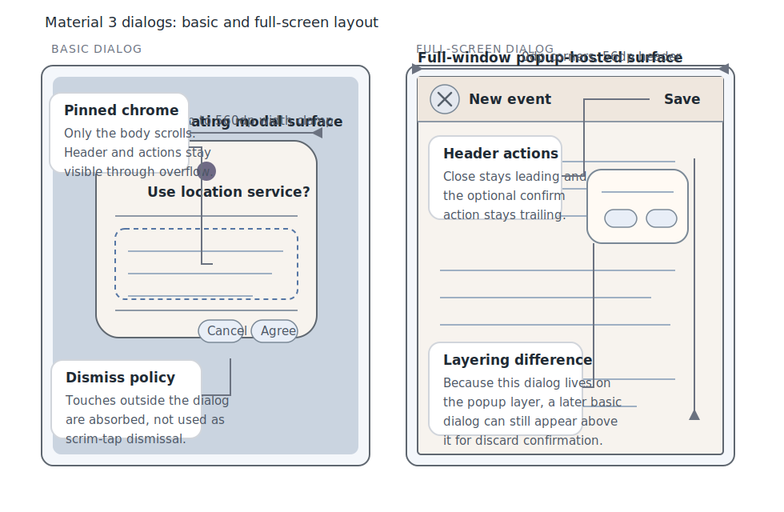

# Roo Windows Material 3 Dialogs Design

## Implementation status

**Proposed.** None of the defined scope is implemented. The status of existing and outstanding prerequisites is recorded in the [status index](../README.md).

## Objective

Add a Material Design 3 dialog family to `roo_windows` that fits the current
embedded-first framework and closes the gap between the repo's legacy dialog
support and its newer Material 3 component set.

The design provides:

- a centered basic dialog surface for alerts, confirmations, blocking errors,
  and short picker-style interactions,
- an `AlertDialog` convenience wrapper for the common headline plus supporting-
  text case,
- a full-screen dialog surface for compact-window task flows and short wizard
  sequences,
- generic caller-owned body content with pinned header and action chrome,
- modal and focus behavior that reuse the current dialog, popup, and scrim
  layering,
- and a storage model that keeps per-instance RAM bounded by fixed action-slot
  storage instead of dynamic button arrays or per-action callbacks.

The result is a Material 3 dialog family that can host the common
interruptive surfaces the roadmap calls out without inventing a second modal
subsystem or reopening the framework's layering model.

## Motivation

`roo_windows` already has a legacy modal dialog scaffold, but it does not yet
have a Material 3 dialog family.

The gap is visible in three places:

1. [src/roo_windows/dialogs/dialog.h](../../../src/roo_windows/dialogs/dialog.h)
   provides one centered scaffold with a legacy shape, a dynamic footer-button
   vector, and no distinction between basic and full-screen variants.
2. [material3_sheets_design.md](material3_sheets_design.md) and
   [material3_snackbar_design.md](material3_snackbar_design.md) already cover
   the neighboring interruption surfaces, so dialogs are now the most obvious
   missing part of the Material 3 interruption story.
3. [material3_roadmap.md](../../material3_roadmap.md) explicitly calls out
   confirmations, destructive actions, blocking errors, and short wizard flows
   as a missing design track.

The library therefore needs a dialog design that is implementation-grounded,
uses the existing layering seams, and is explicit about where full-screen flows
belong.

## Background

### Current Starting Point in `roo_windows`

The current dialog surface is the legacy `roo_windows::Dialog` family under
[src/roo_windows/dialogs/](../../../src/roo_windows/dialogs/).

The relevant existing seams are:

- [src/roo_windows/core/application.h](../../../src/roo_windows/core/application.h)
  and [src/roo_windows/core/main_window.cpp](../../../src/roo_windows/core/main_window.cpp),
  which already expose one modal dialog slot above popups and regular tasks,
- [src/roo_windows/widgets/scrim.h](../../../src/roo_windows/widgets/scrim.h),
  which already provides the overlay-backed scrim widget used by the modal
  dialog path,
- [src/roo_windows/dialogs/dialog.h](../../../src/roo_windows/dialogs/dialog.h),
  which already provides a title area, a scrollable content area, and a footer
  button row,
- [src/roo_windows/dialogs/alert_dialog.h](../../../src/roo_windows/dialogs/alert_dialog.h)
  and [src/roo_windows/dialogs/radio_list_dialog.h](../../../src/roo_windows/dialogs/radio_list_dialog.h),
  which show the two common current usage patterns,
- [src/roo_windows/containers/scrollable_panel.h](../../../src/roo_windows/containers/scrollable_panel.h),
  which already provides `SimpleScrollablePanel` for generic vertical
  scrolling,
- [src/roo_windows/material3/button/button.h](../../../src/roo_windows/material3/button/button.h),
  which already provides the Material 3 text-button implementation needed for
  dialog actions,
- and [material3_icon_buttons_design.md](material3_icon_buttons_design.md),
  which exists as a design note but has no landed implementation yet.

Those seams constrain the dialog design directly.

First, the current modal dialog slot is already the correct host for centered
basic dialogs. It attaches a `Scrim`, centers the surface, and blocks lower
layers.

Second, the current host supports only one active modal dialog. That matters
because Material 3 full-screen dialogs are the only dialogs over which another
basic dialog may appear. A full-screen dialog therefore cannot simply reuse the
same singular centered-dialog slot.

Third, the legacy `Dialog` scaffold is not a good surface to restyle in place.
It currently stores a `std::vector<SimpleButton>` plus a per-instance
`std::function` callback, which pushes RAM and ownership policy into the base
widget in a way that the newer Material 3 component families avoid.

Fourth, full-screen dialog chrome cannot depend on a public `material3::IconButton`
yet because that widget family is not implemented in source.

### Material 3 Signals

This document is aligned against the current Material 3 dialog documentation:

- [Overview](https://m3.material.io/components/dialogs/overview)
- [Specs](https://m3.material.io/components/dialogs/specs)
- [Guidelines](https://m3.material.io/components/dialogs/guidelines)

The strongest current signals are:

1. Material 3 defines two dialog variants: basic and full-screen.
2. Dialogs block the underlying application until they are confirmed,
   dismissed, or the required action is completed.
3. Basic dialogs use a centered container with a `28dp` corner radius, `24dp`
   content padding, and width clamped between `280dp` and `560dp`.
4. Full-screen dialogs use a `0dp` corner radius, a `56dp` header region, and
   a close affordance rather than a centered floating container.
5. Dialog actions are capped at two buttons.
6. A one-action basic dialog may only use an acknowledgement action.
7. A two-action basic dialog must provide one dismissive action and one
   confirming action.
8. Confirming actions stay nearest the logical trailing edge, and when actions
   stack vertically the confirm action appears above the dismissive action.
9. When dialog content scrolls, the header and actions remain pinned while only
   the body scrolls.
10. Full-screen dialogs are intended for compact windows and are the only
    dialogs over which a later basic dialog may appear.

Material also allows custom-positioned basic dialogs on larger screens, but
that positioning freedom is not required for the first embedded dialog landing.

### Local Design References

The most relevant local references are:

- [material3_sheets_design.md](material3_sheets_design.md)
- [material3_snackbar_design.md](material3_snackbar_design.md)
- [non_touch_input_design.md](../implemented/non_touch_input_design.md)
- [material3_icon_buttons_design.md](material3_icon_buttons_design.md)
- [embedded-design-doc-authoring.instructions.md](../../../.github/instructions/embedded-design-doc-authoring.instructions.md)
- [roo-windows-widget-authoring.instructions.md](../../../.github/instructions/roo-windows-widget-authoring.instructions.md)

Those references close six local decisions:

1. basic dialogs should reuse the existing modal dialog slot and `Scrim`,
2. full-screen dialogs should use the popup layer rather than the singular
   centered-dialog slot,
3. dialog bodies should reuse `SimpleScrollablePanel` instead of introducing a
   dialog-local scroller,
4. action buttons should reuse the landed Material 3 text-button
   implementation,
5. the full-screen close affordance must be dialog-local rather than a public
   dependency on an unimplemented icon-button family,
6. and keyboard focus must follow the layering rules already defined in
   [non_touch_input_design.md](../implemented/non_touch_input_design.md): basic dialogs first,
   then focus-capturing popups, then regular tasks.

## Requirements

### Functional Requirements

1. Support a centered Material 3 basic dialog surface with optional icon,
   optional headline, generic body content, and one or two actions.
2. Support an alert-dialog convenience wrapper for the common headline plus
   supporting-text case.
3. Support a full-screen dialog surface with close affordance, optional confirm
   action, and generic body content.
4. Keep header and action chrome pinned while dialog body content scrolls.
5. Support showing a basic dialog above a full-screen dialog.
6. Reuse the existing scrim, popup, and modal layering primitives instead of
   adding a second dialog subsystem.
7. Reuse the existing Material 3 text-button implementation for dialog actions.
8. Keep the current legacy dialog family available during migration.

### Interaction Requirements

1. Basic dialogs must block interaction with all lower layers.
2. Touches outside a basic dialog must be absorbed rather than dismissing the
   dialog.
3. Basic dialogs must support at most two actions.
4. Single-action basic dialogs must use an acknowledgement action only.
5. Two-action basic dialogs must use one dismissive action and one confirming
   action.
6. Confirming actions may be disabled; dismissive and acknowledgement actions
   remain enabled.
7. Back and Escape must dismiss the active basic dialog once the shared key
   routing from [non_touch_input_design.md](../implemented/non_touch_input_design.md) is in
   code.
8. Full-screen dialog close button, Back, and Escape must request dismissal.
9. Full-screen dialog confirm action must be able to veto close so validation
   and discard-confirm flows can keep the dialog open.
10. Focus must remain inside the active dialog scope.

Basic and full-screen Material 3 dialog presenters must use the root
interactive-transient slot defined by the
[Back request coordination design](../in_progress/application_navigation_back_behavior_design.md).
They register as Back- and Escape-dismissible, vacate the slot before invoking
dismissal completion, and do not introduce a dialog-local Back dispatcher.

### API Requirements

1. Add the Material 3 dialog family under
   `src/roo_windows/material3/dialog/`.
2. Expose separate public types for centered basic dialogs and full-screen
   dialogs rather than one enum-configured mega-widget.
3. Keep action descriptors borrowed and fixed-capacity rather than heap-owned.
4. Avoid new per-action `std::function` storage on the base dialog widgets.
5. Avoid a required public dependency on `material3::IconButton` for the
   full-screen close affordance.
6. Keep host integration close to the existing `Application::showDialog()` /
   `clearDialog()` naming.
7. Define explicit behavior when callers attempt unsupported host states such
   as stacking a second full-screen dialog.

### Memory and Allocation Requirements

1. Do not allocate on paint, scroll, key dispatch, or action-state updates.
2. Keep action storage to fixed slots and packed flags rather than vectors.
3. Keep scrim ownership and popup-host state off the base dialog widgets.
4. Add pointer-size-aware size-budget assertions for the new public dialog
   types.
5. Keep the base dialog family generic and avoid storing alert-only strings,
   picker-only models, or callback wrappers on every dialog instance.

## Design Overview

The Material 3 dialog family has three public surfaces and two internal shared
pieces:

1. `material3::BasicDialog` is the centered floating dialog surface.
2. `material3::AlertDialog` is the common basic-dialog convenience wrapper for
   headline plus supporting text.
3. `material3::FullScreenDialog` is the compact-window full-screen dialog
   surface.
4. An internal `DialogScaffoldBase` owns the pinned-chrome layout, shared body
   scroller, token resolution, and conditional divider behavior used by both
   public variants.
5. An internal `DialogActionStrip` owns the fixed one-or-two-action model for
   basic dialogs.

The core architectural decisions are:

- basic dialogs use the existing modal dialog slot and `Scrim`,
- full-screen dialogs use a full-window focus-capturing popup host instead of
  the singular modal-dialog slot,
- the body content is always caller-owned `WidgetRef` content rather than a
  dialog-family-specific item model,
- basic and full-screen variants stay separate public types because their host
  semantics, chrome, and action policy differ materially,
- full-screen dialog close and confirm handling use virtual request hooks rather
  than per-instance callback fields,
- and the first landing does not animate the scrim or add custom-positioned
  basic dialogs.



## Design Details

### Scope Boundary

This design lands the reusable dialog family itself. It does not attempt to
land every higher-level dialog specialization at once.

In scope:

- centered basic dialogs,
- an alert-dialog convenience wrapper,
- full-screen dialogs,
- generic caller-owned body content,
- fixed-capacity action-role modeling,
- and host integration for a basic dialog above a full-screen dialog.

Out of scope:

- date-picker, time-picker, and other picker-specific wrappers,
- automatic variant switching between full-screen and basic dialogs by size
  class,
- custom-positioned basic dialogs on wide layouts,
- animated container-transform transitions,
- and mass migration of every existing legacy dialog call site.

Those exclusions keep the first Material 3 dialog landing narrow and focused on
the actual missing family rather than on every dialog-like workflow at once.

### Shared Surface Substrate

`DialogScaffoldBase` is an internal `Container` subclass shared by
`BasicDialog` and `FullScreenDialog`.

It owns:

- one optional icon pointer,
- one optional headline text widget,
- one caller-provided body `WidgetRef`,
- one vertical `SimpleScrollablePanel`,
- two optional divider bands that appear only when the body is clipped at the
  corresponding edge,
- and one small packed chrome-state field.

The shared substrate performs four jobs that are identical across both public
variants:

1. it resolves container, text, and divider colors from the active theme,
2. it pins the header and action chrome outside the scrollable body region,
3. it centralizes body-scroll clipping and divider visibility updates,
4. and it exposes one consistent preferred-focus seam for the later non-touch
   input work.

The body content stays intentionally generic. The base family does not store a
supporting-text string, a list model, or a form policy object. `AlertDialog`
builds the simple headline plus supporting-text case on top of the generic body
slot, and picker-style dialogs compose their own widgets into the same slot.

That choice is deliberate:

1. Material basic dialogs can host alerts, simple lists, date pickers, and time
   pickers,
2. `roo_windows` already prefers composable widgets over one-off item APIs,
3. and keeping the body generic avoids pushing alert-specific RAM cost onto
   every dialog instance.

### Host Integration

The dialog family uses two existing layering seams rather than inventing a new
modal stack.

`BasicDialog` is hosted by the modal dialog path in
[src/roo_windows/core/main_window.cpp](../../../src/roo_windows/core/main_window.cpp).
That path already attaches a `Scrim`, centers the child surface, and makes the
dialog the top-most interactive layer.

`FullScreenDialog` is hosted as one full-window popup child or popup task with
focus-capture semantics from [non_touch_input_design.md](../implemented/non_touch_input_design.md).
This split is the most important architectural decision in the design.

A full-screen dialog fills the whole window, so it does not need a scrim.
More importantly, Material explicitly allows a basic dialog to appear above a
full-screen dialog for flows such as discard confirmation or a general error
that occurs while the user is editing. Reusing the singular centered-dialog slot
for the full-screen variant would block that flow.

The resulting z-order is:

1. regular tasks,
2. focus-capturing popups such as a full-screen dialog,
3. centered basic modal dialogs.

The host rules are closed as follows:

1. zero or one full-screen dialog may be active,
2. zero or one centered basic dialog may be active,
3. a centered basic dialog may appear while a full-screen dialog is active,
4. a full-screen dialog may not appear while a centered basic dialog is active,
5. and `clearDialog()` clears the centered basic dialog first, otherwise the
   full-screen dialog, otherwise no-ops.

Attempting to show a second full-screen dialog is a programmer error. The host
should `CHECK` that no full-screen dialog is already active before attaching a
new one.

### BasicDialog

#### Geometry and Layout

`BasicDialog` is a centered floating surface with a clamped width.

Its horizontal layout is:

$$
m_{edge}(W) =
\begin{cases}
24dp, & W \le 600dp \\
56dp, & W > 600dp
\end{cases}
$$

$$
w_{basic} = \min(560dp, W - 2m_{edge}(W))
$$

The measured body width may be smaller than that clamp, but the dialog must not
shrink below `280dp` unless the host itself is narrower than `280dp + 2m_edge`.
In that degenerate case, the dialog takes the full available width after the
required edge margins rather than overflowing.

The dialog is centered:

$$
x_{basic} = \frac{W - w_{basic}}{2}
$$

$$
h_{basic} = \min(h_{measured}, H - 2m_{edge}(W))
$$

$$
y_{basic} = \frac{H - h_{basic}}{2}
$$

The dialog uses these token-backed geometry decisions:

- container shape: `28dp` corner radius,
- container color: `theme.color.surfaceContainerHigh`,
- headline color: `theme.color.onSurface`,
- supporting and body text defaults: `theme.color.onSurfaceVariant`,
- optional icon color: `theme.color.secondary`,
- action text and interaction layer color: `theme.color.primary`,
- outer scrim: the shared `Scrim` color already used by the modal dialog host,
- inner padding: `24dp`,
- icon-to-headline and headline-to-body spacing: `16dp`,
- button gap: `8dp`.

When an icon is present, the icon and headline block is centered. Without an
icon, the headline is start-aligned. The headline may wrap to a second line;
anything beyond that is truncated rather than forcing the dialog wider.

Only the body scrolls. The header and action strip stay pinned. When the body
is clipped at the top or bottom edge, the corresponding divider appears; when
that edge is fully visible again, the divider disappears.

#### Action Strip

The basic dialog action strip is fixed-capacity and validates its role model at
construction.

Supported shapes are:

- one acknowledgement action,
- or one dismissive plus one confirming action.

Anything else is invalid and should `CHECK` immediately.

Buttons use `material3::Button` with the text-button variant. The dismissive
button is visually placed before the confirming button in LTR, and mirrored in
RTL so the confirming action stays nearest the logical trailing edge.

If the two buttons do not fit side by side at the available width, the strip
switches to a vertical layout. In that fallback, the confirming action appears
above the dismissive action, matching Material guidance.

Confirm actions may be disabled. Dismissive and acknowledgement actions remain
enabled.

#### Dismissal and Focus

Basic dialogs are deliberately strict.

- Outside taps are absorbed and do not dismiss the dialog.
- There is no scrim-tap dismissal path.
- An enabled action always closes the dialog.
- Back and Escape dismiss the dialog with a typed dismiss reason once the
  shared key-routing path exists.

Preferred initial focus follows the ordering already described in
[non_touch_input_design.md](../implemented/non_touch_input_design.md): previously focused
descendant if still valid, then an explicit preferred focus child, then the
first focusable descendant.

For basic dialogs, the preferred-focus choice is:

1. a body descendant explicitly returned by the dialog,
2. otherwise the first focusable body descendant,
3. otherwise the first enabled action,
4. otherwise the dialog root itself.

This keeps selection dialogs and forms focused on their working area first,
while simple acknowledgement dialogs still land on the button.

### FullScreenDialog

#### Host and Layout Model

`FullScreenDialog` is a full-window popup-hosted surface rather than a centered
floating dialog.

It covers the host bounds directly:

$$
w_{full} = W
$$

$$
h_{full} = H
$$

The container uses a `0dp` corner radius and `theme.color.surfaceContainerHigh`
as its background. There is no scrim because the dialog itself fully replaces
the underlying view.

The surface has three visible bands:

1. a `56dp` header,
2. an optional divider under the header,
3. a scrollable body that fills the remaining height.

The header contains:

- a leading close affordance,
- an optional short title,
- and an optional trailing confirming text action.

The close affordance uses a private dialog-local icon-action widget with a
`24dp` glyph and a `48dp` effective touch target. It is not a public
`material3::IconButton` dependency. Once a public icon-button implementation
lands, the internal close-affordance widget may be swapped out without any API
change.

The confirming action stays in the header rather than in a second bottom action
bar. That keeps the compact full-screen surface narrower in scope, matches the
current Material anatomy with a header text action, and avoids spending another
`56dp` of vertical space on the smallest displays.

Long or variable-length explanatory titles do not belong in the header. When a
title does not fit comfortably beside the close and confirm controls, the
header keeps a short title and the longer explanation moves into the body.

#### Request-Veto Model

Unlike `BasicDialog`, the full-screen variant cannot auto-close on every user
gesture. It needs to support unsaved edits, inline validation, and discard
confirmation.

The full-screen request model is therefore:

1. close button, Back, and Escape call `onDismissRequested(reason)`,
2. if that hook returns `true`, the host removes the full-screen dialog and
   then calls `onDismissed(reason)`,
3. if that hook returns `false`, the full-screen dialog remains visible,
4. the confirm action calls `onConfirmRequested(action_id)`,
5. if that hook returns `true`, the host closes the dialog and then calls
   `onConfirmed(action_id)`,
6. if that hook returns `false`, the dialog stays open.

This is the key reason the full-screen surface uses request hooks instead of a
basic-dialog-style auto-close callback. It lets a flow do all of the following
without per-instance callback storage:

- reject confirm while a required field is invalid,
- show inline errors and keep editing,
- intercept a close request,
- and show a centered basic dialog above the full-screen dialog asking whether
  unsaved edits should be discarded.

#### Focus and Overlay Behavior

The full-screen dialog host is a focus-capturing popup scope as defined by
[non_touch_input_design.md](../implemented/non_touch_input_design.md).

That choice has three benefits:

1. it blocks the regular task beneath the dialog,
2. it still allows a centered modal basic dialog above the full-screen dialog,
3. and it keeps menus and other popup-local surfaces inside the full-screen
   flow on the popup layer rather than trying to tunnel through the centered
   dialog slot.

Before the shared non-touch input work lands in code, the full-screen popup
host still behaves correctly for touch because it owns the full window. The
focus-capture policy becomes relevant only once the shared focus manager and key
dispatcher exist.

### Action and Result Semantics

The dialog family uses role-based action descriptors.

`DialogActionRole` has three values:

- `kAcknowledge`,
- `kDismiss`,
- `kConfirm`.

`BasicDialog` validates that its action array is one acknowledgement or one
dismiss plus one confirm. `FullScreenDialog` does not use that same one-or-two
button strip. It exposes one optional confirming action in the header, while
dismissal is handled by the close affordance and key-routing path.

Non-action dismissal uses a separate `DialogDismissReason` enum with these
values:

- `kBack`,
- `kEscape`,
- `kCloseButton`,
- `kProgrammatic`.

The result ordering is intentionally different between the two public variants:

1. `BasicDialog` closes first and then reports the action or dismiss reason.
   That keeps caller code from running while the floating modal surface is still
   attached.
2. `FullScreenDialog` asks permission first and only closes if the request hook
   accepts the action.

That split matches the product expectations. Basic dialogs are interruptive and
decisive. Full-screen dialogs are mini task flows.

### RAM Impact

Dialogs are not a high-multiplicity surface like list items, but the embedded
RAM rules still apply.

The chosen storage model keeps the per-instance cost bounded as follows:

- `BasicDialog` pays for one shared scaffold, one `SimpleScrollablePanel`, one
  fixed-capacity action strip, one optional icon pointer, and a small chrome
  state field.
- `AlertDialog` adds one `TextBlock` in the body slot and no extra action
  policy.
- `FullScreenDialog` reuses the same scaffold and adds one small close-
  affordance widget plus one optional confirming action descriptor.
- Host-owned modal state, scrim ownership, and popup-layer integration stay on
  `MainWindow` rather than on every dialog instance.

The design explicitly does not store:

- a `std::vector` of buttons,
- a per-instance `std::function` callback on the base widgets,
- a second scroller,
- or a general appearance object pointer.

That is the right tradeoff here. The repo only ever shows one centered basic
dialog and one full-screen dialog at a time, but the base classes still need to
avoid speculative RAM cost.

### Repaint and Invalidation Consequences

The dialog family keeps repaint rules local and predictable.

For centered basic dialogs:

1. showing or hiding the dialog requires one full-window pass to blit or clear
   the scrim,
2. body scrolling invalidates only the body clip plus any divider band whose
   visibility changed,
3. button hover, focus, or pressed state invalidates only the relevant button
   bounds,
4. and there is no per-frame scrim fade animation.

For full-screen dialogs:

1. showing or hiding the dialog invalidates the full window once because the
   dialog surface itself covers the window,
2. body scrolling remains local to the scrollable body region,
3. the close affordance invalidates only its own bounds,
4. and a later centered basic dialog above the full-screen dialog reuses the
   existing modal scrim path without any full-screen-dialog-specific repaint
   machinery.

The first landing does not add enter or exit motion. That is deliberate. Motion
tokens are still a broader theme-system task, and animating the scrim or a
scale transform would add large-area invalidation before the component family
itself exists.

## Proposed API

```cpp
namespace roo_windows::material3 {

enum class DialogActionRole : uint8_t {
  kAcknowledge,
  kDismiss,
  kConfirm,
};

enum class DialogDismissReason : uint8_t {
  kBack,
  kEscape,
  kCloseButton,
  kProgrammatic,
};

struct DialogActionSpec {
  uint8_t id;
  roo::string_view label;
  DialogActionRole role;
  bool enabled = true;
};

class BasicDialog : public Container {
 public:
  BasicDialog(ApplicationContext& context, WidgetRef body,
              const DialogActionSpec* actions, uint8_t action_count);

  void setIcon(const roo_display::MonoIcon* icon);
  void clearIcon();
  void setHeadline(roo::string_view headline);
  void setBody(WidgetRef body);
  void setActionEnabled(uint8_t action_id, bool enabled);

 protected:
  virtual Widget* preferredFocusChild();
  virtual void onActionInvoked(uint8_t action_id, DialogActionRole role) {}
  virtual void onDismissed(DialogDismissReason reason) {}
};

class AlertDialog : public BasicDialog {
 public:
  AlertDialog(ApplicationContext& context, roo::string_view headline,
              roo::string_view supporting_text,
              const DialogActionSpec* actions, uint8_t action_count);

  void setSupportingText(roo::string_view supporting_text);
};

class FullScreenDialog : public Container {
 public:
  FullScreenDialog(ApplicationContext& context, WidgetRef body);

  void setHeaderTitle(roo::string_view title);
  void clearHeaderTitle();
  void setBody(WidgetRef body);
  void setConfirmAction(const DialogActionSpec& action);
  void clearConfirmAction();

 protected:
  virtual Widget* preferredFocusChild();
  virtual bool onDismissRequested(DialogDismissReason reason) { return true; }
  virtual bool onConfirmRequested(uint8_t action_id) { return true; }
  virtual void onDismissed(DialogDismissReason reason) {}
  virtual void onConfirmed(uint8_t action_id) {}
};

}  // namespace roo_windows::material3

namespace roo_windows {

class Application {
 public:
  void showDialog(material3::BasicDialog& dialog);
  void showDialog(material3::FullScreenDialog& dialog);
  void clearDialog();
};

}  // namespace roo_windows
```

API notes:

1. `BasicDialog` action arrays are borrowed and validated immediately. Invalid
   one-or-two-action combinations `CHECK`.
2. `showDialog(material3::FullScreenDialog&)` `CHECK`s that no centered basic
   dialog or second full-screen dialog is active.
3. `clearDialog()` clears the top-most active dialog scope: centered basic
   first, otherwise full-screen.
4. The existing callback-based legacy dialog APIs remain unchanged during
   migration. If a callback convenience overload is added later for the
   Material 3 family, the callback storage belongs on the host, not on the base
   dialog widgets.

## Implementation Plan

Authoring reference: follow the local
[embedded C++ code authoring instruction](../../../.github/instructions/embedded-cpp-code-authoring.instructions.md)
and the
[roo_windows widget authoring instruction](../../../.github/instructions/roo-windows-widget-authoring.instructions.md).

### Phase 1: Shared Scaffold and Host Support

Code slice:

1. Add `src/roo_windows/material3/dialog/` with `DialogActionSpec`,
   `DialogScaffoldBase`, `DialogActionStrip`, the private close-affordance
   widget, and size-budget helpers.
2. Extend the dialog host so `Application` / `MainWindow` can manage one
   centered basic dialog plus one popup-hosted full-screen dialog, and make
   `clearDialog()` clear the top-most active dialog scope.
3. Add `test/material3_dialog_test.cpp` coverage for action-role validation,
   host-state validation, and size-budget assertions.

Proposed commit message:

> Material 3 dialogs: add shared scaffold and host support

Validation: run `bazel test //:material3_dialog_test`.

### Phase 2: Basic Dialog Family

Code slice:

1. Add `BasicDialog` and `AlertDialog`.
2. Implement centered geometry, width clamping, pinned header and action strip,
   scroll-triggered divider visibility, Material 3 token resolution, and
   action-strip ordering plus vertical stacking fallback.
3. Expand `material3_dialog_test` with dismissal reasons, RTL ordering, and
   action-enable behavior, and add `test/material3_dialog_golden_test.cpp`
   coverage for icon versus no-icon layout, horizontal versus stacked actions,
   and width clamping.
4. Add `examples/material3/dialogs/dialogs.ino` showing alert and choice-style
   basic dialogs.

Proposed commit message:

> Material 3 dialogs: add basic dialog family

Validation: run `bazel test //:material3_dialog_test //:material3_dialog_golden_test`.

### Phase 3: Full-Screen Dialog Family

Code slice:

1. Add `FullScreenDialog` and its popup-hosted full-window wrapper.
2. Implement the private close affordance, header confirm action, request-veto
   hooks, and the host path that allows a centered basic dialog above an active
   full-screen dialog.
3. Expand dialog tests with close-veto coverage, confirm-accept versus
   confirm-reject coverage, and host stacking coverage for a centered basic
   dialog above a full-screen dialog.
4. Update `examples/material3/dialogs/dialogs.ino` with one compact wizard
   flow that triggers a discard-confirm basic dialog from the full-screen
   dialog.

Proposed commit message:

> Material 3 dialogs: add full-screen dialog family

Validation: run `bazel test //:material3_dialog_test //:material3_dialog_golden_test`.

## Testing Plan

Validation coverage for the full dialog family should include:

1. `//:material3_dialog_test` coverage for action-role validation, host-state
   validation, dismissal reasons, confirm-veto behavior, and top-most
   `clearDialog()` semantics.
2. `//:material3_dialog_golden_test` coverage for centered basic-dialog width
   clamping, icon versus no-icon alignment, action-strip stacking fallback,
   divider appearance at body clipping edges, and full-screen header geometry.
3. Size-budget assertions for `BasicDialog`, `AlertDialog`, and
   `FullScreenDialog`.
4. Example-sketch compilation for `examples/material3/dialogs/dialogs.ino` in
   the normal example workflow.
5. Once the shared non-touch-input work lands, focused key-routing coverage for
   Back, Escape, preferred initial focus, and focus restoration after dialog
   dismissal.

## Caveats

The chosen design lands the Material 3 dialog family without trying to erase
the legacy dialog APIs in the same change set.

That is the right first step, but it does have visible consequences:

1. the repo temporarily carries both the legacy `roo_windows::Dialog` family
   and the new `roo_windows::material3` dialog family,
2. full-screen dialogs do not auto-adapt to centered basic dialogs on larger
   screens in the first landing,
3. centered basic dialogs remain default-centered and do not yet expose the
   custom-positioning flexibility Material allows on larger displays,
4. and the first landing does not include motion transitions.

### Rejected Alternatives

#### Restyle the existing `roo_windows::Dialog` scaffold in place

Rejected in [Current Starting Point in `roo_windows`](#current-starting-point-in-roo_windows)
and [Host Integration](#host-integration). The legacy scaffold bakes in a
dynamic button vector, a per-instance callback, and a single centered-host
model. Material 3 needs a separate full-screen route and a tighter action
policy, so a quiet in-place restyle would hide the real architectural change.

#### Put full-screen dialogs on the singular modal-dialog slot

Rejected in [Host Integration](#host-integration) and
[FullScreenDialog](#fullscreendialog). Material explicitly allows a later basic
dialog to appear above a full-screen dialog. Reusing the singular centered-
dialog slot for the full-screen variant would block discard-confirm and
error-over-edit flows.

#### Expose one public `Dialog` type with presentation enums

Rejected in [Design Overview](#design-overview), [BasicDialog](#basicdialog),
and [FullScreenDialog](#fullscreendialog). The centered basic and full-screen
variants differ in host layer, action policy, dismissal behavior, and chrome.
One enum-configured mega-widget would force every instance to carry irrelevant
state and would make the API harder to understand.

#### Dismiss centered basic dialogs on scrim tap

Rejected in [BasicDialog](#basicdialog). Dialogs are the highest-priority,
most interruptive decision surface in the current Material 3 family. Scrim-tap
dismissal is appropriate for sheets; it is the wrong default for destructive
actions, blocking errors, and confirmation requests.

#### Depend on a public `material3::IconButton` before landing dialogs

Rejected in [Current Starting Point in `roo_windows`](#current-starting-point-in-roo_windows)
and [FullScreenDialog](#fullscreendialog). The repo has an icon-button design
doc but no implementation. Making dialogs wait for that family would block a
more urgent interruption surface on an unrelated dependency.

#### Add a second pinned bottom action bar to the full-screen dialog

Rejected in [FullScreenDialog](#fullscreendialog). The Material full-screen
dialog anatomy already includes a header text action, and a second pinned bottom
action bar would spend another `56dp` of vertical space on the smallest screens
without unlocking a required workflow.

## Future Work

Intentional follow-ons that stay out of this design:

1. adaptive wrappers that switch a shared dialog model between centered basic
   and full-screen presentation based on window size,
2. custom-positioned basic dialogs on larger screens,
3. migration of legacy `AlertDialog` and `RadioListDialog` callers onto the new
   Material 3 scaffolds,
4. enter and exit motion once the broader Material 3 motion-token story lands,
5. picker-specific wrappers such as date and time dialogs once those component
   families are designed.
