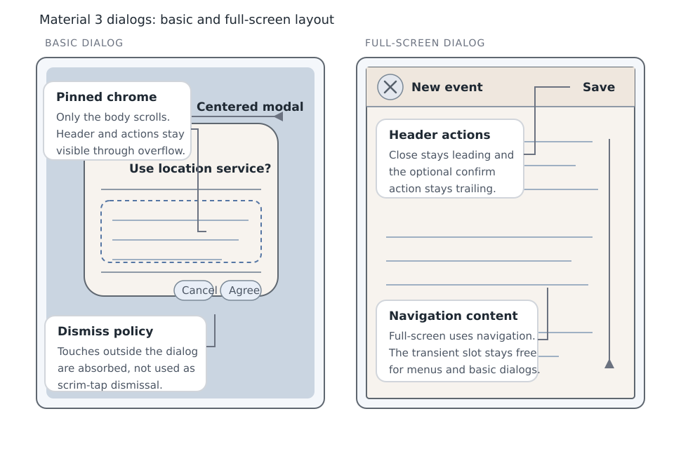

# Roo Windows Material 3 Dialogs Design

## Objective

Add centered basic, alert, and full-screen Material Design 3 dialogs to
`roo_windows`, integrated with the embedded framework's shared transient
presentation architecture.

## Motivation

`roo_windows` already has a legacy modal dialog scaffold, but it does not yet
have a Material 3 dialog family.

The gap is visible in three places:

1. [src/roo_windows/dialogs/dialog.h](../../../src/roo_windows/dialogs/dialog.h)
   provides one centered scaffold with a legacy shape, a dynamic footer-button
   vector, and no distinction between basic and full-screen variants.
2. [material3_sheets_design.md](material3_sheets_design.md) and
   [material3_snackbar_design.md](material3_snackbar_design.md) already cover
   the neighboring interruption surfaces, so dialogs are now the most obvious
   missing part of the Material 3 interruption story.
3. [material3_roadmap.md](../../material3_roadmap.md) explicitly calls out
   confirmations, destructive actions, blocking errors, and short wizard flows
   as a missing design track.

The library therefore needs a dialog design that is implementation-grounded,
uses the reviewed shared-host seam, and is explicit about where full-screen
flows belong.

## Background

**Status: Proposed; host architecture reconciled by P1.6a.** None of the
dialog-family scope is implemented. The shared transient host is the P1.6b
prerequisite for dialog presentation. The status of other prerequisites is
recorded in the [status index](../README.md).

### Current Starting Point in `roo_windows`

The current dialog surface is the legacy `roo_windows::Dialog` family under
[src/roo_windows/dialogs/](../../../src/roo_windows/dialogs/).

The relevant existing seams are:

- [src/roo_windows/core/application.h](../../../src/roo_windows/core/application.h)
  and [src/roo_windows/core/main_window.cpp](../../../src/roo_windows/core/main_window.cpp),
  which expose the legacy modal dialog path above popups and regular tasks,
- [src/roo_windows/widgets/scrim.h](../../../src/roo_windows/widgets/scrim.h),
  which already provides the overlay-backed scrim widget used by the modal
  dialog path,
- [src/roo_windows/dialogs/dialog.h](../../../src/roo_windows/dialogs/dialog.h),
  which already provides a title area, a scrollable content area, and a footer
  button row,
- [src/roo_windows/dialogs/alert_dialog.h](../../../src/roo_windows/dialogs/alert_dialog.h)
  and [src/roo_windows/dialogs/radio_list_dialog.h](../../../src/roo_windows/dialogs/radio_list_dialog.h),
  which show the two common current usage patterns,
- [src/roo_windows/containers/scrollable_panel.h](../../../src/roo_windows/containers/scrollable_panel.h),
  which already provides `SimpleScrollablePanel` for generic vertical
  scrolling,
- [src/roo_windows/material3/button/button.h](../../../src/roo_windows/material3/button/button.h),
  which already provides the Material 3 text-button implementation needed for
  dialog actions,
- [material3_icon_buttons_design.md](../implemented/material3_icon_buttons_design.md),
  whose implementation can supply the full-screen close affordance,
- and [transient_surface_host_design.md](transient_surface_host_design.md),
  which defines one display-wide transient host layer with an explicit
  interaction owner.

Those seams constrain the dialog design directly.

First, the current visual behavior is correct for centered basic dialogs, but
its dialog-specific attachment is not the path for new Material 3 dialogs.
P1.6b lands the shared-host prerequisites without structurally migrating legacy
`Dialog`.
New Material 3 dialogs adopt the host in P1.8: its combined layer borrows the
root, selects barrier paint independently, activates the presenter-owned focus
scope, and blocks lower layers.

Second, the reviewed framework intentionally supports one root interactive
transient per window. Basic and full-screen dialogs therefore use the same host
admission authority and do not stack. Material's basic-over-full-screen
allowance is deferred until a concrete use case justifies a bounded
nested-transient design.

Third, the legacy `Dialog` scaffold is not a good surface to restyle in place.
It currently stores a `std::vector<SimpleButton>` plus a per-instance
`std::function` callback, which pushes RAM and ownership policy into the base
widget in a way that the newer Material 3 component families avoid.

Fourth, the Material 3 icon-button family is now implemented, so full-screen
dialog chrome reuses it rather than carrying a private substitute.

### Material 3 Signals

This document is aligned against the current Material 3 dialog documentation:

- [Overview](https://m3.material.io/components/dialogs/overview)
- [Specs](https://m3.material.io/components/dialogs/specs)
- [Guidelines](https://m3.material.io/components/dialogs/guidelines)

The strongest current signals are:

1. Material 3 defines two dialog variants: basic and full-screen.
2. Dialogs block the underlying application until they are confirmed,
   dismissed, or the required action is completed.
3. Basic dialogs use a centered container with a `28dp` corner radius, `24dp`
   content padding, and width clamped between `280dp` and `560dp`.
4. Full-screen dialogs use a `0dp` corner radius, a `56dp` header region, and
   a close affordance rather than a centered floating container.
5. Dialog actions are capped at two buttons.
6. A one-action basic dialog may only use an acknowledgement action.
7. A two-action basic dialog must provide one dismissive action and one
   confirming action.
8. Confirming actions stay nearest the logical trailing edge, and when actions
   stack vertically the confirm action appears above the dismissive action.
9. When dialog content scrolls, the header and actions remain pinned while only
   the body scrolls.
10. Full-screen dialogs are intended for compact windows. Material permits a
    later basic dialog above them, but the initial Roo Windows implementation
    deliberately defers that stacking behavior to preserve the one-root
    transient contract.

Material also allows custom-positioned basic dialogs on larger screens, but
that positioning freedom is not required for the first embedded dialog landing.

### Local Design References

The most relevant local references are:

- [material3_sheets_design.md](material3_sheets_design.md)
- [material3_snackbar_design.md](material3_snackbar_design.md)
- [non_touch_input_design.md](../implemented/non_touch_input_design.md)
- [material3_icon_buttons_design.md](../implemented/material3_icon_buttons_design.md)
- [embedded-design-doc-authoring.instructions.md](../../../.github/instructions/embedded-design-doc-authoring.instructions.md)
- [roo-windows-widget-authoring.instructions.md](../../../.github/instructions/roo-windows-widget-authoring.instructions.md)

Those references close six local decisions:

1. both variants use the shared transient host with display coverage,
   outside absorption, and reject-if-busy admission, while basic dialogs select
   scrim barrier paint and full-screen dialogs select transparent barrier paint,
2. the component must explicitly supply the existing task that owns focus,
   physical keys, Back context, and teardown,
3. dialog bodies reuse `SimpleScrollablePanel` instead of introducing a
   dialog-local scroller,
4. action buttons reuse the landed Material 3 text-button
   implementation,
5. the full-screen close affordance reuses the implemented
   `material3::IconButton`,
6. and keyboard focus must use the explicit interaction owner's `FocusManager`
   and the shared host's active scope.

## Requirements

### Functional Requirements

1. Support a centered Material 3 basic dialog surface with optional icon,
   optional headline, generic body content, and one or two actions.
2. Support an alert-dialog convenience wrapper for the common headline plus
   supporting-text case.
3. Support a full-screen dialog surface with close affordance, optional confirm
   action, and generic body content.
4. Keep header and action chrome pinned while dialog body content scrolls.
5. Use one root transient host admission; basic and full-screen dialogs do not
   coexist.
6. Reuse the shared transient host and existing scrim paint instead of adding a
   dialog-specific or full-screen host.
7. Reuse the existing Material 3 text-button implementation for dialog actions.
8. Keep the current legacy dialog family available during migration.
9. Preserve a reusable dialog's configured body state across dismissal and
   reopen; replacing the body ends the old borrow or adoption explicitly.

### Interaction Requirements

1. Basic dialogs must block interaction with all lower layers.
2. Touches outside a basic dialog must be absorbed rather than dismissing the
   dialog.
3. Basic dialogs must support at most two actions.
4. Single-action basic dialogs must use an acknowledgement action only.
5. Two-action basic dialogs must use one dismissive action and one confirming
   action.
6. Confirming actions may be disabled; dismissive and acknowledgement actions
   remain enabled.
7. Back and Escape must dismiss the active basic dialog through the shared key
   routing from
   [non_touch_input_design.md](../implemented/non_touch_input_design.md).
8. Full-screen dialog close button, Back, and Escape must request dismissal.
9. Full-screen dialog confirm action must be able to veto close so validation
   and discard-confirm flows can keep the dialog open.
10. Focus must remain inside the active dialog scope.
11. Every show operation must receive one attached interaction-owning task;
    the host must not infer it from focus or z-order.
12. Semantic software input must reach an active text editor inside the dialog
    and must not reach an underlying owner or non-owner editor while displayed.
13. Logical leading, trailing, and action order must use an explicit dialog
    layout direction rather than an inferred task or widget property.

Basic and full-screen Material 3 dialog presenters must use the root
interactive-transient slot defined by the
[Back request coordination design](../implemented/application_navigation_back_behavior_design.md).
Both make Back and Escape eligible for delivery and do not introduce a
dialog-local Back dispatcher. A basic dialog finishes automatically. A
full-screen dialog consumes the request but remains active when its dismissal
hook vetoes it; an accepted request vacates the slot before completion.

### API Requirements

1. Add the Material 3 dialog family under
   `src/roo_windows/material3/dialog/`.
2. Expose separate public types for centered basic dialogs and full-screen
   dialogs rather than one enum-configured mega-widget.
3. Copy at most two action descriptors into fixed-capacity slots; the text
   referenced by their labels remains borrowed.
4. Avoid new per-action `std::function` storage on the base dialog widgets.
5. Reuse `material3::IconButton` for the full-screen close affordance.
6. Put `show(Task&)` and `dismiss()` on the component presenters; application-
   level compatibility forwarding is not part of the final API.
7. Return the shared host's explicit busy/unavailable result for unsupported
   host states rather than asserting on normal runtime contention.
8. Expose an explicit `LayoutDirection` on each public dialog presenter and
   default it to left-to-right.

### Memory and Allocation Requirements

1. Do not allocate on paint, scroll, key dispatch, or action-state updates.
2. Keep action storage to fixed slots and packed flags rather than vectors.
3. Keep scrim ownership and shared-host state off the base dialog widgets.
4. Add pointer-size-aware size-budget assertions for the new public dialog
   types.
5. Keep the base dialog family generic and avoid storing alert-only strings,
   picker-only models, or callback wrappers on every dialog instance.
6. Reuse the existing owning `TextBlock` for wrapping headline, supporting
   prose, and full-screen title text. Construction, text setters, and
   measurement may allocate; show, dismissal, paint, scroll, key dispatch, and
   action-state updates do not allocate for text ownership.

## Design Overview

The Material 3 dialog family has three public surfaces and three internal
support pieces:

1. `material3::BasicDialog` is the centered floating dialog surface.
2. `material3::AlertDialog` is the common basic-dialog convenience wrapper for
   headline plus supporting text.
3. `material3::FullScreenDialog` is the compact-window full-screen dialog
   surface.
4. An internal `DialogScaffoldBase` owns the pinned-chrome layout, shared body
   scroller, token resolution, and conditional divider behavior used by both
   public variants.
5. An internal `DialogActionStrip` owns the fixed one-or-two-action model for
   basic dialogs.
6. An internal `AlertDialogBodyStorage` base owns alert supporting text and is
   ordered before the privately inherited `BasicDialog` implementation base.

The core architectural decisions are:

- both variants use display coverage, outside absorption, and reject-if-busy
  admission in the one shared host,
- basic dialogs request scrim barrier paint while full-screen dialogs request a
  transparent input barrier,
- every presentation explicitly supplies an existing interaction-owner task,
- basic and full-screen variants are mutually exclusive in the root transient
  slot,
- the generic body slot accepts a `WidgetRef` at configuration boundaries
  rather than a dialog-family-specific item model; `AlertDialog` fills that
  slot with its internal supporting-text widget,
- basic and full-screen variants stay separate public types because their host
  semantics, chrome, and action policy differ materially,
- full-screen dialog close and confirm handling use virtual request hooks rather
  than per-instance callback fields,
- each variant stores an explicit `LayoutDirection`, defaulting to left-to-right,
  because the framework does not inherit writing direction through `Widget` or
  `Task`,
- and the first landing does not animate the scrim or add custom-positioned
  basic dialogs.

The major pieces satisfy the requirements as follows:

| Solution element | Requirement connection |
| --- | --- |
| shared host plus explicit surface profiles | enforces one-root admission, lower-layer isolation, busy results, and common teardown |
| explicit `Task` and presenter-owned `FocusScope` | supplies the required focus, key, Back, editor, and owner-lifetime context |
| `DialogScaffoldBase` plus `SimpleScrollablePanel` | keeps caller-provided body content generic while pinning header and action chrome |
| persistent attached body child and ordered alert body-storage base | preserves configured form state across dismissal while keeping borrow, adoption, and destruction order explicit |
| existing owning `TextBlock` for wrapping prose | avoids a second multiline widget/storage policy and makes call-local headline/supporting strings safe |
| fixed `DialogActionStrip` and virtual request hooks | enforces action roles and veto semantics without dynamic arrays or per-action callbacks |
| explicit `LayoutDirection` | resolves logical placement without an unavailable inherited direction |



## Design Details

### Scope Boundary

This design lands the reusable dialog family itself. It does not attempt to
land every higher-level dialog specialization at once.

In scope:

- centered basic dialogs,
- an alert-dialog convenience wrapper,
- full-screen dialogs,
- generic caller-provided body content,
- fixed-capacity action-role modeling,
- and integration with the shared host's one-slot and explicit-owner contract.

Out of scope:

- date-picker, time-picker, and other picker-specific wrappers,
- automatic variant switching between full-screen and basic dialogs by size
  class,
- custom-positioned basic dialogs on wide layouts,
- animated container-transform transitions,
- and mass migration of every existing legacy dialog call site.

Those exclusions keep the first Material 3 dialog landing narrow and focused on
the actual missing family rather than on every dialog-like workflow at once.

### Shared Surface Substrate

`DialogScaffoldBase` is an internal `Container` subclass shared by
`BasicDialog` and `FullScreenDialog`.

It owns:

- one optional icon pointer,
- one title `TextBlock`, used as the basic-dialog headline or full-screen
  header title and hidden when its owned string is empty,
- one raw pointer to the attached caller-provided body child,
- one vertical `SimpleScrollablePanel`,
- two raw slots for borrowed, derived-owned chrome widgets,
- two optional divider bands that appear only when the body is clipped at the
  corresponding edge,
- and one small packed chrome-state field.

The shared substrate performs four jobs that are identical across both public
variants:

1. it resolves container, text, and divider colors from the active theme,
2. it pins the header and action chrome outside the scrollable body region,
3. it centralizes body-scroll clipping and divider visibility updates,
4. and it exposes body and action descendants in a deterministic focus-traversal
   order.

The body content stays intentionally generic. The base family does not store a
supporting-text string, a list model, or a form policy object. `AlertDialog`
builds the simple headline plus supporting-text case on top of the generic body
slot, and picker-style dialogs compose their own widgets into the same slot.
`WidgetRef(Widget&)` keeps body ownership with the caller, while a `WidgetRef`
constructed from `std::unique_ptr` transfers ownership to the dialog's child
tree. `setBody()` follows the same rule and detaches the previous body before
attaching its replacement. `WidgetRef` exists only at those transfer
boundaries; after attachment, the scaffold stores the raw child pointer and
`Widget::isOwnedByParent()` remains the sole ownership record.

The derived chrome slots solve a different lifetime problem. `BasicDialog`
attaches its inline action strip through the primary slot. `FullScreenDialog`
attaches its inline close and confirm controls through the primary and
secondary slots. Each derived destructor calls the scaffold's callback-free
pre-destruction seam, which closes an active registration and detaches these
borrowed chrome widgets and the body before inline or externally borrowed
storage can be destroyed. The scaffold then detaches its base-owned title and
scroll infrastructure in its base destructor. A further subclass that installs
an inline body calls the same protected seam at the start of its destructor;
the built-in `AlertDialog` obtains the equivalent ordering through its first
storage base.

The body is persistent dialog configuration, not presentation-session state.
Dismissal detaches the complete dialog root from the transient host but leaves
the body attached inside the dialog subtree, allowing the same dialog instance
to reopen with its form state and remembered focus. A borrowed body must remain
live until `setBody()` replaces it or the dialog is destroyed. An adopted body
is deleted at that same endpoint rather than when a presentation finishes.

`AlertDialog` supplies its own supporting `TextBlock` through the base-from-
member idiom. Private `internal::AlertDialogBodyStorage` is its first base and
constructs that widget; private `BasicDialog` is its second base and receives a
borrowed `WidgetRef` to the already-live widget. Destruction runs in reverse:
`BasicDialog` and its container tree detach the borrowed body before the storage
base destroys the `TextBlock`. The base-from-member structure adds no separate
heap object or body pointer; the existing `TextBlock` can still allocate for
its owned string and line-layout cache. Private inheritance prevents callers
from upcasting to `BasicDialog` and replacing the fixed body; `AlertDialog`
re-exposes the applicable presenter operations but not `setBody()`, so
`setSupportingText()` always addresses its installed internal body.

That choice is deliberate:

1. Material basic dialogs can host alerts, simple lists, date pickers, and time
   pickers,
2. `roo_windows` already prefers composable widgets over one-off item APIs,
3. and keeping the body generic avoids pushing alert-specific RAM cost onto
   every dialog instance.

### Host Integration

Both variants use the
[shared transient host](transient_surface_host_design.md) with display coverage,
outside absorption, `kRejectIfBusy`, and a presenter-owned `FocusScope`.
Barrier paint is independent: `BasicDialog` requests the scrim, while
`FullScreenDialog` requests a transparent input barrier because its opaque root
already fills the display. `show(Task&)` supplies the existing task whose focus
manager, physical-key route, Back context, and lifetime govern the dialog. The
host derives the receiving window from that task and validates the owner before
touching its admission state.

For `BasicDialog`, the borrowed hosted root is the centered surface and the
combined host layer paints the scrim across the display. For
`FullScreenDialog`, the borrowed root fills the display and the transparent
host layer still isolates input. In both cases the layer resolves task-scoped
services through the explicitly supplied interaction owner.

The one-active-presentation host makes its rules simple:

1. either one basic dialog or one full-screen dialog may be active;
2. any second root transient returns `kHostBusy` without changing the active
   presentation;
3. Back and Escape use the shared registration; basic dialogs finish, while a
   full-screen dialog finishes only after its request hook accepts dismissal;
4. owner, presenter, and window teardown use the shared idempotent ordering;
5. no `Application::showDialog()` or `clearDialog()` API participates in the
   final Material 3 path.

Material's optional basic-above-full-screen behavior is intentionally not
implemented. A full-screen workflow handles discard confirmation inline or
finishes and opens a basic dialog from post-detach completion. Supporting both
roots concurrently would require the separate bounded nesting design identified
by the host's future-work section.

### BasicDialog

#### Geometry and Layout

`BasicDialog` is a centered floating surface with a clamped width.

Its horizontal layout is:

$$
m_{edge}(W) =
\begin{cases}
24dp, & W \le 600dp \\
56dp, & W > 600dp
\end{cases}
$$

$$
w_{basic} = \min(560dp, W - 2m_{edge}(W))
$$

The measured body width may be smaller than that clamp, but the dialog must not
shrink below `280dp` unless the host itself is narrower than `280dp + 2m_edge`.
In that degenerate case, the dialog takes the full available width after the
required edge margins rather than overflowing.

The dialog is centered:

$$
x_{basic} = \frac{W - w_{basic}}{2}
$$

$$
h_{basic} = \min(h_{measured}, H - 2m_{edge}(W))
$$

$$
y_{basic} = \frac{H - h_{basic}}{2}
$$

The dialog uses these token-backed geometry decisions:

- container shape: `28dp` corner radius,
- container color: `theme.color.surfaceContainerHigh`,
- headline color: `theme.color.onSurface`,
- supporting and body text defaults: `theme.color.onSurfaceVariant`,
- optional icon color: `theme.color.secondary`,
- action text and interaction layer color: `theme.color.primary`,
- outer scrim: the shared `Scrim` color selected by the basic-dialog host
  policy,
- inner padding: `24dp`,
- icon-to-headline and headline-to-body spacing: `16dp`,
- button gap: `8dp`.

When an icon is present, the icon and headline block is centered. Without an
icon, the headline is start-aligned. The headline may wrap to a second line;
anything beyond that is truncated rather than forcing the dialog wider.

Only the body scrolls. The header and action strip stay pinned. When the body
is clipped at the top or bottom edge, the corresponding divider appears; when
that edge is fully visible again, the divider disappears.

#### Action Strip

The basic dialog action strip is fixed-capacity and validates its role model at
construction.

Supported shapes are:

- one acknowledgement action,
- or one dismissive plus one confirming action.

The constructor copies these descriptors into its fixed internal slots. It
`CHECK`s any other role combination, duplicate action IDs, or an initially
disabled acknowledgement or dismiss action. Label character storage remains
borrowed.

Buttons use `material3::Button` with the text-button variant. The dismissive
button is visually placed before the confirming button in LTR, and mirrored in
RTL so the confirming action stays nearest the logical trailing edge.

`DialogActionStrip` is a final internal `Container` with two inline action-
button slots; the unused second slot stays unattached for a one-action dialog.
Its constructor attaches the active button members as borrowed children after
their construction. Its destructor detaches them in reverse order before their
inline storage dies. Child enumeration, measurement, and layout are implemented
on the strip itself, so it is a concrete container rather than storage that
depends on `BasicDialog` traversal. Its `paint()` emits no background pixels;
space between buttons reveals the dialog scaffold's container color. It also
reports a transparent background and false opaque coverage so effective-
background and invalidation logic agree with those pixels.

Each internal action-button subclass retains only a pointer to its containing
strip, and the strip retains one pointer to its containing `BasicDialog`.
Button activation routes the copied action ID and role through those two
lifetime-coupled links to `BasicDialog::invokeAction()`, which performs the
specified close-before-callback order and then calls `onActionInvoked()`; no
application listener or `std::function` is stored. The dialog disables input
and detaches the strip before either link can outlive its endpoint. Full-screen
close and confirm controls use the same inline, presenter-back-pointer pattern.

If the two buttons do not fit side by side at the available width, the strip
switches to a vertical layout. In that fallback, the confirming action appears
above the dismissive action, matching Material guidance.

Confirm actions may be disabled. Dismissive and acknowledgement actions remain
enabled. `setActionEnabled()` `CHECK`s an unknown ID and any attempt to disable
an acknowledgement or dismiss action.

The dialog stores an explicit layout direction, initially
`LayoutDirection::kLeftToRight`. Changing it requests layout. Horizontal action
order and start-aligned headline placement use that value; vertical action order
does not change with direction.

#### Dismissal and Focus

Basic dialogs are deliberately strict.

- Outside taps are absorbed and do not dismiss the dialog.
- There is no scrim-tap dismissal path.
- An enabled action always closes the dialog.
- Back and Escape dismiss the dialog with a typed dismiss reason through the
  shared key-routing path.

Initial focus uses the ordering described in
[non_touch_input_design.md](../implemented/non_touch_input_design.md): a
remembered descendant that remains eligible, then the first eligible descendant
in the dialog's focus traversal order.

`setBody()` clears the presenter's remembered focus before replacing the body.
The active-scope subtree-detachment hook would also clear a focused body
descendant, but the explicit call is required while the dialog is inactive,
when that scope is not linked into a `FocusManager`.

For basic dialogs, that traversal order is:

1. focusable body descendants,
2. then enabled actions.

This keeps selection dialogs and forms focused on their working area first,
while simple acknowledgement dialogs still land on the button. The dialog root
does not become focusable merely to avoid a null target. When neither a body
descendant nor an action is eligible, scope activation succeeds with no focused
widget; a valid basic-dialog configuration normally avoids that state because
its acknowledgement or dismiss action is always enabled.

### FullScreenDialog

#### Host and Layout Model

`FullScreenDialog` is a full-window surface hosted by the same shared transient
path as `BasicDialog`, rather than by a popup task or second host.

It covers the host bounds directly:

$$
w_{full} = W
$$

$$
h_{full} = H
$$

The container uses a `0dp` corner radius and `theme.color.surfaceContainerHigh`
as its background. There is no scrim because the dialog itself fully replaces
the underlying view.

The surface has three visible bands:

1. a `56dp` header,
2. an optional divider under the header,
3. a scrollable body that fills the remaining height.

The header contains:

- a leading close affordance,
- an optional short title,
- and an optional trailing confirming text action.

Leading and trailing are resolved from the dialog's explicit layout direction.
Changing direction while the dialog is visible relayouts the header; it does not
change action roles or focus identity.

The close affordance uses `material3::IconButton` with a `24dp` glyph and a
`48dp` effective touch target.

The confirming action stays in the header rather than in a second bottom action
bar. That keeps the compact full-screen surface narrower in scope, matches the
current Material anatomy with a header text action, and avoids spending another
`56dp` of vertical space on the smallest displays.

Long or variable-length explanatory titles do not belong in the header. When a
title does not fit comfortably beside the close and confirm controls, the
header keeps a short title and the longer explanation moves into the body.

#### Request-Veto Model

Unlike `BasicDialog`, the full-screen variant cannot auto-close on every user
gesture. It needs to support unsaved edits, inline validation, and discard
confirmation.

The full-screen request model is therefore:

1. the close button and every eligible shared Back request call
   `onDismissRequested(reason)`,
2. if that hook returns `true`, the host removes the full-screen dialog and
   then calls `onDismissed(reason)`,
3. if that hook returns `false`, the full-screen dialog remains visible,
4. the confirm action calls `onConfirmRequested(action_id)`,
5. if that hook returns `true`, the host closes the dialog and then calls
   `onConfirmed(action_id)`,
6. if that hook returns `false`, the dialog stays open, and
7. `dismiss()` bypasses both request hooks, unconditionally finishes an active
   dialog, and reports `DialogDismissReason::kProgrammatic` after detachment;
   calling it while idle has no effect.

The request hooks are synchronous decision hooks, not completion callbacks.
They may update visible dialog state before returning, but the caller must keep
the dialog, its interaction owner, and its registration alive and must not call
`show()` or `dismiss()` reentrantly from either hook. Reentrant follow-up work,
including reopening a dialog, belongs in `onDismissed()` or `onConfirmed()`
after host detachment.

This is the key reason the full-screen surface uses request hooks instead of a
basic-dialog-style auto-close callback. It lets a flow do all of the following
without per-instance callback storage:

- reject confirm while a required field is invalid,
- show inline errors and keep editing,
- intercept a close request,
- and show inline discard confirmation or finish and open a basic confirmation
  from post-detach completion.

#### Focus and Overlay Behavior

The full-screen dialog supplies a focus-capturing scope to the shared host. The
host enters it through the explicit interaction owner's `FocusManager`, routes
owner keys only inside that scope, absorbs ordinary non-owner keys, and restores
eligible prior focus during finish. Menus and other root transients return busy
until the full-screen dialog finishes. As with a basic dialog, only eligible body
or action descendants receive focus. The full-screen root remains unfocusable,
and the always-enabled close affordance supplies the final action fallback.

### Action and Result Semantics

The dialog family uses role-based action descriptors.

`DialogActionRole` has three values:

- `kAcknowledge`,
- `kDismiss`,
- `kConfirm`.

`BasicDialog` validates that its action array is one acknowledgement or one
dismiss plus one confirm. `FullScreenDialog` does not use that same one-or-two
button strip. It exposes one optional confirming action in the header, while
dismissal is handled by the close affordance and key-routing path.
`setConfirmAction()` copies the descriptor and `CHECK`s unless its role is
`kConfirm`; its `enabled` value controls whether the header action participates
in focus and activation. Replacing or clearing an existing confirm action first
clears remembered focus, as does `setBody()`, so an inactive dialog never keeps
a pointer into deleted child structure.

Non-action dismissal uses a separate `DialogDismissReason` enum with these
values:

- `kBack`,
- `kEscape`,
- `kCloseButton`,
- `kProgrammatic`,
- `kInteractionOwnerDetached`,
- `kHostDestroyed`.

`BackSource::kBackKey` and `BackSource::kNavigationButton` map to `kBack`,
`BackSource::kEscapeKey` maps to `kEscape`, and
`BackSource::kProgrammatic` maps to `kProgrammatic`. A direct `dismiss()` also
reports `kProgrammatic`, but unlike a programmatic shared Back request it does
not invoke `onDismissRequested()`.

Programmatic dismissal, owner teardown, and host teardown are mandatory and do
not call the full-screen veto hook. Presenter destruction performs structural
cleanup without a virtual completion callback, following the shared
registration contract.

The result ordering is intentionally different between the two public variants:

1. `BasicDialog` closes first and then reports the action or dismiss reason.
   That keeps caller code from running while the floating modal surface is still
   attached.
2. `FullScreenDialog` asks permission first and only closes if the request hook
   accepts the dismissal or confirmation.

That split matches the product expectations. Basic dialogs are interruptive and
decisive. Full-screen dialogs are mini task flows.

### RAM Impact

Dialogs are not a high-multiplicity surface like list items, but the embedded
RAM rules still apply.

The chosen storage model keeps the per-instance cost bounded as follows:

- `BasicDialog` pays for one shared scaffold, one `SimpleScrollablePanel`, one
  headline `TextBlock`, one fixed-capacity action strip, one optional icon
  pointer, and a small chrome-state field.
- `AlertDialog` adds one `TextBlock` in its ordered storage base and no separate
  heap widget, body-pointer, or extra action-policy field.
- `FullScreenDialog` reuses the same scaffold and adds one small close-
  affordance widget, one fixed header-action widget, and one optional confirming
  action descriptor.
- Host-owned active state, barrier paint, and structural integration stay on
  `MainWindow` rather than on every dialog instance.

The design explicitly does not store:

- a `std::vector` of buttons,
- a per-instance `std::function` callback on the base widgets,
- a second scroller,
- or a general appearance object pointer.

That is the right tradeoff here. The shared host shows one basic or full-screen
dialog at a time, and the base classes still avoid speculative RAM cost. For a
text value longer than the standard library's inline string capacity, each
`TextBlock` retains approximately its text capacity in bytes plus one
`LineLayout` record per laid-out line (about 16 bytes per line on the 32-bit
target). `BasicDialog` carries one such block and `AlertDialog` carries two.
`FullScreenDialog` also carries one for its header title. Passing `std::string`
by value permits callers to move an existing buffer.

### Repaint and Invalidation Consequences

The dialog family keeps repaint rules local and predictable.

For centered basic dialogs:

1. showing or hiding the dialog requires one full-window pass to blit or clear
   the scrim,
2. body scrolling invalidates only the body clip plus any divider band whose
   visibility changed,
3. button hover, focus, or pressed state invalidates only the relevant button
   bounds,
4. and there is no per-frame scrim fade animation.

For full-screen dialogs:

1. showing or hiding the dialog invalidates the full window once because the
   dialog surface itself covers the window,
2. body scrolling remains local to the scrollable body region,
3. the close affordance invalidates only its own bounds,
4. and its transparent host barrier adds no scrim repaint path.

The first landing does not add enter or exit motion. That is deliberate. Motion
tokens are still a broader theme-system task, and animating the scrim or a
scale transform would add large-area invalidation before the component family
itself exists.

## Proposed API

```cpp
namespace roo_windows::material3 {

enum class DialogActionRole : uint8_t {
  kAcknowledge,
  kDismiss,
  kConfirm,
};

enum class DialogDismissReason : uint8_t {
  kBack,
  kEscape,
  kCloseButton,
  kProgrammatic,
  kInteractionOwnerDetached,
  kHostDestroyed,
};

enum class DialogShowResult : uint8_t {
  kShown,
  kHostBusy,
  kAlreadyPresented,
  kInteractionOwnerUnavailable,
  kSurfaceUnavailable,
};

struct DialogActionSpec {
  uint8_t id;
  roo::string_view label;
  DialogActionRole role;
  bool enabled = true;
};

class BasicDialog;

namespace internal {
enum class DialogScaffoldVariant : uint8_t {
  kBasic,
  kFullScreen,
};

enum class DialogChromeSlot : uint8_t {
  kPrimary,
  kSecondary,
};

class DialogScaffoldBase : public Container {
 public:
  ~DialogScaffoldBase() override;
  ColorToken containerRole() const override;
  Color background() const override;
  BorderStyle getBorderStyle() const override;

 protected:
  DialogScaffoldBase(ApplicationContext& context, WidgetRef body,
                     DialogScaffoldVariant variant);
  void attachDerivedChrome(DialogChromeSlot slot, Widget& chrome);
  void prepareForDerivedDestruction();

 private:
  int getChildrenCount() const override;
  const Widget& getChild(int idx) const override;
  Widget& getChild(int idx) override;
  Dimensions onMeasure(WidthSpec width, HeightSpec height) override;
  void onLayout(bool changed, const Rect& rect) override;
};

class AlertDialogBodyStorage {
 protected:
  AlertDialogBodyStorage(ApplicationContext& context,
                         std::string supporting_text);

  TextBlock supporting_text_;
};

class DialogActionStrip final : public Container {
 public:
  DialogActionStrip(ApplicationContext& context, BasicDialog& owner,
                    const DialogActionSpec* actions, uint8_t action_count);
  ~DialogActionStrip() override;

 protected:
  void paint(PaintContext& ctx) const override;
  Color background() const override;
  bool fullyCoversBoundsWithOpaqueColors() const override;
  int getChildrenCount() const override;
  const Widget& getChild(int idx) const override;
  Widget& getChild(int idx) override;
  Dimensions onMeasure(WidthSpec width, HeightSpec height) override;
  void onLayout(bool changed, const Rect& rect) override;
};
}  // namespace internal

class BasicDialog : public internal::DialogScaffoldBase {
 public:
  BasicDialog(ApplicationContext& context, WidgetRef body,
              const DialogActionSpec* actions, uint8_t action_count);
  ~BasicDialog() override;

  void setIcon(const MonoIcon* icon);
  void clearIcon();
  void setHeadline(std::string headline);
  void setBody(WidgetRef body);
  void setActionEnabled(uint8_t action_id, bool enabled);
  void setLayoutDirection(LayoutDirection direction);
  LayoutDirection layoutDirection() const;
  DialogShowResult show(Task& interaction_owner);
  bool isShowing() const;
  void dismiss();

 protected:
  virtual void onActionInvoked(uint8_t action_id, DialogActionRole role) {}
  virtual void onDismissed(DialogDismissReason reason) {}

 private:
  friend class internal::DialogActionStrip;
  void invokeAction(uint8_t action_id, DialogActionRole role);
};

class AlertDialog : private internal::AlertDialogBodyStorage,
                    private BasicDialog {
 public:
  AlertDialog(ApplicationContext& context, std::string headline,
              std::string supporting_text,
              const DialogActionSpec* actions, uint8_t action_count);

  using BasicDialog::clearIcon;
  using BasicDialog::dismiss;
  using BasicDialog::isShowing;
  using BasicDialog::layoutDirection;
  using BasicDialog::setActionEnabled;
  using BasicDialog::setHeadline;
  using BasicDialog::setIcon;
  using BasicDialog::setLayoutDirection;
  using BasicDialog::show;
  void setSupportingText(std::string supporting_text);

 protected:
  using BasicDialog::onActionInvoked;
  using BasicDialog::onDismissed;
};

class FullScreenDialog : public internal::DialogScaffoldBase {
 public:
  FullScreenDialog(ApplicationContext& context, WidgetRef body);
  ~FullScreenDialog() override;

  void setHeaderTitle(std::string title);
  void clearHeaderTitle();
  void setBody(WidgetRef body);
  void setConfirmAction(const DialogActionSpec& action);
  void clearConfirmAction();
  void setLayoutDirection(LayoutDirection direction);
  LayoutDirection layoutDirection() const;
  DialogShowResult show(Task& interaction_owner);
  bool isShowing() const;
  void dismiss();

 protected:
  virtual bool onDismissRequested(DialogDismissReason reason) { return true; }
  virtual bool onConfirmRequested(uint8_t action_id) { return true; }
  virtual void onDismissed(DialogDismissReason reason) {}
  virtual void onConfirmed(uint8_t action_id) {}
};

}  // namespace roo_windows::material3
```

`BasicDialog` and `AlertDialog` declarations land with Phase 2, and
`FullScreenDialog` lands with Phase 3. No public dialog entry point lands before
its implementation, so this design needs no interim warning or fallback path.

API notes:

1. `BasicDialog` copies the one or two descriptors into fixed internal slots
   and validates them immediately. The input array only needs to remain live for
   the constructor call. Invalid roles, duplicate IDs, a disabled acknowledgement
   or dismiss action, an unknown update ID, and disabling a non-confirm action
   `CHECK`.
2. `DialogActionSpec::label` and every `MonoIcon*` are stable configuration
   borrows. Their backing text or icon must remain live until the value is
   replaced or cleared, or the dialog is destroyed.
3. Basic-dialog headline, alert supporting text, and full-screen title enter as
   `std::string` by value and move into an existing owning `TextBlock`. The
   caller's source can die on return. Construction, updates, and subsequent
   line-layout measurement may allocate; show and dismissal do not copy this
   text.
4. `WidgetRef` retains its normal ownership contract: a reference remains
   caller-owned and must outlive its attachment until `setBody()` or dialog
   destruction; a `std::unique_ptr` is adopted by the dialog tree and deleted
   at that endpoint. Dismissal leaves either body attached to the inactive
   dialog.
5. `setConfirmAction()` copies one `kConfirm` descriptor and `CHECK`s any other
   role. Calling it again replaces the previous descriptor.
6. `AlertDialog` keeps its internal supporting-text body fixed and exposes only
   `setSupportingText()` for changing it.
7. Both dialog types default to `LayoutDirection::kLeftToRight`; changing the
   explicit direction relayouts the component.
8. `setBody()`, `setConfirmAction()`, and `clearConfirmAction()` call
   `FocusScope::clearRememberedFocus()` before replacing or deleting focusable
   descendants. This is required even while the dialog is inactive.
9. `show(Task&)` checks its registration first. An already-active instance
   returns `kAlreadyPresented` without consulting or changing the host. Otherwise
   it validates the owner and maps shared-host admission results without
   attaching partial dialog structure on failure.
10. `dismiss()` is idempotent and bypasses the full-screen request veto. Action
   and dismissal completion run after the host detaches the complete dialog
   root and vacates its active presentation; they do not detach the persistent
   body from that root.
11. The existing callback-based legacy dialog APIs and structural path remain
   unchanged in P1.6b. Any later structural migration is scoped separately from
   the shared-host prerequisite.

The excerpt includes the internal scaffold inheritance and its required
`Container` overrides so the concrete dialog roots satisfy the base contract.
Private child storage and non-contract helper methods are omitted. The
scaffold's stored variant makes `background()` resolve
`surfaceContainerHigh` for both roots, makes `containerRole()` publish that
same semantic role to descendants, and makes `getBorderStyle()` return the
basic dialog's `28dp` corner radius or the full-screen root's `0dp` radius.
Both variants retain the framework's zero-elevation default; the shared host
owns basic-dialog scrim paint. The
`BasicDialog` and `FullScreenDialog` destructors call
`prepareForDerivedDestruction()` before their inline chrome members die. That
seam first performs callback-free registration cancellation and then detaches
the body and both derived-chrome slots. `DialogScaffoldBase::~DialogScaffoldBase()`
repeats callback-free cancellation defensively, requires the body and both
derived-chrome child slots to be empty, and detaches the remaining base-owned
children.
For an `AlertDialog`, the complete `BasicDialog` base is destroyed before
`AlertDialogBodyStorage`, so the borrowed supporting `TextBlock` is no longer
attached when its storage dies. Private inheritance deliberately prevents a
public `BasicDialog&` upcast from recovering the omitted `setBody()` operation.
A further `BasicDialog` or `FullScreenDialog` subclass whose inline member is
installed as the body calls `prepareForDerivedDestruction()` at the beginning
of its own destructor; the ordinary external-borrow contract instead requires
the caller-owned body to outlive dialog destruction.

The start-result mapping is exhaustive:

| Shared-host result | Dialog result |
| --- | --- |
| `kStarted` | `kShown` |
| `kHostBusy` | `kHostBusy` |
| `kReentrantReplacement` | `kHostBusy` |
| `kInteractionOwnerUnavailable` | `kInteractionOwnerUnavailable` |
| `kSurfaceUnavailable` | `kSurfaceUnavailable` |

`kReentrantReplacement` is unreachable for the dialogs' `kRejectIfBusy`
profile; mapping it to `kHostBusy` keeps the adapter total if the host reports it
defensively.

## Implementation Plan

Authoring reference: follow the local
[embedded C++ code authoring instruction](../../../.github/instructions/embedded-cpp-code-authoring.instructions.md)
and the
[roo_windows widget authoring instruction](../../../.github/instructions/roo-windows-widget-authoring.instructions.md).

### Phase 1: Shared Scaffold and Presenter Integration

Code slice:

1. Add `src/roo_windows/material3/dialog/` with `DialogActionSpec`,
   `DialogScaffoldBase`, `DialogActionStrip`, presentation registrations, and
   size-budget helpers. Reuse owning `TextBlock` instances for wrapping
   headline and supporting prose; add no borrowed multiline-text variant.
2. Add the reusable dialog-presentation seam over the prerequisite shared host
   with explicit task ownership, a mandatory presenter-owned focus scope,
   display coverage, outside absorption, reject-if-busy admission, and the
   variant's transparent-or-scrim barrier paint. Do not add dialog-specific
   host state.
3. Add `test/material3_dialog_test.cpp` coverage for action-role validation,
   owner and host-result validation, semantic-editor isolation, mutual
   exclusion, borrowed and adopted body persistence across dismissal, inactive
   content replacement followed by focus re-entry, teardown, and size-budget
   assertions.

Proposed commit message:

> Material 3 dialogs: add shared scaffold and host support

Validation: run `bazel test //:material3_dialog_test`.

### Phase 2: Basic Dialog Family

Code slice:

1. Add `BasicDialog` and `AlertDialog`.
2. Implement centered geometry, width clamping, pinned header and action strip,
   scroll-triggered divider visibility, Material 3 token resolution, and
   the `28dp` shape, action-strip ordering, and vertical stacking fallback.
3. Expand `material3_dialog_test` with Back and Escape dismissal, focus entry
   and restoration, dismissal-reason mapping, explicit LTR/RTL ordering, and
   action-enable validation. Add an `AlertDialog` destruction-order test proving
   that `BasicDialog` detaches the internal borrowed body before its storage
   base destroys the `TextBlock`. Add active- and idle-destruction tests proving
   the action strip detaches before its inline storage dies, plus a derived
   basic dialog whose destructor invokes the seam before an inline body dies.
   Separately destroy a detached action strip and verify that both inline button
   members become parentless before member destruction.
   Verify that headline and supporting text still render after call-local
   source strings die, and add
   `test/material3_dialog_golden_test.cpp` coverage for icon versus no-icon
   layout, horizontal versus stacked actions, and width clamping.
4. Add `examples/material3/dialogs/dialogs.ino` showing alert and choice-style
   basic dialogs.

Proposed commit message:

> Material 3 dialogs: add basic dialog family

Validation: run `bazel test //:material3_dialog_test //:material3_dialog_golden_test`.

### Phase 3: Full-Screen Dialog Family

Code slice:

1. Add `FullScreenDialog` and its full-window hosted root.
2. Implement the icon-button close affordance, header confirm action, request-
   veto hooks, `surfaceContainerHigh` zero-radius root, and shared-host
   lifecycle.
3. Expand dialog tests with close/Back/Escape veto coverage, unconditional
   programmatic dismissal, confirm-accept versus confirm-reject coverage,
   LTR/RTL header layout, owned title rendering after a call-local source string
   dies, close/confirm detachment before inline storage destruction, and busy
   results for attempts to open a second root transient.
4. Update `examples/material3/dialogs/dialogs.ino` with one compact wizard
   flow with inline discard confirmation in the full-screen dialog.

Proposed commit message:

> Material 3 dialogs: add full-screen dialog family

Validation: run `bazel test //:material3_dialog_test //:material3_dialog_golden_test`.

## Testing Plan

Validation coverage for the full dialog family includes:

1. `//:material3_dialog_test` coverage for action-role validation, host-state
   validation, explicit-owner failures, dismissal reasons, confirm-veto
   behavior, mutual exclusion, and owner teardown.
2. `//:material3_dialog_golden_test` coverage for centered basic-dialog width
   clamping, resolved container color and inherited semantic role, `28dp`
   versus `0dp` shape, icon versus no-icon alignment, action-strip stacking
   fallback, divider appearance at body clipping edges, and full-screen header
   geometry.
3. Size-budget assertions for `BasicDialog`, `AlertDialog`, and
   `FullScreenDialog`.
4. Example-sketch compilation for `examples/material3/dialogs/dialogs.ino` in
   the normal example workflow.
5. Focused key-routing coverage for Back, Escape, body-before-action initial
   focus, action fallback, and focus restoration after dialog dismissal.
6. Borrowed and adopted body lifetime coverage across dismissal, reopen,
   replacement, and dialog destruction.
7. `AlertDialog` construction and destruction ordering that proves its internal
   borrowed supporting-text body is detached before body storage dies, plus
   active and idle destruction of both variants with derived chrome attached.
8. Owned headline, supporting-text, and full-screen-title coverage after the
   caller's source string is moved or destroyed, including long wrapping text
   that exercises allocation.

## Caveats

The chosen design lands the Material 3 dialog family without trying to erase
the legacy dialog APIs in the same change set.

That is the right first step, but it does have visible consequences:

1. the repo temporarily carries both the legacy `roo_windows::Dialog` family
   and the new `roo_windows::material3` dialog family,
2. full-screen dialogs do not auto-adapt to centered basic dialogs on larger
   screens in the first landing,
3. centered basic dialogs remain default-centered and do not yet expose the
   custom-positioning flexibility Material allows on larger displays,
4. basic dialogs cannot stack above full-screen dialogs under the shared
   one-root contract,
5. caller-owned body, action-label, and icon backing storage must remain live
   through its documented persistent configuration lifetime,
6. and the first landing does not include motion transitions.

### Rejected Alternatives

#### Restyle the existing `roo_windows::Dialog` scaffold in place

Rejected in [Current Starting Point in `roo_windows`](#current-starting-point-in-roo_windows)
and [Host Integration](#host-integration). The legacy scaffold bakes in a
dynamic button vector, a per-instance callback, and a single centered-host
model. Material 3 needs a distinct full-screen presenter and a tighter action
policy, so a quiet in-place restyle would hide the real component change.

#### Add a Separate Full-Screen Host to Permit Stacking

Rejected because it would bypass the framework's one root transient slot and
duplicate admission, focus, key, Back, and teardown ordering. Both variants use
the shared host. Nested dialog presentation remains future work that requires a
bounded host design and a concrete product use case.

#### Expose one public `Dialog` type with presentation enums

Rejected in [Design Overview](#design-overview), [BasicDialog](#basicdialog),
and [FullScreenDialog](#fullscreendialog). The centered basic and full-screen
variants differ in geometry, action policy, dismissal behavior, and chrome.
One enum-configured mega-widget would force every instance to carry irrelevant
state and would make the API harder to understand.

#### Add a Borrowed Multiline Dialog-Text Widget

Rejected because the implemented `TextBlock` already owns text, wraps it, and
caches line layout. A borrowed variant would save approximately the retained
text-capacity bytes but would still need the roughly 16-byte-per-line cache and
would create a second multiline widget/storage policy. Dialogs are low-
multiplicity objects, and headline/supporting updates are configuration-time
operations, so the design accepts possible string and measurement allocation
and makes the prose safe after a call-local source string dies. Fixed action
labels keep their documented stable-borrow path; full-screen titles use the
same owning `TextBlock` policy as basic-dialog headlines.

#### Dismiss centered basic dialogs on scrim tap

Rejected in [BasicDialog](#basicdialog). Dialogs are the highest-priority,
most interruptive decision surface in the current Material 3 family. Scrim-tap
dismissal is appropriate for sheets; it is the wrong default for destructive
actions, blocking errors, and confirmation requests.

#### Add a Private Full-Screen Icon Button

Rejected because `material3::IconButton` is implemented. A private duplicate
would add component code, tests, and RAM policy without a distinct behavior.

#### Add a second pinned bottom action bar to the full-screen dialog

Rejected in [FullScreenDialog](#fullscreendialog). The Material full-screen
dialog anatomy already includes a header text action, and a second pinned bottom
action bar would spend another `56dp` of vertical space on the smallest screens
without unlocking a required workflow.

## Future Work

Intentional follow-ons that stay out of this design:

1. adaptive wrappers that switch a shared dialog model between centered basic
   and full-screen presentation based on window size,
2. custom-positioned basic dialogs on larger screens,
3. migration of legacy `AlertDialog` and `RadioListDialog` callers onto the new
   Material 3 scaffolds,
4. enter and exit motion once the broader Material 3 motion-token story lands,
5. picker-specific wrappers such as date and time dialogs once those component
   families are designed,
6. bounded nested-transient support if a concrete workflow requires a basic
   dialog above an active full-screen dialog.
