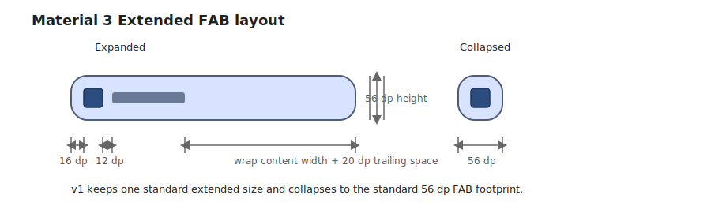

# Roo Windows Material 3 Extended FAB Design

## Objective

Add Material Design 3 extended floating action button support to `roo_windows`
in a form that fits the framework's existing surface, paint, and embedded-RAM
constraints.

The design should provide:

- a dedicated `material3::ExtendedFab` widget rather than a new mode on
  `material3::Button`,
- the standard 56 dp Material 3 extended FAB in v1,
- a required leading icon plus a single-line label in the expanded state,
- an explicit expanded / collapsed state so hosts can collapse the FAB on
  scroll without attaching scroll policy to the widget itself,
- theme-backed color and elevation resolution aligned with the Material 3 FAB
  family,
- reuse of the existing surface overlay, shadow, and click-animation pipeline,
- and example plus test coverage that fits the existing `roo_windows`
  authoring flow.

This document defines the intended API and implementation direction. It does
not describe an existing implementation.

## Motivation

`roo_windows` now has a working Material 3 standard button surface under
[material3_buttons_design.md](material3_buttons_design.md) and
[src/roo_windows/material3/button/button.h](../src/roo_windows/material3/button/button.h),
but that work deliberately excluded floating action buttons.

That boundary was correct. A FAB is not just another filled button:

- it carries screen-level primary-action semantics,
- it has FAB-specific elevation and color treatment,
- it commonly collapses from icon plus label to icon only,
- and it is often hosted in places such as scaffold corners or
  navigation-rail headers rather than inline button rows.

`roo_windows` therefore needs a separate Material 3 extended FAB surface
instead of stretching `material3::Button` into a second component family.

## Background

### Current Status in `roo_windows`

As of 2026-05, `roo_windows` has no checked-in FAB family.

What exists today:

- [src/roo_windows/material3/button/button.h](../src/roo_windows/material3/button/button.h)
  and
  [src/roo_windows/material3/button/button.cpp](../src/roo_windows/material3/button/button.cpp)
  implement a Material 3 standard `Button` with token-backed size presets,
  icon-plus-label measurement, theme-resolved colors, and reuse of the
  existing `BasicSurfaceWidget` surface pipeline.
- [examples/material3/buttons/buttons.ino](../examples/material3/buttons/buttons.ino)
  already exercises the current Material 3 button surface.
- [test/material3_button_test.cpp](../test/material3_button_test.cpp) already
  provides a host-side unit-test pattern for a Material 3 action widget.
- `BasicSurfaceWidget` already provides surface ownership, elevation, outline,
  area-overlay, and click-animation integration.
- the earlier button design explicitly deferred floating action buttons in
  [material3_buttons_design.md](material3_buttons_design.md).
- the navigation-rail design already anticipates FAB hosting in the rail header
  slot in
  [material3_navigation_rail_design.md](material3_navigation_rail_design.md).

What does not exist yet:

- no `material3::FloatingActionButton` or `material3::ExtendedFab`,
- no FAB-specific theme token resolver in `roo_windows`,
- no FAB example sketch,
- and no FAB-focused golden or unit-test target.

The closest local implementation anchor is therefore the checked-in Material 3
button: it already solves direct-to-framebuffer icon-plus-text painting on a
surface-owning widget, but it is intentionally not the FAB API.

### Material 3 Sources

This document is aligned against the current Material 3 FAB documentation:

- [Overview](https://m3.material.io/components/floating-action-button/overview)
- [Specs](https://m3.material.io/components/floating-action-button/specs)
- [Guidelines](https://m3.material.io/components/floating-action-button/guidelines)

The public Material site describes the FAB family as a promoted action surface
that may collapse from an extended icon-plus-label presentation to an icon-only
FAB during scrolling. The current Material 3 documentation now also exposes an
expressive extended-FAB size family beyond the standard size.

### Android and Compose Signals

Android View and Compose provide two strong signals that matter here.

First, both APIs treat expand / collapse as widget state, not as an internal
scroll policy:

- Android View exposes `setExtended(boolean)`, `extend()`, and `shrink()` on
  `ExtendedFloatingActionButton`.
- Compose Material 3 exposes `ExtendedFloatingActionButton(..., expanded = ...)`
  and size-specific small / medium / large overloads.

Second, the current Android Material 3 resources expose the standard extended
FAB geometry used in this design:

- 56 dp container height,
- 16 dp leading space,
- 20 dp trailing space,
- 12 dp icon-label gap,
- 24 dp icon size,
- and a collapsed size that matches the standard 56 dp FAB footprint.

The same resources also confirm that expressive small / medium / large extended
FAB sizes exist, but they are a later size matrix rather than a prerequisite
for a first embedded implementation.

### Local Framework Constraints

The design needs to fit the current `roo_windows` model:

- a promoted FAB owns its own surface, so it should derive from
  `BasicSurfaceWidget`,
- the framework already has the click callback, press animation, and state
  bits the FAB needs,
- the framework does not have a special scaffold slot, z-layer manager, or
  scroll-behavior attachment point for FABs,
- and per-instance RAM remains the dominant design constraint.

Those constraints force several decisions:

1. `ExtendedFab` must be a separate widget, not a `Button` variant.
2. "Floating" remains a visual / placement convention owned by the parent; the
   widget itself does not become a new screen-level overlay concept.
3. Expand / collapse state belongs on the widget, but automatic scroll policy
   does not.
4. The first design should land the standard extended FAB size only, rather
   than trying to ship the full expressive size family before the base FAB
   family exists locally.
5. The widget should not pay for child slots, width-animation state, or
   built-in behavior objects on every instance.

## Requirements

### Functional Requirements

1. Support the standard Material 3 extended FAB surface with a leading icon and
   a single-line label.
2. Support expanded and collapsed presentations of the same widget instance.
3. Support enabled and disabled states.
4. Support pressed, focused, and hovered visual treatment through the existing
   widget state model where those states are available.
5. Resolve default colors, shape, and elevation from theme-backed FAB tokens.
6. Support the current recommended FAB color styles:
   primary container, secondary container, tertiary container, primary,
   secondary, and tertiary.
7. Preserve normal use in ordinary layouts and in navigation-rail header slots
   without introducing a new host container type.

### Interaction Requirements

1. Preserve the existing `Widget::setOnInteractiveChange()` callback path.
2. Keep `onClicked()` as the primary semantic action hook.
3. Reuse the existing area-overlay and click-animation pipeline for press
   feedback.
4. Keep expand / collapse host-controlled through a direct widget setter; do
   not add a built-in scroll observer, coordinator behavior, or show / hide
   policy object.

### API Requirements

1. Add a new `material3::ExtendedFab` public type.
2. Keep the public surface intentionally small: label, icon, expanded state,
   and color style.
3. Require an icon and label in v1; do not expose iconless or multiline modes.
4. Do not expose arbitrary child slots in v1.
5. Do not expose a standalone icon-only `FloatingActionButton` type in this
   design.
6. Do not expose built-in show / hide / shrink / extend animation listeners in
   v1.

### Embedded Constraints

1. Do not require heap allocation on paint, press, or expand / collapse paths.
2. Do not add stored `std::function` members beyond the current widget hook
   model.
3. Keep the base widget compact: one borrowed label view, one icon pointer, and
   packed state.
4. Do not store per-instance behavior, animation, or scroll-policy objects.
5. Keep the base-case RAM cost small enough that multiple FAB-bearing screens
   remain practical on ESP32-class targets.

## Design Overview

The design introduces one new public widget:

1. `material3::ExtendedFab`.

The key decisions are:

- `ExtendedFab` derives from `BasicSurfaceWidget`,
- it owns one promoted FAB surface and paints its icon plus label directly,
- v1 implements the standard 56 dp extended FAB only,
- a one-bit expanded flag switches between icon-plus-label and icon-only
  presentation,
- color treatment comes from a dedicated FAB color-style enum backed by the
  active `Theme`,
- shape stays constant across press state and does not reuse the button's
  corner-morph behavior,
- and expand / collapse is an immediate relayout, not an internal width
  animation.

The collapsed presentation is intentionally a state of `ExtendedFab`, not a
public standalone icon-only FAB type. That is enough to support the Material 3
extended-FAB use case, including scroll-driven collapse, without pre-designing
the whole FAB family first.



Figure 1. The expanded widget wraps icon plus label content with the standard
56 dp height and token paddings; the collapsed presentation resolves to a 56 dp
square with the icon centered.

## Design Details

### Component Boundary

`ExtendedFab` is a separate surface-owning widget, not a mode on
`material3::Button`.

That separation matters because FAB semantics differ in several ways from the
current button family:

- FABs have one promoted action role rather than five button variants,
- FABs use FAB elevation rules instead of button elevation rules,
- FABs do not use the button's press-driven shape morph,
- FABs collapse to icon-only form,
- and FABs are typically placed as floating or header content rather than as
  inline button-row members.

Internally, the implementation should still reuse any button-local helper logic
that is genuinely shared, such as icon measurement or disabled-color
compositing. The public API boundary remains separate.

### Content Model

The expanded content model in v1 is fixed:

- one required leading icon,
- one required single-line label,
- no trailing icon,
- no multiline label,
- and no arbitrary child composition.

The icon is required deliberately. Material 3 extended FABs are distinguished
from ordinary promoted buttons by the icon-plus-label combination and the
ability to collapse into an icon-only FAB. A label-only variant would blur the
boundary with `material3::Button` while also making collapsed mode poorly
defined.

As with `material3::Button`, the label is stored as a non-owning
`roo::string_view`. The icon is a borrowed `MonoIcon` reference stored
internally as a pointer. Callers remain responsible for keeping both alive.

### Geometry and Measurement

The standard v1 token set is fixed to the current Material 3 extended FAB:

- height: 56 dp,
- collapsed width: 56 dp,
- icon size: 24 dp,
- leading space: 16 dp,
- trailing space: 20 dp,
- icon-label gap: 12 dp,
- typography: `font_button()` as the local analogue of the Material label-large
  text style.

Let $t$ be the measured single-line label width in the current font. Then the
natural expanded width is:

$$
w_{expanded} = \max(56\text{ dp}, 16\text{ dp} + 24\text{ dp} + 12\text{ dp} + t + 20\text{ dp})
$$

and the collapsed size is:

$$
w_{collapsed} = h = 56\text{ dp}
$$

The widget's natural height is always 56 dp. Vertical padding is therefore
derived from the fixed height and the current font metrics in the same way the
current button implementation derives its token height.

When the parent gives the FAB more width than its natural size, the icon-plus-
label cluster should remain visually centered while preserving the token
paddings as minimums. In the common floating-action case, the widget will still
normally be measured at wrap-content width.

### Color and Elevation Resolution

The widget resolves its visuals from the active `Theme` through a FAB-specific
style enum. The mapping is direct and semantic:

1. `kPrimaryContainer` maps to `primaryContainer` / `onPrimaryContainer`.
2. `kSecondaryContainer` maps to `secondaryContainer` /
   `onSecondaryContainer`.
3. `kTertiaryContainer` maps to `tertiaryContainer` / `onTertiaryContainer`.
4. `kPrimary` maps to `primary` / `onPrimary`.
5. `kSecondary` maps to `secondary` / `onSecondary`.
6. `kTertiary` maps to `tertiary` / `onTertiary`.

The default style is `kPrimaryContainer`.

Disabled treatment follows the same composite rule already used by the current
Material 3 button implementation:

- disabled container = `DisabledComposite(theme, theme.color.onSurface, 0x1F)`,
- disabled content = `DisabledComposite(theme, theme.color.onSurface, 0x61)`.

The FAB has no outline in v1.

Elevation follows the current Material 3 FAB state model:

- enabled default elevation: 3 dp,
- hovered elevation: 4 dp,
- focused elevation: 3 dp,
- pressed elevation: 3 dp,
- disabled elevation: 0 dp.

On targets that do not surface hover events, the hover-only 4 dp path simply
never activates; the widget still keeps the same token table.

The press state uses the existing area-overlay / click-animation path rather
than introducing a second ripple or indication subsystem.

### Expansion and Host Policy

Expand / collapse state belongs on the widget:

- `expanded = true` paints icon plus label,
- `expanded = false` paints the icon only and reports the collapsed 56 dp
  square size.

The setter is immediate: `setExpanded(bool)` invalidates and requests layout.
It does not animate width or label opacity.

That is a deliberate decision. The current `roo_windows` widget stack has a
press animation but not a reusable component-local layout-size animation
primitive. Shipping width animation first would add state, motion policy, and a
new bug surface to every FAB instance before the static component exists.
Embedded v1 should land the correct states and geometry first.

Automatic scroll policy is also out of scope for the widget itself. Parents,
screens, or higher-level scaffolds remain free to toggle `setExpanded()` based
on scroll position, navigation state, or available width.

### Paint Model

The FAB follows the standard surface-owning paint split:

- `BasicSurfaceWidget` and the existing surface pipeline own shadow, container
  fill, state overlay, and clipping,
- `ExtendedFab::paint(PaintContext&)` paints only the icon and label content,
- collapsed mode paints only the centered icon,
- and no extra child widget or second paint stage is introduced for the label.

Unlike the current standard button, the FAB does not animate its corner radius
on press. Shape remains constant across states, which matches the FAB family
better and avoids coupling the new widget to button-local press-morph logic.

### RAM Budget

The base widget should stay close to the current button's storage shape:

- `BasicSurfaceWidget` base: ~40-50 B,
- borrowed label view: 8 B,
- icon pointer: 4 B,
- packed color-style + expanded bits: 1 B,
- alignment / padding slack: ~3 B.

Approximate total: ~56-66 B on 32-bit targets.

The important part is the storage shape, not the exact host-build number:

- no child container,
- no motion-spec or scroll-behavior object,
- no stored callback list,
- and no per-instance appearance struct.

## Proposed API

```cpp
namespace roo_windows {
namespace material3 {

enum class ExtendedFabColorStyle : uint8_t {
  kPrimaryContainer,
  kSecondaryContainer,
  kTertiaryContainer,
  kPrimary,
  kSecondary,
  kTertiary,
};

class ExtendedFab : public BasicSurfaceWidget {
 public:
  explicit ExtendedFab(
      ApplicationContext& context, roo::string_view label,
      const MonoIcon& icon,
      ExtendedFabColorStyle color_style =
          ExtendedFabColorStyle::kPrimaryContainer);

  roo::string_view label() const;
  void setLabel(roo::string_view label);

  const MonoIcon& icon() const;
  void setIcon(const MonoIcon& icon);

  bool expanded() const;
  void setExpanded(bool expanded);

  ExtendedFabColorStyle colorStyle() const;
  void setColorStyle(ExtendedFabColorStyle style);

  bool isClickable() const override;
  Padding getDefaultPadding() const override;
  ColorRole containerRole() const override;
  Color background() const override;
  BorderStyle getBorderStyle() const override;
  uint8_t getElevation() const override;
  Dimensions getSuggestedMinimumDimensions() const override;
  void paint(PaintContext& ctx) const override;

 protected:
  void notifyStateChanged(uint16_t state_diff) override;

 private:
  roo::string_view label_;
  const MonoIcon* icon_;
  uint8_t color_style_ : 3;
  uint8_t expanded_ : 1;
};

}  // namespace material3
}  // namespace roo_windows
```

### API Notes

1. The constructor requires both label and icon in v1.
2. `setExpanded(false)` switches to the collapsed icon-only presentation, but
   it does not change the widget's semantic action or callback path.
3. Visibility remains the base `Widget` visibility mechanism; this design does
   not add FAB-specific `show()` or `hide()` helpers.
4. The color-style enum uses the current explicit Material 3 names rather than
   the older Android style names that overloaded `Primary` to mean
   `PrimaryContainer`.

## Implementation Plan

Implementation work for these phases follows the repo-local
[roo_windows Widget Authoring](../.github/instructions/roo-windows-widget-authoring.instructions.md).

### Phase 1: Declare the Extended FAB Type and Token Surface

Code slice:

1. Add `material3::ExtendedFab` and `ExtendedFabColorStyle` under a new FAB
   source area, e.g. `src/roo_windows/material3/fab/extended_fab.h` and
   `.../extended_fab.cpp`.
2. Add the standard 56 dp token table and the semantic color-style mapping.
3. Add pointer-size-aware size-budget assertions or unit tests that lock the
   base widget to the intended storage shape.
4. Leave the existing `material3::Button` API and implementation untouched.

Proposed commit message:

> Material 3 Extended FAB Phase 1: declare the widget and tokens.
>
> Add `material3::ExtendedFab`, the FAB color-style enum, and base size-budget
> coverage without changing the existing button family.

Validation: add `material3_extended_fab_test` and run
`bazel test //:material3_extended_fab_test` from the `roo_windows` workspace.

### Phase 2: Implement Geometry, Paint, and Expanded / Collapsed State

Code slice:

1. Implement 56 dp measurement and token padding.
2. Implement direct icon-plus-label paint for expanded mode and centered-icon
   paint for collapsed mode.
3. Resolve container / content colors and elevation from the active `Theme`.
4. Reuse the existing surface overlay and click-animation path; do not add a
   separate ripple or shape-morph system.
5. Add focused tests for defaults, natural dimensions, expanded / collapsed
   widths, disabled treatment, and color-style role mapping.

Proposed commit message:

> Material 3 Extended FAB Phase 2: implement the widget behavior.
>
> Add standard extended-FAB geometry, theme-backed color and elevation
> resolution, and explicit expanded / collapsed presentation on top of
> `BasicSurfaceWidget`.

Validation: run `bazel test //:material3_extended_fab_test` with geometry- and
state-focused cases.

### Phase 3: Add Example and Golden Coverage

Code slice:

1. Add a representative example sketch under
   `examples/material3/extended_fab/extended_fab.ino`.
2. Add `material3_extended_fab_golden_test` covering expanded and collapsed
   states, disabled state, and multiple color styles.
3. Include one example case that toggles `setExpanded()` so width changes and
   repaint boundaries are exercised in emulation.
4. Keep the design scoped to the standard size; do not add expressive small /
   medium / large size variants in this phase.

Proposed commit message:

> Material 3 Extended FAB Phase 3: add example and goldens.
>
> Add an emulation-backed extended-FAB example and golden coverage for the
> landed standard-size widget, including expanded / collapsed presentation.

Validation: run `bazel test //:material3_extended_fab_test`, run
`bazel test //:material3_extended_fab_golden_test`, and build the example that
hosts `examples/material3/extended_fab/extended_fab.ino`.

## Testing Plan

Validation coverage should include:

1. `material3_extended_fab_test` for defaults, size-budget coverage, non-owning
   label contract, expanded / collapsed geometry, color-style mapping, and
   disabled elevation.
2. `material3_extended_fab_golden_test` for expanded and collapsed visuals,
   disabled visuals, and at least one container-tone and one pure-tone color
   style.
3. Example build coverage for
   `examples/material3/extended_fab/extended_fab.ino`.
4. Emulation verification that toggling `setExpanded()` does not leave stale
   pixels after relayout.

## Caveats

### Rejected Alternatives

#### Fold FAB Support Into `material3::Button`

Rejected in favor of a separate widget.

The current button class already stores standard-button-specific concepts such
as `ButtonVariant`, `ButtonSize`, `ButtonShape`, and the press-driven corner
morph. FABs do not share that taxonomy. Folding FAB support into `Button` would
either burden every button with extra state or leave the FAB API permanently
coupled to the wrong public model.

#### Add Automatic Scroll Collapse Inside The Widget

Rejected in favor of a simple `setExpanded(bool)` setter.

Collapse policy depends on host scroll ownership, screen structure, and layout
breakpoints. Baking that into the widget would require observer or behavior
state on every instance, which is the wrong RAM tradeoff for `roo_windows`.

#### Add A Standalone Icon-Only FAB Type In The Same Design

Rejected for this document's scope.

The collapsed presentation is enough to support the Material 3 extended-FAB use
case, including scroll-driven collapse and navigation-rail header hosting.
Designing the whole icon-only FAB family now would widen the scope from one
target component into the full FAB taxonomy.

#### Ship Width Animation In The First Landing

Rejected for the initial implementation.

The repo already has a press animation path, but it does not yet have a small,
reusable layout-size animation primitive for component-local width morphs.
Static expanded / collapsed behavior closes the API and geometry first without
forcing additional runtime state onto every widget.

## Future Work

1. Add the expressive small / medium / large extended-FAB size family after the
   standard extended FAB lands cleanly.
2. Add the standalone icon-only FAB family as follow-on design work.
3. Add optional host-level helpers for show / hide and scroll-driven collapse,
   outside the widget itself.
4. Add a reusable width / opacity animation primitive if enough components need
   it beyond FAB.