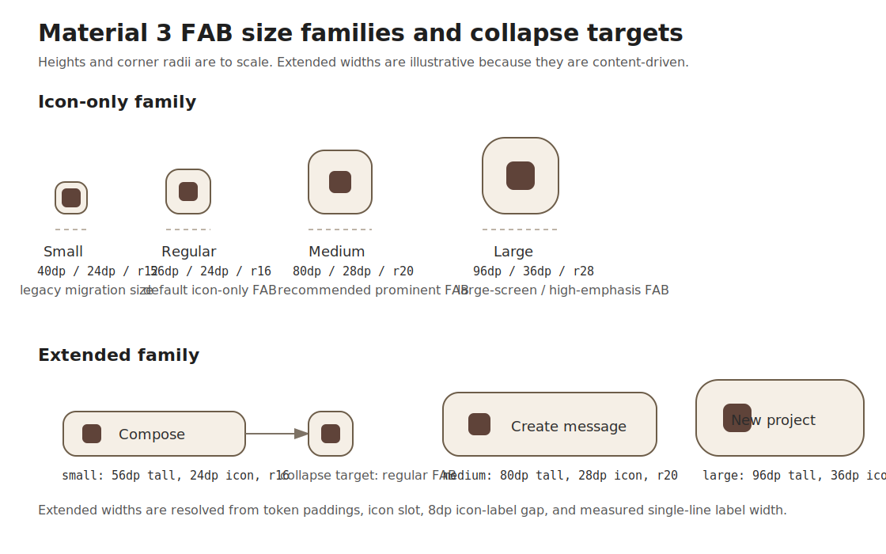

# Roo Windows Material 3 FAB Design

## Implementation status

**Proposed.** None of the defined scope is implemented. The status of existing and outstanding prerequisites is recorded in the [status index](../README.md).

## Objective

Add a Material Design 3 floating action button family to `roo_windows` that
fits the current embedded-first widget model and covers the FAB surfaces that
are still missing from the library.

The design should provide:

- icon-only floating action buttons in the Material 3 small, regular, medium,
  and large size families,
- extended floating action buttons with a single-line label, optional icon,
  and explicit collapsed versus expanded presentation,
- expressive Material 3 color styles plus the legacy surface style,
- token-backed geometry, shape, elevation, and state-layer behavior resolved
  from the active theme,
- reuse of the existing `BasicSurfaceWidget`, area-overlay, and click-
  animation pipeline,
- and a narrow widget-only API that stays separate from future scaffold,
  placement-host, or FAB-menu work.

This document defines the intended API family. It does not describe an
existing implementation.

## Motivation

`roo_windows` already has a landed Material 3 standard button in
[src/roo_windows/material3/button/button.h](../../../src/roo_windows/material3/button/button.h),
but a FAB is not just a larger button with a different default color.

Material 3 FABs carry their own component semantics:

- they represent the single highest-priority constructive action on a screen,
- their size taxonomy differs from standard buttons,
- their icon-only and extended variants are first-class surfaces,
- and their host relationship is different because they commonly float above
  scrollable content or sit in a navigation-rail header.

Stretching the current `material3::Button` API to cover FABs would blend two
component families with different geometry, typography, and motion signals.
The right shape for `roo_windows` is a dedicated Material 3 FAB family.

## Background

### Current Status in `roo_windows`

As of 2026-05, the relevant current pieces are:

- the landed Material 3 standard button in
  [src/roo_windows/material3/button/button.h](../../../src/roo_windows/material3/button/button.h)
  and
  [src/roo_windows/material3/button/button.cpp](../../../src/roo_windows/material3/button/button.cpp),
  which already prove out token-backed Material 3 surface widgets,
- the corresponding example in
  [examples/material3/buttons/buttons.ino](../../../examples/material3/buttons/buttons.ino)
  and tests in
  [test/material3_button_test.cpp](../../../test/material3_button_test.cpp),
- the current surface, overlay, and click-animation pipeline in
  [src/roo_windows/core/basic_surface_widget.h](../../../src/roo_windows/core/basic_surface_widget.h),
  [src/roo_windows/core/surface_widget.h](../../../src/roo_windows/core/surface_widget.h),
  and
  [src/roo_windows/core/overlay_spec.cpp](../../../src/roo_windows/core/overlay_spec.cpp),
- and the Material 3 navigation rail design in
  [material3_navigation_rail_design.md](material3_navigation_rail_design.md),
  which already reserves a generic header slot that can host a FAB.

What does not exist yet:

- no `material3::FloatingActionButton`,
- no `material3::ExtendedFloatingActionButton`,
- no FAB-specific test or golden target,
- no representative FAB example sketch,
- and no agreed boundary between base FAB widgets, future placement hosts, and
  future FAB-menu work.

The current `material3::Button` implementation is therefore valuable as local
precedent, but it is not the correct public surface for FABs.

### Material 3 Signals

This design is aligned against the Material 3 FAB references:

- [Overview](https://m3.material.io/components/floating-action-button/overview)
- [Specs](https://m3.material.io/components/floating-action-button/specs)
- [Guidelines](https://m3.material.io/components/floating-action-button/guidelines)

The main product signals carried into this design are:

1. a FAB is the primary constructive action on a screen, not a general-purpose
   icon button,
2. the icon-only family supports four sizes in practice: legacy small,
   regular, medium, and large,
3. the extended family is part of the same component family but adds label
   text and explicit collapsed versus expanded presentation,
4. size and color are separate concerns,
5. expressive color styles are now first-class, while the surface style is
   still available but not recommended,
6. state layers should track the icon/content color,
7. the FAB itself is a widget, while a FAB menu is a separate component,
8. and the FAB stays visually independent from scrolling content even when the
   screen body scrolls under it.

### Local Framework Constraints

The local widget model imposes several concrete constraints:

- Surface-owning widgets should derive from `SurfaceWidget` /
  `BasicSurfaceWidget`.
- Area overlays already work for surface widgets, and overlay color can be
  derived from the widget's effective container role.
- The click-animation pipeline already exists and should be reused instead of
  introducing a second ripple system.
- The repo's widget authoring rules optimize for per-instance RAM first, so
  icon-only FABs should not pay for label storage or extended-state fields.
- `roo_windows` does not currently have a Material scaffold or FAB placement
  host, so the base FAB family should remain placement-agnostic rather than
  trying to solve screen-level layout in the same API.

## Requirements

### Functional Requirements

1. Support icon-only Material 3 FABs in small, regular, medium, and large
   sizes.
2. Support extended Material 3 FABs in small, medium, and large sizes.
3. Support collapsed and expanded presentation on the extended FAB without
   replacing the widget instance.
4. Support the expressive FAB color styles: primary container, secondary
   container, tertiary container, primary, secondary, and tertiary.
5. Support the legacy surface FAB color style for migration even though it is
   not the default.
6. Support enabled, disabled, hovered, focused, pressed, selected, and
   activated visual states through the current widget-state model.
7. Resolve colors, shape, spacing, icon size, typography, and elevation from
   shared token tables rather than per-instance ad hoc values.
8. Keep icon geometry stable even when the concrete drawable is smaller than
   the token target size.

### Interaction Requirements

1. Preserve the existing `Widget::setOnInteractiveChange()` callback path and
   `onClicked()` semantics.
2. Reuse the existing area-overlay and click-animation pipeline for press,
   focus, hover, and activation feedback.
3. Keep FAB corner geometry stable during press; do not reuse the standard
   button's pressed corner-morph behavior.
4. Make extended-FAB collapse and expand a direct state change in v1; do not
   require built-in container-transform animation.
5. Keep FAB menus, tooltips, and screen-level docking behavior out of the base
   FAB widgets.

### API Requirements

1. Expose separate `FloatingActionButton` and
   `ExtendedFloatingActionButton` public types.
2. Keep the base FAB widgets placement-agnostic: no per-widget corner,
   alignment, inset, or dock policy fields.
3. Keep icon references non-owning `const MonoIcon*` pointers.
4. Keep extended labels as non-owning `roo::string_view`.
5. Keep the base content models narrow: icon only for
   `FloatingActionButton`, icon plus one line of text for
   `ExtendedFloatingActionButton`.
6. Do not add badge support, multiple-action support, menu expansion, or
   arbitrary child composition to the base FAB API.
7. Use enum-backed size and color-style properties in v1 instead of shared
   appearance objects.

### Embedded Constraints

1. Do not allocate on paint, press, hover, focus, layout, or collapse/expand
   paths.
2. Do not add per-instance `std::function` storage.
3. Keep icon-only FABs free of label fields and expanded/collapsed state.
4. Keep size and color-style state packed.
5. Add pointer-size-aware size-budget assertions for both public FAB types.

## Design Overview

The public family is split into two widget types:

1. `material3::FloatingActionButton` for icon-only FABs.
2. `material3::ExtendedFloatingActionButton` for label-bearing FABs that can
   switch between expanded and collapsed presentation.

Both widgets derive from `BasicSurfaceWidget` because both own a meaningful
container surface, border radius, elevation, and area-overlay behavior.

The core design decisions are:

- do not reuse `material3::Button` as the public FAB base,
- do not expose one mode-switching "generic action button" that forces every
  icon-only FAB to carry label-related state,
- keep placement outside the widget API,
- keep click feedback on the existing overlay and click-animation path,
- support the expressive color styles directly in the widget API,
- and support the legacy surface style by using `surfaceContainerHigh` for the
  container plus the overlay/highlighter path for the primary-colored icon and
  state layer.



## Design Details

### Type Split and Migration Boundary

`FloatingActionButton` and `ExtendedFloatingActionButton` land beside the
existing Material 3 standard button. They do not change
`material3::Button` in place.

This is a deliberate semantic split:

- `material3::Button` is text-first and already carries standard-button
  concepts such as button variants and the pressed corner morph,
- `FloatingActionButton` is icon-first and always represents the primary
  screen action,
- `ExtendedFloatingActionButton` keeps one label and one optional icon, but it
  still belongs to the FAB family rather than the standard-button family.

No shared public FAB base class is introduced.

That keeps the public API explicit and avoids an awkward shared size enum where
an icon-only 56 dp FAB and an extended 56 dp FAB would need the same public
name while carrying different layout semantics. Any code sharing should remain
internal to the `material3/fab` implementation files.

### Geometry and Size Model

The icon-only and extended families use separate token tables.

#### Icon-Only FAB Tokens

The icon-only family uses the following size buckets:

| Size | Container | Icon slot | Corner radius | Status |
| --- | --- | --- | --- | --- |
| Small | `40 x 40 dp` | `24 dp` | `12 dp` | Supported for migration; not the default |
| Regular | `56 x 56 dp` | `24 dp` | `16 dp` | Default icon-only size |
| Medium | `80 x 80 dp` | `28 dp` | `20 dp` | Recommended for prominent compact/mobile layouts |
| Large | `96 x 96 dp` | `36 dp` | `28 dp` | Prominent large-screen or high-emphasis variant |

The icon is centered in the resolved container. Measurement is therefore the
container token itself; icon size affects paint and minimum icon slot sizing,
not outer container dimensions.

#### Extended FAB Tokens

The extended family uses these height buckets:

| Size | Minimum container | Icon slot | Corner radius | Typography |
| --- | --- | --- | --- | --- |
| Small | `56 dp` height, `56 dp` min width | `24 dp` | `16 dp` | `font_button()` |
| Medium | `80 dp` height, `80 dp` min width | `28 dp` | `20 dp` | `font_button()` |
| Large | `96 dp` height, `96 dp` min width | `36 dp` | `28 dp` | `font_button()` |

All three extended sizes use an `8 dp` icon-label gap. Leading and trailing
padding are size-token-driven and live in a static table rather than as stored
per-instance fields.

The natural extended width is:

$$
w_\text{extended} = \max\left(h,\; p_\text{lead} + s_\text{icon} +
\begin{cases}
0 & \text{if icon absent and label empty} \\
w_\text{text} & \text{if icon absent and label present} \\
s_\text{icon} & \text{if icon present and label empty} \\
s_\text{icon} + g + w_\text{text} & \text{if icon and label are both present}
\end{cases}
+ p_\text{trail}\right)
$$

where:

- $h$ is the size-token height,
- $p_\text{lead}$ and $p_\text{trail}$ are the size-token leading and trailing
  paddings,
- $s_\text{icon}$ is the icon-slot size,
- $g$ is the `8 dp` icon-label gap,
- and $w_\text{text}$ is the measured single-line label width in
  `font_button()`.

The typography choice is deliberate.

Material 3 expressive tokens distinguish text styles between small, medium,
and large extended FABs, but the current `roo_windows` theme surface still
exposes the older `font_button()` / `font_h6()` / `font_subtitle*()` naming
set rather than Material 3 title/headline token helpers. The initial FAB
family therefore standardizes on `font_button()` for all extended sizes.

That keeps the implementation local to the FAB family instead of forcing a
broader theme-typography expansion into the first FAB landing. The public FAB
API does not depend on this bridge, so a future theme-typography update can
refine the mapping without breaking callers.

### Collapsed Versus Expanded Extended FABs

`ExtendedFloatingActionButton` stores one boolean presentation flag:

- `expanded = true`: render icon plus label using the extended width formula,
- `expanded = false`: render as the corresponding icon-only FAB height bucket
  while retaining the label in memory.

The collapse targets are fixed:

- extended small collapses to the regular `56 dp` icon-only FAB,
- extended medium collapses to the medium `80 dp` icon-only FAB,
- extended large collapses to the large `96 dp` icon-only FAB.

The legacy `40 dp` small icon-only FAB has no extended counterpart.

Collapse and expand are immediate state changes in v1. They invalidate the
interior and request layout, but they do not animate container transform by
themselves.

That keeps the base implementation compatible with the current widget and
animation framework. Motion work can be layered on later without changing the
public API.

### Color, Overlay, and Elevation Model

The FAB family exposes these color styles:

| Color style | Container role | Content color | Overlay strategy |
| --- | --- | --- | --- |
| Primary container | `kPrimaryContainer` | `onPrimaryContainer` | Normal content-color overlay |
| Secondary container | `kSecondaryContainer` | `onSecondaryContainer` | Normal content-color overlay |
| Tertiary container | `kTertiaryContainer` | `onTertiaryContainer` | Normal content-color overlay |
| Primary | `kPrimary` | `onPrimary` | Normal content-color overlay |
| Secondary | `kSecondary` | `onSecondary` | Normal content-color overlay |
| Tertiary | `kTertiary` | `onTertiary` | Normal content-color overlay |
| Surface | `kSurfaceContainerHigh` | `primary` | `usesHighlighterColor() = true` |

The surface style needs the special-case overlay behavior.

The current overlay pipeline derives state-layer color from the widget's
effective container role. For the six expressive styles, that already produces
the right icon-matching state-layer color because `contentColorFor(role)` is
the same as the intended icon color. For the legacy surface style, the icon and
state layer should be `primary` on top of `surfaceContainerHigh`, so the FAB
uses the existing highlighter-color path to resolve `primary` correctly without
requiring a new core overlay hook.

Disabled colors follow the same embedded-friendly rule already used by the
button family: composite `onSurface` onto the current surface with Material 3
disabled-state opacities instead of storing separate per-style disabled colors.

Enabled-state elevation is:

- resting: `3 dp`,
- hovered: `4 dp`,
- focused: `3 dp`,
- pressed: `3 dp`,
- disabled: `0 dp`.

`notifyStateChanged()` updates the surface elevation whenever one of those
state transitions changes the effective elevation and calls `elevationChanged()`.
The change is discrete, not animated, in v1.

### Paint and Invalidation Model

Both FAB widgets rely on the existing surface pipeline for:

- container fill,
- rounded corners,
- shadow/elevation,
- outline handling,
- and area-shaped overlays.

Their `paint(PaintContext&)` implementations only paint foreground content:

- centered icon for `FloatingActionButton`,
- centered icon plus optional label for an expanded
  `ExtendedFloatingActionButton`,
- centered icon for a collapsed `ExtendedFloatingActionButton`.

No FAB variant uses the standard button's pressed corner morph. The resolved
corner radius stays fixed for the selected size bucket.

State changes have these invalidation rules:

- color-style, icon, label, or expanded/collapsed changes invalidate the
  interior and request layout if size can change,
- state changes that only affect overlays or elevation invalidate the interior,
- and size changes invalidate the interior and request layout.

### Placement Contract

Placement stays outside the base FAB widgets.

The new family does not store:

- bottom-trailing versus centered alignment,
- safe-area insets,
- bottom-app-bar docking,
- or scroll ownership.

That is an intentional scope boundary.

In `roo_windows`, keeping a FAB visually fixed while content scrolls is the
host's job: place the FAB outside the scrolling subtree or on a host-specific
overlay layer. The FAB widget itself remains an ordinary widget that reports a
natural size and paints its own surface.

This boundary keeps the base API reusable in all of these hosts without extra
policy fields:

- a simple fixed-position screen layout,
- a navigation-rail header slot,
- a future scaffold,
- or a future popup/menu launcher.

### RAM Budget

The design keeps the pay-for-what-you-use split explicit.

Target budgets for host-side tests are:

1. `FloatingActionButton`:
   `sizeof(BasicSurfaceWidget) + sizeof(void*) + 4`
2. `ExtendedFloatingActionButton`:
   `sizeof(BasicSurfaceWidget) + sizeof(void*) + sizeof(roo::string_view) + 8`

The important accounting rule is the shape, not the exact host-build byte
count:

1. icon-only FABs stay free of label storage and expanded/collapsed state,
2. the extended FAB pays for label state only when that widget is used,
3. and neither widget pays for screen-level placement or menu behavior.

## Proposed API

### Core Types

```cpp
namespace roo_windows {
namespace material3 {

enum class FabSize : uint8_t {
  kSmall,
  kRegular,
  kMedium,
  kLarge,
};

enum class ExtendedFabSize : uint8_t {
  kSmall,
  kMedium,
  kLarge,
};

enum class FabColorStyle : uint8_t {
  kPrimaryContainer,
  kSecondaryContainer,
  kTertiaryContainer,
  kPrimary,
  kSecondary,
  kTertiary,
  kSurface,
};

class FloatingActionButton : public BasicSurfaceWidget {
 public:
  explicit FloatingActionButton(
      ApplicationContext& context, const MonoIcon* icon = nullptr,
      FabSize size = FabSize::kRegular,
      FabColorStyle color_style = FabColorStyle::kPrimaryContainer);

  const MonoIcon* icon() const;
  void setIcon(const MonoIcon* icon);

  FabSize size() const;
  void setSize(FabSize size);

  FabColorStyle colorStyle() const;
  void setColorStyle(FabColorStyle style);

  bool isClickable() const override;
  ColorRole containerRole() const override;
  Color background() const override;
  BorderStyle getBorderStyle() const override;
  uint8_t getElevation() const override;
  bool usesHighlighterColor() const override;
  Dimensions getSuggestedMinimumDimensions() const override;
  void paint(PaintContext& ctx) const override;

 protected:
  void notifyStateChanged(uint16_t state_diff) override;

 private:
  const MonoIcon* icon_;
  uint8_t size_ : 2;
  uint8_t color_style_ : 3;
};

class ExtendedFloatingActionButton : public BasicSurfaceWidget {
 public:
  explicit ExtendedFloatingActionButton(
      ApplicationContext& context, roo::string_view label = {},
      const MonoIcon* icon = nullptr,
      ExtendedFabSize size = ExtendedFabSize::kSmall,
      FabColorStyle color_style = FabColorStyle::kPrimaryContainer);

  roo::string_view label() const;
  void setLabel(roo::string_view label);

  const MonoIcon* icon() const;
  void setIcon(const MonoIcon* icon);

  ExtendedFabSize size() const;
  void setSize(ExtendedFabSize size);

  FabColorStyle colorStyle() const;
  void setColorStyle(FabColorStyle style);

  bool expanded() const;
  void setExpanded(bool expanded);

  bool isClickable() const override;
  ColorRole containerRole() const override;
  Color background() const override;
  BorderStyle getBorderStyle() const override;
  uint8_t getElevation() const override;
  bool usesHighlighterColor() const override;
  Dimensions getSuggestedMinimumDimensions() const override;
  void paint(PaintContext& ctx) const override;

 protected:
  void notifyStateChanged(uint16_t state_diff) override;

 private:
  roo::string_view label_;
  const MonoIcon* icon_;
  uint8_t size_ : 2;
  uint8_t color_style_ : 3;
  uint8_t expanded_ : 1;
};

}  // namespace material3
}  // namespace roo_windows
```

### API Notes

1. `FloatingActionButton` defaults to the regular `56 dp` FAB rather than the
   deprecated small size.
2. `ExtendedFloatingActionButton` defaults to the small `56 dp` extended FAB.
3. `FabColorStyle::kSurface` is supported for migration but is not the default.
4. `setExpanded(false)` on `ExtendedFloatingActionButton` preserves the stored
   label and icon while measuring and painting as the corresponding icon-only
   collapse target.
5. The widget APIs intentionally do not expose placement, docking, badge,
   tooltip, or menu behavior.
6. If the public declarations land before the full paint/layout behavior, the
   interim stubs for `paint()`, `getSuggestedMinimumDimensions()`, and other
   unsafe partial behaviors should emit `LOG(FATAL) << "Unimplemented: ..."`
   rather than silently drawing the wrong geometry.

## Implementation Plan

Implementation work for these phases follows the repo-local
[roo_windows widget authoring instruction](../../../.github/instructions/roo-windows-widget-authoring.instructions.md).

### Phase 1: Declare the Material 3 FAB Types and Size Budgets

Code slice:

1. Add the public enums and class declarations from the Proposed API in a new
   `material3/fab/` directory.
2. Keep icon-only and extended FABs as separate public types from the first
   commit.
3. Add pointer-size-aware size-budget tests for both types.
4. If any declared methods must remain stubbed in this phase, make the stub
   behavior explicit with `LOG(FATAL)` rather than temporary silent drawing.

Proposed commit message:

> Material 3 FAB Phase 1: declare the FAB family.
>
> Add `material3::FloatingActionButton` and
> `material3::ExtendedFloatingActionButton`, together with size-budget tests
> that keep icon-only FABs free of label state.

Validation: add `material3_fab_test` and run
`bazel test //:material3_fab_test` from the `roo_windows` workspace.

### Phase 2: Implement the Icon-Only Floating Action Button

Code slice:

1. Implement icon-only measurement, paint, color-style mapping, and state-
   dependent elevation.
2. Reuse the existing area-overlay and click-animation pipeline.
3. Support all four icon-only size buckets and all seven color styles.
4. Add focused tests and goldens for sizes, color-style mapping, disabled
   rendering, and the legacy surface-style highlighter path.

Proposed commit message:

> Material 3 FAB Phase 2: implement icon-only FABs.
>
> Add `FloatingActionButton` paint, measurement, size tokens, expressive color
> styles, and surface-style overlay handling on top of the current surface
> widget pipeline.

Validation: run `bazel test //:material3_fab_test` and
`bazel test //:material3_fab_golden_test` with icon-only size, style, and
state cases.

### Phase 3: Implement the Extended FAB and Collapse Model

Code slice:

1. Implement extended-FAB label measurement and paint.
2. Implement the explicit `expanded` state and its fixed collapse targets.
3. Keep collapse/expand as an immediate relayout in this phase; do not add
   container-transform animation yet.
4. Add focused tests and goldens for small, medium, and large extended FABs in
   expanded and collapsed presentation.

Proposed commit message:

> Material 3 FAB Phase 3: add extended FABs.
>
> Add `ExtendedFloatingActionButton` with size-token-driven label layout and a
> stable expanded versus collapsed presentation that reuses the FAB height
> family without changing widget ownership.

Validation: run `bazel test //:material3_fab_test` and
`bazel test //:material3_fab_golden_test` with extended expanded/collapsed
cases.

### Phase 4: Add Example Coverage and Exercise Real Hosts

Code slice:

1. Add a representative example sketch under
   `examples/material3/fabs/fabs.ino`.
2. Show both a fixed-position FAB over scrollable content and a rail-header FAB
   host, using the current layout primitives rather than a new scaffold.
3. Build the example in CI or local validation coverage.
4. Update adjacent docs only where a new stable cross-reference is useful.

Proposed commit message:

> Material 3 FAB Phase 4: add example coverage.
>
> Add a dedicated FAB example that exercises icon-only and extended FABs in a
> fixed overlay position and in a navigation-rail header host.

Validation: run `bazel test //:material3_fab_test`,
`bazel test //:material3_fab_golden_test`, and build the example that hosts
`examples/material3/fabs/fabs.ino`.

## Testing Plan

Validation coverage should include:

1. `material3_fab_test` for defaults, size and color-style setters,
   disabled-state color resolution, surface-style highlighter behavior,
   expanded/collapsed measurement, and size-budget assertions.
2. `material3_fab_golden_test` for icon-only FABs across the four size
   buckets, expressive color styles, surface style, hovered/pressed/focused
   overlays, and extended FABs in expanded and collapsed presentation.
3. Example compilation for `examples/material3/fabs/fabs.ino`.
4. Host coverage that proves the same widgets work in both a fixed overlay
   position and a navigation-rail header slot without extra per-widget
   placement state.

## Caveats

### Rejected Alternatives

#### Reuse `material3::Button` as the FAB Base Class

This was rejected.

`material3::Button` already carries the standard-button family shape:
text-first layout, standard-button variants, and a pressed corner morph. FABs
have a different size taxonomy, different color-style taxonomy, and stable
corner geometry during press. Reusing the button public API would blur two
component families and leave icon-only FABs paying for the wrong semantics.

#### Use One Mode-Switching Widget for Icon-Only and Extended FABs

This was rejected.

The repo's widget guidance explicitly favors pay-for-what-you-use storage.
Making every icon-only FAB carry a label view and expanded/collapsed state
would violate that rule for the common case.

#### Bundle Placement or Scaffold Policy into Every FAB Widget

This was rejected.

Bottom-trailing alignment, rail-header hosting, safe-area insets, and bottom-
app-bar docking are screen-level concerns, not properties of every FAB
instance. Storing them on every widget would increase RAM cost while still not
solving the broader scaffold problem.

#### Add FAB Menus to the Base FAB API

This was rejected.

Material 3 treats the FAB menu as a separate component. Keeping the base FAB
family to single-action widgets keeps the API coherent and leaves room for a
future FAB-menu design that can build on top of the same FAB tokens and host
contracts.

#### Add Badge Support to FABs

This was rejected.

The Material guidance explicitly does not treat badges as part of the base FAB
contract, and carrying badge state on FABs would cut against the repo's RAM-
first design rules.

## Future Work

1. Add a Material 3 FAB-menu design that reuses the landed FAB family instead
   of folding menu behavior into the base widgets.
2. Add animated container-transform motion for extended collapse/expand once a
   focused motion design lands for that transition.
3. Add scaffold or FAB-host primitives when the repo is ready to solve fixed
   screen-level placement as a shared layout concern.
4. Revisit the extended-FAB typography bridge if `roo_windows` adopts a
   Material 3-native typography helper surface in `Theme`.