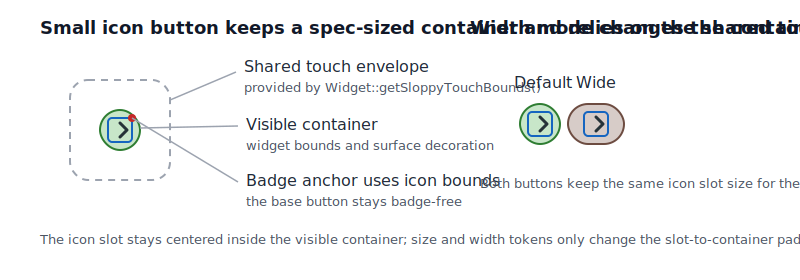

# Roo Windows Material 3 Icon Button Design

## Implementation status

**Proposed.** None of the defined scope is implemented. The status of existing and outstanding prerequisites is recorded in the [status index](../README.md).

## Objective

Add a Material 3 icon-button component to `roo_windows` that fits the current
checked-in [Material 3 button implementation](../../../src/roo_windows/material3/button/button.h)
and the current shared widget framework.

The new component should provide:

- a dedicated `material3::IconButton` type for icon-only actions,
- the four common Material 3 color styles: standard, filled, filled tonal,
  and outlined,
- the Material 3 expressive size, shape, and width selectors,
- direct reuse of the existing surface-overlay and click-animation pipeline,
- a cheap integration seam for badge-aware hosts and anchored menu triggers,
- and an embedded-first storage model with no per-instance text, font, or
  appearance-object overhead.

This design is intentionally about the default, non-toggle icon button. It does
not attempt to design toggle / selected icon buttons in the same landing.

## Motivation

`roo_windows` now has a landed [Material 3 `Button`](../../../src/roo_windows/material3/button/button.h),
but it still has no icon-only companion. That gap is already visible in nearby
designs:

- the [badge design](../implemented/material3_badge_design.md) assumes a future
  `BadgedIconButton` host,
- the [menus design](material3_menus_design.md) calls out icon buttons as popup
  anchors,
- and the [navigation rail design](material3_navigation_rail_design.md) keeps a
  generic header slot partly because a checked-in Material 3 icon button does
  not exist yet.

The repo no longer needs a speculative combined button-family proposal here.
It needs a focused, implementation-grounded design for the missing icon-only
piece.

## Background

### Current Starting Point in `roo_windows`

The current Material 3 button implementation lives in
[src/roo_windows/material3/button/button.h](../../../src/roo_windows/material3/button/button.h)
and
[src/roo_windows/material3/button/button.cpp](../../../src/roo_windows/material3/button/button.cpp).
That landed code already establishes the relevant local baseline:

1. `material3::Button` derives from `BasicSurfaceWidget`.
2. It resolves colors, geometry, and pressed-shape morph from theme-backed
   Material 3 tokens rather than from per-instance override structs.
3. It keeps label storage non-owning through `roo::string_view` and stores only
   one optional icon pointer beyond the widget base.
4. It reuses the framework's area-overlay and click-animation pipeline instead
   of introducing a button-local ripple subsystem.

The current example lives in
[examples/material3/buttons/buttons.ino](../../../examples/material3/buttons/buttons.ino).
That example proves the repo already wants a Material 3 button showcase, but it
also makes the remaining gap obvious: there is still no icon-only button in the
same family.

What does not exist today:

- no `material3::IconButton` class,
- no icon-button token tables in `material3/button/`,
- no icon-button-focused unit or golden coverage,
- and no checked-in helper for badge-aware icon-button hosts.

The missing component is therefore narrow and well defined: an icon-only sibling
to the landed standard button, not a redesign of the full family.

### Material 3 Signals

This document is aligned against the Material 3 icon-button documentation:

- [Overview](https://m3.material.io/components/icon-buttons/overview)
- [Specs](https://m3.material.io/components/icon-buttons/specs)
- [Guidelines](https://m3.material.io/components/icon-buttons/guidelines)

The strongest current signals are:

1. icon buttons are a separate component family from text buttons,
2. the spec distinguishes `default` and `toggle` icon-button variants,
3. the common configuration surface is color style, size, shape, and width,
4. the common color styles are standard, filled, filled tonal, and outlined,
5. expressive icon buttons support five sizes, two shapes, and three widths,
6. pressed state morphs both round and square buttons toward a more square
   corner radius,
7. and extra-small and small icon buttons need a larger touch target than their
   visible container.

This design adopts the size, shape, width, and color-style surface directly.
It deliberately defers the `toggle` variant to follow-on work, because no
checked-in `roo_windows` consumer currently needs it and its selected-state API
deserves a separate design.

### Local Framework Constraints

The most relevant current framework seams are:

- [BasicSurfaceWidget](../../../src/roo_windows/core/basic_surface_widget.h), which
  already owns padding, margins, area overlays, outline, and elevation hooks,
- [SurfaceWidget](../../../src/roo_windows/core/surface_widget.h), whose decoration
  model paints against the widget's logical bounds,
- [Widget](../../../src/roo_windows/core/widget.h), which already expands small touch
  targets through `getSloppyTouchBounds()` and `getSloppyTouchParentBounds()`,
- and the current click-animation model documented in
  [../implemented/click_animation_customization_design.md](../implemented/click_animation_customization_design.md).

Those seams close two important local decisions:

1. `IconButton` should stay on `BasicSurfaceWidget`; it does not need a custom
   paint stack or wrapper container.
2. The visual container should stay spec-sized, while the larger touch target
   for extra-small and small buttons should come from the already shared sloppy
   touch envelope rather than from a second icon-button-specific hit-target
   mechanism.

The current [badge design](../implemented/material3_badge_design.md) also matters. Badges are
already modeled as owner-painted adornments rather than as child widgets, so
the icon-button design needs a cheap way for badge-aware hosts to ask, "where
is the icon slot inside this button?" without baking badge state into every
button instance.

## Requirements

### Functional Requirements

1. Add a default, non-toggle `material3::IconButton` for icon-only Material 3
   actions.
2. Support the four common Material 3 color styles: standard, filled, filled
   tonal, and outlined.
3. Support the five expressive Material 3 sizes.
4. Support both expressive shape families: round and square.
5. Support the three expressive width modes: narrow, default, and wide.
6. Support enabled, disabled, hovered, focused, pressed, and click-animation
   visual states through the existing widget state model.
7. Expose icon-slot geometry so badge-aware hosts can anchor badges without
   duplicating layout math.
8. Remain suitable as an anchor for popup menus and other task-local surfaces.

### Interaction Requirements

1. Match `material3::Button` by remaining clickable even when no interactive
   callback is installed.
2. Reuse the existing area-overlay pipeline for hover, focus, and press state
   layers.
3. Reuse the existing click-animation pipeline for pressed feedback and shape
   morph.
4. Do not introduce a second ripple or state-layer subsystem specific to icon
   buttons.
5. Keep the visible container at the spec size and rely on the shared sloppy
   touch envelope for practical minimum-target expansion.

### API Requirements

1. Expose direct enum-backed selectors for style, size, shape, and width.
2. Use `IconButtonStyle` for color treatment rather than `IconButtonVariant`,
   because Material 3 already uses `variant` to mean `default` versus `toggle`.
3. Store icon data non-owningly; the caller retains icon lifetime ownership.
4. Keep the base public type narrow: one icon, one style, one size, one shape,
   and one width mode.
5. Do not add toggle state, selected icon swapping, or checkable semantics in
   v1.
6. Do not add a shared `IconButtonAppearance` override pointer in v1.

### Memory and Allocation Requirements

1. Avoid heap allocation on paint, measure, press, and animation paths.
2. Keep per-instance state to the widget base, one icon pointer, and packed
   enum bits.
3. Do not add per-instance text, font, callback, or badge storage to the base
   class.
4. Keep the base widget small enough that screens with multiple icon buttons in
   app bars, rails, and lists remain practical on ESP32-class targets.

## Design Overview

The design introduces one new public widget:

1. `material3::IconButton` under
   [src/roo_windows/material3/button/](../../../src/roo_windows/material3/button/).

The core decisions are:

- `IconButton` derives from `BasicSurfaceWidget`, matching the landed
  `material3::Button`.
- The public configuration surface is direct and compact: style, size, shape,
  width mode, and icon.
- The widget bounds describe the visible container, not an inflated tap target.
  Small-button hit expansion comes from the existing widget sloppy-touch path.
- State layers and click animation stay on the shared area-overlay pipeline.
- Badge support stays out of the base class; instead, `IconButton` exposes
  `getIconBounds()` so badge-aware hosts can reuse the button's internal layout
  geometry.
- There is no `ButtonBase` public class and no shared appearance pointer in the
  first landing.
- Toggle icon buttons are deferred to a later design note.

This keeps the landing aligned with the real missing component rather than with
the older combined family proposal.

## Design Details

### Public Surface and Naming

The user-facing configuration surface should be:

- `IconButtonStyle`: `kStandard`, `kFilled`, `kFilledTonal`, `kOutlined`
- `IconButtonSize`: `kExtraSmall`, `kSmall`, `kMedium`, `kLarge`,
  `kExtraLarge`
- `IconButtonShape`: `kRound`, `kSquare`
- `IconButtonWidth`: `kNarrow`, `kDefault`, `kWide`

The style enum intentionally does not use the name `IconButtonVariant`. The
Material 3 icon-button spec already reserves `variant` for `default` versus
`toggle`, and v1 deliberately implements only the default branch.

The constructor should therefore be narrow and explicit:

- the icon is mandatory,
- the default style is `kFilled`,
- the default size is `kSmall`,
- the default shape is `kRound`,
- and the default width mode is `kDefault`.

The base widget should also override `getDefaultMargins()` to return zero.
Unlike text buttons, icon buttons are commonly packed into toolbars, rails,
list rows, and field trailing-action slots where implicit outer spacing is more
often wrong than helpful.

### Geometry, Layout, and Hit Target

The visible icon-button container is the widget's logical bounds.

That decision keeps the component aligned with the current `SurfaceWidget`
decoration model: background fill, outline, elevation, exclusion bounds, and
overlay geometry are all already phrased in terms of the widget's own bounds.
The design therefore does not introduce an inset visual container inside a
larger invisible surface.

For the small sizes that need a larger practical touch target, the widget
should rely on the existing `Widget::getSloppyTouchBounds()` path. The current
framework already expands sub-minimum targets for interaction without forcing a
second layout box, and icon buttons should use that shared mechanism rather
than inventing their own accessibility wrapper.

Within the visible bounds, layout is fully token driven. For a given size and
width mode, the implementation should transcribe the Material 3 size tables
into token data for:

- container height,
- container width,
- icon slot size,
- square resting corner radius,
- and pressed corner radius.

The icon is centered inside the padded content region. In practice, the content
padding can be derived directly from the token tables:

$$
pad_x = \frac{W_{container}(size, width) - W_{icon}(size)}{2}, \qquad
pad_y = \frac{H_{container}(size) - H_{icon}(size)}{2}
$$

`getSuggestedMinimumDimensions()` should therefore return the icon-slot size,
while `getDefaultPadding()` supplies the token-derived padding that grows the
natural size to the visible Material 3 container size.

Round buttons use a full radius at rest. Square buttons use the size-specific
corner radii from the Material 3 table. Pressed state uses the same shared,
size-specific pressed radius for both round and square buttons, matching the
spec's pressed-shape morph behavior.



### Color and State Model

The icon-button color model should stay fully theme driven.

For enabled state, the style mapping is:

| Style | `containerRole()` | Background | Content | Outline |
| --- | --- | --- | --- | --- |
| `kFilled` | `kPrimary` | `theme.color.primary` | `theme.color.onPrimary` | none |
| `kFilledTonal` | `kSecondaryContainer` | `theme.color.secondaryContainer` | `theme.color.onSecondaryContainer` | none |
| `kOutlined` | `kSurfaceVariant` | transparent | `theme.color.onSurfaceVariant` | `theme.color.outlineVariant` |
| `kStandard` | `kSurfaceVariant` | transparent | `theme.color.onSurfaceVariant` | none |

Two parts of that mapping are deliberate:

1. Standard and outlined icon buttons keep a transparent resting background.
2. They still report `kSurfaceVariant` as their semantic container role so the
   shared area-overlay path paints `onSurfaceVariant` state layers without a
   widget-specific overlay override.

Disabled colors should follow the same token-derived disabled treatment already
used by the landed standard button: disabled content resolves from
`onSurface`-derived alpha treatment against the effective background, while the
filled styles also resolve a disabled container color instead of staying in the
enabled fill role.

`IconButton::isClickable()` should return `true` unconditionally, exactly like
`material3::Button`. State layers and pressed-shape feedback are part of the
affordance and must not disappear simply because no callback is attached.

### Internal Reuse With `material3::Button`

The design should not introduce a public `ButtonBase` or a runtime-shared base
class for standard buttons and icon buttons.

That would save little RAM, complicate the public API, and force the standard
button's text-oriented layout model and the icon button's icon-only layout model
into the same storage shape.

The right reuse seam is narrower:

- shared private token helpers inside `material3/button/`,
- shared pressed-radius interpolation helpers,
- and shared disabled-color resolution patterns where the token mapping is
  genuinely identical.

The public types remain separate and storage focused.

### Badge and Anchor Integration

The base icon button should not own badge state.

Instead, it should expose:

```cpp
Rect getIconBounds() const;
```

in local coordinates. That gives badge-aware hosts one cheap layout seam.

`getIconBounds()` should return the exact icon slot rectangle after applying the
current size and width tokens. Badge-aware hosts can then reuse the existing
[badge helper](../../../src/roo_windows/material3/badge/badge.h) without duplicating
icon-button layout math.

Illustrative badge-aware host shape:

```cpp
class BadgedIconButton : public material3::IconButton {
 protected:
  void onLayout(bool changed, const Rect& rect) override {
    IconButton::onLayout(changed, rect);
    badge_.layout(getIconBounds(), placement_);
  }

  void paint(PaintContext& ctx) const override {
    badge_.paint(ctx, theme());
    IconButton::paint(ctx);
  }

 private:
  material3::Badge badge_;
  BadgePlacement placement_;
};
```

Anchored popup menus should continue to anchor from the icon button's visual
bounds rather than from `getIconBounds()`. The icon slot is the right badge
anchor; the visible container is the right popup anchor.

### Per-Instance Cost

Approximate ESP32-class costs for the base widget:

- `BasicSurfaceWidget` base: about `40-50 B`
- one icon pointer: `4 B`
- packed style, size, shape, and width bits: `1-2 B`
- alignment slack: `2-4 B`

Approximate total: about `48-56 B`.

That is materially cheaper than a button that stores text, font, or appearance
override pointers, and it keeps badge cost off the base type entirely.

## Proposed API

```cpp
namespace roo_windows {
namespace material3 {

enum class IconButtonStyle : uint8_t {
  kStandard,
  kFilled,
  kFilledTonal,
  kOutlined,
};

enum class IconButtonSize : uint8_t {
  kExtraSmall,
  kSmall,
  kMedium,
  kLarge,
  kExtraLarge,
};

enum class IconButtonShape : uint8_t {
  kRound,
  kSquare,
};

enum class IconButtonWidth : uint8_t {
  kNarrow,
  kDefault,
  kWide,
};

class IconButton : public BasicSurfaceWidget {
 public:
  explicit IconButton(ApplicationContext& context, const MonoIcon& icon,
                      IconButtonStyle style = IconButtonStyle::kFilled);

  IconButtonStyle style() const;
  void setStyle(IconButtonStyle style);

  IconButtonSize size() const;
  void setSize(IconButtonSize size);

  IconButtonShape shape() const;
  void setShape(IconButtonShape shape);

  IconButtonWidth widthMode() const;
  void setWidthMode(IconButtonWidth width_mode);

  const MonoIcon& icon() const;
  void setIcon(const MonoIcon& icon);

  // Local coordinates of the resolved icon slot, for badge-aware hosts.
  Rect getIconBounds() const;

  void paint(PaintContext& ctx) const override;
  Dimensions getSuggestedMinimumDimensions() const override;
};

}  // namespace material3
}  // namespace roo_windows
```

No partially implemented inert setters should be exposed. When the public
`IconButton` API lands, the listed properties should all be functional in the
same commit.

## Implementation Plan

Implementation should follow the repo-local
[embedded C++ code authoring guidance](../../../.github/instructions/embedded-cpp-code-authoring.instructions.md).

### Step 1: Add the core icon-button widget

Deliverables:

- add `src/roo_windows/material3/button/icon_button.h` and the matching
  `.cpp` under
  [src/roo_windows/material3/button/](../../../src/roo_windows/material3/button/),
- keep the implementation in the existing `material3/button/` directory beside
  the landed standard button,
- add token tables for style, size, shape, and width,
- expose `getIconBounds()` as part of the first public landing,
- add `test/material3_icon_button_test.cpp`,
- and add a `material3_icon_button_test` target to
  [BUILD](../../../BUILD).

Proposed commit message: `Add Material 3 icon button widget`

Validation: run `bazel test //:material3_button_test //:material3_icon_button_test`.

### Step 2: Add rendering coverage and example coverage

Deliverables:

- add `test/material3_icon_button_golden_test.cpp`,
- add golden coverage for style, size, shape, width, disabled, and pressed
  states,
- extend
  [examples/material3/buttons/buttons.ino](../../../examples/material3/buttons/buttons.ino)
  with an icon-button section rather than creating a second near-duplicate
  button-family example,
- and add the `material3_icon_button_golden_test` target to
  [BUILD](../../../BUILD).

Proposed commit message: `Add icon button goldens and demo`

Validation: run `bazel test //:material3_icon_button_golden_test`, then build
the updated buttons example through the emulation harness.

## Testing Plan

Validation should cover three levels.

1. Unit tests for defaults, setters, measurement, container-role mapping,
   clickability, and `getIconBounds()`.
2. Golden tests for the visual matrix that is easy to regress silently:
   styles, sizes, shapes, widths, disabled state, and pressed-state shape
   morph.
3. One example build through the emulation harness using the existing
   [buttons example](../../../examples/material3/buttons/buttons.ino) after it grows
   an icon-button section.

The first icon-button landing does not need a badge-specific golden in the same
commit. Badge-host adoption should be validated by the consuming surface once a
concrete badge-aware icon-button host lands.

## Caveats

### Rejected Alternatives

#### Reuse `material3::Button` With An Empty Label

Rejected because icon buttons and standard buttons do not share the same public
semantics or layout model. Folding icon buttons into `Button` would either add
branches and unused state to every standard button or force the API to treat an
empty label as a separate semantic mode.

#### Add Toggle / Selected Icon Buttons In The First Landing

Rejected because no checked-in `roo_windows` consumer currently needs toggle
semantics, and the toggle surface raises separate questions about selected
state, selected shape, icon swapping, and selected-color behavior. Those
decisions should be made on top of a landed default icon button rather than in
the same commit.

#### Add A Shared `IconButtonAppearance` Pointer Now

Rejected because the landed [standard button](../../../src/roo_windows/material3/button/button.h)
already chose a theme-driven first implementation with no appearance-object
pointer. No current icon-button consumer needs product-specific per-widget
override data badly enough to justify carrying that pointer on every instance.

#### Introduce A Dedicated Hit-Target Wrapper Or Inset Surface

Rejected because the current widget framework already expands practical touch
targets through sloppy-touch bounds. A second icon-button-specific hit-target
mechanism would complicate layout, painting, and clipping while solving a
problem the shared framework already handles.

#### Keep The Old `IconButtonVariant` Naming For Color Styles

Rejected because the current Material 3 icon-button spec already uses
`variant` for `default` versus `toggle`. `IconButtonStyle` keeps the first
landing aligned with that terminology and leaves room for a future toggle API.

## Future Work

- Add a separate design for toggle / selected icon buttons.
- Add button-group interaction rules if a concrete grouped icon-button surface
  needs the expressive shared-press behavior.
- Add a badge-aware convenience wrapper such as `BadgedIconButton` if repeated
  host code appears in multiple examples or components.
- Revisit shared appearance overrides only if a concrete product-specific
  customization requirement appears after the base widget lands.