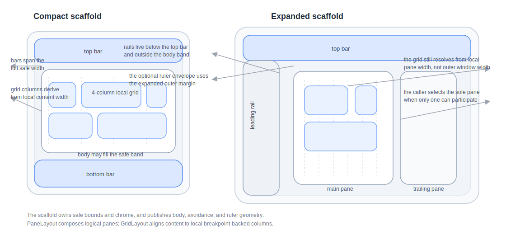

# Roo Windows Material 3 Adaptive Layout Scaffold Design

## Objective

Add a Material 3 layout family to `roo_windows` that closes on the current
container APIs and the current Material 3 layout guidance:

- a top-level scaffold that places bars, rails, and page content against
  caller-supplied safety insets and breakpoint-backed margins,
- a pane layout that builds single-pane, list-detail, supporting-pane, and
  three-pane pages from fixed leading / main / trailing slots,
- a grid layout that applies breakpoint-backed columns, gutters, and margins
  so feeds, forms, and dashboards keep a consistent Material rhythm,
- shared breakpoint and ruler metrics that callers can query without adding a
  CSS-style layout engine,
- and adaptive visibility rules that let higher-level code host a bottom bar,
  navigation rail, drawer trigger, or toolbar in the right layout region
  without pushing that policy down into the components themselves.

The result is a missing middle layer between `roo_windows`' low-level row /
column / flex containers and the Material 3 component families already being
designed under `docs/`. It deliberately stops short of modal shell
management, automatic platform inset discovery, and animated pane
transitions.

## Motivation

`roo_windows` can already build local arrangements with `HorizontalLayout`,
`VerticalLayout`, and `FlexLayout`, but it still lacks the adaptive page-level
structure that makes Material 3 applications look intentional instead of
hand-packed.

The current navigation component work already points at that gap. The
navigation bar, rail, drawer, toolbar, and snackbar designs all defer higher-
level scaffold decisions to a future layout surface. Landing that surface now
creates the place where those families can be composed into good-looking,
breakpoint-aware applications.

## Background

### Current Starting Point in `roo_windows`

The checked-in layout surface is still mostly local and mechanical:

- [src/roo_windows/containers/horizontal_layout.h](../src/roo_windows/containers/horizontal_layout.h)
- [src/roo_windows/containers/vertical_layout.h](../src/roo_windows/containers/vertical_layout.h)
- [src/roo_windows/containers/flex_layout.h](../src/roo_windows/containers/flex_layout.h)
- [src/roo_windows/containers/stacked_layout.h](../src/roo_windows/containers/stacked_layout.h)
- [src/roo_windows/containers/scrollable_panel.h](../src/roo_windows/containers/scrollable_panel.h)

Those containers are useful building blocks, but they do not express the main
Material layout decisions that shape a full application window:

1. there is no shared breakpoint policy,
2. there is no scaffold that knows about bars, rails, margins, or safety
   insets,
3. there is no pane container for list-detail or supporting-pane structure,
4. there is no grid container that keeps cards and forms on breakpoint-backed
   columns,
5. and there is no common way to mirror leading / trailing regions for RTL.

The closest current approximation is
[src/roo_windows/containers/navigation_panel.h](../src/roo_windows/containers/navigation_panel.h).
It places a legacy rail beside a stacked content area, but it is a one-off
composition rather than a general Material layout family:

1. it hard-wires one leading rail plus one stacked content area,
2. it has no breakpoint or margin model,
3. it cannot express supporting panes or grid-backed feeds,
4. and it predates the current Material 3 bar / rail / drawer work.

### Material 3 Signals

This document is aligned against the current Material 3 layout references:

- [Layout overview](https://m3.material.io/foundations/layout/layout-overview/overview)
- [Parts of layout](https://m3.material.io/foundations/layout/layout-overview/parts-of-layout)
- [Canonical layout examples](https://m3.material.io/m3/pages/canonical-examples)
- [Grids and spacing](https://m3.material.io/foundations/layout/understanding-layout/spacing)

The main product signals carried into this design are:

1. new layouts should start from a layout scaffold rather than from ad hoc
   nested rows and columns,
2. layouts should adapt across compact, medium, expanded, large, and extra-
   large breakpoints,
3. bars, rails, panes, drag handles, and rulers are first-class layout
   concepts,
4. canonical starting points are feed, list-detail, and supporting-pane
   layouts,
5. columns, margins, and gutters should change with breakpoint so spacing
   stays legible,
6. all content belongs to panes,
7. rails and navigation chrome belong at the perimeter rather than inside the
   page content itself,
8. layout should mirror for RTL,
9. and good rhythm matters more than dense packing or clever auto-placement.

### Local Design References

The most relevant local references are:

- [material3_navigation_bar_design.md](material3_navigation_bar_design.md)
- [material3_navigation_rail_design.md](material3_navigation_rail_design.md)
- [material3_navigation_drawer_design.md](material3_navigation_drawer_design.md)
- [material3_toolbars_design.md](material3_toolbars_design.md)
- [material3_extended_fab_design.md](material3_extended_fab_design.md)
- [widget_authoring.md](widget_authoring.md)

Those references imply six important local constraints:

1. adaptive layout policy belongs above the base navigation components rather
   than inside each bar / rail / drawer widget,
2. per-instance RAM still matters, so fixed-slot containers should not pay for
   generic child vectors when the child set is structurally fixed,
3. `Panel` remains the right choice for content containers with arbitrary child
   counts,
4. paint and invalidation must stay on the current widget / container
   pipeline,
5. the parent, not the FAB, owns floating placement,
6. and the layout family should be semantic and narrow rather than a partial
   CSS clone.

## Requirements

### Functional Requirements

1. Support compact, medium, expanded, large, and extra-large width
   breakpoints through one shared policy object with repo-default thresholds.
2. Support one top bar slot, one bottom bar slot, one leading rail slot, one
   trailing rail slot, and one body slot on the scaffold.
3. Support per-slot breakpoint visibility rules on the scaffold so callers can
   adapt bottom bars, rails, and toolbars without swapping parent widgets.
4. Support caller-supplied safety insets using
   [src/roo_windows/core/insets.h](../src/roo_windows/core/insets.h).
5. Support one-pane, two-pane, and three-pane page bodies using a dedicated
   pane layout with leading, main, and trailing slots.
6. Support canonical feed, list-detail, and supporting-pane pages without
   introducing separate public widget families for each canonical example.
7. Support optional pane resizing through a drag handle when exactly two panes
   are visible and the side pane is marked resizable.
8. Support a grid layout with breakpoint-backed column counts, margins,
   gutters, and per-item spans.
9. Mirror leading / trailing layout correctly in RTL.
10. Keep scaffold and pane transitions static in v1; animated transitions are
    out of scope.

### Interaction Requirements

1. Breakpoint or inset changes must relayout the whole scaffold deterministically.
2. `LayoutScaffold` must not own routing, destination selection, or drawer
   gesture policy.
3. `PaneLayout` must keep the main pane visible at every breakpoint.
4. `PaneLayout` must collapse side panes before violating the configured main-
   pane minimum width.
5. Drag-handle movement must avoid heap allocation on the hot drag path.
6. `GridLayout` must preserve row-major order and consistent inter-row rhythm;
   v1 must not implement masonry or waterfall packing.
7. Grid items with varying heights must align to a shared row height per row,
   not a per-column waterfall.
8. When a side pane is hidden because width is insufficient, the layout must
   relayout remaining panes rather than clipping the hidden pane.

### API Requirements

1. Expose `material3::LayoutBreakpoint`, `BreakpointRange`,
   `LayoutBreakpointPolicy`, and `LayoutMetrics` as shared layout primitives.
2. Expose one surface-owning `material3::LayoutScaffold` container.
3. Expose one fixed-slot `material3::PaneLayout` container.
4. Expose one arbitrary-child `material3::GridLayout` container.
5. Keep the scaffold semantic: fixed named slots instead of a vector of
   arbitrary positioned children.
6. Keep the pane container semantic: fixed leading / main / trailing slots
   instead of an arbitrary pane list.
7. Keep grid placement narrow: per-item spans and row-major auto flow, not CSS
   grid areas, fractional tracks, or masonry.
8. Keep platform window metrics, fold / hinge discovery, and system inset
   discovery outside the base API.
9. Keep adaptive selection of bottom bar versus rail in the scaffold layer;
   do not push it down into the bar or rail widgets.

### Embedded Constraints

1. Do not allocate on paint, layout, or drag paths.
2. Store scaffold slots as fixed pointers plus small visibility metadata rather
   than as a generic child vector.
3. Store pane slots as fixed pointers plus small per-pane metadata rather than
   as a vector of pane descriptors.
4. Use `Panel` only where arbitrary child count is intrinsic, which is true
   for `GridLayout` but not for `LayoutScaffold` or `PaneLayout`.
5. Use pointer-size-aware size-budget assertions for the new public types.
6. Do not add a CSS-like styling, selector, or auto-layout rule engine.

## Design Overview

The public surface has four pieces:

1. `LayoutBreakpoint`, `BreakpointRange`, `LayoutBreakpointPolicy`, and
   `LayoutMetrics` define the shared breakpoint and ruler model.
2. `LayoutScaffold` owns top-level bars, rails, safety insets, and the body
   region.
3. `PaneLayout` turns one body region into a leading / main / trailing pane
   composition.
4. `GridLayout` arranges arbitrary content on a Material-style column grid.

`LayoutScaffold` is the top-level adaptive shell. It decides which fixed slots
are visible at the current breakpoint, resolves the remaining body bounds, and
applies the scaffold's breakpoint-backed outer margins.

`PaneLayout` is the canonical page-body container. A list-detail screen is a
leading pane plus a main pane. A supporting-pane screen is a main pane plus a
trailing pane. A three-pane screen uses all three slots. No separate public
widget family is needed for each canonical example.

`GridLayout` is the content-density tool. It gives feeds, settings pages,
forms, and dashboards a consistent column rhythm without forcing callers to
hand-compute spans from `FlexLayout` weights and margins.

`LayoutMetrics` closes the Material ruler concept without adding another
container. The scaffold and grid each publish the last resolved breakpoint,
margin, gutter, column count, and column-width data, and callers can ask for
column-start and span bounds when they need aligned overlays or custom paint.



The core decisions are:

1. add a dedicated layout family instead of relying on recipes built from raw
   `HorizontalLayout`, `VerticalLayout`, and `FlexLayout`,
2. keep the top-level scaffold semantic and fixed-slot rather than generic,
3. build the canonical pane examples from one leading / main / trailing pane
   container rather than from multiple bespoke page-layout widgets,
4. ship a real `GridLayout` instead of telling callers to emulate Material
   grids with wrapped flex rows,
5. keep adaptive navigation placement in the scaffold layer,
6. and keep foldables, overlays, animations, and modal shells out of v1.

## Design Details

### Breakpoint Policy and Ruler Metrics

The shared breakpoint model is width-based.

The default policy uses the current Material / Android width-class cut points:

1. compact: `0-599dp`,
2. medium: `600-839dp`,
3. expanded: `840-1199dp`,
4. large: `1200-1599dp`,
5. extra-large: `1600dp+`.

The library resolves layout tokens from that breakpoint:

| Breakpoint | Columns | Outer margin | Gutter |
| --- | ---: | ---: | ---: |
| Compact | 4 | 16dp | 16dp |
| Medium | 8 | 24dp | 16dp |
| Expanded | 12 | 24dp | 24dp |
| Large | 12 | 32dp | 24dp |
| Extra-large | 12 | 40dp | 24dp |

Those numbers are library defaults, not hard-wired law. `LayoutBreakpointPolicy`
lets callers replace the thresholds or the per-breakpoint tokens when a device
family needs tighter or looser spacing.

`LayoutMetrics` stores:

- the resolved breakpoint,
- the local safe bounds used by the owner,
- the local content bounds after margins,
- column count,
- outer margin,
- gutter,
- and the resolved column width.

Column width is:

$$
column\_width = \left\lfloor \frac{W - 2M - (C - 1)G}{C} \right\rfloor
$$

where $W$ is the local safe width, $M$ is the outer margin, $G$ is the
gutter, and $C$ is the column count.

If the configured column count would drive `column_width` below `1px`, the
policy reduces the effective column count until the layout is drawable. This
is a defensive guard for very small emulated windows; it is not the normal
design path.

Ruler helpers on `LayoutMetrics` expose column starts and span bounds. The
design does not add a separate `RulerLayout` class because the metrics object
already closes the real need: callers can align to global columns without
adding a second layout tree.

### `LayoutScaffold`

`LayoutScaffold` derives from `Container`.

That is the same fixed-slot decision used by the newer navigation designs.
The scaffold always owns the same structural regions:

- top bar,
- bottom bar,
- leading rail,
- trailing rail,
- and body.

Using `Panel` here would pay for a generic child vector and a semantic free-
for-all even though the scaffold does not want either. A fixed-slot container
is more explicit and keeps hot-path layout deterministic.

The scaffold stores one pointer and one `BreakpointRange` per optional slot,
plus one required body pointer, one `Insets`, one `LayoutBreakpointPolicy`,
and one cached `LayoutMetrics`. That is a slightly larger static footprint than
an empty `Panel`, but it avoids a heap-backed child vector and matches the
actual structure of a page shell.

#### Slot Visibility

Every optional slot has a `BreakpointRange`.

That range answers only one question: should the slot participate at the
current breakpoint? The scaffold does not instantiate bar or rail widgets, and
it does not try to infer navigation policy from child types.

That boundary is deliberate. The base components stay small and focused, while
the scaffold becomes the first layer that can legally decide, for example,
that a bottom bar belongs on compact and medium widths while a leading rail
belongs on expanded and up.

#### Layout Algorithm

Layout proceeds in six steps:

1. start from the scaffold rect,
2. subtract caller-supplied safety insets,
3. measure and place visible top and bottom bars across the full safe width,
4. measure and place visible leading and trailing rails in the remaining band
   between the bars,
5. inset the remaining body band by the breakpoint-backed outer margin,
6. lay out the body widget in that final content rect.

The scaffold's body width is therefore:

$$
body\_width = W - I_l - I_r - R_l - R_r - 2M
$$

where $W$ is the outer width, $I_l$ and $I_r$ are safety insets, $R_l$ and
$R_r$ are the widths of visible rails, and $M$ is the breakpoint-backed outer
margin.

Two decisions matter here:

1. bars span the full safe width by default, even when rails are visible,
2. rails live between the bars rather than carving holes out of them.

That choice keeps the shell visually stable across breakpoints. Callers that
want a toolbar which excludes the rail can put that toolbar inside the body or
inside a pane instead of making the scaffold solve multiple incompatible bar
models.

#### Surface Ownership

`LayoutScaffold` owns the page background.

That is appropriate for a top-level shell. The scaffold paints the base window
surface using theme-backed defaults, while bars, rails, panes, cards, and
lists still own their own more specific surfaces.

The scaffold does not add a z-layer manager, a FAB anchor slot, or a modal
overlay stack in v1. Those are legitimate future shell features, but they are
not required to land the core layout model.

### `PaneLayout`

`PaneLayout` also derives from `Container` and stores fixed leading, main, and
trailing pane slots.

This container is intentionally narrower than a generic split-pane manager.
Material canonical layouts need exactly these shapes:

1. feed: main pane only,
2. list-detail: leading + main,
3. supporting pane: main + trailing,
4. three pane: leading + main + trailing.

That means one container can cover the canonical page structures without
introducing separate public widget families for each example.

Each optional side pane stores a compact metadata block:

- `min_width`,
- `preferred_width`,
- `BreakpointRange visibility`,
- and one `resizable` bit.

The main pane stores only its widget pointer plus one `main_min_width` value
on the container.

#### Visibility and Collapse Rules

The main pane is always visible.

Leading and trailing panes are candidates only when:

1. a widget is attached in that slot,
2. the current breakpoint falls inside the slot's `BreakpointRange`,
3. and the available width can still preserve `main_min_width` plus all needed
   gutters.

When width is insufficient, collapse order is fixed:

1. trailing collapses first,
2. leading collapses second,
3. main never collapses.

That order keeps detail and supporting context optional while protecting the
main working surface.

The container therefore avoids per-pane priority settings, per-pane overlay
modes, or a general visibility-rule engine. The canonical layouts do not need
that extra policy state.

#### Width Resolution

When one side pane is visible, that side pane gets its preferred width clamped
between its configured minimum and the width that still leaves `main_min_width`
for the main pane.

When both side panes are visible, the layout applies the same clamp to both
side panes, then gives the remainder to the main pane.

The main pane is always the flexible pane. Side panes are never allowed to
steal width below `main_min_width`.

This is intentionally simpler than a desktop window manager:

1. no percentage track list,
2. no pane priority ladder,
3. no separate collapsed-width state,
4. and no hidden overlay pane for compact screens in v1.

That simplicity is the right tradeoff for embedded UIs. The canonical Material
page shapes do not justify a more configurable pane engine yet.

#### Drag Handle

`PaneLayout` supports one drag handle only when exactly two panes are visible
and the visible side pane is marked resizable.

That handle sits on the gutter between the main pane and the side pane. Dragging
it updates one stored side-pane width override and requests relayout.

The three-pane case deliberately does not add two simultaneous handles in v1.
That would add more state, more hit-testing edge cases, and more persistence
policy before the base two-pane behavior is proven out.

#### RTL Behavior

RTL mirroring happens at the container, not at the child widgets.

In LTR, leading is left and trailing is right. In RTL, leading is right and
trailing is left. The API still speaks in logical leading / trailing terms,
which is the correct Material abstraction.

### `GridLayout`

`GridLayout` derives from `Panel`.

Unlike the scaffold and pane containers, grid content truly has arbitrary
child count. A generic child vector is therefore intrinsic rather than
accidental.

Each child carries one `GridSpan` descriptor and one vertical-alignment hint.
`GridSpan` stores the column span to use at each breakpoint. That is a small
per-child cost, but it replaces the much larger cost of repeated custom
layout code in application screens.

#### Why `GridLayout` Exists Beside `FlexLayout`

`FlexLayout` already solves many local arrangements, including wrapping. It is
not enough for Material page grids because it does not own:

1. breakpoint-backed outer margins,
2. shared columns and gutters,
3. span-based width resolution,
4. or stable row rhythm when cards vary in height.

Using wrapped flex rows for feed cards would push those policies into every
screen and make spacing drift likely.

#### Layout Algorithm

`GridLayout` resolves its own local breakpoint from its current width, not
from the outer window width.

That decision is important. A grid inside a narrow supporting pane should be
allowed to drop from an expanded outer breakpoint to a medium or compact local
grid. Material layouts adapt to available space, not to a global window label
in isolation.

Placement is row-major:

1. resolve local `LayoutMetrics`,
2. clamp each child's requested span to `1..columns`,
3. place children in order onto the current row until the next child would
   overflow the row,
4. wrap to the next row when needed,
5. measure each child with an exact span width and wrap-content height,
6. use the tallest child in the row as that row's height,
7. vertically align shorter row peers within that shared row height,
8. use the current gutter as the default inter-row gap.

Span width is:

$$
span\_width(s) = s \cdot column\_width + (s - 1) \cdot gutter
$$

where $s$ is the resolved span in columns.

This design explicitly rejects masonry. Material's grid guidance emphasizes
rhythm and alignment. Variable-height rows are acceptable; waterfall packing is
not.

### Migration Path for Existing Consumers

The existing
[NavigationPanel](../src/roo_windows/containers/navigation_panel.h) remains a
valid consumer-level widget until the new scaffold and Material 3 navigation
surfaces land.

After that, it should become a thin adapter over:

1. `LayoutScaffold`,
2. a future Material 3 navigation rail or bar hosted in scaffold chrome,
3. and a body that is either a `StackedLayout` or a `PaneLayout`.

That migration direction matters because it validates the new shell against a
real local use case instead of keeping the design purely theoretical.

## Proposed API

```cpp
namespace roo_windows::material3 {

enum class LayoutBreakpoint : uint8_t {
  kCompact,
  kMedium,
  kExpanded,
  kLarge,
  kExtraLarge,
};

struct BreakpointRange {
  LayoutBreakpoint min = LayoutBreakpoint::kCompact;
  LayoutBreakpoint max = LayoutBreakpoint::kExtraLarge;

  bool contains(LayoutBreakpoint breakpoint) const;
};

struct BreakpointTokens {
  uint8_t columns;
  int16_t outer_margin_dp;
  int16_t gutter_dp;
};

class LayoutBreakpointPolicy {
 public:
  LayoutBreakpointPolicy();

  LayoutBreakpoint resolve(int16_t width_dp) const;
  const BreakpointTokens& tokens(LayoutBreakpoint breakpoint) const;

  void setCompactMaxWidthDp(int16_t value);
  void setMediumMaxWidthDp(int16_t value);
  void setExpandedMaxWidthDp(int16_t value);
  void setLargeMaxWidthDp(int16_t value);
  void setTokens(LayoutBreakpoint breakpoint, BreakpointTokens tokens);
};

struct LayoutMetrics {
  LayoutBreakpoint breakpoint;
  Rect safe_bounds;
  Rect content_bounds;
  uint8_t columns;
  int16_t outer_margin;
  int16_t gutter;
  int16_t column_width;

  int16_t columnStart(uint8_t column) const;
  Rect spanBounds(uint8_t first_column, uint8_t span, int16_t top,
                  int16_t height) const;
};

class LayoutScaffold : public Container {
 public:
  explicit LayoutScaffold(ApplicationContext& context);

  /// Sets the shared breakpoint and spacing policy used by this scaffold.
  void setBreakpointPolicy(LayoutBreakpointPolicy policy);

  /// Sets caller-supplied safety insets.
  void setSafetyInsets(Insets insets);

  /// Replaces the top bar slot.
  void setTopBar(WidgetRef widget,
                 BreakpointRange visibility = BreakpointRange());
  void clearTopBar();

  /// Replaces the bottom bar slot.
  void setBottomBar(WidgetRef widget,
                    BreakpointRange visibility = BreakpointRange());
  void clearBottomBar();

  /// Replaces the leading rail slot.
  void setLeadingRail(
      WidgetRef widget,
      BreakpointRange visibility = {LayoutBreakpoint::kExpanded,
                                    LayoutBreakpoint::kExtraLarge});
  void clearLeadingRail();

  /// Replaces the trailing rail slot.
  void setTrailingRail(WidgetRef widget,
                       BreakpointRange visibility = BreakpointRange());
  void clearTrailingRail();

  /// Replaces the required body slot.
  void setBody(WidgetRef widget);

  /// Returns the latest resolved scaffold metrics.
  const LayoutMetrics& metrics() const { return metrics_; }

 protected:
  Dimensions onMeasure(WidthSpec width, HeightSpec height) override;
  void onLayout(bool changed, const Rect& rect) override;

 private:
  LayoutBreakpointPolicy policy_;
  Insets safety_insets_;
  LayoutMetrics metrics_;
};

struct PaneSpec {
  int16_t min_width_dp = 280;
  int16_t preferred_width_dp = 360;
  BreakpointRange visibility = {LayoutBreakpoint::kMedium,
                                LayoutBreakpoint::kExtraLarge};
  bool resizable = false;
};

class PaneLayout : public Container {
 public:
  explicit PaneLayout(ApplicationContext& context);

  void setBreakpointPolicy(LayoutBreakpointPolicy policy);
  void setMainMinWidthDp(int16_t width_dp);

  void setLeadingPane(WidgetRef widget, PaneSpec spec = PaneSpec());
  void clearLeadingPane();

  void setMainPane(WidgetRef widget);

  void setTrailingPane(WidgetRef widget, PaneSpec spec = PaneSpec());
  void clearTrailingPane();

  void setDragHandleEnabled(bool enabled);

  const LayoutMetrics& metrics() const { return metrics_; }
  bool isLeadingVisible() const;
  bool isTrailingVisible() const;

 protected:
  Dimensions onMeasure(WidthSpec width, HeightSpec height) override;
  void onLayout(bool changed, const Rect& rect) override;

 private:
  LayoutBreakpointPolicy policy_;
  LayoutMetrics metrics_;
};

struct GridSpan {
  uint8_t compact = 4;
  uint8_t medium = 4;
  uint8_t expanded = 4;
  uint8_t large = 4;
  uint8_t extra_large = 4;
};

class GridLayout : public Panel {
 public:
  struct Params {
    GridSpan span;
    VerticalGravity gravity = kVerticalGravityTop;
  };

  explicit GridLayout(ApplicationContext& context);

  void setBreakpointPolicy(LayoutBreakpointPolicy policy);
  void setRowGap(int16_t gap_dp);

  void add(WidgetRef child, Params params = Params());

  const LayoutMetrics& metrics() const { return metrics_; }

 protected:
  Dimensions onMeasure(WidthSpec width, HeightSpec height) override;
  void onLayout(bool changed, const Rect& rect) override;

 private:
  LayoutBreakpointPolicy policy_;
  LayoutMetrics metrics_;
};

}  // namespace roo_windows::material3
```

Notes:

1. `LayoutScaffold` and `PaneLayout` are expected to land fully rather than as
   placeholders.
2. `GridLayout` must also land fully because its API shape is tightly coupled
   to its row-major packing behavior.
3. No API in this family should emit `LOG(WARNING)` fallback behavior for
   "future overlay panes" or "future foldables". Those features are not part
   of the initial contract.

## Implementation Plan

Implementation work for these phases follows the repo-local
[roo_windows widget authoring instruction](../.github/instructions/roo-windows-widget-authoring.instructions.md).

### Phase 1: Declare Breakpoint Policy and Size Budgets

Code slice:

1. Add `LayoutBreakpoint`, `BreakpointRange`, `BreakpointTokens`,
   `LayoutBreakpointPolicy`, and `LayoutMetrics`.
2. Add fixed-slot declarations for `LayoutScaffold` and `PaneLayout`, plus the
   initial `GridLayout` declaration.
3. Add pointer-size-aware size-budget assertions for the new public types.
4. Do not implement slot layout, pane collapse, drag handling, or grid packing
   yet.

Proposed commit message:

> Material 3 layout scaffold Phase 1: declare the adaptive layout primitives.
>
> Add the shared breakpoint and ruler model together with the public
> `LayoutScaffold`, `PaneLayout`, and `GridLayout` declarations from
> `docs/material3_layout_scaffold_design.md`, plus size-budget tests for the
> fixed-slot containers.

Validation: add `material3_layout_scaffold_test` and run
`bazel test //:material3_layout_scaffold_test` from the `roo_windows`
workspace.

### Phase 2: Implement `LayoutScaffold`

Code slice:

1. Implement breakpoint resolution, safety-inset handling, and cached
   `LayoutMetrics` on `LayoutScaffold`.
2. Implement full-width top / bottom bar placement and perimeter rail
   placement with per-slot `BreakpointRange` visibility.
3. Paint the scaffold-owned background on the current `Container` surface
   pipeline.
4. Add focused tests and goldens for compact, medium, expanded, and RTL slot
   placement.

Proposed commit message:

> Material 3 layout scaffold Phase 2: implement the scaffold shell.
>
> Add `LayoutScaffold` measurement, layout, slot visibility, safety insets, and
> scaffold-surface paint so Material bars, rails, and body content share one
> adaptive page shell.

Validation: run `bazel test //:material3_layout_scaffold_test` and
`bazel test //:material3_layout_scaffold_golden_test` with scaffold-focused
cases.

### Phase 3: Implement `PaneLayout`

Code slice:

1. Implement leading / main / trailing pane measurement and the fixed collapse
   order.
2. Enforce `main_min_width_dp` before allowing side panes to remain visible.
3. Implement the optional two-pane drag handle for resizable side panes.
4. Add focused tests and goldens for list-detail, supporting-pane, three-pane,
   collapse, and RTL mirroring.

Proposed commit message:

> Material 3 layout scaffold Phase 3: implement adaptive pane layout.
>
> Add `PaneLayout` as the shared leading / main / trailing page-body container,
> including breakpoint-gated side panes, deterministic collapse, and the first
> drag-handle path for two-pane layouts.

Validation: run `bazel test //:material3_pane_layout_test` and
`bazel test //:material3_layout_scaffold_golden_test` with pane-focused cases.

### Phase 4: Implement `GridLayout`

Code slice:

1. Implement local breakpoint resolution and local `LayoutMetrics` on
   `GridLayout`.
2. Implement span-based row-major packing with shared row heights and default
   gutter-backed row gaps.
3. Clamp over-wide spans to the available column count.
4. Add focused tests and goldens for compact, medium, and expanded grid spans,
   mixed-height rows, and local-breakpoint behavior inside a narrow pane.

Proposed commit message:

> Material 3 layout scaffold Phase 4: add Material grid layout.
>
> Add `GridLayout` as the breakpoint-aware grid container for feeds, forms, and
> dashboards, including span-based packing and shared row rhythm without
> masonry.

Validation: run `bazel test //:material3_grid_layout_test` and
`bazel test //:material3_layout_scaffold_golden_test` with grid-focused cases.

### Phase 5: Add Example Coverage and Migrate One Real Consumer

Code slice:

1. Add a layout catalog example under
   `examples/material3/layout_scaffold/layout_scaffold.ino`.
2. Exercise one compact bottom-bar shell, one expanded rail shell, one
   list-detail page, and one grid-backed feed page.
3. Migrate either `NavigationPanel` or a similarly small existing example onto
   the new scaffold family so the API proves itself against a local consumer.
4. Add focused example build coverage for the new example path.

Proposed commit message:

> Material 3 layout scaffold Phase 5: add examples and migrate one consumer.
>
> Add a representative layout catalog example and move one local shell onto the
> new scaffold APIs so the design is validated against real `roo_windows`
> composition code.

Validation: run `bazel test //:material3_layout_scaffold_test`,
`bazel test //:material3_pane_layout_test`,
`bazel test //:material3_grid_layout_test`,
`bazel test //:material3_layout_scaffold_golden_test`, and build the example
that hosts `examples/material3/layout_scaffold/layout_scaffold.ino`.

## Testing Plan

Validation coverage should include:

1. `material3_layout_scaffold_test` for breakpoint resolution, per-slot
   visibility, safety insets, margin calculation, and size-budget assertions.
2. `material3_layout_scaffold_golden_test` for compact and expanded shell
   geometry, RTL mirroring, bar / rail placement, pane placement, and grid
   packing.
3. `material3_pane_layout_test` for side-pane collapse, `main_min_width_dp`,
   width clamping, and two-pane drag handling.
4. `material3_grid_layout_test` for span clamping, mixed-height rows, row
   wrapping, row-gap behavior, and local breakpoint resolution in nested grids.
5. Example compilation for
   `examples/material3/layout_scaffold/layout_scaffold.ino`.

## Caveats

### Rejected Alternatives

#### Tell Callers to Compose Everything From Existing Rows, Columns, and Flex

This was rejected.

That recipe would keep the API surface small, but it would also push
breakpoint rules, margins, pane-collapse policy, and grid math into every
application. The result would be local flexibility at the cost of visual drift
and repeated code.

#### Add Separate Public Widgets for Feed, List-Detail, and Supporting-Pane

This was rejected.

Those are canonical page recipes, not fundamentally different storage shapes.
One `PaneLayout` with leading / main / trailing slots covers all three without
tripling the public surface.

#### Build a Partial CSS Grid / CSS Layout Engine

This was rejected.

`roo_windows` does not need named areas, percentage track lists, auto-placement
rules, or selector-driven layout policy to satisfy Material 3. Those features
would add API surface and implementation cost well beyond the current problem.

#### Let the Scaffold Automatically Infer Behavior From Child Types

This was rejected.

The scaffold should not inspect whether a child "looks like" a navigation bar,
rail, toolbar, or drawer. That would couple the shell to specific component
families and make the adaptive boundary implicit instead of explicit.

#### Add Overlay Panes and Three-Pane Multi-Handle Resizing in v1

This was rejected.

Material does describe more advanced layered layouts, but the base need in
`roo_windows` is still canonical page structure. Overlay panes and multiple
simultaneous resize handles would widen the state model before the simple
two-pane path is validated.

#### Auto-Discover Platform Insets and Fold / Hinge Geometry in the Base API

This was rejected.

Those data sources are backend- and platform-specific. The base layout family
should accept explicit insets and explicit geometry from the caller rather than
pretending that all targets can discover them locally.

## Future Work

1. Add a scaffold-level floating slot for FABs, snackbars, and other promoted
   overlays once the repo has a stable layering policy.
2. Add overlay / levitate pane presentation for compact supporting-pane flows.
3. Add persisted splitter positions and a second handle path for true
   three-pane desktop layouts.
4. Add foldable hinge / spacer integration once `roo_windows` has a stable
   way to receive posture geometry from the host platform.
5. Add a higher-level adaptive navigation shell that wires future Material 3
   bar, rail, and drawer widgets into one convenience API.