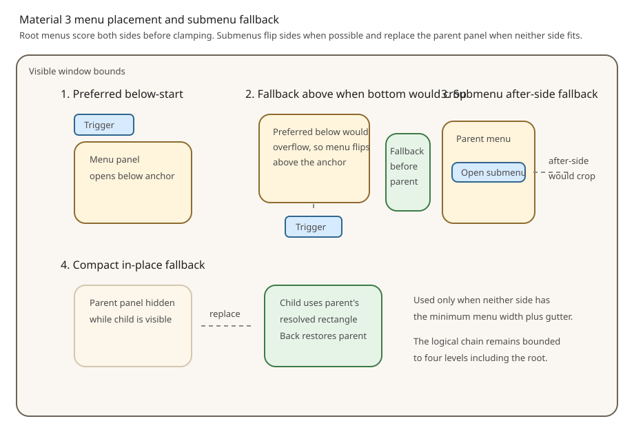

# Roo Windows Material 3 Menus Design

## Objective

Add an anchored, grouped, selectable Material Design 3 menu family with bounded
submenu navigation on the shared transient host, without representing temporary
popup UI as an application route or restyling the legacy menu composite.

## Motivation

`roo_windows` has a legacy full-screen menu composite and a dialog-specific
root attachment path, but no general host for short-lived popup or modal
surfaces. Modeling each menu opening as a popup `Task` would apply navigation
ownership and persistent task-lifecycle semantics to UI that is not a route,
while also leaving
no supported way to remove the temporary task.

Menus therefore use the shared `MainWindow` transient-surface host for
structural attachment, layering, input isolation, focus, and teardown, then add
a Material 3 presenter and widget family above it.

The host is shared with future Material dialogs at the infrastructure boundary.
Dialog chrome, menu selection, submenu chains, anchor placement, and component
results remain component-specific.

## Background

**Status: Proposed; P1.6 menu reconciliation complete.** None of the defined
menu implementation scope is implemented. The shared composite host,
synchronous source-capture contract, and presenter-pin integration are
specified separately by
[Transient surface hosting](transient_surface_host_design.md)
and must land before menu presentation. Menus do not create or enter a `Task`.
Each presentation nevertheless names one existing task as its interaction owner
for focus, physical keys, Back context, and teardown. Existing and outstanding
prerequisites are recorded in the [status index](../README.md).

### Current Framework Surface

The relevant implemented pieces are:

- [`TransientPresentationSlot`](../../../src/roo_windows/core/transient_presentation.h),
  which provides one root interactive-transient registration per window and
  detach-before-completion ordering,
- [`MainWindow`](../../../src/roo_windows/core/main_window.h), which owns regular,
  popup, scrim, and dialog paint layers,
- the legacy [`Dialog`](../../../src/roo_windows/dialogs/dialog.h), which already
  uses the transient slot and attaches its surface and scrim directly to
  `MainWindow`,
- [`FocusManager`](../../../src/roo_windows/core/focus_manager.h), which provides
  focused-widget lifetime tracking and traversal but does not yet activate or
  restore the declared `FocusScope` records,
- the [`PresentationPin`](../../../src/roo_windows/core/presentation_pin.h) host,
  which currently requires a live widget anchor,
- the Material 3 list substrate in
  [`material3/list/list.h`](../../../src/roo_windows/material3/list/list.h),
- the owner-painted [`material3::Badge`](../../../src/roo_windows/material3/badge/badge.h),
- and [`PaintContext`](../../../src/roo_windows/core/paint_context.h).

The missing implementations are:

- no detachable, non-route composite transient surface host,
- no explicit host-to-task association,
- no display-wide ordinary-key barrier for a hosted transient,
- no active focus-scope enter/exit runtime,
- and no owner-scoped rectangle presentation pin for copied trigger paint.

The structural host and synchronous source-capture contract are owned by
[Transient surface hosting](transient_surface_host_design.md).
Active focus behavior is already specified by
[Non-touch input](../implemented/non_touch_input_design.md#focus-scope-storage-and-resolution),
and rect-anchored painting by
[Transient presentation pins](../in_progress/transient_presentation_pins_design.md).
The roadmap completes those framework prerequisites before this design's menu
phases. The menu does not depend on adding popup-task removal.

### Task and Transient Semantics

The shared [design glossary](../glossary.md) defines a `Task` as the interaction
owner for one persistent region of application UI and a menu as an interactive
transient. That distinction is preserved:

- a menu never calls `Application::addPopup()` or an `Application::addTask()`
  overload,
- a menu never installs a `Destination`,
- `show()` explicitly receives the existing task whose focus and input context
  the menu uses,
- its Back behavior comes only from its root transient registration,
- and its surface is attached only for one presentation.

### Material 3 Sources

The normative sources are:

- [Material 3 menus overview](https://m3.material.io/components/menus/overview),
- [Material 3 menus specs](https://m3.material.io/components/menus/specs),
- [Material 3 menus guidelines](https://m3.material.io/components/menus/guidelines),
- and the pinned AndroidX Material 3
  [`MenuDefaults`](https://android.googlesource.com/platform/frameworks/support/+/0624f640fd3a47edfcf8a070f609d278fb5eb41b/compose/material3/material3/src/commonMain/kotlin/androidx/compose/material3/MenuDefaults.kt)
  and generated menu-token files at the same revision.

The pinned implementation source makes token names and geometry reproducible.
Roo Windows owns its local token table and imports no Android runtime dependency.

The proposal follows these signals:

- baseline and expressive menus remain supported,
- expressive menus provide standard surface-based and vibrant tertiary-based
  color styles,
- a row has one semantic action,
- gaps group expressive sections but are not used in scrollable menus,
- submenus open beside their parent when the viewport permits,
- and single-select and multi-select interactions are distinct.

### Badge, Paint, and List Implications

`Badge` is a paint helper rather than a widget. An item exposes badge content,
and the bound row owns the live helper and its layout cache.

`PaintContext` remains the only widget paint authoring surface. Checkmarks,
shortcut text, trailing icons, badges, submenu chevrons, and active-state
geometry use it; no menu-only `Canvas`/`Clipper` pipeline is introduced.

Menus reuse `ListItem`, `ListEntry`, `SelectionMode`, and
`ListEntryVisualContext`, but not `material3::List`. `List` owns list-specific
selection and separator rules that do not match popup grouping or submenu
chains.

### Authoring Constraints

The canonical
[widget-authoring guidance](../../../.github/instructions/roo-windows-widget-authoring.instructions.md)
requires RAM-first, pay-for-what-you-use APIs, explicit surface ownership,
theme-resolved geometry and colors, no hot-path allocation, and focused
examples for user-visible behavior.

Accordingly:

- the common host is one `MainWindow` service rather than state on every widget,
- presenters own a persistent root overlay and temporary child-level state,
- item actions and rare behavior use virtual hooks rather than stored
  `std::function` objects,
- optional trailing payloads allocate only during configuration or binding,
- and every implementation phase measures its new objects on the configured
  32-bit target ABI.

## Requirements

### Functional Requirements

1. Support baseline and expressive menus.
2. Support expressive standard and vibrant color styles.
3. Open synchronously from live buttons, icon buttons, text fields,
   caller-provided rectangles, and context points without retaining the source
   widget.
4. Support grouped menus with dividers or expressive gaps.
5. Use a persistent scrollbar when content exceeds available height.
6. Support disabled, hovered, focused, pressed, selected, and active-submenu
   row states.
7. Support single-select and multi-select menus.
8. Support headline and optional supporting text, leading visuals, shortcut
   text, trailing icons, badges, checkmarks, and submenu chevrons.
9. Keep the root trigger visually pressed while its chain is open when an
   optional live trigger-paint source is supplied at show or reanchor time.
10. Dismiss on a completed primary outside tap, root Back/Escape, or a leaf
    whose resolved policy is `kDismiss`.
11. Keep one semantic action per row.
12. Keep the legacy menu composite available during migration.

### Framework Prerequisite Requirements

1. The menu-hosting phases of
   [Transient surface hosting](transient_surface_host_design.md) are implemented
   before root menu presentation.
2. The host admits the menu with its popup profile: one transparent composite
   host layer, a replacement-enabled request, outside dismissal, display-wide
   coverage, and mandatory focus capture through the presenter-owned
   `FocusScope`. Back and Escape use presenter handling so the menu can close
   its deepest child before dismissing the root chain.
3. The host borrows the presenter-owned `MenuOverlay` only after successful
   admission and detaches it before menu completion.
4. The menu uses the host's one optional owner-scoped rectangle pin for copied
   trigger paint; allocation failure omits only that visual.
5. Hosted menus and legacy or standalone root transients contend through the
   window's one canonical slot. Scheduled hosted modals are nonreplaceable;
   legacy and standalone slot occupants have no hosted replaceability
   declaration. Showing a menu during any of those conflicts returns busy, and
   the menu never creates a task.
6. Before enabling display-wide menu input, the host cancels any covered lower-
   layer pointer stream and armed key activation. It does not let the opening
   release activate both the trigger and a newly attached menu target.
7. The framework supplies one shared, allocation-free source-capture helper that
   validates a widget by walking its parent chain to the expected `MainWindow`
   and exact interaction-owner task layer. The helper rejects a detached root,
   a descendant of a detached mini-tree, and a source inside any
   `TransientHostLayer`; it does not call a root accessor through an unproven
   parent chain.

### Lifetime and Ownership Requirements

1. A presenter never retains a trigger widget, placement widget, destination,
   or application listener. The shared host temporarily retains the explicitly
   supplied interaction owner and closes before that task detaches.
2. The widget-placement `show()` and `reanchor()` overloads synchronously
   resolve a required live placement source. Rectangle overloads consume
   caller-supplied window coordinates. Every overload independently attempts
   to capture an optional live trigger source.
3. A required placement source must be attached in the interaction owner's
   top-level task layer. Invalid placement makes `show()` return
   `kAnchorUnavailable` or `reanchor()` return `false` before the operation
   mutates an active presentation. An invalid optional trigger does not fail
   placement or admission; the operation continues without a trigger pin.
4. Each operation copies resolved window-coordinate geometry, the menu's
   configured layout direction, and valid optional trigger paint, then retains
   no source widget, layer identity, or observer.
5. Copied placement and trigger paint remain frozen after the call. Descendant
   source detachment and destination or task-content replacement do not move or
   close the menu; interaction-owner detachment still closes it through the
   host.
6. A borrowed root group remains live until `clearGroups()` removes it or the
   `Menu` is destroyed, including idle periods between presentations. A row
   borrowed by `MenuGroup` remains live until `MenuGroup::clear()` or group
   destruction. A borrowed child-level group supplied to
   `MenuLevelBuilder` needs to outlive only that active child level. An item
   supplied to a separate `MenuEntry` outlives replacement or entry
   destruction, and its slot widgets outlive that item configuration. Before
   an inline-owned item dies, its row clears the `ListEntry` binding; group
   destruction detaches every remaining row, and ordinary `WidgetRef`
   detachment deletes adopted content exactly once. A `Menu` subclass that
   supplies borrowed root structure from inline members calls the protected
   pre-destruction seam before those members die.
7. Submenu population targets only the scoped child-level builder.
8. Completion runs after input is disabled, pins are hidden, focus is exited,
   every child level is detached, and the host has detached the root overlay.
   Persistent root groups and rows remain attached inside that inactive overlay
   until explicit root-structure mutation or presenter destruction.
9. Invocation hooks may mutate application state, but must not destroy an
   attached borrowed item or active presenter before returning. A post-detach
   completion hook may destroy or reopen the presenter because presenter
   destruction clears its persistent tree. Independently destroying a borrowed
   root group, row, or item still requires its documented clear, replacement,
   or presenter-destruction endpoint first.
10. After invocation, menu code revalidates registration and level generation
   before accessing presenter state and never dereferences the item again.
11. A bound `MenuEntry` retains only a temporary presenter pointer plus bounded
    level, row, and generation identity while attached to an active menu level.
    Level detachment clears that binding before application completion.
12. After host focus exit and before application completion, the menu clears
    its scope's remembered row so the next show follows the initial-focus rule.
    It also clears that memory before idle root-structure mutation. An inactive
    persistent menu therefore retains no stale row into caller code.
13. Standard-item text, icon, and leading-widget configuration is a documented
    stable borrow whose backing objects outlive replacement, clearing, or item
    destruction as specified by the API; presentation calls never create such
    borrows implicitly.
14. A `Menu` rejects configuration and root-structure mutation for the complete
    synchronous duration of its own `show()` call, not merely while its
    registration is active. This prevents outgoing replacement completion from
    changing already-captured policy or the incoming root tree mid-admission.

### Memory and Allocation Requirements

1. Do not increase `Widget`, `SurfaceWidget`, `Container`, `ListItem`, or
   `ListEntry` size.
2. Keep chain state on the temporary presenter, not rows or the global host.
   A row's temporary presenter pointer and bounded level/row/generation dispatch
   identity are not a second copy of the chain.
3. Keep action dispatch virtual; add no per-item `std::function` storage.
4. Make shortcut, badge, and trailing-icon payloads pay only when used.
5. Allocate nothing during paint, layout, hover, focus movement, scroll, or
   placement.
6. Bound logical and simultaneously visible depth to four levels including the
   root. At level four, submenu-bearing rows are disabled, omit the chevron,
   and do not populate another level.
7. Measure persistent sizes and total live-presentation heap use on the
   configured 32-bit target ABI.

### Placement and Interaction Requirements

1. Store anchor rectangles in `MainWindow` coordinates.
2. Constrain width and height before `std::clamp`; clamp bounds stay ordered.
3. Support below, above, before, and after preferences with RTL-aware alignment.
4. Score all candidates deterministically, then clamp only the winner.
5. Cascade after or before the opener with a fixed gutter when a side satisfies
   minimum menu width.
6. When neither side does, replace the visible parent panel in place; Back
   restores it.
7. Gaps are expressive-only and non-scrollable-only. Scrolling coerces them to
   dividers before final layout.
8. Every outside pointer stream is absorbed without reaching lower content.
   Only a completed primary outside tap dismisses the chain; a drag or canceled
   tap is absorbed without dismissal.

### Paint and Content Requirements

1. `PaintContext` is the only public menu paint surface.
2. Adornments reserve a trailing lane and paint front-to-back, adding exclusions
   only after their pixels are final.
3. Shared list slots own their text-rendering widgets, read headline and
   supporting-text backing through documented stable borrows, and temporarily
   attach a configured borrowed leading widget.
4. Standard trailing content remains outside `ListItem::trailing()`; custom
   rows may opt into a trailing widget explicitly.
5. Slot widgets are passive; the row remains the only action.
6. One-line text uses the lightweight path; supporting or wrapping text pays for
   heavier widgets only when requested.
7. The menu overlay is explicitly a surface-owning area-overlay container: it
   owns its panel children and their hit testing but emits no background pixels.
   The combined host layer owns outside-input isolation, and host detachment
   invalidates revealed lower layers.

## Design Overview

### Scope

In scope:

- popup Material 3 menus,
- baseline and expressive variants,
- grouped and scrollable panels,
- selection,
- cascading and compact in-place submenus,
- list-backed rows,
- focus and keyboard behavior,
- synchronous live-source capture with copied placement and trigger paint,
- and focused examples and migration documentation.

Out of scope:

- bottom-sheet adaptation,
- menus nested above an active modal dialog,
- autocomplete or filtered menus,
- density variants,
- recycled virtualization,
- hover-to-open submenus,
- and animated expressive shape morphing.

### Core Structure

The stack has five parts:

1. The prerequisite `TransientSurfaceHost` is the non-widget `MainWindow`
   coordinator shared by menus and later presenters. It owns admission and
   drives the reusable composite `TransientHostLayer`, interaction-owner
   association, focus activation, and teardown.
2. `material3::Menu` is the one registered presenter for a chain. It owns copied
   placement and trigger-paint data, policies, its mandatory focus scope,
   overlay, level records, and dismissal.
3. `MenuOverlay` is the presenter-owned, full-window area-overlay container
   attached through the host. It hosts every visible `MenuPanel` and emits no
   background pixels.
4. `MenuPanel` owns one level's popup surface, optional scroll wrapper, and
   `MenuGroup` children.
5. `MenuEntry` derives from `ListEntry` and adds menu semantics and owner-painted
   trailing adornments without changing `ListEntry`. While attached, each entry
   is bound to its owning `Menu` and one level/row/generation tuple so touch and
   keyboard activation can route through the presenter rather than invoke the
   `ListItem` directly.

```text
MainWindow
├── regular and popup task layers
└── composite transient host layer (transparent popup profile)
    └── MenuOverlay (borrowed popup root, full window)
        ├── MenuPanel (root)
        ├── MenuPanel (child, when cascading)
        └── MenuPanel (deeper child, when cascading)
```

### Key Decisions

1. Menus use the shared host and do not create a `Task`, install a
   `Destination`, or call dialog APIs; they explicitly borrow an existing task
   as interaction owner.
2. Future hosted dialogs and menus share hosting, focus, isolation, and
   teardown, but retain separate presenters and surfaces.
3. One chain uses one registration, host session, focus scope, and overlay.
4. Items, entries, selection enums, and visual context are reused; `List` is not.
5. Selection mutation is item-owned through virtual hooks.
6. Submenu population uses a scoped `MenuLevelBuilder`, not `Menu&`.
7. Placement and trigger paint are captured from live sources and then frozen.
   Only explicit `reanchor()` with new live sources moves a visible menu or
   refreshes its trigger pin.
8. The standard path uses owner-painted adornments and no embedded controls.
9. Submenus fall back to in-place navigation on narrow viewports and never
   overlap the opener.
10. Static item text, drawables, and leading widgets use explicit stable
    configuration borrows; show and reanchor sources remain synchronous only.

The major pieces map to the requirements as follows:

| Solution element | Requirement connection |
| --- | --- |
| shared host, explicit interaction owner, and presenter scope | supplies the framework-prerequisite behavior, one-root admission, input isolation, focus, Back, and owner teardown |
| persistent root overlay and group tree | preserves reusable menu configuration while making root-group and row ownership endpoints explicit |
| bounded level records and scoped `MenuLevelBuilder` | implements submenu ownership, depth, generation revalidation, compact fallback, and deepest-first Back |
| synchronous source capture, frozen rectangles, and explicit `reanchor()` | satisfies source-lifetime and placement requirements without widget observers or durable layer identity |
| menu-local admission guard | keeps policy and root structure stable across replacement completion during `show()` |
| `MenuItem`, `MenuEntry`, and owner-painted adornments | reuse list semantics, keep one action per row, and avoid embedded controls on the standard path |
| deterministic candidate scoring and constrained scrolling | supplies RTL-aware placement, ordered clamping, persistent scrollbars, and separator coercion |
| virtual item/presenter hooks plus measured ceilings | avoids per-item callback storage and verifies the memory/allocation requirements |

## Design Details

### Host Integration

The normative structural, admission, focus, barrier, source-capture, pin, and
teardown contracts are defined by
[Transient surface hosting](transient_surface_host_design.md). The menu requests
replacement, paints no scrim, dismisses on a completed primary outside tap,
covers the display, and captures focus through its embedded `FocusScope`. A
request can replace any active occupant that declares itself replaceable; the
scheduled hosted modal profiles do not, while a legacy or standalone slot
occupant has no hosted replaceability declaration. Those conflicts return
busy. The task supplied to `show()` is the immutable interaction owner. The
host derives the receiving window from that task and never infers an owner
from focus, z-order, or a source widget.

`MenuOverlay` is the one borrowed presenter root. It occupies the window for
panel layout but returns no touch target outside visible panels. The combined
host layer then becomes the transparent outside target, consumes the stream,
and dismisses on completed activation. Only successful host admission attaches
the overlay or permits the optional trigger pin.

During menu finish, the presenter disables row/key dispatch, unbinds every
entry, and closes and detaches descendant levels before returning from its
registration detach hook. Focus exit can then record the last root row. After
the host detaches the root and vacates the slot, the registration's component
completion clears that record before invoking the overridable `onFinished()`.
The root panel and its groups remain a persistent configuration subtree inside
`MenuOverlay`; the host detaches that overlay from the composite layer and then
completes its generic pin, focus, layer, slot, and completion ordering.
Post-completion code performs no presenter access.

### Synchronous Source Capture

`show()` receives the explicit interaction owner and a live placement widget.
The widget overload copies its window-coordinate bounds. Both overloads copy
`MenuPolicy::layout_direction`; Roo Windows has no generic widget or task
layout-direction property from which to infer it.
The rectangle overload has no placement widget: it copies caller-supplied
window coordinates. A context-point menu uses this overload with a one-pixel
rectangle and receives no guarantee that the point still corresponds to an
attached widget. After rejecting an already-active or reentrant call, `show()`
raises a menu-local admission guard before reading policy or sources and clears
it on every return. `setPolicy()` requires both an idle registration and a
clear admission guard, so every active chain uses one immutable configured policy.
`reanchor()` recaptures geometry under that same policy rather than becoming a
policy-update mechanism.

Either overload accepts an optional trigger-paint source that can differ from
the placement widget. Both sources use the framework's shared
`internal::captureTransientSourceGeometry()` helper. The helper first resolves
the explicit owner's live top-level `TaskPanel`, then walks `Widget::parent()`
from the source until it reaches the expected `MainWindow` or a null parent,
rejecting immediately if it encounters a `TransientHostLayer` anywhere in
that ancestry. It accepts only when the
direct child below the window is the exact owner panel. Only after both proofs
does it call geometry accessors and copy the full and visible bounds in window
coordinates. It never calls
`Widget::getMainWindow() const` on an unproven chain. Consequently, a root with
no parent, a descendant whose mini-tree has no window parent, a foreign
task/window source, a source in the display-wide host, and a source in a host
nested beneath the owner panel by task coverage all fail even when
`source.getTask()` happens to equal the explicit owner.

Before replacement or admission, the menu captures the required placement
source through this helper. Placement failure returns `kAnchorUnavailable`
without changing the visible menu. The menu captures the trigger independently;
a detached, foreign-window, different-owner, or host-layer trigger is omitted,
as is a pin whose allocation fails. Source capture is complete before a
replacement completion callback runs, so that callback can destroy the former
source without invalidating the copied geometry.

Relayout, descendant detachment, destination changes, and task-content changes
do not move the open menu
or its trigger paint. `reanchor()` repeats the live validation, resolves
placement again, and invalidates the old and new rectangles. Its optional
trigger argument is a complete replacement: a valid non-null source recaptures
the pin, while null or an invalid source removes it. Invalid required placement
returns `false` and preserves the old placement and pin. Valid placement with
an invalid trigger returns `true`, moves the menu, and removes the old pin.
Moving placement to a source in another top-level layer is intentionally
unsupported.

### Root Placement

Placement is in window coordinates. Let $V$ be visible window bounds inset by
margin $m$, $A$ the anchor, $(w_d,h_d)$ desired size, and $(w,h)$ constrained
size:

$$
w = \min(w_d, V.width), \qquad h = \min(h_d, V.height)
$$

When $h_d > h$, the panel scrolls. When $w_d > w$, rows remeasure under the
constrained width. Every later clamp therefore has ordered bounds.

For `kBelowStart` in LTR, candidate order is below-start, below-end,
above-start, above-end, after-start, before-start. Other preferences rotate the
order; start/end and before/after mirror in RTL.

Scoring is lexicographic:

1. fully fits $V$,
2. remains on the preferred side,
3. maximizes visible area before clamping,
4. preserves requested alignment,
5. keeps the earlier candidate index.

Only the winner is clamped:

$$
x = \operatorname{clamp}(x_c, V.left, V.right - w + 1)
$$

$$
y = \operatorname{clamp}(y_c, V.top, V.bottom - h + 1)
$$



### Submenu Placement and Compact Fallback

A child first measures desired width. The presenter computes space after and
before the opener, excluding the gutter.

- Use the preferred side when it satisfies minimum menu width.
- Otherwise use the opposite side when it satisfies the minimum.
- Otherwise replace the parent panel at its resolved rectangle. The parent is
  `kGone`; Back removes the child and restores parent panel and opener focus.

This preserves one logical chain and never overlaps the opener. It is not
bottom-sheet adaptation and needs no second registration.

Each level stores parent index, opener row index, generation, rectangle, and
cascading/in-place mode. It stores no caller-owned submenu pointer. The four
records bound both cascading and in-place ancestry; a submenu-bearing row in
the fourth level binds as disabled and without a chevron.

### Surface Ownership and Paint Ordering

- `TransientSurfaceHost` coordinates admission, interaction ownership, and
  teardown; its `TransientHostLayer` owns combined structure and
  barrier/scrim paint.
- `MenuOverlay` owns area-overlay and child-host semantics but emits no
  background pixels. It reports a transparent background and never claims
  opaque rectangular coverage.
- `MenuPanel` owns popup background, outline, elevation, and scroll viewport.
- `MenuGroup` owns row sequence and separator spacing but emits no background;
  uncovered gaps reveal the `MenuPanel` surface for both standard and vibrant
  color styles. Like the overlay, it reports transparent background and false
  opaque coverage so invalidation does not treat those gaps as filled.
- `MenuEntry` owns row state layers and final adornment pixels.

`MenuEntry::paintWidgetContents()` paints front-most adornments, excludes only
fully settled pixels, then delegates to the `ListEntry`/`Container` path. The
reserved lane prevents overlap with list slot children.

### Menu Tokens

Geometry and colors live in shared const tables referenced by variant:

| Token | Baseline | Expressive |
| --- | ---: | ---: |
| minimum width | 112 dp | 112 dp |
| maximum preferred width | 280 dp | 280 dp |
| horizontal item padding | 12 dp | 12 dp |
| minimum one-line height | 48 dp | list-token resolved |
| leading/trailing icon | 24 dp | 20 dp |
| trailing-lane gap | 12 dp | 16 dp |
| group gap | prohibited | 2 dp |
| divider inset | 12 dp | 12 dp |
| viewport margin | 8 dp | 8 dp |
| submenu gutter | 4 dp | 4 dp |

Baseline shape, elevation, typography, and state colors map to landed Material
menu/list roles. Expressive group and item shapes map to the pinned
`SegmentedMenuTokens`: leading, middle, trailing, standalone, selected, and
inactive. Standard expressive colors use surface roles; vibrant colors use
tertiary-container roles. Disabled opacity reuses list disabled tokens.

The table summarizes the principal layout values. `menu_tokens.h` transcribes
the complete set of menu roles used by this design from the pinned source
revision, and a field-by-field mapping test fails when any role is omitted.
When prose on the Material site and the pinned AndroidX tokens differ, the
pinned tokens are normative for this implementation; changing the revision is
a separate reviewed design update. Row and panel code never selects visual
tokens ad hoc.

### Content and Trailing Adornments

`MenuItem` extends `ListItem` with enabled, selection, submenu, dismissal, and
invocation hooks. `StandardMenuItem` stores two text views, optional leading
widget, packed state, and a pointer to an optional trailing payload.

`StandardMenuItem` explicitly implements the inherited headline, supporting-
text, and leading-slot accessors, along with every enabled and selection hook.
This is required for `ListEntry` binding to observe its configured content and
for menu selection to observe mutations immediately. Its trailing-affordance
override exposes the optional payload without installing it as
`ListItem::trailing()`.

The payload contains shortcut text, trailing drawable, and badge content. It is
created only by corresponding setters. A badged binding materializes row-owned
`Badge` state. Configuration and binding may allocate; paint, measure, layout,
focus, and scroll do not.

Custom items needing a trailing child use a custom `MenuEntry`; the standard
path never exposes a borrowed `Badge*` or interactive trailing control.

### Selection and Invocation

Selection is item-owned through `isSelectable()`, `isSelected()`, and
`setSelectedFromMenu(bool)`. A custom selectable item must make a mutation
synchronously observable through `isSelected()`.

`MenuEntry` deliberately bypasses `ListEntry`'s direct `ListItem::invoke()`
path. A direct item call cannot apply menu selection, submenu, dismissal, or
post-hook generation checks. When an entry attaches to a level, `Menu` binds it
to the presenter and records the level index, row index, and current level
generation. Detachment clears the presenter pointer before the row or item can
be released. The binding occupies at most 12 bytes on the 32-bit target and
fits inside the existing `MenuEntry` delta.

`MenuEntry::isClickable()`, `onSingleTapUp()`, and `onClicked()` override the
inherited list behavior. Touch and Enter/Space settlement both reach one
private `Menu::invokeEntry()` operation. `onSingleTapUp()` calls the `Widget`
implementation directly to preserve click animation, marks the deferred click
as consumed, and dispatches synchronously through the presenter. The later
`onClicked()` only clears that marker: it does not delegate to `ListEntry`, call
`Widget::onClicked()`, or invoke the item. Binding and unbinding reset the
marker. Thus one activation produces one semantic invocation even when a custom
`MenuItem` overrides the inherited list invocation hooks or a caller installs
an interactive-change handler on the row. An entry is clickable only while
bound to the current level generation and its item is enabled.

Invocation:

1. validates the entry's presenter, level, row, and generation binding;
2. snapshots level generation, row index, selection mode, and dismissal policy;
3. opens a submenu through the scoped builder when the item has one, then
   returns without applying leaf selection, `onInvoked()`, or dismissal;
4. otherwise applies single deselection/selection or multiple-selection toggle;
5. refreshes affected rows;
6. invokes `onInvoked()` once;
7. never accesses the item again;
8. revalidates registration and level generation; and
9. finishes with `kAction` when policy resolves to `kDismiss`.

Default dismissal is:

| Leaf kind | Default |
| --- | --- |
| non-selectable, in any mode | dismiss |
| selectable in single-select mode | dismiss |
| selectable in multi-select mode | keep open |

A selectable item in `SelectionMode::kNone` is a configuration error detected
during binding; it binds as non-selectable and logs a warning.

`leafDismissal()` is a zero-storage virtual override returning `kDefault`,
`kDismiss`, or `kKeepOpen`. Opening a submenu is not a leaf invocation.

### Submenu Population and Ownership

`populateSubmenu(MenuLevelBuilder&)` runs synchronously. The builder is valid
only for that call and targets one child level. It accepts borrowed or adopted
groups. Empty population discards the child and leaves focus on the opener.

A populated child level owns its panel and adopted groups; each group in turn
owns its adopted rows. Borrowed child-level groups remain under the active-level
lifetime contract. Opening a different child closes the old descendant chain
first. Each replace/remove increments the level generation for post-hook
validation.

Root `addGroup()` and `clearGroups()` calls require an idle menu and clear the
scope's remembered focus before changing retained structure. Root groups stay
attached to the persistent root panel between presentations; a caller that
wants to edit a borrowed group calls `clearGroups()`, mutates the now-detached
group, and adds it again. `MenuGroup::add()` and `clear()` require the group to
be detached. Active submenu replacement goes only through
`MenuLevelBuilder`; the active `FocusManager` receives ordinary subtree-
detachment notification before links change. These rules let a caller remove,
mutate, and re-add a group while the menu is idle without leaving a stale row
pointer in the persistent `FocusScope`.

Destruction closes the two inline-child ordering gaps explicitly.
`MenuEntry::prepareForItemDestruction()` is a protected idempotent seam that
requires the entry to be detached, clears its menu binding, and calls the base
`ListEntry::clearItem()`. `MenuEntry` calls it for externally supplied items;
`MenuRow<Item>` calls it in its derived destructor, before its inline `item_`
member is destroyed. `MenuGroup::~MenuGroup()` requires the group itself to be
detached and removes all remaining entries from back to front, leaving borrowed
rows parentless and deleting adopted rows exactly once. This mirrors the
implemented `ListRow` and `List` destruction ordering rather than relying on a
base destructor after derived members have died. `MenuGroup` is `final`, because
it has no group extension hook and a derived inline row would die before the
base group could detach it.

For separately composed objects, the dependency is declared first: item before
entry, row before group, and root group before `Menu`, so reverse destruction
clears each relationship before its dependency dies. A caller with a different
object order replaces the item, calls `MenuGroup::clear()`, or calls
`Menu::clearGroups()` while both objects remain live. The destruction seams
solve class-internal base/member ordering; they do not make an arbitrarily
destroyed attached borrow safe.

### Focus and Keyboard Semantics

The menu embeds one mandatory `FocusScope`, declared before its final
registration member. After attaching the composite host layer and
`MenuOverlay`, the host enters that scope through the explicit interaction
owner's `FocusManager` with the overlay as its traversal root. The manager
retains and validates prior owner focus for restoration. Menu-row focus is
cleared rather than retained across root presentations; each show applies the
initial-focus rule below. The menu stores no raw prior owner target. While the
display-covered menu is active, ordinary keys from other tasks are absorbed by
the host.

Initial focus chooses selected enabled row, then first enabled row. The deepest
visible level handles:

1. Up/Down: previous/next enabled row with wrap.
2. Home/End: first/last enabled row.
3. Enter/Space: shared invocation.
4. Forward arrow: open submenu.
5. Backward arrow: close child; unhandled at root.
6. Tab/Shift+Tab: wrap within deepest level.
7. Back/Escape: close child, otherwise finish root with `kBack`.

Forward is Right in LTR and Left in RTL. Child close restores its enabled opener,
then nearest enabled parent row, then scope fallback. Hover changes only hover
state; first implementation opens submenus only by invocation.

### Trigger Press Retention

An optional live trigger source can differ from the placement source but must be
attached in the same explicit owner's top-level task layer. During `show()` or
`reanchor()`, the menu copies its window bounds, clip, shape, and overlay
color/opacity, then retains neither widget nor layer identity.

The prerequisite host provides an owner-scoped rectangle-pin path. The menu
allocates its pin only after host start, and the host settles it immediately
before the interaction owner's top-level layer. Allocation failure omits
retention but does not prevent opening. The pin hides before overlay detach and
slot release. Menu-aware triggers supply the optional live source and paint
style; context menus omit it. Later trigger movement or detachment does not
change the copied pin until `reanchor()` recaptures or clears it.

### Per-Instance Footprint Budget

Initial 32-bit ABI ceilings are:

| Type | Ceiling | Notes |
| --- | ---: | --- |
| `Menu` | 96 B plus level storage | copied placement/paint data, scope, registration, one admission bit, four bounded records |
| `MenuOverlay` | 72 B plus four child pointers | persistent presenter root; attached to the host only while showing |
| `MenuPanel` | 80 B plus group capacity | surface and optional scroll pointer |
| `MenuGroup` | 64 B plus row capacity | row vector and separator state |
| `MenuEntry` | `sizeof(ListEntry) + 24 B` | menu state and optional adornment pointer |
| plain `StandardMenuItem` | 48 B | two text views, leading pointer, packed state |
| trailing payload | 40 B maximum | only when configured |
| badge row state | 32 B maximum | only while bound |

The implementation records actual sizes and total capacity for a root menu with
two groups, twelve rows, and two visible submenu panels. A phase fails if a
ceiling is exceeded without updating this design with measured trade-off.

## Proposed API

The host's start/finish reasons and popup profile are defined by
[Transient surface hosting](transient_surface_host_design.md#proposed-api).
The same framework prerequisite supplies this internal, non-owning source
capture result and helper; it is not Material 3 public API:

```cpp
namespace roo_windows::internal {

struct TransientSourceGeometry {
  Rect bounds_in_window;
  Rect visible_bounds_in_window;
};

bool captureTransientSourceGeometry(
    Task& interaction_owner,
    const Widget& source,
    TransientSourceGeometry& output);

}  // namespace roo_windows::internal
```

The helper returns `false` without modifying `output` unless the complete parent
walk proves that `source` belongs to the owner's exact attached top-level task
layer. This gives placement and trigger capture one implementation and one set
of detached-tree and host-layer rejection tests.

### Menu API

```cpp
namespace roo_windows::material3 {

enum class MenuColorStyle : uint8_t { kStandard, kVibrant };
enum class MenuSeparatorMode : uint8_t { kNone, kDivider, kGap };
enum class MenuLeafDismissal : uint8_t { kDefault, kDismiss, kKeepOpen };
enum class MenuPlacement : uint8_t {
  kBelowStart, kBelowEnd, kAboveStart, kAboveEnd, kBefore, kAfter,
};
enum class MenuShowResult : uint8_t {
  kShown,
  kHostBusy,
  kAlreadyPresented,
  kReentrantReplacement,
  kInteractionOwnerUnavailable,
  kSurfaceUnavailable,
  kAnchorUnavailable,
  kUnimplemented,
};

struct MenuTriggerPaintSource {
  const Widget& widget;
  uint16_t corner_radius = 0;
  uint32_t overlay_argb = 0;
  uint8_t overlay_opacity = 0;
};

struct MenuPolicy {
  ListVariant variant = ListVariant::kExpressive;
  MenuColorStyle color_style = MenuColorStyle::kStandard;
  MenuSeparatorMode separator_mode = MenuSeparatorMode::kNone;
  SelectionMode selection_mode = SelectionMode::kNone;
  LayoutDirection layout_direction = LayoutDirection::kLeftToRight;
};

struct MenuBadgeSpec {
  BadgeMode mode = BadgeMode::kHidden;
  roo::string_view text = {};
};

struct MenuTrailingAffordances {
  roo_display::StringView shortcut = {};
  const roo_display::Drawable* icon = nullptr;
  MenuBadgeSpec badge = {};
};

class Menu;
class MenuLevelBuilder;

class MenuItem : public ListItem {
 public:
  virtual bool isEnabled() const { return true; }
  virtual bool isSelectable() const { return false; }
  virtual bool isSelected() const { return false; }
  virtual void setSelectedFromMenu(bool selected) {}
  virtual MenuLeafDismissal leafDismissal() const {
    return MenuLeafDismissal::kDefault;
  }
  virtual MenuTrailingAffordances trailingAffordances() const { return {}; }
  virtual bool hasSubmenu() const { return false; }
  virtual void populateSubmenu(MenuLevelBuilder& builder) {}
  virtual void onInvoked() {}
};

struct StandardMenuItemInit {
  roo_display::StringView headline = {};
  roo_display::StringView supporting = {};
  Widget* leading = nullptr;
  bool enabled = true;
  bool selectable = false;
  bool selected = false;
};

class StandardMenuItem : public MenuItem {
 public:
  explicit StandardMenuItem(const StandardMenuItemInit& init = {});

  roo::string_view headlineText() const override;
  roo::string_view supportingText() const override;
  Widget* leading() override;
  const Widget* leading() const override;
  bool isEnabled() const override;
  bool isSelectable() const override;
  bool isSelected() const override;
  void setSelectedFromMenu(bool selected) override;
  MenuTrailingAffordances trailingAffordances() const override;

  void setSelected(bool selected);
  void setEnabled(bool enabled);
  void setShortcut(roo_display::StringView shortcut);
  void clearShortcut();
  void setBadgeDot();
  void setBadgeText(roo::string_view text);
  void setBadgeValue(unsigned int value);
  void clearBadge();
  void setTrailingIcon(const roo_display::Drawable* icon);
  void clearTrailingIcon();
};

class MenuEntry : public ListEntry {
 public:
  explicit MenuEntry(ApplicationContext& context);
  ~MenuEntry() override;
  void setMenuItem(MenuItem& item);
  MenuItem* menuItem();
  const MenuItem* menuItem() const;
  bool isClickable() const override;

 protected:
  // Idempotently unbinds and clears the ListEntry item. Derived inline-item
  // owners call this before their members are destroyed.
  void prepareForItemDestruction();
  void onSingleTapUp(XDim x, YDim y) override;
  void onClicked() override;
  Dimensions onMeasure(WidthSpec width, HeightSpec height) override;
  void onLayout(bool changed, const Rect& rect) override;
  void paintWidgetContents(PaintContext& ctx) override;

 private:
  friend class Menu;

  using ListEntry::clearItem;
  using ListEntry::setItem;

  void bindToMenu(Menu& owner, uint8_t level, uint16_t row,
                  uint16_t generation);
  void unbindFromMenu();

  Menu* menu_ = nullptr;
  uint16_t level_generation_ = 0;
  uint16_t row_ = 0;
  uint8_t level_ = 0;
  bool suppress_next_click_dispatch_ = false;
};

template <typename Item>
class MenuRow : public MenuEntry {
 public:
  template <typename... Args>
  explicit MenuRow(ApplicationContext& context, Args&&... args);
  ~MenuRow() override { prepareForItemDestruction(); }
  Item& item();
  const Item& item() const;

 private:
  Item item_;
};

class MenuGroup final : public Container {
 public:
  explicit MenuGroup(ApplicationContext& context);
  ~MenuGroup() override;
  void add(MenuEntry& entry);
  void add(std::unique_ptr<MenuEntry> entry);
  void clear();

 protected:
  void paint(PaintContext& ctx) const override;
  Color background() const override;
  bool fullyCoversBoundsWithOpaqueColors() const override;
  int getChildrenCount() const override;
  const Widget& getChild(int idx) const override;
  Widget& getChild(int idx) override;
  Dimensions onMeasure(WidthSpec width, HeightSpec height) override;
  void onLayout(bool changed, const Rect& rect) override;
};

class MenuLevelBuilder {
 public:
  MenuLevelBuilder(const MenuLevelBuilder&) = delete;
  MenuLevelBuilder& operator=(const MenuLevelBuilder&) = delete;
  MenuLevelBuilder(MenuLevelBuilder&&) = delete;
  MenuLevelBuilder& operator=(MenuLevelBuilder&&) = delete;
  void addGroup(MenuGroup& group);
  void addGroup(std::unique_ptr<MenuGroup> group);

 private:
  friend class Menu;
  MenuLevelBuilder(Menu& owner, uint8_t level, uint16_t generation);
};

class Menu {
 public:
  explicit Menu(ApplicationContext& context);
  virtual ~Menu();
  void setPolicy(const MenuPolicy& policy);
  void addGroup(MenuGroup& group);
  void addGroup(std::unique_ptr<MenuGroup> group);
  void clearGroups();
  MenuShowResult show(
      Task& interaction_owner, const Widget& placement_source,
      MenuPlacement placement = MenuPlacement::kBelowStart,
      const MenuTriggerPaintSource* trigger = nullptr);
  MenuShowResult showFromRect(
      Task& interaction_owner, const Rect& bounds_in_window,
      MenuPlacement placement = MenuPlacement::kBelowStart,
      const MenuTriggerPaintSource* trigger = nullptr);
  bool reanchor(
      const Widget& placement_source,
      MenuPlacement placement = MenuPlacement::kBelowStart,
      const MenuTriggerPaintSource* trigger = nullptr);
  bool reanchorFromRect(
      const Rect& bounds_in_window,
      MenuPlacement placement = MenuPlacement::kBelowStart,
      const MenuTriggerPaintSource* trigger = nullptr);
  void dismissChain();

 protected:
  // Required at the start of a derived destructor when an inline member is a
  // borrowed root group.
  void prepareForDerivedDestruction();
  virtual void onFinished(PresentationFinishReason reason) {}

 private:
  friend class MenuEntry;

  void invokeEntry(MenuEntry& entry, uint8_t level, uint16_t row,
                   uint16_t generation);
  uint8_t admission_in_progress_ : 1;
};

}  // namespace roo_windows::material3
```

Production declarations add Doxygen comments to every public and protected
contract.
`Menu` is intentionally not a `Task` or `Destination`. `placement_source` and
`MenuTriggerPaintSource::widget` are borrowed only through the source-capture
step at the start of the call. That step precedes synchronous replacement
completion. The implementation never stores either address. A null or invalid
`trigger` omits the pin on show and clears it on reanchor.

`StandardMenuItem` configuration uses documented stable borrows rather than
presentation-session borrows. Headline, supporting, shortcut, and badge-text
backing storage and a trailing `Drawable` remain live until the corresponding
value is replaced or cleared, or the item is destroyed. The optional leading
widget remains caller-owned and live until the item is destroyed; its temporary
row attachment follows the normal `ListEntry` child contract. None of these
configuration borrows is accepted through a queued request or retained from a
`show()` or `reanchor()` source argument.

An item passed to `MenuEntry::setMenuItem()` remains live until another item
replaces it or the entry is destroyed. `MenuRow` constructs its inline `item_`
and then binds it with `setMenuItem(item_)`; its destructor clears that binding
before member destruction. Separately composed callers declare the item before
the entry so reverse destruction runs entry cleanup first.

`MenuLevelBuilder` is non-copyable and non-movable. Each `addGroup()` validates
that its owner is still in the synchronous population call for the recorded
level and generation before it changes that level.

Both show entry points first return `kAlreadyPresented` when this menu's
registration is active, without changing focus or captured state. They return
`kReentrantReplacement` if its own admission guard is already set. Otherwise a
stack guard sets the bit before reading policy or capturing sources and clears
it on every return, including source or host failure. `Menu::setPolicy()`,
`addGroup()`, and `clearGroups()` `CHECK` that the registration is idle and the
admission guard is clear. Structural operations call
`FocusScope::clearRememberedFocus()` before changing the persistent root tree.
Borrowed root groups remain live and attached inside the inactive root panel
until `clearGroups()` or `Menu` destruction; `Menu::~Menu()` clears that tree,
detaching borrowed groups and deleting adopted groups exactly once. If active,
the destructor first uses the registration's callback-free cancellation path,
which detaches `MenuOverlay`, and only then clears the persistent tree.
`prepareForDerivedDestruction()` performs those same operations idempotently;
a subclass that borrows inline member storage into the persistent tree calls it
at the start of its destructor, before C++ destroys those members. The base
destructor repeats cleanup only as a fallback for externally backed or adopted
structure. Rows and items inside an inline group still follow the declared
item-before-entry and row-before-group member order, so group destruction can
detach them before their own storage dies.
`MenuGroup::add()` and `clear()` `CHECK` that the group is detached. Entry
binding and unbinding are internal structural operations and allocate nothing.
`MenuEntry::setMenuItem()` `CHECK`s that the entry is unbound from a menu level;
the inherited raw `ListEntry::setItem()` and `clearItem()` entry points are
private on `MenuEntry`. An active item change therefore goes through level
replacement and generation advance rather than silently changing the target of
an in-flight activation.

On normal terminal delivery, the registration adapter clears remembered
menu-row focus after the host exits the scope and before it calls
`onFinished()`. It performs no presenter access after that virtual hook.

### Interim Behavior

Phases 1 and 2 add non-presenting menu substrate. During those phases `show()`
and `showFromRect()` log
`LOG(WARNING) << "Unimplemented: Material 3 menu presentation"` and return
`kUnimplemented`; both `reanchor()` forms return `false`, and `dismissChain()`
is an idle no-op. None attaches a partial tree, changes active focus, or creates
a pin.
Once Phase 3 lands, an invalid, detached, foreign-window,
different-owner-layer, or host-layer required placement source returns
`kAnchorUnavailable` before replacement or registration. An invalid optional
trigger is omitted. Phase 3 replaces the stub with complete root presentation.

Once Phase 3 lands, the complete path maps host `kStarted` to
`MenuShowResult::kShown` and maps
busy, reentrant replacement, unavailable-owner, unavailable-surface, and
host-start results one-to-one. Component placement validation produces
`kAnchorUnavailable`. The temporary `kUnimplemented` result remains reserved
for builds containing the Phase 1–2 public substrate without Phase 3
presentation.

## Implementation Plan

Authoring references:
[embedded C++](../../../.github/instructions/embedded-cpp-code-authoring.instructions.md),
[widget authoring](../../../.github/instructions/roo-windows-widget-authoring.instructions.md),
and [example authoring](../../../.github/instructions/embedded-example-authoring.instructions.md).

### Phase 1: Add Menu Tokens, Items, Rows, and Adornments

Code slice:

1. Add complete shared token tables from the pinned revision.
2. Add items with explicit inherited content/state overrides, optional trailing
   payloads, entries, and rows.
3. Reserve the trailing lane and paint shortcut, checkmark, icon, badge, and
   chevron through `PaintContext`.
4. Add token tests, standard-item slot/state exposure tests, item-to-row binding
   and adornment tests, an inline-item destruction-order test, and baseline/
   expressive/state goldens.
5. Enforce zero `ListEntry` growth and footprint ceilings.

Proposed commit message:

> Material 3 menus Phase 1: add tokens and the shared row substrate.
>
> Add reproducible tokens, selectable items, list-backed rows, pay-for-use
> trailing payloads, owner-painted adornments, goldens, and ABI size checks.

Validation: `bazel test //:material3_menu_row_test
//:material3_menu_golden_test` plus item and row ABI sizes.

### Phase 2: Add Panels, Groups, Scrolling, and Placement

Code slice:

1. Add groups, panels, and no-background area overlay.
2. Add candidate scoring, ordered clamping, width remeasurement, height
   scrolling, persistent scrollbar, and separator coercion.
3. Add scoped level builder and four bounded level records without presentation.
4. Test all preferences, RTL, oversize content, edges, groups, scrolling,
   transparent uncovered/gap pixels over standard and vibrant panel surfaces,
   and borrowed/adopted row cleanup from `MenuGroup` destruction.
5. Measure panel, group, overlay, and representative tree memory.

Proposed commit message:

> Material 3 menus Phase 2: add grouped panels and placement.
>
> Add the panel stack, deterministic placement, constrained scrolling,
> separator coercion, scoped builder, rendering coverage, and memory measures.

Validation: `bazel test //:material3_menu_geometry_test
//:material3_menu_golden_test` plus overlay/panel/group ABI sizes.

### Phase 3: Add Root Presentation and Anchored Examples

Code slice:

1. Replace the stub with explicit-owner host presentation, the shared safe
   parent-chain helper for synchronous placement/trigger capture, completed-
   outside-tap dismissal with full-stream absorption, mandatory presenter-owned
   focus, owner-scoped trigger retention, and all finish paths.
2. Test busy/replacement, unavailable and foreign owners, a detached source
   root, a source below a detached mini-tree, different-owner-layer and host-
   layer sources, distinct same-owner placement/trigger sources, invalid
   optional-trigger omission, frozen geometry after source movement or
   detachment, atomic placement-reanchor failure, successful placement reanchor
   that clears an invalid trigger, replacement completion that destroys a
   source after capture, rect placement without widget provenance, completed
   outside-tap dismissal, outside drag/cancel absorption without dismissal or
   lower activation, owner/non-owner key routing, focus restoration and
   post-exit/pre-completion remembered-focus clearing, idle `clearGroups()` followed by
   mutation/re-add of a formerly focused root row and reopen, active
   `setPolicy()` rejection, callback-time `setPolicy()`/`addGroup()`/
   `clearGroups()` rejection during replacement admission, same-instance active
   and reentrant-show reporting, builder copy/move rejection and stale-
   generation validation, active and idle destruction of a derived presenter
   with an inline borrowed root group, pin failure, dismissal, and owner
   teardown.
3. Add `menus/equipment_actions` for overflow anchoring.
4. Add `menus/context_actions` for context-point edge placement.
5. Add build targets and unchanged-copy emulator validation.

Proposed commit message:

> Material 3 menus Phase 3: present anchored root menus.
>
> Connect menus to the shared host, capture live same-owner sources, restore
> focus, retain optional owner-scoped trigger paint, cover teardown, and add two
> focused examples.

Validation: `bazel test //:material3_menu_test`, both example builds, formatting,
and unchanged-copy emulator runs.

### Phase 4: Add Selection and Invocation Policy

Code slice:

1. Add the bounded menu/level/row/generation entry binding and implement
   presenter-routed touch and Enter/Space invocation, single deselection,
   multiple toggling, leaf dismissal, generation validation, and row refresh.
2. Test exactly-once row dispatch, inherited list-hook bypass, stale/unbound
   entry rejection, mutation, policy overrides, presenter replacement, and
   post-detach completion that destroys or reopens the presenter; repeat the
   `MenuEntry` ABI ceiling check after adding the binding.
3. Add `menus/operating_mode` and `menus/alert_filters`.
4. Add build targets, comments, formatting, and emulator validation.

Proposed commit message:

> Material 3 menus Phase 4: add selection and leaf invocation.
>
> Add item-owned selection, deterministic dismissal, generation checks,
> behavior coverage, and separate single- and multi-select examples.

Validation: both menu test targets, both example builds, and emulator checks of
their distinct dismissal behavior.

### Phase 5: Add Submenus and Keyboard Navigation

Code slice:

1. Implement scoped population, safe replacement, cascading/in-place placement,
   and deepest-first close.
2. Implement the complete Up/Down, Home/End, Enter/Space, Tab, arrows, Back, and
   Escape contract.
3. Test LTR/RTL, narrow windows, depth bound, empty child, restoration, and
   post-population mutation; add active-row goldens.
4. Add `menus/nested_settings` with its build and emulator validation.

Proposed commit message:

> Material 3 menus Phase 5: add submenu chains and keyboard navigation.
>
> Add scoped child construction, cascading and compact placement,
> generation-safe replacement, complete keyboard semantics, and the nested
> settings example.

Validation: both menu targets, nested example build, and touch/keyboard/RTL/
compact/deepest-Back emulator checks.

### Phase 6: Publish Migration Guidance and Final Memory Audit

Code slice:

1. Add migration guidance from `roo_windows::menu::Menu`; keep legacy code.
2. Audit all five examples against example-authoring rules.
3. Measure representative total live heap and compare with ceilings.
4. Update the status index and move the design only after all scope validates.

Proposed commit message:

> Material 3 menus Phase 6: publish migration and memory guidance.
>
> Document legacy migration, audit focused examples, record total live-menu
> memory and ABI sizes, and close implementation status for the menus design.

Validation: both menu targets, `//examples:material3_example_builds`, all
unchanged-copy runs, and the target-ABI memory audit.

## Testing Plan

The implementation adds:

- `material3_menu_row_test` for visual tokens, standard-item content/state
  exposure, presenter and level binding, exactly-once touch/key dispatch,
  adornments, selection hooks, inline-item-before-base destruction, and sizes;
- `material3_menu_geometry_test` for placement, scrolling, RTL, and compact
  submenu fallback plus borrowed/adopted group-child destruction;
- `material3_menu_test` and `material3_menu_golden_test` for integrated
  presentation, detached-root, detached-mini-tree, foreign-layer, and active-
  host-layer source rejection under both display and task coverage, completed
  outside-tap dismissal, outside drag/cancel absorption, post-exit and
  structural-mutation remembered-focus clearing, scoped-builder lifetime,
  interaction, lifecycle, keyboard, and rendering.

The prerequisite design owns focus, combined-host-layer, canonical-slot,
source-capture, owner-scoped-pin, and input-barrier tests. Menu integration
repeats only the host behavior needed to prove the shared parent-chain helper's
safe rejection cases, synchronous same-owner capture, frozen placement,
completed-activation outside policy, and the component's popup profile.

Every user-visible phase builds and unchanged-copy runs its example. ABI checks
cover persistent types; the final audit records total live heap capacity for the
representative menu defined in the memory requirements.

## Caveats

### Rejected Alternatives

#### Create a Task, Reuse Dialog APIs, or Add Another Host/Stack

Rejected by the framework
[Transient surface hosting design](transient_surface_host_design.md#rejected-alternatives).
The menu consumes that decision and retains only menu-specific presentation,
placement, selection, and chain behavior. Supplying an existing interaction
owner is not creating a task or using task route lifecycle.

#### Attach Panels Directly to MainWindow

Rejected because there would be no common focus root, outside barrier, or one
structural detach point. The overlay keeps submenu children component-local.

#### Model MenuOverlay as a Non-Surface Container

Rejected because current child hosting is surface-owning. The overlay represents
meaningful full-window area/input semantics and explicitly emits no background
rather than claiming a nonexistent non-surface container type.

#### Reuse material3::List Directly

Rejected because `List` owns list-specific grouping, dividers, and selection.
Menus reuse items/entries while panels own popup and chain policy.

#### Compose ListEntry Instead of Deriving

Rejected for the standard path because composition duplicates binding, text
slots, focus synchronization, and row surface behavior. Protected layout/paint
hooks add the lane without `ListEntry` growth; Phase 1 validates the seam.

#### Populate Submenus Through Menu& or Store Submenu Pointers

Rejected because `Menu&` does not identify the target child and caller-owned
submenu objects can disappear. A temporary builder targets one level generation.

#### Let the Presenter Own Selection Separately

Rejected because state would diverge after dismissal and require stable IDs or
copied models. Item-owned virtual mutation preserves one source of truth.

#### Retain Source Widgets or Durable Layer Identities

Rejected because navigation can detach source widgets, while no first-version
menu needs a durable credential that outlives the initiating call. `show()` and
`reanchor()` validate live widgets synchronously in the explicit owner's layer,
copy geometry and paint, and retain no source or layer identity. A later
cross-layer or delayed-origin design requires its own concrete consumer and
lifetime contract.

#### Overlap Submenus When Neither Side Fits

Rejected because it obscures the opener and makes input ambiguous. In-place
replacement preserves chain and Back semantics without a bottom sheet.

#### Store Per-Item std::function Actions

Rejected because it adds RAM and capture lifetime risk. Virtual hooks keep the
common path bounded.

#### Treat Badges as Widgets or Borrow Badge*

Rejected because the landed badge contract is owner-painted with mutable
row-local cache. Items expose content; bound rows own live helpers.

### Accepted Trade-Offs

1. A chain pays for one full-window overlay during presentation to gain one
   focus root, outside barrier, and detach point.
2. Placement and trigger paint freeze until `reanchor()`, avoiding widget
   observers; descendant source detachment does not close the menu.
3. A rectangle or context-point placement has no attachment proof. For example,
   a queued context-menu command can open at the copied coordinates after the
   row formerly under that point has been replaced.
4. Replacement completion can destroy the opening button after capture; the
   new menu still opens at the button's copied old bounds.
5. Compact submenu fallback hides simultaneous parent context on narrow windows.
6. First implementation resolves resting expressive shapes but defers morph
   animation and per-row animation state.

## Future Work

1. Add bottom-sheet adaptation after a bottom-sheet presenter exists.
2. Add filtered and autocomplete menus on this host and panel substrate.
3. Add density variants for compact pointer-oriented devices.
4. Add hover-to-open and shape morphing after pointer and motion infrastructure.
5. Add durable or cross-layer placement/trigger origins only after a concrete
   menu requires them.
