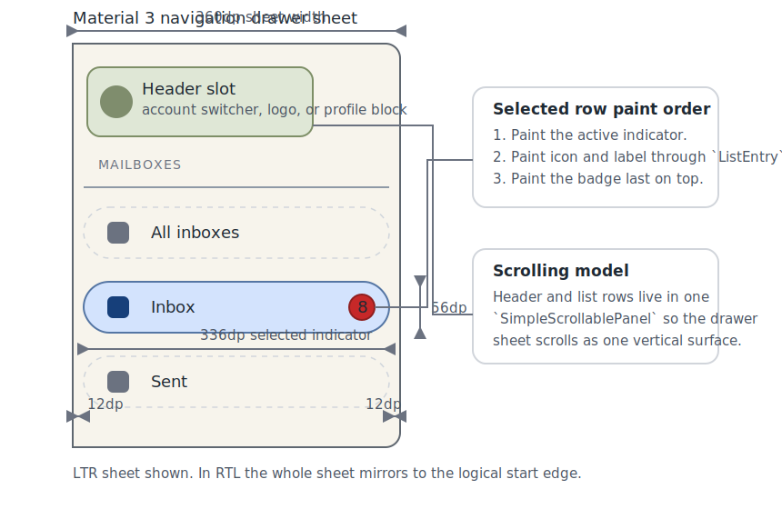

# Roo Windows Material 3 Navigation Drawer Design

## Objective

Add Material Design 3 navigation drawer support to `roo_windows` in a form
that matches the current framework primitives and the current Material 3
direction.

The design should provide:

- a standard embedded drawer sheet for large-screen layouts,
- a modal drawer wrapper that presents the same sheet over a scrim,
- one selected destination at a time across the whole drawer,
- optional header content, section labels, group dividers, and badges,
- independent vertical scrolling inside the drawer,
- and reuse of the landed `material3::List`, `material3::Badge`, `Scrim`,
  `SimpleScrollablePanel`, and `PaintContext` primitives.

The result is a baseline Material 3 navigation drawer family. It should stay
compatible with the current Material 3 expressive guidance, which now prefers
the expanded navigation rail, without making the drawer API itself depend on an
adaptive shell.

## Motivation

`roo_windows` has a legacy navigation rail and an in-progress Material 3 list
substrate, but it has no Material 3 navigation drawer.

That gap matters for three reasons:

1. baseline Material 3 still defines standard and modal navigation drawers,
2. modal drawers remain a common compact and medium-window pattern even after
   the expressive update,
3. and the current list, badge, scroll, and scrim primitives are now mature
   enough that drawer support no longer needs a large amount of bespoke
   infrastructure.

At the same time, the Material 3 expressive update explicitly says that the
navigation drawer is no longer the preferred primary navigation surface for new
expressive designs. The `roo_windows` drawer should therefore be implemented as
an intentionally narrow baseline component family:

- good support for standard and modal drawer patterns,
- clean interoperability with the planned Material 3 navigation rail,
- and no attempt to make the drawer itself the adaptive navigation policy
  layer.

## Background

### Current Starting Point in `roo_windows`

There is no checked-in Material 3 drawer implementation.

The most relevant current pieces are:

- the legacy rail in
  [src/roo_windows/containers/navigation_rail.h](../src/roo_windows/containers/navigation_rail.h),
- the Material 3 list substrate in
  [src/roo_windows/material3/list/list.h](../src/roo_windows/material3/list/list.h),
- the shared badge helper in
  [src/roo_windows/material3/badge/badge.h](../src/roo_windows/material3/badge/badge.h),
- the generic scrolling surface in
  [src/roo_windows/containers/scrollable_panel.h](../src/roo_windows/containers/scrollable_panel.h),
- the overlay-backed scrim widget in
  [src/roo_windows/widgets/scrim.h](../src/roo_windows/widgets/scrim.h),
- and popup / modal presentation primitives in
  [src/roo_windows/core/application.h](../src/roo_windows/core/application.h).

Those landed pieces materially constrain the drawer design:

1. drawer content should scroll with `SimpleScrollablePanel` rather than a new
   drawer-local scroller,
2. modal presentation should reuse the existing popup and scrim model instead
   of inventing a second global overlay system,
3. badges should reuse `material3::Badge`,
4. and row sequencing should reuse the Material 3 list substrate rather than
   re-implementing another vertical row stack.

### Current Status of the List Substrate

The Material 3 list family is the correct structural starting point, but it is
not yet a complete drawer solution on its own.

What the current list API already gives the drawer:

- stable row sequencing,
- row-local text and slot binding through `ListItem` + `ListEntry`,
- low-level row ownership helpers through `ListRow<Item>`,
- list-owned measurement and layout,
- and list-owned selection state resolution internals.

What the current list API does not yet expose cleanly enough for a drawer:

- no owner-facing selected-row setter,
- no stock navigation convenience item family,
- no drawer-specific active-indicator paint model,
- and no section-label / group-divider convenience layer.

That means the drawer should build on the list substrate, but it still needs a
small amount of drawer-specific structure and one small list API extension.

### Material 3 Signals

This document is aligned against the Material 3 navigation drawer references:

- [Overview](https://m3.material.io/components/navigation-drawer/overview)
- [Specs](https://m3.material.io/components/navigation-drawer/specs)
- [Guidelines](https://m3.material.io/components/navigation-drawer/guidelines)

The main product signals carried into this design are:

1. Material 3 defines two baseline variants: standard and modal.
2. The expressive update no longer recommends the drawer for new expressive
   primary navigation; expanded navigation rail is the preferred direction.
3. The drawer sheet is a start-edge surface with a fixed nominal width of
   `360dp` and rounded ending-edge corners.
4. Destinations are actionable list items with one active destination at a
   time.
5. Drawer labels stay single-line and should truncate rather than wrap.
6. Section labels and full-width dividers can separate destination groups.
7. Drawer content can scroll independently of the rest of the screen.
8. Modal drawers use a scrim and dismiss on destination selection or scrim
   interaction.

### Local Design References

The most relevant local references are:

- [material3_lists_design.md](material3_lists_design.md)
- [material3_badge_design.md](material3_badge_design.md)
- [material3_navigation_rail_design.md](material3_navigation_rail_design.md)
- [paint_context_design.md](paint_context_design.md)
- [widget_authoring.md](widget_authoring.md)

Those references imply four important local constraints:

1. prefer reusable item-layer helpers first, and add row wrappers only when
   the row surface genuinely needs drawer-specific behavior,
2. keep badge storage off the base destination type,
3. keep modal presentation on the existing scrim and popup primitives,
4. and keep the base drawer API semantically narrow rather than growing a large
   setter matrix.

## Requirements

### Functional Requirements

1. Support a standard embedded navigation drawer sheet.
2. Support a modal navigation drawer wrapper with scrim-backed dismissal.
3. Support one selected destination at a time across the whole drawer.
4. Support an optional header region above the destination content.
5. Support optional section labels and full-width group dividers.
6. Support optional icons, selected icons, and badges per destination.
7. Support text-only destinations when the caller intentionally omits icons.
8. Support independent vertical scrolling for drawer content.
9. Support destination counts beyond the visible viewport height.
10. Keep the drawer anchored to the logical start edge in both LTR and RTL.

### Interaction Requirements

1. Clicking an enabled destination must invoke a semantic drawer callback.
2. Clicking a different destination must update the selected destination.
3. Modal drawers must support dismissal by tapping the scrim.
4. Modal drawers should dismiss after destination selection by default.
5. Hovered, focused, pressed, disabled, selected, and activated visuals must
   flow through the existing widget state model.
6. The selected indicator must hug the destination row content width defined by
   the drawer spec rather than the whole sheet width.
7. Destination labels must remain single-line; they must not wrap.

### API Requirements

1. Expose one embedded `material3::NavigationDrawer` sheet widget.
2. Expose one `material3::ModalNavigationDrawer` wrapper widget that reuses
   the embedded drawer.
3. Expose a drawer-specific destination item family that reuses `ListItem`.
4. Expose lightweight row helpers for destination rows and optional structural
   rows such as section labels and group dividers.
5. Keep standard destination labels as non-owning `roo::string_view`.
6. Keep badge support opt-in and implemented with the shared `Badge` helper.
7. Keep modal presentation separate from the embedded drawer sheet API.
8. Keep adaptive navigation switching and predictive-back behavior out of the
   base drawer API.

### Embedded Constraints

1. Do not allocate on paint, hover, press, scroll, or layout paths.
2. Do not store per-destination `std::function` callbacks on the plain
   destination item or row type.
3. Keep the base destination item badge-free.
4. Keep independent scroll behavior on the existing scroller instead of a
   drawer-local gesture stack.
5. Use pointer-size-aware size-budget assertions for new public types.

## Design Overview

The public surface has four layers:

1. `material3::NavigationDrawer` is the embedded sheet widget.
2. `material3::ModalNavigationDrawer` is a wrapper that adds scrim-backed
   modal presentation around the same embedded sheet.
3. `material3::NavigationDrawerDestinationItem` and
   `material3::BadgedNavigationDrawerDestinationItem` are reusable item-layer
   helpers built on `ListItem`.
4. `material3::NavigationDrawerDestinationRow` is a thin drawer-specific row
   surface used only because the selected indicator and badge paint order are
   row-surface concerns, not generic item concerns.

The core architectural decision is:

- reuse `ListItem` and `ListEntry` for row content and sequencing,
- add only one small owner-facing selection extension to `material3::List`,
- and keep sheet presentation, modal scrim behavior, and drawer selection
  ownership outside the generic list API.

That split keeps the drawer local and pragmatic:

- `List` remains the generic vertical row substrate,
- the drawer sheet owns selected destination semantics and sheet layout,
- the destination item family owns drawer content,
- the destination row owns drawer-specific indicator paint,
- and the modal wrapper owns scrim and slide-in presentation.



## Design Details

### Expressive Boundary and Scope

The drawer family lands as a baseline Material 3 component, not as a new
expressive primary-navigation direction.

That choice is deliberate.

The expressive Material guidance now prefers the expanded navigation rail, and
the repository already has a separate navigation rail design document. The
drawer should therefore support the still-valid baseline patterns without
turning into the adaptive shell that decides between bar, rail, and drawer.

In practice that means:

1. implement standard and modal drawer variants,
2. align the drawer's selection and callback seams with the planned Material 3
   rail family,
3. and leave rail-to-drawer adaptation to a future higher-level scaffold.

### Small `List` Extension

The drawer needs owner-managed selection because its logical selected index is
defined over destinations, not over every structural row in the scrollable
content.

The current `List` implementation already stores per-entry selected-state bits
internally, but it does not expose an owner-facing setter. The drawer design
therefore adds a narrow public extension to `material3::List`:

- `void setSelected(int idx, bool selected)`
- `bool selected(int idx) const`
- `void clearSelection()`

No list-local callback model is added.

This keeps the extension minimal and reusable. The drawer can own semantic
destination selection while the generic list continues to own row sequencing,
layout, and visual-context propagation.

### `NavigationDrawer` Sheet

`NavigationDrawer` derives from `Container`.

The drawer owns:

- one optional header `WidgetRef`,
- one internal `SimpleScrollablePanel`,
- one internal `material3::List` used as the vertical row sequencer,
- a vector of all drawer rows in visual order,
- a vector mapping logical destination indices to raw list row indices,
- and one selected destination index.

The drawer's preferred size is:

- exact width `360dp`,
- match-parent height.

The drawer sheet paints:

- the drawer container fill,
- the start-edge-anchored side-sheet shape with rounded ending-edge corners,
- and any optional sheet-local stroke or elevation treatment already supported
  by the theme.

The drawer does not own a second child-vector hierarchy for scrolling. Instead,
the scrollable content is one stacked inner surface containing:

1. the optional header,
2. the drawer row list.

The header participates in scrolling.

That is the safer embedded behavior because Material treats the drawer as one
scrollable sheet. A tall header must not trap content below the fold.

### Row Roles

The drawer uses one drawer-local row base:

- `NavigationDrawerEntry : public ListEntry`

`NavigationDrawerEntry` exists only to add a drawer-local semantic role:

- destination,
- section label,
- or divider.

Only destination rows participate in logical selection and invocation.
Structural rows do not.

This keeps the public child model semantic without forcing the generic list API
to learn about drawer-only row roles.

### Destination Item Family

The item layer remains the primary content-authoring surface.

`NavigationDrawerDestinationItem` derives from `ListItem` and owns:

- one non-owning destination label,
- one optional inactive icon reference,
- one optional selected-icon reference,
- and one inline `Icon` widget used as the borrowed leading slot.

That follows the current list direction: common content scenarios should be
modeled as `ListItem` helpers first, not as content-specific row subclasses.

The item reports:

- its label through `headlineText()`,
- one-line truncation policy through `headlinePolicy()`,
- its leading icon widget through `leading()`,
- and no trailing or body content by default.

`BadgedNavigationDrawerDestinationItem` derives from
`NavigationDrawerDestinationItem` and adds one inline `material3::Badge`.

The base item stays badge-free. Only the badged subtype pays for badge storage.

The item family does not store callbacks. Selection and invocation remain
drawer-owned.

### RAM Impact

The drawer design keeps the expensive state at the right ownership layer.

Approximate 32-bit target costs, using the already documented `roo_windows`
widget sizes as the baseline:

- `NavigationDrawerDestinationItem` stores one borrowed label view, two icon
   pointers, and one inline `Icon` widget. With `Icon` built on
   `BasicWidget`, that keeps the base-case item close to one cheap inline
   widget plus three pointers rather than a second row-surface object or a
   callback wrapper.
- `BadgedNavigationDrawerDestinationItem` adds exactly one inline `Badge` and
   pays the badge cost only on opt-in destinations.
- `NavigationDrawerDestinationRow<Item>` is intentionally heavier than a plain
   `ListRow<Item>` because it owns selected-indicator paint. That cost is paid
   only on destination rows. Section labels and dividers remain lighter,
   dedicated structural rows.
- `NavigationDrawer` pays for the `SimpleScrollablePanel`, `List`, and index
   vectors once per drawer, not once per row.

The main rejected RAM tradeoffs are therefore explicit:

1. no per-destination `std::function` callback storage,
2. no badge fields on every destination,
3. no modal-scrim or animation state on every embedded drawer,
4. and no second generic row stack parallel to `material3::List`.

### Destination Row Surface

`NavigationDrawerDestinationRow` derives from `NavigationDrawerEntry`.

This is the one intentional row-surface exception to the usual item-first rule.
The exception is justified because the drawer's selected indicator and badge
paint order are row-surface behavior, not merely content description.

The row:

1. binds a `NavigationDrawerDestinationItem`,
2. reuses `ListEntry` measurement and slot layout for label and leading icon,
3. resolves the active-indicator rectangle from drawer tokens,
4. updates the item's inline icon widget when selection or enablement changes,
5. and paints the active indicator plus any shared drawer row state treatment.

The selected indicator uses the Material 3 drawer geometry:

- `56dp` height,
- `28dp` corner radius,
- and `336dp` width inside the `360dp` sheet.

That yields the standard `12dp` indicator margin on both sides.

The row paint order is:

1. paint the active indicator when selected,
2. delegate the normal `ListEntry` content paint for icon and label,
3. paint the badge last when the bound item is badged.

Painting the badge last is required because the badge is the front-most owner
geometry on top of the destination content.

### Selected Icon Resolution

When a selected icon is configured, the selected state uses it.

Otherwise the row reuses the inactive icon with selected-state foreground
color.

That keeps the public API semantic and avoids forcing every destination to
carry two separate pictograms.

### Section Labels and Group Dividers

Material drawer dividers separate groups, not individual destinations.

The drawer therefore does **not** use the list-wide divider policy for drawer
groups. Instead, it uses explicit structural rows:

- `NavigationDrawerSectionLabelRow`
- `NavigationDrawerDividerRow`

`NavigationDrawerSectionLabelRow` is a lightweight non-interactive row that
paints one short, start-aligned subhead with drawer-specific padding and color.

`NavigationDrawerDividerRow` is a lightweight non-interactive row that paints a
full-width divider band with the spacing required between groups.

This is more faithful to the Material guidance than enabling a divider between
every adjacent row in the underlying list.

### Header Content

The drawer exposes one generic header slot:

- `setHeader(WidgetRef header)`
- `clearHeader()`

That is intentionally the same design direction as the Material 3 navigation
rail.

The repo still does not have one canonical Material 3 account header, app-logo
header, or profile switcher header family. A generic slot covers all of those
without adding a large API surface of dedicated stored fields.

### Selection Ownership and Callbacks

Selection is drawer-owned.

The drawer stores one logical selected destination index. It also maintains the
mapping from logical destination order to raw list row order so structural rows
do not interfere with selection.

Click handling is:

1. clicking an enabled destination row calls
   `NavigationDrawer::onDestinationInvoked(int index)`,
2. when the index differs from the current selected index, the drawer updates the
   inner list's selected-row bits through the new `List` API,
3. then it calls
   `NavigationDrawer::onSelectedDestinationChanged(int old_index, int new_index)`.

Both hooks are virtual no-ops by default.

That keeps the base drawer free of stored callback state while still matching
the navigation rail design direction closely enough that a future adaptive
wrapper can bridge between the two surfaces.

### Scrolling Behavior

The drawer's vertical scrolling stays entirely on `SimpleScrollablePanel`.

The drawer does not implement its own drag, fling, or overscroll stack. The
existing scrolling container already provides:

- vertical scrolling,
- momentum and overshoot behavior,
- and optional scrollbar support.

This is the correct reuse point because the drawer's scrolling behavior is not
conceptually different from any other long, single-column scroll surface.

### Text Policy Dependency

Drawer labels must truncate rather than wrap.

The drawer therefore uses the shared list text path for one-line truncation,
and the implementation lands any missing shared text-policy support in Phase 1.
The design does not introduce a drawer-local label widget.

### Modal Wrapper

`ModalNavigationDrawer` derives from `Container` and owns:

- one `Scrim`,
- one embedded `NavigationDrawer`,
- and one small open / close animation state machine.

The wrapper is a widget subtree, not an imperative global presenter.

Callers show it through the existing popup-task or popup-child APIs. This keeps
modal presentation on the primitives already used elsewhere in the framework.

The wrapper owns:

- scrim tap dismissal,
- drawer slide-in / slide-out animation,
- optional automatic dismissal after destination selection,
- and modality over the content beneath the popup task.

The wrapper does **not** own:

- edge-swipe open,
- drag-to-dismiss,
- predictive back,
- or layout-grid adaptation with embedded content.

Those behaviors are intentionally left out of v1 because they belong either to
gesture-heavy modal scaffolding or to a higher-level adaptive navigation shell.

### Repaint and Invalidation

The drawer introduces two repaint-sensitive paths: selection changes inside the
sheet and modal presentation changes outside it.

Selection changes stay row-local:

1. changing the selected destination dirties the old selected row and the new
   selected row,
2. section labels and divider rows stay untouched,
3. and the drawer does not need a full-sheet repaint for ordinary selection
   changes.

The embedded drawer reuses `SimpleScrollablePanel` invalidation behavior for
scrolling rather than adding a second damage tracker.

The modal wrapper has a broader invalidation footprint:

1. the `Scrim` already repaints through the overlay pipeline and therefore
   requires repaint beneath its covered clip,
2. opening or closing the modal drawer invalidates the union of the old and new
   drawer bounds,
3. and the wrapper also invalidates the scrim-covered region so content behind
   the popup is repainted with the correct overlay state.

That choice keeps the invalidation model simple and consistent with the current
popup and scrim primitives, even though the modal path repaints more area than
an embedded selection change.

### Theme Resolution

The drawer resolves its default colors from the current theme using the same
roles described by the Material specs:

- sheet container: `surfaceContainerLow`,
- inactive icon and label: `onSurfaceVariant`,
- selected indicator: `secondaryContainer`,
- selected icon and label: `onSecondaryContainer`,
- divider: `outlineVariant`,
- scrim: the current shared modal scrim color.

The drawer does not introduce a second, component-local color registry.

Theme integration therefore stays on the current shared color roles and avoids
adding a drawer-local token table in v1.

## Proposed API

The intended public shape is approximately:

```cpp
namespace roo_windows::material3 {

class NavigationDrawerEntry : public ListEntry {
 public:
  enum class Role : uint8_t { kDestination, kSectionLabel, kDivider };

  Role role() const { return role_; }

 protected:
  NavigationDrawerEntry(ApplicationContext& context, Role role);

 private:
  Role role_;
};

class NavigationDrawerDestinationItem : public ListItem {
 public:
  NavigationDrawerDestinationItem(ApplicationContext& context,
                                  roo::string_view label,
                                  const roo_display::Pictogram* icon = nullptr,
                                  const roo_display::Pictogram* selected_icon = nullptr);

  roo_display::StringView headlineText() const override;
  ListTextPolicy headlinePolicy() const override;
  Widget* leading() const override;

  const roo_display::Pictogram* selectedIcon() const;

 protected:
  Icon& iconWidget() { return icon_widget_; }
  const Icon& iconWidget() const { return icon_widget_; }

 private:
  roo::string_view label_;
  const roo_display::Pictogram* icon_;
  const roo_display::Pictogram* selected_icon_;
  Icon icon_widget_;
};

class BadgedNavigationDrawerDestinationItem
    : public NavigationDrawerDestinationItem {
 public:
  using NavigationDrawerDestinationItem::NavigationDrawerDestinationItem;

  Badge& badge() { return badge_; }
  const Badge& badge() const { return badge_; }

 private:
  Badge badge_;
};

template <typename Item = NavigationDrawerDestinationItem>
class NavigationDrawerDestinationRow : public NavigationDrawerEntry {
 public:
  template <typename... Args>
  explicit NavigationDrawerDestinationRow(ApplicationContext& context,
                                          Args&&... args);

  Item& item() { return item_; }
  const Item& item() const { return item_; }

 private:
  Item item_;
};

class NavigationDrawerSectionLabelRow : public NavigationDrawerEntry { ... };
class NavigationDrawerDividerRow : public NavigationDrawerEntry { ... };

class NavigationDrawer : public Container {
 public:
  explicit NavigationDrawer(ApplicationContext& context);

  void setHeader(WidgetRef header);
  void clearHeader();

  void add(NavigationDrawerEntry& entry);
  void add(std::unique_ptr<NavigationDrawerEntry> entry);
  void clear();

  bool setSelectedDestination(int index);
  int selectedDestination() const;

 protected:
  virtual void onDestinationInvoked(int index) {}
  virtual void onSelectedDestinationChanged(int old_index, int new_index) {}
};

class ModalNavigationDrawer : public Container { ... };

}  // namespace roo_windows::material3
```

The file split is an implementation detail. The public API keeps this
ownership split:

- drawer sheet owns selection and scrolling,
- destination item owns content,
- destination row owns drawer-specific active-indicator paint,
- and modal wrapper owns scrim-backed presentation.

## Implementation Plan

Authoring reference: follow the local
[embedded C++ code authoring instruction](../.github/instructions/embedded-cpp-code-authoring.instructions.md)
and the
[roo_windows widget authoring instruction](../.github/instructions/roo-windows-widget-authoring.instructions.md).

### Phase 1: Shared List Prerequisites

Code slice:

1. Add the owner-facing `List` selection setters and getter.
2. Land the one-line shared text truncation behavior required by drawer labels.
3. Add focused `material3_list_test` coverage for selection propagation and
   one-line truncation.

Proposed commit message:

> Material 3 list: add navigation drawer prerequisites

Validation: run `bazel test //:material3_list_test`.

### Phase 2: Embedded Drawer Core

Code slice:

1. Add `NavigationDrawer`, `NavigationDrawerEntry`,
   `NavigationDrawerDestinationItem`, and
   `NavigationDrawerDestinationRow`.
2. Implement logical-destination to raw-row index mapping, selected indicator
   geometry, selected-icon fallback, and sheet-owned scrolling.
3. Add a focused drawer test target covering selection mapping, indicator
   geometry, and row-role behavior.
4. Add one embedded standard-drawer example that demonstrates the basic sheet.

Proposed commit message:

> Material 3 drawer: add embedded navigation drawer core

Validation: run `bazel test //:material3_navigation_drawer_test` and build the
embedded drawer example through the emulation harness.

### Phase 3: Structural Rows and Badges

Code slice:

1. Add `NavigationDrawerSectionLabelRow`, `NavigationDrawerDividerRow`, and
   `BadgedNavigationDrawerDestinationItem`.
2. Implement badge paint ordering and group-divider behavior.
3. Expand the drawer tests with badge geometry, badge paint order, and
   structural-row grouping coverage.
4. Update the embedded drawer example to show grouped sections and badged
   destinations.

Proposed commit message:

> Material 3 drawer: add grouped rows and badges

Validation: run `bazel test //:material3_navigation_drawer_test` and rebuild
the updated embedded drawer example.

### Phase 4: Modal Wrapper

Code slice:

1. Add `ModalNavigationDrawer` using `Scrim` and the existing popup path.
2. Implement open and close animation plus scrim-tap and destination-selection
   dismissal.
3. Add focused tests for modal invalidation bounds, scrim dismissal, and
   destination-triggered dismissal.
4. Add a modal drawer example using the same embedded drawer content.

Proposed commit message:

> Material 3 drawer: add modal navigation drawer wrapper

Validation: run `bazel test //:material3_navigation_drawer_test` and build the
modal drawer example through the emulation harness.

## Testing Plan

Validation coverage for the full drawer family should include:

1. `//:material3_list_test` coverage for the shared list selection and text
   prerequisites.
2. `//:material3_navigation_drawer_test` coverage for destination mapping,
   row roles, indicator geometry, selected-icon fallback, badge placement, and
   modal dismissal behavior.
3. Size-budget assertions for the destination item, badged destination item,
   destination row, embedded drawer, and modal wrapper.
4. Example builds for both the embedded and modal drawer flows.
5. Focused render or golden coverage when the drawer tests need pixel-level
   verification of indicator or badge placement.

## Caveats

The design keeps the drawer narrow through the shared list substrate
for row sequencing and the existing popup plus scrim primitives for modal
presentation. That reduces duplicate infrastructure, but it also means the
first drawer implementation necessarily touches shared list APIs and popup-path
examples.

### Rejected Alternatives

#### Model the drawer entirely as a configured `material3::List`

Rejected in [Destination Row Surface](#destination-row-surface). The drawer's
selected indicator, badge paint ordering, and destination-to-raw-row mapping
are drawer-owned behavior. Pushing those semantics into the generic list API
would widen the shared substrate for a single component family.

#### Build a drawer-local row stack instead of reusing `material3::List`

Rejected in [Design Overview](#design-overview) and
[Small `List` Extension](#small-list-extension). A drawer-local stack would
duplicate row sequencing, slot binding, measurement, and future text-policy
work that already belong to the shared Material 3 list family.

#### Store per-destination callbacks on items or rows

Rejected in [Selection Ownership and Callbacks](#selection-ownership-and-callbacks).
Per-destination callbacks add RAM to every destination and diverge from the
current rail design direction, which already prefers semantic container-owned
selection hooks.

#### Fold modal presentation into `NavigationDrawer`

Rejected in [Modal Wrapper](#modal-wrapper). Embedded and modal drawers have
different state and invalidation behavior. A single class would force every
embedded drawer to carry scrim and animation state it does not need.

#### Put adaptive navigation switching in the base drawer

Rejected in [Expressive Boundary and Scope](#expressive-boundary-and-scope).
Current Material guidance prefers the expanded rail for expressive primary
navigation, so bar-versus-rail-versus-drawer adaptation belongs to a higher-
level scaffold rather than to the base drawer component.

## Future Work

Potential follow-ons that are intentionally outside this design:

1. a higher-level adaptive scaffold that switches between bar, rail, and
   drawer,
2. edge-swipe open and drag-to-dismiss gestures once popup gesture ownership is
   designed for side sheets,
3. predictive-back integration for modal drawers,
4. and explicit navigation-drawer theme tokens once the shared theme grows a
   component-specific token table for this surface.