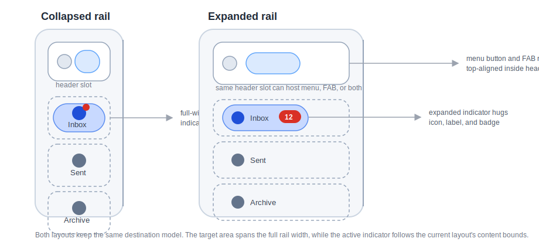

# Roo Windows Material 3 Navigation Rail Design

## Objective

Add a Material 3 navigation rail family to `roo_windows` that starts from the
current checked-in rail API and closes on the current shared framework APIs:

- persistent collapsed and expanded rail layouts,
- one selected destination with a Material 3 active indicator,
- an optional header slot for a menu button, FAB, logo, or small composite,
- optional divider and optional container fill,
- optional badges on selected destinations through the landed
  `material3::Badge` helper,
- and `paint(PaintContext&)`-based rendering that fits the current widget paint
  pipeline.

The result is a new Material 3 rail family that supersedes the current legacy
rail implementation. It does not invent a rail-local badge model, and it does
not revive the pre-`PaintContext` `Canvas`-only paint contract.

## Motivation

`roo_windows` already has a navigation rail in code, but it is a legacy
container API rather than a Material 3 component family. The badge design and
paint context design have both landed, so the remaining rail design work no
longer needs placeholder badge structs or speculative paint hooks. The rail
design should now close directly on those landed APIs.

## Background

### Current Starting Point in `roo_windows`

The current rail implementation lives in
[src/roo_windows/containers/navigation_rail.h](../src/roo_windows/containers/navigation_rail.h)
and
[src/roo_windows/containers/navigation_rail.cpp](../src/roo_windows/containers/navigation_rail.cpp).
The current higher-level consumer lives in
[src/roo_windows/containers/navigation_panel.h](../src/roo_windows/containers/navigation_panel.h)
and
[src/roo_windows/containers/navigation_panel.cpp](../src/roo_windows/containers/navigation_panel.cpp).

That checked-in API already establishes the migration baseline:

1. `roo_windows::NavigationRail` is a `Panel` with a fixed `72dp` preferred
   width, a persistent divider, and a simple vertical destination stack.
2. `Destination` derives from `IconWithCaption`, stores an owned `std::string`,
   stores a per-instance `std::function<void()>`, and activates the callback
   directly from `onClicked()`.
3. `NavigationPanel` depends on that callback-driven rail to switch a stacked
   content area.

That baseline is useful because it proves the repo already wants a dedicated
rail surface. It is also the wrong long-term shape for a Material 3 family.
The current rail has none of the Material 3-specific decisions this design
needs to close:

- no collapsed versus expanded layout mode,
- no header slot,
- no full-width target-area versus content-hugging indicator split,
- no optional selected icon,
- no badge integration,
- no semantic rail-owned selection hooks,
- and no Material 3 token-backed geometry or color model.

The current API therefore serves as the migration starting point, not as the
target public shape.

### Landed Shared Primitives

Two adjacent designs are now checked in and materially constrain the rail API.

The badge helper is already available in
[src/roo_windows/material3/badge/badge.h](../src/roo_windows/material3/badge/badge.h):

1. `material3::Badge` is not a `Widget`.
2. Badge text is stored inline with no heap allocation.
3. Badge geometry is resolved through owner-supplied anchor bounds plus
   `BadgePlacement`.
4. Badge paint is already defined as
   `paint(PaintContext&, const Theme&) const`.

The paint-context migration is also already complete in
[src/roo_windows/core/paint_context.h](../src/roo_windows/core/paint_context.h)
and the shared widget pipeline in
[src/roo_windows/core/widget.h](../src/roo_windows/core/widget.h):

1. the normal widget paint hook is now `paint(PaintContext&)`,
2. exclusions, overlays, and decorations are emitted through `PaintContext`,
3. and owner-local foreground-first paint ordering is already defined by the
   widget authoring guidance.

The rail design must therefore reuse `material3::Badge` and
`PaintContext`. It should not define a rail-specific badge struct, a rail-local
badge renderer, or a `paint(const Canvas&)`-era API surface.

### Material 3 Signals

This document is aligned against the Material 3 navigation rail references:

- [Overview](https://m3.material.io/components/navigation-rail/overview)
- [Specs](https://m3.material.io/components/navigation-rail/specs)
- [Guidelines](https://m3.material.io/components/navigation-rail/guidelines)

The main product signals carried into this design are:

1. the baseline rail is no longer recommended; collapsed and expanded rails are
   the supported family,
2. the rail is a leading-edge, medium-and-up navigation surface,
3. the target area always spans the full rail width while the active indicator
   hugs the destination content,
4. the rail can host a top-aligned menu button, FAB, logo, or similar header
   content,
5. badges are part of the component contract,
6. collapsed badges sit on the icon's upper trailing corner,
7. expanded badges sit beside the label text,
8. and only one destination shows the active indicator at a time.

### Local Design References

The most relevant local references are:

- [material3_badge_design.md](material3_badge_design.md)
- [paint_context_design.md](paint_context_design.md)
- [material3_buttons_design.md](material3_buttons_design.md)
- [material3_lists_design.md](material3_lists_design.md)
- [widget_authoring.md](widget_authoring.md)

Those references imply three important local constraints:

1. badge support belongs on opt-in hosts, not on every widget instance,
2. destination paint must follow the current direct-to-framebuffer exclusion
   rules,
3. and the new rail API should stay semantically narrow and avoid a large
   setter matrix.

## Requirements

### Functional Requirements

1. Support the Material 3 collapsed and expanded persistent navigation rail
   layouts.
2. Support one selected destination at a time.
3. Support 3-7 destinations as the intended design range, while allowing fewer
   during construction and tests.
4. Support an optional header slot above the destination group.
5. Support top-aligned and center-aligned destination groups.
6. Support optional divider painting on the content-adjacent edge.
7. Support optional container fill so the rail can either own a visible surface
   or sit directly on an ancestor surface.
8. Support separate inactive and selected icons per destination.
9. Support optional dot and text / number badges on some destinations without
   adding badge state to every destination instance.
10. Keep the rail fixed while page content scrolls outside it; the rail itself
    is not a scrolling surface.
11. Provide a migration path for the current
    [NavigationPanel](../src/roo_windows/containers/navigation_panel.h) user of
    the legacy rail.

### Interaction Requirements

1. Destination hit-testing must use the full destination width in both layout
   modes.
2. Clicking an enabled destination must invoke a semantic rail callback.
3. Clicking a different destination must also update the selected index.
4. Hovered, focused, pressed, disabled, selected, and activated visuals must
   flow through the existing widget state model.
5. Badge paint ordering must be correct under the current `PaintContext` /
   `Clipper` exclusion pipeline.
6. The base Material 3 rail API must not require per-destination stored
   `std::function` callbacks.

### API Requirements

1. Expose one persistent `material3::NavigationRail` container.
2. Expose one badge-free `NavigationRailDestination` base widget.
3. Expose one opt-in `BadgedNavigationRailDestination` subclass that reuses the
   landed `material3::Badge` helper.
4. Keep standard destination labels as non-owning `roo::string_view`.
5. Keep the header API generic: one widget slot, not separate menu-button and
   FAB stored fields.
6. Keep badge behavior on the shared badge helper. If shared badge geometry
   later needs a wider placement vocabulary, extend `badge/` itself rather
   than introducing a rail-local badge primitive.
7. Use `paint(PaintContext&)` for widget paint; do not add a legacy `Canvas`
   paint path.
8. Keep modal presentation, predictive-back behavior, and adaptive navigation
   switching out of the base rail API.

### Embedded Constraints

1. Do not allocate on paint, click, hover, focus, or layout paths.
2. Keep `NavigationRailDestination` free of badge fields, child vectors, owned
   strings, and per-instance callback storage.
3. Keep the incremental badge cost on `BadgedNavigationRailDestination` limited
   to one inline `Badge` plus any required packed state.
4. Keep badge placement derived from current layout geometry rather than stored
   as another permanent per-instance policy field.
5. Use pointer-size-aware size-budget assertions for the new public types.

## Design Overview

The public surface has three layers:

1. `material3::NavigationRail` is the persistent, surface-owning rail
   container.
2. `material3::NavigationRailDestination` is the compact clickable destination
   widget.
3. `material3::BadgedNavigationRailDestination` is the opt-in badge-aware
   subclass that adds one inline `material3::Badge`.

The new family lands beside the current legacy rail rather than mutating the
legacy callback-driven API in place. The legacy rail remains the migration
starting point; the new Material 3 family is the target API.

`NavigationRail` owns:

- the outer rail surface and optional divider,
- the optional header slot,
- the destination sequence,
- the collapsed versus expanded layout mode,
- the destination-group alignment,
- and the selected destination index.

`NavigationRailDestination` owns:

- its label,
- its inactive and selected icon references,
- its local active-indicator paint,
- and its full-width target-area interaction handling.

`BadgedNavigationRailDestination` adds only:

- one inline `material3::Badge`,
- the badge-layout logic that maps rail geometry onto the shared badge API,
- and the badge-aware paint ordering needed by the current `PaintContext`
  pipeline.



The core decisions are:

1. introduce a new Material 3 rail family instead of stretching the legacy
   callback-driven container,
2. keep the base destination badge-free and pay for badge state only on an
   opt-in subclass,
3. reuse the landed `material3::Badge` helper in both layouts,
4. translate expanded badge placement into badge anchor geometry owned by the
   destination rather than adding a rail-local badge renderer,
5. keep paint on the current `PaintContext` path,
6. and leave modal / adaptive wrappers outside the base rail.

## Design Details

### Type Split and Migration Boundary

`NavigationRail` derives from `Container`.

That choice is semantic and storage-driven. The rail owns a meaningful outer
surface, optional divider, and child sequencing policy, so it belongs on the
surface-owning branch. It also wants a stricter child model than `Panel`: one
optional header plus a destination list. Deriving directly from `Container`
avoids paying for `Panel`'s general child vector on top of the rail's dedicated
destination storage.

`NavigationRailDestination` derives from `BasicWidget`.

That keeps the common destination cheap. A destination paints indicator, icon,
label, and state feedback, but it does not own the rail background behind it.

`BadgedNavigationRailDestination` derives from `NavigationRailDestination`.

That follows the landed badge-host pattern used by
[src/roo_windows/material3/switch/badged_switch.h](../src/roo_windows/material3/switch/badged_switch.h):
the base widget stays badge-free, and only the badge-aware subclass pays for
the inline badge storage and layout logic.

The migration boundary is explicit:

1. the current
   [src/roo_windows/containers/navigation_rail.h](../src/roo_windows/containers/navigation_rail.h)
   API stops growing,
2. the new `material3::NavigationRail` family lands beside it,
3. and the existing
   [NavigationPanel](../src/roo_windows/containers/navigation_panel.h) becomes
   a follow-on adapter over the new rail once the Material 3 family is usable.

### `NavigationRail` Container

The rail stores:

- an optional header `WidgetRef`,
- a vector of destination pointers,
- one selected-index field,
- one collapsed / expanded layout bit,
- one group-alignment bit,
- and booleans for container-fill and divider visibility.

The layout algorithm is:

1. resolve the rail's token-backed outer padding and content rect,
2. lay out the header at the top of that content rect when present,
3. compute the total destination-group height for the active layout mode,
4. place that group at the top or center of the remaining vertical space,
5. give every destination the full available content width,
6. use token-backed minimum heights and inter-item gaps for the active mode,
7. and paint the divider on the content-adjacent edge when enabled.

The rail does not scroll. If the available height is smaller than preferred,
the implementation compresses free gap space to zero before it compresses any
destination below the token-backed minimum height.

Container fill and divider painting stay on the current `Container`
child-first-surface-second pipeline:

1. destination children paint first,
2. the rail surface paints afterward through `paint(PaintContext&)`,
3. child exclusions keep settled destination pixels from being overwritten,
4. and the rail does not need a custom post-child badge or overlay stage.

### `NavigationRailDestination`

Each base destination stores:

- a non-owning label,
- an inactive icon pointer,
- an optional selected-icon pointer,
- and packed bits for layout mode and selected state.

The base destination is intentionally direct-painted.

It does not create child label widgets, child badge widgets, or per-item child
vectors. That keeps the base-case RAM predictable and avoids carrying list-like
row machinery into a rail-specific component.

#### Indicator Geometry

Every destination has two distinct rectangles:

1. the **target rect**, which is the full destination bounds and is used for
   hit-testing, hover, focus, press, and invalidation,
2. the **indicator rect**, which hugs the destination content rather than the
   full width.

In collapsed layout, the base destination content is the icon plus the stacked
label geometry below it, while the selected indicator remains sized to the
icon-focused Material 3 collapsed treatment.

In expanded layout, the indicator hugs the horizontal content cluster instead of
filling the whole rail width.

The destination therefore exposes one protected content-bounds helper used by
indicator layout. The base class resolves that helper from icon and label
geometry, and `BadgedNavigationRailDestination` extends it when expanded badges
are visible.

#### Label Policy

Standard destination labels stay intentionally narrow:

1. the widget stores one non-owning `roo::string_view`,
2. explicit caller-authored newlines are honored,
3. the widget does not auto-ellipsis, auto-hyphenate, or shrink text,
4. and richer text behavior is left to custom subclasses instead of inflating
   every destination instance.

#### Selected Icon Fallback

When the selected-icon pointer is configured, the selected state uses it.
Otherwise the selected state reuses the inactive icon with selected-state tint.

That matches the checked-in Material 3 button and switch style: keep the public
API semantic, and let the theme and current state resolve the final draw.

### Badge Integration

Badges reuse the landed `material3::Badge` helper. The rail does not define a
`NavigationRailBadge` struct, a badge mode enum, or a rail-local badge text
buffer.

`BadgedNavigationRailDestination` stores one inline `Badge badge_` and owns the
geometry translation needed to map Material rail placement onto the shared
badge API.

#### Collapsed Layout Badge Placement

In collapsed layout, the destination uses the icon bounds as the badge anchor.
The badge gravity is logical top-end in LTR and logical top-start in RTL.

That maps directly onto the current `Badge` API and matches the Material rail
spec.

#### Expanded Layout Badge Placement

In expanded layout, Material places the badge beside the label text rather than
on the icon corner. The current shared badge API is still sufficient.

The destination resolves a synthetic anchor rect for the inline badge slot and
then calls `badge_.layout(...)` using the shared badge placement model. The
anchor rect is chosen so that the badge helper's top-start / top-end placement
resolves to the desired beside-label badge position.

That keeps the badge implementation shared while still producing the Material 3
expanded geometry. No rail-local badge primitive is introduced.

If future components need badge placements that cannot be expressed cleanly as
owner-supplied anchors, the correct extension point is
[material3/badge](../src/roo_windows/material3/badge/badge.h), not another
component-specific badge type.

#### Badge-Aware Indicator Bounds

In expanded layout, the visible badge is part of the destination's horizontal
content cluster. `BadgedNavigationRailDestination` therefore extends the
content-bounds helper used by indicator layout so the expanded indicator hugs
icon, label, and badge together.

In collapsed layout, the selected indicator stays icon-focused. The badge does
not enlarge the collapsed indicator.

#### Badge Overflow Policy

In v1, both collapsed and expanded badge layouts stay inside the full
destination bounds.

That decision is deliberate. It keeps the badged destination on the simple
paint path:

1. no `ParentClipMode::kUnclipped`,
2. no custom `getInkInsets()` override,
3. no old/new badge envelope bookkeeping outside the widget bounds,
4. and ordinary destination invalidation remains sufficient when badge content
   changes.

If future token changes require badge overhang outside destination bounds, the
extension should be made on the shared badge host pattern, not by adding a
second rail-local overflow system.

### Paint Model

The rail follows the current `PaintContext` paint pipeline exactly.

`NavigationRail::paint(PaintContext&)` paints only rail-owned surface content:

- optional container fill,
- optional divider,
- and any other rail-level background treatment.

`NavigationRailDestination::paint(PaintContext&)` paints destination-owned
foreground content:

- indicator,
- icon,
- label,
- and any state-local direct pixels that belong to the destination.

`BadgedNavigationRailDestination::paint(PaintContext&)` settles the badge first
and then delegates the lower-z destination content draw.

That order is required by the current badge and widget authoring rules:

1. `badge_.paint(ctx, theme())` emits the badge's direct pixels, rounded
   decoration, and exclusion,
2. the remaining destination content then paints underneath that settled badge
   region,
3. and the shared widget pipeline later contributes the destination's own
   exclusion bounds.

No rail code path reintroduces a separate `Canvas` paint hook, a custom
finalize stage, or a rail-local overlay stack.

### Header Content

The rail exposes one generic header slot:

- `setHeader(WidgetRef header)`
- `clearHeader()`

That choice remains correct even after the badge and paint-context landings.
The repo still does not have a checked-in Material 3 icon button or FAB family,
and the Material spec explicitly allows several top-of-rail shapes.

One header slot covers:

- menu button only,
- FAB only,
- menu button plus FAB,
- logo only,
- or a small caller-built composite.

The rail does not need dedicated stored fields for each of those cases.

### Selection Ownership and Callbacks

Selection is rail-owned.

The rail stores one selected index and pushes derived selected state into its
destination children. That keeps the single-selected-destination rule in one
place and removes the legacy per-destination callback requirement.

Click handling is:

1. clicking an enabled destination always calls
   `NavigationRail::onDestinationInvoked(int index)`,
2. if the index differs from the current selection, the rail updates the
   selected index,
3. and only then calls
   `NavigationRail::onSelectedIndexChanged(int old_index, int new_index)`.

Both hooks are virtual no-ops. That keeps the base rail free of stored
callbacks while still giving adapters such as `NavigationPanel` a semantic seam
for migration.

### Theme Resolution

The rail resolves its defaults from the active `Theme`:

- collapsed and expanded rail widths,
- collapsed and expanded item minimum heights,
- inter-item gap and outer padding,
- active-indicator shape and padding,
- content colors and typography,
- container color and divider color.

Badge colors stay owned by the shared badge helper. The rail does not shadow
them with a second badge palette; `material3::Badge` continues to use the badge
design's current `error` / `onError` colors.

### RTL and Edge Semantics

The rail remains a leading-edge component:

- left edge in left-to-right layouts,
- right edge in right-to-left layouts.

Logical leading / trailing semantics apply to:

- expanded icon / label ordering,
- collapsed and expanded badge gravity,
- divider placement,
- and synthetic expanded badge anchors.

The parent still decides where the rail is placed. The rail owns only its
internal logical geometry.

### RAM Budget

The design keeps the base case explicit.

Target budgets for host-side tests are:

1. `NavigationRailDestination`:
   `sizeof(BasicWidget) + sizeof(roo::string_view) + 2 * sizeof(void*) + 8`
2. `BadgedNavigationRailDestination`:
   `sizeof(NavigationRailDestination) + sizeof(Badge) + 4`
3. `NavigationRail`:
   `sizeof(Container) + sizeof(WidgetRef) + 4 * sizeof(void*) + 16`

The important accounting rule is not the exact host-build byte count. It is the
shape:

1. base destinations stay badge-free,
2. the badged subclass pays for exactly one inline badge helper,
3. and the rail itself does not inherit the legacy per-destination callback or
   owned-string cost.

## Proposed API

### Core Types

```cpp
namespace roo_windows {
namespace material3 {

enum class NavigationRailLayout : uint8_t {
  kCollapsed,
  kExpanded,
};

enum class NavigationRailGroupAlignment : uint8_t {
  kTop,
  kCenter,
};

class NavigationRailDestination : public BasicWidget {
 public:
  explicit NavigationRailDestination(ApplicationContext& context,
                                     roo::string_view label = {},
                                     const MonoIcon* icon = nullptr,
                                     const MonoIcon* selected_icon = nullptr);

  roo::string_view label() const;
  void setLabel(roo::string_view label);

  const MonoIcon* icon() const;
  void setIcon(const MonoIcon* icon);

  const MonoIcon* selectedIcon() const;
  void setSelectedIcon(const MonoIcon* icon);

  bool selected() const;
  NavigationRailLayout layout() const;

  bool isClickable() const override;
  Dimensions getSuggestedMinimumDimensions() const override;
  void paint(PaintContext& ctx) const override;

 protected:
  void onClicked() override;
  virtual Rect destinationContentBounds() const;

 private:
  friend class NavigationRail;
  void setLayoutFromRail(NavigationRailLayout layout);
  void setSelectedFromRail(bool selected);

  roo::string_view label_;
  const MonoIcon* icon_;
  const MonoIcon* selected_icon_;
  uint8_t layout_ : 1;
  uint8_t selected_ : 1;
};

class BadgedNavigationRailDestination : public NavigationRailDestination {
 public:
  explicit BadgedNavigationRailDestination(
      ApplicationContext& context, roo::string_view label = {},
      const MonoIcon* icon = nullptr,
      const MonoIcon* selected_icon = nullptr);

  const Badge& badge() const;
  void hideBadge();
  void setBadgeDot();
  void setBadgeText(roo::string_view text);
  void setBadgeValue(unsigned int number);

  void paint(PaintContext& ctx) const override;

 protected:
  void onLayout(bool changed, const Rect& rect) override;
  Rect destinationContentBounds() const override;

 private:
  void relayoutBadge();
  Rect badgeAnchorBounds() const;

  Badge badge_;
};

class NavigationRail : public Container {
 public:
  static constexpr uint8_t kMaxDestinations = 7;

  explicit NavigationRail(ApplicationContext& context);

  NavigationRailLayout layout() const;
  void setLayout(NavigationRailLayout layout);

  NavigationRailGroupAlignment groupAlignment() const;
  void setGroupAlignment(NavigationRailGroupAlignment alignment);

  bool showsContainer() const;
  void setShowContainer(bool show);

  bool showsDivider() const;
  void setShowDivider(bool show);

  void setHeader(WidgetRef header);
  void clearHeader();

  int selectedIndex() const;
  void setSelectedIndex(int index);

  int destinationCount() const;

  bool add(NavigationRailDestination& destination);
  bool add(std::unique_ptr<NavigationRailDestination> destination);
  void clear();

  ColorRole containerRole() const override;
  void paint(PaintContext& ctx) const override;

 protected:
  int getChildrenCount() const override;
  const Widget& getChild(int idx) const override;
  Widget& getChild(int idx) override;
  Dimensions onMeasure(WidthSpec width, HeightSpec height) override;
  void onLayout(bool changed, const Rect& rect) override;

  virtual void onDestinationInvoked(int index) {}
  virtual void onSelectedIndexChanged(int old_index, int new_index) {}

 private:
  void updateSelectionFromDestination(NavigationRailDestination& destination);
  void propagateLayoutToDestinations();

  WidgetRef header_;
  std::vector<NavigationRailDestination*> destinations_;
  int8_t selected_index_;
  uint8_t layout_ : 1;
  uint8_t group_alignment_ : 1;
  bool show_container_;
  bool show_divider_;
};

}  // namespace material3
}  // namespace roo_windows
```

### API Notes

1. `NavigationRailDestination` intentionally has no badge setter surface.
   Callers that want badges opt into `BadgedNavigationRailDestination`.
2. `BadgedNavigationRailDestination` does not expose a placement setter in v1.
   Badge placement is derived from the current layout mode and logical
   direction.
3. `clear()` clears destinations but preserves the header slot.
4. `setSelectedIndex(-1)` clears the current selection.
5. The new Material 3 family lands beside the current legacy
   `roo_windows::NavigationRail`; it does not change that symbol in place.
6. If a later revision needs a wider shared badge placement vocabulary, extend
   the shared badge helper rather than adding a second badge model here.

## Implementation Plan

Implementation work for these phases follows the repo-local
[roo_windows widget authoring instruction](../.github/instructions/roo-windows-widget-authoring.instructions.md).

### Phase 1: Declare the Material 3 Rail Types and Size Budgets

Code slice:

1. Add the public enums and class declarations in the Proposed API.
2. Keep the base destination badge-free and add the badged destination as a
   separate subclass.
3. Add pointer-size-aware size-budget assertions for
   `NavigationRailDestination`, `BadgedNavigationRailDestination`, and
   `NavigationRail`.
4. Leave the legacy
   [containers/navigation_rail.h](../src/roo_windows/containers/navigation_rail.h)
   API untouched in this phase.

Proposed commit message:

> Material 3 navigation rail Phase 1: declare the rail family.
>
> Add `material3::NavigationRail`, `NavigationRailDestination`, and
> `BadgedNavigationRailDestination`, together with size-budget tests that keep
> badges off the base destination type.

Validation: add `material3_navigation_rail_test` and run
`bazel test //:material3_navigation_rail_test` from the `roo_windows`
workspace.

### Phase 2: Implement the Base Destination Widget

Code slice:

1. Implement collapsed and expanded measurement for
   `NavigationRailDestination`.
2. Implement the full-width target-area paint, selected-icon fallback, and
   content-hugging indicator geometry.
3. Keep the base destination on `paint(PaintContext&)`; do not add a legacy
   `Canvas` paint entry point.
4. Add focused tests and goldens for collapsed and expanded enabled, disabled,
   selected, and unselected destinations.

Proposed commit message:

> Material 3 navigation rail Phase 2: implement the base destination widget.
>
> Add collapsed and expanded paint for `NavigationRailDestination`, including
> full-width interaction bounds, selected-icon fallback, and the Material 3
> content-hugging indicator geometry.

Validation: run `bazel test //:material3_navigation_rail_test` and
`bazel test //:material3_navigation_rail_golden_test` with destination-focused
cases.

### Phase 3: Implement the Rail Container and Selection Model

Code slice:

1. Implement `NavigationRail` add / clear / header / selection behavior and the
   seven-destination cap.
2. Lay out the rail for top and center group alignment in both layout modes.
3. Paint the optional container fill and divider on the current
   `Container` surface path.
4. Wire destination clicks through the rail-owned selection model and virtual
   semantic callbacks.

Proposed commit message:

> Material 3 navigation rail Phase 3: implement the rail container.
>
> Add the persistent `NavigationRail` surface, header slot, destination
> sequencing, selection ownership, and optional divider / container-fill
> behavior.

Validation: run `bazel test //:material3_navigation_rail_test` with focused
selection, add / clear, and layout cases.

### Phase 4: Add the Badge-Aware Destination Subclass

Code slice:

1. Implement `BadgedNavigationRailDestination` on top of the landed
   `material3::Badge` helper.
2. Use icon-corner anchoring in collapsed layout.
3. Use a synthetic beside-label anchor in expanded layout so badge geometry
   still resolves through the shared badge API.
4. Extend expanded indicator bounds to include the visible badge.
5. Keep badge paint ordering on the current `PaintContext` path and do not add
   a rail-local badge renderer or badge text buffer.
6. Add focused tests and goldens for collapsed and expanded badge placement,
   RTL badge mirroring, and `999+` value capping.

Proposed commit message:

> Material 3 navigation rail Phase 4: add badged destinations.
>
> Add `BadgedNavigationRailDestination` on top of the shared badge helper,
> including collapsed icon-corner badges, expanded beside-label badges, and
> badge-aware indicator geometry without inflating the base destination type.

Validation: run `bazel test //:material3_navigation_rail_test` and
`bazel test //:material3_navigation_rail_golden_test` with badge-focused and
RTL-focused cases.

### Phase 5: Migrate the Current In-Repo Consumer and Add Example Coverage

Code slice:

1. Refit
   [NavigationPanel](../src/roo_windows/containers/navigation_panel.h) to use
   a small adapter over the new Material 3 rail callbacks.
2. Add a representative Material 3 example sketch under
   `examples/material3/navigation_rail/navigation_rail.ino`.
3. Keep the legacy rail implementation stable during the migration, but stop
   adding new capability to it.
4. Add focused tests or example build coverage for the migrated consumer path.

Proposed commit message:

> Material 3 navigation rail Phase 5: migrate the in-repo rail consumer.
>
> Adapt `NavigationPanel` to the new Material 3 rail callbacks and add a
> representative navigation rail example so the new family is exercised in both
> tests and example builds.

Validation: run `bazel test //:material3_navigation_rail_test`, run
`bazel test //:material3_navigation_rail_golden_test`, and build the example
that hosts `examples/material3/navigation_rail/navigation_rail.ino`.

## Testing Plan

Validation coverage should include:

1. `material3_navigation_rail_test` for defaults, header replacement,
   destination-count limits, label lifetime contract, selection changes, and
   size-budget assertions.
2. `material3_navigation_rail_golden_test` for collapsed and expanded
   destinations, selected and unselected states, divider and container-off
   rendering, and collapsed / expanded badge placement.
3. RTL-focused render cases for divider edge placement and badge mirroring.
4. Example compilation and migrated consumer coverage once `NavigationPanel` or
   another in-repo adapter is switched over.

## Caveats

### Rejected Alternatives

#### Mutate the Legacy `roo_windows::NavigationRail` in Place

This was rejected.

The current legacy rail is built around owned strings, per-destination
`std::function` callbacks, and `IconWithCaption`. That is a poor base for the
Material 3 family. Landing the new API beside it keeps the Material 3 surface
clean and keeps the migration to the new selection model explicit.

#### Put Badge State on Every Destination

This was rejected.

The landed badge design explicitly keeps badge cost off widgets that do not use
badges. Making every destination carry a badge field would violate that design
and the repo's RAM-first authoring rules.

#### Add a Rail-Local Badge Type or Badge Renderer

This was rejected.

`material3::Badge` already owns inline text storage, paint ordering,
decoration, and exclusion behavior. The rail should reuse that shared helper.
If the shared badge API later needs more placement vocabulary, that extension
belongs in `material3/badge`, not in a component-specific duplicate.

#### Reuse `ListEntry` or `List`

This was rejected.

List rows are optimized for a different content model: leading / headline /
supporting / trailing / body slots, divider policy, and list-owned row
positioning. A rail destination needs a much smaller direct-painted content
model with a full-width target and a content-hugging indicator.

#### Add Modal or Adaptive Behavior to the Base Rail

This was rejected.

Modal show / hide state, scrim ownership, predictive-back behavior, and
adaptive switching to a navigation bar are not properties of every persistent
rail instance. Carrying that state on the base rail would overpay RAM for the
common case.

## Future Work

1. Add a modal expanded-rail wrapper once the repo has a scaffold-level modal
   presentation shell.
2. Add an adaptive navigation scaffold that switches between a future Material
   3 navigation bar and the rail.
3. Add shared badge-placement extensions in `material3/badge` if multiple
   components eventually need placements that cannot be expressed cleanly as
   owner-supplied anchor bounds.
4. Add animated collapsed / expanded transitions once the static rail family is
   in place and can be profiled independently.