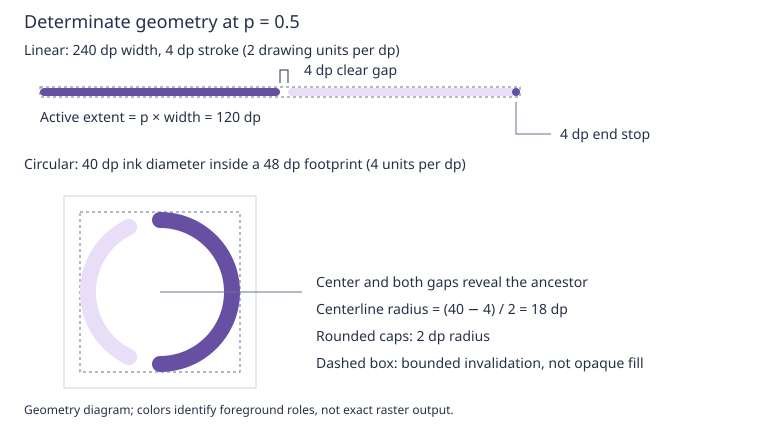

# Material 3 progress indicators

Status: proposed implementation. Framework dependencies are now specified in
[Presentation registry](../implemented/presentation_registry_design.md) and
[Widget animation registry](../implemented/widget_animation_registry_design.md). This document
owns the Material component contract, not a second scheduler or registry.

## Objective

Provide reusable standard Material 3 linear and circular progress indicators.

## Motivation

The Wi-Fi flow and other operations need consistent progress feedback with
predictable display and lifetime costs. They should consume the common animation
service rather than introduce another timer-owning component family.

## Background

Use the [glossary](../glossary.md) for widget/surface/task terminology and the
[animation survey](../../animation_framework_survey.md) for existing mechanisms.
The [legacy ProgressBar](../../../src/roo_windows/widgets/progress_bar.h) retains
its integer/sentinel API; this new family is independent. Its separate clock
migration is covered by Phase 12 of the animation design, including the change
from global-uptime marquee phase to per-presentation phase.
The framework designs supply presentation queries, tagged tracks, coherent frame
sampling, control, and teardown. Their implementation is a prerequisite of P2.3.

## Requirements

1. Show determinate or unknown-duration progress in linear and circular forms.
2. Follow the standard Material tokens and motion, with explicit reduced motion.
3. Work in ordinary containers, navigation destinations, and both dialog families.
4. Preserve gaps, transparent centers, and ancestor surfaces during animation.
5. Remain passive, with bounded incremental RAM and no steady-animation allocation.

## Design Overview

A progress indicator is a nonsurface Widget that contributes foreground shapes.
The application owns descriptive text, cancellation, and operation completion.
Shared component state stores the last determinate value, mode, motion policy,
and phase; concrete classes provide linear/circular geometry. The animation
channel is identified by the widget and a class-local integer tag.

Known progress updates immediately. Unknown progress uses a custom-time track
and the shared frame sample to compute Material's piecewise geometry. Disabling
motion cancels that track and selects fixed indeterminate geometry. The widget
cancels its own track at empty bounds; this is deliberately not a framework
rule, since other widgets animate from zero size.

| Requirement | Mechanism |
| --- | --- |
| Two progress modes/shapes | Shared semantic state and component-specific geometry |
| Material/reduced motion | Theme tokens, pure phase helpers, fixed fallback |
| Composition/lifetime | Generic tagged animation and presentation services |
| Correct surfaces | Foreground shape composition and bounded invalidation |
| Embedded cost | One optional registry track, no private executable or timer |

## Design Details

### Tokens and measurement

| Property | Standard value |
| --- | --- |
| Active color | `primary` |
| Track color | `secondaryContainer` |
| Linear track thickness and stop diameter | 4 dp |
| Active-to-track clear gap | 4 dp |
| Circular outer ink diameter and stroke | 40 dp and 4 dp |
| Caps | Rounded, radius half the stroke |

These baseline dimensions/colors follow the published
[Material tokens](https://raw.githubusercontent.com/material-components/material-components-android/master/lib/java/com/google/android/material/progressindicator/res/values/tokens.xml).
Resolve colors from the current theme during painting; do not store per-instance
color copies. Zoom converts dp to floating-point geometry once per layout;
rasterization clips to the integer widget bounds.

Linear measurement prefers the available width, with a 240 dp intrinsic width
when unconstrained and a 4 dp intrinsic height. A 20 dp width is a recommendation,
not a minimum that can violate parent constraints. Extra allocated height centers
the track vertically. Circular measurement prefers 48 by 48 dp: a 40 dp ring
plus 4 dp inset on each side. The inset follows the
[reference dimensions](https://raw.githubusercontent.com/material-components/material-components-android/master/lib/java/com/google/android/material/progressindicator/res/values/dimens.xml).
Extra space centers the nominal ring, without stretching it. Smaller constraints
shrink inset, diameter, and stroke proportionally using the smaller axis. Empty
bounds paint nothing and stop scheduling. Neither widget requests layout when
only its value, mode, motion policy, or direction changes.



The illustration uses 2 SVG units per dp for a 240 dp linear track and 4 units
per dp for a nominal 48 dp circular footprint. The dashed rectangles bound
invalidation; only the colored shapes contribute foreground pixels. It is a
geometry illustration, not a raster golden.

### Determinate geometry

Use continuous intervals before rasterization. Linear logical distance runs from
zero to track width; map it to screen coordinates only after computing segments.
RTL mirrors the complete result, including stop marker and animation. At value
`p`, the active extent is `p * width`. Its cap radius is limited to half its
length so tiny positive values do not imply a minimum progress amount.

Paint the remaining track starting one clear gap after the active extent. The
gap is measured between visible cap edges, not cap centers. At zero paint the
full track and end stop, with no active segment or leading gap. At one paint a
full active track, with no gap or separate stop. The determinate stop is an
active-colored dot inset within the logical end of the track. Clip its extent
to the remaining inactive interval as progress approaches it, and omit it when
that interval vanishes. Composite the stop and track as one resolved geometry;
do not draw an opaque track and then overpaint its stop.

Circular progress starts at twelve o'clock and proceeds clockwise. The ring
centerline radius is half the outer diameter minus half the stroke. Progress
controls an active sweep of `360 * p` degrees. Reserve the clear gap at each end
of the remaining track, converting 4 dp to an angle using centerline arc length;
cap offsets must also be included so visible ends stay separated. Omit the
remaining track if both gaps consume its sweep. Zero is a complete inactive
ring; one is a complete active ring without an overlapping cap seam. Tiny arcs
must reduce their cap radius to fit rather than draw a full-size dot implying
extra progress. There is no circular stop marker.

All shortened segments, gaps, caps, and endpoints stay within the nominal ink
envelope. Define these calculations in pure helpers shared by rendering and
phase tests. Retain floating-point shape coordinates through the existing smooth
rasterizer; round only the invalidation envelope outward (floor minima, ceil
exclusive maxima minus one). Goldens verify this policy at 75% and 100% zoom,
including the zero/one transitions in residual track geometry.

### Indeterminate motion and reduced motion

Use a timestamp-derived phase and a fixed primary color. The standard linear
animation has two disjoint moving segments with a 1800 ms period. Its four
endpoint channels use the following delay/duration and cubic-Bezier controls;
clamp each channel's normalized time before easing, then clip and normalize the
resulting intervals. These are the reference disjoint motion timings, not a
constant-speed marquee.

| Channel | Delay / duration (ms) | Bezier (x1, y1, x2, y2) |
| --- | --- | --- |
| Segment 1 start | 1267 / 533 | (0.2, 0, 0.8, 1) |
| Segment 1 end | 1000 / 567 | (0.4, 0, 1, 1) |
| Segment 2 start | 333 / 850 | (0, 0, 0.65, 1) |
| Segment 2 end | 0 / 750 | (0.1, 0, 0.45, 1) |

Sources: [disjoint animator](https://raw.githubusercontent.com/material-components/material-components-android/master/lib/java/com/google/android/material/progressindicator/LinearIndeterminateDisjointAnimatorDelegate.java),
[segment 1 start](https://raw.githubusercontent.com/material-components/material-components-android/master/lib/java/com/google/android/material/progressindicator/res/anim/linear_indeterminate_line1_head_interpolator.xml),
[segment 1 end](https://raw.githubusercontent.com/material-components/material-components-android/master/lib/java/com/google/android/material/progressindicator/res/anim/linear_indeterminate_line1_tail_interpolator.xml),
[segment 2 start](https://raw.githubusercontent.com/material-components/material-components-android/master/lib/java/com/google/android/material/progressindicator/res/anim/linear_indeterminate_line2_head_interpolator.xml), and
[segment 2 end](https://raw.githubusercontent.com/material-components/material-components-android/master/lib/java/com/google/android/material/progressindicator/res/anim/linear_indeterminate_line2_tail_interpolator.xml).
Paint the track outside the union of active segments and their clear gaps, with
no stop marker. Merge overlapping gap intervals before composing pixels.

Circular motion uses the standard advancing arc with a 5400 ms period. For
`t` in that period, use clamped fast-out-slow-in easing `E` (cubic 0.4,0,0.2,1):

```
start = 1520*t/5400 - 20 + 250*sum(E((t-c)/667))
end   = 1520*t/5400      + 250*sum(E((t-e)/667))
c = {667, 2017, 3367, 4717}; e = {0, 1350, 2700, 4050}
```

Angles are degrees; apply the twelve-o'clock origin when rendering. The net
rotation closes after seven turns. Paint only the active rounded arc, without
an inactive track. This chooses the standard advancing behavior from the
[reference animator](https://raw.githubusercontent.com/material-components/material-components-android/master/lib/java/com/google/android/material/progressindicator/CircularIndeterminateAdvanceAnimatorDelegate.java).
Evaluate cubic-Bezier easing by 16 iterations of bisection on its parameter
using the monotonic x coordinate, then evaluate y with Horner's rule. Return
exact zero/one for clamped endpoints. Use float arithmetic, no lookup table and
no heap allocation. Test the resulting endpoint-position error against a
double-precision reference; it must stay below 0.5 pixel at nominal size.

`setMotionEnabled(false)` is the component's explicit reduced-motion policy;
there is currently no application-wide preference to consult. Determinate
rendering is unchanged. Indeterminate linear rendering becomes one centered
20%-width segment with surrounding gaps/track; circular rendering becomes a
fixed 90-degree arc beginning at twelve o'clock. These static choices are Roo
policy, not a percentage result. They retain indeterminate mode and have no
recurring timer. Re-enabling motion restarts at phase zero. Applications should
supply surrounding status text such as “Connecting…” independently of motion.

### Paint ownership and invalidation

Indicators do not own an opaque rectangular surface. Rounded edges, gaps, and
the center of a circle reveal the ancestor's surface. Use foreground-first
paint-context composition and report only exclusions for pixels actually
resolved. In particular, override rectangular direct-paint exclusion behavior;
never exclude the whole circular bounding box or a linear gap. Do not preclear
the widget rectangle or paint a track under an active segment.

Register foreground geometry using `PaintContext::addOverlayShape(shape,
bounds())`: filled rounded rectangles for linear segments, filled circles for
the stop, `roo_display::SmoothThickArc` with rounded endings for partial rings,
and `SmoothThickCircle` for complete rings. Return an empty rectangle from
`getDirectPaintExclusionBounds()`; the ancestor's surface draw resolves the
registered shapes and their transparent edges. Register frontmost active/stop
shapes before track shapes, following the existing foreground-first overlay
contract. The track's geometric domain excludes active intervals and gaps.

Use at most six shapes per linear indicator (two active segments, up to three
track intervals, and a stop only in determinate mode) and two per circle. Build
shapes in local coordinates using stack storage and register them by value.
No component-owned frame buffer, dynamic path vector, or per-frame allocation is
introduced. The shared clipper's retained storage costs belong in the target
report, just like the scheduler's shared queue costs.

For value or phase changes invalidate the bounded ink envelope so old active
pixels and gaps are restored. A complete thin linear band or circular envelope
is acceptable; invalidating the containing page is not. Layout changes restore
both old and new bounds through the standard layout path. No overflow, shadow,
elevation, state layer, hit target, or tab stop is introduced.

### Animation service integration

Use class-local integer tag `kIndeterminate = 0` through
`context().animations()`. The component overrides `onAnimationFrame()` for this
tag. Select `AnimationSpec::CustomTime()` with a 33 ms minimum sample interval;
publish phase `sample.elapsed.inMillis() % period`, with period 1800/5400 ms
respectively, and invalidate the ink envelope only when phase changes. The
component does not override the empty completion hook. Delta is not accumulated.

The indicator subscribes to presentation notifications while indeterminate
motion is enabled, even before attachment. It owns the decision to animate;
there is no hidden/detach policy in AnimationSpec. A private
`reconcileAnimation()` helper computes whether motion is wanted, the widget
`isPresented()`, and bounds are nonempty. When all three are true and the channel
does not exist, reset phase and start it. Otherwise cancel an existing channel.
This keeps dormant indicators subscribed for a future show event without
retaining a timer or animation track.

Call that helper from effective mode/motion setters, `onLayout()`, and
`onPresentationChanged()`. When a change reports detachment since delivery,
cancel first, then reconcile: even immediate reattachment starts phase zero.
Hidden-to-visible and empty-to-nonempty transitions likewise restart because
they create a new track. A repeated layout or setter leaves an existing eligible
track alone; it must not continually restart it. The presentation hook delegates
to the base implementation for any inherited behavior.

Entering determinate mode or disabling motion cancels the channel and removes
the subscription before invalidating static geometry. Preserve the last known
determinate fraction while indeterminate. Widget destruction provides final
cleanup through both services, with no callbacks during teardown. No component
handle, callback thunk, scheduler reference, ticket, or heap controller is needed.

The registry publishes explicit deadlines on the context scheduler through the
application ticker. Its 33 ms interval is a minimum spacing, not a promised frame
rate; unrelated painting and slow displays can delay a sample. It is not rounded
to a periodic 20 ms grid. Material geometry is time-derived and skips unseen
samples. Paint continuations retain the already published phase.

### Resource gates

Budget at most 12 bytes beyond Widget for fraction, phase, and packed
mode/motion/direction flags; no animation handle is stored. Determinate and reduced-motion
indicators hold no live registry track. One animated indicator uses one generic
track and one widget presentation subscription; registry capacity and
allocator overhead are governed by the framework designs and must be included
in application-level accounting. Dormant indeterminate indicators retain only their presentation subscription.

Component object text+rodata must stay within 12 KiB excluding shared rendering
and animation code; largest component stack frame within 256 bytes. No component
allocation during ordinary updates or paint. Record actual target sizeof,
linked flash delta, stack and exceptions/RTTI-disabled compilation against the
[Phase 1 target baseline](../../material3_phase1_acceptance.md). Failed gates
require implementation correction or a reviewed design revision, not a silent
increase. At nominal size the invalidation envelope is a 240×4 band or at most
a 48×48 circle footprint; no containing-page invalidation is permitted.

## Proposed API

Place both classes and their shared state base in
`material3/progress_indicator/progress_indicator.h`, with out-of-line rendering
and scheduling in the corresponding `.cpp`. The following is an API sketch, not a complete header:

```cpp
enum class ProgressIndicatorMode : uint8_t { kDeterminate, kIndeterminate };

class ProgressIndicator : public Widget {
 public:
  /// Clamps finite fractions to [0, 1] and selects determinate mode.
  /// Returns false for NaN/infinity, leaving all state unchanged.
  bool setProgress(float fraction);
  float progress() const;
  void setIndeterminate();
  ProgressIndicatorMode mode() const;
  void setMotionEnabled(bool enabled);
  bool motionEnabled() const;
 protected:
  explicit ProgressIndicator(ApplicationContext& context);
};

class LinearProgressIndicator : public ProgressIndicator {
 public:
  explicit LinearProgressIndicator(ApplicationContext& context);
  void setLayoutDirection(LayoutDirection direction);
  LayoutDirection layoutDirection() const;
};

class CircularProgressIndicator : public ProgressIndicator {
 public:
  explicit CircularProgressIndicator(ApplicationContext& context);
};
```

Both concrete types are noncopyable and nonmovable, initially determinate at
zero, with motion enabled. Linear direction defaults to LTR, using the existing
Material 3 direction type/convention. Circular motion is clockwise regardless
of text direction. Indeterminate mode retains the last determinate value for
`progress()`; callers must inspect `mode()` before treating that value as current
progress. Repeated setters with identical effective state do nothing.

Values update immediately; there is no determinate interpolation timer. Calling
`setProgress()` during indeterminate motion cancels its registered track before publishing
the new state. Switching to indeterminate starts from phase zero. Completion at
one remains visible until the application hides or replaces the widget. There
are no callbacks, text allocations, or backend bindings. Setters and lifecycle
changes run on the application's UI/scheduler thread, like other widgets.

## Implementation Plan

Follow [embedded C++](../../../.github/instructions/embedded-cpp-code-authoring.instructions.md)
and [widget authoring](../../../.github/instructions/roo-windows-widget-authoring.instructions.md).
Implement the two framework dependencies first. Each component phase is one
commit including its tests and example/documentation slice.

### Phase 1: static geometry and API

Implement both shapes, measurement, theme roles, determinate and reduced-motion
rendering. Add light/dark goldens at zero, tiny positive, half, near-one and one,
RTL and 75%/100% zoom, and patterned-background restoration tests. Introduce a
build-covered catalog with value controls. Test NaN/infinity rejection, clamping,
no-op setters and tiny bounds. Until Phase 2, entering motion-enabled indeterminate
mode warns `Unimplemented: progress animation` once per transition and uses the
static fallback; repeated setters and paint never warn.

> Progress indicators Phase 1: add static Material progress geometry
>
> Add linear and circular widgets, component API, static fallback, catalog and
> geometry/paint tests under the Material 3 progress indicators design.

### Phase 2: shared animation integration

Register the custom-time track described above and remove the temporary warning.
Add motion controls to the catalog and fixed-phase goldens. Test waveform
boundaries, large time jumps, empty-layout suspension/restart, ancestor visibility,
detach/reattach, reduced-motion toggling and cancellation through the real registry.
Validate slow continuation and bounded display writes without widget-local timers.

> Progress indicators Phase 2: use shared animation tracks for Material motion
>
> Add time-derived indeterminate geometry through the common registry and verify
> component suspension, lifetime, phase goldens, and frame-coherent rendering.

### Phase 3: composition and cost acceptance

Extend the example with a full-screen dialog and an independently opening menu.
Test nested lists, navigation and dialog ownership; record resource gates and
compile without exceptions/RTTI. Run focused tests with ASan/UBSan and relevant
core paint/navigation suites. Preserve reproducible measurements and limitations
in an acceptance report; mark P2.3 implemented only after all component gates
and framework prerequisites pass. Full Wi-Fi integration remains P2.4.

> Progress indicators Phase 3: validate composition and embedded resource costs
>
> Add dialog/menu integration coverage and target acceptance evidence for the
> Material indicators, then update design and roadmap implementation status.

## Testing Plan

Component unit/golden tests, catalog build, registry-integrated lifecycle and
slow-display tests, and target cost evidence complete P2.3. The framework suites
own generic scheduler, generation, playback-control, and teardown invariants;
component tests exercise their integration without duplicating the entire service.

## Caveats

### Rejected Alternatives

#### Private scheduler and lifecycle controller

The dedicated services centralize lifetime and frame timing. Per-indicator
executables and private lifecycle controllers duplicate those contracts. The
indicator subscribes directly to the shared presentation service.

#### Extend legacy ProgressBar in place

Its public value/sentinel and repaint model differ. Keep compatibility and
migrate callers explicitly.

#### Exclude or preclear a whole rectangular surface

The ring center and gaps belong to ancestor content. Foreground composition is
required by the widget-authoring contract.

## Future Work

Expressive/wavy variants, palette cycling, buffered progress, determinate
interpolation and automatic completion hiding remain outside the standard
initial component scope. Global motion preferences belong in a separate policy
design; the explicit component motion flag is sufficient here.
