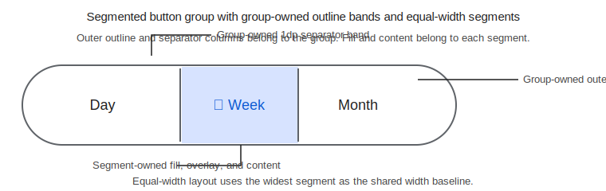

# Roo Windows Material 3 Segmented Buttons Design

## Implementation status

**Proposed.** None of the defined scope is implemented. The status of existing and outstanding prerequisites is recorded in the [status index](../README.md).

## Objective

Add a Material 3 segmented-button family to `roo_windows` that covers the
non-expressive segmented-button component with:

- single-select and multi-select groups,
- two to five connected segments,
- text-only, icon-only, and icon-plus-text segment content,
- equal-width segment layout with shared outer-outline and separator
  ownership,
- optional selected check-icon behavior that does not change measured size,
- and group-owned selection hooks that reuse the existing widget interaction
  pipeline.

This design intentionally targets the classic Material 3 segmented-button
family. It does not merge the newer expressive connected button groups into the
same API.

## Motivation

`roo_windows` already has Material 3 action buttons and standalone selection
controls, but it still lacks the compact connected-choice surface used for view
switching, sorting, and small filter sets. That leaves a gap between a row of
independent buttons and heavier list-based selection UIs.

The Material 3 expressive update now recommends connected button groups rather
than segmented buttons, but segmented buttons remain a stable legacy Material 3
surface in existing products. `roo_windows` needs a dedicated segmented-button
API for those products without mutating the landed `material3::Button` family
into a grouped, checkable control.

## Background

### Current Status in `roo_windows`

The current checked-in Material 3 surfaces establish most of the primitives
this design needs:

- [../implemented/material3_buttons_design.md](../implemented/material3_buttons_design.md) and the landed
  [src/roo_windows/material3/button/button.h](../../../src/roo_windows/material3/button/button.h)
  define the current Material 3 button family as momentary action widgets,
  not grouped or checkable buttons.
- [src/roo_windows/material3/checkbox/checkbox.h](../../../src/roo_windows/material3/checkbox/checkbox.h),
  [src/roo_windows/material3/radio_button/radio_button.h](../../../src/roo_windows/material3/radio_button/radio_button.h),
  and [src/roo_windows/material3/switch/switch.h](../../../src/roo_windows/material3/switch/switch.h)
  show the repo's current selection-state patterns: compact widgets, no new
  callback surface, and click handling through the existing widget base class.
- [../in_progress/material3_lists_design.md](../in_progress/material3_lists_design.md) already closes on a
  shared-band paint model where the owner container keeps separator ownership
  instead of making every child paint overlapping borders.
- [material3_navigation_rail_design.md](material3_navigation_rail_design.md)
  already closes on the owner-container pattern for shared selection state and
  virtual no-op hooks instead of per-child stored callbacks.

What does not exist today:

- no Material 3 segmented-button widget family,
- no grouped button selection container under `material3/`,
- no shared segmented-button token surface for outline, spacing, and selected
  colors,
- and no example or tests that cover connected grouped-button painting.

The current `material3::Button` implementation is useful as token and overlay
context, but it is not the right public shape for segmented buttons.

### Material 3 Signals

The current Material 3 segmented-button references are:

- [Overview](https://m3.material.io/components/segmented-buttons/overview)
- [Specs](https://m3.material.io/components/segmented-buttons/specs)
- [Guidelines](https://m3.material.io/components/segmented-buttons/guidelines)

The relevant signals carried into this design are:

1. Segmented buttons are the legacy Material 3 grouped-choice surface; the
   expressive update recommends connected button groups instead.
2. Segmented buttons come in two behavioral variants: single-select and
   multi-select.
3. A segmented-button group is intended for two to five choices.
4. Segments may contain label text, an icon, or both.
5. Labels stay on one line and do not wrap.
6. The component height is `40dp`, the outline width is `1dp`, and horizontal
   padding is at least `12dp` per side.
7. Spacing between content elements inside a segment is `8dp`.
8. Unselected content uses `on-surface` on a transparent container with an
   `outline` stroke.
9. Selected segments use `secondary-container` with
   `on-secondary-container` content.
10. When a segment uses both icon and label text, the selected state replaces
    the segment icon with the selected check icon.
11. The official segmented-button outline is fully rounded at the outer group
    boundary.

### Local Design References

The most relevant local references are:

- [../implemented/material3_buttons_design.md](../implemented/material3_buttons_design.md)
- [../in_progress/material3_lists_design.md](../in_progress/material3_lists_design.md)
- [material3_navigation_rail_design.md](material3_navigation_rail_design.md)
- [widget_authoring.md](../../widget_authoring.md)
- [../.github/instructions/roo-windows-widget-authoring.instructions.md](../../../.github/instructions/roo-windows-widget-authoring.instructions.md)

Those references impose four concrete local constraints:

1. Do not add grouped-selection state to every `material3::Button` instance.
2. Keep selection ownership on the group rather than on each child.
3. Keep shared outline and separator ownership on the group rather than making
   adjacent children paint overlapping `1dp` strokes.
4. Reuse the current `SurfaceWidget` overlay and click-animation pipeline; do
   not introduce a segmented-button-local ripple subsystem.

## Requirements

### Functional Requirements

1. Introduce a Material 3 segmented-button family under `roo_windows/material3`.
2. Support both single-select and multi-select groups.
3. Limit one group to two through five segments.
4. Support text-only, icon-only, and icon-plus-text segment content.
5. Keep labels single-line and horizontally centered.
6. Resolve colors, typography, spacing, and outline defaults from the active
   `Theme`.
7. Support the optional selected check icon without changing the measured size
   of the group when selection changes.
8. Support RTL layout for logical first/last corners, separator placement, and
   icon/text ordering.

### Interaction Requirements

1. Each segment is clickable through the existing widget input path.
2. In single-select mode, clicking a different segment selects exactly one
   segment; clicking the already-selected segment keeps it selected.
3. In multi-select mode, clicking a segment toggles only that segment.
4. Selection change notifications are group-owned.
5. The group exposes virtual hooks for semantic adapters and also participates
   in the existing widget interactive-change callback path.
6. Pressed, hovered, focused, disabled, and activated visuals flow through the
   existing widget state model.

### API Requirements

1. Expose one `SegmentedButtonGroup` container.
2. Expose one `SegmentedButton` child widget.
3. Keep `SegmentedButton` content fixed to label plus optional icon; do not
   expose arbitrary child slots.
4. Keep selection state off the child public API; the group owns it.
5. Keep the maximum segment count explicit in the API.
6. Do not fold expressive connected button groups into this API.
7. Do not mutate the landed `material3::Button` type in place.

### Embedded Constraints

1. Do not allocate on paint, overlay, or gesture paths.
2. Store the canonical selection state once per group, not once per segment.
3. Do not store per-segment callback objects.
4. Do not store a per-segment selected-icon pointer; selected-icon rendering
   uses one shared check glyph.
5. Keep group child capacity fixed at five segments so `add()` and `clear()`
   do not depend on heap-backed child vectors.
6. Add pointer-size-aware size-budget tests for the new public types.

## Design Overview

The public surface is split into two widget types:

1. `material3::SegmentedButtonGroup`, a horizontal `Container` that owns
   selection state, equal-width layout, shared outline bands, and vertical
   separator bands.
2. `material3::SegmentedButton`, a compact `BasicSurfaceWidget` child that
   owns content layout, container fill, and state-layer paint for one segment.

Selection is group-owned. The group stores one packed `selection_mask_` and
each child stores only an owner pointer, its index, and its first/middle/last
position. That keeps the single-select and multi-select rules in one place and
avoids putting a selected-state byte on every segment.

Paint ownership is also group-owned where edges are shared. The group paints:

- the outer `1dp` rounded outline,
- the `1dp` vertical separator bands between segments,
- and no fill.

Each segment paints:

- its selected or unselected fill,
- its state layer,
- and its icon / text content.

That split follows the same direct-to-framebuffer rule used by the list design:
shared edge pixels belong to the owner, not to adjacent children.



The decisive design choices are:

1. add a new segmented-button family instead of extending `material3::Button`,
2. keep selection canonical on the group as a bitmask,
3. keep the group fixed-capacity at five segments,
4. reserve selected-icon width during measurement so selection changes do not
   reflow the control,
5. keep the grouped outline and separators group-owned,
6. and leave expressive connected button groups for a later design.

## Design Details

### Type Split and Selection Ownership

`SegmentedButtonGroup` derives from `Container`.

That choice is semantic. The group owns child sequencing, shared geometry, and
the outer outline / separator decoration that spans multiple children. A plain
`BasicWidget` would force the design to reimplement child enumeration and paint
coordination that `Container` already provides.

`SegmentedButton` derives from `BasicSurfaceWidget`.

Each segment owns a meaningful per-segment surface: selected and unselected
fills, state layers, and segment-local clipping for first/middle/last rounded
corners. The segment does not own the shared stroke.

Selection is group-owned and represented by one `uint8_t selection_mask_`.
With at most five segments, one bit per segment is sufficient.

- In single-select mode, the normalized mask is either `0` or exactly one bit.
- In multi-select mode, any subset of the low `segment_count()` bits is valid.

The group does not duplicate that state on its children. Each child asks the
group whether its bit is set.

Single-select behavior is closed as follows:

1. programmatic `setSelectedIndex(-1)` and `setSelectionMask(0)` are allowed,
   because construction and tests need an empty initial state,
2. user interaction never clears the active segment by tapping it again,
3. and any multi-bit mask written into a single-select group is normalized to
   the lowest-numbered set bit.

Click handling is:

1. `SegmentedButton::onClicked()` delegates to its owning group,
2. the group calls `onSegmentInvoked(index)` first,
3. the group computes the next normalized selection mask,
4. if the mask changed, the group updates the affected child visuals,
5. the group calls `onSelectionChanged(old_mask, new_mask)`,
6. and the group emits one interactive-change event for itself through the
   existing widget event dispatcher.

This matches the navigation-rail design pattern: virtual no-op hooks for
semantic adapters, and no new stored callback object on each child.

### Layout and Measurement

Segmented buttons are always horizontal and never wrap.

Each segment resolves one inner content width from:

- minimum left and right padding of `12dp`,
- optional leading icon slot,
- optional selected-icon slot reservation,
- one `8dp` gap between adjacent content elements,
- and the measured width of one single-line label.

The selected-icon reservation rule is closed explicitly because it affects
layout stability.

- If `showSelectedIcon()` is `false`, no check slot is reserved.
- If `showSelectedIcon()` is `true` and the segment has label text, the segment
  reserves one check-icon slot even while unselected.
- If the segment has both icon and label, the selected check glyph reuses the
  existing icon slot width.
- If the segment is icon-only, the selected-icon feature is ignored and no
  extra slot is reserved.

That guarantees selection changes do not alter natural width.

The group uses equal-width segments. Let `n` be the segment count, `o` the
`1dp` outer outline band, `s` the `1dp` separator band, and `w_i` the measured
inner width of segment `i`. The natural group width is:

$$
W_\text{natural} = 2o + (n - 1)s + n \cdot \max_i w_i
$$

Natural group height is the spec height: `40dp`.

The group owns the stroke bands. Child segment bounds are therefore inset away
from the outer outline and separated by explicit `1dp` vertical bands. Child
paint never writes into those shared columns.

When the parent gives the group more width than its natural width, the group
distributes the additional width evenly across all segments. When the parent
forces the group narrower than natural width, the group still divides the
available inner width evenly and child labels clip within their own content
bounds. v1 does not add ellipsis state or horizontal scrolling.

The Material spec's `48dp` target remains an application-layout concern, not a
widget-local height increase. The widget reports a `40dp` natural height and is
expected to live in surrounding padding or layout that satisfies the larger tap
target when required, matching the current button practice.

### Visual Model and Theme Resolution

The segmented-button family has one visual style in this design. There is no
baseline-versus-expressive selector.

Resolved defaults are:

1. Typography uses the same Material 3 `label-large` role already used by
   `material3::Button`.
2. Unselected segments use transparent fill with `on-surface` content.
3. Selected segments use `secondary-container` fill with
   `on-secondary-container` content.
4. The group outline and separators use `outline`.
5. Disabled content and outline use the same `on-surface` alpha-composite
   treatment already used by the Material 3 button family.
6. Resting elevation is always zero.
7. The outer group shape is fully rounded.
8. First, middle, last, and only-segment positions resolve segment fill clips.

The group outline is a pill. Child fill shapes are the pill inset by the `1dp`
stroke band.

- only segment: full pill,
- first segment: rounded on the logical leading edge,
- middle segment: square rectangle,
- last segment: rounded on the logical trailing edge.

Unlike `material3::Button`, segmented buttons do not morph shape during the
click animation. The current overlay and press pipeline remains active, but the
corner geometry stays fixed for the entire gesture.

### Content Model and Selected Icon Policy

The fixed content model is one non-owning `roo::string_view` label plus one
optional `MonoIcon*`.

The design deliberately does not add:

- trailing icons,
- per-segment custom selected icons,
- or arbitrary child slots.

The selected-icon policy is group-owned through one `showSelectedIcon` flag.
That mirrors the Material guidance closely enough without putting another
policy byte on every segment.

Behavior is:

1. text-only selected segments prepend the shared check glyph,
2. icon-plus-text selected segments replace the normal icon with the shared
   check glyph,
3. icon-only segments keep their existing icon and rely on container/content
   color change for selected emphasis,
4. and all selected-icon paint uses the same resolved content color as the
   current selected state.

The design does not add runtime validation that forbids mixed text-only,
icon-only, and icon-plus-text segments in one group. The Material guidance is
still correct, but the geometry already supports all three layouts and the repo
preference is to avoid policy fields that do not change paint or interaction.

### Paint Ownership and Invalidation

The shared-band ownership model is the most important implementation detail.

The group paints after its children and owns only the pixels that are shared
across segments:

1. the outer `1dp` stroke band,
2. the `1dp` separator bands,
3. and no interior fill.

Each segment paints only inside its own fill bounds:

1. selected or unselected fill,
2. icon and text content,
3. state-layer overlay inside the same clip.

This yields the repaint consequences the repo wants:

1. a dirty segment repaint stays segment-local because the child bounds exclude
   the group-owned stroke columns,
2. an invalidated group repaint redraws the shared outline and separator bands
   after child paint,
3. and no pixel is written twice with different colors during one pass.

The group background remains transparent. There is no second container fill at
the group level behind the child segment fills.

### RTL and Logical Geometry

The component is logically ordered.

RTL affects:

- first versus last segment corner rounding,
- the meaning of leading and trailing padding,
- and icon-plus-text ordering inside the segment.

Selection bit positions stay index-based, not direction-based. Segment `0` is
the first child added to the group; RTL changes its visual placement, not its
bit position or callback index.

### Relationship to the Existing Button Family

The segmented-button family does not subclass `material3::Button`.

That decision is closed for two reasons:

1. `material3::Button` is a momentary action widget with size and shape-morph
   semantics that do not fit grouped selection.
2. Adding group ownership, selected state, and shared-edge paint behavior to
   `material3::Button` would burden every button instance with fields and
   branches that only segmented buttons need.

If implementation needs shared helpers for disabled compositing or typography,
those helpers should move into a private internal utility file used by both
families. Public inheritance is the wrong reuse mechanism here.

### RAM Budget

The important accounting rule is structural: segmented-button state is paid by
segmented buttons only, and the canonical selection state lives once per group.

Target host-side size-budget tests are:

1. `SegmentedButton`:
   `sizeof(BasicSurfaceWidget) + sizeof(roo::string_view) + 2 * sizeof(void*) + 8`
2. `SegmentedButtonGroup`:
   `sizeof(Container) + kMaxSegments * sizeof(WidgetRef) + 8`

Those tests protect the design intent:

1. the child pays only for label storage, optional icon pointer, and owner
   linkage,
2. the group pays once for child references and the selection mask,
3. and the landed `material3::Button` type stays unchanged.

## Proposed API

### Core Types

```cpp
namespace roo_windows {
namespace material3 {

enum class SegmentedButtonSelectionMode : uint8_t {
  kSingle,
  kMultiple,
};

class SegmentedButtonGroup;

class SegmentedButton : public BasicSurfaceWidget {
 public:
  explicit SegmentedButton(ApplicationContext& context,
                           roo::string_view label = {},
                           const MonoIcon* icon = nullptr);

  roo::string_view label() const;
  void setLabel(roo::string_view label);

  const MonoIcon* icon() const;
  void setIcon(const MonoIcon* icon);

  bool selected() const;

  bool isClickable() const override;
  Dimensions getSuggestedMinimumDimensions() const override;
  void paint(PaintContext& ctx) const override;

 protected:
  void onClicked() override;

 private:
  friend class SegmentedButtonGroup;

  enum class Position : uint8_t {
    kOnly,
    kFirst,
    kMiddle,
    kLast,
  };

  void attachToGroup(SegmentedButtonGroup* group, uint8_t index,
                     Position position);
  void detachFromGroup();
  void setPositionFromGroup(Position position);

  roo::string_view label_;
  const MonoIcon* icon_;
  SegmentedButtonGroup* group_;
  uint8_t index_ : 3;
  uint8_t position_ : 2;
};

class SegmentedButtonGroup : public Container {
 public:
  static constexpr uint8_t kMaxSegments = 5;

  explicit SegmentedButtonGroup(
      ApplicationContext& context,
      SegmentedButtonSelectionMode mode =
          SegmentedButtonSelectionMode::kSingle);

  SegmentedButtonSelectionMode selectionMode() const;
  void setSelectionMode(SegmentedButtonSelectionMode mode);

  bool showSelectedIcon() const;
  void setShowSelectedIcon(bool show);

  int segmentCount() const;

  bool isSelected(int index) const;

  int selectedIndex() const;
  void setSelectedIndex(int index);

  uint8_t selectionMask() const;
  void setSelectionMask(uint8_t mask);

  bool add(SegmentedButton& segment);
  bool add(std::unique_ptr<SegmentedButton> segment);
  void clear();

  void paint(PaintContext& ctx) const override;

 protected:
  int getChildrenCount() const override;
  const Widget& getChild(int idx) const override;
  Widget& getChild(int idx) override;
  Dimensions onMeasure(WidthSpec width, HeightSpec height) override;
  void onLayout(bool changed, const Rect& rect) override;

  virtual void onSegmentInvoked(int index) {}
  virtual void onSelectionChanged(uint8_t old_mask, uint8_t new_mask) {}

 private:
  void handleSegmentClick(SegmentedButton& segment);
  void propagatePositions();
  uint8_t normalizeMask(uint8_t mask) const;

  WidgetRef segments_[kMaxSegments];
  uint8_t selection_mask_;
  uint8_t segment_count_ : 3;
  uint8_t mode_ : 1;
  uint8_t show_selected_icon_ : 1;
};

}  // namespace material3
}  // namespace roo_windows
```

### API Notes

1. `selectionMask()` is the canonical selection state for both modes.
2. `selectedIndex()` is a convenience view of the canonical mask and returns
   `-1` when no bit is selected.
3. In single-select mode, `setSelectionMask()` keeps only the lowest set bit.
4. `setSelectedIndex(-1)` clears the current selection programmatically.
5. `add()` returns `false` when the group already owns five segments.
6. `showSelectedIcon()` affects only segments with label text.
7. The public API does not expose per-segment callbacks.
8. The public API does not reinterpret or extend the existing
   `material3::Button` symbol.

## Implementation Plan

Implementation work for these phases follows the repo-local
[roo_windows widget authoring instruction](../../../.github/instructions/roo-windows-widget-authoring.instructions.md).

### Phase 1: Declare the Segmented-Button Types and Size Budgets

Code slice:

1. Add `SegmentedButtonSelectionMode`, `SegmentedButton`, and
   `SegmentedButtonGroup` declarations.
2. Add fixed-capacity child storage to the group API.
3. Add pointer-size-aware size-budget tests for both public types.
4. Leave all existing Material 3 button and selection widgets untouched.

Proposed commit message:

> Material 3 segmented buttons Phase 1: declare the widget family.
>
> Add `SegmentedButton` and `SegmentedButtonGroup` declarations together with
> size-budget tests that keep grouped-selection state out of
> `material3::Button`.

Validation: add `material3_segmented_button_test` and run
`bazel test //:material3_segmented_button_test` from the `roo_windows`
workspace.

### Phase 2: Implement Segment Measurement and Content Paint

Code slice:

1. Implement token-backed segment measurement for text-only, icon-only, and
   icon-plus-text content.
2. Implement selected-icon slot reservation so selection does not alter natural
   width.
3. Implement per-position segment fill clips and content paint.
4. Reuse the existing Material 3 overlay pipeline without adding a new ripple
   subsystem.

Proposed commit message:

> Material 3 segmented buttons Phase 2: paint individual segments.
>
> Implement segment measurement and paint, including selected-icon reservation,
> fixed `40dp` height, and first/middle/last shape clips.

Validation: run `bazel test //:material3_segmented_button_test` with focused
cases for content permutations, measurement stability, and disabled-state
colors.

### Phase 3: Implement Group Layout, Shared Bands, and Selection Semantics

Code slice:

1. Implement fixed-capacity add / clear behavior and child enumeration.
2. Implement equal-width layout and RTL-aware first/last propagation.
3. Implement group-owned outer stroke and separator-band paint.
4. Implement single-select and multi-select click semantics on the canonical
   selection mask.
5. Implement group-level virtual hooks and interactive-change dispatch.

Proposed commit message:

> Material 3 segmented buttons Phase 3: add grouped layout and selection.
>
> Implement `SegmentedButtonGroup` layout, shared-band paint ownership, and
> single-select / multi-select interaction semantics.

Validation: run `bazel test //:material3_segmented_button_test` and add golden
coverage through `bazel test //:material3_segmented_button_golden_test` for
shared-outline ownership, selected and unselected colors, and RTL geometry.

### Phase 4: Add Example Coverage and Migration Documentation

Code slice:

1. Add an example under `examples/material3/segmented_buttons/` that shows one
   single-select and one multi-select group.
2. Add example states for text-only, icon-plus-text, and icon-only groups.
3. Add documentation links from adjacent Material 3 examples or docs where
   relevant.

Proposed commit message:

> Material 3 segmented buttons Phase 4: add examples and final coverage.
>
> Add a Material 3 segmented-buttons example and complete the focused visual
> coverage for grouped outline, separator, and selection behavior.

Validation: run `bazel test //:material3_segmented_button_test
//:material3_segmented_button_golden_test` and build the segmented-buttons
example in the emulation workflow.

## Testing Plan

Testing should cover the component at three levels.

1. Unit tests for API and state behavior:
   selection-mask normalization, `selectedIndex()` behavior, add / clear bounds,
   click semantics for both modes, and size-budget assertions.
2. Measurement and layout tests:
   equal-width distribution, selected-icon width reservation, `40dp` natural
   height, text-only versus icon-bearing widths, and RTL first/last geometry.
3. Golden tests:
   unselected, selected, disabled, hovered, and pressed states; outer-stroke
   and separator ownership; text-only and icon-plus-text layouts; and one
   multi-select example with discontiguous selected segments.

The focused validation targets are:

- `bazel test //:material3_segmented_button_test`
- `bazel test //:material3_segmented_button_golden_test`

## Caveats

### Rejected Alternatives

#### Extend `material3::Button` with Group and Selected State

This was rejected because it would add grouped-selection state, shared-edge
paint branches, and group-owner linkage to every Material 3 button instance.
That violates the repo's pay-for-what-you-use rule and still leaves the shared
outline ownership problem unsolved.

#### Render the Entire Control as One Monolithic Widget

This was rejected because it would force one large widget to reimplement:

- per-segment pressed and focused state,
- per-segment hit testing,
- and per-segment overlay ownership.

Child widgets already solve those problems cleanly. The fixed-capacity group
plus compact child widgets is the smaller long-term design.

#### Treat Expressive Connected Button Groups as the Same API

This was rejected because the Material spec has already split the two families.
Segmented buttons are the legacy connected-choice surface; expressive connected
button groups are a newer visual system and deserve their own design and token
surface.

#### Use a Heap-Backed Dynamic Child Vector

This was rejected because the component spec already closes the useful range at
five segments. A fixed-capacity child array gives the same product surface with
clearer RAM bounds and no heap dependency on `add()`.

## Future Work

1. Add a separate expressive connected button group family instead of trying to
   evolve this segmented-button API in place.
2. Add density tokens if a concrete product needs the `40dp - 4dp * n`
   condensed heights from the Material spec.
3. Add optional product-level appearance overrides through one shared const
   appearance pointer if a real customization need appears that theme tokens do
   not already cover.