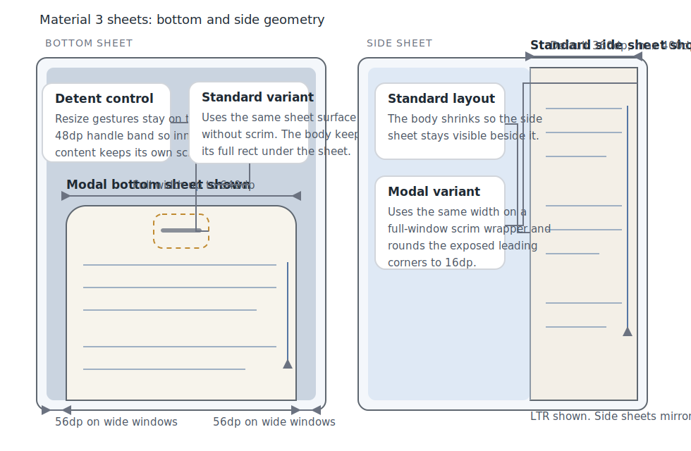

# Roo Windows Material 3 Sheets Design

## Implementation status

**Proposed.** None of the defined scope is implemented. The status of existing and outstanding prerequisites is recorded in the [status index](../README.md).

## Objective

Add Material Design 3 sheet support to `roo_windows` in a form that matches
the current embedded-first widget framework and covers both bottom and side
sheet families.

The design provides:

- a standard bottom-sheet layout that keeps the main body interactive while the
  sheet overlays the bottom edge,
- a modal bottom-sheet wrapper that presents the same bottom sheet over a
  scrim,
- a standard side-sheet layout that keeps the sheet visible beside the main
  body on medium and expanded windows,
- a modal side-sheet wrapper that presents the same side sheet over a scrim,
- generic caller-owned content instead of a menu-only or form-only sheet API,
- bottom-sheet detents with a built-in drag handle,
- independent vertical scrolling inside each sheet,
- and reuse of the existing popup, scrim, theme, and scrolling primitives.

The result is a baseline Material 3 sheet family that other components can
build on. It deliberately leaves adaptive shell policy, predictive-back
animation, and stock app-bar templates out of the base component family.

## Motivation

`roo_windows` already has popups, dialogs, scrims, buttons, lists, and a
navigation-drawer design, but it still lacks a general Material 3 sheet
primitive.

That gap matters for three reasons:

1. Material 3 treats bottom sheets as the compact and medium-window secondary
   surface, and it treats side sheets as the medium and expanded-window sibling
   for much of the same content.
2. The checked-in [menu design](material3_menus_design.md) explicitly defers
   compact-window bottom-sheet adaptation until `roo_windows` has a bottom-sheet
   primitive.
3. Without a library sheet primitive, every application that needs filters,
   inspectors, share panels, or contextual actions has to reinvent layout,
   scrim handling, scrolling, and dismissal behavior.

The library therefore needs a generic sheet family first. Higher-level
components such as menus, inspectors, and adaptive scaffolds can compose on top
of that substrate afterward.

## Background

### Current Starting Point in `roo_windows`

There is no checked-in Material 3 bottom-sheet or side-sheet implementation
today.

The nearest current primitives are:

- [src/roo_windows/core/application.h](../../../src/roo_windows/core/application.h)
  and [src/roo_windows/core/main_window.h](../../../src/roo_windows/core/main_window.h),
  which already expose popup-layer children and popup tasks above regular
  content and below dialogs,
- [src/roo_windows/widgets/scrim.h](../../../src/roo_windows/widgets/scrim.h),
  which already provides the overlay-backed scrim widget used by dialogs,
- [src/roo_windows/containers/scrollable_panel.h](../../../src/roo_windows/containers/scrollable_panel.h),
  which already provides `SimpleScrollablePanel` with vertical drag, fling, and
  overshoot behavior,
- [src/roo_windows/material3/button/button.h](../../../src/roo_windows/material3/button/button.h),
  which already provides the Material 3 button family that callers can place
  inside sheet content,
- [material3_navigation_drawer_design.md](material3_navigation_drawer_design.md),
  which already established the local pattern of splitting an embedded sheet
  surface from a scrim-backed modal wrapper,
- and [material3_snackbar_design.md](material3_snackbar_design.md), which
  documents the current popup-layer hit-testing behavior and its consequences
  for transient surfaces.

Those landed pieces constrain the design directly:

1. modal sheets should reuse popup tasks and `Scrim` instead of introducing a
   second overlay subsystem,
2. sheet scrolling should reuse `SimpleScrollablePanel` instead of adding a new
   sheet-local scroller,
3. sheet content should stay generic because buttons, lists, and other Material
   3 building blocks already exist as composable widgets,
4. and the base sheet API should not depend on a stock Material 3 icon-button
   family because there is no checked-in `material3/icon_button` implementation
   today.

### Material 3 Signals

This design is aligned against the current Material 3 sheet references:

- [Bottom sheets overview](https://m3.material.io/components/bottom-sheets/overview)
- [Bottom sheets specs](https://m3.material.io/components/bottom-sheets/specs)
- [Bottom sheets guidelines](https://m3.material.io/components/bottom-sheets/guidelines)
- [Side sheets overview](https://m3.material.io/components/side-sheets/overview)
- [Side sheets specs](https://m3.material.io/components/side-sheets/specs)
- [Side sheets guidelines](https://m3.material.io/components/side-sheets/guidelines)

The product signals that matter most here are:

1. bottom sheets have two variants: standard and modal,
2. side sheets have two variants: standard and modal,
3. standard bottom sheets coexist with the primary UI and keep the underlying
   screen interactive,
4. modal bottom sheets block the rest of the UI with a scrim and initially open
   no taller than 50% of the window height,
5. bottom sheets span the full width on compact windows and clamp to `640dp`
   with `56dp` side margins on wider windows,
6. bottom sheets use a `28dp` top corner radius and an optional drag handle
   with a `48dp` accessible hit target,
7. standard side sheets are supplementary surfaces for medium and expanded
   windows that remain visible beside the main content,
8. modal side sheets are preferred on compact windows and block the rest of the
   UI with a scrim,
9. side sheets anchor to the side edge, default to a fixed width, and clamp to
   a `400dp` maximum width,
10. side sheets scroll vertically and do not introduce horizontal sheet
    scrolling,
11. modal side sheets use rounded exposed corners with a `16dp` radius,
12. and on larger expanded windows the same content often moves from a bottom
    sheet to a side sheet rather than keeping a bottom-attached presentation.

### Local Design References

The most relevant local references are:

- [material3_menus_design.md](material3_menus_design.md)
- [material3_navigation_drawer_design.md](material3_navigation_drawer_design.md)
- [material3_snackbar_design.md](material3_snackbar_design.md)
- [embedded-design-doc-authoring.instructions.md](../../../.github/instructions/embedded-design-doc-authoring.instructions.md)
- [roo-windows-widget-authoring.instructions.md](../../../.github/instructions/roo-windows-widget-authoring.instructions.md)

Those references drive five important local constraints:

1. keep the sheet family generic enough that menus, inspectors, and forms can
   all host their own content,
2. keep modal presentation on the existing popup and scrim infrastructure,
3. optimize for per-instance RAM first and avoid per-sheet callback wrappers,
4. call out repaint and invalidation consequences for animation and layout
   transitions,
5. and keep adaptive policy out of the base components so the sheet family does
   not become a full app scaffold.

## Requirements

### Functional Requirements

1. Support a standard bottom-sheet layout that keeps both the body and the
   bottom sheet visible.
2. Support a modal bottom-sheet wrapper that presents the bottom sheet over a
   scrim.
3. Support a standard side-sheet layout that keeps both the body and the side
   sheet visible.
4. Support a modal side-sheet wrapper that presents the side sheet over a
   scrim.
5. Support arbitrary caller-owned content inside every sheet variant.
6. Support independent vertical scrolling for sheet content.
7. Support preset bottom-sheet heights through detents and programmatic snapping
   between detents.
8. Support Material 3 width and shape constraints: `640dp` max width for bottom
   sheets and `400dp` max width for side sheets.
9. Support LTR and RTL mirroring for side-sheet anchoring.
10. Reuse the existing popup, scrim, and scroll primitives instead of
    introducing a second sheet-specific subsystem.

### Interaction Requirements

1. Modal sheets must block interaction with the content beneath them.
2. Tapping the scrim must dismiss modal bottom and modal side sheets.
3. Dragging the bottom-sheet handle must move the sheet between detents.
4. Dragging a modal bottom sheet below its smallest detent must dismiss it.
5. Dragging a standard bottom sheet below its smallest detent must snap it back
   to that smallest detent.
6. Bottom sheets with more than one detent must expose a single-pointer height
   control without requiring caller-provided chrome.
7. Standard side sheets must keep the body interactive while the sheet is
   visible.
8. The sheet infrastructure must not add horizontal scrolling to side sheets.

### API Requirements

1. Expose a reusable `material3::BottomSheet` surface widget.
2. Expose a `material3::BottomSheetLayout` host for the standard bottom-sheet
   variant.
3. Expose a `material3::ModalBottomSheet` wrapper for the modal bottom-sheet
   variant.
4. Expose a reusable `material3::SideSheet` surface widget.
5. Expose a `material3::SideSheetLayout` host for the standard side-sheet
   variant.
6. Expose a `material3::ModalSideSheet` wrapper for the modal side-sheet
   variant.
7. Keep content ownership generic through `WidgetRef` instead of a menu-only or
   form-only item API.
8. Keep bottom-sheet detent configuration borrowed rather than heap-owned.
9. Keep semantic notifications on virtual hooks or owner-managed state instead
   of per-instance `std::function` fields.
10. Avoid checking in public sheet entry points before the corresponding variant
    works end to end.

### Embedded Constraints

1. Do not allocate on paint, drag, scroll, or animation-update paths.
2. Keep modal scrim and animation state off standard layouts.
3. Keep generic sheet content free of sheet-local callback and policy fields.
4. Use theme color roles and the existing paint pipeline for surface work.
5. Add pointer-size-aware size-budget assertions for the new public types.

## Design Overview

The sheet family has six public pieces and one shared internal substrate:

1. `material3::BottomSheet` is the reusable bottom-sheet surface widget.
2. `material3::BottomSheetLayout` is the standard bottom-sheet host that owns a
   body child plus the bottom sheet.
3. `material3::ModalBottomSheet` is the full-window scrim-backed bottom-sheet
   wrapper.
4. `material3::SideSheet` is the reusable side-sheet surface widget.
5. `material3::SideSheetLayout` is the standard side-sheet host that owns a
   body child plus the side sheet.
6. `material3::ModalSideSheet` is the full-window scrim-backed side-sheet
   wrapper.
7. An internal `SheetSurfaceBase` owns the shared surface paint, content
   scrolling, and geometry-resolution helpers used by both bottom and side
   sheets.

The core architectural decisions are:

- keep the public sheet primitives generic and content-agnostic,
- use a shared internal surface substrate instead of a single public
  enum-configured mega-widget,
- model standard bottom sheets as an overlay host that leaves the body at full
  size,
- model standard side sheets as a split host that shrinks the body to make room
  for the sheet,
- use full-window modal wrappers plus `Scrim` for modal variants,
- and keep bottom-sheet resizing on the drag-handle band instead of the entire
  content area.



## Design Details

### Scope Boundary

This design lands the reusable sheet family itself. It does not land the
higher-level component families that will compose on top of it.

In scope:

- standard and modal bottom sheets,
- standard and modal side sheets,
- shared sheet surface painting and scrolling,
- bottom-sheet detents,
- modal scrim-backed presentation,
- and generic content hosting.

Out of scope:

- automatic bottom-sheet to side-sheet adaptation by window size,
- predictive-back motion or gesture previews,
- detached side-sheet variants with a persistent `16dp` outer margin,
- stock sheet app bars with built-in back or close icon buttons,
- and menu-, inspector-, or form-specific sheet templates.

Those exclusions keep the base family narrow and keep adaptive policy where it
belongs: in a future higher-level scaffold.

### Shared Surface Substrate

`SheetSurfaceBase` is an internal `Container` subclass shared by
`BottomSheet` and `SideSheet`.

It owns:

- one caller-provided content `WidgetRef`,
- one internal `SimpleScrollablePanel`,
- one small geometry-and-style config struct,
- and the sheet surface paint for color, shape, outline, and optional bottom
  handle.

The substrate performs three jobs that are identical across both sheet axes:

1. it resolves the sheet surface colors and outline roles from the active
   `Theme`,
2. it wraps the content in one vertical `SimpleScrollablePanel` so sheet
   contents scroll independently of the rest of the UI,
3. and it centralizes the surface-owning paint path so bottom and side sheets do
   not duplicate background, corner, and divider logic.

The content model stays intentionally generic. There is no sheet-owned app bar,
footer, action row, close button, or back button slot in the base family.

That choice is deliberate:

1. Material sheets host a wide range of content, from menus to inspectors to
   forms,
2. `roo_windows` already has composable widgets that callers can place inside
   the sheet,
3. and there is no checked-in Material 3 icon-button family yet, so baking
   built-in close and back affordances into the sheet API would create an
   immediate dependency on an unlanded widget family.

Callers that need a Material-style sheet header compose it inside the sheet
content using the existing widget set. The base sheet family owns the surface,
not the app-specific content template.

### Geometry Resolution

Bottom-sheet width follows the Material 3 spec directly:

$$
w_{bottom} = \min(W, 640dp)
$$

where $W$ is the host width.

The bottom sheet is centered horizontally:

$$
x_{bottom} = \frac{W - w_{bottom}}{2}
$$

The maximum sheet height keeps the required top margin:

$$
m_{top}(W) =
\begin{cases}
72dp, & W \le 640dp \\
56dp, & W > 640dp
\end{cases}
$$

$$
h_{bottom,max} = H - m_{top}(W)
$$

where $H$ is the host height.

Side-sheet width uses a caller-controlled preferred width with a fixed clamp:

$$
w_{side} = \min(w_{preferred}, 400dp, W)
$$

The default preferred width is `360dp`. That default stays close to the current
navigation-drawer width while honoring the Material 3 `400dp` maximum.

Side sheets anchor to the logical trailing edge:

- in LTR they attach to the right edge,
- in RTL they attach to the left edge,
- and the exposed corners mirror with the same logical-edge rule.

This design does not add a start-edge override. The base side-sheet family is a
supplementary surface, not a second drawer family.

### Content Scrolling Model

All sheet variants wrap their content in one vertical `SimpleScrollablePanel`.

That gives the desired behavior for the main sheet use cases:

- long lists and forms scroll inside the sheet,
- the sheet scroll position is independent from the rest of the window,
- and callers do not need to wrap every sheet body manually just to get the
  baseline Material behavior.

The infrastructure itself adds only vertical scrolling. It does not add a
horizontal scroller to side sheets, and it does not claim sheet-wide drag
ownership outside the bottom-sheet handle band. If a caller wants a horizontal
gallery or another custom scroller inside a sheet, that behavior lives inside
the caller-provided content widget.

### `BottomSheet`

`BottomSheet` is the public bottom-sheet surface widget built on
`SheetSurfaceBase`.

It owns the bottom-sheet-specific state:

- a borrowed detent table,
- the current detent index,
- the handle-visibility policy,
- and the current resolved sheet height.

Detents are stored as a borrowed pointer-plus-count pair rather than as a
heap-owned vector. The caller supplies an ascending table of heights. The sheet
stores:

- one detent pointer,
- one small count,
- and one current-detent index.

That keeps the feature RAM-cheap and avoids dynamic allocation.

If no detent table is installed, `BottomSheet` resolves its height from the
content's preferred height, clamped to $h_{bottom,max}$, and behaves as a fixed
height bottom sheet.

If a detent table is installed, the sheet clamps every detent to the legal
range and snaps to the selected detent.

Handle policy is closed as follows:

1. a visible handle is on by default for every modal bottom sheet,
2. a visible handle is on by default for every bottom sheet with more than one
   detent,
3. a fixed-height standard bottom sheet defaults to no visible handle,
4. the interactive handle band is `48dp` tall even though the visible pill is
   smaller,
5. handle taps cycle through detents,
6. handle drags snap to the nearest detent,
7. and only the handle band owns resize gestures.

The handle-only drag rule is intentional. It avoids continuous gesture
arbitration between sheet resizing and the inner `SimpleScrollablePanel`.

`BottomSheet` uses the Material 3 bottom-sheet surface treatment:

- `surfaceContainerLow` container color,
- `onSurfaceVariant` handle color,
- and `28dp` top corner radii.

### `BottomSheetLayout`

`BottomSheetLayout` is the standard bottom-sheet host.

It owns two children:

- one body widget,
- and one `BottomSheet` child.

The layout model is overlay, not reflow:

1. the body always occupies the full parent bounds,
2. the bottom sheet is positioned over the bottom edge of that body,
3. touches inside the sheet go to the sheet,
4. touches outside the sheet still reach the body,
5. and changing the current detent moves only the sheet rather than relaying out
   the body.

That matches the Material 3 standard bottom-sheet behavior more closely than a
body-shrinking layout and keeps repaint localized to the union of the old and
new sheet rectangles.

The standard bottom-sheet host does not own dismissal policy. Applications hide
or show the sheet through the normal widget visibility and composition path.

### `ModalBottomSheet`

`ModalBottomSheet` is a full-window wrapper intended to be hosted in a popup
task.

It owns:

- one `Scrim`,
- one `BottomSheet`,
- one small open / close animation state machine,
- and one dismiss-reason enum.

The wrapper blocks the underlying UI because it owns the full window bounds.
Touches outside the sheet land on the scrim and dismiss the wrapper.

The initial open height is capped at half the window height:

$$
h_{modal,open} = \min(h_{requested}, h_{bottom,max}, 0.5H)
$$

That preserves access to the content behind the sheet's top edge on first open,
which is the Material 3 guidance for modal bottom sheets.

Dismissal is closed as follows:

1. scrim tap dismisses,
2. explicit owner dismissal dismisses,
3. dragging the sheet below the smallest detent dismisses,
4. and content-triggered dismissal stays content-owned rather than being hard-
   coded into the base component.

The modal wrapper uses a static scrim during open and close animation. The sheet
translates; the scrim does not fade per frame.

That is the chosen repaint tradeoff because it keeps animation invalidation
local to the moving sheet rectangle. The only full-window scrim work happens at
attach and detach.

### `SideSheet`

`SideSheet` is the public side-sheet surface widget built on `SheetSurfaceBase`.

It owns the side-sheet-specific state:

- one preferred width,
- one resolved width,
- and one small style enum distinguishing standard and modal surface treatment.

`SideSheet` does not own detents, handle state, or resize gestures.

The chosen side-sheet surface treatment is:

- standard side sheet: `surface` container color with an optional body-side
  divider in `outlineVariant`,
- modal side sheet: `surfaceContainerLow` container color with `16dp` exposed
  leading corner radii,
- and both variants: vertical scrolling only.

The width stays fixed within a layout pass. It does not auto-resize from
content changes while the user scrolls or interacts.

### `SideSheetLayout`

`SideSheetLayout` is the standard side-sheet host.

It owns two children:

- one body widget,
- and one `SideSheet` child.

The layout model is split, not overlay:

1. the side sheet occupies a fixed-width trailing strip,
2. the body occupies the remaining width,
3. the body therefore shrinks when the sheet is visible,
4. and both children remain interactive because neither one overlays the other.

This is the correct standard-side-sheet behavior for `roo_windows`. It matches
the Material guidance that standard side sheets stay visible beside primary
content on medium and expanded windows.

`SideSheetLayout` does not auto-switch to a modal sheet on narrow windows. The
caller chooses the standard or modal variant explicitly.

### `ModalSideSheet`

`ModalSideSheet` is a full-window wrapper intended to be hosted in a popup
task.

It owns:

- one `Scrim`,
- one `SideSheet`,
- one small slide-in / slide-out animation state machine,
- and one dismiss-reason enum.

The wrapper anchors the side sheet to the logical trailing edge and slides it in
along that edge. The content beneath stays blocked by the wrapper's full-window
bounds and by the scrim.

Dismissal is closed as follows:

1. scrim tap dismisses,
2. explicit owner dismissal dismisses,
3. and there is no gesture-driven side-sheet dismissal in the first
   implementation.

Predictive back is intentionally out of scope. It belongs in a later, dedicated
motion pass once the baseline sheet family is landed and testable.

Like `ModalBottomSheet`, `ModalSideSheet` keeps the scrim visually static during
animation so per-frame invalidation stays local to the moving sheet rectangle.

### RAM Impact

The design keeps the expensive state at the sheet and wrapper ownership levels
instead of pushing it into generic content widgets.

Approximate 32-bit target costs are:

- `BottomSheet` adds one borrowed detent pointer, one small detent count, one
  current-detent index, and one handle-policy enum on top of the shared surface
  substrate.
- `SideSheet` adds one preferred-width field and one small style enum on top of
  the shared surface substrate.
- `BottomSheetLayout` and `SideSheetLayout` add one body child reference each
  and no scrim or animation state.
- `ModalBottomSheet` and `ModalSideSheet` pay for one `Scrim`, one animation
  state machine, and one dismiss-reason enum each, but they reuse the same
  underlying sheet surfaces.

The main RAM choices are therefore explicit:

1. no heap-owned detent vectors,
2. no per-instance `std::function` callbacks,
3. no sheet-owned stock header and footer widget trees,
4. and no animation state on standard layouts.

### Repaint and Invalidation Consequences

The sheet family has three distinct repaint modes.

For `BottomSheetLayout`, detent changes move the sheet over a stable body. The
correct invalid region is the union of the old and new sheet bounds.

For `SideSheetLayout`, visibility and width changes alter both the sheet and the
body layout. The correct response is a normal layout invalidation because the
body width changes.

For modal wrappers, showing and hiding the scrim requires one full-window pass
at attach or detach time. The open and close animation itself invalidates only
the union of the old and new sheet bounds because the scrim stays visually
static during that motion.

## Proposed API

```cpp
namespace roo_windows::material3 {

enum class SheetDismissReason {
  kProgrammatic,
  kScrimTap,
  kHandleDrag,
};

class BottomSheet : public Container {
 public:
  explicit BottomSheet(ApplicationContext& context);

  void setContent(WidgetRef content);
  void clearContent();

  void setDetents(const YDim* detents, uint8_t count);
  void clearDetents();

  bool snapToDetent(uint8_t index);
  uint8_t currentDetent() const;

  void setShowHandle(bool show);
  bool showHandle() const;

 protected:
  virtual void onDetentChanged(int old_index, int new_index) {}
};

class BottomSheetLayout : public Container {
 public:
  explicit BottomSheetLayout(ApplicationContext& context);

  void setBody(WidgetRef body);
  BottomSheet& sheet();
};

class ModalBottomSheet : public Container {
 public:
  explicit ModalBottomSheet(ApplicationContext& context);

  BottomSheet& sheet();

  void open();
  void dismiss(SheetDismissReason reason = SheetDismissReason::kProgrammatic);
  bool isOpen() const;

 protected:
  virtual void onDismissRequested(SheetDismissReason reason) {}
};

class SideSheet : public Container {
 public:
  explicit SideSheet(ApplicationContext& context);

  void setContent(WidgetRef content);
  void clearContent();

  void setPreferredWidth(XDim width);
  XDim preferredWidth() const;
};

class SideSheetLayout : public Container {
 public:
  explicit SideSheetLayout(ApplicationContext& context);

  void setBody(WidgetRef body);
  SideSheet& sheet();
};

class ModalSideSheet : public Container {
 public:
  explicit ModalSideSheet(ApplicationContext& context);

  SideSheet& sheet();

  void open();
  void dismiss(SheetDismissReason reason = SheetDismissReason::kProgrammatic);
  bool isOpen() const;

 protected:
  virtual void onDismissRequested(SheetDismissReason reason) {}
};

}  // namespace roo_windows::material3
```

This API keeps the split between surface widgets, standard hosts, and modal
wrappers explicit.

It also keeps the base family intentionally narrow:

- generic content stays caller-owned,
- modal wrappers own dismissal,
- standard hosts own body-plus-sheet layout,
- and no public sheet entry point lands before its corresponding behavior is
  implemented.

## Implementation Plan

Authoring reference: follow the local
[embedded C++ code authoring instruction](../../../.github/instructions/embedded-cpp-code-authoring.instructions.md)
and the
[roo_windows widget authoring instruction](../../../.github/instructions/roo-windows-widget-authoring.instructions.md).

### Phase 1: Shared Sheet Substrate

Code slice:

1. Add `src/roo_windows/material3/sheet/` with the shared `SheetSurfaceBase`,
   shared geometry helpers, and size-budget helpers.
2. Add the shared vertical-scroll wrapper and the static-scrim animation
   invalidation helpers used by both modal wrappers.
3. Add `test/material3_sheet_test.cpp` coverage for bottom and side geometry
   resolution, borrowed detent storage, and base size-budget assertions.

Proposed commit message:

> Material 3 sheets: add shared sheet substrate

Validation: run `bazel test //:material3_sheet_test`.

### Phase 2: Bottom Sheet Family

Code slice:

1. Add `BottomSheet`, `BottomSheetLayout`, and `ModalBottomSheet`.
2. Implement detent snapping, handle-only drag and tap behavior, modal initial
   height capping at 50% of the window height, and modal scrim dismissal.
3. Expand `material3_sheet_test` with bottom-sheet interaction and invalidation
   coverage, and add `test/material3_sheet_golden_test.cpp` coverage for
   handle placement, width clamping, and top-corner geometry.
4. Add one `examples/material3/sheets/sheets.ino` example that demonstrates the
   standard and modal bottom-sheet variants.

Proposed commit message:

> Material 3 sheets: add bottom sheet family

Validation: run `bazel test //:material3_sheet_test //:material3_sheet_golden_test`.

### Phase 3: Side Sheet Family

Code slice:

1. Add `SideSheet`, `SideSheetLayout`, and `ModalSideSheet`.
2. Implement logical-trailing-edge anchoring, standard body-shrink layout,
   modal slide-in presentation, and RTL mirroring.
3. Expand the sheet tests with side-width clamping, standard-layout body reflow,
   modal scrim dismissal, and modal exposed-corner geometry coverage.
4. Update `examples/material3/sheets/sheets.ino` to demonstrate the standard
   and modal side-sheet variants alongside the bottom-sheet variants.

Proposed commit message:

> Material 3 sheets: add side sheet family

Validation: run `bazel test //:material3_sheet_test //:material3_sheet_golden_test`.

## Testing Plan

Validation coverage for the full sheet family should include:

1. `//:material3_sheet_test` coverage for geometry resolution, borrowed detent
   storage, handle interaction, modal dismissal, standard-side layout reflow,
   RTL anchoring, and invalidation bounds.
2. `//:material3_sheet_golden_test` coverage for bottom-sheet width clamping,
   handle placement, bottom top-corner radii, standard-side divider placement,
   and modal-side exposed-corner geometry.
3. Size-budget assertions for `BottomSheet`, `BottomSheetLayout`,
   `ModalBottomSheet`, `SideSheet`, `SideSheetLayout`, and `ModalSideSheet`.
4. Example-sketch compilation for `examples/material3/sheets/sheets.ino` in the
   normal example workflow.
5. Focused emulation smoke coverage once the example sketch is wired into the
   existing emulation harness.

## Caveats

The chosen design keeps the sheet family narrow and generic. That is the right
baseline for `roo_windows`, but it does leave some higher-level conveniences to
later work.

The most visible consequences are:

1. applications compose sheet headers, close buttons, and action rows inside the
   content widget instead of receiving a stock sheet app bar,
2. standard bottom sheets overlay the body instead of insetting or relaying it,
3. standard side sheets do not auto-fallback to modal presentation on narrow
   windows,
4. and modal wrappers do not include predictive-back motion in the first pass.

### Rejected Alternatives

#### Expose one `Sheet` class with axis and presentation enums

Rejected in [Design Overview](#design-overview) and [Shared Surface
Substrate](#shared-surface-substrate). Bottom sheets and side sheets differ in
detents, handle behavior, body-layout interaction, and shape. One public mega-
widget would force every instance to carry irrelevant state and would produce a
broader, harder-to-use API.

#### Allow bottom-sheet resizing by dragging anywhere inside the sheet

Rejected in [BottomSheet](#bottomsheet) and [Content Scrolling
Model](#content-scrolling-model). Whole-sheet drag ownership conflicts directly
with scrollable lists and forms inside the sheet. Restricting resize gestures to
the handle band keeps gesture routing simple and keeps content interaction local
to the content widgets.

#### Add built-in header, footer, close, and back slots to the base sheet API

Rejected in [Shared Surface Substrate](#shared-surface-substrate). Material
sheet content varies too widely to justify a fixed template in the base family,
and there is no checked-in Material 3 icon-button family yet. For the first
sheet implementation, caller-composed content is the lower-risk API.

#### Fade the modal scrim every animation frame

Rejected in [ModalBottomSheet](#modalbottomsheet), [ModalSideSheet](#modalsidesheet),
and [Repaint and Invalidation Consequences](#repaint-and-invalidation-consequences).
Animating the scrim alpha forces a full-window repaint every frame. A static
scrim with a translating sheet keeps motion invalidation local to the moving
surface.

#### Auto-switch between bottom and side sheets by window size inside the base family

Rejected in [Scope Boundary](#scope-boundary) and [SideSheetLayout](#sidesheetlayout).
That policy belongs to a future adaptive scaffold, not to the baseline sheet
widgets themselves.

## Future Work

Intentional follow-ons that stay out of this design:

1. adaptive wrappers that swap a shared content model between bottom and side
   sheet presentations,
2. detached side-sheet variants with a stable `16dp` outer margin,
3. predictive-back motion for modal bottom and modal side sheets,
4. stock sheet header templates once the Material 3 icon-button family lands,
5. and menu-family integration that replaces compact-window popup menus with
   modal bottom-sheet presentation where the menu design already calls for it.