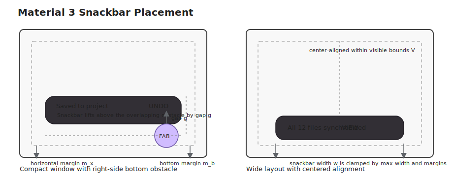

# Roo Windows Material 3 Snackbar Design

## Implementation status

**Proposed.** None of the defined scope is implemented. The status of existing and outstanding prerequisites is recorded in the [status index](../README.md).

## Objective

Add a Material Design 3 snackbar family to `roo_windows` that fits the current
embedded-first framework model and covers the transient feedback surface that is
still missing.

The design supports:

- low-priority process feedback shown at the bottom of the UI,
- one visible snackbar at a time,
- short text with at most one action,
- an optional explicit dismiss affordance,
- automatic timeout for non-actionable snackbars,
- persistent-on-screen behavior for actionable snackbars by default,
- placement that avoids bottom obstacles such as FABs or docked bars,
- and outside touches that continue to reach the underlying UI.

The result is a real Material 3 snackbar surface with queueing, placement, and
lifecycle behavior, not a restyled alert dialog or a copy of the menu popup
pattern.

## Motivation

`roo_windows` already has higher-priority temporary surfaces such as dialogs,
menus, and popup activities, but it still lacks the low-priority transient
feedback surface used for operations like save confirmation, undo, archive, and
background status updates.

The existing alternatives are all wrong for that role:

- dialogs are modal and too disruptive,
- menus are action pickers rather than process feedback,
- inline labels are useful but do not cover global transient confirmation,
- and ad hoc popup widgets would force each application to reinvent queueing,
  timing, placement, and hit testing.

Snackbar support therefore needs to be a library surface, not an example-local
helper.

## Background

### Current Status in `roo_windows`

As of 2026-05, `roo_windows` does not have a Material 3 snackbar component or a
general transient-message presenter.

What exists today:

- [`Application`](../../../src/roo_windows/core/application.h) and
  [`MainWindow`](../../../src/roo_windows/core/main_window.h) already expose a popup
  layer above normal tasks and below dialogs.
- [`Holder`](../../../src/roo_windows/containers/holder.h) already provides a
  lightweight single-child container that can swap contents without allocating a
  second layout tree.
- [`Widget::moveTo()`](../../../src/roo_windows/core/widget.h) already lets a parent
  reposition an attached child by updating its parent bounds.
- [`ApplicationContext`](../../../src/roo_windows/core/application_context.h) already
  exposes the shared scheduler used by animated and deferred UI work.
- [`material3::Button`](../../../src/roo_windows/material3/button/button.h) already
  supports the Material 3 text-button variant needed for snackbar actions.
- [`Theme`](../../../src/roo_windows/core/theme.h) already exposes the inverse color
  roles required by the snackbar spec: `kInverseSurface`,
  `kInverseOnSurface`, and `kInversePrimary`.
- [`TextBlock`](../../../src/roo_windows/widgets/text_block.h) already exists for the
  wrapped multi-line message path.

What does not exist yet:

- no snackbar widget under `roo_windows/material3/snackbar`,
- no snackbar presenter or queue,
- no popup-slot helper that keeps a transient bottom bar alive without blocking
  outside interaction,
- no snackbar example sketch,
- and no snackbar test target covering timing, placement, and pass-through hit
  testing.

### Material 3 Signals

This design is aligned against the Material 3 snackbar documentation:

- [Overview](https://m3.material.io/components/snackbar/overview)
- [Specs](https://m3.material.io/components/snackbar/specs)
- [Guidelines](https://m3.material.io/components/snackbar/guidelines)

The strongest current signals are:

1. snackbars communicate low-priority process updates and do not block the UI,
2. they appear at the bottom of the screen in front of content,
3. only one snackbar is shown at a time,
4. a snackbar contains at most one action,
5. non-actionable snackbars dismiss after a short interval,
6. actionable snackbars remain until the user acts or dismisses them,
7. compact layouts allow up to two lines of supporting text,
8. wide layouts favor a longer horizontal bar with consistent left or center
   alignment,
9. the container is opaque and uses inverse color roles,
10. the snackbar avoids covering important bottom affordances such as FABs or
    navigation surfaces,
11. and snackbars do not stack side by side or on top of one another.

Material guidance also keeps the content narrow:

- no multiple actions,
- no inline links,
- no required acknowledgement,
- and no icon-heavy rich content.

### Local Framework Constraints

Three current `roo_windows` constraints shape this design.

First, popup layering already exists, so snackbar reuses it rather than
introducing a second transient-layer subsystem.

Second, the current hit-testing model means a full-screen popup child would
block interaction with lower layers even when it returns `nullptr` for touches.
That is visible in the current container dispatch flow:

- [`Container::dispatchTouchDownEvent()`](../../../src/roo_windows/core/container.cpp)
  stops descending to lower-z children when a top child owns the touched parent
  bounds,
- and a full-screen popup child therefore swallows the rest of the window even
  if the snackbar itself occupies only a small rectangle.

That rules out reusing the full-screen overlay pattern used by the menu design.
Snackbar needs a popup child whose own parent bounds track only the snackbar's
visible and interactive rectangle.

Third, the framework currently has direct popup-child insertion through
[`Application::addPopup()`](../../../src/roo_windows/core/application.h), but the
public API does not yet expose a generalized popup-child removal handle. The
snackbar design therefore prefers one stable popup slot that gets moved and
rebound over repeatedly attaching and detaching transient popup widgets.

### Embedded Constraints

Snackbar is not a high-multiplicity surface like list rows, but the embedded RAM
rules still apply.

The design consequences are:

1. one live snackbar widget is reused across the queue,
2. queue entries stay compact descriptors rather than live widget trees,
3. callbacks do not force `std::function` storage onto the visual widget,
4. timer and animation logic live on one presenter, not on every queued
   request,
5. and there are no heap allocations on paint or timer-tick paths.

## Requirements

### Functional Requirements

1. Support a Material 3 snackbar surface with supporting text, one optional
   action, and an optional dismiss affordance.
2. Show at most one snackbar at a time.
3. Support consecutive snackbars through a queue.
4. Support explicit replace-current behavior for stale or superseded feedback.
5. Support short and long auto-dismiss durations for non-actionable snackbars.
6. Support persistent-until-dismiss behavior for actionable snackbars by
   default.
7. Support compact layouts with one or two lines of message text.
8. Support wide layouts that prefer a longer horizontal bar while staying at the
   bottom of the UI.
9. Keep snackbars above normal task content and below modal dialogs.

### Interaction Requirements

1. Touches outside the snackbar continue to reach underlying content.
2. Touches inside the snackbar are handled by the snackbar action or dismiss
   affordance when present.
3. Invoking the action calls the registered listener and dismisses the snackbar
   unless the request explicitly opts out.
4. Programmatic dismissal is supported.
5. Dialog presentation visually supersedes the snackbar without requiring a
   snackbar-specific modal path.
6. Snackbar appearance does not move or relayout unrelated widgets such as a
   FAB.

### Placement Requirements

1. Anchor the snackbar to the bottom of the UI with token-backed horizontal and
   bottom margins.
2. Support caller-supplied bottom avoidance rectangles so the snackbar can lift
   above items such as FABs, docked bars, or other persistent bottom surfaces.
3. Clamp the snackbar to the visible window bounds.
4. Support consistent wide-layout alignment: start-aligned or center-aligned.
5. Never show two snackbars side by side.

### Color and Content Requirements

1. Resolve the snackbar container from `Theme::color.inverseSurface`.
2. Resolve message text and dismiss glyph from
   `Theme::color.inverseOnSurface`.
3. Resolve the action label from `Theme::color.inversePrimary`.
4. Keep the message path text-only; do not add a general icon slot.
5. Reuse the existing Material 3 text-button implementation for the action path
   rather than creating a snackbar-only button family.

### Memory and Allocation Requirements

1. Keep only one live snackbar widget tree regardless of queue length.
2. Keep queued requests as copied lightweight descriptors.
3. Avoid `std::function` storage on the visual snackbar widget.
4. Avoid allocations on paint, layout, timer ticks, and per-frame animation
   updates.
5. Document the approximate RAM cost of the presenter, the live snackbar slot,
   and one queued request.

## Design Overview

### Scope

In scope:

- one Material 3 snackbar lane,
- one optional action,
- optional explicit dismiss affordance,
- queueing and replace-current behavior,
- bottom placement with caller-supplied avoidance hints,
- transition timing,
- and an application-level convenience API.

Out of scope:

- multiple simultaneous snackbar lanes,
- rich custom content or arbitrary child-slot composition,
- automatic discovery of FAB, bottom bar, or keyboard obstacles from unrelated
  widgets,
- web live-region or screen-reader announcement plumbing,
- and full scaffold-style layout integration.

### Core Structure

The snackbar family is a four-part stack:

1. `material3::SnackbarPresenter` is an application-owned controller that owns
   queueing, timing, dismissal, and transition state.
2. `MainWindow` owns one lazily created popup-layer `SnackbarSlot`, backed by a
   lightweight holder-like widget whose bounds track only the current snackbar
   rectangle.
3. `material3::SnackbarWidget` is the single live surface-owning widget used to
   render the current snackbar.
4. `SnackbarRequest` is a compact copied descriptor that carries text, optional
   action label, duration policy, layout policy, and one listener pointer.

### Key Decisions

1. Snackbar uses a pass-through popup slot, not a full-screen overlay, because
   the current full-screen popup pattern would block lower layers from handling
   outside taps.
2. Snackbar is presenter-driven instead of being just a widget because queueing,
   timeout, and replace-current behavior are intrinsic to the component.
3. The live widget tree is reused across the queue so queued requests stay small
   and cheap.
4. The action path reuses `material3::Button` with `ButtonVariant::kText`.
5. The optional dismiss affordance is owner-painted and hit-tested by the
   snackbar widget so snackbar does not need a fully landed Material 3 icon
   button family first.
6. Placement uses explicit avoidance hints from the caller instead of trying to
   infer every important bottom affordance automatically.

## Design Details

### Popup Slot and Pass-Through Hit Testing

Snackbar uses one stable popup child in
[`MainWindow`](../../../src/roo_windows/core/main_window.h), referred to here as
`SnackbarSlot`.

`SnackbarSlot` is a lightweight holder-like container with these properties:

- it lives on the popup layer so it paints above tasks and below dialogs,
- it owns exactly one child: the reusable `SnackbarWidget`,
- it can be hidden when idle,
- and its parent bounds are updated with
  [`Widget::moveTo()`](../../../src/roo_windows/core/widget.h) whenever the snackbar
  rectangle changes.

The critical rule is that the slot's bounds equal the snackbar's actual
interactive envelope, not the whole display.

That gives the desired dispatch behavior under the existing container rules:

- if the pointer lands inside the snackbar rectangle, the popup slot handles it,
- if the pointer lands outside that rectangle, the popup slot does not own the
  touched parent bounds,
- and the main window continues descending to lower-z task content.

This is the main architectural difference from the menu popup design.

### Presenter Lifetime and Queue Model

`SnackbarPresenter` is the public control surface.

It owns:

- the current request,
- a FIFO queue of pending requests,
- one scheduler task used for timeout and transition ticks,
- one lazily created `SnackbarSlot`,
- and the current transition progress.

The presenter API is intentionally small:

- `show(request)` appends a new snackbar and displays it immediately if idle,
- `replaceCurrent(request)` dismisses the visible snackbar with reason
  `kReplaced` and immediately swaps in the new request,
- `dismissCurrent(reason)` hides the current snackbar,
- and `clear()` dismisses the visible snackbar and empties the queue.

Queue behavior is closed as follows:

1. only one request is visible at a time,
2. `show()` appends behind the visible request,
3. `replaceCurrent()` only replaces the visible request and leaves the queued
   requests intact,
4. once the current request finishes, the next queued request becomes visible,
5. no second live widget tree is created for queued entries,
6. and requests are copied into the queue as descriptors rather than retained by
   pointer.

### Request Model

The baseline request type is a small copied struct.

It stores:

- `roo::string_view text`,
- `roo::string_view action_label`,
- a `SnackbarDuration` enum,
- a compact `SnackbarLayoutPolicy`,
- one optional `SnackbarListener*`,
- and compact policy bits such as `show_dismiss` and `dismiss_on_action`.

Using copied request structs instead of polymorphic request objects keeps queue
behavior simple and avoids heap-owning request lifetimes. The non-owning string
contract matches existing `roo_windows` authoring patterns such as
`material3::Button`: the caller keeps the backing text alive until the request
has been dismissed.

The listener interface remains virtual rather than callback-backed:

- `onSnackbarAction()` handles action taps,
- `onSnackbarDismiss(reason)` observes timeout, replacement, explicit dismiss,
  and programmatic closure.

That keeps the visual widget free of `std::function` storage while still giving
applications a standard hook surface.

### Layout and Placement Model

Placement is resolved against:

- the visible window bounds $V$,
- the measured snackbar size $(w, h)$,
- token-backed horizontal margin $m_x$,
- token-backed bottom margin $m_b$,
- and up to a small fixed number of avoidance rectangles $A_i$ supplied in the
  request layout policy.

The width is resolved first:

$$
w = \min(w_m, V.width - 2m_x, w_{max})
$$

Where:

- $w_m$ is the measured width of the active snackbar configuration,
- and $w_{max}$ is the wide-layout token cap.

The horizontal origin then depends on the resolved wide-layout policy:

$$
x_{center} = V.left + \frac{V.width - w}{2}
$$

$$
x_{start} = V.left + m_x
$$

The initial bottom-anchored candidate is:

$$
y_0 = V.bottom - m_b - h + 1
$$

For each avoidance rectangle that horizontally overlaps the snackbar, the
presenter lifts the snackbar above that obstacle with a fixed gap $g$:

$$
y = \min(y, A_i.top - g - h)
$$

The final rectangle is clamped to the visible bounds.

This keeps the placement logic explicit and cheap:

- the snackbar stays bottom-anchored when there are no obstacles,
- a FAB or docked bar can push it upward,
- and the design does not depend on scanning the widget tree for arbitrary
  bottom surfaces.



### Layout Configurations

The widget resolves one of the Material 3 configurations at measurement time:

1. single-line message,
2. single-line message with action,
3. two-line message,
4. two-line message with action,
5. two-line message with a longer action that drops below the message.

Compact layouts follow the Material 3 rule that the message can wrap to two
lines. Wide layouts still allow wrapping, but the measurement algorithm prefers
the one-line horizontal arrangement whenever it fits.

The widget chooses from those configurations by measurement rather than by
exposing a matrix of manual authoring flags.

### Visual Widget Structure

`SnackbarWidget` is a surface-owning widget.

It owns:

- the opaque snackbar container,
- the message text widget,
- the optional text action button,
- the optional owner-painted dismiss glyph and its hit target,
- and the local animation state needed for enter and exit transitions.

The common content path is:

- one `TextBlock` for the message,
- one `material3::Button` configured as `ButtonVariant::kText` for the action,
- and an owner-painted trailing dismiss glyph when requested.

That split is deliberate:

- the message needs proper wrapping behavior,
- the action reuses the landed Material 3 button tokens and interaction model,
- and the dismiss affordance is too small and too snackbar-specific to justify a
  second general button dependency in phase one.

The snackbar does not expose arbitrary child slots. If applications need a
custom transient panel with arbitrary children, that remains a separate popup
surface rather than being folded into snackbar.

### Surface Ownership, Paint, and Invalidation

Snackbar is a surface-owning control because it introduces:

- its own opaque container,
- its own corner shape,
- its own elevation and shadow,
- and its own pressable sub-affordances.

The container resolves from the inverse surface roles already present in
[`Theme`](../../../src/roo_windows/core/theme.h):

- background: `inverseSurface`,
- message text: `inverseOnSurface`,
- dismiss glyph: `inverseOnSurface`,
- action text: `inversePrimary`.

The owner-painted dismiss glyph is drawn from `paint(PaintContext&)` after its
layout box has been resolved. Because the snackbar container is opaque and the
glyph is a foreground detail on top of that surface, the standard direct paint
path is sufficient; snackbar does not need a special exclusion pipeline beyond
what the existing surface and button children already use.

Invalidation stays local to the snackbar envelope:

- showing or hiding the snackbar invalidates the old and new slot bounds only,
- moving the snackbar to avoid a bottom obstacle invalidates the previous and
  next slot rectangles rather than the whole popup layer,
- and enter or exit animation invalidates only the union of the previous and
  current transient bounds.

That keeps snackbar animation compatible with the repo's dirty-versus-
invalidated paint model and avoids unnecessary full-window redraws.

### Duration and Dismissal Rules

The duration model is intentionally semantic:

- `kDefault`,
- `kShort`,
- `kLong`,
- `kPersistent`.

`kDefault` resolves as follows:

1. if the request has an action or explicit dismiss affordance, default to
   `kPersistent`,
2. otherwise default to `kShort`.

The timeout mapping is:

- `kShort`: 4 s,
- `kLong`: 10 s,
- `kPersistent`: no timeout.

Dismissal reasons are explicit:

- timeout,
- action,
- dismiss-button tap,
- replaced,
- programmatic,
- cleared.

Snackbars are passive with respect to the shared
[Back request coordination path](../in_progress/application_navigation_back_behavior_design.md):
they do not occupy the root interactive-transient slot and Back or Escape
continues to the active dialog, activity, or route stack. A future explicit
policy may opt in, but passive remains the default.

The presenter excludes enter and exit transition time from the visible timeout
budget so the message remains readable for the full requested duration.

### Transition Model

Snackbar transitions remain local to the snackbar surface.

The design uses:

- a short enter animation from slightly below the final bounds,
- a matching exit animation,
- and optional opacity modulation during the transition.

Important constraints:

1. the animation does not move or relayout unrelated widgets,
2. the animation invalidates only the old and new snackbar transient bounds,
3. there is no scrim,
4. and there is no coupled FAB movement.

The implementation can be driven by the same scheduler used elsewhere in the UI
framework. Because there is only one live snackbar lane, one presenter-owned
scheduled task is enough.

### Dialog and Layer Interaction

Snackbar stays on the popup layer, so dialogs continue to supersede it without
needing snackbar-specific coordination.

That gives the correct priority order:

1. normal task content,
2. snackbar popup slot,
3. modal scrim and dialog.

If a dialog opens while a snackbar is visible, the snackbar remains attached on
the popup layer and its visible-timeout clock pauses until the dialog closes.
That keeps dialog priority correct without letting the snackbar disappear behind
a modal interruption.

### Per-Instance Footprint Budget

Using the same 32-bit ESP32 assumptions as the other Material 3 design docs,
the intended order-of-magnitude costs are:

| Type | Approx. RAM | Notes |
|------|------------:|-------|
| `SnackbarPresenter` | ~56-72 B | current-state fields, queue control block, scheduler task, compact policy bits |
| queued `SnackbarRequest` | ~24-32 B each | two `string_view`s, listener pointer, duration and policy bits, compact layout policy |
| `SnackbarSlot` | ~48-56 B | one holder-like popup child moved within the popup layer |
| live `SnackbarWidget` | ~120-180 B plus existing child-widget storage | one reusable surface widget, message text object, one action button, optional dismiss hit box |

The key rule is that queue length grows only the descriptor storage. The visual
widget tree remains constant.

## Proposed API

```cpp
namespace roo_windows::material3 {

enum class SnackbarDuration : uint8_t {
  kDefault,
  kShort,
  kLong,
  kPersistent,
};

enum class SnackbarWideAlignment : uint8_t {
  kStart,
  kCenter,
};

enum class SnackbarDismissReason : uint8_t {
  kTimeout,
  kAction,
  kDismiss,
  kReplaced,
  kProgrammatic,
  kCleared,
};

struct SnackbarAvoidanceRect {
  Rect rect;
  int16_t gap = 0;  // 0 => token default.
};

struct SnackbarLayoutPolicy {
  SnackbarWideAlignment wide_alignment = SnackbarWideAlignment::kCenter;
  int16_t max_width = 0;          // 0 => snackbar token default.
  int16_t horizontal_margin = 0;  // 0 => snackbar token default.
  int16_t bottom_margin = 0;      // 0 => snackbar token default.
  uint8_t avoidance_count = 0;
  SnackbarAvoidanceRect avoidance[3];
};

class SnackbarListener {
 public:
  virtual ~SnackbarListener() = default;
  virtual void onSnackbarAction() {}
  virtual void onSnackbarDismiss(SnackbarDismissReason reason) {}
};

struct SnackbarRequest {
  roo::string_view text = {};
  roo::string_view action_label = {};
  SnackbarDuration duration = SnackbarDuration::kDefault;
  SnackbarLayoutPolicy layout = {};
  SnackbarListener* listener = nullptr;
  bool show_dismiss = false;
  bool dismiss_on_action = true;
};

class SnackbarPresenter {
 public:
  explicit SnackbarPresenter(Application& app);

  void show(const SnackbarRequest& request);
  void replaceCurrent(const SnackbarRequest& request);
  void dismissCurrent(
      SnackbarDismissReason reason = SnackbarDismissReason::kProgrammatic);
  void clear();

  bool isShowing() const;
  bool hasPending() const;
};

SnackbarPresenter& GetSnackbarPresenter(Application& app);
void ShowSnackbar(Application& app, const SnackbarRequest& request);

}  // namespace roo_windows::material3
```

The convenience `GetSnackbarPresenter()` / `ShowSnackbar()` path keeps simple
apps easy to author while still exposing the underlying presenter when a screen
needs explicit replace or clear behavior.

When `SnackbarPresenter` declarations land before popup-slot presentation
support, `show()`, `replaceCurrent()`, and `dismissCurrent()` must emit
`LOG(FATAL) << "Unimplemented: Material 3 snackbar presenter"` rather than
silently dropping requests.

## Implementation Plan

Authoring reference:
[embedded-cpp-code-authoring.instructions.md](../../../.github/instructions/embedded-cpp-code-authoring.instructions.md)
and
[roo-windows-widget-authoring.instructions.md](../../../.github/instructions/roo-windows-widget-authoring.instructions.md).

### Phase 1: Add the Snackbar Widget and Token Tables

Code slice:

1. Add `src/roo_windows/material3/snackbar/snackbar.h` and `.cpp` with the
   reusable `SnackbarWidget` surface.
2. Implement token-backed measurement, inverse-role colors, message wrapping,
   the text-button action path, and the owner-painted dismiss affordance.
3. Add focused rendering coverage for one-line, two-line, actionable, and
   dismissible snackbar configurations.

Proposed commit message:

> Material 3 snackbar Phase 1: add snackbar widget

Validation: run `bazel test //:material3_snackbar_golden_test`.

### Phase 2: Add the Presenter, Request Queue, and Popup Slot

Code slice:

1. Add `SnackbarRequest`, `SnackbarListener`, and `SnackbarPresenter`.
2. Add one lazily created popup-layer `SnackbarSlot` owned by `MainWindow` or
   equivalent application-owned plumbing.
3. Implement queue progression, `show()`, `replaceCurrent()`,
   `dismissCurrent()`, and `clear()`.
4. Add behavior tests proving that the snackbar handles in-bounds touches while
   outside touches still reach underlying content.

Proposed commit message:

> Material 3 snackbar Phase 2: add presenter and popup slot

Validation: run `bazel test //:material3_snackbar_test`.

### Phase 3: Add Timing, Placement, and Transition Behavior

Code slice:

1. Implement duration resolution, timeout scheduling, and pause-while-dialog-
   visible behavior.
2. Implement bottom placement clamping, wide-layout alignment, and avoidance-
   rectangle lifting.
3. Add enter and exit transitions with bounded invalidation.
4. Add behavior coverage for timeout, replacement, explicit dismiss, placement,
   and dialog-over-snackbar layering.

Proposed commit message:

> Material 3 snackbar Phase 3: add timing and placement behavior

Validation: run `bazel test //:material3_snackbar_test` and
`bazel test //:overlay_test`.

### Phase 4: Add Example Coverage and Integration Checks

Code slice:

1. Add `examples/material3/snackbar/snackbar.ino` covering short, persistent,
   queued, replaced, and avoidance-lifted snackbars.
2. Build the example under emulation.
3. Keep cross-references in adjacent docs minimal and add them only where the
   new example becomes a stable reference point.

Proposed commit message:

> Material 3 snackbar Phase 4: add example coverage

Validation: run `bazel test //:material3_snackbar_test`,
`bazel test //:material3_snackbar_golden_test`,
`bazel test //:material3_button_test`, and build the snackbar example under
emulation.

## Testing Plan

Validation coverage should include:

1. `material3_snackbar_test` for queue ordering, replace-current behavior,
   dismissal reasons, timeout policy, pass-through hit testing, placement with
   avoidance rectangles, and dialog-over-snackbar timing.
2. `material3_snackbar_golden_test` for one-line, two-line, actionable,
   dismissible, centered wide-layout, start-aligned wide-layout, and avoidance-
   lifted snackbar configurations.
3. `overlay_test` reruns for invalidation and transient-bounds regressions once
   snackbar transitions and popup-slot movement land.
4. `material3_button_test` reruns because snackbar reuses the Material 3 text-
   button path for the action affordance.
5. Example compilation for `examples/material3/snackbar/snackbar.ino` under the
   emulation harness.

## Caveats

### Rejected Alternatives

#### Reuse the Full-Screen Menu Overlay Pattern

This is rejected because the current touch-dispatch model stops descending to
lower-z children when a top child owns the touched parent bounds. A full-screen
snackbar overlay would therefore block interaction with the rest of the window,
which violates the snackbar requirement that outside touches continue to reach
underlying content.

#### Present Snackbar as a Popup `Task` `Activity`

This is rejected because the popup-task path is the right abstraction for
temporary full-surface presenters such as menus or the keyboard, not for a
single bottom bar that needs pass-through interaction outside its own envelope.
Using a whole popup task for snackbar would add avoidable presentation overhead
and still require special handling to avoid blocking the window behind it.

#### Attach and Detach a Fresh Popup Widget for Every Request

This is rejected because the current public popup API is optimized for
insertion, not repeated transient lifecycle churn. A stable popup slot keeps the
ownership path simple, avoids repeated widget-tree construction, and keeps queue
growth limited to compact request descriptors.

#### Store Per-Request `std::function` Callbacks or Polymorphic Request Trees

This is rejected because it adds avoidable per-request RAM and lifetime
complexity to a surface that is fundamentally queue-oriented and transient.
Non-owning string views plus one virtual listener pointer keep the common path
compact and consistent with the repo's widget-authoring guidance.

#### Add a General Icon Slot to the Base Snackbar

This is rejected because Material 3 snackbar guidance keeps the baseline
component text-first and discourages richer adornment-heavy content. Adding a
general icon slot would complicate layout and paint for a use case the component
is not intended to carry.

### Accepted Trade-Offs

1. `SnackbarRequest` uses non-owning `roo::string_view` fields, so callers must
   keep message and action-label backing storage alive until dismissal. This is
   less convenient than an owning-string API, but it keeps the queue compact and
   avoids heap policy on the common path.
2. The optional dismiss affordance is owner-painted in phase one instead of
   waiting for a fully landed Material 3 icon-button family. That keeps the
   snackbar path small and unblocks the component without forcing a broader
   dependency first.

## Future Work

1. Add owned-string request helpers for dynamically generated messages.
2. Add automatic integration with future scaffold or bottom-bar layout
   surfaces.
3. Add richer obstacle registration APIs when the library gains more persistent
   bottom-surface components.
4. Revisit the dismiss affordance once the standalone Material 3 icon-button
   family is fully landed.
5. Add optional animation-token customization if the library adopts a shared
   transient-surface motion system.
