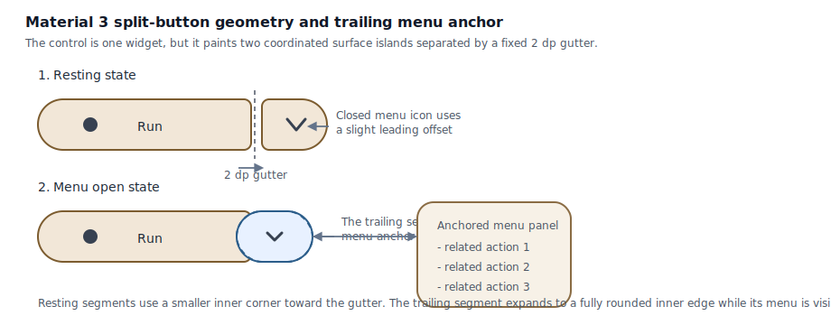

# Roo Windows Material 3 Split Button Design

## Implementation status

**Proposed.** None of the defined scope is implemented. The status of existing and outstanding prerequisites is recorded in the [status index](../README.md).

## Objective

Add Material Design 3 split button support to `roo_windows` for the common
"run the default action, or open related actions" case.

The design should provide:

- a `material3::SplitButton` widget under the existing Material 3 button
  family,
- one primary segment that behaves like a normal button action,
- one trailing segment that opens a related
  [`Menu`](material3_menus_design.md),
- the four supported Material 3 split-button color styles: elevated, filled,
  filled tonal, and outlined,
- the same expressive size range as buttons: extra small, small, medium,
  large, and extra large,
- split-button-specific geometry and state handling rather than a loose row of
  two ordinary buttons,
- and a per-instance RAM cost much closer to one button than to a
  `Button` + `IconButton` + layout container composite.

This document defines the intended API and integration model. It does not
describe an existing implementation.

## Motivation

`roo_windows` now has Material 3 buttons in
[../implemented/material3_buttons_design.md](../implemented/material3_buttons_design.md) and a designed
Material 3 menu family in [material3_menus_design.md](material3_menus_design.md),
but it still lacks the specific control that Material 3 uses for a default
action plus related alternatives.

Building that ad hoc from a [`Button`](../../../src/roo_windows/material3/button/button.h),
an icon-only trigger, a layout container, and custom menu anchoring has three
problems:

1. it costs substantially more RAM than a dedicated widget,
2. it does not match the split-button geometry defined by Material 3,
3. and it pushes menu-open coordination into app code instead of the widget
   layer.

That is the wrong default for an embedded-first widget library.

## Background

### Current Status in `roo_windows`

As of 2026-05, the relevant current pieces are:

- the shipped Material 3 [`Button`](../../../src/roo_windows/material3/button/button.h),
  whose implementation in
  [`button.cpp`](../../../src/roo_windows/material3/button/button.cpp) uses one
  widget-wide area overlay and one deferred `onClicked()` dispatch path,
- the base widget interaction model in
  [`Widget`](../../../src/roo_windows/core/widget.h), where clicks route through
  `onClicked()` and optional `setOnInteractiveChange(...)`,
- the surface paint and decoration hooks in
  [`SurfaceWidget`](../../../src/roo_windows/core/surface_widget.h),
- and the proposed Material 3 menu API in
  [material3_menus_design.md](material3_menus_design.md), especially
  `Menu`, `MenuAnchor`, and `Menu::show(Application&)`.

What does not exist yet:

- no `SplitButton` widget,
- no split-button geometry tokens,
- no segment-aware button overlay or click routing,
- and no menu lifecycle hook that lets a composite trigger keep only part of
  itself visually open while the menu chain is visible.

Two existing facts drive this design:

1. the current `Button` implementation is correct for one clickable surface,
   but not for two independently interactive segments,
2. and the current menu design keeps generic trigger retention at whole-widget
   granularity, which is too broad for a split button whose trailing segment
   alone is the menu trigger.

### Material 3 Signals

This document is aligned against the Material 3 split-button documentation:

- [Overview](https://m3.material.io/components/split-button/overview)
- [Specs](https://m3.material.io/components/split-button/specs)
- [Guidelines](https://m3.material.io/components/split-button/guidelines)

The important signals for this design are:

- a split button combines one primary action with one menu action,
- the leading segment may contain an icon and label, label only, or icon only,
- the trailing segment always uses a menu icon,
- only four color styles are supported: elevated, filled, filled tonal, and
  outlined,
- the control uses the same five expressive sizes as the Material 3 button
  family,
- the two segments are separated by a fixed 2 dp gap,
- the control uses the same color roles and state layers as buttons and icon
  buttons,
- the trailing icon is optically offset when closed and centered when the menu
  is open,
- and the trailing segment becomes the visually selected side while the menu is
  open, without changing the base color scheme.

### Local Framework Signals

Three local framework constraints matter most here.

First, `roo_windows` is direct-to-framebuffer. The foreground-first exclusion
rule from
[../.github/instructions/roo-windows-widget-authoring.instructions.md](../../../.github/instructions/roo-windows-widget-authoring.instructions.md)
means split-button paint cannot rely on a vague "tint the whole widget and fix
it later" model. The final pixels for each segment need to be settled in the
right order.

Second, the current `Widget` state bits such as `pressed` and `activated`
exist at whole-widget granularity. That is useful storage, but it is not by
itself enough to tell the paint path which split-button segment is currently
active.

Third, the menu design deliberately keeps generic trigger retention off base
widget storage by using a presenter-owned trigger pin. That is still the right
default for ordinary buttons, but a split button needs a narrower open visual:
only the trailing segment should stay visually selected.

## Requirements

### Functional Requirements

1. Provide exactly two invokable segments: a primary action and a trailing menu
   action.
2. Support the Material 3 split-button color styles: elevated, filled, filled
   tonal, and outlined.
3. Support the Material 3 split-button sizes: extra small, small, medium,
   large, and extra large.
4. Support leading-segment content as icon plus label, label only, or icon
   only.
5. Always paint a menu icon in the trailing segment. v1 does not expose an
   arbitrary trailing icon setter.
6. Require a related `Menu` for every `SplitButton`; the trailing segment is
   not a generic second callback surface.
7. Open the related `Menu` from the trailing segment and anchor it to the
   trailing segment bounds, not to the full widget bounds.
8. Keep the primary action path available through the existing widget
   interactive-change model.
9. Disable both segments when the widget is disabled.
10. Clear the trailing open state when the root menu chain dismisses, regardless
    of whether dismissal came from outside press, back or escape, or leaf-item
    invocation.

### Interaction and Rendering Requirements

1. Use a fixed 2 dp gutter between the leading and trailing segments for every
   size.
2. Keep the outer corners fully rounded in v1. The split button does not expose
   the standard button family's `ButtonShape` toggle.
3. Support segment-specific pressed visuals for the primary and trailing
   segments.
4. Paint the trailing segment as the open or selected segment while the menu is
   visible, including the centered menu icon.
5. Do not reuse the stock whole-surface area overlay path for interaction
   visuals.
6. Keep whole-control hover and focus support compatible with the current
   widget-state model; do not add new framework-wide per-segment hover routing
   in v1.
7. Lock a gesture to the segment that received the initial down event. Sliding
   across the 2 dp gutter does not retarget the tap to the other segment.
8. Preserve the existing click-animation timing model so `onClicked()` still
   fires after the animation settles.

### Memory and API Requirements

1. Avoid building a split button from child `Button` and `IconButton`
   instances.
2. Avoid new per-instance `std::function` storage for a second action.
3. Keep menu ownership non-owning and explicit.
4. Reuse existing widget state bits where they already model the required
   semantics.
5. Keep split-button-specific extra storage to a packed segment-state field and
   existing pointer-sized references.
6. Define interim behavior explicitly for the period before menu presentation
   lands: if `Menu::show(Application&)` still warns and performs no
   presentation work, `SplitButton` must remain visually closed and must not
   fake an open state.

## Design Overview

### Scope

In scope:

- a dedicated `material3::SplitButton` widget,
- four color styles,
- five sizes,
- primary-action and trailing-menu dispatch,
- menu anchoring to the trailing segment,
- split-button-specific paint and geometry,
- and the minimal menu lifecycle hook needed to keep the trailing segment open
  while the menu chain is visible.

Out of scope:

- a text split-button variant,
- square or alternate outer-corner families,
- arbitrary trailing widgets or icons,
- per-segment hover routing at the framework level,
- toggle or selectable split buttons,
- and shared appearance override structs in the first version.

### Key Decisions

1. `SplitButton` is one widget, not a container of two child buttons.
2. `SplitButton` reuses the existing Material 3 button color and elevation
   resolution, but owns a separate split-button geometry token table.
3. The trailing segment always opens a `Menu`; it is not a general-purpose
   second callback target.
4. Menu-open visual state is driven through a narrow menu presentation observer
   hook, not through a new field on every `Widget`.
5. `SplitButton` disables the generic area overlay and paints segment-local
   state layers itself.
6. v1 keeps hover and focus at whole-control granularity because the current
   framework does not route those states per segment.

## Design Details

### Compound Surface and Measurement

Although Material 3 renders the split button as two surfaces separated by a
gutter, the control is still implemented as one widget.

That choice keeps three things aligned:

1. one measurement contract,
2. one deferred click-animation lifecycle,
3. and one compact RAM footprint.

The widget owns two local segment rectangles:

- the primary segment on the leading side,
- and the trailing menu segment on the trailing side.

Let:

- $W$ be the widget width,
- $H$ be the widget height,
- $g$ be the fixed gutter width,
- $T$ be the measured width of the trailing segment,
- and $L$ be the measured width of the leading segment.

Then:

$$
g = \operatorname{Scaled}(2)
$$

$$
T = p_{t,l} + s_t + p_{t,r}
$$

$$
L = W - g - T
$$

The two segment rectangles are therefore:

$$
R_p = [0, 0, L - 1, H - 1]
$$

$$
R_t = [L + g, 0, W - 1, H - 1]
$$

The minimum width follows the same principle as the existing button:

$$
W_{min} = w_{primary\ content} + p_{p,l} + p_{p,r} + g + T
$$

`SplitButton` uses the same one-line label measurement path as
[`Button`](../../../src/roo_windows/material3/button/button.cpp): the leading icon
and label are measured as one centered content cluster. The widget always
reports the tokenized split-button height for the selected size. It does not
grow vertically for larger icons or wrapped text in v1.

The split-button-specific geometry table stores:

- height,
- leading-segment paddings,
- trailing-segment paddings,
- trailing icon slot size,
- closed-state trailing icon offset,
- resting inner-corner radius,
- pressed inner-corner radius,
- and open-state trailing inner-corner radius.

The public API does not expose those numbers. The implementation transcribes
them from the Material 3 split-button spec.



### Paint and Decoration Model

`SplitButton` derives from `BasicSurfaceWidget`, but it does not use the stock
whole-surface overlay path.

The chosen paint model is:

1. override `getOverlayType()` to return `OVERLAY_NONE`,
2. paint the two segment interiors explicitly,
3. emit two persistent decorations, one per segment, through
   `emitPersistentDecoration(...)`,
4. and paint segment-local state layers directly rather than letting the shared
   area overlay tint the entire widget bounds.

This is necessary because a split button is not one continuous rounded surface.
It is two rounded surfaces with a transparent or inherited-background gutter
between them.

The paint path therefore settles pixels in this order:

1. clear the gutter and any unused local bounds to the inherited background,
2. settle the primary segment fill and any primary-segment state layer,
3. settle the trailing segment fill and any trailing-segment state layer,
4. paint the leading icon and label cluster,
5. paint the trailing menu icon with the correct optical offset,
6. and emit two decorations for outline and elevation.

Outlined split buttons therefore become two outlined surfaces, not one
monolithic outline that bridges the gutter. Elevated split buttons likewise
emit two shadows that are bounded by the same widget-level invalidation box.

### Interaction and Dispatch Model

The widget keeps one packed segment field that stores which segment currently
owns the gesture and the deferred click.

The event flow is:

1. `onDown(x, y)` identifies the owning segment from the local x coordinate and
   stores it.
2. `onShowPress(...)` and the existing pressed-state machinery still run at
   whole-widget timing, but the paint path applies the pressed visual only to
   the stored segment.
3. `onSingleTapUp(x, y)` lets the framework schedule the deferred click as it
   already does today.
4. `onClicked()` dispatches according to the stored segment.

Primary dispatch calls `onPrimaryInvoked()`. The default implementation of
`onPrimaryInvoked()` calls `triggerInteractiveChange()`, so the existing
`setOnInteractiveChange(...)` contract continues to map to the primary action.

Trailing dispatch is fixed: it configures and shows the bound `Menu`.

This keeps the default-action path compatible with the current framework while
avoiding a second callback field on every split-button instance.

### Menu Integration and Open-State Lifecycle

The trailing segment opens the bound `Menu`, but it does not use the generic
menu trigger pin designed for ordinary buttons.

The generic menu trigger pin is intentionally whole-widget. If `SplitButton`
used it directly, the entire control would stay visually pressed while the menu
was open. That would be wrong for Material 3 split buttons.

The chosen integration is therefore:

1. `SplitButton` computes a `MenuAnchor` from the trailing segment bounds,
2. `SplitButton` sets that anchor on the bound `Menu`,
3. `SplitButton` does not request the menu system's whole-widget trigger pin,
4. and `SplitButton` instead listens for root-menu presentation and dismissal
   through a narrow `MenuPresentationObserver` hook.

When the root menu is shown, the observer toggles the widget's existing
`activated` state bit on. When the root menu chain dismisses, it toggles that
same bit off.

That is the right storage tradeoff:

- no new state is added to base `Widget`,
- no new `menu_open_` field is added to `SplitButton`,
- and the existing `activated` bit is reused as a widget-local "trailing menu
  open" signal.

Because `SplitButton` has disabled the stock area overlay path, `activated`
does not tint the whole widget. It only affects the custom trailing-segment
paint logic.

Only the root menu presentation toggles the split button. Submenus do not
change the open visual independently; the trailing segment remains open for the
entire root chain lifetime.

If `Menu::show(Application&)` is still in its stub state from
[material3_menus_design.md](material3_menus_design.md), the existing menu
warning is the interim behavior. `SplitButton` must not latch the activated
state when no menu was actually presented.

### State Layers and Trailing Icon Behavior

Split buttons use the same color roles and state-layer opacities as standard
buttons, but the paint application differs.

The leading and trailing segments each resolve:

- enabled or disabled fill and content color,
- pressed state layer,
- and any whole-control hover or focus state layer.

The trailing segment also resolves an open-state visual driven by the reused
`activated` bit.

Closed-state trailing icon placement follows the Material 3 optical-offset
table, i.e. the icon is slightly off center toward the leading edge. Open-state
placement is centered:

$$
x_{icon,closed} = x_{center} + \delta(size)
$$

$$
x_{icon,open} = x_{center}
$$

where $\delta(size)$ is the spec-defined offset table.

The trailing segment also changes inner-corner geometry when open. In the open
state, the inner corners use the same fully rounded family as the outer
corners, matching the Material 3 selected trailing-segment shape.

### Hover and Focus Scope

v1 does not add per-segment hover or keyboard-focus routing to the framework.

Instead:

- whole-control hover and focus continue to use the existing widget-state bits,
- the resulting hover or focus state layer is painted onto both segments,
- and only pressed and menu-open visuals are segment-specific.

This is an explicit design choice, not an omission.

The current framework has no coordinate-rich hover routing for childless
compound widgets, and touch is still the primary interaction model for this
library. Adding framework-wide per-segment hover state now would cost more code
and more state than the current requirement justifies.

### Shared Tokens and Internal Refactoring

`SplitButton` should not copy the current button color and elevation resolver.

Instead, the implementation should extract the shared Material 3 button-family
color and elevation helpers used by
[`button.cpp`](../../../src/roo_windows/material3/button/button.cpp) into a private
internal helper so `Button` and `SplitButton` read from the same source.

Only the geometry table remains split-button specific.

That keeps Material 3 button-family color behavior consistent and avoids two
separate places silently drifting apart on disabled, outlined, or elevated
variants.

### Per-Instance Footprint Budget

Using the same 32-bit embedded assumptions as
[../implemented/material3_buttons_design.md](../implemented/material3_buttons_design.md), the intended
baseline budgets are:

| Type | Approx. RAM | Notes |
|------|------------:|-------|
| `SplitButton` | ~60-72 B | `BasicSurfaceWidget` base, non-owning label, icon pointer, `Menu*`, packed variant/size/segment state |
| menu observer storage on `SplitButton` | 0 B beyond the widget vtable | open state reuses `Widget::activated`; observer pointer lives on `Menu` |
| `Button` + `IconButton` + layout container composite | ~160-210 B | excludes extra coordination glue and duplicates per-widget interaction and surface storage |

The important comparison is not the exact byte count. It is the shape of the
cost curve.

The single-widget design pays one pointer to the related `Menu` and one packed
segment-state field. The composite design pays for three widget objects,
duplicated surface semantics, duplicated click lifecycle, and additional
coordination code. That is far too expensive for the common path.

## Proposed API

### Split-Button Types

```cpp
namespace roo_windows::material3 {

enum class SplitButtonVariant : uint8_t {
  kFilled,
  kFilledTonal,
  kOutlined,
  kElevated,
};

class SplitButton : public BasicSurfaceWidget {
 public:
  explicit SplitButton(ApplicationContext& context, Menu& menu,
                       roo::string_view label = {},
                       SplitButtonVariant variant =
                           SplitButtonVariant::kFilled);

  SplitButtonVariant variant() const;
  void setVariant(SplitButtonVariant variant);

  ButtonSize size() const;
  void setSize(ButtonSize size);

  roo::string_view label() const;
  void setLabel(roo::string_view label);

  bool hasIcon() const;
  const MonoIcon* icon() const;
  void setIcon(const MonoIcon* icon);

  Menu& menu() const;

  Dimensions getSuggestedMinimumDimensions() const override;
  void paint(PaintContext& ctx) const override;

  OverlayType getOverlayType() const override { return OVERLAY_NONE; }

 protected:
  virtual void onPrimaryInvoked();

  bool onDown(XDim x, YDim y) override;
  bool onSingleTapUp(XDim x, YDim y) override;
  void onClicked() override;
  void notifyStateChanged(uint16_t state_diff) override;
};

}  // namespace roo_windows::material3
```

### Companion Menu Amendment

`SplitButton` needs one narrow addition to the menu API proposed in
[material3_menus_design.md](material3_menus_design.md): an optional lifecycle
observer that reports root-menu presentation and dismissal.

```cpp
namespace roo_windows::material3 {

class MenuPresentationObserver {
 public:
  virtual void onMenuPresented(Menu& menu) {}
  virtual void onMenuDismissed(Menu& menu) {}

 protected:
  ~MenuPresentationObserver() = default;
};

class Menu : public Activity {
 public:
  void setPresentationObserver(MenuPresentationObserver* observer);
};

}  // namespace roo_windows::material3
```

### API Notes

`SplitButton` deliberately does not expose:

- a text variant,
- a shape setter,
- a trailing icon setter,
- a generic secondary callback,
- or appearance override structs in v1.

Those omissions are intentional.

The component is specifically "default action plus menu of related actions",
not a new button-composition DSL.

The bound `Menu` is non-owning and mandatory. The caller must keep it alive for
at least as long as the `SplitButton` that references it.

`onPrimaryInvoked()` defaults to `triggerInteractiveChange()`. That means code
already written against widget-level interactive-change handlers continues to
map naturally to the split button's primary action.

If this API lands before menu presentation itself is implemented,
`SplitButton` inherits the menu system's interim behavior. The trailing segment
calls `Menu::show(...)`; if `Menu::show(...)` only logs a warning and performs
no presentation work, `SplitButton` remains visually closed and does not fake a
selection state.

## Implementation Plan

Authoring reference:
[../.github/instructions/roo-windows-widget-authoring.instructions.md](../../../.github/instructions/roo-windows-widget-authoring.instructions.md)

Prerequisite: the baseline `Menu` declarations from
[material3_menus_design.md](material3_menus_design.md) have landed.

### Phase 1: Add the Menu Lifecycle Hook and Shared Button Helpers

Code slice:

1. Extend `Menu` with the optional `MenuPresentationObserver*` hook.
2. Notify that observer on root-menu presentation and root-chain dismissal.
3. Extract shared Material 3 button-family color and elevation resolution from
   `material3/button/button.cpp` into a private helper reused by both
   `Button` and the future `SplitButton`.

Proposed commit message:

> Material 3 menus/buttons Phase 1: add split-button prerequisites.
>
> Add the narrow menu lifecycle observer needed by split buttons and factor the
> shared button-family token resolver into a private helper.

Validation: run `bazel test //:material3_menu_smoke_test` and
`bazel test //:material3_button_test`.

### Phase 2: Add Closed-State SplitButton Layout and Paint

Code slice:

1. Add `SplitButton` declarations and build wiring under
   `src/roo_windows/material3/button/`.
2. Implement measurement, size tokens, content layout, gutter paint, and the
   resting or disabled rendering path.
3. Implement the packed segment-selection field and primary-segment press
   visuals.
4. Add closed-state golden coverage for all four variants and representative
   content combinations.

Proposed commit message:

> Material 3 split buttons Phase 2: add base widget and closed-state paint.
>
> Introduce the split-button widget, measure and paint its two-segment resting
> geometry, and add baseline golden coverage.

Validation: run `bazel test //:material3_split_button_test` and
`bazel test //:material3_split_button_golden_test`.

### Phase 3: Wire Primary Dispatch and Trailing Menu Presentation

Code slice:

1. Route primary taps through `onPrimaryInvoked()` and the existing
   interactive-change path.
2. Route trailing taps through `MenuAnchor` computed from the trailing segment
   bounds.
3. Register `SplitButton` with the new menu presentation observer so
   `activated` tracks root-menu visibility.
4. Add behavior coverage for segment routing, menu anchoring, and clearing the
   trailing open state on dismissal.

Proposed commit message:

> Material 3 split buttons Phase 3: add menu integration.
>
> Connect the trailing segment to Material 3 menu presentation, reuse the
> widget activated bit for the open state, and verify dismissal cleanup.

Validation: run `bazel test //:material3_split_button_test` and
`bazel test //:material3_menu_test`.

### Phase 4: Example and Documentation Integration

Code slice:

1. Add a split-button example to the Material 3 button example surface.
2. Update [../implemented/material3_buttons_design.md](../implemented/material3_buttons_design.md) to point
   at this follow-on design.
3. Add golden coverage for the trailing open state and the centered open icon.

Proposed commit message:

> Material 3 split buttons Phase 4: add example and open-state goldens.
>
> Demonstrate split-button usage in the Material 3 example surface and lock the
> open-state visuals with dedicated golden coverage.

Validation: run `bazel test //:material3_split_button_golden_test` and build
the Material 3 button example target under emulation.

## Testing Plan

### Unit and Behavior Tests

Add `material3_split_button_test` coverage for:

- minimum-width calculation for icon-plus-label, label-only, and icon-only
  leading content,
- segment selection from tap coordinates,
- primary-action dispatch through `onPrimaryInvoked()`,
- disabled non-invocation,
- trailing-anchor calculation,
- and clearing the open state after root-menu dismissal.

### Golden and Rendering Tests

Add `material3_split_button_golden_test` coverage for:

- filled, filled tonal, outlined, and elevated closed states,
- icon-plus-label, label-only, and icon-only primary content,
- trailing pressed state,
- trailing open state with centered menu icon,
- and elevated split-button shadow bounds.

### Integration Tests

Integration coverage should exercise:

- opening a Material 3 menu from the trailing segment,
- invoking the primary action without opening the menu,
- dismissing the menu by outside press,
- and example compilation or execution under the emulation harness.

## Caveats

The design depends on the menu family exposing a narrow presentation observer.
That is a real dependency, but it is intentionally smaller than broadening the
menu trigger-pin model or adding general callback plumbing to widgets.

The first implementation also keeps hover and focus whole-control rather than
segment-local. That is a deliberate touch-first compromise tied to the current
framework event model.

### Rejected Alternatives

#### Compose Existing Button and IconButton Instances

This was rejected because it multiplies RAM cost, duplicates surface and
overlay state, and still does not solve the elevated trailing-segment variant
or the split-button-specific open-state geometry cleanly.

It is the simplest app-level workaround, but it is not the right library-level
primitive.

#### Reuse the Stock Whole-Surface Area Overlay

This was rejected because split buttons need segment-local pressed and open
visuals.

Tinting the entire widget bounds would incorrectly make the primary segment
look open when only the trailing menu segment is active. The stock area-overlay
path therefore remains correct for ordinary buttons but not for split buttons.

#### Expose a Generic Secondary Callback Instead of a Menu

This was rejected because it would turn `SplitButton` into a general two-action
button group with split-button styling.

Material 3 split buttons are specifically "default action plus menu of related
actions". When the secondary surface is not a menu trigger, ordinary button
composition is the better fit.

## Future Work

- Add segment-local hover and focus routing if the framework gains coordinate-
  aware pointer or keyboard focus support for compound widgets.
- Add square or alternate outer-corner families only if Material adds them for
  split buttons or if a concrete product requirement appears.
- Add shared appearance override structs only after there is a demonstrated
  need beyond the four standard color styles and size tokens.