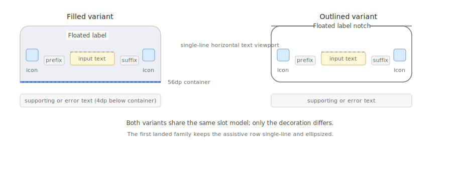

# Roo Windows Material 3 Text Field Design

## Objective

Add a Material 3 text-field family to `roo_windows` that fits the framework's
embedded-first widget model and closes directly on the current application-
owned keyboard and text-editing infrastructure.

The design should provide:

- the two Material 3 text-field variants: filled and outlined,
- a surface-owning `material3::TextField` widget with a floating label,
  single-line editable text, supporting or error text, optional prefix and
  suffix text, and optional leading and trailing icon affordances,
- a `material3::SecureTextField` subclass that adds password masking and the
  standard visibility-toggle affordance without storing that state on every
  field,
- token-backed geometry, typography, color, and state handling through the
  current theme model,
- direct inline editing with the shared application-owned editor and software
  keyboard rather than a second text-input subsystem,
- and a clear follow-on seam for multiline fields once the shared editable
  text work from [text_system_design.md](text_system_design.md) lands.

This document defines the intended API family and rollout plan. It does not
describe an existing implementation.

## Motivation

`roo_windows` already has a legacy editable text field, but it is the wrong
shape for Material 3.

The current widget:

- is a non-surface-owning underlined `BasicWidget`,
- requires the caller to thread a `TextFieldEditor&` through construction,
- has no filled or outlined Material 3 container semantics,
- has no floating label, supporting text, error text, prefix, or suffix model,
- and has no Material 3 migration boundary comparable to the checked-in button,
  slider, list, badge, or navigation-rail families.

Wrapping that API in place would preserve the wrong constructor model and the
wrong surface contract. The Material 3 family should land as an additive API
that reuses the existing editor runtime while replacing the old visual and slot
model.

## Background

### Current Starting Point in `roo_windows`

As of 2026-05, `roo_windows` has no Material 3 text-field family.

What exists today:

- [widgets/text_field.h](../src/roo_windows/widgets/text_field.h) defines a
  legacy single-line `TextField` that stores an owned `std::string`, paints
  directly, supports masking, and starts editing on click.
- The same header defines `TextFieldEditor`, a shared application-owned editor
  that tracks cursor position, selection, glyph metrics, and horizontal scroll
  state for the active field only.
- [core/application.h](../src/roo_windows/core/application.h) owns one
  `Keyboard` and one `TextFieldEditor` for the whole application.
- [activities/edit_text_field.h](../src/roo_windows/activities/edit_text_field.h)
  provides a legacy full-screen editing activity built on that same editor.
- [widgets/text_block.h](../src/roo_windows/widgets/text_block.h) now supports
  wrapping, alignment, max lines, and ellipsis for read-only text.
- [text_system_design.md](text_system_design.md) already defines the intended
  long-term split between simple labels, wrapped text, rich text, and a future
  reusable `TextEditor`.

What does not exist yet:

- no Material 3 filled or outlined field surface,
- no floating label contract,
- no supporting-text or error-text layout model,
- no prefix or suffix support,
- no Material 3 slot-aware icon affordance model,
- no `ApplicationContext` accessor for the shared editor runtime,
- no test target dedicated to text editing,
- and no Material 3 text-field example sketch.

The existing legacy field is therefore useful as the editing baseline, but not
as the target Material 3 API.

### Material 3 Signals

This document is aligned against the Material 3 text-field references:

- [Overview](https://m3.material.io/components/text-fields/overview)
- [Specs](https://m3.material.io/components/text-fields/specs)
- [Guidelines](https://m3.material.io/components/text-fields/guidelines)

The main product signals carried into this design are:

1. text fields come in exactly two variants: filled and outlined,
2. both variants share the same content model,
3. every field should have a visible label that floats when the field is
   focused or populated,
4. supporting text and error text occupy the same assistive row below the
   container,
5. leading and trailing icons, plus prefix and suffix text, are normal parts
   of the component model,
6. single-line fields horizontally scroll as the caret reaches the trailing
   edge,
7. read-only fields keep the same visual family,
8. the default single-line container height is `56dp`,
9. horizontal padding is `16dp` without icons and `12dp` with icons,
10. the assistive row starts `4dp` below the container,
11. and an error icon is strongly recommended while the field is in error.

### Android Ecosystem Signals

The Android Material ecosystem carries three useful implementation signals even
though `roo_windows` should not copy its entire setter surface.

1. Filled and outlined fields are the same semantic widget with different
   decoration, not two unrelated content APIs.
2. Secure, exposed-dropdown, and counter behaviors are opt-in wrappers or
   feature layers rather than mandatory state on every base field.
3. The decoration shell and the editing core are separable concerns. That is
   the right fit for `roo_windows`, because the repo already has a working
   editing core but not a Material 3 decoration shell.

### Local Framework Signals

The widget authoring rules in
[widget_authoring.md](widget_authoring.md) and the canonical
[roo-windows-widget-authoring instruction](../.github/instructions/roo-windows-widget-authoring.instructions.md)
drive four local decisions.

1. A Material 3 text field must be a surface-owning widget, so it should
   derive from `BasicSurfaceWidget`, not from the legacy non-surface
   `widgets::TextField`.
2. The common path should not pay for a child vector, nested icon widgets, or
   per-instance callback storage. Hit-testing and painting for the slots should
   stay owner-local.
3. Optional stored state should move into subclasses when it is not needed by
   every field. That applies directly to password reveal state.
4. The current `TextFieldEditor` is too tightly coupled to the legacy concrete
   field type. Reusing it for Material 3 requires a small abstract edit-target
   seam rather than another editor implementation.

#### RAM Budget Is Important, But Fields Are Not List Rows

The first design question is not whether a text field can be as small as a
`ListEntry`. It cannot, because it owns editable text.

The right baseline is:

- `BasicSurfaceWidget` base: roughly `40-50 B`,
- one owned `std::string` control block for the editable value: typically about
  `12 B` on a 32-bit toolchain before heap capacity,
- five non-owning `roo::string_view` slot values for label, supporting text,
  error text, prefix, and suffix: `5 * 8 B = 40 B`,
- two optional icon pointers: `8 B`,
- and one packed state byte for variant and field-local flags.

That puts the base field in the rough `100-120 B` range before string
capacity. That is materially heavier than a button or list row, but it is an
acceptable tradeoff because screens usually host only a small number of text
fields and those fields already need owned mutable text.

The important optimization is therefore not "make a text field tiny at any
cost". It is "do not make every field pay for secure-toggle state, child
widgets, dropdown state, counters, or multiline layout machinery that it is
not using."

## Requirements

### Functional Requirements

1. Support the Material 3 filled and outlined text-field variants.
2. Support single-line editable text with cursor, selection, horizontal scroll,
   and software-keyboard input through the shared application-owned editor.
3. Support a floating label that stays visible while empty, focused, and
   populated states transition.
4. Support optional supporting text and optional error text, with error text
   replacing supporting text rather than adding a second assistive row.
5. Support optional leading and trailing icon affordances.
6. Support optional prefix and suffix text.
7. Support read-only fields that keep the same Material 3 visual family but do
   not bind the editor.
8. Support secure input through a separate subclass that reuses the existing
   obscured-text editor behavior.
9. Resolve geometry, typography, and colors from the active `Theme` using a
   local Material 3 token table.
10. Keep a clear follow-on path to multiline and fixed-height text-area
    support using the shared text-system design rather than a second temporary
    editor core.

### Interaction Requirements

1. Clicking or tapping the main container starts editing when the field is
   editable.
2. Under the framework contract in [non_touch_input_design.md](non_touch_input_design.md),
   focus traversal alone does not start editing; semantic activate starts
   editing instead.
3. Clicking or tapping the main container invokes normal widget interaction
   without showing the keyboard when the field is read-only.
4. Leading and trailing affordances must be hit-tested inside the field widget
   itself rather than through child widgets.
5. Focused, hovered, pressed, disabled, error, and populated visuals must flow
   through the existing widget-state model plus compact field-local state.
6. Typed text must update the rendered value immediately.
7. Confirm and cancel keep the current text buffer contents and differ only in
   the `confirmed` flag delivered to `onEditFinished(bool)`, matching the
   current `TextFieldEditor` behavior.

### API Requirements

1. Expose a single `material3::TextField` class with a variant selector rather
   than separate filled and outlined public classes.
2. Require an internal floating label in the base API. Adjacent external labels
   remain ordinary composition with [widgets/text_label.h](../src/roo_windows/widgets/text_label.h),
   not a second mode on every field.
3. Store only the editable value as owned text on the base widget.
4. Store label, supporting text, error text, prefix, and suffix as non-owning
   `roo::string_view` values.
5. Expose the shared editor through `ApplicationContext` so new Material 3
   fields do not take `TextFieldEditor&` constructor arguments.
6. Use virtual hooks and subclasses for uncommon behavior rather than adding
   new stored `std::function` members.
7. Keep secure reveal state off the base field by using a dedicated subclass.
8. Keep placeholder-only unlabeled fields, character counters, exposed
   dropdowns, and multiline public APIs out of the first landed Material 3
   surface.

### Embedded Constraints

1. Do not allocate on paint, click, hover, focus, or caret-blink paths.
2. Do not add a child vector or generic child-slot container surface to the
   common field path.
3. Keep the incremental RAM cost of `SecureTextField` to one packed reveal bit
   plus any alignment slack.
4. Keep icon affordance behavior on direct slot hit-testing rather than on
   nested button widgets.
5. Add pointer-size-aware size-budget assertions for the public field types.

## Design Overview

The Material 3 text-field family lands beside the legacy widget stack rather
than mutating it in place.

The design has four core pieces:

1. `material3::TextField` is the new surface-owning single-line Material 3
   field.
2. `material3::SecureTextField` is the opt-in password-field subclass.
3. `TextFieldEditor` is retained as the single-line editing engine, but it is
   generalized to bind an abstract edit target rather than the legacy concrete
   field type.
4. `ApplicationContext` gains access to the shared `TextFieldEditor` so new
   fields do not require constructor-injected editor references.

Key decisions:

1. Filled and outlined are visual variants on one widget class.
2. The base field is single-line only in the first landed family.
3. The field paints and hit-tests its own slots directly; it is not a generic
   container.
4. The base field stores only the state that every field needs: value,
   non-owning slot text, two icon pointers, one read-only bit, one error bit,
   and one variant selector.
5. Password reveal state lives only on `SecureTextField`.
6. Multiline is deferred until the shared editable-text core from
   [text_system_design.md](text_system_design.md) is ready.

## Design Details

### Shared Editing Runtime

The current single-line editor is reusable, but only after one local refactor.

Today `TextFieldEditor` depends directly on the legacy `widgets::TextField`
type and reaches into that concrete widget for value mutation, font lookup,
masking, and edit-finished callbacks. That coupling prevents reuse by a new
Material 3 surface-owning field.

The design therefore introduces a small internal `TextEditTarget` interface.
`TextFieldEditor` binds a `TextEditTarget*`, not a legacy `widgets::TextField*`.
The target contract stays intentionally narrow:

- access to the owned editable `std::string`,
- access to the font used for editable text,
- access to the current obscured-text policy,
- a repaint hook for selection, caret, and scroll changes,
- and `onEditFinished(bool)` for confirm or cancel.

The editor stops consulting placeholder or hint text entirely. It manages only
the actual editable string. That is a better long-term contract for both the
legacy field and the new Material 3 field, because placeholder and label paint
belong to the owner surface, not to the shared editing core.

`Application` continues to own one `Keyboard` and one `TextFieldEditor`. The
only public runtime change is that `ApplicationContext` gains:

```cpp
TextFieldEditor& textFieldEditor() const;
```

That keeps the service application-scoped while letting widgets obtain it
through the same context object they already use for theme, scheduler, and
widget-event access.

### Surface Ownership and Slot Model

`material3::TextField` derives from `BasicSurfaceWidget`.

That is the correct base because a Material 3 field owns:

- a visible container,
- a focus and error stroke or active indicator,
- state-layer overlays,
- and the semantic surface that holds the editable content.

It is not a general container. The field does not expose child composition and
does not own nested icon widgets. Instead it resolves one compact internal slot
layout and paints those slots directly.

The slot order inside the container is:

1. optional leading icon,
2. optional prefix text,
3. editable text viewport,
4. optional suffix text,
5. optional trailing affordance icon.

Below the container, the field owns one assistive row that paints either:

1. supporting text, or
2. error text.

The assistive row is single-line and ellipsized in the first landed family.
That is deliberate. Material guidance already recommends short supporting and
error messages, and keeping v1 to one line avoids paying for a permanent
wrapped-text child widget on every field before multiline editing exists.

### Layout and Geometry

The first landed family uses the single-line Material 3 geometry exactly where
the spec is explicit.



The field measures in two bands:

1. the container band,
2. the assistive band.

For the base single-line family:

- container height is `Scaled(56)`,
- assistive top gap is `Scaled(4)`,
- horizontal padding is `Scaled(16)` without icons,
- horizontal padding is `Scaled(12)` with icons,
- icon size is `ROO_WINDOWS_ICON_SIZE`,
- and icon-to-text gap is `Scaled(16)`.

The editable text viewport width is the remaining width after subtracting the
resolved side paddings and the measured widths of the occupied prefix, suffix,
and icon slots.

For single-line editing, text overflow is handled only through horizontal
scrolling in the shared editor. That matches the Material guidance for
single-line fields and reuses the current `draw_xoffset_` machinery already
implemented in `TextFieldEditor`.

The label has two positions:

1. resting, vertically aligned with the input line while the field is empty and
   not focused,
2. floated, aligned to the top label position while the field is focused or
   populated.

The label is treated as floated whenever either of the following is true:

- the editable value is non-empty,
- or the field is currently bound to the shared editor.

That rule keeps the label stable during edit start and after content entry
without adding a separate stored animation state in v1.

### Variant-Specific Container Paint

The content model is shared, but the decoration differs by variant.

#### Filled Variant

The filled field resolves to:

- container fill from `theme().color.surfaceContainerHighest`,
- top rounded corners and square bottom corners,
- a bottom active-indicator stroke,
- inactive label and prefix or suffix colors from `onSurfaceVariant`,
- focused label, cursor, and indicator color from `primary`,
- input text color from `onSurface`,
- and error label, indicator, and assistive text color from `error`.

Filled fields keep their main emphasis in the container fill. There is no full
outline around the rectangle in the normal enabled state.

#### Outlined Variant

The outlined field resolves to:

- transparent or surface-colored container fill,
- a rounded full outline from `theme().color.outline`,
- focused outline and label color from `primary`,
- input text color from `onSurface`,
- inactive label and prefix or suffix colors from `onSurfaceVariant`,
- and error outline, label, and assistive text color from `error`.

When the label is floated, the outline paint reserves a notch behind the label.
That notch is part of the field's own decoration path, not a separate child or
overlay widget.

### Typography Mapping

The current `Theme` does not expose Material 3 typography tokens directly, so
the field resolves them through the existing font helpers in
[theme.h](../src/roo_windows/core/theme.h).

The intended mapping is:

- input text: `font_body1()`,
- resting label: `font_body1()`,
- floated label: `font_body2()`,
- prefix and suffix text: `font_body1()`,
- supporting or error text: `font_body2()`.

This matches the current local typography granularity and keeps the field in
the same visual neighborhood as the landed Material 3 list and button work.

### Read-Only, Error, and Secure States

`read_only` is a base-field bit because read-only fields are part of the common
Material 3 contract and the storage cost is one packed bit.

A read-only field:

- keeps the same visual family,
- never binds the shared editor,
- never shows the software keyboard,
- but remains clickable so applications can use it for date pickers, menus,
  or drill-in actions.

Error state is also a base-field bit because it directly affects the primary
decoration and assistive row.

When error state is active:

- error text replaces supporting text,
- label and decoration resolve through the error palette,
- and the trailing slot paints the standard error icon when no explicit
  trailing affordance is present.

The first landed family keeps one trailing slot only. If an explicit trailing
affordance and an error icon are both needed simultaneously, that is follow-on
work rather than mandatory state on every field.

`SecureTextField` adds password masking without inflating the base field. It:

- inherits the same container and slot layout,
- stores one packed `revealed` bit,
- maps that bit onto the existing obscured-text path in `TextFieldEditor`,
- and toggles the trailing affordance between visibility and visibility-off
  icons.

That keeps password-specific behavior out of the base widget while still
reusing the current editor's "recently entered glyph" reveal behavior.

### Focus, Activation, and Edit Session Boundaries

This design follows the framework contract in
[non_touch_input_design.md](non_touch_input_design.md): focus and editing are
separate states.

A field can therefore be focused without being edited. The chosen rules are:

- touch click or tap on an editable field starts editing immediately,
- semantic activate on a focused editable field starts editing through the
   same `edit()` boundary,
- focus traversal alone never starts editing,
- and read-only fields remain focusable and activatable, but activation runs
   the ordinary container action path instead of binding the editor.

While a field is focused but not edited, directional navigation remains a
focus-manager concern. While a field is edited, printable text, delete or
backspace, caret movement, and selection-changing keys are routed to the
shared editor instead of being reinterpreted as synthetic touch gestures.
That keeps the field aligned with the keyboard-first rule in
[non_touch_input_design.md](non_touch_input_design.md): semantic keyboard
interaction is focus plus action, not fake pointer input.

Confirm and cancel also keep the current editor contract. Both end the edit
session and keep the current text buffer contents. The only semantic
difference is the `confirmed` argument delivered to
`onEditFinished(bool confirmed)`. Applications that need transactional
"revert on cancel" behavior should snapshot externally or implement that
policy in a subclass, rather than forcing extra snapshot state onto every base
field.

### Event and Callback Model

The base widget keeps the existing `Widget` interaction model and does not add
new stored callback slots.

The field therefore exposes virtual hooks instead of per-instance
`std::function` members:

- `onTextChanged()` for immediate edit updates,
- `onEditFinished(bool confirmed)` for commit and cancel,
- `onLeadingAffordanceClicked()` and
  `onTrailingAffordanceClicked()` for icon-slot actions.

The default icon-affordance hooks are no-ops. If a tap lands on an occupied
icon slot and the subclass or consumer does not override the hook, the field
falls back to the ordinary container click behavior.

### Repaint and Invalidation Consequences

The field has four repaint-sensitive regions:

1. the container decoration,
2. the floating-label band,
3. the editable text viewport,
4. the assistive row.

The chosen paint contract is:

1. the field stays owner-painted and does not delegate any of those regions to
   child widgets,
2. selection highlight, caret, text, prefix or suffix text, and icons are
   drawn in their final colors; the field does not prefill and then redraw the
   same pixels with a different color,
3. editor-driven visual changes call `notifyEditVisualChange()`, which dirties
   only the viewport in the common case and also dirties the label band and
   outlined-notch strip when the populated-or-focused float state flips,
4. assistive-row text changes repaint only the assistive band unless the error
   bit also changes the main container palette,
5. invalidated repaint redraws the full clipped field bounds in one pass,
   including the assistive row and any floated-label notch.

This keeps repaint local to the field, avoids child-owned repaint
coordination, and matches the direct-to-framebuffer rule that each pixel
should be settled once per pass.

### Migration Strategy

The migration plan is additive and non-breaking.

1. Land `material3::TextField` and `material3::SecureTextField` beside the
   legacy [widgets/text_field.h](../src/roo_windows/widgets/text_field.h)
   API.
2. Generalize `TextFieldEditor` so both the legacy and Material 3 fields can
   use the same editing core.
3. Add the editor accessor to `ApplicationContext`.
4. Leave [activities/edit_text_field.h](../src/roo_windows/activities/edit_text_field.h)
   available as a legacy full-screen wrapper.
5. Migrate examples and new code to the Material 3 family gradually.

This keeps the old widget available for compatibility while avoiding semantic
drift in the old API.

## Proposed API

The intended public surface is:

```cpp
namespace roo_windows {
namespace material3 {

enum class TextFieldVariant : uint8_t {
  kFilled,
  kOutlined,
};

class TextField : public BasicSurfaceWidget {
 public:
  explicit TextField(ApplicationContext& context, roo::string_view label,
                     TextFieldVariant variant = TextFieldVariant::kFilled);

  TextFieldVariant variant() const;
  void setVariant(TextFieldVariant variant);

  const std::string& text() const;
  void setText(std::string value);

  roo::string_view label() const;
  void setLabel(roo::string_view label);

  roo::string_view supportingText() const;
  void setSupportingText(roo::string_view text);

  roo::string_view errorText() const;
  void setErrorText(roo::string_view text);
  void clearError();
  bool hasError() const;

  roo::string_view prefixText() const;
  void setPrefixText(roo::string_view text);

  roo::string_view suffixText() const;
  void setSuffixText(roo::string_view text);

  const MonoIcon* leadingIcon() const;
  void setLeadingIcon(const MonoIcon* icon);

  const MonoIcon* trailingIcon() const;
  void setTrailingIcon(const MonoIcon* icon);

  bool readOnly() const;
  void setReadOnly(bool read_only);

  bool isEdited() const;
  void edit();

 protected:
  virtual void onTextChanged() {}
  virtual void onEditFinished(bool confirmed) {}
  virtual void onLeadingAffordanceClicked() {}
  virtual void onTrailingAffordanceClicked() {}
};

class SecureTextField : public TextField {
 public:
  explicit SecureTextField(
      ApplicationContext& context, roo::string_view label,
      TextFieldVariant variant = TextFieldVariant::kFilled);

  bool revealed() const;
  void setRevealed(bool revealed);
};

}  // namespace material3
}  // namespace roo_windows
```

The key internal seam is:

```cpp
namespace roo_windows {
namespace internal {

class TextEditTarget {
 public:
  virtual ~TextEditTarget() {}

  virtual std::string& textBuffer() = 0;
  virtual const std::string& textBuffer() const = 0;
  virtual const roo_display::Font& textFont() const = 0;
  virtual bool obscureText() const = 0;
  virtual void notifyEditVisualChange() = 0;
  virtual void onEditFinished(bool confirmed) = 0;
};

}  // namespace internal
}  // namespace roo_windows
```

`TextFieldEditor` then binds `internal::TextEditTarget*` instead of the legacy
concrete widget type.

## Implementation Plan

Implementation work for these phases follows the repo-local
[roo_windows widget authoring instruction](../.github/instructions/roo-windows-widget-authoring.instructions.md).

### Phase 1: Generalize the Shared Editor Runtime

Code slice:

1. Add the internal `TextEditTarget` abstraction.
2. Refactor `TextFieldEditor` to bind that abstraction rather than the legacy
   `widgets::TextField` type.
3. Stop using hint text inside the editor's glyph-measurement path.
4. Add `ApplicationContext::textFieldEditor()`.
5. Keep the legacy [widgets/text_field.h](../src/roo_windows/widgets/text_field.h)
   behavior unchanged from a caller perspective.

Proposed commit message:

> Text field runtime Phase 1: generalize the shared editor.
>
> Extract an abstract text-edit target, route `TextFieldEditor` through it,
> and expose the shared editor from `ApplicationContext` so new widget families
> can reuse the existing keyboard path without constructor-injected editor
> references.

Validation: add `text_field_test` for editor-target binding, selection,
cursor, masking, and confirm or cancel behavior, and run
`bazel test //:text_field_test` from the `roo_windows` workspace.

### Phase 2: Implement the Base Material 3 Field Surface

Code slice:

1. Add `material3::TextField` declarations and size-budget assertions.
2. Implement measurement, slot layout, and direct paint for the filled and
   outlined variants in the unfocused and read-only display states.
3. Implement label float rules, prefix and suffix layout, assistive-row paint,
   and variant-specific decoration.
4. Keep the field single-line only in this phase.

Proposed commit message:

> Material 3 text field Phase 2: add the base field surface.
>
> Introduce `material3::TextField` with filled and outlined decoration,
> floating-label layout, direct-painted slots, and size-budget coverage.

Validation: add `material3_text_field_test` and run
`bazel test //:material3_text_field_test` with defaults, variant, slot-layout,
and size-budget cases.

### Phase 3: Wire Single-Line Editing and State Transitions

Code slice:

1. Bind `material3::TextField` to the shared `TextFieldEditor` through
   `ApplicationContext`.
2. Implement editable versus read-only click behavior and the explicit
   focused-idle versus actively edited state split.
3. Reuse the shared single-line cursor, selection, and horizontal-scroll path.
4. Add focused, populated, disabled, and error-state paint.
5. Add focused golden coverage for empty, focused-idle, actively edited,
   populated, disabled, and error states in both variants.

Proposed commit message:

> Material 3 text field Phase 3: wire single-line editing.
>
> Connect `material3::TextField` to the shared editor, add focused and error
> visuals, and keep single-line caret, selection, and horizontal-scroll
> behavior aligned with the existing keyboard path.

Validation: run `bazel test //:material3_text_field_test` and
`bazel test //:material3_text_field_golden_test` with state-focused and
dirty-repaint cases for caret blink, label-float transitions, and horizontal
scroll.

### Phase 4: Add Secure-Field and Affordance Behavior

Code slice:

1. Implement trailing-slot hit-testing and affordance virtual hooks.
2. Add `material3::SecureTextField` with visibility-toggle behavior.
3. Reuse the current obscured-text editor path and "recently entered glyph"
   behavior.
4. Add error-icon fallback in the trailing slot when error text is active and
   no explicit trailing affordance is present.
5. Add focused tests and goldens for secure reveal, trailing affordance hit
   priority, and error-icon fallback.

Proposed commit message:

> Material 3 text field Phase 4: add secure and affordance behavior.
>
> Add direct trailing-slot affordances, `SecureTextField`, and error-icon
> fallback without inflating the base field type.

Validation: run `bazel test //:material3_text_field_test` and
`bazel test //:material3_text_field_golden_test` with secure-field and
affordance-focused cases.

### Phase 5: Add Example Coverage and Migrate In-Repo Usage Patterns

Code slice:

1. Add a representative example sketch under
   `examples/material3/text_fields/text_fields.ino`.
2. Update or add a small in-repo usage site to prefer the new Material 3 field
   where a Material 3 form surface is desired.
3. Keep the legacy full-screen edit activity available, but stop extending it
   as the primary authoring path for new Material 3 work.
4. Add example-build coverage for the new sketch.

Proposed commit message:

> Material 3 text field Phase 5: add example coverage.
>
> Add a representative Material 3 text-field example and switch new in-repo
> Material 3 form usage to the new field family without removing the legacy
> editing activity.

Validation: run `bazel test //:material3_text_field_test`, run
`bazel test //:material3_text_field_golden_test`, and build the example that
hosts `examples/material3/text_fields/text_fields.ino`.

## Testing Plan

Validation coverage should include:

1. `text_field_test` for the shared editor refactor, including abstract target
   binding, cursor movement, selection updates, masking, and confirm or cancel
   behavior.
2. `material3_text_field_test` for defaults, slot setters, read-only behavior,
   label float rules, error-state precedence, edit-finished confirm-versus-
   cancel semantics, and size-budget assertions.
3. `material3_text_field_golden_test` for filled and outlined variants,
   empty and populated states, focused-idle versus actively edited states,
   disabled states, error states, prefix and suffix layout, and secure-field
   reveal behavior.
4. Dirty-repaint cases for caret blink, selection updates, horizontal scroll,
   and outlined-notch redraw when the label float state changes.
5. RTL-focused render cases for leading or trailing slot mirroring and error-
   icon placement.
6. Keyboard-only integration coverage for focused-idle versus semantic-
   activate entry after the framework work in
   [non_touch_input_design.md](non_touch_input_design.md) lands.
7. Example compilation once `examples/material3/text_fields/text_fields.ino`
   lands.

## Caveats

### Rejected Alternatives

#### Mutate the Legacy `widgets::TextField` In Place

This was rejected.

The legacy field is the wrong base type, the wrong constructor model, and the
wrong slot model for Material 3. Reskinning it in place would keep the editor
injection requirement and the non-surface widget contract.

#### Expose Separate `FilledTextField` and `OutlinedTextField` Classes

This was rejected.

The two variants have the same content contract, the same editing model, and
the same slot layout. The difference is decoration, not semantics. One widget
with a variant selector keeps the public API smaller and closer to the checked-
in Material 3 button style.

#### Build the Field Out of Nested Child Widgets

This was rejected.

Using child widgets for the label, icons, prefix, suffix, and assistive row
would add child-vector or fixed-child-pointer cost to every field and would
complicate owner-local hit-testing. Direct slot paint is cheaper and better
aligned with the current single-line editing implementation.

#### Put Secure, Dropdown, Counter, or Multiline State on Every Field

This was rejected.

Those features are not needed by every field. Carrying them on the base type
would violate the repo's pay-for-what-you-use rules. The base field keeps only
the state that every field actually needs.

#### Revert the Buffer on Cancel

This was rejected.

The current shared editor mutates the live `std::string` during typing and
distinguishes only the completion reason in `onEditFinished(bool)`. Making
cancel revert would require per-session snapshots or a second staging buffer.
That adds RAM or copy cost to every edit session and would diverge from the
legacy field's behavior. The Material 3 family keeps the live-buffer
contract; callers that need revert-on-cancel can snapshot externally.

#### Extend the Current Single-Line Editor Into a Multiline Engine Now

This was rejected.

The repo already has a checked-in shared text-system direction in
[text_system_design.md](text_system_design.md). Extending the current
single-line editor into an ad hoc multiline engine would duplicate that work.
The first Material 3 family therefore stays single-line and keeps multiline as
the next deliberate follow-on once the shared editor core exists.

## Future Work

1. Add multiline expanding Material 3 fields after the shared editable-text
   pipeline from [text_system_design.md](text_system_design.md) lands.
2. Add a fixed-height Material 3 text-area surface once multiline editing is
   available.
3. Add exposed-dropdown and picker-field subclasses on top of the read-only
   base field.
4. Add character-counter and max-length support as an opt-in extension rather
   than a mandatory base-field feature.
5. Add placeholder text only if a concrete product need appears that is not
   already satisfied by the floating-label model.