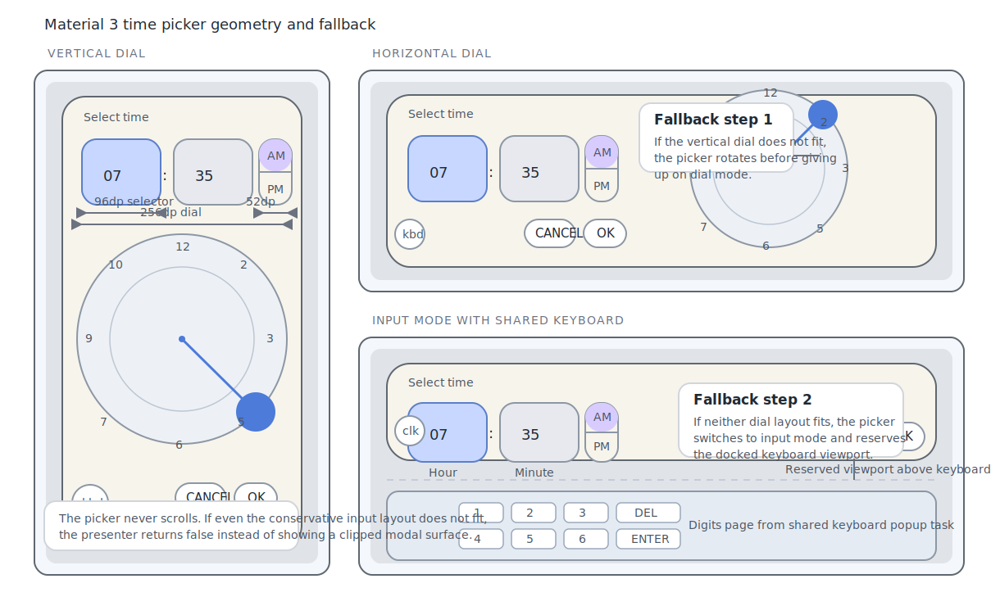

# Roo Windows Material 3 Time Pickers Design

## Objective

Add a Material Design 3 time-picker family to `roo_windows` that matches the
current embedded-first widget stack and supports the two Material 3 picker
modes: dial and input.

The design provides:

- a modal Material 3 time-picker surface shown above a scrim,
- a reusable `material3::TimePicker` body plus a
  `material3::TimePickerDialog` presenter for normal modal use,
- explicit 12-hour and 24-hour presentation,
- adaptive vertical and horizontal dial layouts, with deterministic fallback
  to input mode when dial geometry does not fit,
- hour and minute selection backed by one compact 24-hour `TimeOfDay` value,
- input-mode digit entry through the existing application-owned software
  keyboard rather than a second keypad subsystem,
- and a narrow implementation seam that later date pickers or date-time
  pickers can reuse without forcing a generic Material 3 dialog family to land
  first.

This document defines the intended API family and rollout plan. It does not
describe an existing implementation.

## Motivation

`roo_windows` already has dialogs, popup tasks, a software keyboard, and a
landed Material 3 button family, but it still has no Material 3 time picker.

That gap matters for three reasons:

1. alarm, scheduling, automation, and form flows routinely need a focused
   time-of-day picker instead of a free-form text field,
2. the current modal dialog scaffold is visually and structurally wrong for
   the Material 3 time-picker surface,
3. and without a library picker every application has to reinvent the same
   dial math, AM/PM handling, adaptive fallback, and confirm-or-cancel
   semantics.

The library therefore needs a dedicated time-picker family instead of another
application-local one-off dialog.

## Background

### Current Starting Point in `roo_windows`

As of 2026-05, `roo_windows` has no checked-in Material 3 time-picker family.

What exists today:

- [src/roo_windows/core/application.h](../src/roo_windows/core/application.h)
  already owns one shared [`Keyboard`](../src/roo_windows/activities/keyboard.h)
  and one shared legacy [`TextFieldEditor`](../src/roo_windows/widgets/text_field.h),
- [src/roo_windows/core/application.cpp](../src/roo_windows/core/application.cpp)
  already keeps that keyboard alive in its own popup task from application
  startup, so it can appear above other UI without allocating a new task each
  time,
- [src/roo_windows/keyboard_layout/en_us.cpp](../src/roo_windows/keyboard_layout/en_us.cpp)
  already defines a dedicated digits page inside the default keyboard layout,
- [src/roo_windows/material3/button/button.h](../src/roo_windows/material3/button/button.h)
  already provides Material 3 text buttons suitable for Cancel and OK actions,
- [src/roo_windows/dialogs/dialog.h](../src/roo_windows/dialogs/dialog.h)
  and [src/roo_windows/core/main_window.cpp](../src/roo_windows/core/main_window.cpp)
  already provide centered scrim-backed modal presentation for the legacy
  dialog family,
- and [src/roo_windows/widgets/scrim.h](../src/roo_windows/widgets/scrim.h)
  already provides the reusable scrim surface used by modal UI.

What does not exist yet:

- no Material 3 time picker under `src/roo_windows/material3/`,
- no compact time-of-day value type distinct from
  [`roo_time::DateTime`](../../roo_time/src/roo_time.h),
- no Material 3 modal dialog scaffold independent of the legacy
  [`Dialog`](../src/roo_windows/dialogs/dialog.h) widget,
- no Material 3 icon-button family for the dial-or-input mode toggle,
- no semantic keyboard-page selection API that lets code ask for the digits
  page without hard-coding an index,
- and no tests or example sketches dedicated to time-picker behavior.

The nearest current surfaces are therefore useful building blocks, but none of
them is the target API.

### Material 3 Signals

This design is aligned against the current Material 3 time-picker references:

- [Overview](https://m3.material.io/components/time-pickers/overview)
- [Specs](https://m3.material.io/components/time-pickers/specs)
- [Guidelines](https://m3.material.io/components/time-pickers/guidelines)

The product signals that matter most here are:

1. time pickers are modal and appear above a scrim,
2. there are two primary picker modes: dial and input,
3. the same working value is edited through either mode,
4. the dial layout adapts between vertical and horizontal arrangements,
5. 12-hour mode uses an AM or PM selector while 24-hour mode does not,
6. the dial uses a `256dp` circular face with a `48dp` selector handle,
7. dial-mode hour and minute selectors use `96dp x 80dp` chips,
8. input-mode hour and minute selectors use `96dp x 72dp` fields with labels
   below,
9. the period selector uses a `52dp` width in the published measurements,
10. time pickers should not scroll,
11. constrained viewports should prefer orientation changes first and input
    mode second,
12. and if the picker still cannot fit, it should not be shown cropped.

### Android Ecosystem Signals

The Android Material implementations add several useful compatibility signals
even though `roo_windows` should not mirror the full Java or Compose API.

The strongest signals are:

1. store the working value in 24-hour form and derive 12-hour presentation from
   it,
2. treat hour or minute selection as one active segment that controls the dial
   meaning,
3. auto-advance from hour selection to minute selection on the dial path,
4. use a two-ring 24-hour hour dial rather than shrinking one ring until the
   numbers become unreadable,
5. keep input mode specialized to two short numeric fields instead of routing
   through a general-purpose text-field decoration shell,
6. and keep confirm or cancel semantics on the modal presenter rather than
   mutating the caller-owned value incrementally.

Those signals fit `roo_windows` well. They keep the public API compact while
closing on the behaviors people expect from Material time pickers.

### Local Framework Constraints

Four current repo facts directly shape the design.

1. The legacy [Dialog](../src/roo_windows/dialogs/dialog.h) scaffold is the
   wrong visual and structural base. It hardcodes the old title panel,
   dividers, scrollable content area, and legacy footer buttons. A Material 3
   time picker should not subclass it just to inherit scrim presentation.
2. The shared [Keyboard](../src/roo_windows/activities/keyboard.h) is already
   alive in a popup task, so the picker can reuse it for numeric input without
   creating another keyboard subsystem.
3. The current legacy [TextFieldEditor](../src/roo_windows/widgets/text_field.h)
   is still specialized to the old text-field widget type. Time-picker input
   does not need that machinery anyway because it edits only one active
   two-digit segment at a time.
4. The canonical widget guidance in
   [roo-windows-widget-authoring.instructions.md](../.github/instructions/roo-windows-widget-authoring.instructions.md)
   still applies: optimize for RAM first, avoid allocations on hot paths, and
   keep public widget state narrow.

#### RAM Budget Matters, But This Is a Singleton Modal Surface

The important RAM question is not whether the picker can be as small as a list
row. It cannot, and it does not need to be.

The picker exists as a singleton modal surface, so a small fixed child tree is
the right tradeoff. The approximate live-widget cost of one open picker is
still reasonable:

- one surface-owning `TimePicker` container,
- two selector-field widgets,
- one dial widget in dial mode,
- one small mode-toggle affordance widget,
- two text buttons for Cancel and OK,
- and one optional AM or PM toggle widget in 12-hour mode.

That is roughly a few hundred bytes of widget state rather than a multiplied
per-row cost. The correct optimization is therefore:

1. keep the child count fixed and small,
2. owner-paint the dial labels instead of creating 12 or 24 child buttons,
3. keep input editing state on the temporary dialog presenter rather than on
   every field,
4. and avoid heap allocation on drag, keypress, and paint paths.

## Requirements

### Functional Requirements

1. Support both Material 3 picker modes: dial and input.
2. Support explicit 12-hour and 24-hour presentation.
3. Store the working value as a compact time-of-day value in 24-hour form.
4. Support hour and minute selection, plus AM or PM selection in 12-hour mode.
5. Support both vertical and horizontal dial layouts.
6. Support deterministic fallback from dial mode to input mode when the dial
   layout does not fit.
7. Support modal presentation over a scrim with outside-tap dismissal.
8. Support Cancel and OK actions with the landed Material 3 text-button family.
9. Reuse the application-owned software keyboard for input mode.
10. Never scroll the picker surface.
11. Refuse to show the picker when even the input layout cannot fit without
    clipping.
12. Add example coverage and tests for the new family.

### Interaction Requirements

1. Opening the picker starts with the hour segment active.
2. Tapping the hour or minute selector changes the active segment immediately.
3. In dial mode, dragging or tapping the dial updates the active segment
   immediately.
4. Completing hour selection on the dial auto-advances the active segment to
   minute.
5. In 12-hour mode, toggling AM or PM updates the working value without
   changing minute.
6. Switching between dial and input mode preserves the current working value
   and active segment.
7. Input mode accepts only valid numeric prefixes for the active segment and
   auto-advances from hour to minute when a valid hour is complete.
8. Delete removes the last typed digit in the active input segment without
   affecting the other segment.
9. Enter on the hour field advances to minute; Enter on the minute field hides
   the software keyboard but does not confirm the dialog.
10. Outside tap, explicit Cancel, and programmatic close dismiss the modal
    surface without committing the working value to the caller.
11. OK commits the working value exactly once when the dialog closes.

### API Requirements

1. Expose a compact `material3::TimeOfDay` value type.
2. Expose a reusable `material3::TimePicker` surface widget.
3. Expose a `material3::TimePickerDialog` presenter for the normal modal use
   case.
4. Require the caller to choose 12-hour or 24-hour presentation explicitly.
5. Keep date, time-zone, duration, and date-time-combination semantics out of
   the base picker API.
6. Keep arbitrary child-slot authoring out of the first public surface.
7. Keep the result callback on the temporary dialog presenter, not on the base
   `TimePicker` widget.
8. Avoid new public entry points that only stub out future behavior.

### Embedded Constraints

1. Do not allocate on dial drag, keypress, button press, or paint paths.
2. Do not create one child widget per dial numeral.
3. Keep the input-mode edit buffer temporary and picker-local rather than
   adding general text-edit state to the selector fields.
4. Reuse shared theme roles and shared keyboard infrastructure where that does
   not force the wrong public API.
5. Add pointer-size-aware size-budget assertions for the public value type and
   the new picker-specific widgets.
6. Avoid hard-coded keyboard page indices in the time-picker implementation.

## Design Overview

### Scope Boundary

In scope:

- a Material 3 time-picker family,
- dial and input modes,
- 12-hour and 24-hour presentation,
- adaptive vertical and horizontal dial layout,
- modal scrim-backed presentation,
- shared-keyboard reuse for numeric entry,
- and a compact time-of-day value type.

Out of scope:

- date pickers,
- date-time combination dialogs,
- seconds or sub-minute precision,
- generic inline time-field widgets,
- locale-driven hour-cycle inference,
- and a general-purpose Material 3 dialog family for unrelated components.

### Core Structure

The family has five pieces.

1. `material3::TimeOfDay` is the compact public value type.
2. `material3::TimePicker` is a surface-owning fixed-layout container that
   paints the headline and separator, owns a small set of child controls, and
   holds the working value.
3. An internal `TimePickerDial` child owns dial hit-testing, angle mapping,
   and dial-only painting.
4. An internal `TimePickerKeyboardSession` implements `KeyboardListener` and
   edits the currently active two-digit segment in input mode.
5. `material3::TimePickerDialog` is the modal presenter. It creates one
   full-window popup task, paints the scrim, centers one `TimePicker`, manages
   the working-copy lifetime, and reports the final result.

The decisive design choices are:

1. The public value is always stored in 24-hour form.
2. The caller must choose 12-hour or 24-hour display explicitly.
3. Modal presentation uses a dedicated popup-task overlay, not the legacy
   `Dialog` scaffold.
4. The picker uses a small fixed child tree because it is a singleton modal
   surface, but the dial numerals remain owner-painted.
5. Input mode reuses the shared keyboard directly and does not depend on the
   legacy `TextFieldEditor`.
6. The picker never scrolls and never clips. If even the input layout cannot
   fit, `show()` fails and emits a warning.



## Design Details

### Value Model and Hour-Cycle Policy

`TimeOfDay` stores two bytes: `hour` in `[0, 23]` and `minute` in `[0, 59]`.

That is the canonical working value for the whole family. The picker never
stores a separate AM or PM bit, because period state is derived from `hour`.

This design rejects two alternatives:

1. using `roo_time::DateTime` as the picker value,
2. and storing separate 12-hour display fields plus a second AM or PM bit.

`DateTime` is the wrong semantic type because a time picker chooses a local
time-of-day rather than a fully qualified calendar instant. The split 12-hour
representation is also the wrong model because it duplicates state and makes
AM/PM toggling harder than necessary.

The caller must choose the hour cycle explicitly through
`TimePickerClockFormat`. There is no `kAuto` default in v1 because the repo has
no existing locale or system-service contract that can justify one.

### Working Copy and Result Semantics

`TimePickerDialog` owns a working copy of the value while it is open.

That working copy is initialized from the caller-supplied `TimeOfDay` and is
mutated live as the dial, AM/PM selector, and input fields change. The caller's
value is not implicitly changed by those edits.

The final semantics are:

1. OK reports `kConfirmed`; the caller then reads the picker's final value.
2. Cancel reports `kCancelled`; the caller-owned value remains unchanged.
3. Outside tap or programmatic close reports `kDismissed`; the caller-owned
   value remains unchanged.

That keeps the modal contract aligned with the rest of the library's confirm or
cancel behavior and avoids surprising partial writes.

### Surface Ownership and Child Model

`material3::TimePicker` derives from `Container`.

That is the correct base because the picker owns an independently meaningful
modal surface, needs a fixed small set of child controls, and does not multiply
across dozens of list rows.

The bounded child tree is:

1. one hour selector field,
2. one minute selector field,
3. one optional AM or PM toggle in 12-hour mode,
4. one `TimePickerDial` child in dial mode,
5. one small mode-toggle affordance child,
6. one Cancel text button,
7. and one OK text button.

The headline, the `:` separator, the outer surface, and the dial-mode layout
scaffold are painted by the parent. The dial numerals are painted by the dial
child, not by a grid of numeral buttons.

This keeps the common path straightforward without paying for speculative slot
composition or one child per mark on the dial.

### Modal Presentation

`TimePickerDialog` does not subclass the legacy
[Dialog](../src/roo_windows/dialogs/dialog.h).

Instead it presents the picker through a dedicated full-window popup task:

1. `show(Application&, CallbackFn)` creates one fullscreen popup task,
2. that task hosts one internal overlay activity,
3. the overlay paints the scrim and centers the picker,
4. the overlay intercepts outside taps and converts them to `kDismissed`,
5. and `close()` tears down the task, unbinds the keyboard listener if needed,
   and invokes the callback exactly once.

This keeps the time-picker surface independent of the old title panel,
scrollable content area, and legacy footer-button contract while still reusing
the current popup-task infrastructure.

### Layout and Adaptation

The picker never scrolls. Layout therefore closes on one deterministic choice
sequence.

The outer surface uses:

- `Scaled(24)` padding on all four sides,
- a `Scaled(28)` top-corner radius on the modal surface,
- left-aligned headline text,
- one action row at the bottom with the mode toggle on the leading side and
  Cancel plus OK on the trailing side,
- and a mode-dependent middle region.

The mode-dependent region is chosen by measurement, not by screen-class names.

For dial mode, the picker measures both published dial arrangements:

1. vertical dial layout,
2. horizontal dial layout.

The selection rule is:

1. if vertical dial fits, use it,
2. else if horizontal dial fits, use it,
3. else switch to input mode,
4. and if input mode still cannot fit without clipping, `show()` returns false
   and logs a warning.

Input mode is measured conservatively against the viewport that remains above
the docked software keyboard. That keeps the picker stable when a segment gains
focus and the keyboard becomes visible.

The main published geometry carried into the design is:

- dial face size: `Scaled(256)`,
- dial selector handle size: `Scaled(48)`,
- dial selector center size: `Scaled(8)`,
- dial selector track width: `Scaled(2)`,
- dial header selector size: `Scaled(96) x Scaled(80)`,
- input selector size: `Scaled(96) x Scaled(72)`,
- period selector width: `Scaled(52)`,
- and outer padding: `Scaled(24)`.

### Dial Geometry and Mapping

The dial child paints three things:

1. the circular dial face,
2. the selector track, center, and handle,
3. and the dial labels.

The current active segment determines the label table:

1. hour labels in 12-hour mode,
2. hour labels in 24-hour dual-ring mode,
3. or minute labels at 5-minute intervals.

The dial uses one normalized clock-angle computation.

Let $(c_x, c_y)$ be the dial center and $(x, y)$ the pointer location. The
clock angle with 12 o'clock at zero is:

$$
\theta = \operatorname{fmod}\left(\frac{\pi}{2} - \operatorname{atan2}(y-c_y,
x-c_x) + 2\pi, 2\pi\right).
$$

For a ring with $N$ slots, the selected slot index is:

$$
i = \operatorname{round}\left(\frac{N\theta}{2\pi}\right) \bmod N.
$$

The picker then interprets that slot index through one of three lookup tables:

1. 12-hour hours,
2. 24-hour outer or inner ring hours,
3. or minutes.

#### 12-Hour Dial

In 12-hour mode the hour dial uses one ring with labels `1` through `12`.

The stored value remains 24-hour. The conversion is:

- AM keeps hours `0` through `11`, with displayed `12` mapping to `0`,
- PM keeps hours `12` through `23`, with displayed `12` mapping to `12`.

After the user picks an hour on the dial, the active segment changes to minute
immediately.

#### 24-Hour Dial

In 24-hour mode the hour dial uses two concentric rings.

The outer ring shows `1` through `12`. The inner ring shows `00` and `13`
through `23`.

That mapping is deliberate. It matches the strongest current Android Material
signal and keeps all hour labels legible on the published `256dp` dial without
shrinking hit targets.

Ring selection is radius-based. A pointer inside the ring split selects the
inner table; a pointer outside it selects the outer table. Taps near the split
snap to the nearest table by absolute radial distance.

#### Minute Dial

The minute dial paints labels at 5-minute intervals but resolves all 60 minute
positions.

The label ring therefore stays uncluttered while drag and tap preserve minute
precision.

### Input Mode and Keyboard Session

Input mode reuses the existing shared
[Keyboard](../src/roo_windows/activities/keyboard.h), but it does not reuse the
legacy [TextFieldEditor](../src/roo_windows/widgets/text_field.h).

That is a deliberate split.

The time-picker input fields are not general text fields. They need:

1. exactly one active segment at a time,
2. exactly two digits of stored draft input per segment,
3. prefix validation rather than free-form text editing,
4. no cursor paint,
5. and deterministic auto-advance.

The picker therefore binds a private `TimePickerKeyboardSession` as the current
`KeyboardListener` while input mode is active. That session edits the active
segment only.

The keyboard contract is:

1. opening input mode shows the shared keyboard and switches it to the digits
   page,
2. leaving input mode or closing the dialog hides the keyboard and clears the
   listener if the time picker still owns it,
3. the keyboard page is selected semantically through a new page-role API,
   not by hard-coded page index,
4. and input-mode layout is measured against the viewport above that docked
   keyboard.

The digit-entry rules are closed as follows.

For 12-hour hours:

- first digit must be `0` or `1`,
- second digit must complete `01` through `12`,
- and a completed hour auto-advances to minute.

For 24-hour hours:

- first digit must be `0`, `1`, or `2`,
- if the first digit is `2`, the second digit must be `0` through `3`,
- otherwise the second digit must be `0` through `9`,
- and a completed hour auto-advances to minute.

For minutes:

- first digit must be `0` through `5`,
- second digit must be `0` through `9`,
- and a completed minute stays selected until the user presses OK or changes
  focus explicitly.

Delete removes the last buffered digit. Enter advances from hour to minute and
then hides the keyboard on minute. It does not confirm the dialog.

### Selector Fields, Period Toggle, and Mode Toggle

The hour and minute selector fields are dedicated picker widgets.

They use two presentation styles:

1. dial-header style in dial mode,
2. input-field style in input mode.

The same widget type is used in both modes so that active-segment highlight,
value text, and press handling stay consistent.

The period toggle is a picker-local two-segment control. It is shown only in
12-hour mode. The selected half resolves through `primaryContainer` and
`onPrimaryContainer`; the unselected half resolves through surface and outline
roles.

The dial-or-input mode toggle is also picker-local. It uses the clock and
keyboard icons from `roo_icons`, paints its own circular state layer, and keeps
that dependency local rather than waiting for a full public Material 3 icon-
button family.

Cancel and OK reuse the landed
[material3::Button](../src/roo_windows/material3/button/button.h) in text mode.

### Typography and Color Mapping

The current theme does not expose a dedicated Material 3 time-picker token
table, so the family resolves typography and colors through the existing theme
roles and font helpers.

The intended mapping is:

- headline: `font_h6()`,
- selector value text: `font_h4()`,
- selector labels in input mode: `font_body2()`,
- dial numerals: `font_body1()`,
- period selector text: `font_button()`,
- and action buttons: the existing Material 3 button typography.

The intended color-role mapping is:

- outer dialog surface: `surfaceContainerHigh`,
- selector containers and dial face: `surfaceContainerHighest`,
- active selector container: `primaryContainer`,
- active selector text: `onPrimaryContainer`,
- dial hand and dial center: `primary`,
- selected dial numeral text: `onPrimary`,
- inactive text: `onSurface`,
- and secondary labels and outlines: `onSurfaceVariant` plus `outline`.

That keeps the picker visually aligned with the landed Material 3 work without
inventing a second theme system just for one component family.

### Validation, Size Budgets, and Hot Paths

The hot paths are dial drag, keyboard digits, and paint.

The design keeps those paths allocation-free:

1. the dial label tables are static const data,
2. the input session stores only one small two-digit buffer for the active
   segment,
3. child widgets are allocated or constructed once with the picker,
4. and the dialog presenter reuses the long-lived keyboard popup instead of
   creating one per show.

The public and picker-specific types should add size-budget assertions for:

- `TimeOfDay`,
- `TimePickerDial`,
- the selector field type,
- the period toggle type,
- and `TimePicker` itself.

The exact thresholds can be pointer-size-aware, but `TimeOfDay` should remain
two bytes and the picker body should stay within a bounded modal-surface budget
rather than growing with speculative slot or callback storage.

## Proposed API

The intended public surface is:

```cpp
namespace roo_windows {
namespace material3 {

enum class TimePickerClockFormat : uint8_t {
  kHour12,
  kHour24,
};

enum class TimePickerMode : uint8_t {
  kDial,
  kInput,
};

enum class TimePickerSelection : uint8_t {
  kHour,
  kMinute,
};

enum class TimePickerDialogResult : int8_t {
  kDismissed = -1,
  kCancelled = 0,
  kConfirmed = 1,
};

struct TimeOfDay {
  uint8_t hour;
  uint8_t minute;

  [[nodiscard]] bool isValid() const;
  static TimeOfDay Clamp(uint8_t hour, uint8_t minute);
};

class TimePicker : public Container {
 public:
  TimePicker(ApplicationContext& context, TimePickerClockFormat format,
             TimeOfDay initial_value = {0, 0});

  TimePickerClockFormat clockFormat() const;
  void setClockFormat(TimePickerClockFormat format);

  TimePickerMode mode() const;
  void setMode(TimePickerMode mode);

  TimePickerSelection selection() const;
  void setSelection(TimePickerSelection selection);

  TimeOfDay value() const;
  void setValue(TimeOfDay value);

  roo::string_view headline() const;
  void setHeadline(roo::string_view headline);

 protected:
  virtual void onValueChanged(TimeOfDay previous) {}
  virtual void onModeChanged(TimePickerMode previous) {}
};

class TimePickerDialog {
 public:
  using CallbackFn = std::function<void(TimePickerDialogResult)>;

  TimePickerDialog(ApplicationContext& context, TimePickerClockFormat format,
                   TimeOfDay initial_value = {0, 0});

  TimePicker& picker();
  const TimePicker& picker() const;

  bool show(Application& app, CallbackFn callback = nullptr);
  void close();

  bool isOpen() const;
};

}  // namespace material3
}  // namespace roo_windows
```

Notes:

1. `show()` returns `false` when the current viewport is too small to display
   the picker without clipping.
2. The picker headline defaults to a library-owned English string, but callers
   can replace it explicitly.
3. There is no public `DateTime` conversion API in v1. Callers that need to
   merge a picked time into a date do so in application code.

## Implementation Plan

Implementation work for these phases follows the repo-local
[roo_windows widget authoring instruction](../.github/instructions/roo-windows-widget-authoring.instructions.md).

### Phase 1: Add the Value Type and Modal Input Infrastructure

Code slice:

1. Add `material3::TimeOfDay` plus validation and clamp helpers.
2. Add a semantic keyboard-page role to
   [keyboard_layout.h](../src/roo_windows/keyboard_layout/keyboard_layout.h)
   and route the existing digits page through that role.
3. Add a public `Application::keyboard()` accessor so temporary presenters can
   bind the shared keyboard without reaching through unrelated internals.
4. Add the internal popup-task-backed modal overlay helper used by the time
   picker presenter.
5. Add `material3_time_picker_test` cases for `TimeOfDay` validation and
   keyboard page-role resolution.

Proposed commit message:

> Material 3 time picker Phase 1: add value and modal input groundwork.
>
> Add the compact `TimeOfDay` value type, semantic digits-page selection for
> the shared keyboard, and the internal modal overlay seam that the time-picker
> presenter will use.

Validation: run `bazel test //:material3_time_picker_test` with value and
keyboard-role cases.

### Phase 2: Add the Static Picker Surface and Size Budgets

Code slice:

1. Add `material3::TimePicker` declarations and size-budget assertions.
2. Implement the outer surface, headline paint, selector-field widgets,
   period-toggle widget, mode-toggle affordance widget, and Cancel or OK text
   buttons.
3. Implement static vertical dial, horizontal dial, and input-mode layout
   measurement without live dial interaction yet.
4. Add `material3_time_picker_golden_test` static cases for vertical dial,
   horizontal dial, and input-mode geometry in both 12-hour and 24-hour
   formats.

Proposed commit message:

> Material 3 time picker Phase 2: add the picker surface.
>
> Introduce the time-picker surface, selector fields, period toggle, mode
> toggle, and static adaptive layout with size-budget coverage.

Validation: run `bazel test //:material3_time_picker_golden_test` with static
layout cases and run `bazel test //:material3_time_picker_test` with size-budget
checks.

### Phase 3: Add Dial Interaction and 12-Hour Flow

Code slice:

1. Implement the `TimePickerDial` child with owner-painted dial numerals,
   hand, center, and handle.
2. Implement 12-hour hour mapping, minute mapping, and dial hit-testing.
3. Implement active-segment switching plus hour-to-minute auto-advance on the
   dial path.
4. Add focused tests and goldens for hour selection, minute selection, and
   AM or PM toggling.

Proposed commit message:

> Material 3 time picker Phase 3: add 12-hour dial interaction.
>
> Add the owner-painted dial child, 12-hour hour and minute selection, and
> active-segment flow that matches Material time-picker behavior.

Validation: run `bazel test //:material3_time_picker_test` and
`bazel test //:material3_time_picker_golden_test` with 12-hour dial cases.

### Phase 4: Add 24-Hour Dial and Input Mode

Code slice:

1. Implement the dual-ring 24-hour hour dial.
2. Add the picker-local `TimePickerKeyboardSession` and bind it to the shared
   keyboard digits page in input mode.
3. Implement prefix validation, delete behavior, Enter behavior, and
   hour-to-minute auto-advance for input mode.
4. Add adaptive fallback from dial mode to input mode when neither dial layout
   fits.
5. Add tests and goldens for 24-hour selection, input-mode editing, and
   adaptive fallback.

Proposed commit message:

> Material 3 time picker Phase 4: add 24-hour and input behavior.
>
> Add the dual-ring 24-hour dial, direct shared-keyboard numeric entry, and
> deterministic dial-to-input fallback without introducing a second text-input
> subsystem.

Validation: run `bazel test //:material3_time_picker_test` and
`bazel test //:material3_time_picker_golden_test` with 24-hour and input-mode
cases.

### Phase 5: Add the Modal Presenter and Example Coverage

Code slice:

1. Add `material3::TimePickerDialog` with popup-task presentation, scrim paint,
   centered placement, outside-tap dismissal, and final result callback.
2. Refuse to show the picker when the conservative input-mode viewport cannot
   fit without clipping.
3. Add a representative example sketch under
   `examples/material3/time_pickers/time_pickers.ino`.
4. Add integration tests for confirm, cancel, outside-dismiss, and too-small-
   viewport refusal.

Proposed commit message:

> Material 3 time picker Phase 5: add modal presentation.
>
> Add the scrim-backed time-picker presenter, final result handling, and a
> representative example without reusing the legacy dialog scaffold.

Validation: run `bazel test //:material3_time_picker_test`, run
`bazel test //:material3_time_picker_golden_test`, and build the example that
hosts `examples/material3/time_pickers/time_pickers.ino`.

## Testing Plan

Validation coverage should include:

1. `material3_time_picker_test` for `TimeOfDay` validation, 12-hour and 24-hour
   conversion helpers, dial angle mapping, active-segment flow, input-mode
   prefix validation, delete and Enter behavior, semantic keyboard-page
   selection, confirm or cancel semantics, and too-small-viewport refusal.
2. `material3_time_picker_golden_test` for vertical dial, horizontal dial,
   input mode, 12-hour AM and PM states, 24-hour dual-ring states, active hour
   and active minute emphasis, and mode-toggle visuals.
3. Modal integration cases that verify outside taps dismiss the picker, OK
   confirms it exactly once, and keyboard visibility is cleaned up after close.
4. Example compilation once `examples/material3/time_pickers/time_pickers.ino`
   lands.

## Caveats

### Rejected Alternatives

#### Reuse the Legacy `Dialog` Scaffold

This was rejected.

The legacy dialog base is the wrong shape for Material 3 time pickers. It
hardcodes the old title row, scrollable body, dividers, and legacy footer
button contract. Reusing it would preserve the wrong chrome just to inherit
modal scrim behavior.

#### Route Input Mode Through Generic Text Fields

This was rejected.

Time-picker input fields are not general text fields. They edit one active
two-digit segment, need prefix validation, do not need cursor or selection
paint, and do not benefit from the current legacy `TextFieldEditor`
specialization. A picker-local keyboard session is smaller and clearer.

#### Use `roo_time::DateTime` as the Picker Value

This was rejected.

`DateTime` carries calendar and time-zone semantics that the picker does not
choose. Forcing callers through `DateTime` would make a simple time-of-day
selection pay for the wrong abstraction.

#### Paint the Entire Picker as One Giant Widget

This was rejected.

The picker is a singleton modal surface, so a fixed child tree is acceptable
and simplifies button, toggle, and focus behavior. The important RAM saving is
to keep the child count bounded and the dial numerals owner-painted, not to
collapse every interaction target into one monolithic widget.

## Future Work

Potential follow-ons that are intentionally out of scope for this document are:

1. a date-picker family or a combined date-time picker that reuses the same
   popup-task-backed modal shell,
2. locale-driven hour-cycle defaults and localized built-in headline strings,
3. helper utilities that merge `TimeOfDay` into caller-owned
   `roo_time::DateTime` values,
4. optional seconds selection or duration-picking variants,
5. and migration of the picker-local mode toggle onto a future generic
   Material 3 icon-button family once that family lands.