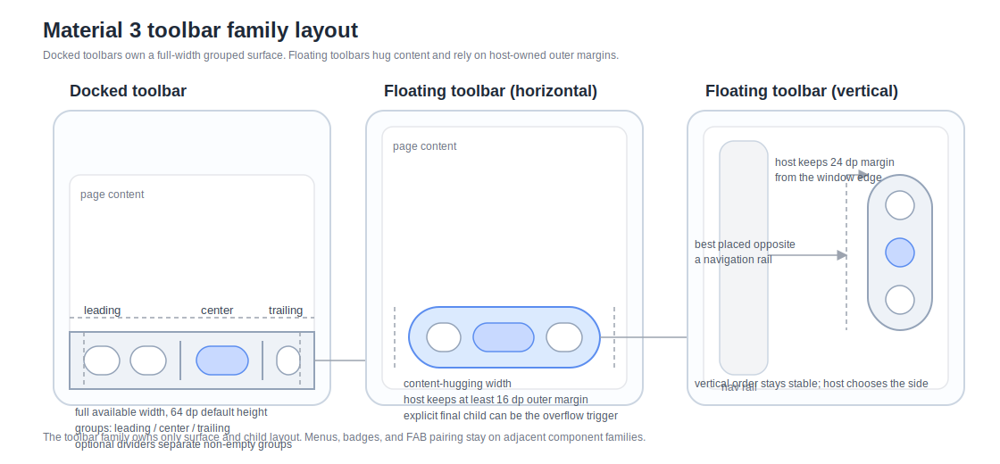

# Roo Windows Material 3 Toolbars Design

## Implementation status

**Proposed.** None of the defined scope is implemented. The status of existing and outstanding prerequisites is recorded in the [status index](../README.md).

## Objective

Add a Material 3 toolbar family to `roo_windows` that fits the current
embedded-first widget model and covers the current expressive toolbar surface:

- the recommended Material 3 docked toolbar,
- the recommended Material 3 floating toolbar,
- standard and vibrant color styles,
- horizontal docked layout and horizontal / vertical floating layout,
- slot-based composition of existing widgets such as buttons, future icon
  buttons, and text fields,
- and `paint(PaintContext&)`-based rendering on the current surface pipeline.

The result is a first-class toolbar family, not a `FlexLayout` recipe and not a
revived bottom-app-bar API. The design deliberately keeps automatic overflow
menus, toolbar-local badges, and toolbar-owned FAB docking out of the base
widget API.

## Motivation

`roo_windows` already has generic layout containers, but it does not have a
Material 3 toolbar surface. The current expressive Material guidance treats
toolbars as a distinct component family with strong geometry, placement, and
container-style rules. Encoding those rules ad hoc at every call site would be
error-prone and would not give the library a stable API for examples, tests,
and reuse.

The toolbar design also needs to stay aligned with adjacent component work that
has already landed or already has a checked-in design:

- buttons and future icon buttons,
- badges,
- popup menus,
- and floating action buttons.

If the toolbar API absorbs those responsibilities directly, it would duplicate
nearby component families and put extra RAM cost on every toolbar instance.

## Background

### Current Status in `roo_windows`

As of 2026-05, `roo_windows` does not have a Material 3 toolbar family.

What exists today:

- the generic [FlexLayout](../../../src/roo_windows/containers/flex_layout.h) and
  other container primitives,
- the checked-in [material3::Button](../../../src/roo_windows/material3/button/button.h),
- the checked-in [material3::Badge](../../../src/roo_windows/material3/badge/badge.h)
  helper,
- the checked-in [PaintContext](../../../src/roo_windows/core/paint_context.h)
  pipeline,
- the checked-in theme token surface in [theme.h](../../../src/roo_windows/core/theme.h),
  including the legacy `ROO_WINDOWS_TOOLBAR_ICON_SIZE` macro,
- the checked-in design docs for [Material 3 buttons](../implemented/material3_buttons_design.md),
  [menus](material3_menus_design.md), and
  [FABs](material3_fabs_design.md).

What does not exist yet:

- no `material3/toolbar/` implementation under `src/roo_windows`,
- no checked-in `material3::IconButton` implementation even though the button
  design already reserves that public type,
- no checked-in Material 3 popup-menu implementation,
- no checked-in Material 3 FAB implementation,
- and no toolbar-focused example or test target.

That current state matters in two ways.

First, the toolbar design should reuse existing widgets and adjacent component
families rather than defining a second button, badge, menu, or FAB model just
for toolbars.

Second, the toolbar implementation cannot assume a scaffold host that manages
bottom docking, safe areas, scroll hide/show, or paired FAB placement. Those
remain host responsibilities.

### Material 3 Sources

This document is aligned against the current Material 3 toolbar references:

- [Overview](https://m3.material.io/components/toolbars/overview)
- [Specs](https://m3.material.io/components/toolbars/specs)
- [Guidelines](https://m3.material.io/components/toolbars/guidelines)

The strongest current signals are:

1. expressive toolbars are the supported family; the baseline bottom app bar is
   still documented but no longer recommended,
2. the recommended family has two variants: docked and floating,
3. toolbars are bottom or edge action surfaces for the current page, not top
   app bars,
4. the default toolbar height is `64 dp`,
5. the docked toolbar spans the full available width and keeps a straight
   container shape,
6. the floating toolbar hugs its content, supports horizontal and vertical
   presentation, and relies on host-supplied outer margins,
7. standard and vibrant container color styles are both first-class,
8. toolbars are slot-based containers that usually host icon buttons, buttons,
   or text fields rather than painting those controls themselves,
9. when more actions are needed, a toolbar should use an explicit overflow menu
   rather than growing past its safe placement bounds,
10. floating toolbars can be paired with a FAB, but that FAB remains a separate
   component,
11. horizontal floating toolbars should stay at least `16 dp` from the window
   edge,
12. vertical floating toolbars should stay at least `24 dp` from the window
   edge and are best placed opposite a navigation rail.

### Scope Boundary With App Bars

Material 3 now separates top app bars from bottom / floating toolbars.

This design covers only the toolbar family. It does **not** cover:

- search app bars,
- small / medium flexible / large flexible top app bars,
- top-app-bar scroll compression,
- or search-view integration.

Those belong in a separate app-bar design.

### Local Design References

The most relevant local references are:

- [../implemented/material3_buttons_design.md](../implemented/material3_buttons_design.md)
- [material3_fabs_design.md](material3_fabs_design.md)
- [material3_menus_design.md](material3_menus_design.md)
- [material3_navigation_rail_design.md](material3_navigation_rail_design.md)
- [../implemented/material3_badge_design.md](../implemented/material3_badge_design.md)
- [widget_authoring.md](../../widget_authoring.md)

Those references imply several local constraints:

1. toolbars should reuse the existing widget event and overlay pipeline,
2. badges should stay on badge-aware child widgets rather than on every
   toolbar,
3. overflow should compose with the menu family rather than creating a
   toolbar-local popup model,
4. FAB pairing should reuse the FAB family and keep placement outside the base
   FAB widgets,
5. and the public API should stay close to existing `WidgetRef` ownership and
   container patterns.

### Embedded Authoring Constraints

The canonical widget guidance in
[roo-windows-widget-authoring.instructions.md](../../../.github/instructions/roo-windows-widget-authoring.instructions.md)
applies directly here:

- optimize for RAM first,
- keep base widgets cheap,
- avoid per-instance `std::function` or speculative policy storage,
- keep child action semantics on child widgets,
- and avoid allocations on paint, hover, press, and layout paths.

Approximate 32-bit ESP32 reference sizes already used by adjacent design docs:

- `Widget`: about `24 B`,
- `Container`: about `44 B`,
- `WidgetRef`: about `8 B`,
- `std::vector<...>` control block: about `12 B`,
- `FlexLayout`: about `104 B` before vector capacity.

Toolbars are not high-multiplicity row widgets, so one toolbar-local child
vector is acceptable. They still should not pay for nested layout widgets,
popup state, or action descriptors when the base component can stay smaller.

That leads to three direct decisions:

1. the base toolbar family uses dedicated container widgets rather than a full
   `FlexLayout` subclass,
2. docked children carry only compact slot metadata rather than living inside
   three permanent helper layouts,
3. and overflow menus, badges, and FABs stay on adjacent component families.

## Requirements

### Functional Requirements

1. Support the Material 3 docked toolbar.
2. Support the Material 3 floating toolbar.
3. Support standard and vibrant toolbar color styles.
4. Support full-width docked measurement with the Material 3 default `64 dp`
   toolbar height.
5. Support content-hugging floating measurement with horizontal and vertical
   orientation.
6. Support explicit composition of existing child widgets rather than only a
   toolbar-local action descriptor model.
7. Support docked leading, center, and trailing child placement while
   preserving insertion order inside each slot.
8. Support docked arrangement modes that match the Material guidance:
   evenly-spaced compact presentation, centered presentation, and edge-anchored
   grouped presentation.
9. Support optional dividers between non-empty docked groups.
10. Support floating toolbars that can host common Material 3 controls such as
    buttons, future icon buttons, and text fields, plus other widgets whose
    natural size fits the resolved toolbar bounds.
11. Keep toolbar placement outside the widget API so hosts can dock, float,
    animate, or hide toolbars without paying storage on every toolbar
    instance.
12. Keep deprecated bottom-app-bar-specific cradle and cutout behavior out of
    the initial toolbar family.

### Interaction Requirements

1. Child widgets keep full control over click handling, hover, focus,
   selection, overlays, and deferred `onClicked()` behavior.
2. Toolbars must not introduce a second action callback path for child
   interaction.
3. The base toolbar widgets do not automatically collapse actions into an
   overflow menu.
4. The base toolbar widgets do not automatically hide, reveal, or morph on
   scroll.
5. RTL must mirror logical leading / trailing placement for docked toolbars and
   reverse horizontal floating order while keeping vertical order stable.

### API Requirements

1. Expose separate `material3::DockedToolbar` and
   `material3::FloatingToolbar` public types.
2. Expose compact enums for toolbar color style, docked arrangement, floating
   orientation, and docked slot selection.
3. Accept both borrowed and adopted child widgets, following existing
   `WidgetRef` ownership conventions.
4. Provide stable child-insertion APIs directly on the toolbar widgets rather
   than requiring callers to build nested helper layouts for common placement.
5. Keep overflow composition explicit: callers place a trailing or final
   overflow trigger widget when they want a menu.
6. Keep FAB pairing explicit: callers compose a toolbar beside a FAB host or
   future scaffold rather than storing a FAB slot on every toolbar.
7. Do not add a toolbar-local badge or promoted-action model.

### Embedded Constraints

1. Do not allocate on paint, hover, press, or normal layout passes.
2. A toolbar may own one child vector; it should not own three nested layout
   widgets or a second popup model in the base case.
3. Per-child docked placement metadata should stay compact.
4. Add pointer-size-aware size-budget assertions for both public toolbar types.
5. Child widgets should remain fully reusable outside toolbars with no
   toolbar-only interface requirement.

## Design Overview

The public family is split into two surface-owning widgets:

1. `material3::DockedToolbar` is a full-width action surface with three
   logical child bands: leading, center, and trailing.
2. `material3::FloatingToolbar` is a content-hugging action surface with one
   ordered child strip that can be horizontal or vertical.

Both widgets derive from `Container` and own:

- container fill and shape,
- toolbar-specific layout policy,
- compact toolbar style state,
- and child sequencing / ownership.

They do **not** own:

- action semantics,
- popup overflow menus,
- badges,
- search state,
- or FAB placement / docking.

Those concerns stay on child widgets or on adjacent component families.



The core decisions are:

1. separate docked and floating public types rather than a mode-switching
   single widget,
2. host real child widgets rather than inventing a toolbar-local action
   descriptor family,
3. implement dedicated single-line layout instead of inheriting the full
   `FlexLayout` feature set,
4. keep overflow, badge, and FAB behavior outside the base toolbar types,
5. and keep host placement and scroll policy outside the widget API.

## Design Details

### Type Split and Layout Strategy

`DockedToolbar` and `FloatingToolbar` land beside the existing container family
rather than as one `Toolbar` widget with a large mode enum.

That split keeps the public contract and per-instance storage aligned with the
actual component shapes:

- docked toolbars always measure to the supplied width and the toolbar height,
- floating toolbars always hug their content on the main axis,
- only floating toolbars need orientation and elevation flags,
- and neither type pays for the other's unused state or layout branches.

Both widgets use dedicated single-line layout on top of `Container` rather than
deriving from [FlexLayout](../../../src/roo_windows/containers/flex_layout.h).

Reasoning:

1. docked placement has three logical groups and arrangement modes that do not
   reduce to one `justify-content` selector,
2. floating toolbars never wrap and do not need flex factors, multi-line state,
   or per-item cross-axis overrides,
3. a dedicated layout is smaller and easier to validate than inheriting the
   entire `FlexLayout` feature surface.

### Child Model and Ownership

Toolbar children are real widgets.

The toolbar family does not add a second content model. It reuses existing
widgets exactly as they already work elsewhere:

- `material3::Button`,
- future `material3::IconButton`,
- `TextField`,
- or any other widget whose natural size and interaction model fit the
  resolved toolbar bounds.

Ownership follows the established `WidgetRef` pattern:

- callers can add borrowed children,
- callers can add adopted children,
- and the toolbar manages them through one internal child sequence.

For docked toolbars, each child carries one packed slot selector:

```cpp
struct DockedChildEntry {
  WidgetRef widget;
  ToolbarSlot slot;
};
```

Insertion order is preserved within each slot. The layout pass reads the child
sequence, groups by slot, and measures / positions the groups without storing
three permanent helper layouts.

Floating toolbars use only one ordered child strip, so they only need one
`std::vector<WidgetRef>`.

### Docked Toolbar Geometry and Arrangement

`DockedToolbar` is the recommended replacement for the deprecated bottom app
bar. It intentionally models the expressive docked toolbar rather than a
cutout-style bottom app bar.

The geometry contract is:

- full available width,
- default `64 dp` height,
- straight outer corners,
- one single-row action layout,
- and optional dividers between non-empty logical groups.

The widget's natural width is the sum of child natural widths, the required
outer padding, and the group / item gaps from the toolbar token tables. In
practice, docked toolbars are meant to live in a parent that gives them the
full available width.

`DockedToolbar` supports three arrangement modes:

1. `kEvenlySpaced`: flatten visible children in logical leading-to-trailing
   order and distribute remaining horizontal space evenly between them. This is
   the compact default.
2. `kCentered`: pack the visible groups with their token gaps and center the
   whole content block.
3. `kEdgeAnchored`: pin the leading group to leading padding, pin the trailing
   group to trailing padding, and center the center group.

`kEdgeAnchored` uses its grouped placement only when the three groups fit
without overlap. If the centered group would overlap the side groups, the
layout falls back to the `kCentered` algorithm for that pass. That keeps the
layout deterministic and avoids silent overdraw.

Dividers are group separators, not top-edge borders. When enabled, a divider is
painted only between adjacent non-empty groups:

- leading / center,
- center / trailing,
- or leading / trailing when the center group is empty.

This matches the Material guidance that large-action toolbars may use dividers
to organize action groups without turning the toolbar itself into a second
surface hierarchy.

### Floating Toolbar Geometry and Orientation

`FloatingToolbar` is a content-hugging surface. The host decides where it sits
in the window and how far it stays from the window edge.

The geometry contract is:

- one single-row or single-column action strip,
- a minimum cross-axis size of `64 dp`,
- main-axis size driven by child natural sizes plus token padding and gaps,
- rounded capsule-like corners derived from the resolved cross-axis size,
- and no divider bands.

For horizontal floating toolbars:

- height is `max(64 dp, tallest child + vertical padding)`,
- width hugs the ordered child strip,
- host placement should keep at least `16 dp` from the window edge.

For vertical floating toolbars:

- width is `max(64 dp, widest child + horizontal padding)`,
- height hugs the ordered child strip,
- host placement should keep at least `24 dp` from the window edge.

Vertical toolbars are meant for narrow actions such as icon buttons or other
controls whose natural width remains reasonable in a side rail. The toolbar
does not rotate or restyle wide child widgets. If a host places wide text
buttons inside a vertical floating toolbar, the width will grow to fit them.

### Color and Surface Model

Toolbar container color is driven by one direct enum:

- `ToolbarColorStyle::kStandard` resolves to `ColorRole::kSurfaceContainer`,
- `ToolbarColorStyle::kVibrant` resolves to `ColorRole::kPrimaryContainer`.

This keeps the toolbar surface aligned with the Material expressive color
families without introducing a large appearance object.

The toolbar widgets do **not** automatically recolor or mutate child widgets.
That is deliberate.

Reasoning:

1. child controls already own their own Material 3 token contracts,
2. auto-recoloring would require toolbar-aware child APIs or parent-sensitive
   state on every button,
3. explicit child choice already covers the main Material guidance: use a
   filled or tonal action when one control needs more emphasis than its peers.

Docked toolbars always advertise zero elevation.

Floating toolbars expose one common Material configuration bit:

- `elevated = true`: use the same low-elevation surface level already used by
  elevated Material 3 buttons,
- `elevated = false`: use elevation `0`.

That keeps the base floating toolbar compatible with the Material guidance that
some floating toolbars should visually lift from the content while others can
sit flat on already distinct backgrounds.

### Paint and Invalidation Consequences

Both toolbar types are surface-owning containers. Child widgets paint
themselves. The toolbar surface then fills only the remaining unresolved
background and, for docked toolbars, any group dividers.

That means the toolbar family stays on the current `Container` /
`PaintContext` path:

- no second paint pipeline,
- no toolbar-local badge renderer,
- and no need for child-specific exclusion logic beyond whatever the child
  widget already owns.

Property changes have the usual consequences:

- `setColorStyle()` invalidates the toolbar surface,
- `setArrangement()` or `setOrientation()` requests layout and repaint,
- `setShowGroupDividers()` invalidates the divider bands,
- `setElevated()` invalidates the floating toolbar surface and triggers the
  usual elevation repaint path.

Child additions, removals, or child-size changes request toolbar relayout.

### Overflow, Menus, Badges, and FABs

Automatic overflow collapse is intentionally **not** part of the base toolbar
widgets.

This is a deliberate decision, not a missing piece. Automatic overflow would
force the toolbar to own some combination of:

- per-child overflow priority,
- menu labels for arbitrary widgets,
- a toolbar-local popup/menu controller,
- or a second action descriptor model parallel to real child widgets.

That would either duplicate [material3_menus_design.md](material3_menus_design.md)
or make arbitrary toolbar children impossible to express cleanly.

The chosen design keeps overflow explicit:

- callers place a trailing or last-position overflow trigger widget when they
  want a menu,
- and that trigger can later open the Material 3 menu family once it lands.

Badges stay on child widgets as well. A future badged toolbar action should be
a badge-aware child widget, not a field on every toolbar.

FAB pairing also stays external. The toolbar family does not store a FAB slot,
a cradle cutout, or a docking policy. When the FAB family from
[material3_fabs_design.md](material3_fabs_design.md) lands in code, hosts can
compose a floating toolbar beside a `FloatingActionButton` or
`ExtendedFloatingActionButton` as siblings in a larger placement host.

This matches the FAB design's current boundary: placement stays outside the FAB
widgets themselves.

### RTL and Host Placement Semantics

Docked toolbars are semantically bottom toolbars:

- the host is expected to place them at the bottom of the window,
- logical leading and trailing groups mirror in RTL,
- divider placement follows the mirrored group order.

Floating toolbars are placement-agnostic:

- the host chooses bottom, left, or right placement,
- the host supplies the recommended outer margin,
- the host decides any scroll hide/show behavior.

Horizontal floating toolbars reverse child order in RTL because insertion order
is interpreted as logical leading-to-trailing order. Vertical toolbars keep the
same top-to-bottom order and only mirror through host placement.

### RAM Budget

The base case keeps the storage shape explicit.

Target budgets for host-side tests are:

1. `DockedToolbar`:
   `sizeof(Container) + sizeof(std::vector<DockedChildEntry>) + 8`
2. `FloatingToolbar`:
   `sizeof(Container) + sizeof(std::vector<WidgetRef>) + 8`
3. `DockedChildEntry`:
   `sizeof(WidgetRef) + 4`

Approximate totals on a 32-bit embedded target, before vector capacity:

- `DockedToolbar`: about `60-68 B`,
- `FloatingToolbar`: about `56-64 B`,
- each docked child sidecar entry: about `12 B`.

The important rule is the storage shape, not the exact host-build byte count:

1. the toolbar pays for one child vector,
2. docked placement adds only compact slot metadata per child,
3. neither toolbar carries popup, badge, or FAB state,
4. and the base family avoids the `FlexLayout` RAM cost when it does not need
   wrapping or flex factors.

## Proposed API

### Core Types

```cpp
namespace roo_windows {
namespace material3 {

enum class ToolbarColorStyle : uint8_t {
  kStandard,
  kVibrant,
};

enum class ToolbarSlot : uint8_t {
  kLeading,
  kCenter,
  kTrailing,
};

enum class DockedToolbarArrangement : uint8_t {
  kEvenlySpaced,
  kCentered,
  kEdgeAnchored,
};

enum class FloatingToolbarOrientation : uint8_t {
  kHorizontal,
  kVertical,
};

class DockedToolbar : public Container {
 public:
  explicit DockedToolbar(ApplicationContext& context);

  ToolbarColorStyle colorStyle() const;
  void setColorStyle(ToolbarColorStyle style);

  DockedToolbarArrangement arrangement() const;
  void setArrangement(DockedToolbarArrangement arrangement);

  bool showsGroupDividers() const;
  void setShowGroupDividers(bool show);

  bool add(Widget& child, ToolbarSlot slot = ToolbarSlot::kTrailing);
  bool add(std::unique_ptr<Widget> child,
           ToolbarSlot slot = ToolbarSlot::kTrailing);

  void clear();
  void clear(ToolbarSlot slot);
  int childCount() const;

  ColorRole containerRole() const override;
  void paint(PaintContext& ctx) const override;

 protected:
  int getChildrenCount() const override;
  const Widget& getChild(int idx) const override;
  Widget& getChild(int idx) override;
  Dimensions onMeasure(WidthSpec width, HeightSpec height) override;
  void onLayout(bool changed, const Rect& rect) override;

 private:
  struct DockedChildEntry;
  std::vector<DockedChildEntry> children_;
  uint8_t color_style_ : 1;
  uint8_t arrangement_ : 2;
  uint8_t show_group_dividers_ : 1;
};

class FloatingToolbar : public Container {
 public:
  explicit FloatingToolbar(ApplicationContext& context);

  ToolbarColorStyle colorStyle() const;
  void setColorStyle(ToolbarColorStyle style);

  FloatingToolbarOrientation orientation() const;
  void setOrientation(FloatingToolbarOrientation orientation);

  bool elevated() const;
  void setElevated(bool elevated);

  bool add(Widget& child);
  bool add(std::unique_ptr<Widget> child);

  void clear();
  int childCount() const;

  ColorRole containerRole() const override;
  uint8_t getElevation() const override;

 protected:
  int getChildrenCount() const override;
  const Widget& getChild(int idx) const override;
  Widget& getChild(int idx) override;
  Dimensions onMeasure(WidthSpec width, HeightSpec height) override;
  void onLayout(bool changed, const Rect& rect) override;

 private:
  std::vector<WidgetRef> children_;
  uint8_t color_style_ : 1;
  uint8_t orientation_ : 1;
  uint8_t elevated_ : 1;
};

}  // namespace material3
}  // namespace roo_windows
```

### API Notes

1. `DockedToolbar` defaults to `ToolbarColorStyle::kStandard`,
   `DockedToolbarArrangement::kEvenlySpaced`, and `showsGroupDividers() ==
   false`.
2. `FloatingToolbar` defaults to `ToolbarColorStyle::kStandard`,
   `FloatingToolbarOrientation::kHorizontal`, and `elevated() == true`.
3. `clear(ToolbarSlot slot)` removes only children assigned to that logical
   docked group.
4. `childCount()` counts only toolbar-managed children; there is no separate
   implicit overflow or FAB slot.
5. The toolbar widgets intentionally do not expose public gap, padding, badge,
   overflow, or FAB setters. Those values come from toolbar token tables or
   explicit child composition.
6. There is no separate `BottomAppBar` public type in v1. The recommended
   bottom action surface is `DockedToolbar`.
7. If the declarations land before the full measurement / layout / paint
   behavior, unsafe interim methods should emit
   `LOG(FATAL) << "Unimplemented: ..."` rather than silently drawing the wrong
   geometry.

## Implementation Plan

Implementation work for these phases follows the repo-local
[roo_windows widget authoring instruction](../../../.github/instructions/roo-windows-widget-authoring.instructions.md).

Precondition:

If `material3::IconButton` is still missing when toolbar work starts, land the
icon-button phase from [../implemented/material3_buttons_design.md](../implemented/material3_buttons_design.md)
first. The toolbar family should not ship on top of legacy icon widgets or ad
hoc button wrappers.

### Phase 1: Declare the Toolbar Family and Size Budgets

Code slice:

1. Add the public enums and class declarations in the Proposed API under a new
   `material3/toolbar/` directory.
2. Add pointer-size-aware size-budget tests for `DockedToolbar` and
   `FloatingToolbar`.
3. Keep all behavior that is not implemented yet behind explicit
   `LOG(FATAL) << "Unimplemented: ..."` stubs rather than placeholder drawing.
4. Leave generic container classes such as `FlexLayout` unchanged.

Proposed commit message:

> Material 3 toolbars Phase 1: declare docked and floating toolbars.
>
> Add `material3::DockedToolbar` and `material3::FloatingToolbar`, together
> with the toolbar enum surface and size-budget tests that keep the base
> storage compact.

Validation: add `material3_toolbar_test` and run
`bazel test //:material3_toolbar_test` from the `roo_windows` workspace.

### Phase 2: Implement Docked Toolbar Layout and Paint

Code slice:

1. Implement full-width measurement with the `64 dp` default toolbar height.
2. Implement slot-aware layout for leading, center, and trailing children.
3. Implement the three docked arrangement modes and the edge-anchored fallback
   to centered layout when overlap would occur.
4. Implement optional group dividers with RTL-aware placement.
5. Add focused tests and goldens for compact evenly-spaced, centered, and
   edge-anchored docked layouts in both LTR and RTL.

Proposed commit message:

> Material 3 toolbars Phase 2: implement the docked toolbar.
>
> Add full-width docked-toolbar measurement, logical slot grouping, compact and
> grouped arrangement modes, and optional group dividers without introducing a
> second action model.

Validation: run `bazel test //:material3_toolbar_test` and
`bazel test //:material3_toolbar_golden_test` with docked-toolbar-focused
cases.

### Phase 3: Implement Floating Toolbar Layout and Surface Behavior

Code slice:

1. Implement content-hugging floating measurement for horizontal and vertical
   orientation.
2. Implement the floating toolbar surface shape, padding, and elevation toggle.
3. Implement RTL horizontal order reversal while keeping vertical order stable.
4. Add focused tests and goldens for horizontal and vertical floating toolbars
   across standard and vibrant styles and elevated / flat presentation.

Proposed commit message:

> Material 3 toolbars Phase 3: implement floating toolbars.
>
> Add horizontal and vertical floating toolbar layout, content-hugging
> measurement, and the Material 3 floating surface treatment with optional low
> elevation.

Validation: run `bazel test //:material3_toolbar_test` and
`bazel test //:material3_toolbar_golden_test` with floating-toolbar-focused
cases.

### Phase 4: Add Example Coverage and Toolbar-Oriented Child Composition

Code slice:

1. Add a representative example sketch under
   `examples/material3/toolbars/toolbars.ino`.
2. Show at least one docked toolbar and one floating toolbar with real child
   widgets, including a trailing more-actions button as the explicit overflow
   affordance.
3. Keep the example on the base toolbar contract: no toolbar-owned popup logic,
   no toolbar-owned FAB slot.
4. Add any small helper adjustments needed so existing Material 3 buttons or
   future icon buttons compose cleanly inside the toolbar height budget.

Proposed commit message:

> Material 3 toolbars Phase 4: add example coverage.
>
> Add a representative toolbar example that exercises docked and floating
> layouts with real child widgets and an explicit overflow affordance.

Validation: run `bazel test //:material3_toolbar_test`, run
`bazel test //:material3_toolbar_golden_test`, and build the example that hosts
`examples/material3/toolbars/toolbars.ino`.

## Testing Plan

Validation coverage should include:

1. `material3_toolbar_test` for defaults, slot insertion and clearing,
   arrangement setters, orientation setters, color-style defaults, elevation
   defaults, and size-budget assertions.
2. `material3_toolbar_golden_test` for docked evenly-spaced, centered, and
   edge-anchored layouts, optional group dividers, standard / vibrant floating
   layouts, vertical floating layout, and RTL mirroring.
3. Example compilation for `examples/material3/toolbars/toolbars.ino`.
4. Button or icon-button composition checks as needed when toolbar examples use
   those child widgets heavily.

## Caveats

### Rejected Alternatives

#### One Mode-Switching `Toolbar` Widget

This was rejected.

Docked and floating toolbars have materially different measurement and storage
needs. A single mode-switching widget would force every toolbar to carry the
other mode's state and layout branches, even though those states are not common
to every instance.

#### Reuse `FlexLayout` as the Public Toolbar Base

This was rejected.

`FlexLayout` is a good generic tool, but it carries wrapping, flex factors,
multi-line bookkeeping, and alignment features that the toolbar family does not
need. A dedicated single-line layout keeps the public API narrower and the base
widget smaller.

#### Add Automatic Overflow Collapse to the Base Toolbar

This was rejected.

Automatic overflow would require toolbar-local menu modeling or per-child
overflow metadata that does not map cleanly onto arbitrary real child widgets.
Keeping overflow explicit preserves child composability and lets the menu
family solve popup behavior in one place.

#### Add a Separate `BottomAppBar` Public Type in v1

This was rejected.

Material 3 expressive replaces the recommended bottom app bar with the docked
toolbar. A separate bottom-app-bar type would reintroduce a deprecated surface
and tempt the first implementation into carrying cradle or cutout behavior that
the recommended toolbar family does not need.

#### Store a FAB Slot on Every Floating Toolbar

This was rejected.

The FAB family already has its own checked-in design, and that design keeps
placement outside the base FAB widgets. Carrying a FAB slot on every floating
toolbar would blur two component families and add state that most toolbars do
not need.

#### Auto-Recolor Every Child Based on Toolbar Style

This was rejected.

Toolbar children are independent Material 3 widgets with their own token
contracts. Making every child automatically inherit toolbar-specific colors
would require ancestor-sensitive button logic and would make generic child
composition more brittle.

## Future Work

1. Add a scaffold or placement host that can pair a floating toolbar with the
   checked-in FAB family once those widgets land in code.
2. Add a convenience overflow helper that composes an explicit overflow trigger
   with the Material 3 menu family if a concrete need appears after
   `material3::Menu` lands.
3. Add a separate Material 3 app-bar design for top app bars.
4. Revisit larger-screen docked-toolbar variants if the repo needs rounded or
   non-bottom docked placements beyond the current embedded-first scope.