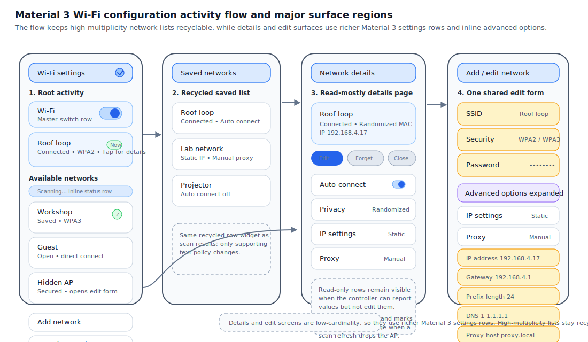

# Roo Windows Material 3 Wi-Fi Configuration Design

## Implementation status

**Proposed.** None of the defined scope is implemented. The status of existing and outstanding prerequisites is recorded in the [status index](../README.md).

## Objective

Add a Material 3 Wi-Fi configuration surface family to `roo_windows` that can
replace the legacy [`roo_windows_wifi`](../../../../roo_windows_wifi/src/roo_windows_wifi.h)
flow with a newer Android-like settings experience.

The design provides:

- a top-level Wi-Fi settings activity with a master switch, current-network
  summary, available-network scan results, and entry points for saved and
  manual networks,
- a network-details activity that shows connection status, policy toggles, and
  link information,
- an add or edit network activity with password entry, hidden-network support,
  and advanced options,
- inline manual IPv4 configuration and manual proxy configuration inside that
  edit flow,
- a small reusable widget set for Wi-Fi rows, signal glyphs, and config forms,
  built on the existing Material 3 direction from
  [../in_progress/material3_lists_design.md](../in_progress/material3_lists_design.md),
  [../implemented/material3_buttons_design.md](../implemented/material3_buttons_design.md), and
  [material3_text_fields_design.md](material3_text_fields_design.md),
- and a controller-facing state model that is richer than the current direct
  `roo_wifi::Controller` coupling.

This document defines the intended activities, widgets, and controller
contract. It does not describe an existing implementation.

## Motivation

The current Wi-Fi UI shipped in
[roo_windows_wifi](../../../../roo_windows_wifi/src/roo_windows_wifi.h) is useful as
an initial proof of concept, but it no longer matches the rest of the
repository's Material 3 direction or the feature set expected from a modern
settings surface.

Today the user can:

- toggle Wi-Fi,
- see the current network,
- tap a scanned network,
- enter a password through a legacy underlined field,
- and open a small details page with connect, disconnect, and forget actions.

That is materially short of the intended end state. It does not offer a saved
networks page, a hidden-network entry path, policy editing such as
auto-connect, privacy, metered treatment, proxy, or manual IP configuration,
and it does not use the Material 3 widgets that newer `roo_windows` designs are
already closing on.

The correct next step is not to keep accreting one-off rows onto the legacy
`HorizontalLayout` and `VerticalLayout` activities. The flow needs a new
activity and widget set that is designed as a coherent Material 3 settings
surface and that preserves the embedded RAM budget.

## Background

### Current Starting Point in `roo_windows_wifi`

As of 2026-05, the existing Wi-Fi package is centered on four files:

- [../../roo_windows_wifi/src/roo_windows_wifi/activity/list_activity.h](../../../../roo_windows_wifi/src/roo_windows_wifi/activity/list_activity.h),
  which builds the main screen from a legacy title row, a switch row, a
  progress bar, one current-network row, and a recycled scan-results list,
- [../../roo_windows_wifi/src/roo_windows_wifi/activity/network_details_activity.h](../../../../roo_windows_wifi/src/roo_windows_wifi/activity/network_details_activity.h),
  which shows a large icon, status text, and connect, disconnect, and forget
  actions,
- [../../roo_windows_wifi/src/roo_windows_wifi/activity/enter_password_activity.h](../../../../roo_windows_wifi/src/roo_windows_wifi/activity/enter_password_activity.h),
  which uses the legacy underlined `TextField` for password entry,
- and [../../roo_windows_wifi/src/roo_windows_wifi.h](../../../../roo_windows_wifi/src/roo_windows_wifi.h),
  which wires the three activities directly to `roo_wifi::Controller` through a
  small `Configurator` facade.

That code already carries two useful signals.

First, it proves that a Wi-Fi configuration flow belongs in a small dedicated
package rather than in app-local glue.

Second, it shows that scan results must stay recyclable. The current
`ListActivity` uses [`ListLayout`](../../../src/roo_windows/containers/list_layout.h)
for the available-network list instead of one live widget tree per AP. That is
still the right decision for embedded targets.

At the same time, the current package has four important limitations:

1. it uses legacy widgets rather than Material 3 list, button, switch, and
   text-field surfaces,
2. it treats password entry as a special-case activity instead of one branch of
   a general network-edit flow,
3. it has no settings model richer than `connect`, `disconnect`, `forget`, and
   stored password lookup,
4. and it has no backend or UI contract for manual IP or proxy configuration.

### Relevant `roo_windows` Building Blocks

This design is intentionally aligned with the newer `roo_windows` direction.

The most relevant nearby pieces are:

- [../in_progress/material3_lists_design.md](../in_progress/material3_lists_design.md), which defines the
  small-row settings and list-item vocabulary for Material 3 surfaces,
- [material3_text_fields_design.md](material3_text_fields_design.md), which
  defines the intended inline-editing and secure-field story,
- [../implemented/material3_buttons_design.md](../implemented/material3_buttons_design.md), which provides
  the action-button family for connect, forget, save, and cancel actions,
- [material3_layout_scaffold_design.md](material3_layout_scaffold_design.md),
  which defines the page-shell direction for header plus scrolling-body
  surfaces,
- [non_touch_input_design.md](non_touch_input_design.md), which defines the
  future keyboard and focus contracts that the Wi-Fi flow should inherit rather
  than bypass,
- and the current Material 3 list implementation in
  [../src/roo_windows/material3/list/list.h](../../../src/roo_windows/material3/list/list.h),
  which is appropriate for low-cardinality settings sections but not for large
  live scan-result sets.

### Embedded Constraints That Matter Here

The main architectural pressure in this design is row multiplicity.

A network-details page usually shows fewer than fifteen settings or info rows.
That is exactly the kind of low-cardinality surface where a richer Material 3
row widget is worth its slightly larger footprint.

A scan-result list is different. Real environments often expose twenty to forty
APs. If one rich Material 3 row surface costs roughly `140-180 B` after the
base widget, inline labels, glyph state, and packed row flags, then keeping
`28` scanned AP rows live would cost roughly `4-5 KB` before any controller
data or string storage. On a `320x240` viewport with a `72dp` two-line row, the
same list usually needs only `4-5` visible rows. Recycling therefore cuts row
object RAM from roughly `O(n)` to `O(v)`, bringing the same row cost down to
well under `1 KB`.

That quantitative difference is large enough to drive the design:

1. available networks use a recycled fixed-height row path,
2. saved networks use that same recycled row path,
3. details and form sections use richer small Material 3 settings rows because
   their row count is low,
4. and optional advanced edit controls such as static IP and manual proxy live
   only on the single edit activity rather than adding fields or callbacks to
   every row instance.

### Backend Reality

The current workspace does not show a richer Wi-Fi backend API with saved
network metadata, MAC privacy policy, or manual IP editing. The UI design
therefore needs a controller abstraction that can stage in front of the current
`roo_wifi::Controller` and advertise missing capabilities explicitly.

The important rule is:

> Unsupported configuration capabilities must be surfaced as absent or
> read-only in the UI, never as visible controls that silently no-op.

That rule keeps the staged rollout honest while still allowing the UI family to
land incrementally.

## Requirements

### Functional Requirements

1. Provide a top-level Wi-Fi settings activity with a master switch, a current
   connection summary when one exists, available scan results, an `Add network`
   entry point, and a `Saved networks` entry point when the controller supports
   stored configurations.
2. Support direct one-tap connect for open or already-saved networks, while new
   secured or hidden networks route through an edit flow.
3. Provide a network-details activity that can show and edit at least:
   auto-connect, privacy mode, metered treatment, IP settings summary, proxy
   summary, and forget or disconnect actions when supported.
4. Provide an add or edit network activity that can create a hidden network and
   edit a saved network using one shared form.
5. Support the common personal security modes in v1: open, WEP, WPA or WPA2
   personal, and WPA3 personal. Enterprise or certificate-backed flows are out
   of scope for the first version.
6. Support manual IPv4 configuration with address, prefix length, gateway,
   primary DNS, and secondary DNS.
7. Support manual proxy configuration with host, port, and bypass list, plus
   `None` as the default proxy mode.
8. Keep the details page usable when a scanned network disappears during a
   refresh; the screen should show `Out of range` rather than dismissing
   itself.
9. Keep edit drafts local to the edit activity until the user confirms `Save`
   or `Connect`.
10. Reflect asynchronous operations such as scan start, connect in progress,
    connect failure, and forget completion without rebuilding the activity
    stack.

### Interaction Requirements

1. The top-level settings activity automatically starts a scan on entry when
   Wi-Fi is enabled and the cached result set is stale, and also exposes an
   explicit refresh action.
2. The current-network summary row opens details instead of reconnecting.
3. Tapping a scanned network that is open or already configured initiates
   connect immediately; tapping a secured unknown network opens the edit form
   with the SSID and security prefilled.
4. `Advanced options` in the edit form are collapsed by default, but they open
   automatically when the loaded config is non-default or when validation fails
   inside the advanced section.
5. IP fields are editable only when `IP settings` is `Static`; proxy host,
   port, and bypass fields are editable only when `Proxy` is `Manual`.
6. Save or connect actions are disabled while the current draft is invalid or a
   conflicting controller operation is already running.
7. The flow must remain compatible with the framework-level focus and keyboard
   contracts from [non_touch_input_design.md](non_touch_input_design.md); it
   must not introduce a Wi-Fi-specific input model.
8. `Saved networks` and `Add network` remain reachable even when Wi-Fi is off;
   only live scan results and live connection rows are suppressed.

### API Requirements

1. Introduce one controller abstraction that exposes capability flags,
   read-only scan and saved-network summaries, and mutation methods for enable,
   scan, connect, save, and forget operations.
2. The high-level Wi-Fi flow must be constructible as one owner object that
   pre-allocates and reuses its activities, matching the current
   `Configurator` ownership model rather than allocating a fresh activity tree
   on each navigation step.
3. Scan and saved-network summaries exposed by the controller should use stable
   lightweight handles plus borrowed text for read-only display data, while the
   edit activity owns its mutable draft strings locally.
4. Available and saved networks must use recycled fixed-height row widgets
   rather than one `material3::ListEntry` instance per network.
5. Public widget additions should stay small and purpose-built: one signal
   glyph, one recyclable Wi-Fi row, and one config-form composite are enough.
6. If a controller adapter lands before support for manual IP, manual proxy,
   privacy, or metered policies, it must report those capabilities as false so
   the UI omits or disables the corresponding rows.

### Embedded Constraints

1. Do not allocate on paint, row rebind, or scroll paths for scan or saved
   lists.
2. Keep results-list row state compact and owner-local; do not build each row
   from nested `HorizontalLayout` and `TextLabel` trees just because the screen
   is settings-like.
3. Optional edit-only state such as password visibility, static IPv4 fields,
   and proxy fields must live only on the edit activity.
4. Reuse one choice activity and one confirmation dialog inside the flow owner
   rather than allocating a new chooser surface for every enum-setting tap.

### Non-Goals for the First Version

The first version does not attempt to support:

- enterprise EAP or certificate-backed Wi-Fi authentication,
- captive-portal browser or browser handoff,
- QR-code share or scan flows,
- manual static IPv6 configuration,
- per-BSSID roaming diagnostics,
- or wide-screen two-pane Wi-Fi settings layouts.

Those are reasonable follow-on items, but they are not required to replace the
current legacy flow with a modern embedded Material 3 one.

## Design Overview

### Scope

In scope:

- one owner object for the activity graph,
- one top-level settings activity,
- one saved-networks activity,
- one network-details activity,
- one add or edit network activity,
- one internal single-choice activity reused for setting enums,
- one confirmation dialog for destructive actions such as forget,
- and three small public widgets: a signal glyph, a recyclable network row,
  and a config form.

Out of scope:

- generic desktop-style multi-pane Wi-Fi settings,
- retrofitting the existing legacy `WifiIndicator` visuals in place,
- or turning the Wi-Fi package into a general network-stack administration UI.

### Key Decisions

1. The public integration surface is one reusable `WifiSettingsFlow` owner that
   pre-allocates activities and pushes them on the existing `Task` stack.
2. Available and saved networks use a dedicated recycled `WifiNetworkRow`
   widget on top of `ListLayout`, not the generic `material3::List` container.
3. Details and choice pages use the richer Material 3 list vocabulary because
   their row count is small and their slot composition is more varied.
4. Add network, edit network, hidden network entry, and wrong-password repair
   all route through one `WifiEditNetworkActivity` backed by one owned draft
   object.
5. Manual IP configuration is inline inside the advanced section of the edit
   activity, not a separate micro-activity.
6. Manual proxy configuration is also inline in that advanced section, with
   only `None` and `Manual` modes in v1; PAC is deferred.
7. Unsupported backend capabilities are hidden or shown read-only based on
   explicit controller capability flags.



## Design Details

### Controller-Owned State and Capability Model

The legacy `Configurator` talks directly to `roo_wifi::Controller`, which is
too narrow for the new flow. The Material 3 flow introduces a separate
controller contract that sits between the UI and the backend.

The controller owns live state snapshots, operation status, and capability
flags. The activities own no persistent Wi-Fi state beyond the edit draft and
the currently selected network handle.

The contract is intentionally snapshot-oriented and listener-driven.

```cpp
namespace roo_windows_wifi {

using WifiNetworkHandle = uint32_t;

enum class WifiSecurityType : uint8_t {
  kOpen,
  kWep,
  kWpaPersonal,
  kWpa3Personal,
  kUnknown,
};

enum class PrivacyMode : uint8_t { kRandomizedMac, kDeviceMac };
enum class MeteredMode : uint8_t { kAuto, kMetered, kUnmetered };
enum class IpAssignment : uint8_t { kDhcp, kStaticIpv4 };
enum class ProxyMode : uint8_t { kNone, kManual };

struct WifiConfigurationCapabilities {
  bool saved_networks = true;
  bool hidden_networks = true;
  bool privacy_controls = true;
  bool metered_override = true;
  bool manual_ip = true;
  bool manual_proxy = true;
};

struct WifiNetworkSummary {
  WifiNetworkHandle handle = 0;
  roo::string_view ssid;
  WifiSecurityType security = WifiSecurityType::kUnknown;
  int8_t rssi = -127;
  bool saved = false;
  bool connected = false;
  bool connecting = false;
  bool has_internet = true;
  bool hidden = false;
};

struct WifiNetworkDetails {
  WifiNetworkSummary summary;
  roo::string_view status_text;
  roo::string_view mac_address;
  roo::string_view ip_address;
  roo::string_view gateway;
  roo::string_view dns1;
  roo::string_view dns2;
  roo::string_view frequency;
  roo::string_view link_speed;
  bool auto_connect = true;
  PrivacyMode privacy = PrivacyMode::kRandomizedMac;
  MeteredMode metered = MeteredMode::kAuto;
  IpAssignment ip_assignment = IpAssignment::kDhcp;
  ProxyMode proxy_mode = ProxyMode::kNone;
  bool can_connect = true;
  bool can_disconnect = false;
  bool can_forget = false;
  bool can_edit = false;
};

struct StaticIpv4Config {
  std::string address;
  uint8_t prefix_length = 24;
  std::string gateway;
  std::string dns1;
  std::string dns2;
};

struct ManualProxyConfig {
  std::string host;
  uint16_t port = 0;
  std::string bypass_hosts;
};

struct WifiEditableConfig {
  std::string ssid;
  WifiSecurityType security = WifiSecurityType::kOpen;
  std::string password;
  bool hidden = false;
  bool auto_connect = true;
  PrivacyMode privacy = PrivacyMode::kRandomizedMac;
  MeteredMode metered = MeteredMode::kAuto;
  IpAssignment ip_assignment = IpAssignment::kDhcp;
  StaticIpv4Config static_ipv4;
  ProxyMode proxy_mode = ProxyMode::kNone;
  ManualProxyConfig manual_proxy;
};

class WifiConfigurationController {
 public:
  class Listener {
   public:
    virtual ~Listener() = default;
    virtual void onWifiStateChanged() = 0;
    virtual void onScanResultsChanged() = 0;
    virtual void onSavedNetworksChanged() = 0;
    virtual void onOperationStateChanged() = 0;
  };

  virtual ~WifiConfigurationController() = default;

  virtual void addListener(Listener* listener) = 0;
  virtual void removeListener(Listener* listener) = 0;

  virtual WifiConfigurationCapabilities capabilities() const = 0;
  virtual bool wifiEnabled() const = 0;
  virtual bool scanning() const = 0;
  virtual int scanResultCount() const = 0;
  virtual WifiNetworkSummary scanResultAt(int idx) const = 0;
  virtual int savedNetworkCount() const = 0;
  virtual WifiNetworkSummary savedNetworkAt(int idx) const = 0;
  virtual bool detailsFor(WifiNetworkHandle handle,
                          WifiNetworkDetails& out) const = 0;
  virtual bool loadEditableConfig(WifiNetworkHandle handle,
                                  WifiEditableConfig& out) const = 0;
  virtual void setWifiEnabled(bool enabled) = 0;
  virtual void startScan() = 0;
  virtual void connect(WifiNetworkHandle handle) = 0;
  virtual void saveAndConnect(const WifiEditableConfig& config) = 0;
  virtual void saveOnly(WifiEditableConfig&& config) = 0;
  virtual void forget(WifiNetworkHandle handle) = 0;
};

}  // namespace roo_windows_wifi
```

Three details matter here.

First, the handle is opaque. The UI does not assume that SSID alone is a stable
identifier because duplicate SSIDs, hidden networks, or backend-owned config
IDs can all exist.

Second, read-only summaries use borrowed string views so the controller can
keep ownership and the UI can avoid copying text on every scan refresh.

Third, the edit activity owns a mutable `WifiEditableConfig` because partial
text-field edits are UI-local state until the user commits them.

#### Adapter Behavior for the Existing Backend

The current `roo_wifi::Controller` can still be used through a new adapter such
as `RooWifiControllerAdapter`.

That adapter reports:

- `manual_ip = false`,
- `manual_proxy = false`,
- `privacy_controls = false`,
- and `metered_override = false`

until the underlying backend actually supports those features.

The result is an honest staged rollout:

- the new Material 3 flow can still ship early for scan, connect, password,
  and forget behavior,
- but unsupported advanced rows stay hidden or disabled,
- and the UI never presents editable controls that silently discard the
  user's changes.

### Reusable Widget Set

The public widget set stays intentionally small.

```cpp
namespace roo_windows_wifi {

class WifiSignalGlyph : public roo_windows::BasicWidget {
 public:
  explicit WifiSignalGlyph(roo_windows::ApplicationContext& context);

  void setSummary(const WifiNetworkSummary& summary);
};

class WifiNetworkRow : public roo_windows::BasicSurfaceWidget {
 public:
  explicit WifiNetworkRow(roo_windows::ApplicationContext& context);

  void setSummary(const WifiNetworkSummary& summary);
  void setSelected(bool selected);
  void setShowChevron(bool show_chevron);
};

class WifiConfigForm : public roo_windows::VerticalLayout {
 public:
  explicit WifiConfigForm(const roo_windows::Environment& env);

  void load(const WifiEditableConfig& config,
            const WifiConfigurationCapabilities& caps);
  bool isValid() const;
  void saveTo(WifiEditableConfig& dest) const;
};

}  // namespace roo_windows_wifi
```

#### `WifiSignalGlyph`

`WifiSignalGlyph` is a new widget rather than a direct restyle of the legacy
[`WifiIndicator`](../../../src/roo_windows/indicators/wifi.h).

That separation is deliberate. The legacy indicator already serves non-Material
3 surfaces. The new flow needs a Material 3 glyph that can encode:

- signal strength,
- saved or locked status,
- connected versus connecting versus disconnected state,
- and no-internet or warning badges.

Keeping the new glyph separate avoids a visual regression in older code and
keeps the new semantics local to the Material 3 flow.

#### `WifiNetworkRow`

`WifiNetworkRow` is the key RAM-sensitive widget in the design.

It is one fixed-structure surface-owning row widget, not a `HorizontalLayout`
of child labels and icons. The row owns exactly the content it needs:

- one leading `WifiSignalGlyph`,
- one headline text path for SSID,
- one supporting text path for status and security,
- and one compact trailing-state presentation for chevron, spinner, or
  connected check.

The row uses a fixed two-line `72dp` height and a one-line fallback `56dp`
height when the supporting line is empty. That keeps measurement cheap and
compatible with `ListLayout` recycling.

The row does not store per-instance callbacks. Activation still routes through
the enclosing activity or list container.

#### `WifiConfigForm`

The edit activity has only one live instance, so the form can afford richer
composition than the scan list.

`WifiConfigForm` therefore uses the generic Material 3 components from the
adjacent designs:

- text fields for SSID, password, IP, gateway, DNS, proxy host, proxy port,
  and proxy bypass list,
- switch rows for hidden network and auto-connect,
- list rows that open a small single-choice activity for security, privacy,
  metered mode, IP settings, and proxy mode,
- and inline action buttons at the bottom of the activity.

The form stores only the edit draft and validation state. It does not talk to
the controller directly.

### Activity Set and Navigation

The flow owner is a new `WifiSettingsFlow` facade that plays the same role the
legacy `Configurator` plays today, but with a richer activity graph.

```cpp
namespace roo_windows_wifi {

class WifiSettingsFlow {
 public:
  WifiSettingsFlow(const roo_windows::Environment& env,
                   WifiConfigurationController& controller);

  roo_windows::Activity& main();
  WifiSettingsActivity& settingsActivity();
  WifiNetworkDetailsActivity& detailsActivity();
  WifiEditNetworkActivity& editActivity();
  WifiSavedNetworksActivity& savedNetworksActivity();
};

}  // namespace roo_windows_wifi
```

The flow allocates its activities once and reuses them for the life of the
owner. That keeps navigation predictable and avoids heap churn each time the
user opens details or edits a network.

The activity graph is:

1. `WifiSettingsActivity` as the root,
2. `WifiSavedNetworksActivity` for stored networks,
3. `WifiNetworkDetailsActivity` for a selected network,
4. `WifiEditNetworkActivity` for add, edit, hidden-network, and password-repair
   flows,
5. one internal `WifiChoiceActivity` reused for small enum choices,
6. and one internal confirmation dialog for destructive actions such as
   `Forget`.

The public API exposes only the first four activities plus the flow owner.
`WifiChoiceActivity` and the confirmation dialog remain implementation details.

### `WifiSettingsActivity`

The top-level settings activity is a scrolling page with five sections.

1. Header: title plus a refresh action.
2. Wi-Fi switch row: a Material 3 list row with a trailing switch.
3. Current network section: shown only when connected or connecting.
4. Available networks section: recycled `WifiNetworkRow` list plus a scanning
   status row when a scan is running.
5. Footer actions: `Add network` and `Saved networks` rows.

The key interaction decisions are:

- entering the page triggers a scan if Wi-Fi is enabled and cached results are
  stale,
- the current-network row opens details rather than reconnecting,
- available rows connect immediately only when the target is open or already
  saved,
- unknown secured rows open `WifiEditNetworkActivity` with SSID and security
  prefilled,
- and `Add network` opens the same edit activity in manual-entry mode with an
  empty draft.

When Wi-Fi is off, the activity suppresses the current and available network
sections but leaves `Add network` and `Saved networks` visible.

That choice is intentional. Editing saved configurations and preparing a hidden
network entry are valid tasks even when the radio is off.

### `WifiSavedNetworksActivity`

Saved networks use the same recycled `WifiNetworkRow` widget and list plumbing
as live scan results. The rows differ only in their supporting text policy.

The supporting line resolves in this order:

1. `Connected` when the saved config is the current network,
2. the most useful policy summary such as `Auto-connect off`, `Static IP`, or
   `Manual proxy`,
3. otherwise the security label.

Selecting a saved network always opens details rather than connecting
immediately. The user is intentionally one step away from destructive actions
such as forget, and one step away from advanced edits such as static IP.

### `WifiNetworkDetailsActivity`

The details page is the read-mostly screen for one selected network handle.

It is composed from:

- a summary header with `WifiSignalGlyph`, SSID, and connection-state text,
- a compact action row with `Connect` or `Disconnect`, `Edit`, and `Forget`
  buttons as supported,
- one settings section with editable rows,
- and one information section with read-only rows.

The settings section uses low-cardinality Material 3 rows for:

- auto-connect,
- privacy,
- metered treatment,
- IP settings summary,
- and proxy summary.

The information section shows read-only text rows for:

- security,
- MAC address,
- IP address,
- gateway,
- DNS,
- frequency,
- link speed,
- and the resolved status text.

Rows are shown according to two rules.

1. If the controller can report a value, the details page shows it.
2. If the controller also advertises the matching capability as editable, the
   row is interactive and routes to the edit activity or the choice activity;
   otherwise it is read-only.

This lets the same page work with both a fully capable backend and the staged
adapter that only supports the legacy feature set.

If the scanned network disappears during a refresh, the page keeps the last
known summary and changes the status line to `Out of range`. It does not pop
itself from the stack.

### `WifiEditNetworkActivity`

`WifiEditNetworkActivity` is the one mutable form surface in the flow.

It serves four entry paths:

1. `Add network`,
2. `Join hidden network`,
3. `Edit network`,
4. and `Repair credentials` after a failed connect.

The form uses one owned `WifiEditableConfig` draft. It never applies partial
changes to the controller.

The visible structure is:

- SSID field,
- security row,
- password field when the chosen security requires one,
- hidden-network switch,
- auto-connect switch,
- `Advanced options` expander,
- advanced choice rows,
- conditional static IPv4 fields when `IP settings = Static`,
- conditional manual proxy fields when `Proxy = Manual`,
- and bottom action buttons.

The edit activity uses inline advanced controls instead of a second IP-only
activity for two reasons.

First, Android-like Wi-Fi forms already treat IP and proxy as advanced fields
of the same network draft.

Second, a separate IP activity would force the UI to copy partial draft state
between activities and would add navigation cost on small displays without
reducing memory in any meaningful way, because there is only one live edit form
at a time.

#### Advanced Defaults and Validation

The draft resolves these defaults when the controller does not provide a saved
value:

- `auto_connect = true`,
- `privacy = Randomized MAC`,
- `metered = Auto`,
- `ip_assignment = DHCP`,
- `proxy_mode = None`.

Validation is local to the form.

The rules are:

1. SSID is required for add and hidden-network flows.
2. Password is required for non-open modes, except that a preloaded saved
   network may keep an empty password field to mean `unchanged`.
3. Static IPv4 mode requires a syntactically valid IPv4 address, gateway,
   prefix length in the closed range `[0, 32]`, and at least one DNS server.
4. Manual proxy mode requires a non-empty host and a non-zero port.

The form uses ordinary text fields plus validation on edit finish and save.
It does not introduce a special dotted-quad keypad widget in v1.

That is the correct scope cut. The text-field family already owns text entry;
the Wi-Fi form only needs domain validation.

### Choice Activities and Enum Editing

Security, privacy, metered treatment, IP settings, and proxy mode all use the
same internal `WifiChoiceActivity`.

That activity is a small single-select list with a title, one Material 3 list
section, and trailing radio affordances. It writes the chosen enum back into
the edit activity's draft or, for lightweight details-page policy changes such
as auto-connect or metered mode, directly into the controller after user
confirmation.

The design intentionally does not use popup menus for these choices. On
embedded displays, a full-activity choice list is easier to read, easier to
scroll, and more consistent with the rest of the settings flow.

### Paint, Layout, and Update Strategy

The Wi-Fi flow deliberately uses two different UI construction styles.

`WifiNetworkRow` is owner-painted and recycled because list multiplicity makes
RAM the primary constraint.

The details and edit activities use richer composition because they are
low-cardinality surfaces and clearer code is worth the slightly larger widget
tree.

The update strategy follows the controller event split.

1. `onWifiStateChanged()` updates the switch row, current-network section, and
   any details page currently bound to the current handle.
2. `onScanResultsChanged()` invalidates only the recycled scan-result or
   saved-network list model.
3. `onSavedNetworksChanged()` refreshes the saved-networks page and any visible
   details action buttons.
4. `onOperationStateChanged()` updates busy indicators, button enabled state,
   and any inline error or status message.

The edit activity ignores scan-result churn while a draft is open. A scan
refresh must not wipe what the user is typing.

## Proposed API

The intended public package surface is:

```cpp
namespace roo_windows_wifi {

class WifiConfigurationController;
class WifiSettingsFlow;

class WifiSettingsActivity : public roo_windows::Activity;
class WifiSavedNetworksActivity : public roo_windows::Activity;
class WifiNetworkDetailsActivity : public roo_windows::Activity;
class WifiEditNetworkActivity : public roo_windows::Activity;

class WifiSignalGlyph : public roo_windows::BasicWidget;
class WifiNetworkRow : public roo_windows::BasicSurfaceWidget;
class WifiConfigForm : public roo_windows::VerticalLayout;

class RooWifiControllerAdapter : public WifiConfigurationController;

}  // namespace roo_windows_wifi
```

The staged behavior is explicit.

If `RooWifiControllerAdapter` lands before the full advanced backend support,
the flow still works for:

- Wi-Fi enable or disable,
- scan,
- connect,
- disconnect,
- forget,
- and password entry.

Advanced rows are then either omitted or presented read-only, according to the
reported capabilities. The UI does not fake successful static IP or proxy
editing against a backend that cannot store those fields.

## Implementation Plan

Authoring reference:
[../.github/instructions/roo-windows-widget-authoring.instructions.md](../../../.github/instructions/roo-windows-widget-authoring.instructions.md)

Prerequisite: the baseline Material 3 text-field and button work from
[material3_text_fields_design.md](material3_text_fields_design.md) and
[../implemented/material3_buttons_design.md](../implemented/material3_buttons_design.md) is available for
the edit and action surfaces.

### Phase 1: Add the Controller Contract and Signal Glyph

Code slice:

1. Add the controller-facing data structs, capability flags, and listener
   contract.
2. Add `RooWifiControllerAdapter` that wraps the current `roo_wifi::Controller`
   and advertises only the feature subset it truly supports.
3. Add `WifiSignalGlyph` with behavior coverage for signal level, locked
   state, connecting state, and no-internet warning state.

Proposed commit message:

> Material 3 Wi-Fi Phase 1: add the controller contract and signal glyph.
>
> Introduce the adapter-facing Wi-Fi configuration model, capability reporting,
> and the shared Material 3 signal glyph that both list rows and details
> headers reuse.

Validation: run `bazel test //:material3_wifi_signal_glyph_test` and
`bazel test //:roo_windows_test`.

### Phase 2: Add the Recycled Network Row and Settings Root Activity

Code slice:

1. Add `WifiNetworkRow` and the recycled list-model plumbing for available and
   saved networks.
2. Add `WifiSettingsActivity` with the Wi-Fi switch row, current-network row,
   available scan results, refresh action, and footer action rows.
3. Add behavior coverage for direct connect routing, secured-network edit
   routing, and scan-result rebinding.

Proposed commit message:

> Material 3 Wi-Fi Phase 2: add the root settings activity and recycled rows.
>
> Introduce the RAM-aware network row, wire it into the top-level Wi-Fi page,
> and verify that connect and edit routing follow the selected network state.

Validation: run `bazel test //:material3_wifi_network_row_test` and
`bazel test //:material3_wifi_settings_test`.

### Phase 3: Add Saved Networks and Network Details

Code slice:

1. Add `WifiSavedNetworksActivity` on the same recycled row base.
2. Add `WifiNetworkDetailsActivity` with summary header, action buttons, policy
   rows, and read-only info rows.
3. Add capability-gated read-only versus editable row behavior and out-of-range
   persistence.

Proposed commit message:

> Material 3 Wi-Fi Phase 3: add details and saved-network activities.
>
> Build the read-mostly details screen, saved-network browser, and the
> capability-aware row model that keeps advanced settings honest during staged
> backend rollout.

Validation: run `bazel test //:material3_wifi_details_test` and
`bazel test //:material3_wifi_saved_networks_test`.

### Phase 4: Add the Edit Form, Advanced Options, and Manual IPv4 Support

Code slice:

1. Add `WifiConfigForm` and `WifiEditNetworkActivity`.
2. Add the reusable `WifiChoiceActivity` for security, privacy, metered,
   IP-settings, and proxy-mode selection.
3. Add local validation for SSID, password, static IPv4 fields, and manual
   proxy fields.
4. Add `Save` and `Connect` actions plus controller mutation wiring.

Proposed commit message:

> Material 3 Wi-Fi Phase 4: add the edit flow and manual IPv4 configuration.
>
> Introduce the shared add or edit form, inline advanced options, enum-choice
> activity reuse, and the validation needed for static IPv4 and manual proxy
> drafts.

Validation: run `bazel test //:material3_wifi_edit_form_test` and
`bazel test //:material3_wifi_ip_validation_test`.

### Phase 5: Add Flow Integration, Examples, and Goldens

Code slice:

1. Add `WifiSettingsFlow` as the public owner that pre-allocates and wires the
   activity graph.
2. Add a Material 3 Wi-Fi example surface and migrate the existing simple Wi-Fi
   example to the new flow through `RooWifiControllerAdapter`.
3. Add goldens for the root page, a connected-details page, and the edit form
   with advanced static IP fields expanded.

Proposed commit message:

> Material 3 Wi-Fi Phase 5: add the integrated flow, example, and goldens.
>
> Package the activity graph behind one reusable owner, demonstrate the new
> flow under emulation, and lock the major page states with dedicated golden
> coverage.

Validation: run `bazel test //:material3_wifi_golden_test` and
`bazel test //:material3_wifi_flow_test`.

## Testing Plan

### Unit and Behavior Tests

Add focused tests for:

- `WifiSignalGlyph` state mapping,
- `WifiNetworkRow` supporting-text resolution and row-height selection,
- direct connect versus edit routing from the settings page,
- details-page row enablement based on capability flags,
- local form validation for password, static IPv4, and proxy fields,
- and preservation of the edit draft during scan-result churn.

### Golden and Rendering Tests

Add goldens for:

- open, locked, connected, connecting, and no-internet network rows,
- the root settings page with Wi-Fi on and Wi-Fi off,
- the details page for a connected network,
- and the edit form with advanced static IP fields expanded.

### Integration Coverage

Add one emulation smoke surface that exercises the flow end to end through the
controller adapter and verifies that settings, details, save, connect, and
forget navigation all remain functional.

## Caveats

### Rejected Alternatives

#### Build the Entire Flow from `material3::List`

This was rejected because scan and saved-network surfaces are high-multiplicity
lists. Keeping one live rich row widget per AP is the wrong RAM tradeoff on an
embedded target. The design instead uses `material3::List` only where the row
count is small and the richer slot vocabulary is worth the cost.

#### Keep Extending the Legacy Three-Activity `roo_windows_wifi` Flow

This was rejected because the current split between scan list, password prompt,
and tiny details page hard-codes the wrong abstractions. Password entry is only
one branch of a full network-edit flow, and advanced settings cannot be added
cleanly while the UI talks directly to `roo_wifi::Controller` with no richer
state model.

#### Put Manual IP and Proxy Editing on Separate Leaf Activities

This was rejected because it would multiply navigation steps and force the UI
to shuttle partial drafts between activities without producing a meaningful RAM
win. One edit activity with an expandable advanced section is both closer to
Android's Wi-Fi configuration pattern and simpler to validate.

#### Retheme the Existing Legacy `WifiIndicator` In Place

This was rejected because the legacy indicator already serves older,
non-Material-3 code paths. Replacing its visuals or semantics in place would
create a migration hazard for unrelated surfaces. A new `WifiSignalGlyph` keeps
the Material 3 contract isolated.

## Future Work

- Add enterprise EAP and certificate-backed credential flows on top of the same
  edit-activity draft model.
- Add read-only IPv6 diagnostics first, then evaluate whether static IPv6
  editing is worth the extra field and validation cost.
- Add QR-code share, captive-portal handoff, and wide-screen two-pane layouts
  once the core single-pane flow is stable.