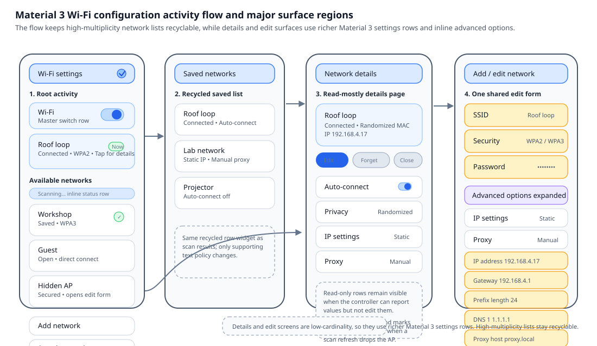

# Roo Windows Material 3 Wi-Fi Configuration Design

## Implementation status

**Proposed.** None of the defined scope is implemented. The status of existing and outstanding prerequisites is recorded in the [status index](../README.md).

## Objective

Add a Material 3 Wi-Fi configuration surface family in `roo_windows_wifi`,
using `roo_windows` components and an extended `roo_wifi` controller, that can
replace the legacy [`roo_windows_wifi`](../../../../roo_windows_wifi/src/roo_windows_wifi.h)
flow with a newer Android-like settings experience.

The design provides:

- a top-level Wi-Fi settings activity with a master switch, current-network
  summary, available-network scan results, and entry points for saved and
  manual networks,
- a network-details activity that shows connection status, policy toggles, and
  link information,
- an add or edit network activity with password entry, hidden-network support,
  and advanced options,
- inline manual IPv4 configuration and manual proxy configuration inside that
  edit flow,
- a small reusable widget set for Wi-Fi rows, signal glyphs, and config forms,
  built on the existing Material 3 direction from
  [../implemented/material3_lists_design.md](../implemented/material3_lists_design.md),
  [../implemented/material3_buttons_design.md](../implemented/material3_buttons_design.md), and
  [material3_text_fields_design.md](../implemented/material3_text_fields_design.md),
- and a richer configuration model implemented in `roo_wifi::Controller`.

This document defines the intended activities, widgets, and controller
contract. It does not describe an existing implementation.

## Motivation

The current Wi-Fi UI shipped in
[roo_windows_wifi](../../../../roo_windows_wifi/src/roo_windows_wifi.h) is useful as
an initial proof of concept, but it no longer matches the rest of the
repository's Material 3 direction or the feature set expected from a modern
settings surface.

Today the user can:

- toggle Wi-Fi,
- see the current network,
- tap a scanned network,
- enter a password through a legacy underlined field,
- and open a small details page with connect, disconnect, and forget actions.

That is materially short of the intended end state. It does not offer a saved
networks page, a hidden-network entry path, policy editing such as
auto-connect, privacy, metered treatment, proxy, or manual IP configuration,
and it does not use the Material 3 widgets that newer `roo_windows` designs are
already provides.

The correct next step is not to keep accreting one-off rows onto the legacy
`HorizontalLayout` and `VerticalLayout` activities. The flow needs a new
activity and widget set that is designed as a coherent Material 3 settings
surface and that preserves the embedded RAM budget.

## Background

### Current Starting Point in `roo_windows_wifi`

As of 2026-09-19, the existing Wi-Fi package is centered on four files:

- [../../roo_windows_wifi/src/roo_windows_wifi/activity/list_activity.h](../../../../roo_windows_wifi/src/roo_windows_wifi/activity/list_activity.h),
  which builds the main screen from a legacy title row, a switch row, a
  progress bar, one current-network row, and a recycled scan-results list,
- [../../roo_windows_wifi/src/roo_windows_wifi/activity/network_details_activity.h](../../../../roo_windows_wifi/src/roo_windows_wifi/activity/network_details_activity.h),
  which shows a large icon, status text, and connect, disconnect, and forget
  actions,
- [../../roo_windows_wifi/src/roo_windows_wifi/activity/enter_password_activity.h](../../../../roo_windows_wifi/src/roo_windows_wifi/activity/enter_password_activity.h),
  which uses the legacy underlined `TextField` for password entry,
- and [../../roo_windows_wifi/src/roo_windows_wifi.h](../../../../roo_windows_wifi/src/roo_windows_wifi.h),
  which wires the three activities directly to `roo_wifi::Controller` through a
  small `Configurator` facade.

That code already carries two useful signals.

First, it proves that a Wi-Fi configuration flow belongs in a small dedicated
package rather than in app-local glue.

Second, it shows that scan results must stay recyclable. The current
`ListActivity` uses [`ListLayout`](../../../src/roo_windows/containers/list_layout.h)
for the available-network list instead of one live widget tree per AP. That is
still the right decision for embedded targets.

At the same time, the current package has four important limitations:

1. it uses legacy widgets rather than Material 3 list, button, switch, and
   text-field surfaces,
2. it treats password entry as a special-case activity instead of one branch of
   a general network-edit flow,
3. it has no settings model richer than `connect`, `disconnect`, `forget`, and
   stored password lookup,
4. and it has no backend or UI contract for manual IP or proxy configuration.

### Relevant `roo_windows` Building Blocks

This design is intentionally aligned with the newer `roo_windows` direction.

The most relevant nearby pieces are:

- [../implemented/material3_lists_design.md](../implemented/material3_lists_design.md), which defines the
  small-row settings and list-item vocabulary for Material 3 surfaces,
- [material3_text_fields_design.md](../implemented/material3_text_fields_design.md), which
  defines the intended inline-editing and secure-field story,
- [../implemented/material3_buttons_design.md](../implemented/material3_buttons_design.md), which provides
  the action-button family for connect, forget, save, and cancel actions,
- [material3_layout_scaffold_design.md](../implemented/material3_layout_scaffold_design.md),
  which defines the page-shell direction for header plus scrolling-body
  surfaces,
- [non_touch_input_design.md](../implemented/non_touch_input_design.md), which defines the
  implemented keyboard and focus contracts that the Wi-Fi flow should inherit rather
  than bypass,
- and the current Material 3 list implementation in
  [../src/roo_windows/material3/list/list.h](../../../src/roo_windows/material3/list/list.h),
  which is appropriate for low-cardinality settings sections but not for large
  live scan-result sets.

### Embedded Constraints That Matter Here

The main architectural pressure in this design is row multiplicity.

A network-details page usually shows fewer than fifteen settings or info rows.
That is exactly the kind of low-cardinality surface where a richer Material 3
row widget is worth its slightly larger footprint.

A scan-result list is different. Real environments often expose twenty to forty
APs. If one rich Material 3 row surface costs roughly `140-180 B` after the
base widget, inline labels, glyph state, and packed row flags, then keeping
`28` scanned AP rows live would cost roughly `4-5 KB` before any controller
data or string storage. On a `320x240` viewport with a `72dp` two-line row, the
same list usually needs only `4-5` visible rows. Recycling therefore cuts row
object RAM from roughly `O(n)` to `O(v)`, bringing the same row cost down to
about `1 KB` for the row objects alone. These are planning estimates,
not measurements of current class sizes; retained list capacity, its prototype,
text storage, controller snapshots, and the flow owner add to the total.

That quantitative difference is large enough to drive the design:

1. available networks use a recycled fixed-height row path,
2. saved networks use that same recycled row path,
3. details and form sections use richer small Material 3 settings rows because
   their row count is low,
4. and optional advanced edit controls such as static IP and manual proxy live
   only on the single edit activity rather than adding fields or callbacks to
   every row instance.

### Current Framework API

The checked-out source is the API baseline for this proposal. The legacy Wi-Fi
class names still end in `Activity`, but their framework base is now
[`Destination`](../../../src/roo_windows/core/destination.h). There is no
`roo_windows::Activity` base in the current tree.

- Construct widgets with `ApplicationContext&`, normally `app.context()`.
  `Environment` remains application/scheduler setup, not a widget constructor
  argument.
- Each [`Task`](../../../src/roo_windows/core/task.h) owns its
  [`NavigationHost`](../../../src/roo_windows/core/navigation_host.h).
  Navigate with `task.navigation().push(destination)` and route Back through
  `task.requestBack()`. Hosts borrow destinations and their contents.
- Use the implemented `material3::LayoutScaffold` and `material3::AppBar` for
  page chrome, `material3::List` and `SwitchListItem` for short settings
  sections, and `ListModel` / `ListLayout` for recycled network lists.
- Use `material3::TextField` and `material3::SecureTextField` for editable
  values, including the existing secure reveal affordance. Labels, supporting
  text, and error text are borrowed; their storage must outlive field use.
  Editing uses task-local focus/editor state and application-scoped semantic
  input, including the existing software keyboard.
- Use `material3::AlertDialog::show(Task&)` for forget confirmation, handling
  its admission result and presenter lifecycle. Do not introduce a second
  modal host or rely on the proposed task-bounded coverage extension.
- Use `ApplicationContext::animations()` for visual animation and existing
  semantic scheduling for scan refresh and operation timeouts.

### Backend Reality and Package Boundary

The local [`roo_wifi::Controller`](../../../../roo_wifi/src/roo_wifi/controller.h)
(version 1.1.6) already serializes native events onto its scheduler and rejects
stale connection events. It exposes enablement, scans, connection status,
SSID/password operations, disconnect, and forget. Its public `Network` loses
most of the security information already available in
[`NetworkDetails`](../../../../roo_wifi/src/roo_wifi/hal/interface.h). The
[`Store`](../../../../roo_wifi/src/roo_wifi/hal/store.h) persists enabled state,
a default SSID, and passwords, but cannot enumerate rich saved profiles.

Extend `roo_wifi::Controller`, `Store`, and `Interface` as required. Network
identity, saved profiles, validation, operation results, and effective link
configuration belong in `roo_wifi`; labels, form text, and navigation belong in
`roo_windows_wifi`. The UI consumes that controller directly. A separate
UI-owned configuration controller and legacy adapter would duplicate the
model and leave the underlying library too narrow.

A new `roo_wifi` release is an explicit prerequisite for releasing this flow.
During development, use local dependency overrides and runnable examples in
`roo_windows_wifi`. Capabilities describe actual platform/application support;
they are not a substitute for implementing the planned backend features.
Unsupported operations return an explicit error, and their controls are absent
or read-only. No configuration operation may silently succeed without effect.

## Requirements

### Functional Requirements

1. Provide a top-level Wi-Fi settings activity with a master switch, a current
   connection summary when one exists, available scan results, an `Add network`
   entry point, and a `Saved networks` entry point when the controller supports
   stored configurations.
2. Support direct one-tap connect for open or already-saved networks, while new
   secured or hidden networks route through an edit flow.
3. Provide a network-details activity that can show and edit at least:
   auto-connect, privacy mode, metered treatment, IP settings summary, proxy
   summary, and forget or disconnect actions when supported.
4. Provide an add or edit network activity that can create a hidden network and
   edit a saved network using one shared form.
5. Support the common personal security modes in v1: open, WEP, WPA or WPA2
   personal, and WPA3 personal. Enterprise or certificate-backed flows are out
   of scope for the first version.
6. Support manual IPv4 configuration with address, prefix length, gateway,
   primary DNS, and secondary DNS.
7. Support manual proxy configuration with host, port, and bypass list, plus
   `None` as the default proxy mode.
8. Keep the details page usable when a scanned network disappears during a
   refresh; the screen should show `Out of range` rather than dismissing
   itself.
9. Keep edit drafts local to the edit activity until the user confirms `Save`
   or `Connect`.
10. Reflect asynchronous operations such as scan start, connect in progress,
    connect failure, and forget completion without rebuilding the activity
    stack.

### Interaction Requirements

1. The top-level settings activity automatically starts a scan on entry when
   Wi-Fi is enabled and the cached result set is stale, and also exposes an
   explicit refresh action.
2. The current-network summary row opens details instead of reconnecting.
3. Tapping a scanned network that is open or already configured initiates
   connect immediately; tapping a secured unknown network opens the edit form
   with the SSID and security prefilled.
4. `Advanced options` in the edit form are collapsed by default, but they open
   automatically when the loaded config is non-default or when validation fails
   inside the advanced section.
5. IP fields are editable only when `IP settings` is `Static`; proxy host,
   port, and bypass fields are editable only when `Proxy` is `Manual`.
6. Save or connect actions are disabled while the current draft is invalid or a
   conflicting controller operation is already running.
7. The flow must remain compatible with the framework-level focus and keyboard
   contracts from [non_touch_input_design.md](../implemented/non_touch_input_design.md); it
   must not introduce a Wi-Fi-specific input model.
8. `Saved networks` and `Add network` remain reachable even when Wi-Fi is off;
   only live scan results and live connection rows are suppressed.

### API Requirements

1. Extend `roo_wifi::Controller` to expose capability flags,
   read-only scan and saved-network summaries, and mutation methods for enable,
   scan, connect, save, and forget operations.
2. The high-level Wi-Fi flow must be constructible as one owner object that
   pre-allocates and reuses its activities, matching the current
   `Configurator` ownership model rather than allocating a fresh activity tree
   on each navigation step.
3. Scan and saved-network summaries exposed by the controller should use stable
   lightweight handles plus borrowed text for read-only display data, while the
   edit activity owns its mutable draft strings locally.
4. Available and saved networks must use recycled fixed-height row widgets
   rather than one `material3::ListEntry` instance per network.
5. Public widget additions should stay small and purpose-built: one signal
   glyph, one recyclable Wi-Fi row, and one config-form composite are enough.
6. Extend the persistence and platform contracts with the controller, release
   the required `roo_wifi` version, and update package dependency metadata.
   Capability flags must reflect effective support on the selected platform.

### Embedded Constraints

1. Add no Wi-Fi-owned allocations on paint, row rebind, or steady-state
   scrolling. `ListLayout` may grow its retained row pool during layout;
   measure that separately from steady-state scrolling. Existing upstream
   text glyph-stream allocations are a documented baseline, not a claim that
   all framework text painting is allocation-free.
2. Keep results-list row state compact and owner-local; do not build each row
   from nested `HorizontalLayout` and `TextLabel` trees just because the screen
   is settings-like.
3. Optional edit-only state such as password visibility, static IPv4 fields,
   and proxy fields must live only on the edit activity.
4. Reuse one choice activity and one confirmation dialog inside the flow owner
   rather than allocating a new chooser surface for every enum-setting tap.

### Non-Goals for the First Version

The first version does not attempt to support:

- enterprise EAP or certificate-backed Wi-Fi authentication,
- captive-portal browser or browser handoff,
- QR-code share or scan flows,
- manual static IPv6 configuration,
- per-BSSID roaming diagnostics,
- or wide-screen two-pane Wi-Fi settings layouts.

Those are reasonable follow-on items, but they are not required to replace the
current legacy flow with a modern embedded Material 3 one.

## Design Overview

### Scope

In scope:

- one owner object for the activity graph,
- one top-level settings activity,
- one saved-networks activity,
- one network-details activity,
- one add or edit network activity,
- one internal single-choice activity reused for setting enums,
- one confirmation dialog for destructive actions such as forget,
- and three small public widgets: a signal glyph, a recyclable network row,
  and a config form.

Out of scope:

- generic desktop-style multi-pane Wi-Fi settings,
- retrofitting the existing legacy `WifiIndicator` visuals in place,
- or turning the Wi-Fi package into a general network-stack administration UI.

### Key Decisions

1. The public integration surface is one reusable `WifiSettingsFlow` owner that
   pre-allocates activities and pushes borrowed destinations through `Task::navigation()`.
2. Available and saved networks use a dedicated recycled `WifiNetworkRow`
   widget on top of `ListLayout`, not the generic `material3::List` container.
3. Details and choice pages use the richer Material 3 list vocabulary because
   their row count is small and their slot composition is more varied.
4. Add network, edit network, hidden network entry, and wrong-password repair
   all route through one `WifiEditNetworkActivity` backed by one owned draft
   object.
5. Manual IP configuration is inline inside the advanced section of the edit
   activity, not a separate micro-activity.
6. Manual proxy configuration is also inline in that advanced section, with
   only `None` and `Manual` modes in v1; PAC is deferred.
7. Unsupported backend capabilities are hidden or shown read-only based on
   explicit controller capability flags.



## Design Details

### Controller-Owned State and Capability Model

Extend the existing `roo_wifi::Controller`; keep its scheduler dispatch and
listener lifetime contract. The following types and additions are **proposed**,
not APIs available in 1.1.6. Evolve the existing `Controller::Network` and
`Controller::Listener` in place; retain existing convenience methods where their
semantics remain valid. Do not redefine the HAL's `NetworkDetails` type.

The controller owns scan snapshots, saved profiles, effective link state, and
operation results. The flow owns its selected identity and one mutable form.
Use the existing `AuthMode` values, including WPA/WPA2 and WPA2/WPA3 transition
modes; do not collapse secured networks into an `open` boolean. Unknown and
enterprise networks remain displayable but cannot be joined by the v1 form.

| Proposed `roo_wifi` type | Contract |
| --- | --- |
| `NetworkHandle` | Opaque controller-lifetime identity, zero invalid; never a list index. Preserve identity through scan reorder; do not reuse an expired handle for another network. Saved profile identity persists across restart. |
| `ConfigurationCapabilities` | Defaults false; reports saved/hidden networks, auto-connect, supported authentication modes, static IPv4, MAC privacy, metered policy, and effective proxy support. |
| `NetworkSummary` | Handle, borrowed SSID, `AuthMode`, RSSI with availability, saved/hidden/connected/connecting flags, and reachability `Unknown`, `Available`, or `Unavailable`. Association alone does not prove internet access. |
| `ConfigurationDetails` | Summary, typed connection/failure state, available link diagnostics, configured policies, effective values, and allowed actions. The UI formats text and units. |
| `NetworkConfiguration` | Owned SSID, authentication mode, explicit credential update, hidden and auto-connect flags, privacy/metered policy, DHCP or static IPv4, and none/manual proxy settings. |
| `OperationStatus` | Request ID, kind, target handle, pending/succeeded/failed state, and typed error such as busy, unsupported, invalid configuration, not found, storage failure, or authentication failure. |

A saved profile is identified independently of a scan row. Group visible APs by
SSID and compatible authentication mode; never merge incompatible security
modes just because the SSID matches. BSSID remains diagnostic data in v1.
When a scan-only identity expires, lookup fails explicitly; the details page
keeps an owned copy of its last summary to display `Out of range` safely.

Borrowed views are valid until the next model mutation on the controller
scheduler. UI reads and mutations run on that same serialized context; apps
with a different UI context must marshal updates before touching widgets.
Rebind visible rows during notification before another paint, and reacquire
views when a paused destination resumes. Never retain a borrowed SSID across
snapshot replacement. Editable configurations and accepted mutation requests
own their text; callbacks and queued work must not borrow the form's strings.

The controller additions must cover these operations (names are proposed):

```cpp
// Additions to roo_wifi::Controller; supporting types are described above.
ConfigurationCapabilities capabilities() const;
NetworkHandle currentNetworkHandle() const;
int scanResultCount() const;
NetworkSummary scanResultAt(int index) const;
int savedNetworkCount() const;
NetworkSummary savedNetworkAt(int index) const;
bool detailsFor(NetworkHandle handle, ConfigurationDetails& out) const;
bool loadConfiguration(NetworkHandle handle, NetworkConfiguration& out) const;
OperationStatus operationStatus() const;

// RequestResult contains acceptance/error and the accepted request ID.
RequestResult setWifiEnabled(bool enabled);
RequestResult requestScan();
RequestResult requestConnect(NetworkHandle handle);
RequestResult requestDisconnect();
RequestResult saveConfiguration(NetworkHandle existing_or_zero,
                                const NetworkConfiguration& config,
                                SaveAction action);
RequestResult forgetNetwork(NetworkHandle handle);
```

`SaveAction` selects save-only or save-and-connect. A nonzero handle updates
that profile; zero creates one. Saving an edit must not create a duplicate.
Save-only works with Wi-Fi off. Connect while disabled returns an explicit
error; the form still permits Save. A request's acceptance is distinct from
its eventual completion. Save-and-connect first commits the profile, then
attempts connection; connection failure retains the saved profile and reports
which stage failed. Persistence failure leaves the old profile intact and
prevents the connection attempt. Return the resulting handle with completion.

Extend existing listener notifications for saved-profile changes and operation
status changes, retaining existing enable, scan, current-network, and connection
notifications. Correlate completion by request ID so a late event cannot update
a reused form or a newer attempt. Serialize conflicting mutations and return
busy instead of overwriting an outstanding result; disable and disconnect may
cancel a pending connect with a terminal cancellation result. Detach listeners
and cancel queued work before destroying their owners.

#### Persistence and Platform Work in `roo_wifi`

Extend `Store` with enumeration, stable profile IDs, versioned configuration
records, atomic replacement semantics, and explicit failure reporting. Migrate
legacy password/default-SSID records without losing credentials or selecting an
arbitrary AP authentication mode. Legacy records with unknown authentication
are resolved against compatible scan metadata or explicit user selection.
Define restart-safe migration and test interrupted writes before release.

Extend `Interface` and the ESP32 implementation to apply hidden-network,
authentication, DHCP/static IPv4 (address, prefix, gateway, primary and optional
secondary DNS), and supported MAC policy settings before a connection starts.
Changing back to DHCP must clear earlier static settings. Report effective
IP/MAC/link diagnostics with availability flags; do not invent link speed or
internet reachability when the platform cannot supply them. Auto-connect
policy must affect reconnect behavior, including after restart and explicit
disconnect; explicit disconnect suppresses automatic reconnect until the next
explicit connect or enable cycle.

Metered and proxy settings are application/network-client policies, not Wi-Fi
radio features. Persist and expose them in `roo_wifi`, with a consumer contract
that reports whether the application actually applies them. Advertise editable
manual proxy only when a registered consumer applies host, port, and bypass
rules to supported client traffic. Do not claim this proxies every socket.
The development example includes a deterministic consumer; an application
without one omits the control. Test consumer rejection and retain the previous
effective policy. Privacy controls likewise require a working platform
implementation; unsupported MAC randomization is never advertised as active.

Credentials use explicit keep/replace/clear intent. A saved-password edit loads
an empty field plus `keep`, without retrieving the old secret. A new secured
profile requires `replace`; switching to open uses `clear`. Do not log secrets.
Use typed IPv4 data in the persisted model; text parsing and field errors live
in the form, with authoritative validation repeated in `roo_wifi` for non-UI
callers. Unsupported non-default policies are rejected, never dropped.

### Resource Accounting

Measure base widget sizes, retained row-pool capacity, controller snapshots,
and the complete preallocated flow on the target ABI. Account for field-owned
strings and the temporary converted configuration separately when both are
live; record idle and maximum active RAM. The row shares glyph drawing code
rather than attaching a child to its leaf widget base.

### UI Draft

`WifiEditableConfig` is a `roo_windows_wifi` form type containing the selected
profile handle, editable text for SSID/password/IP/prefix/DNS/proxy port,
credential intent, and policy selections. Invalid intermediate text stays here;
conversion to `roo_wifi::NetworkConfiguration` happens only after validation.
`WifiConfigurationCapabilities` and `WifiNetworkSummary` in the widget sketches
below are aliases for `roo_wifi::ConfigurationCapabilities` and
`roo_wifi::NetworkSummary`, not duplicate backend types.

### Reusable Widget Set

The public widget set stays intentionally small.

```cpp
namespace roo_windows_wifi {

class WifiSignalGlyph : public roo_windows::BasicWidget {
 public:
  explicit WifiSignalGlyph(roo_windows::ApplicationContext& context);

  void setSummary(const WifiNetworkSummary& summary);
};

class WifiNetworkRow : public roo_windows::BasicSurfaceWidget {
 public:
  explicit WifiNetworkRow(roo_windows::ApplicationContext& context);

  void setSummary(const WifiNetworkSummary& summary);
  void setSelected(bool selected);
  void setShowChevron(bool show_chevron);
};

class WifiConfigForm : public roo_windows::VerticalLayout {
 public:
  explicit WifiConfigForm(roo_windows::ApplicationContext& context);

  void load(const WifiEditableConfig& config,
            const WifiConfigurationCapabilities& caps);
  bool isValid() const;
  void saveTo(WifiEditableConfig& dest) const;
};

}  // namespace roo_windows_wifi
```

#### `WifiSignalGlyph`

`WifiSignalGlyph` is a new widget rather than a direct restyle of the legacy
[`WifiIndicator`](../../../src/roo_windows/indicators/wifi.h).

That separation is deliberate. The legacy indicator already serves non-Material
3 surfaces. The new flow needs a Material 3 glyph that can encode:

- signal strength,
- saved or locked status,
- connected versus connecting versus disconnected state,
- and no-internet or warning badges.

Keeping the new glyph separate avoids a visual regression in older code and
keeps the new semantics local to the Material 3 flow.

#### `WifiNetworkRow`

`WifiNetworkRow` is the key RAM-sensitive widget in the design.

It is one fixed-structure surface-owning row widget, not a `HorizontalLayout`
of child labels and icons. The row owns exactly the content it needs:

- one leading signal paint path shared with `WifiSignalGlyph` (no child widget),
- one headline text path for SSID,
- one supporting text path for status and security,
- and one compact trailing-state presentation for chevron, spinner, or
  connected check.

Each recycled list uses a uniform `72dp` row height, including rows whose
supporting text is empty. A separate compact list may select `56dp` for all its
rows; height never changes per item. This matches `ListLayout` recycling.

The row does not store per-instance callbacks. Activation still routes through
the enclosing activity or list container.

#### `WifiConfigForm`

The edit activity has only one live instance, so the form can afford richer
composition than the scan list.

`WifiConfigForm` therefore uses the generic Material 3 components from the
adjacent designs:

- text fields for SSID, password, IP, gateway, DNS, proxy host, proxy port,
  and proxy bypass list,
- switch rows for hidden network and auto-connect,
- list rows that open a small single-choice activity for security, privacy,
  metered mode, IP settings, and proxy mode,
- and inline action buttons at the bottom of the activity.

The form owns the single edit draft and validation state on behalf of the edit
destination. Field-owned strings are the active editable values; materialize
the backend configuration only for validation/commit, rather than maintaining
a second synchronized draft in the destination. The form does not talk to the
controller directly.

### Activity Set and Navigation

The flow owner is a new `WifiSettingsFlow` facade that plays the same role the
legacy `Configurator` plays today, but with a richer activity graph.

```cpp
namespace roo_windows_wifi {

class WifiSettingsFlow {
 public:
  WifiSettingsFlow(roo_windows::ApplicationContext& context,
                   roo_wifi::Controller& controller);

  roo_windows::Destination& main();
  WifiSettingsActivity& settingsActivity();
  WifiNetworkDetailsActivity& detailsActivity();
  WifiEditNetworkActivity& editActivity();
  WifiSavedNetworksActivity& savedNetworksActivity();
};

}  // namespace roo_windows_wifi
```

The flow allocates its activities once and reuses them for the life of the
owner. That keeps navigation predictable and avoids heap churn each time the
user opens details or edits a network.

Despite their retained `Activity` suffix, these classes derive from
`Destination` and implement `Widget& getContents()`. Each owns its scaffold and
contents. The flow owns its destinations, listener, choice surface, and alert
dialog by value; it is neither copyable nor movable. The controller and
application context outlive it. Remove all flow destinations from navigation
and dismiss its dialog before destroying the flow. A destination already in
history cannot be pushed again; reuse the existing route instead.

A representative caller, after constructing an application and controller:

```cpp
roo_windows_wifi::WifiSettingsFlow settings(app.context(), wifi);
roo_windows::Task& task = app.addTaskFullScreen();
task.navigation().push(settings.main());
// Before settings is destroyed, remove its destinations from task.navigation().
```

Use `onResume()` to refresh visible snapshots and restore appropriate focus;
`onPause()` must settle editing through the existing editor lifecycle without
committing the draft. Back from the form discards local edits. Back from the
choice destination preserves the draft. The forget dialog uses the requesting
destination's task as interaction owner.

The activity graph is:

1. `WifiSettingsActivity` as the root,
2. `WifiSavedNetworksActivity` for stored networks,
3. `WifiNetworkDetailsActivity` for a selected network,
4. `WifiEditNetworkActivity` for add, edit, hidden-network, and password-repair
   flows,
5. one internal `WifiChoiceActivity` reused for small enum choices,
6. and one internal confirmation dialog for destructive actions such as
   `Forget`.

The public API exposes only the first four activities plus the flow owner.
`WifiChoiceActivity` and the confirmation dialog remain implementation details.

### `WifiSettingsActivity`

The top-level settings activity has five sections. Keep header and footer
chrome in scaffold slots and give `ListLayout` a bounded body viewport; do not
measure the recycled list to its full content height inside another vertical
scroller. Short details and form bodies use the existing scrolling containers.

1. Header: title plus a refresh action.
2. Wi-Fi switch row: a Material 3 list row with a trailing switch.
3. Current network section: shown only when connected or connecting.
4. Available networks section: recycled `WifiNetworkRow` list plus a scanning
   status row when a scan is running.
5. Footer actions: `Add network` and `Saved networks` rows.

The key interaction decisions are:

- entering the page triggers a scan if Wi-Fi is enabled and cached results are
  stale,
- the current-network row opens details rather than reconnecting,
- available rows connect immediately only when the target is open or already
  saved,
- unknown secured rows open `WifiEditNetworkActivity` with SSID and security
  prefilled,
- and `Add network` opens the same edit activity in manual-entry mode with an
  empty draft.

When Wi-Fi is off, the activity suppresses the current and available network
sections but leaves `Add network` and `Saved networks` visible.

That choice is intentional. Editing saved configurations and preparing a hidden
network entry are valid tasks even when the radio is off.

### `WifiSavedNetworksActivity`

Saved networks use the same recycled `WifiNetworkRow` widget and list plumbing
as live scan results. The rows differ only in their supporting text policy.

The supporting line resolves in this order:

1. `Connected` when the saved config is the current network,
2. the most useful policy summary such as `Auto-connect off`, `Static IP`, or
   `Manual proxy`,
3. otherwise the security label.

Selecting a saved network always opens details rather than connecting
immediately. The user is intentionally one step away from destructive actions
such as forget, and one step away from advanced edits such as static IP.

### `WifiNetworkDetailsActivity`

The details page is the read-mostly screen for one selected network handle.

It is composed from:

- a summary header with `WifiSignalGlyph`, SSID, and connection-state text,
- a compact action row with `Connect` or `Disconnect`, `Edit`, and `Forget`
  buttons as supported,
- one settings section with editable rows,
- and one information section with read-only rows.

The settings section uses low-cardinality Material 3 rows for:

- auto-connect,
- privacy,
- metered treatment,
- IP settings summary,
- and proxy summary.

The information section shows read-only text rows for:

- security,
- MAC address,
- IP address,
- gateway,
- DNS,
- frequency,
- link speed,
- and the resolved status text.

Rows are shown according to two rules.

1. If the controller can report a value, the details page shows it.
2. If the controller also advertises the matching capability as editable, the
   row is interactive and routes to the edit activity or the choice activity;
   otherwise it is read-only.

This lets the same page work with platforms with different effective capability sets while sharing the extended
`roo_wifi` model.

If the scanned network disappears during a refresh, the page keeps the last
known summary and changes the status line to `Out of range`. It does not pop
itself from the stack.

### `WifiEditNetworkActivity`

`WifiEditNetworkActivity` is the one mutable form surface in the flow.

It serves four entry paths:

1. `Add network`,
2. `Join hidden network`,
3. `Edit network`,
4. and `Repair credentials` after a failed connect.

The form uses one owned `WifiEditableConfig` draft. It never applies partial
changes to the controller.

The visible structure is:

- SSID field,
- security row,
- password field when the chosen security requires one,
- hidden-network switch,
- auto-connect switch,
- `Advanced options` expander,
- advanced choice rows,
- conditional static IPv4 fields when `IP settings = Static`,
- conditional manual proxy fields when `Proxy = Manual`,
- and bottom action buttons.

The edit activity uses inline advanced controls instead of a second IP-only
activity for two reasons.

First, Android-like Wi-Fi forms already treat IP and proxy as advanced fields
of the same network draft.

Second, a separate IP activity would force the UI to copy partial draft state
between activities and would add navigation cost on small displays without
reducing memory in any meaningful way, because there is only one live edit form
at a time.

#### Advanced Defaults and Validation

The draft resolves these defaults when the controller does not provide a saved
value:

- `auto_connect = true`,
- `privacy = Device MAC` unless supported randomization is explicitly selected,
- `metered = Auto`,
- `ip_assignment = DHCP`,
- `proxy_mode = None`.

Field feedback is local to the form; `roo_wifi` repeats domain validation
before accepting mutations.

The rules are:

1. SSID is required for add and hidden-network flows.
2. Credentials follow explicit keep/replace/clear intent; validate replacement
   length and encoding for the selected supported authentication mode. SSIDs
   must fit the backend byte limit (32), rather than a character-count limit.
3. Static IPv4 mode requires a syntactically valid IPv4 address, gateway,
   prefix length in the closed range `[0, 32]`, and at least one DNS server.
4. Manual proxy mode requires a non-empty host and a non-zero port.

The form uses ordinary text fields plus validation on edit finish and save.
It does not introduce a special dotted-quad keypad widget in v1.

That is the correct scope cut. The text-field family already owns text entry;
the Wi-Fi form only needs domain validation.

### Choice Activities and Enum Editing

Security, privacy, metered treatment, IP settings, and proxy mode all use the
same internal `WifiChoiceActivity`.

That activity is a small single-select list with a title, one Material 3 list
section, and trailing radio affordances. It writes the chosen enum back into
the edit activity's draft or, for lightweight details-page policy changes such
as auto-connect or metered mode, through an explicit profile update after user
confirmation, preserving all other fields and credentials and handling the
operation result.

The design intentionally does not use popup menus for these choices. On
embedded displays, a full-activity choice list is easier to read, easier to
scroll, and more consistent with the rest of the settings flow.

### Paint, Layout, and Update Strategy

The Wi-Fi flow deliberately uses two different UI construction styles.

`WifiNetworkRow` is owner-painted and recycled because list multiplicity makes
RAM the primary constraint.

The details and edit activities use richer composition because they are
low-cardinality surfaces and clearer code is worth the slightly larger widget
tree.

The update strategy follows the controller event split.

1. Existing enable/current-network/connection notifications update the switch
   row, current-network section, and details for the current handle.
2. Existing scan notifications refresh the scan model using
   `ListLayout::modelChanged()` (or `modelItemChanged()` for a single row).
3. New saved-profile notifications refresh the saved-networks page and any visible
   details action buttons.
4. New operation-status notifications update busy indicators, button enabled state,
   and any inline error or status message.

The edit activity ignores scan-result churn while a draft is open. A scan
refresh must not wipe what the user is typing.

## Proposed API

The intended public package types are listed below. Destination and widget
bases are specified in the preceding API sketches and navigation contract.

```cpp
namespace roo_windows_wifi {

class WifiSettingsFlow;

class WifiSettingsActivity;
class WifiSavedNetworksActivity;
class WifiNetworkDetailsActivity;
class WifiEditNetworkActivity;

class WifiSignalGlyph;
class WifiNetworkRow;
class WifiConfigForm;

}  // namespace roo_windows_wifi
```

The flow consumes the extended `roo_wifi::Controller` directly. Incremental
builds return explicit unsupported errors for unfinished operations and expose
only implemented capabilities. The final release requires the backend work
below; compatibility with an older controller through a UI adapter is not a
release goal.

## Implementation Plan

Authoring references:

- `roo_windows_wifi`: [embedded C++](../../../../roo_windows_wifi/.github/instructions/embedded-cpp-code-authoring.instructions.md),
  [widgets](../../../../roo_windows_wifi/.github/instructions/roo-windows-widget-authoring.instructions.md),
  and [examples](../../../../roo_windows_wifi/.github/instructions/embedded-example-authoring.instructions.md).
- `roo_wifi`: [embedded C++](../../../../roo_wifi/.github/instructions/embedded-cpp-code-authoring.instructions.md).

### Validation and Development Setup

Material 3 fields, buttons, lists, app bars, dialogs, scaffold, animation, and
non-touch input are implemented prerequisites. Consume their current headers;
no prerequisite UI implementation phase is needed.

All `material3_wifi_*` targets below are **new targets to add in
`roo_windows_wifi`**, not existing `roo_windows` targets. Backend configuration
tests belong in `roo_wifi`. Run commands from the package that owns the target.
During development use local Bazel/PlatformIO dependency overrides for sibling
checkouts, and document the exact invocation in the example README. Do not
publish machine-specific absolute paths in package manifests.

### Phase 1: Establish the Extended `roo_wifi` Model

Extend the controller's model
and listener API with security metadata, capability reporting, network/profile
identity, current-network lookup, and correlated operation status. Preserve
scheduler dispatch and teardown behavior. Add fake `Interface`/`Store` coverage
for identity through reorder, stale completion, borrowed-view lifetime, busy,
unsupported, and cancellation outcomes. APIs not yet implemented return typed
unsupported errors. Document the new contracts in `roo_wifi` in this commit.

Proposed commit message:

> Material 3 Wi-Fi Phase 1: extend the roo_wifi configuration model.
>
> Add controller-owned identity, capability and operation contracts with
> scheduler and lifecycle tests.

Validation: add and run `//:configuration_controller_test` in `roo_wifi`, then
its existing controller regressions.

### Phase 2: Persist Saved Profiles and Credential Intent

Extend `Store` and its concrete implementations with versioned profile records,
enumeration, stable IDs, failure reporting, and restart-safe legacy migration.
Implement save-only, update, forget, and keep/replace/clear credentials. Include
hidden-network and auto-connect policy behavior. Add migration, interrupted
write, restart, open-network, duplicate-profile, and Wi-Fi-off tests and update
backend usage documentation.

Proposed commit message:

> Material 3 Wi-Fi Phase 2: persist editable Wi-Fi profiles.
>
> Add saved-profile enumeration, migration, atomic updates and credential intent
> with restart and persistence-failure coverage.

Validation: add and run `//:configuration_store_test` and the affected controller
tests in `roo_wifi`.

### Phase 3: Apply Platform Configuration and Consumer Policies

Extend the HAL and ESP32 implementation for supported authentication modes,
hidden networks, DHCP/static IPv4, link diagnostics, and supported privacy
settings. Wire auto-connect and save-and-connect result semantics. Add the
metered/proxy consumer contract and effective capability reporting. Validate
IPv4 and credentials in the backend. Cover static-to-DHCP reset, reconnect,
consumer rejection, unsupported privacy, unknown reachability, and storage
success followed by connection failure. Document platform support explicitly.

Proposed commit message:

> Material 3 Wi-Fi Phase 3: apply network configuration and report effective policy.
>
> Extend the platform interface and application policy contract, including
> address configuration, diagnostics and asynchronous failure handling.

Validation: add and run `//:configuration_interface_test` in `roo_wifi`, run
backend regressions, and build the ESP32 implementation. Confirm static/DHCP
and supported MAC behavior on hardware before claiming those capabilities.

### Phase 4: Add Recycled Rows and the Settings Destination

Add `WifiSignalGlyph`, `WifiNetworkRow`, bounded `ListLayout` models, and the
settings destination using current scaffold/app-bar/list APIs. Establish
`WifiSettingsFlow` now as the reusable owner and extend it in later phases.
Add the runnable `roo_windows_wifi/examples/material3/network_settings/`
example and its leaf Bazel target in this phase; it uses the extended real
controller with deterministic emulator APs. Cover signal states, row rebind,
scan routing, enabled/off presentation, and fixed row heights. Secure unknown
networks gain their edit route in Phase 6; the intermediate example describes
its available scope and does not silently accept unsupported actions.

Proposed commit message:

> Material 3 Wi-Fi Phase 4: add the settings destination and recycled rows.
>
> Introduce the shared signal paint path, root flow owner, current-navigation
> integration and runnable network-settings example with focused tests.

Validation: add and run `//:material3_wifi_signal_glyph_test`,
`//:material3_wifi_network_row_test`, and `//:material3_wifi_settings_test`;
build `//examples/material3/network_settings:network_settings`.

### Phase 5: Add Saved Networks, Details, and Confirmation

Extend the flow with saved-networks and details destinations, capability-aware
policy/info rows, and one reusable `AlertDialog` for forget. Add details-page
profile updates with completion/error handling. Preserve owned last-known
summary when a scanned network disappears. Extend the example in this commit.

Proposed commit message:

> Material 3 Wi-Fi Phase 5: add saved-network browsing and details.
>
> Add profile actions, effective-policy presentation, task-owned confirmation
> and out-of-range handling with navigation and capability tests.

Validation: add and run `//:material3_wifi_details_test` and
`//:material3_wifi_saved_networks_test`; rebuild the example.

### Phase 6: Add the Shared Edit Form and Advanced Configuration

Add `WifiConfigForm`, edit and reusable choice destinations, secure entry,
credential intent, and inline advanced IP/proxy fields. Keep intermediate text
local and convert to the validated backend model on Save/Connect. Handle
Wi-Fi-off Save, operation rejection, busy state, and failed connection repair.
Extend the example with hidden-network and saved-profile edits. Add a focused
`examples/material3/manual_configuration/manual_configuration.ino` example
with deterministic proxy consumer and static IPv4 configuration; label the
consumer's traffic scope clearly.

Proposed commit message:

> Material 3 Wi-Fi Phase 6: add editable network configuration.
>
> Add the shared form, enum choices, credential handling and advanced address
> and proxy fields with field validation and runnable examples.

Validation: add and run `//:material3_wifi_edit_form_test` and
`//:material3_wifi_ip_validation_test`; build both example leaf targets.

### Phase 7: Verify Integration, Resource Costs, and Release Dependencies

Add full navigation/input/lifetime and rendering goldens, plus row-pool and
flow resource measurements. Migrate `examples/simple` to the completed flow;
keep any retained legacy demonstration under a `legacy_` name. Exercise real
`roo_wifi` persistence and controller behavior with deterministic emulator HAL
inputs, including delayed failures and teardown. Run manual emulator checks
and targeted ESP32 hardware checks for platform behavior unavailable in mocks.

Publish a `roo_wifi` release containing Phases 1–3 before releasing this UI;
update Bazel, Arduino and PlatformIO dependency metadata to that released
version and a `roo_windows` release with the consumed APIs. Do not invent the
release number now. Verify the examples without local overrides before release.
Record measured memory, dependency versions, and remaining platform limitations.

Proposed commit message:

> Material 3 Wi-Fi Phase 7: complete flow validation and release integration.
>
> Add navigation, rendering and resource acceptance coverage, migrate the
> simple example and declare the released controller/framework dependencies.

Validation: add and run `//:material3_wifi_golden_test`,
`//:material3_wifi_flow_test`, and `//:material3_wifi_resource_test`; build all
Wi-Fi example targets and the hardware sketch. Run affected backend regressions
serially. Framework regressions belong in `roo_windows` only when framework
code changes or integration exposes a framework regression.

## Testing Plan

### Unit and Behavior Tests

Add focused tests for:

- `WifiSignalGlyph` state mapping,
- `WifiNetworkRow` supporting-text resolution and uniform list row height,
- direct connect versus edit routing from the settings page,
- details-page row enablement based on capability flags,
- local form validation for password, static IPv4, and proxy fields,
- preservation of the edit draft during scan-result churn,
- persistence migration, atomic updates, credential intent and backend validation,
- correlated asynchronous failures, disconnect/cancel and listener teardown,
- and effective static/DHCP, privacy and application-consumed proxy policies.

### Golden and Rendering Tests

Add goldens for:

- open, locked, connected, connecting, and no-internet network rows,
- the root settings page with Wi-Fi on and Wi-Fi off,
- the details page for a connected network,
- and the edit form with advanced static IP fields expanded.

### Integration Coverage

Add one emulation smoke surface that exercises the flow end to end through the
extended `roo_wifi::Controller` and verifies that settings, details, save, connect, and
forget navigation all remain functional.

## Caveats

### Rejected Alternatives

#### Build the Entire Flow from `material3::List`

This was rejected because scan and saved-network surfaces are high-multiplicity
lists. Keeping one live rich row widget per AP is the wrong RAM tradeoff on an
embedded target. The design instead uses `material3::List` only where the row
count is small and the richer slot vocabulary is worth the cost.

#### Keep Extending the Legacy Three-Activity `roo_windows_wifi` Flow

This was rejected because the current split between scan list, password prompt,
and tiny details page hard-codes the wrong abstractions. Password entry is only
one branch of a full network-edit flow, and advanced settings cannot be added
cleanly while the UI has only the old SSID/password state model. Extend `roo_wifi` first
so all callers can use the richer configuration contract.

#### Put Manual IP and Proxy Editing on Separate Leaf Activities

This was rejected because it would multiply navigation steps and force the UI
to shuttle partial drafts between activities without producing a meaningful RAM
win. One edit activity with an expandable advanced section is both closer to
Android's Wi-Fi configuration pattern and simpler to validate.

#### Retheme the Existing Legacy `WifiIndicator` In Place

This was rejected because the legacy indicator already serves older,
non-Material-3 code paths. Replacing its visuals or semantics in place would
create a migration hazard for unrelated surfaces. A new `WifiSignalGlyph` keeps
the Material 3 contract isolated.

## Future Work

- Add enterprise EAP and certificate-backed credential flows on top of the same
  edit-activity draft model.
- Add read-only IPv6 diagnostics first, then evaluate whether static IPv6
  editing is worth the extra field and validation cost.
- Add QR-code share, captive-portal handoff, and wide-screen two-pane layouts
  once the core single-pane flow is stable.
