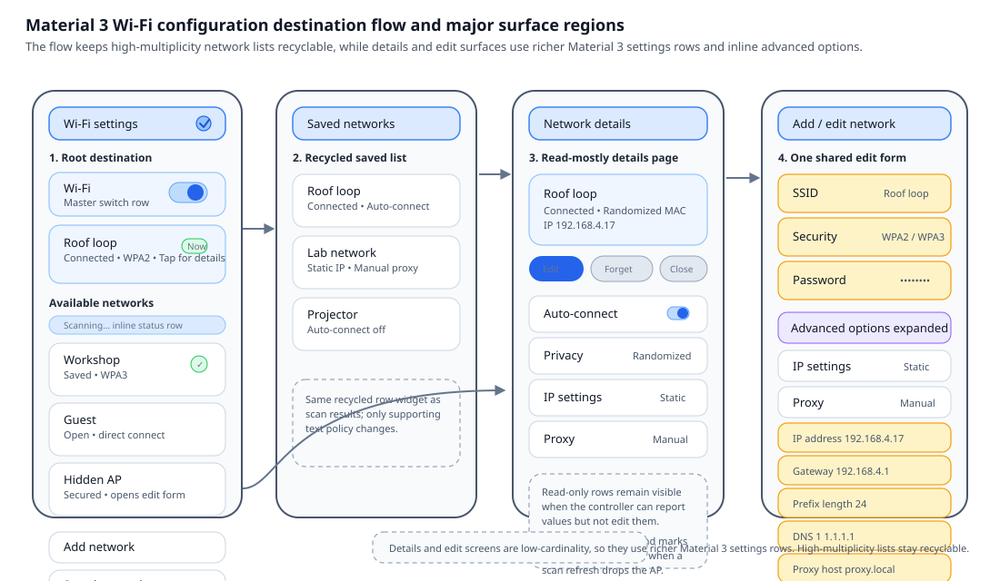

# Roo Windows Material 3 Wi-Fi Configuration Design

## Implementation status

**Proposed.** None of the Material 3 UI scope is implemented. The required
`roo_wifi` 2.0 backend API has landed locally, and `roo_windows_wifi` package
metadata already declares it. Backend publication and the physical-device
checks listed in its validation report remain release gates, not UI design
work. The status of the remaining prerequisites is recorded in the
[status index](../README.md).

## Objective

Provide a Material 3 Wi-Fi settings flow in `roo_windows_wifi`, using current
`roo_windows` widgets and navigation. Support discovery, optional saved-network browsing,
network editing, and optional application policies within embedded RAM limits.

The [Wi-Fi Backend Foundation design](../../../../roo_wifi/docs/wifi_backend_design.md) owns the
platform-independent `roo_wifi` API, HAL, persistence, and backend implementation.
This document owns the UI and its integration with that backend.

## Motivation

The current Wi-Fi UI shipped in
[roo_windows_wifi](../../../../roo_windows_wifi/src/roo_windows_wifi.h) is useful as
an initial proof of concept, but it no longer matches the rest of the
repository's Material 3 direction or the feature set expected from a modern
settings surface.

Today the user can:

- toggle Wi-Fi,
- see the current network,
- tap a scanned network,
- enter a password through a legacy underlined field,
- and open a small details page with connect, disconnect, and forget actions.

That is materially short of the intended end state. It does not offer a saved
networks page, a hidden-network entry path, policy editing such as
auto-connect, privacy, metered treatment, proxy, or manual IP configuration,
and it does not use the Material 3 widgets that newer `roo_windows` designs are
already provides.

The correct next step is not to keep accreting one-off rows onto the legacy
`HorizontalLayout` and `VerticalLayout` activities. The flow needs a new
destination and widget set that is designed as a coherent Material 3 settings
surface and that preserves the embedded RAM budget.

## Background

### Current Starting Point in `roo_windows_wifi`

As of 2026-09-19, the existing Wi-Fi package is centered on four files:

- [../../roo_windows_wifi/src/roo_windows_wifi/activity/list_activity.h](../../../../roo_windows_wifi/src/roo_windows_wifi/activity/list_activity.h),
  which builds the main screen from a legacy title row, a switch row, a
  progress bar, one current-network row, and a recycled scan-results list,
- [../../roo_windows_wifi/src/roo_windows_wifi/activity/network_details_activity.h](../../../../roo_windows_wifi/src/roo_windows_wifi/activity/network_details_activity.h),
  which shows a large icon, status text, and connect, disconnect, and forget
  actions,
- [../../roo_windows_wifi/src/roo_windows_wifi/activity/enter_password_activity.h](../../../../roo_windows_wifi/src/roo_windows_wifi/activity/enter_password_activity.h),
  which uses the legacy underlined `TextField` for password entry,
- and [../../roo_windows_wifi/src/roo_windows_wifi.h](../../../../roo_windows_wifi/src/roo_windows_wifi.h),
  which wires the three activities directly to `roo_wifi::Controller` through a
  small `Configurator` facade.

That code already carries two useful signals.

First, it proves that a Wi-Fi configuration flow belongs in a small dedicated
package rather than in app-local glue.

Second, it shows that scan results must stay recyclable. The current
`ListActivity` uses [`ListLayout`](../../../src/roo_windows/containers/list_layout.h)
for the available-network list instead of one live widget tree per AP. That is
still the right decision for embedded targets.

At the same time, the current package has four important limitations:

1. it uses legacy widgets rather than Material 3 list, button, switch, and
   text-field surfaces,
2. it treats password entry as a special-case activity instead of one branch of
   a general network-edit flow,
3. it has no settings model richer than `connect`, `disconnect`, `forget`, and
   stored password lookup,
4. and it has no UI contract for the backend's static IPv4 configuration or
   for application-owned proxy configuration.

### Relevant `roo_windows` Building Blocks

This design is intentionally aligned with the newer `roo_windows` direction.

The most relevant nearby pieces are:

- [../implemented/material3_lists_design.md](../implemented/material3_lists_design.md), which defines the
  small-row settings and list-item vocabulary for Material 3 surfaces,
- [material3_text_fields_design.md](../implemented/material3_text_fields_design.md), which
  defines the intended inline-editing and secure-field story,
- [../implemented/material3_buttons_design.md](../implemented/material3_buttons_design.md), which provides
  the action-button family for connect, forget, save, and cancel actions,
- [material3_layout_scaffold_design.md](../implemented/material3_layout_scaffold_design.md),
  which defines the page-shell direction for header plus scrolling-body
  surfaces,
- [non_touch_input_design.md](../implemented/non_touch_input_design.md), which defines the
  implemented keyboard and focus contracts that the Wi-Fi flow should inherit rather
  than bypass,
- and the current Material 3 list implementation in
  [../src/roo_windows/material3/list/list.h](../../../src/roo_windows/material3/list/list.h),
  which is appropriate for low-cardinality settings sections but not for large
  live scan-result sets.

### Embedded Constraints That Matter Here

The main architectural pressure in this design is row multiplicity.

A network-details page usually shows fewer than fifteen settings or info rows.
That is exactly the kind of low-cardinality surface where a richer Material 3
row widget is worth its slightly larger footprint.

A scan-result list is different. Real environments often expose twenty to forty
APs. If one rich Material 3 row surface costs roughly `140-180 B` after the
base widget, inline labels, glyph state, and packed row flags, then keeping
`28` scanned AP rows live would cost roughly `4-5 KB` before any controller
data or string storage. On a `320x240` viewport with a `72dp` two-line row, the
same list usually needs only `4-5` visible rows. Recycling therefore cuts row
object RAM from roughly `O(n)` to `O(v)`, bringing the same row cost down to
about `1 KB` for the row objects alone. These are planning estimates,
not measurements of current class sizes; retained list capacity, its prototype,
text storage, controller snapshots, and the flow owner add to the total.

That quantitative difference is large enough to drive the design:

1. available networks use a recycled fixed-height row path,
2. saved networks use that same recycled row path,
3. details and form sections use richer small Material 3 settings rows because
   their row count is low,
4. and optional advanced edit controls such as static IP and manual proxy live
   only on the single edit destination rather than adding fields or callbacks to
   every row instance.

### Current Framework API

The checked-out source is the API baseline for this proposal. The legacy Wi-Fi
class names still end in `Activity`, but their framework base is now
[`Destination`](../../../src/roo_windows/core/destination.h). There is no
`roo_windows::Activity` base in the current tree.

- Construct widgets with `ApplicationContext&`, normally `app.context()`.
  `Environment` remains application/scheduler setup, not a widget constructor
  argument.
- Each [`Task`](../../../src/roo_windows/core/task.h) owns its
  [`NavigationHost`](../../../src/roo_windows/core/navigation_host.h).
  Navigate with `task.navigation().push(destination)` and route Back through
  `task.requestBack()`. Hosts borrow destinations and their contents.
- Use the implemented `material3::LayoutScaffold` and `material3::AppBar` for
  page chrome, `material3::List` and `SwitchListItem` for short settings
  sections, and `ListModel` / `ListLayout` for recycled network lists.
- Use `material3::TextField` and `material3::SecureTextField` for editable
  values, including the existing secure reveal affordance. Labels, supporting
  text, and error text are borrowed; their storage must outlive field use.
  Editing uses task-local focus/editor state and application-scoped semantic
  input, including the existing software keyboard.
- Use `material3::AlertDialog::show(Task&)` for forget confirmation, handling
  its admission result and presenter lifecycle. Do not introduce a second
  modal host or rely on the proposed task-bounded coverage extension.
- Use `ApplicationContext::animations()` for visual animation and existing
  semantic scheduling for scan refresh and operation timeouts.

### Landed Backend Dependency and Package Boundary

The [Wi-Fi Backend Foundation design](../../../../roo_wifi/docs/wifi_backend_design.md),
the [2.0 migration guide](../../../../roo_wifi/docs/backend_migration.md), and
the checked-in public headers are the authoritative contracts for AP data,
connection operations, saved profiles, credentials, platform support, and
asynchronous outcomes. Those contracts are implemented in the landed
`roo_wifi` 2.0 source. The release is prepared but not yet published, so local
overrides remain necessary until its documented hardware gates pass. Native
ESP32 lifecycle, persistence, portability, and backend resource validation stay
owned by `roo_wifi`, not this UI plan.

The Material 3 flow consumes these concrete landed contracts:

- `Controller::scanSnapshot()` returns a borrowed, bounded array of
  `ScanRecord` values. It remains valid until the next successful scan
  publication or controller shutdown; failed scans preserve the previous
  snapshot.
- `Controller::support()` reports authentication, hidden-network, static-IPv4,
  randomized-MAC, and scan-while-connected capabilities.
- `Controller::loadProfile()`, `saveProfile()`, `connect(ProfileId)`, and
  `removeProfile()` operate on nonzero application-assigned keys. The backend
  does not allocate keys. `Controller::forEachProfile()` enumerates committed
  saved-profile IDs without a separate catalog.
- `Controller::Listener` separates scan publication, scan busy state, physical
  enablement, link changes, profile invalidation, and terminal operation
  results. Admitted requests return a nonzero `OperationId`; immediate
  rejection returns ID zero and no later completion.
- `LinkState` describes association and address readiness, but deliberately
  does not claim internet reachability.

`roo_windows_wifi` joins backend scan/profile/connection data into summaries,
selection, rows, and available actions. It also owns navigation and form text.
Proxy/metered policies and internet reachability come from optional application
services. None of those UI or application concerns extend the Wi-Fi backend.

## Requirements

### Functional Requirements

1. Provide a top-level Wi-Fi settings destination with a master switch, a current
   connection summary when one exists, available scan results, an `Add network`
   entry point, and a `Saved networks` entry point backed by controller profile
   enumeration.
2. Support direct one-tap connect for open or already-saved networks, while new
   secured or hidden networks route through an edit flow.
3. Provide a network-details destination that can show and edit at least:
   auto-connect, privacy mode, metered treatment, IP settings summary, proxy
   summary, and forget or disconnect actions when supported.
4. Provide an add or edit network destination that can create a hidden network and
   edit a saved network using one shared form.
5. Support the personal modes represented by the backend when their
   `Support::authentication_modes` bits are set: open, WEP, WPA personal, WPA2
   personal, WPA/WPA2 transition, WPA3 personal, and WPA2/WPA3 transition.
   Enterprise, WAPI, unknown, and other modes remain displayable but cannot be
   provisioned by the first-version form.
6. Support manual IPv4 configuration with address, prefix length, gateway,
   primary DNS, and secondary DNS.
7. Support manual proxy configuration with host, port, and bypass list, plus
   `None` as the default proxy mode.
8. Keep the details page usable when a scanned network disappears during a
   refresh; the screen should show `Out of range` rather than dismissing
   itself.
9. Keep edit drafts local to the edit destination until the user confirms `Save`
   or `Connect`.
10. Reflect asynchronous operations such as scan start, connect in progress,
    connect failure, and forget completion without rebuilding the destination
    stack.

### Interaction Requirements

1. The top-level settings destination automatically starts a scan on entry when
   Wi-Fi is enabled and the cached result set is stale, and also exposes an
   explicit refresh action.
2. The current-network summary row opens details instead of reconnecting.
3. Tapping a scanned network that is open or already configured initiates
   connect immediately; tapping a secured unknown network opens the edit form
   with the SSID and security prefilled.
4. `Advanced options` in the edit form are collapsed by default, but they open
   automatically when the loaded config is non-default or when validation fails
   inside the advanced section.
5. IP fields are editable only when `IP settings` is `Static`; proxy host,
   port, and bypass fields are editable only when `Proxy` is `Manual`.
6. Save or connect actions are disabled while the current draft is invalid or a
   conflicting controller operation is already running.
7. The flow must remain compatible with the framework-level focus and keyboard
   contracts from [non_touch_input_design.md](../implemented/non_touch_input_design.md); it
   must not introduce a Wi-Fi-specific input model.
8. `Add network` and `Saved networks` remain reachable when Wi-Fi is off. Only
   live scan results and live connection rows depend on radio enablement.

### API Requirements

1. Consume the backend's scan, connection, profile, and link configuration
   APIs without requiring UI-specific types or action flags in `roo_wifi`.
2. The high-level Wi-Fi flow must be constructible as one owner object that
   pre-allocates and reuses its destinations, matching the current
   `Configurator` ownership model rather than allocating a fresh destination tree
   on each navigation step.
3. Saved profiles use application-assigned persistent keys and allocation-free
   enumeration; scan results have documented snapshot lifetimes and AP identity.
   UI selection, ordering, and row summaries belong in `roo_windows_wifi`, and
   the edit destination owns mutable draft text locally.
4. Available and saved networks must use recycled fixed-height row widgets
   rather than one `material3::ListEntry` instance per network.
5. Public widget additions should stay small and purpose-built: one signal
   glyph, one recyclable Wi-Fi row, and one config-form composite are enough.
6. Retain the declared `roo_wifi >=2.0.0` dependency in the UI package metadata
   and remove local overrides only after that release is published. Combine
   `Controller::support()` and application service availability to derive UI
   controls; unsupported operations cannot appear to save successfully.
7. Keep proxy/metered policy storage and application, and internet reachability
   monitoring, outside `roo_wifi`. These optional integrations must not impose
   RAM or dependencies on backend-only consumers.

### Embedded Constraints

1. Add no Wi-Fi-owned allocations on paint, row rebind, or steady-state
   scrolling. `ListLayout` may grow its retained row pool during layout;
   measure that separately from steady-state scrolling. Existing upstream
   text glyph-stream allocations are a documented baseline, not a claim that
   all framework text painting is allocation-free.
2. Keep results-list row state compact and owner-local; do not build each row
   from nested `HorizontalLayout` and `TextLabel` trees just because the screen
   is settings-like.
3. Optional edit-only state such as password visibility, static IPv4 fields,
   and proxy fields must live only on the edit destination.
4. Reuse one choice destination and one confirmation dialog inside the flow owner
   rather than allocating a new chooser surface for every enum-setting tap.

### Non-Goals for the First Version

The first version does not attempt to support:

- enterprise EAP or certificate-backed Wi-Fi authentication,
- captive-portal browser or browser handoff,
- QR-code share or scan flows,
- manual static IPv6 configuration,
- per-BSSID roaming diagnostics,
- or wide-screen two-pane Wi-Fi settings layouts.

Those are reasonable follow-on items, but they are not required to replace the
current legacy flow with a modern embedded Material 3 one.

## Design Overview

### Scope

In scope:

- one owner object for the destination graph,
- one top-level settings destination,
- one saved-networks destination,
- one network-details destination,
- one add or edit network destination,
- one internal single-choice destination reused for setting enums,
- one confirmation dialog for destructive actions such as forget,
- and three small public widgets: a signal glyph, a recyclable network row,
  and a config form.

Out of scope:

- generic desktop-style multi-pane Wi-Fi settings,
- retrofitting the existing legacy `WifiIndicator` visuals in place,
- or turning the Wi-Fi package into a general network-stack administration UI.

### UI Concepts and Ownership

`WifiSettingsFlow` owns the reusable destinations and their presentation model.
That model derives rows and actions from borrowed backend data; it is not a
second Wi-Fi controller. A selection owns the SSID/security pair and optional
persistent profile ID so it survives scan replacement. `WifiEditableConfig`
owns the current form's editable values. An optional application-supplied
`WifiProfileIdAllocator` supplies keys for additional saved profiles when the
flow's single provisioning key is insufficient. `NetworkPolicyProvider`
reads/applies proxy and metered settings independently of Wi-Fi profile
storage. The application owns the backend and providers, which outlive the
flow.

### Key Decisions

1. The public integration surface is one reusable `WifiSettingsFlow` owner that
   pre-allocates destinations and pushes them through `Task::navigation()`.
2. Available and saved networks use a dedicated recycled `WifiNetworkRow`
   widget on top of `ListLayout`, not the generic `material3::List` container.
3. Details and choice pages use the richer Material 3 list vocabulary because
   their row count is small and their slot composition is more varied.
4. Add network, edit network, hidden network entry, and wrong-password repair
   all route through one `WifiEditNetworkDestination` backed by one owned draft
   object.
5. Manual IP configuration is inline inside the advanced section of the edit
   destination, not a separate leaf destination.
6. Manual proxy configuration is also inline in that advanced section, with
   only `None` and `Manual` modes in v1; PAC is deferred.
7. `roo_wifi` owns Wi-Fi domain state and operations. A small presentation model
   inside `WifiSettingsFlow` derives summaries and actions for the UI.
8. Proxy/metered settings use an optional application policy provider. Backend
   support and provider availability jointly determine which controls appear.



## Design Details

### Backend Consumption Contract

Use the landed [backend API and lifetime contracts](../../../../roo_wifi/docs/backend_migration.md#version-20-backend-api)
without duplicating their implementation here:

| Backend input or operation | UI responsibility |
| --- | --- |
| AP scan snapshots and full authentication metadata | Group/order rows, retain selected display text, and reacquire borrowed data after updates. |
| `Controller::forEachProfile()` and profile operations | Enumerate committed saved-profile IDs, load their metadata, derive ordering and AP matching, and edit them by application-assigned key. |
| Connection configuration, state and results | Validate field text, submit commands, match completions to the flow's requests, and render progress/errors. |
| Supported platform operations and available diagnostics | Derive control visibility and actions alongside application-provider support. |
| Explicit save, connect and remove operations | Compose Save/Connect/Forget workflows; do not reimplement retries, credential storage, or native cancellation. |

A save-and-connect UI action first obtains a nonzero application-assigned key
from the optional allocator (or uses the explicitly supplied provisioning key), calls
`saveProfile(key, ...)`, waits for the matching successful operation result,
commits any application policy as described below, then calls `connect(key)`.
`OperationResult::profile_id` confirms the same caller-assigned key; it is not a
generated identity. A failed or ambiguous save never starts a connection.
Forget explicitly disconnects the selected current profile before removing it
when that is the requested user action. Backend profile deletion alone does not
encode the whole UI workflow.

Serialize UI updates on the backend's required calling context or marshal owned
notifications before touching widgets. Never retain borrowed backend text across
model mutation. Detach listeners and pending UI callbacks before destroying the
flow, while preserving backend operations owned independently by the application.

### Presentation Model in `roo_windows_wifi`

The flow owns a small internal model that joins backend data for its screens.
`WifiNetworkSummary` and `WifiConfigurationCapabilities` are **UI-owned types**,
not aliases for backend types. Summary fields include display identity/text,
signal/security presentation, saved/current/connecting status, and optional
reachability supplied by an application monitor. Derived capabilities express
which controls this UI can actually present and apply.

For available-network rows, group APs by SSID and exact authentication mode,
select the strongest RSSI, then apply the UI's ordering. Do not merge open and
secured APs or collapse distinct transition modes. Keep grouping as lightweight
indices into the current scan snapshot; only visible rows have widget state.
Saved rows refer to application-assigned profile keys. Resolve a scan group to a
known profile only when SSID and security match unambiguously; otherwise require an
explicit profile choice rather than selecting arbitrary credentials.

Selection stores an owned SSID/security pair and optional profile ID. No
controller-wide scan handle allocator is needed to keep a details page open.
For example, when a selected AP disappears, the backend publishes its ordinary
new scan snapshot; the UI retains its selected text and shows `Out of range`.
When it reappears, the UI matches the selection against the new snapshot. A
connected profile remains current regardless of scan visibility.

`LinkState` does not carry a profile ID. Correlate an explicit saved-profile
connect through its `OperationId` and successful `OperationResult::profile_id`.
For a startup or otherwise unobserved connection, attach an enumerated profile
only when SSID and security match one saved key unambiguously; otherwise present
the link as current without claiming a saved-profile identity.

Rebuild grouping indices after scan notification and rebind visible rows before
paint. Reacquire borrowed data when a paused destination resumes. The flow owns
its one edit draft and selected text; it does not mirror the backend's complete
profile store or connection state. The model translates backend outcomes into
labels, focus changes, available actions, and errors, without implementing
Wi-Fi retries or persistence itself.

### Profile Enumeration and Key Allocation

The flow calls `Controller::forEachProfile()` to discover committed
saved-profile IDs, then calls `loadProfile()` from the visitor for non-secret
metadata. Enumeration order is unspecified, so the presentation model owns
ordering and a compact retained `ProfileId` index. Incomplete and deleted
records are excluded by the backend. The flow must not save or remove a profile
from inside the visitor; it finishes enumeration before admitting any mutation.

Committed-ID discovery and metadata readability are separate. If
`loadProfile()` reports `kCorrupt` or another read failure for one visited ID,
the flow omits that row, reports that some saved networks could not be loaded,
and retains the ID for retry or an explicit forget/repair path. An enumeration
failure does not publish a partial replacement index: retain the previous model,
show that saved networks could not be refreshed, and allow retry.

Enumeration itself is allocation-free. Growing the UI's retained key and
summary capacity is model-refresh work, not paint or row-rebind work, and its
retained and peak cost is included in resource acceptance.

Enumeration discovers identities but deliberately does not allocate them.
`provisioning_key` supports a single-profile application. An optional
`WifiProfileIdAllocator` supplies a nonzero application-owned key when saving a
new profile beyond that slot; the flow rejects zero, any enumerated key, or any
candidate for which `loadProfile()` returns something other than `kNotFound`.
A failed save does not publish the candidate key, and the allocator may reuse
it according to application policy. This provider does not enumerate or persist
profile metadata. Its deliberately small public contract is:

```cpp
class WifiProfileIdAllocator {
 public:
  virtual ~WifiProfileIdAllocator() = default;
  virtual bool nextProfileId(roo_wifi::ProfileId& out) = 0;
};
```

Returning `false` means no key is currently available, so Save is unavailable
for an additional profile. Calls run on the same serialized context as the
controller. Implementations may be stateless because the controller's profile
write slot serializes saves and the flow revalidates each candidate immediately
before admission.

### Optional Application Policies

Proxy configuration and metered treatment affect application network clients,
not the Wi-Fi driver. An application supplies a `NetworkPolicyProvider` to
`WifiSettingsFlow` when it wants these controls. Define that narrow integration
contract in `roo_windows_wifi`; its implementation owns policy persistence and
application in the app or a separate non-UI network-policy service. `roo_wifi`
does not depend on this contract and does not store these settings.

The provider reads and updates policy by `roo_wifi` profile ID and reports
supported policies and update failures. Manual proxy includes host, port, and
bypass rules; its support means participating clients actually consume the
setting, not that all sockets are proxied. Without a provider, omit metered and
proxy controls. Application policy uses a separate form draft and is never
passed to `roo_wifi` as connection configuration.

Validate both drafts and obtain the application-assigned profile ID before
saving. Persist Wi-Fi under that key, then commit application policy under the
same key. These are two independent stores, not an atomic transaction. If
policy commit fails, report that Wi-Fi settings were saved but application
policy was not, retain the unsaved policy draft, and do not start the requested
connection. Retrying policy commit reuses the key and does not save a duplicate
profile. Forget first deletes the Wi-Fi profile, then asks the provider to
remove its policy; report cleanup failure and let the provider reconcile
orphaned records without resurrecting the Wi-Fi profile.

An optional application reachability monitor can supply internet status for
the current connection. Without one, show link/address status only and leave
internet availability unknown. No reachability probe is added to `roo_wifi`.

### Resource Accounting

Measure base widget sizes, retained row-pool capacity, UI grouping indices,
backend snapshots, and the complete preallocated flow on the target ABI. Account for field-owned
strings and the temporary converted configuration separately when both are
live; record idle and maximum active RAM. The row shares glyph drawing code
rather than attaching a child to its leaf widget base.

### UI Draft

`WifiEditableConfig` is a `roo_windows_wifi` form type containing the selected
profile ID, editable SSID/password/IP/prefix/DNS text, credential intent, and
Wi-Fi policy choices. It also holds a separate application-policy draft when a
provider is installed. Invalid intermediate text stays here. On confirmation,
convert Wi-Fi fields into backend connection configuration and proxy/metered
fields into the provider's input; do not combine them into a backend struct.

### Reusable Widget Set

The public widget set stays intentionally small.

```cpp
namespace roo_windows_wifi {

class WifiSignalGlyph : public roo_windows::BasicWidget {
 public:
  explicit WifiSignalGlyph(roo_windows::ApplicationContext& context);

  void setSummary(const WifiNetworkSummary& summary);
};

class WifiNetworkRow : public roo_windows::BasicSurfaceWidget {
 public:
  explicit WifiNetworkRow(roo_windows::ApplicationContext& context);

  void setSummary(const WifiNetworkSummary& summary);
  void setSelected(bool selected);
  void setShowChevron(bool show_chevron);
};

class WifiConfigForm : public roo_windows::VerticalLayout {
 public:
  explicit WifiConfigForm(roo_windows::ApplicationContext& context);

  void load(const WifiEditableConfig& config,
            const WifiConfigurationCapabilities& caps);
  bool isValid() const;
  void saveTo(WifiEditableConfig& dest) const;
};

}  // namespace roo_windows_wifi
```

#### `WifiSignalGlyph`

`WifiSignalGlyph` is a new widget rather than a direct restyle of the legacy
[`WifiIndicator`](../../../src/roo_windows/indicators/wifi.h).

That separation is deliberate. The legacy indicator already serves non-Material
3 surfaces. The new flow needs a Material 3 glyph that can encode:

- signal strength,
- saved or locked status,
- connected versus connecting versus disconnected state,
- and no-internet or warning badges.

Keeping the new glyph separate avoids a visual regression in older code and
keeps the new semantics local to the Material 3 flow.

#### `WifiNetworkRow`

`WifiNetworkRow` is the key RAM-sensitive widget in the design.

It is one fixed-structure surface-owning row widget, not a `HorizontalLayout`
of child labels and icons. The row owns exactly the content it needs:

- one leading signal paint path shared with `WifiSignalGlyph` (no child widget),
- one headline text path for SSID,
- one supporting text path for status and security,
- and one compact trailing-state presentation for chevron, spinner, or
  connected check.

Each recycled list uses a uniform `72dp` row height, including rows whose
supporting text is empty. A separate compact list may select `56dp` for all its
rows; height never changes per item. This matches `ListLayout` recycling.

The row does not store per-instance callbacks. Activation still routes through
the enclosing destination or list container.

#### `WifiConfigForm`

The edit destination has only one live instance, so the form can afford richer
composition than the scan list.

`WifiConfigForm` therefore uses the generic Material 3 components from the
adjacent designs:

- text fields for SSID, password, IP, gateway, DNS, proxy host, proxy port,
  and proxy bypass list,
- switch rows for hidden network and auto-connect,
- list rows that open a small single-choice destination for security, privacy,
  metered mode, IP settings, and proxy mode,
- and inline action buttons at the bottom of the destination.

The form owns the single edit draft and validation state on behalf of the edit
destination. Field-owned strings are the active editable values; materialize
the backend configuration only for validation/commit, rather than maintaining
a second synchronized draft in the destination. The form does not talk to the
controller directly.

### Destination Set and Navigation

The flow owner is a new `WifiSettingsFlow` facade that plays the same role the
legacy `Configurator` plays today, but with a richer destination graph.

```cpp
namespace roo_windows_wifi {

class NetworkPolicyProvider;
class WifiProfileIdAllocator;
class WifiSettingsDestination;
class WifiSavedNetworksDestination;
class WifiNetworkDetailsDestination;
class WifiEditNetworkDestination;

class WifiSettingsFlow {
 public:
  WifiSettingsFlow(roo_windows::ApplicationContext& context,
                   roo_wifi::Controller& controller,
                   roo_wifi::ProfileId provisioning_key = 1,
                   WifiProfileIdAllocator* profile_ids = nullptr,
                   NetworkPolicyProvider* policies = nullptr);

  roo_windows::Destination& main();
  WifiSettingsDestination& settingsDestination();
  WifiNetworkDetailsDestination& detailsDestination();
  WifiEditNetworkDestination& editDestination();
  WifiSavedNetworksDestination& savedNetworksDestination();
};

}  // namespace roo_windows_wifi
```

The flow allocates its destinations once and reuses them for the life of the
owner. That keeps navigation predictable and avoids heap churn each time the
user opens details or edits a network. `provisioning_key` supports the common
single-profile application and must be nonzero. The controller, not the flow,
enumerates saved profiles. When `profile_ids` is installed, it supplies a
nonzero candidate key before a new profile save. The flow treats any enumerated
key or any load result other than `kNotFound` as occupied. Saving becomes
authoritative only after the matching backend operation succeeds.

These classes derive from `Destination` and implement `Widget& getContents()`.
Each owns its scaffold and contents. The flow owns its destinations, listener,
choice surface, and alert dialog by value; it is neither copyable nor movable.
The controller, application context, and any supplied providers outlive it.
Remove all flow destinations from navigation and dismiss its dialog before
destroying the flow. A destination already in history cannot be pushed again;
reuse the existing route instead.

A representative caller, after constructing an application and controller:

```cpp
roo_windows_wifi::WifiSettingsFlow settings(app.context(), wifi, 1);
roo_windows::Task& task = app.addTaskFullScreen();
task.navigation().push(settings.main());
// Before settings is destroyed, remove its destinations from task.navigation().
```

Use `onResume()` to refresh visible snapshots and restore appropriate focus;
`onPause()` must settle editing through the existing editor lifecycle without
committing the draft. Back from the form discards local edits. Back from the
choice destination preserves the draft. The forget dialog uses the requesting
destination's task as interaction owner.

The destination graph is:

1. `WifiSettingsDestination` as the root,
2. `WifiSavedNetworksDestination` for stored networks,
3. `WifiNetworkDetailsDestination` for a selected network,
4. `WifiEditNetworkDestination` for add, edit, hidden-network, and
   password-repair flows,
5. one internal `WifiChoiceDestination` reused for small enum choices,
6. and one internal confirmation dialog for destructive actions such as
   `Forget`.

The public API exposes only the first four destinations plus the flow owner.
`WifiChoiceDestination` and the confirmation dialog remain implementation
details.

### `WifiSettingsDestination`

The top-level settings destination has five sections. Only the app bar is
pinned in the scaffold. The switch, current connection, available networks and
navigation rows share one scrolling body; fixed switch/footer bands leave too
little space for networks on a 320×240 display. The column may lay out the
recycled list at its logical content height, but `ListLayout` must retain only
a window-sized row pool and bind the visible range through the outer viewport.
Verify that bound with the complete settings composition, not just an isolated
list. Short details and form bodies use the existing scrolling containers.

1. Header: title plus a refresh action.
2. Wi-Fi switch row: a Material 3 list row with a trailing switch.
3. Current network section: shown only when connected or connecting.
4. Available networks section: recycled `WifiNetworkRow` list plus a scanning
   status row when a scan is running.
5. Scrolling navigation actions: full-width `Add network` and `Saved networks`
   rows with leading icons and trailing navigation affordances.

The key interaction decisions are:

- entering the page triggers a scan if Wi-Fi is enabled and cached results are
  stale,
- the current-network row opens details rather than reconnecting,
- available rows connect immediately only when the target is open or already
  saved,
- unknown secured rows open `WifiEditNetworkDestination` with SSID and security
  prefilled,
- and `Add network` opens the same edit destination in manual-entry mode with an
  empty draft.

When Wi-Fi is off, the destination suppresses the current and available network
sections but leaves `Add network` and `Saved networks` visible.

That choice is intentional. Editing saved configurations and preparing a hidden
network entry are valid tasks even when the radio is off.

### `WifiSavedNetworksDestination`

This destination uses `Controller::forEachProfile()` and `loadProfile()`; it
does not infer saved profiles from scans or maintain a second persistent index.
Enumeration discovers every committed profile ID in unspecified order, after
which the UI derives stable display order and AP matches. An empty enumeration
shows the empty saved-networks state. The optional profile-ID allocator is used
only when creating an additional saved profile, never for listing existing ones.

Saved networks use the same recycled `WifiNetworkRow` widget and list plumbing
as live scan results. The rows differ only in their supporting text policy.

The supporting line resolves in this order:

1. `Connected` when the saved config is the current network,
2. the most useful policy summary such as `Auto-connect off`, `Static IP`, or
   `Manual proxy`,
3. otherwise the security label.

Selecting a saved network always opens details rather than connecting
immediately. The user is intentionally one step away from destructive actions
such as forget, and one step away from advanced edits such as static IP.

### `WifiNetworkDetailsDestination`

The details page is the read-mostly screen for the flow's selected network
(owned SSID/security and optional persistent profile ID).

It is composed from:

- a summary header with `WifiSignalGlyph`, SSID, and connection-state text,
- a compact action row with `Connect` or `Disconnect`, `Edit`, and `Forget`
  buttons as supported,
- one settings section with editable rows,
- and one information section with read-only rows.

The settings section uses low-cardinality Material 3 rows for:

- auto-connect,
- privacy,
- metered treatment,
- IP settings summary,
- and proxy summary.

The information section shows read-only text rows for available landed
`LinkState` and scan values:

- security,
- BSSID and station MAC address,
- IP address,
- gateway,
- DNS,
- channel and signal strength,
- and the resolved status text.

Rows are shown according to two rules.

1. Show values supplied by the Wi-Fi backend or installed application services.
2. Derive interactive actions in the presentation model from backend operation
   support, provider support, and the current UI/request state; route interactive
   rows to the edit or choice destination. Remaining informative rows are read-only.

This keeps one UI usable across platforms without adding UI action flags to
`roo_wifi`.

If the scanned network disappears during a refresh, the page keeps the last
known summary and changes the status line to `Out of range`. It does not pop
itself from the stack.

### `WifiEditNetworkDestination`

`WifiEditNetworkDestination` is the one mutable form surface in the flow.

It serves four entry paths:

1. `Add network`,
2. `Join hidden network`,
3. `Edit network`,
4. and `Repair credentials` after a failed connect.

The form uses one owned `WifiEditableConfig` draft. It never applies partial
changes to the controller.

The visible structure is:

- SSID field,
- security row,
- password field when the chosen security requires one,
- hidden-network switch,
- auto-connect switch,
- `Advanced options` expander,
- advanced choice rows,
- conditional static IPv4 fields when `IP settings = Static`,
- conditional manual proxy fields when `Proxy = Manual`,
- and bottom action buttons.

The edit destination uses inline advanced controls instead of a second IP-only
destination for two reasons.

First, Android-like Wi-Fi forms already treat IP and proxy as advanced fields
of the same network draft.

Second, a separate IP destination would force the UI to copy partial draft state
between destinations and would add navigation cost on small displays without
reducing memory in any meaningful way, because there is only one live edit form
at a time.

#### Advanced Defaults and Validation

The UI uses these defaults for new drafts; existing profiles and application
policies retain their saved values:

- `auto_connect = true`,
- `privacy = Device MAC` unless supported randomization is explicitly selected,
- `metered = Auto`,
- `ip_assignment = DHCP`,
- `proxy_mode = None`.

Field feedback is local to the form. `roo_wifi` validates Wi-Fi/IP values for
all callers; the application provider validates proxy/metered policy updates.

The rules are:

1. SSID is required for add and hidden-network flows.
2. Credentials follow explicit keep/replace/clear intent; validate replacement
   length and encoding for the selected supported authentication mode. SSIDs
   must fit the backend byte limit (32), rather than a character-count limit.
3. Static IPv4 mode requires a syntactically valid IPv4 address, gateway,
   prefix length in the closed range `[1, 30]`, and a primary DNS server;
   secondary DNS is optional. This matches `roo_wifi::StaticIpv4` validation.
4. Manual proxy mode requires a non-empty host and a non-zero port.

The form uses ordinary text fields plus validation on edit finish and save.
It does not introduce a special dotted-quad keypad widget in v1.

That is the correct scope cut. The text-field family already owns text entry;
the Wi-Fi form only needs domain validation.

### Choice Destination and Enum Editing

Security, privacy, metered treatment, IP settings, and proxy mode all use the
same internal `WifiChoiceDestination`.

That destination is a small single-select list with a title, one Material 3 list
section, and trailing radio affordances. It writes the chosen enum back into
the edit destination's draft or, for lightweight details-page policy changes such
as auto-connect or metered mode, through a confirmed update to the backend
profile or application provider respectively. Preserve unrelated fields and
credentials and handle each service's result.

The design intentionally does not use popup menus for these choices. On
embedded displays, a full-destination choice list is easier to read, easier to
scroll, and more consistent with the rest of the settings flow.

### Paint, Layout, and Update Strategy

The Wi-Fi flow deliberately uses two different UI construction styles.

`WifiNetworkRow` is owner-painted and recycled because list multiplicity makes
RAM the primary constraint.

The details and edit destinations use richer composition because they are
low-cardinality surfaces and clearer code is worth the slightly larger widget
tree.

The update strategy follows the landed `Controller::Listener` event split.

1. `onEnabledChanged()` and `onLinkChanged()` update the switch row,
   current-network section, and details for the current UI selection.
2. `onScanStateChanged()` updates busy presentation. `onScanChanged()`
   reacquires `scanSnapshot()` and refreshes the scan model using
   `ListLayout::modelChanged()` (or `modelItemChanged()` for a single row).
3. `onProfilesChanged()` invalidates known-profile details and triggers a fresh
   `forEachProfile()` pass followed by metadata reload and saved-list reordering.
4. `onOperationFinished()` results are matched by `OperationId` to the flow's
   requests; the UI updates busy indicators, enabled actions, and inline
   feedback. A request with ID zero is handled immediately from its returned
   `Status` because no callback follows.
5. Application policy/reachability notifications refresh their presentation
   fields independently of the Wi-Fi backend.

An interrupted backend save can leave the known profile incomplete. Keep the
full edit draft on failure and offer explicit replacement; do not promise that
the previous settings survived or retry using Keep for an incomplete profile.
If the commit outcome is unknown, reload the known key before reporting success.

The edit destination ignores scan-result churn while a draft is open. A scan
refresh must not wipe what the user is typing.

## Proposed API

The intended public package types are listed below. Destination and widget
bases are specified in the preceding API sketches and navigation contract.

```cpp
namespace roo_windows_wifi {

class WifiSettingsFlow;
class NetworkPolicyProvider;
class WifiProfileIdAllocator;

class WifiSettingsDestination;
class WifiSavedNetworksDestination;
class WifiNetworkDetailsDestination;
class WifiEditNetworkDestination;

class WifiSignalGlyph;
class WifiNetworkRow;
class WifiConfigForm;

}  // namespace roo_windows_wifi
```

The flow uses the landed `roo_wifi::Controller` through its internal
presentation model and optionally borrows a `WifiProfileIdAllocator` and
`NetworkPolicyProvider`. No UI-shaped facade is added to `roo_wifi`. Backend
functionality has its own domain tests and documented support; UI fields are
derived only from working operations. A capability absent from
`Controller::support()` is omitted or disabled rather than presented as a
successful save.

## Implementation Plan

Authoring references:

- `roo_windows_wifi`: [embedded C++](../../../../roo_windows_wifi/.github/instructions/general-cpp-code-authoring-instructions.md),
  [widgets](../../../../roo_windows_wifi/.github/instructions/roo-windows-widget-authoring.instructions.md),
  and [examples](../../../../roo_windows_wifi/.github/instructions/embedded-example-authoring.instructions.md).

### Validation and Development Setup

Material 3 fields, buttons, lists, app bars, dialogs, scaffold, animation, and
non-touch input are implemented prerequisites. Consume their current headers;
no prerequisite UI implementation phase is needed.

All `material3_wifi_*` targets below are **new targets to add in
`roo_windows_wifi`**, not existing `roo_windows` targets. Backend tests and release phases are specified in the separate backend design.
Run commands from the package that owns the target.
During development use local Bazel/PlatformIO dependency overrides for sibling
checkouts, and document the exact invocation in the example README. Do not
publish machine-specific absolute paths in package manifests.

### Backend Baseline and Release Gate

The portable observation/operation contracts, committed-profile enumeration,
known-key profiles, static IPv4, MAC policy, capability reporting, persistence,
and ESP32 adapter required by this design have landed in `lib/roo_wifi`. UI
development therefore targets the checked-in 2.0 headers from Phase 1 onward
rather than waiting for incremental backend phases. The legacy
`roo_windows_wifi` model remains a downstream regression target until the
replacement flow supersedes it; its compatibility build is validation work,
not evidence used to redefine the backend contract.

The backend's [validation report](../../../../roo_wifi/docs/backend_validation.md)
still requires physical ESP32 lifecycle, persistence/power-interruption, and
resource checks before 2.0.0 publication. Those checks gate removal of local
dependency overrides and the final UI release; they do not block emulator-backed
UI implementation. Backend lifecycle, persistence, and platform tests remain
backend-owned.

### Phase 1: Add Recycled Rows and the Settings Destination

Add the flow-local presentation model, `WifiNetworkSummary`, derived UI
capabilities, `WifiSignalGlyph`, `WifiNetworkRow`, bounded `ListLayout` models,
and the settings destination using current scaffold/app-bar/list APIs. Implement
scan grouping/order, profile matching, and selected-network retention here. Establish
`WifiSettingsFlow` now as the reusable owner and extend it in later phases.
Add the runnable `roo_windows_wifi/examples/material3/network_settings/`
example and its leaf Bazel target in this phase; it uses the landed real
controller with deterministic emulator APs. Cover signal states, row rebind,
scan routing, grouping and reorder, enabled/off presentation, and fixed row
heights. Verify the backend exposes unchanged AP data to a non-UI consumer. Secure unknown
networks gain their edit route in Phase 3; the intermediate example describes
its available scope and does not silently accept unsupported actions.

Proposed commit message:

> Material 3 Wi-Fi Phase 1: add the settings destination and recycled rows.
>
> Introduce the shared signal paint path, root flow owner, current-navigation
> integration and runnable network-settings example with focused tests.

Validation: add and run `//:material3_wifi_signal_glyph_test`,
`//:material3_wifi_network_row_test`, and `//:material3_wifi_settings_test`;
build `//examples/material3/network_settings:network_settings`.

### Phase 2: Add Saved Networks, Details, and Confirmation

Extend the flow with a controller-enumerated saved-networks destination and
known-profile details, capability-aware
policy/info rows, and one reusable `AlertDialog` for forget. Add details-page
profile updates with completion/error handling. Preserve owned last-known
summary when a scanned network disappears. Extend the example in this commit.

Proposed commit message:

> Material 3 Wi-Fi Phase 2: add saved-network browsing and details.
>
> Add profile actions, effective-policy presentation, task-owned confirmation
> and out-of-range handling with navigation and capability tests.

Validation: add and run `//:material3_wifi_details_test` and
`//:material3_wifi_saved_networks_test`; rebuild the example.

### Phase 3: Add the Shared Edit Form and Advanced Configuration

Add `WifiConfigForm`, edit and reusable choice destinations, secure entry,
credential intent, and inline advanced IP/proxy fields. Add the optional
`NetworkPolicyProvider` integration for application-owned metered/proxy settings.
Keep intermediate text local; translate Wi-Fi and application policy drafts to
their respective service inputs. Orchestrate save then connect in the flow and
report partial saves across the two stores without claiming atomicity. Handle
Wi-Fi-off Save, operation rejection, busy state, and failed connection repair.
Extend the example with hidden-network and saved-profile edits. Add a focused
`examples/material3/manual_configuration/manual_configuration.ino` example
with a deterministic application policy provider and static IPv4 configuration;
label participating proxy clients clearly. Cover no-provider control omission,
policy rejection after Wi-Fi save, retry without duplicate profiles, and orphan
policy cleanup after forget.

Proposed commit message:

> Material 3 Wi-Fi Phase 3: add editable network configuration.
>
> Add the shared form, enum choices, credential handling and advanced address
> and proxy fields with field validation and runnable examples.

Validation: add and run `//:material3_wifi_edit_form_test` and
`//:material3_wifi_ip_validation_test`; build both example leaf targets.

### Phase 4: Verify Integration, Resource Costs, and Release Dependencies

Add full navigation/input/lifetime and rendering goldens, plus row-pool and
flow resource measurements. Migrate `examples/simple` to the completed flow;
keep any retained legacy demonstration under a `legacy_` name. Exercise real
`roo_wifi` persistence and controller behavior with deterministic emulator HAL
inputs, including delayed failures and UI teardown. Run manual emulator checks and
UI smoke checks on the documented display/input hardware.

After the backend's documented hardware gates pass, consume the published
`roo_wifi` 2.0.0 release already declared by `roo_windows_wifi`'s Bazel, Arduino,
and PlatformIO metadata. Update only if the published version or required
`roo_windows` version changes. Verify examples without local overrides and
record UI memory and relevant platform limitations. Backend publication and
native API migration remain owned by the backend package.

Proposed commit message:

> Material 3 Wi-Fi Phase 4: complete flow validation and release integration.
>
> Add navigation, rendering and resource acceptance coverage, migrate the
> simple example and declare the released controller/framework dependencies.

Validation: add and run `//:material3_wifi_golden_test`,
`//:material3_wifi_flow_test`, and `//:material3_wifi_resource_test`; build all
Wi-Fi example targets and the hardware sketch. Framework regressions belong in `roo_windows` only when framework
code changes or integration exposes a framework regression.

## Testing Plan

### Unit and Behavior Tests

Add focused tests for:

- `WifiSignalGlyph` state mapping,
- `WifiNetworkRow` supporting-text resolution and uniform list row height,
- direct connect versus edit routing from the settings page,
- details-page row enablement based on capability flags,
- local form validation for password, static IPv4, and proxy fields,
- preservation of the edit draft during scan-result churn,
- empty, unordered, stopped, failed, and partially unreadable profile
  enumeration without publishing a partial replacement model,
- profile-ID allocation with no key available, zero, collision, failed save,
  and successful refresh through `onProfilesChanged()`,
- translation of backend rejection/completion into UI feedback and draft state,
- credential intent, save/connect sequencing, forget behavior and UI listener teardown,
- UI-local grouping, profile matching, selection retention and action derivation,
- and application-provider policy updates, absent-provider behavior and partial
  save/cleanup failures, without storing application policy in `roo_wifi`.

### Golden and Rendering Tests

Add goldens for:

- open, locked, connected, connecting, and no-internet network rows,
- the root settings page with Wi-Fi on and Wi-Fi off,
- the details page for a connected network,
- and the edit form with advanced static IP fields expanded.

### Integration Coverage

Add one emulation smoke surface that exercises the flow end to end through the
landed `roo_wifi::Controller` and verifies that settings, details, save, connect, and
forget navigation all remain functional.

## Caveats

### Rejected Alternatives

#### Make the Backend Expose the Settings Screen's Model

Combining scans, profiles, connection status, action availability, and display
summaries in `roo_wifi` would make screen assembly convenient, but would impose
one UI's identity and state model on every backend caller. Likewise, putting
proxy/metered policy consumers there would broaden a Wi-Fi library into
application network-policy management. Keep those joins and control decisions
in `roo_windows_wifi`, and application policies in an optional provider. The separate backend design supplies reusable Wi-Fi primitives; this UI
consumes them through its presentation model.

#### Build the Entire Flow from `material3::List`

This was rejected because scan and saved-network surfaces are high-multiplicity
lists. Keeping one live rich row widget per AP is the wrong RAM tradeoff on an
embedded target. The design instead uses `material3::List` only where the row
count is small and the richer slot vocabulary is worth the cost.

#### Keep Extending the Legacy Three-Activity `roo_windows_wifi` Flow

This was rejected because the current split between scan list, password prompt,
and tiny details page hard-codes the wrong abstractions. Password entry is only
one branch of a full network-edit flow, and advanced settings cannot be added
cleanly while the UI has only the old SSID/password state model. Landing the
richer `roo_wifi` 2.0 configuration contract first resolved that dependency;
this design now builds the replacement UI on it.

#### Put Manual IP and Proxy Editing on Separate Leaf Destinations

This was rejected because it would multiply navigation steps and force the UI
to shuttle partial drafts between destinations without producing a meaningful RAM
win. One edit destination with an expandable advanced section is both closer to
Android's Wi-Fi configuration pattern and simpler to validate.

#### Retheme the Existing Legacy `WifiIndicator` In Place

This was rejected because the legacy indicator already serves older,
non-Material-3 code paths. Replacing its visuals or semantics in place would
create a migration hazard for unrelated surfaces. A new `WifiSignalGlyph` keeps
the Material 3 contract isolated.

## Future Work

- Add enterprise EAP and certificate-backed credential flows on top of the same
  edit-destination draft model.
- Add read-only IPv6 diagnostics first, then evaluate whether static IPv6
  editing is worth the extra field and validation cost.
- Add QR-code share, captive-portal handoff, and wide-screen two-pane layouts
  once the core single-pane flow is stable.
