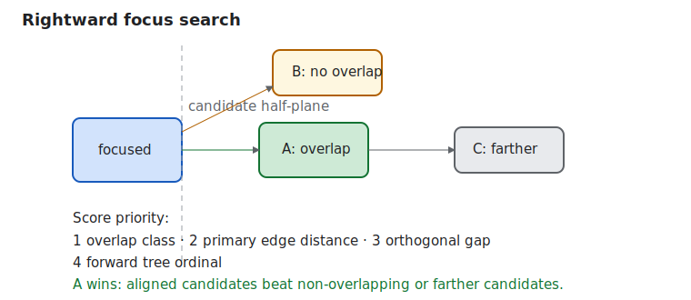

# Roo Windows Non-Touch Input and Keyboard Navigation Design

## Implementation status

**In progress.** Phases 1 and 2 are implemented: key acquisition and
lifecycle-safe focus state plumbing. Scope activation, key dispatch,
traversal, and component adoption remain. The status of existing and
outstanding prerequisites is recorded in the [status index](../README.md).

## Objective

Add framework-level support for non-touch displays to `roo_windows`, with
keyboard navigation as the first-class new input path and mouse / pointer
support as a later extension.

The design must preserve the existing touch model, stay within the library's
embedded memory and paint budgets, and make the UI usable on displays that do
not expose touch hardware at all.

The intended end state is that a user can:

- move focus through the active UI using Tab or directional keys,
- see focused, hovered, pressed, selected, and activated visuals resolve
  consistently,
- activate clickables, operate dialogs, adjust value controls, and scroll
  content without touch,
- edit text from a hardware keyboard,
- and later use a mouse without reworking the same core contracts again.

This is a keyboard-first design. Mouse support is deliberately secondary.

## Motivation

`roo_windows` already contains many of the visual concepts needed for non-touch
interaction, but not the runtime machinery.

Today the library:

- stores `hover` and `focused` bits on `Widget`,
- resolves hover, focus, selected, activated, dragged, and pressed overlays in
  the shared paint path,
- and several Material 3 component designs already refer to focused and hovered
  visuals.

At the same time, the runtime is still explicitly touch-centric:

- `Application` owns a `TouchSensor` and a `GestureDetector`,
- the event loop only drains touch input,
- widget interaction is routed through touch gesture callbacks,
- there is no focus manager,
- there is no keyboard event model,
- there are no focus traversal contracts,
- and emulation is wired to a fake touch controller rather than host keyboard
  or mouse events.

That mismatch is now the main blocker. The missing work is not just "add a few
key handlers". The library needs a framework-owned interaction model for
non-touch input.

The existing semantic endpoint for simple controls is already `onClicked()`:
touch gesture recognition eventually schedules that callback through the
shared click-animation controller. Keyboard support therefore needs a second
way to reach the same endpoint, with keyboard-specific press and release
handling, but it does not need a new cross-input action taxonomy. Controls for
which a key means something other than click, such as sliders and text fields,
can express that meaning in `onKeyEvent()`.

## Background

### Current Status in `roo_windows`

As of 2026-07:

- [src/roo_windows/core/application.h](../../../src/roo_windows/core/application.h)
  and [src/roo_windows/core/application.cpp](../../../src/roo_windows/core/application.cpp)
  own the top-level event loop and currently route only touch input.
- [src/roo_windows/core/touch_sensor.h](../../../src/roo_windows/core/touch_sensor.h)
  polls the underlying display for touch state and emits `DOWN` / `MOVE` /
  `UP` samples.
- [src/roo_windows/core/gesture_detector.h](../../../src/roo_windows/core/gesture_detector.h)
  translates those raw samples into gesture callbacks such as `onDown()`,
  `onShowPress()`, `onSingleTapUp()`, `onDragStart()`, `onDrag()`,
  `onDragFinished()`, and `onFling()`.
- [src/roo_windows/core/widget.h](../../../src/roo_windows/core/widget.h) exposes a
  touch-oriented interaction surface. The public state bits include
  `kWidgetHover` and `kWidgetFocused`, but there are no public or protected
  mutators for either state and no focus traversal API.
- [src/roo_windows/core/widget.cpp](../../../src/roo_windows/core/widget.cpp)
  already accounts for hover and focus in overlay opacity, transient paint
  bounds, and invalidation.
- [src/roo_windows/core/task.h](../../../src/roo_windows/core/task.h),
  [src/roo_windows/core/task.cpp](../../../src/roo_windows/core/task.cpp),
  [src/roo_windows/core/main_window.h](../../../src/roo_windows/core/main_window.h),
  and [src/roo_windows/core/main_window.cpp](../../../src/roo_windows/core/main_window.cpp)
  already define the active-layer routing boundaries for tasks, popups, and
  dialogs, but only for touch.
- [src/roo_windows/widgets/text_field.h](../../../src/roo_windows/widgets/text_field.h)
  and [src/roo_windows/widgets/text_field.cpp](../../../src/roo_windows/widgets/text_field.cpp)
  contain a shared `TextFieldEditor` and `KeyboardListener`, but they are
  wired to the on-screen [activities/keyboard.h](../../../src/roo_windows/activities/keyboard.h)
  activity, not to a hardware keyboard source.
- [src/roo_windows/material3/list/list.h](../../../src/roo_windows/material3/list/list.h)
  already carries `pressed`, `focused`, and `hovered` inside
  `ListEntryVisualContext`, proving that some families already expect focus and
  hover to exist as real runtime concepts.
- [emulation/main.cpp](../../../emulation/main.cpp) sets up a fake touch controller
  for host emulation. It does not bind host keyboard or mouse events into the
  library.
- [library.json](../../../library.json) still describes the project as a
  touch-based UI library.

### Existing Local Seams Worth Reusing

Several local pieces already fit a keyboard-first extension.

1. [src/roo_windows/core/application_context.h](../../../src/roo_windows/core/application_context.h)
   is now the application-owned runtime service bundle. It is the correct home
   for a focus manager or similar shared interaction service.
2. [src/roo_windows/core/widget_event_dispatcher.h](../../../src/roo_windows/core/widget_event_dispatcher.h)
   already centralizes sparse widget-related event state in application-owned
   storage rather than charging every widget instance.
3. [src/roo_windows/core/click_animation.h](../../../src/roo_windows/core/click_animation.h)
   and the main-window-owned click animation pipeline already give the library
   a standard pressed-feedback path.
4. [src/roo_windows/core/widget.cpp](../../../src/roo_windows/core/widget.cpp)
   already has the shared invalidation and overlay math needed when hover or
   focus starts and stops.
5. The touch path itself works and should remain the touch path. It does not
   need to be redesigned into an abstract pointer engine before keyboard
   navigation lands.

### Local Design Signals That Already Acknowledge the Gap

Several local design docs explicitly assume touch-primary behavior or defer
keyboard / pointer focus routing:

- [material3_split_button_design.md](material3_split_button_design.md)
  explicitly says v1 does not add per-segment hover or keyboard-focus routing
  because touch is still the primary interaction model.
- [material3_menus_design.md](material3_menus_design.md) explicitly avoids a
  hover-only interaction model for embedded touch targets.
- [../implemented/material3_slider_design.md](../implemented/material3_slider_design.md) defers keyboard
  focus movement APIs beyond what the base framework supports.
- [material3_text_fields_design.md](material3_text_fields_design.md) assumes
  focused and hovered visuals will eventually come from the framework's widget
  state model.

Those docs were reasonable when the base framework had no non-touch story.
This design fills that gap.

### Constraints

The new interaction model must respect four existing framework constraints.

1. Touch behavior must remain compatible.
   Existing touch-driven widgets, tests, and examples should not need a broad
   rewrite.
2. Hot interaction paths must avoid allocation.
   Focus changes, key dispatch, hover updates, click animation, and paint-time
   invalidation must stay allocation-free.
3. Layer ownership already matters.
   Tasks, popups, and dialogs are real routing boundaries in the current
   framework. Keyboard focus must obey those same boundaries.
4. Non-touch input sources are not display features.
   A hardware keyboard, keypad, rotary encoder, USB HID host, BLE remote, or
   host-emulator key stream should not be forced through
   `roo_display::Display`.

## Requirements

### Functional Requirements

1. A keyboard-only user must be able to operate the active UI without touch.
2. The active layer must own keyboard focus: modal dialog first, then
   focus-capturing popups, then the top regular task.
3. Focused widgets must show focused visuals through the shared widget-state
   model when their paint path uses that model.
4. Mixed-input systems must be supported: touch-only, keyboard-only,
   touch-plus-keyboard, and later keyboard-plus-pointer.
5. Activating a focused clickable from the keyboard must reach the same
   existing `onClicked()` semantic as a successful touch click.
6. Focus movement into an offscreen descendant must reveal that descendant in
   its nearest scroll container.
7. Hardware keyboard text entry must work without requiring the on-screen
   keyboard popup.
8. Existing touch input must keep working unchanged when no keyboard or
   pointer source is present.

### API Requirements

1. Input acquisition must become independent of the touch-capable display.
2. `Application` must support optional non-touch input sources without forcing
   existing touch-only callers onto a new construction pattern.
3. `Widget` must gain focusability, focus request, and key-event hooks.
4. `Widget` must gain real hover and focus mutators so the existing bits can
   become live state.
5. The framework must expose container override points for focus traversal and
   preferred initial focus.
6. The keyboard path must not synthesize fake touch coordinates.
7. The base framework should provide semantic defaults so simple clickables do
   not each need bespoke key handling.

### Embedded Constraints

1. Do not allocate on focus transfer, key dispatch, hover changes, paint, or
   pointer move.
2. Keep per-widget storage overhead small; prefer app-owned runtime services.
3. Preserve the current click animation and overlay invalidation behavior.
4. Do not force every popup to capture keyboard focus.

### Non-Goals for the First Implementation

The first keyboard-first rollout does not need to ship full desktop pointer
behavior.

The following are explicitly deferred:

- right-click context menus,
- drag-and-drop,
- mouse text selection,
- multi-pointer gesture support,
- a full accessibility tree or screen-reader surface,
- platform IME integration,
- and every desktop-specific shortcut convention.

Those may be useful later, but they are not required to make non-touch
displays usable.

## Design Overview

The design extends the framework in layers.

1. Keep the current touch pipeline for touch.
2. Add an optional key-source abstraction.
3. Add an application-owned focus manager.
4. Extend `Widget` with key-event hooks and shared keyboard activation.
5. Roll out keyboard behavior across widget families incrementally.
6. Add mouse / pointer behavior later on top of the same focus and lifecycle
   model, while defining pointer routing only when it is implemented.

The key design rule is:

> Keyboard interaction is not modeled as synthetic touch.

Touch callbacks are coordinate-rich gesture callbacks with tap slop,
show-press, fling, and touch-target expansion semantics. Keyboard navigation
has none of those properties. The correct model is focus plus key dispatch,
with activation reusing the existing click semantic.

The proposed runtime shape is:

```text
TouchSource   -> GestureDetector -> touched widget path
KeySource     -> KeyDispatcher   -> FocusManager -> focused widget / click
```

Touch remains direct-widget routing. Keyboard adds focus and key routing; its
simple-control fallback joins the existing click path only after a valid
keyboard press-and-release lifecycle.

## Design Details

### Input Source Abstraction

The current `Application` constructor bakes touch acquisition directly into the
framework by owning a `TouchSensor` bound to a `roo_display::Display`.
That is too narrow for non-touch displays.

The first implementation introduces one thin non-touch source interface. The
source is borrowed by `Application`; its owner must keep it alive until the
application is destroyed. `drain()` is non-blocking, preserves source order,
and leaves events beyond `max_events` queued for the next call.

Each tick drains a four-event stack buffer at most four times. Consuming all
16 events schedules an immediate follow-up tick. This bounds input work per
tick without dropping queued events.

```cpp
class KeySource {
 public:
  virtual ~KeySource() = default;
  virtual int drain(KeyEvent* out, int max_events) = 0;
};

```

`Application` gains an overload that accepts a key source and an explicit
`enable_touch` flag while preserving the current touch-only constructor.

Compatibility rule:

- existing `Application(env, display)` keeps constructing the legacy touch
  source internally,
- callers that want keyboard support pass a `KeySource`,
- callers with no touch hardware pass `enable_touch == false`.

The existing touch pipeline remains concrete. A general `TouchSource` is not
needed to add keyboard support, and a public pointer interface does not land
before pointer routing exists.

### Key Event Type

The framework needs explicit, compact event types.

Suggested baseline keyboard event type:

```cpp
enum class KeyCode : uint8_t {
  kUnknown,
  kTab,
  kEnter,
  kSpace,
  kEscape,
  kBack,
  kUp,
  kDown,
  kLeft,
  kRight,
  kPageUp,
  kPageDown,
  kHome,
  kEnd,
  kDelete,
  kBackspace,
  kCharacter,
};

enum class KeyPhase : uint8_t { kDown, kUp, kRepeat };

struct KeyEvent {
  KeyPhase phase;
  KeyCode code;
  uint8_t modifiers;
  uint32_t rune;  // valid when code == kCharacter.
};
```

The first keyboard pass only needs enough expressiveness for:

- focus traversal,
- activation,
- cancel / dismiss,
- value adjustment,
- text entry,
- and edit navigation.

Physical keys and produced text are distinct. Printable keys produce physical
events for shortcuts and separate `kCharacter` events for text. Modifier bits
are `Shift`, `Control`, `Alt`, and `Meta`. Sources reject invalid Unicode
scalar values. Space does not produce both activation and text: an editor
consumes the physical Space event and receives its character event; other
widgets receive Space only as an activation key.

### Key Dispatch Order

Key routing is target-first and consumption-based. `KeyDispatcher` handles
each event in this fixed order:

1. On Back or Escape down, call the shared
   [`Application::requestBack()`](application_navigation_back_behavior_design.md)
   path. A handled request stops dispatch; an unhandled request continues so a
   root editor can cancel local edit state.
2. On Tab down, move focus forward or backward according to Shift. Widgets do
   not consume Tab in the first implementation.
3. Deliver the event to the focused widget's `onKeyEvent()`.
4. If unhandled, bubble through its ancestors, nearest first.
5. Apply framework fallback: Enter and Space use primary activation; arrows
   use directional traversal; other keys remain unhandled.

Controls consume keys that have local meaning before traversal fallback. Text
editors consume character, caret, deletion, Home, End, Enter, and Space input.
Sliders consume directional value keys. Scroll containers consume scrolling
keys only when descendants and intervening ancestors leave them unhandled.

Repeat events are delivered to widget and ancestor handlers for repeated value
or scroll changes. Framework activation and traversal ignore repeat.

### Keyboard Activation Lifecycle

The focus manager stores one armed-widget pointer and one armed key; widgets
gain no per-instance key-state field.

- An unhandled Enter or Space down on an enabled clickable arms the focused
  widget and sets its pressed state.
- The matching key up activates only if the same widget is still focused,
  enabled, attached, and inside the active scope.
- Activation clears the armed and pressed state before queuing the existing
  click semantic through the shared click-animation controller, so the click
  callback can synchronously remove the widget safely.
- Focus change, scope change, disable, hide, detachment, destruction, or a
  mismatched release cancels the arm and clears pressed state.
- Repeat never activates or re-arms.

The primary action starts the existing click-animation path at
`getPointOverlayFocus()` and schedules exactly one existing `onClicked()`
semantic.

### Application-Owned Interaction Services

The framework needs one application-owned service that tracks focus and one
small dispatcher that translates key events into focus movement or widget
actions.

The correct home is [ApplicationContext](../../../src/roo_windows/core/application_context.h).

`ApplicationContext` should gain:

```cpp
FocusManager& focus();
const FocusManager& focus() const;
```

`Application` remains the owner of input polling and dispatch order.

The intended `Application::tick()` order becomes:

1. refresh click animation,
2. drain and dispatch pending key events,
3. drain and dispatch pending touch events through the existing gesture
   detector,
4. refresh layout and paint,
5. reschedule the ticker based on input, focus-blink, and animation activity.

The touch path stays intact. The new work is additive.

### Focus Manager

The framework currently has no owner for focus. That is the central missing
piece.

`FocusManager` owns:

- the currently focused widget,
- the current active focus scope root,
- one intrusive `FocusScope` record per focus-owning task or presenter,
- and the logic that validates whether a focus target is still visible,
  enabled, attached, and within the active scope.

The manager's responsibilities are:

1. choose the active focus scope,
2. assign initial focus when the scope changes,
3. honor `requestFocus()` calls,
4. move focus forward, backward, or directionally,
5. clear focus when the widget is hidden, disabled, detached, or leaves the
   active scope,
6. and update the widget's focused bit.

#### Focus Scope Storage and Resolution

Each regular `TaskPanel`, focus-capturing popup presenter, and dialog presenter
embeds a `FocusScope` containing its root widget, its last focused descendant,
and a link to the previously active scope. On a 32-bit target this costs about
12 bytes per focus-owning layer. It avoids a focus-history map, fixed unused
capacity, and allocation during scope changes.

The framework already knows about regular tasks, popups, and modal dialogs.
Keyboard focus must follow the same layering.

The active focus scope should be resolved as:

1. the active modal dialog, if present,
2. otherwise the top-most popup layer that explicitly captures keyboard focus,
3. otherwise the top regular task's current activity root.

This requires one new distinction that the touch-only framework does not need:

- some popups are focus-capturing,
- some popups are passive overlays.

That distinction matters immediately because the shared on-screen keyboard is a
popup task today. On mixed-input systems, it must not automatically steal
hardware-key focus from the field being edited.

The design therefore adds a small popup focus-capture policy.

Suggested shape:

```cpp
enum class FocusCapturePolicy : uint8_t {
  kPassive,
  kCapturesFocus,
};
```

Regular tasks default to `kCapturesFocus`. Existing keyboard popup paths can
stay `kPassive`.

Focus capture and back participation are independent. A passive popup can
register with the shared back dispatcher and dismiss before the underlying
activity receives Back or Escape. The focus manager does not invent a second
dismissal route.

#### Initial Focus

When a new focus scope becomes active, the manager should choose the initial
focus in this order:

1. previously focused descendant within that same scope, if still valid,
2. the scope root's preferred focus child, if one is supplied,
3. otherwise the first focusable descendant in traversal order.

This gives dialogs, menus, and structured surfaces a hook for sensible default
focus without forcing bespoke policy into the global manager.

#### Mixed-Input Behavior

On mixed-input systems:

- a successful touch activation on a focusable widget should transfer focus to
  that widget,
- hover should not imply focus,
- and focus should remain sticky until a later focus change, scope change, or
  target invalidation.

A successful touch tap requests focus immediately before scheduling its click
semantic. This ordering remains safe when `onClicked()` removes the target.
Non-click touch gestures do not move focus.

#### Focus Lifetime and Tree Mutation

Raw focus pointers require mandatory lifecycle notification.
`Container::detachChild()` calls
`FocusManager::onSubtreeDetaching(child)` before changing parent links or
applying parent-owned deletion. While the tree is intact, the manager clears
the focused target and every active scope record that points to the child or a
descendant, cancels keyboard activation, and removes focused visual state.

`Widget::~Widget()` calls `FocusManager::onWidgetDestroying(*this)` as a
debug-checked fallback before sparse event handlers are removed. Destruction
of an attached widget is already invalid. A match in this fallback is a debug
failure because it proves that a detach notification was skipped; release
builds still clear an exact match without dereferencing it.

Visibility and enabled-state changes notify the manager before applying the
transition. When the changed subtree contains focus, the manager moves to the
next eligible target or clears focus. Scope exit clears visible focus but
retains its last-focused pointer until subtree detachment or scope destruction.

A focus target is eligible only when it is focusable, has non-empty laid-out
bounds, remains attached below the active scope root, and it and every ancestor
through that root are visible and enabled.

### Widget Contract Changes

`Widget` already stores focus and hover bits. The framework needs real APIs to
drive them.

The proposed additions are:

```cpp
virtual bool isFocusable() const { return isClickable(); }

void requestFocus();

virtual void onFocusChanged(bool focused) {}

virtual bool onKeyEvent(const KeyEvent& event) { return false; }
```

If an eligible focused widget leaves Enter or Space unhandled, the framework's
keyboard-activation fallback should:

- verify that the widget is clickable and enabled,
- show pressed / click animation feedback centered on `getPointOverlayFocus()`,
- and queue the existing `onClicked()` semantic through the same
  main-window-owned click-animation controller used by touch.

This fallback is framework dispatch logic, not a new virtual widget action.
Widgets override `onKeyEvent()` only when their keys have control-specific
meaning. For example, a slider handles arrows and Home / End directly, while a
text field handles editing keys and characters directly. Touch continues to
reach `onClicked()` through gesture recognition, so an input-origin parameter
would have no truthful role in this design.

The widget must also gain real state mutators analogous to `setPressed()`:

```cpp
void setFocused(bool focused);
void setHover(bool hover);
```

Those mutators should reuse the same invalidation and interaction-bounds logic
already used by pressed, selected, activated, and dragged state.

The base framework must not try to emulate keyboard interaction by injecting
fabricated touch streams. That would
incorrectly reuse touch-specific semantics such as tap slop, show-press timing,
sloppy hit bounds, and fling recognition.

### Traversal Model

The focus manager needs a default traversal model plus container override
points.

#### Forward / Backward Traversal

Tab uses depth-first child storage order and Shift+Tab uses reverse child
storage order over eligible descendants. Traversal wraps within the active
scope; a scope with one eligible widget retains it.

#### Directional Traversal

Directional traversal performs one allocation-free tree scan. Candidates must
lie in the requested half-plane relative to the focused bounds' center. The
score is the lexicographic tuple:

1. `0` for overlap on the orthogonal axis, otherwise `1`,
2. primary-axis edge distance,
3. orthogonal-axis gap,
4. forward traversal ordinal.

Directional traversal does not wrap. The traversal ordinal makes ties
deterministic without storing a candidate vector.



This makes D-pad and arrow-key navigation work on lists, menus, grids, and
split layouts without every container needing a bespoke neighbor table.

#### Container Override Points

Some containers need tighter control. The framework should expose lightweight
hooks such as:

```cpp
virtual Widget* preferredFocusChild();
virtual Widget* nextFocusable(FocusDirection direction, Widget* from);
virtual bool revealFocusedDescendant(Widget& descendant);
```

These hooks let lists, menus, tab bars, navigation surfaces, and custom
composites keep navigation local when the generic geometry search is not the
desired user model.

#### Focus Reveal

When focus moves to a descendant inside a clipped scroll container, the nearest
scrollable ancestor must reveal it.

This is required for keyboard-only usability.

After transfer, the manager walks outward from the target. The first ancestor
whose `revealFocusedDescendant()` returns true owns the reveal. A scroll
container performs the minimum scroll needed to expose the full target when it
fits; when the target exceeds the viewport, it exposes the target's leading
edge.

### Component Adoption Strategy

The core framework work is necessary but not sufficient. Several widget
families need follow-on behavior work.

#### Simple Clickables

This includes:

- legacy buttons,
- Material 3 buttons and icon buttons,
- FABs,
- checkboxes,
- radio buttons,
- switches,
- dialog footer buttons,
- and simple navigation items that already route through
  `setOnInteractiveChange()`.

Most of these can adopt keyboard support with minimal component-specific code:

- become focusable,
- accept the shared Enter / Space activation fallback,
- and rely on the shared focused / pressed visuals.

This is the highest-value early adoption slice.

#### Value Controls

Sliders and similar controls need more than primary activation.

Affected surfaces include:

- [src/roo_windows/widgets/slider.h](../../../src/roo_windows/widgets/slider.h),
- [src/roo_windows/material3/slider/slider.h](../../../src/roo_windows/material3/slider/slider.h),
- [src/roo_windows/material3/slider/range_slider.h](../../../src/roo_windows/material3/slider/range_slider.h),
- and scroll containers such as
  [src/roo_windows/containers/scrollable_panel.h](../../../src/roo_windows/containers/scrollable_panel.h).

They need explicit keyboard handling in `onKeyEvent()`:

- Left / Down -> decrement,
- Right / Up -> increment,
- Home / End -> min / max,
- PageUp / PageDown for coarse movement where appropriate,
- and focus reveal inside scrolling parents.

The current touch-scroll handlers are not enough because they assume pointer
motion rather than discrete value deltas.

#### Text Entry

Text entry needs its own explicit treatment.

The current shared editor already gives the library:

- shared mutable editing state,
- cursor blink scheduling,
- insertion of printable runes,
- Enter / commit,
- and Delete / backspace-like removal.

What it does not yet provide is the hardware-keyboard behavior needed for a
non-touch UI:

- caret movement with Left / Right,
- Home / End,
- selection extension with Shift,
- focus-vs-edit ownership rules,
- and a policy for coexistence between hardware keyboard input and the
  on-screen keyboard popup.

The design therefore expands `TextFieldEditor` from a soft-keyboard sink into a
real key-editing engine.

Policy choice:

- when an editable text field gains focus on a hardware-keyboard-capable
  system, it should enter edit mode immediately,
- typed characters go straight to the shared editor,
- Tab and Shift+Tab move focus out of the field,
- Enter confirms,
- Escape or Back cancels,
- and the software keyboard is not automatically shown unless the active input
  policy explicitly asks for it.

This preserves the current touch-only software-keyboard path while making the
field usable on keyboard-only targets.

#### Compound and Structured Controls

Several compound families need explicit non-touch adoption work because they do
not naturally fall out of the simple clickable model.

1. Dialogs

   [src/roo_windows/dialogs/dialog.h](../../../src/roo_windows/dialogs/dialog.h)
   currently enforces modality only for touch-down dispatch. Dialogs need a
   focus-capturing scope, sensible initial focus, keyboard button traversal,
   Enter default-action handling, and Escape dismissal.

2. Lists and list-derived navigation surfaces

   [src/roo_windows/material3/list/list.h](../../../src/roo_windows/material3/list/list.h)
   already stores `pressed`, `focused`, and `hovered` in the resolved visual
   context. That means keyboard support is not just a widget-bit problem. The
   owning list needs to drive those bits into row visual contexts during
   `refreshEntryVisualContexts()` and choose whether focus is row-local,
   selection-local, or roving.

3. Menus, tabs, drawers, rails, and bars

   These families need predictable directional traversal and a distinction
   between focused destination and selected destination. The global focus
   manager can provide the base mechanics, but each family needs local policy.

4. Childless compound widgets

   [material3_split_button_design.md](material3_split_button_design.md)
   explicitly deferred per-segment hover and keyboard-focus routing because the
   framework had no such model.

   Full keyboard support changes that. A split button cannot stay a single
   undifferentiated focus target forever if both the primary segment and the
   menu segment must be usable from the keyboard.

   The preferred order is:

   - use real child widgets where the storage cost is acceptable,
   - otherwise introduce a small virtual-focus-node abstraction for the narrow
     cases that need sub-widget focus granularity,
   - but do not block the keyboard-first core on solving every childless
     compound control at once.

### Task, Popup, and Dialog Integration

Focus ownership must align with the existing layer model.

Primary implementation surfaces are:

- [src/roo_windows/core/main_window.h](../../../src/roo_windows/core/main_window.h),
- [src/roo_windows/core/main_window.cpp](../../../src/roo_windows/core/main_window.cpp),
- [src/roo_windows/core/task.h](../../../src/roo_windows/core/task.h),
- [src/roo_windows/core/task.cpp](../../../src/roo_windows/core/task.cpp),
- [src/roo_windows/core/activity.h](../../../src/roo_windows/core/activity.h),
- and [src/roo_windows/dialogs/dialog.h](../../../src/roo_windows/dialogs/dialog.h).

The integration rules are:

1. entering a new activity updates the active focus scope,
2. pausing or hiding an activity clears focused descendants in that scope,
3. showing a dialog replaces the active focus scope with the dialog,
4. closing a dialog restores focus to the previous scope when possible,
5. passive popups stay visible without stealing keyboard focus,
6. focus changes caused by touch or pointer clicks must still respect the
   top-most active focus-capturing layer.

### Emulation and Platform Work

To make the feature real rather than theoretical, platform integration must
change alongside the core.

The first required host seam is
[emulation/main.cpp](../../../emulation/main.cpp).

Today it builds:

- a fake display,
- a fake touch controller,
- and a host viewport.

It must also provide a host-backed `KeySource`.

That gives the library a real keyboard smoke path in the emulator rather than
only in embedded integration code.

On real hardware, different devices can provide these new sources:

- matrix keypads,
- rotary encoders with push action,
- USB HID host keyboards,
- BLE remotes,
- or board-specific GPIO button clusters.

Those integrations implement `KeySource`. They do not extend the meaning of
`roo_display::Display`.

### Documentation and Packaging Follow-Up

Once the keyboard-first phases land, follow-up docs should update the library's
public description.

That includes at least:

- [library.json](../../../library.json),
- relevant examples,
- and any README or usage docs that still present the library as touch-only.

That metadata change should happen after the feature is real, not before.

## Proposed API

The public surface added by this design is:

```cpp
enum class KeyPhase : uint8_t { kDown, kUp, kRepeat };

struct KeyEvent {
  KeyPhase phase;
  KeyCode code;
  uint8_t modifiers;
  uint32_t rune;  // Valid only for kCharacter.
};

class KeySource {
 public:
  virtual ~KeySource() = default;
  virtual int drain(KeyEvent* out, int max_events) = 0;
};

class Widget {
 public:
  virtual bool isFocusable() const { return isClickable(); }
  bool requestFocus();
  virtual bool onKeyEvent(const KeyEvent& event) { return false; }
  virtual void onFocusChanged(bool focused) {}
};

class Application {
 public:
  Application(const Environment* env, roo_display::Display& display);
  Application(const Environment* env, roo_display::Display& display,
              KeySource& keys, bool enable_touch);
};
```

Framework-only `FocusManager`, `KeyDispatcher`, `FocusScope`, focus-state
mutators, and traversal hooks remain internal or protected. No pointer API is
introduced before working pointer routing exists.

### Migration and Compatibility

The migration preserves current touch-only callers.

Compatibility rules:

1. Existing `Application(env, display)` continues to work.
2. If no key source is provided, behavior is unchanged.
3. Existing touch-driven widgets keep their current touch semantics.
4. The new keyboard path is additive.
5. Widgets that do not override new key hooks still compile and remain
   keyboard-inert unless the base semantics already make sense.

The important compatibility goal is behavioral, not just source-level:
touch-only UIs retain their existing interaction behavior after the
keyboard-first core lands.

## Implementation Plan

Authoring references: follow the
[embedded C++ code authoring instruction](../../../.github/instructions/embedded-cpp-code-authoring.instructions.md)
and the
[roo_windows widget authoring instruction](../../../.github/instructions/roo-windows-widget-authoring.instructions.md).

### Phase 1: Key Acquisition

Add `KeySource`, bounded draining, optional keyboard-only construction, source
tests, and host-emulator source plumbing.

Proposed commit message:

> Non-touch input phase 1: add bounded key acquisition
>
> Add bounded borrowed key input, keyboard-only application construction,
> emulator wiring, and focused acquisition tests from the non-touch input
> design.

Validation: run the new key-source target and build the emulator.

### Phase 2: Focus Manager and Widget State Plumbing

Add intrusive focus scopes, lifecycle notifications, eligibility checks,
focus state hooks, restoration, and popup focus-capture policy. Add tests that
detach, delete, hide, and disable focused or remembered descendants from
inside callbacks.

Proposed commit message:

> Non-touch input phase 2: add lifecycle-safe focus ownership
>
> Add intrusive focus scopes, framework focus state plumbing, mandatory tree
> mutation notifications, restoration, and mutation-focused tests from the
> non-touch input design without increasing base widget size.

Validation: run focus-manager, widget, container, task, and dialog targets.

### Phase 3: Simple Clickables and Dialog Focus

1. Make simple clickables focusable by default.
2. Map Enter / Space to the existing click semantic.
3. Add focus transfer on successful touch click.
4. Make dialogs true keyboard focus scopes.
5. Add Tab, Shift+Tab, arrow-key, Enter, and Escape behavior to dialogs.

This delivers the first end-to-end keyboard story for common buttons and modal
surfaces.

Proposed commit message:

> Non-touch input phase 3: route keys and activate focused controls
>
> Add target-first routing, deterministic traversal, release-based activation,
> dialog focus trapping, touch focus transfer, examples, and interaction tests
> from the non-touch input design.

Validation: run key-dispatch, traversal, button, dialog, click-animation,
gesture, and emulator targets.

### Phase 4: Scroll Containers and Value Controls

1. Add focus reveal to scroll containers.
2. Add keyboard scrolling to scrollable panels where appropriate.
3. Add increment / decrement / min / max key handling to sliders and range
   sliders.
4. Make switches, checkboxes, and radio buttons keyboard-operable.

This phase makes settings-style UIs viable without touch.

Proposed commit message:

> Non-touch input phase 4: navigate value and scroll controls
>
> Add focus reveal, keyboard scrolling, value-control key behavior, component
> examples, and boundary and repeat tests from the non-touch input design.

Validation: run slider, scroll-container, simple-control, traversal, and
emulator targets.

### Phase 5: Structured Navigation Surfaces

1. Add list row focus policy and visual-context plumbing.
2. Add menu navigation by keyboard.
3. Add tabs, navigation bar, rail, and drawer traversal policy.
4. Solve the highest-value compound-control cases using real child focus where
   practical.

This phase turns the keyboard core into a real application-navigation model.

Proposed commit message:

> Non-touch input phase 5: add structured keyboard navigation
>
> Add list visual focus, menu and destination traversal, compound-control
> adoption, component examples, and focus-versus-selection tests from the
> non-touch input design.

Validation: run list, menu, navigation-family, traversal, and emulator targets.

### Phase 6: Text Entry

1. Expand `TextFieldEditor` to support caret movement and selection by key.
2. Add hardware-keyboard text editing policy to text fields.
3. Keep software-keyboard behavior intact for touch-only targets.
4. Make editable fields enter edit mode immediately on hardware-key focus;
   keep read-only fields focusable without entering edit mode.

This phase makes the library genuinely usable on keyboard-only displays rather
than only navigable.

Proposed commit message:

> Non-touch input phase 6: edit text from hardware keyboards
>
> Extend the shared editor with Unicode entry, caret and selection movement,
> commit and cancel policy, mixed-input examples, and editor tests from the
> non-touch input design.

Validation: run text-field, keyboard-activity, key-dispatch, back-dispatch, and
emulator targets.

## Testing Plan

Core validation covers:

1. focus state transitions,
2. focus scope changes across task, popup, and dialog boundaries,
3. Tab and directional traversal,
4. focus reveal inside scroll containers,
5. keyboard primary-action dispatch,
6. slider and value-control keyboard behavior,
7. text-field editing by hardware keyboard,
8. and emulator smoke coverage for host keyboard input.

Each phase runs the existing touch tests for the components it changes. The
emulator supplies the end-to-end host-keyboard smoke path. Size checks verify
that `sizeof(Widget)` does not increase and record the actual
`ApplicationContext` and `FocusScope` deltas against the design estimates.

## Caveats

Directional traversal is an O(n) scan. Key events are infrequent and embedded
interfaces normally contain few focusable widgets, so constant storage is
preferred over neighbor tables or cached vectors.

The design depends on the shared back-behavior proposal for Back and Escape.
Phase 3 lands after that proposal's core dispatcher; Phases 1 and 2 remain
independently implementable and testable.

### Rejected Alternatives

#### Model Keyboard as Synthetic Touch

Rejected because touch callbacks are not generic activation callbacks.

Touch has:

- coordinates,
- slop thresholds,
- show-press timing,
- long-press promotion,
- scroll deltas,
- fling velocity,
- and sloppy hit-target expansion.

Keyboard navigation has none of those properties. Synthesizing fake touch would
hide the real missing abstraction, which is focus plus key dispatch. Simple
keyboard activation can reuse the existing click semantic after dispatch has
validated the keyboard lifecycle.

#### Put Keyboard and Mouse APIs on `roo_display::Display`

Rejected because non-touch inputs often come from devices unrelated to the
display itself.

The right abstraction boundary is input source interfaces owned by the
application, not a display object that suddenly becomes a keyboard host.

#### Let Every Widget Family Invent Its Own Local Focus Model

Rejected because focus scope, modality, and traversal must work across the
whole active UI tree, not only within one component family.

Dialogs, popups, tasks, and mixed-input focus transfer require one framework
owner.

#### Delay Keyboard Until Mouse Is Also Ready

Rejected because keyboard navigation is the smallest change that makes
non-touch displays useful.

Mouse support is valuable, but it brings hover routing, wheel policy, and
desktop-specific interaction questions that are not required to unblock the
user's immediate need.

#### Force Every Popup to Capture Focus

Rejected because some popups, especially the existing on-screen keyboard, are
supporting surfaces rather than the keyboard navigation destination.

The framework needs passive popups as a first-class concept.

#### Store Remembered Focus in a Hash Map

Rejected because scope changes would allocate or require fixed unused
capacity. Intrusive scope records charge only focus-owning layers and make
nesting explicit.

#### Activate on Key Down

Rejected because it cannot represent Space's held pressed state and makes key
repeat prone to duplicate actions. Arm-on-down and activate-on-up provide a
defined cancellation point.

#### Add Pointer APIs Before Pointer Routing

Rejected because an unimplemented API would freeze an unvalidated contract.
Pointer types land together with working routing and tests.

## Future Work

Pointer and mouse support adds pointer acquisition, hover routing,
primary-button focus transfer, wheel bubbling, and emulator coverage on top of
the focus and key-routing contracts defined here. Platform IME,
accessibility, context menus, drag-and-drop, and mouse text selection remain
separate designs.
