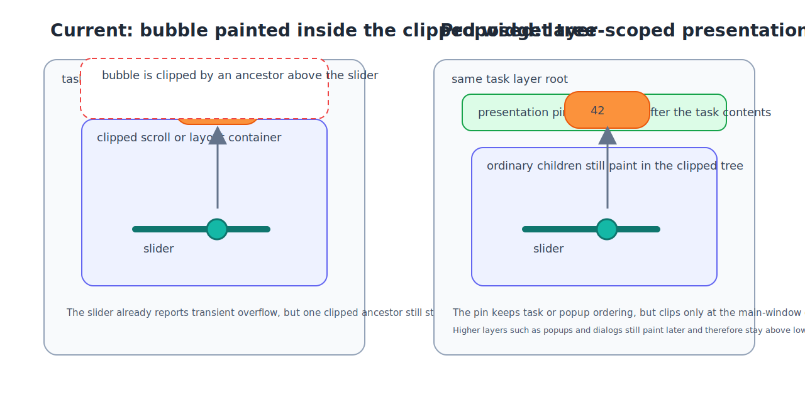

# Roo Windows Transient Presentation Pins Design

## Implementation status

**Proposed.** None of the defined scope is implemented. The status of existing and outstanding prerequisites is recorded in the [status index](../README.md).

## Objective

Define a general-purpose, paint-only presentation mechanism for visuals that
must render above ordinary widget contents without requiring an unclipped
ancestor chain.

The immediate driver is the Material 3 slider value indicator in
[../implemented/material3_slider_design.md](../implemented/material3_slider_design.md). The same mechanism
also serves keyboard preview or highlighter surfaces and the
presenter-owned trigger retention already proposed in
[material3_menus_design.md](material3_menus_design.md).

## Motivation

The current slider bubble path in
[../src/roo_windows/material3/slider/slider.cpp](../../../src/roo_windows/material3/slider/slider.cpp)
already uses the strongest local overflow path the framework currently has:

- `getParentTransientPaintBounds()` widens the parent invalidation envelope,
- `ParentClipMode::kUnclipped` lets the slider escape its direct parent,
- and the bubble itself is painted as non-widget geometry.

That still fails when any ancestor above the slider remains clipped.
[../src/roo_windows/core/container.cpp](../../../src/roo_windows/core/container.cpp)
only widens `maxBounds()` for direct unclipped descendants, and
`unclippedChildRectShown()` propagates farther only when each ancestor
container is itself unclipped.

Requiring a full unclipped chain is the wrong ownership model for
"always-front transient feedback":

- it forces unrelated layout containers to adopt presentation policy,
- it broadens cached max-bounds and invalidation on every state change,
- and it still does not create a root-stage paint opportunity.

Promoting the slider pill to a real widget or popup solves clipping but is too
expensive and semantically wrong for a paint-only label that does not hit-test,
focus, or own layout.

## Background

### Current Slider Indicator Path

The current indicator is a non-widget helper in
[../src/roo_windows/material3/slider/value_indicator.h](../../../src/roo_windows/material3/slider/value_indicator.h).
`Slider` and `RangeSlider` pre-paint it inside `paintWidgetContents()` and rely
on decoration and exclusion salvage so later slider paint does not erase the
rounded corners. That design works inside the slider's own paint pass, but it
still inherits ancestor clipping.

### Current Overflow Model

[../in_progress/visual_overflow_design.md](../in_progress/visual_overflow_design.md) split logical bounds,
ink bounds, decoration overflow, and transient paint overflow. That is the
right local model. It does not solve the "paint above arbitrary clipped
ancestors" problem because local overflow still lives inside the widget tree
and the ancestor chain remains authoritative for clipping and dirty
propagation.

The current container implementation makes the limitation explicit:

- `Container::maxBounds()` includes unclipped descendants only when the
  immediate child relationship is `ParentClipMode::kUnclipped`,
- `Container::paintChildren()` forwards the unclipped canvas only one level at
  a time,
- and `Container::unclippedChildRectShown()` /
  `Container::unclippedChildRectHidden()` propagate beyond an ancestor only
  when that ancestor also opted into unclipped parent paint.

A clipped scroll panel, layout wrapper, dialog content panel, or popup surface
therefore stops slider bubble propagation even when the slider opted out
locally.

### Existing Layer Roots

[non_touch_input_design.md](non_touch_input_design.md) already treats tasks,
popups, and modal dialogs as real routing and focus boundaries.
[../src/roo_windows/core/main_window.cpp](../../../src/roo_windows/core/main_window.cpp)
paints those same boundaries in order:

1. regular tasks,
2. popup tasks,
3. modal dialog plus scrim.

That ordering is the right place to anchor "always-front within my active
layer" visuals.

### Existing Pin Precedent

[material3_menus_design.md](material3_menus_design.md) already proposed a
presenter-owned root trigger overlay pin for menu press retention. This
document generalizes that one-off idea into a shared framework primitive
instead of adding separate root hooks for menus, sliders, and keyboard
affordances.

### Earlier Hierarchy Decision

[../implemented/surface_widget_refactor_design.md](../implemented/surface_widget_refactor_design.md)
explicitly deferred the choice between stretching the existing
transient-overflow machinery farther and splitting child hosting from surface
ownership.

This proposal keeps that earlier call intact. It does not add a second widget
tree and it does not require non-surface widgets to become containers. It adds
a root-stage paint primitive for the smaller class of paint-only transient
visuals.

## Requirements

### Functional Requirements

1. A transient visual anchored inside a slider, keyboard, or similar widget
   must escape arbitrary ancestor clipping inside the same window.
2. The visual must paint above ordinary contents of its owning task, popup, or
   dialog layer.
3. The visual must remain below higher layers: task pins stay under popups and
   dialogs, popup pins stay under dialogs.
4. The default final clip must be the main window bounds, not intermediate
   container bounds.
5. The mechanism must support widget-anchored and rect-anchored visuals.
6. The mechanism must support multiple simultaneous pins with deterministic
   within-layer z-order.
7. The mechanism must remain paint-only by default. It must not add hit
   testing, focus, gesture capture, or layout semantics.

### Rendering and Invalidation Requirements

1. Showing, hiding, or moving a pin must invalidate the union of its old and
   new paint bounds.
2. Restoring pixels under a removed pin must not require ancestor
   `ParentClipMode::kUnclipped`.
3. Pins must compose through `PaintContext`: the pin paint plan registers the
   exclusions, overlays, and decorations needed for its actual geometry before
   lower-z content paints. The host must not assume the full bounds are opaque.
4. Pins must not expand `maxBounds()` on unrelated ancestor containers.

### Embedded and API Requirements

1. `Widget`, `BasicWidget`, `SurfaceWidget`, and `Container` must not gain new
   per-instance storage for this feature.
2. Showing, hiding, and invalidating a pin must be heap-free in the common
   case.
3. The mechanism must be paid for only by widgets or presenters that actually
   use it.
4. Interactive anchored surfaces such as full menus or the existing on-screen
   keyboard remain popup tasks or dialogs, not pins.

## Design Overview

The framework adds a small, shared `PresentationPin` primitive:

- a pin is not a `Widget`,
- a pin is caller-owned,
- a pin paints in a root-stage pass immediately before its chosen layer root
  in the renderer's front-to-back order,
- and a pin is ordered by a chosen top-level child of `MainWindow`, not by its
  local widget parent.

Each active pin exposes:

1. the top-level child that defines its z-scope,
2. its current absolute paint bounds in main-window coordinates,
3. optional tighter clip bounds, defaulting to the full window,
4. and a `paint(PaintContext&)` implementation.

`MainWindow` owns the active-pin registry and integrates pins into its existing
front-to-back child pass. Immediately before each top-level child, it paints
that child's pins from highest to lowest pin z-order and lets each pin settle
its geometry through the shared `PaintContext`:

1. visit the active dialog, popup tasks, and regular tasks in the existing
   reverse-child paint order,
2. before each root, paint pins whose z-scope is that root,
3. let each pin register exclusions, overlays, and decorations for its actual
   geometry,
4. paint the scoped root through the resulting clipper state,
5. then continue toward lower roots.

That produces the wanted behavior:

- a slider in a scroll panel settles its pill above the whole task layer,
- a keyboard key preview can rise above the keyboard popup's local bounds but
  still remain below a modal dialog,
- and a menu trigger press retention pin stays above its task contents without
  adding menu-specific root logic.

This design does not replace the existing local overflow model.
`ParentClipMode::kUnclipped`, `getParentTransientPaintBounds()`, and point
overlays remain the right tools for local overflow that only needs one-hop
escape or that intentionally participates in the normal widget paint pipeline.
Pins are reserved for transient visuals that are semantically "presentation on
top of the layer," not ordinary content.



Figure 1. The current slider bubble lives inside the clipped tree. The proposed
pin settles above the layer root, outside the clipped tree, and is clipped only
at the window edge unless it asks for a tighter clip.

## Design Details

### Why The Current Slider Path Still Clips

The current slider and range slider already do three local things correctly:

1. they report transient bubble overflow through
   `getParentTransientPaintBounds()`,
2. they invalidate old and new bubble strips precisely on value change,
3. and they switch the slider itself to `ParentClipMode::kUnclipped` when
   indicators are enabled.

The failure happens one level up. A clipped ancestor still paints its children
through the clipped branch in `Container::paintChildren()`, and unclipped
descendant bounds only propagate farther through
`Container::unclippedChildRectShown()` when that ancestor also opted into
`ParentClipMode::kUnclipped`. That means the slider cannot independently
guarantee visibility. The framework needs a paint stage whose clipping
authority is no longer the local ancestor chain.

### Pin Lifetime And Storage

Pins are intrusive caller-owned objects rather than entries stored in a
`std::vector` owned by `MainWindow`.

Chosen structure:

- `MainWindow` keeps one intrusive list head for active pins,
- each pin stores `next_`, `owner_`, `painted_bounds_`, and a small flags
  byte,
- `show()` links the pin into the list,
- `hide()` unlinks it,
- and `invalidate()` recomputes bounds and invalidates the old and new union.

This keeps pin activation heap-free and keeps the registry cost off unrelated
widgets.

Approximate 32-bit RAM impact:

- `MainWindow`: one list head pointer, 4 B,
- each active pin object: about 20-24 B for owner pointer, scope-root pointer,
  list link, cached bounds, and alignment,
- no `Widget` base growth.

That cost is acceptable because only widgets or presenters that truly need
root-stage paint pay it. It is also more predictable than pushing
`ParentClipMode::kUnclipped` up several containers, which broadens cached
max-bounds and repaint on every change in the entire ancestor chain.

### Z-Order Scope Versus Clip Scope

Pins need two separate scopes.

#### Z-Scope Root

Each pin chooses a `zScopeRoot()`:

- the top-level `TaskPanel` for ordinary task content,
- the top-level popup `TaskPanel` for popup content,
- or the active dialog widget.

`MainWindow` paints the pin immediately before that root in the framework's
front-to-back paint order, then excludes the settled pin pixels from the root
and all lower roots. That gives the pin the highest z-order inside that layer
while preserving global layer order. Painting it afterward would be incorrect
for this direct-to-display renderer: it would write a second color over pixels
already emitted by the widget tree and bypass the clipper's foreground-first
composition model.

#### Clip Scope

The default clip is `MainWindow::bounds()`. This is deliberate.

If the clip were the z-scope root bounds, slider pills would still clip
against floating task panels and keyboard key previews would still clip against
the popup keyboard surface. The user expectation for these transient visuals is
"clip at the window edge, not at an arbitrary intermediate panel."

Pins can optionally tighten the clip through `clipBoundsInWindow()` when a
specific feature needs it, but the default remains the full window.

### Paint Ordering

Pins settle before ordinary widget contents of their chosen layer and register
exclusions before that lower-z content paints. That is the decisive change.

Consequences:

- pins no longer need the current slider bubble trick of pre-painting inside
  the slider's local pass,
- each pin excludes only pixels its paint plan has fully settled,
- and no lower-z sibling in the same layer can erase them later.

Higher layers still win naturally because `MainWindow` already visits dialogs
before popups and popups before tasks. Their pixels are settled before a
lower-layer pin is reached, and the existing clipper state prevents the pin
from overwriting them.

Within one z-scope root, later `show()` registration order is higher. Pins are
therefore painted in reverse registration order, matching the widget-tree
convention that later additions are visually above earlier ones.

### Invalidation Model

Pins are not widgets, so the host has to restore their old pixels explicitly.

Chosen invalidation rule:

1. every visible pin caches the last bounds it painted,
2. `show()`, `hide()`, and `invalidate()` compute the union of old and new
   absolute bounds, clipped to the window,
3. `MainWindow` unions that rectangle into `redraw_bounds_`,
4. and `MainWindow::invalidateDescending()` invalidates that window-coordinate
   region through all intersecting roots before the next frame.

That keeps repaint precise:

- old pin pixels are restored because every intersecting layer repaints the
  vacated rectangle in normal front-to-back order,
- new pin pixels appear because the same frame settles the pin before the
  root,
- and unrelated ancestors do not need `maxBounds()` expansion.

Invalidating only the owning z-scope root is insufficient. A pin may extend
outside that root, and the pixels beneath that overflow may belong to an
earlier task or to the main-window surface. Root-descending invalidation is
therefore required for correctness; the dirty rectangle still bounds the work.

### Slider Adoption

`material3::Slider` and `material3::RangeSlider` stop painting the value
indicator inside `paintWidgetContents()`.

Instead:

1. each slider owns a small `ValueIndicatorPin` helper,
2. the helper is shown when the configured indicator behavior says the bubble
   is visible,
3. the helper computes its bounds from the slider's current absolute offset
   plus the existing bubble geometry code,
4. and `MainWindow` paints it after the slider's task, popup, or dialog layer
   finishes.

This choice simplifies the slider integration in two ways:

- the value indicator keeps its foreground-first decoration/exclusion paint
  plan, but no longer stages that plan inside the slider's local pass,
- and the slider no longer needs indicator-specific
  `ParentClipMode::kUnclipped` behavior.

`SliderValueIndicatorBehavior::kWithinBounds` remains a geometry clamp only. It
no longer implies "paint locally inside the widget tree." All indicator
behaviors use the same pin path. Only the bubble bounds differ.

The existing slider-local transient invalidation work for thumb and track
movement stays in place. Only bubble invalidation moves to the pin helper.

Expected slider RAM change is small. The current slider already carries
indicator-specific dirty-span bookkeeping and bubble paint complexity.
Replacing that with one small pin helper keeps the net delta within single-
digit bytes per slider instance while removing ancestor-chain overflow
propagation.

### Keyboard And Menu Adoption

The pin system is complementary to popup tasks, not a replacement for them.

#### Keyboard

The existing on-screen keyboard remains a popup task because it is interactive
and focus-relevant. Pins are for keyboard-local transient visuals that
escape the keyboard widget tree:

- key previews,
- press highlighters that rise above the key row,
- and future cursor or selection affordances that sit above the
  keyboard surface.

That directly matches the popup or passive-overlay split already established in
[non_touch_input_design.md](non_touch_input_design.md).

#### Menus

The presenter-owned trigger retention already described in
[material3_menus_design.md](material3_menus_design.md) uses the same
`PresentationPin` API instead of introducing a menu-only hook in
`MainWindow`. The pin host becomes the shared implementation, and menu code
supplies only the trigger-specific geometry and paint.

## Proposed API

`PresentationPin` is an internal framework primitive. It is not part of the
Material 3 public API, but it is a reusable building block for framework
widgets and advanced custom widgets.

```cpp
namespace roo_windows {

class PresentationPin {
 public:
  /// Creates a hidden presentation pin.
  PresentationPin() = default;
  /// Hides the pin if necessary before releasing it.
  virtual ~PresentationPin();

  PresentationPin(const PresentationPin&) = delete;
  PresentationPin& operator=(const PresentationPin&) = delete;

  /// Shows the pin above the top-level layer containing `anchor`.
  void show(Widget& anchor);
  /// Hides the pin and schedules restoration of its previous pixels.
  void hide();
  /// Schedules repaint of the union of previous and current pin bounds.
  void invalidate();

  /// Returns whether the pin is currently registered with a window.
  bool isVisible() const { return owner_ != nullptr; }

 protected:
  /// Returns current paint bounds in MainWindow coordinates.
  virtual Rect boundsInWindow() const = 0;

  /// Returns an optional tighter clip; defaults to MainWindow bounds.
  virtual Rect clipBoundsInWindow() const;

  /// Paints the pin's final pixels through the supplied context.
  virtual void paint(PaintContext& ctx) const = 0;

 private:
  friend class MainWindow;

  PresentationPin* next_ = nullptr;
  MainWindow* owner_ = nullptr;
  Widget* z_scope_root_ = nullptr;
  Rect painted_bounds_;
};

class Container : public SurfaceWidget {
 protected:
  /// Allows a specialized container to settle paint above `child` before the
  /// normal front-to-back child pass reaches it.
  virtual void paintBeforeChild(Widget& child, PaintContext& ctx) {}
};

class MainWindow : public Container {
 public:
  /// Registers `pin` above the top-level layer containing `anchor`.
  void showPresentationPin(PresentationPin& pin, Widget& anchor);
  /// Unregisters `pin` and schedules restoration of its painted bounds.
  void hidePresentationPin(PresentationPin& pin);
  /// Schedules repaint of `pin`'s previous and current bounds.
  void invalidatePresentationPin(PresentationPin& pin);

 private:
  void paintPinsBeforeScopeRoot(Widget& root, PaintContext& ctx);

  PresentationPin* active_pins_ = nullptr;
};

}  // namespace roo_windows
```

`Container::paintChildren()` calls the protected no-op hook immediately before
each visible child. `MainWindow` overrides it to paint pins for direct children;
ordinary containers add no storage and retain the existing child paint path.
The one virtual dispatch per visited child is the deliberate flash/runtime
cost of keeping registry state out of every container and avoiding a duplicated
`MainWindow` copy of the deadline-sensitive child loop.

Recommended helper pattern for anchored visuals:

```cpp
class WidgetAnchoredPresentationPin : public PresentationPin {
 protected:
  explicit WidgetAnchoredPresentationPin(Widget& anchor) : anchor_(anchor) {}

  void show() { PresentationPin::show(anchor_); }

  Rect clipBoundsInWindow() const override {
    return anchor_.getMainWindow()->bounds();
  }

  Widget& anchor() const { return anchor_; }

 private:
  Widget& anchor_;
};
```

This keeps the public framework surface small while giving slider, keyboard,
and menu helpers a common base.

`show(anchor)` walks the existing parent chain once, verifies that the anchor
is attached to a `MainWindow`, and caches the direct child of that window as
the z-scope root. It does not add a virtual method to every `Widget`. Reparenting
an anchor while its pin is visible is unsupported; the caller must hide the
pin first.

The destructor hides a registered pin. `MainWindow` also clears every pin's
`owner_`, `z_scope_root_`, and link during window destruction, so a non-owned
widget or presenter may safely outlive the window. Destroying or detaching an
anchor while its pin remains visible is a caller error; widget-owned adopters
hide from their destructor before the anchor becomes invalid.

## Implementation Plan

Authoring reference:
[embedded-cpp-code-authoring.instructions.md](../../../.github/instructions/embedded-cpp-code-authoring.instructions.md)
and
[roo-windows-widget-authoring.instructions.md](../../../.github/instructions/roo-windows-widget-authoring.instructions.md).

### Phase 1: Add The Shared Pin Host

Scope:

1. add `PresentationPin`,
2. resolve and cache the z-scope root from the anchor passed to `show()`,
3. add the no-storage `Container::paintBeforeChild()` hook and intrusive pin
   registration and invalidation in `MainWindow`,
4. extend the `MainWindow` child pass so scoped pins settle and register
   exclusions immediately before each top-level child,
5. add synthetic render tests that prove task pins stay under popups and
   dialogs while still escaping intermediate clipped ancestors.

Proposed commit message:

> main_window: add layer-scoped presentation pins

Validation:

- `bazel test //:overlay_test`

### Phase 2: Move Slider And Range Slider Indicators To Pins

Scope:

1. add `ValueIndicatorPin` helpers to `Slider` and `RangeSlider`,
2. stop painting indicator bubbles inside `paintWidgetContents()`,
3. remove indicator-specific reliance on `ParentClipMode::kUnclipped`,
4. adapt `ValueIndicatorBubble` to use its existing foreground-first
   decoration and exclusion composition from the pin stage,
5. add render coverage for sliders inside clipped scroll containers, dialogs,
   and popup tasks.

Proposed commit message:

> slider: paint value indicators through presentation pins

Validation:

- `bazel test //:material3_slider_test //:overlay_test`

### Phase 3: Convert Keyboard Press Highlighter To A Popup Pin

Scope:

1. replace the current keyboard-local unclipped highlighter path with a
   popup-layer pin,
2. allow the preview or highlighter to rise above the keyboard task bounds
   while staying below dialogs,
3. add one keyboard render case that proves popup pins escape the keyboard
   subtree without stealing focus or changing popup ownership.

Proposed commit message:

> keyboard: move press highlighter to popup presentation pin

Validation:

- `bazel test //:overlay_test`

## Testing Plan

Validation covers three levels.

1. Framework render tests:
   - pin escapes a clipped intermediate container,
   - pin invalidation restores old pixels after hide or move,
   - pin overflow outside its z-scope root restores the main-window surface or
     lower task after hide,
   - task pins remain below popup pins,
   - popup pins remain below dialogs,
   - default clip stops at the main-window edge.
2. Slider-specific render tests:
   - single slider and range slider indicators in ordinary panels,
   - the same controls inside clipped scroll containers,
   - the same controls inside dialogs,
   - and the same controls inside popup tasks.
3. Integration smoke coverage:
   - drag a slider in the emulator inside a scrollable settings surface,
   - drag one inside a dialog,
   - and verify that the bubble remains fully visible while higher layers still
     overpaint it when appropriate.

## Caveats

Pins are paint-only. They do not participate in touch dispatch, focus,
accessibility, layout, or child ownership. That is intentional. The mechanism
solves "draw this transient thing above the layer" and nothing broader.

Bounds correctness becomes explicit. A pin that reports incorrect bounds can
leave stale pixels or repaint too much. The implementation must therefore keep
the "bounds first, paint second" discipline and test old and new invalidation
unions carefully.

Pin painting follows the same single-final-write rule as widget painting. A
pin painter must emit each final pixel once, including the correct background
for transparent glyph or asset pixels, and exclude only its fully settled
region. A pin that needs rounded or translucent composition uses the existing
`PaintContext` decoration and overlay facilities; the host does not exclude the
pin's rectangular bounds on its behalf, and the pin must not prefill and redraw
the same pixels.

### Rejected Alternatives

#### Propagate `ParentClipMode::kUnclipped` Through The Entire Ancestor Chain

Rejected because it pushes one transient presentation concern into every
intervening container. The current implementation proves that the chain must
stay uninterrupted to work. That leaks policy, broadens cached max-bounds, and
still does not create a clean root-stage paint order.

#### Promote Value Indicators To Real Root Widgets Or Popup Tasks

Rejected because a slider bubble is not a layout box, does not hit-test, does
not own focus, and does not justify popup-task lifecycle. A real widget host
would also have to answer child ownership, layout, exclusion, and routing
questions that the pin model deliberately avoids.

#### Add Separate Root Hooks For Menus, Sliders, And Keyboard

Rejected because the repo already has one proposed root trigger pin for menus
and one actual clipping problem for sliders. Solving each one with a dedicated
`MainWindow` hook would duplicate registry, ordering, and invalidation logic. A
shared pin primitive is smaller and more consistent.

## Future Work

1. Add a second, explicitly interactive anchored-presenter layer only if a
   future feature genuinely needs hit testing outside the widget tree. That is
   a different problem than paint-only transient feedback and should not be
   folded into `PresentationPin`.
2. Fold the planned menu trigger retention in
   [material3_menus_design.md](material3_menus_design.md) onto this shared pin
   host once the menu presenter lands.
3. Extend keyboard adopters from the press highlighter to richer key preview or
   selection affordances as those surfaces are implemented.
