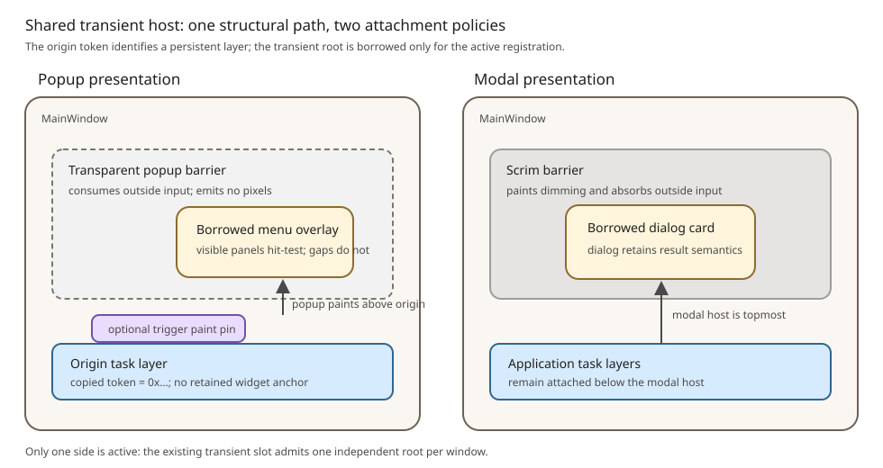

# Roo Windows Transient Surface Hosting and Layer Anchors Design

## Objective

Add design-system-independent framework infrastructure for attaching one
temporary interactive surface to `MainWindow` without creating a `Task`, and
for referring safely to the persistent window layer from which that surface
originated.

The infrastructure provides:

- one shared popup/modal structural host used by legacy dialogs, Material 3
  menus, and later interactive transient presenters;
- atomic admission, attachment, input isolation, focus entry, and teardown;
- copied, pointer-free layer tokens for validating anchors after the initiating
  call returns; and
- a token-scoped path into the existing presentation-pin host for copied
  trigger paint.

**Status: Proposed.** The transient lifetime slot and widget-anchored pin host
exist, but the structural host, active focus-scope entry/exit, layer tokens,
and token-scoped pin path do not.

## Motivation

The existing transient slot makes presenter lifetime and Back routing safe,
but it does not attach a surface, isolate input, manage focus, or own a scrim.
Legacy dialogs still perform that work directly in `MainWindow`; menus would
otherwise duplicate it or misuse route-oriented `Task` infrastructure.

A shared host closes that framework gap once. Pointer-free layer identity also
lets short-lived popup presenters retain copied geometry without retaining the
widget that supplied it.

## Background

### Implemented Foundations

The following contracts already exist:

- [`TransientPresentationSlot`](../../../src/roo_windows/core/transient_presentation.h)
  admits one interactive transient, routes Back/Escape, and guarantees
  detach-before-completion through a presenter-owned registration.
- [`MainWindow`](../../../src/roo_windows/core/main_window.h) owns regular task,
  popup-task, scrim, dialog, and presentation-pin paint layers.
- The legacy [`Dialog`](../../../src/roo_windows/dialogs/dialog.h) uses the
  transient slot but still attaches itself and the scrim through dialog-specific
  `MainWindow` state.
- [`FocusManager`](../../../src/roo_windows/core/focus_manager.h) tracks one
  focused widget and declares `FocusScope`, but the manager does not enter,
  exit, constrain, or restore scopes.
- [`PresentationPin`](../../../src/roo_windows/core/presentation_pin.h) provides
  a layer-scoped, host-owned paint pass for widget-anchored visuals.

The lifetime rules are specified by
[Transient presenter lifetime](../in_progress/transient_presenter_lifetime_design.md).
The focus-scope behavior is already specified by
[Non-touch input](../implemented/non_touch_input_design.md#focus-scope-storage-and-resolution).
Widget- and rect-anchored paint behavior is already specified by
[Transient presentation pins](../in_progress/transient_presentation_pins_design.md).
This design consumes those contracts rather than redefining them.

### Uncovered Framework Gap

No existing design defines:

1. a reusable structural host that combines the transient slot with popup or
   modal attachment, barrier/scrim policy, focus activation, and teardown;
2. a pointer-free identity for a regular-task or popup-task layer; or
3. the exact integration seam that lets an active registered presenter attach
   a copied-geometry pin to that identified layer.

Those three pieces are the scope of this design. Menu rows, placement,
selection, and submenu behavior remain in the
[Material 3 menus design](material3_menus_design.md).

### Task Boundary

The [design glossary](../glossary.md) defines a `Task` as the route-stack owner
for persistent application UI and a transient surface as temporary UI layered
over it. The host does not create, enter, pause, resume, or remove tasks. It
borrows a presenter-owned widget root for one registered presentation.

## Requirements

### Hosting Requirements

1. `MainWindow` owns one reusable `TransientSurfaceHost`.
2. The host admits at most one interactive transient, preserving the existing
   `TransientPresentationSlot` contract.
3. The host supports popup and modal attachment kinds without conflating their
   paint order, scrim, or outside-interaction policy.
4. Admission validates every fallible prerequisite before replacing an active
   presentation.
5. Only `kStarted` attaches the incoming root, enters focus, or permits a pin.
6. The presenter owns the root for the entire presentation; the host borrows
   and detaches it without deleting it.
7. A popup barrier consumes outside input without painting. A modal barrier can
   paint the existing scrim and consumes outside input.
8. Outside policy is one of absorb, dismiss, or presenter-handled. Presenter
   handling uses a virtual hook on the registered participant, not a stored
   callback.
9. Menus replace an active popup presentation but never a modal presentation.
   Legacy dialogs reject every occupied host.
10. Host and presenter destruction use the same idempotent structural teardown
    as explicit dismissal.
11. A component that requires copied-origin validation sets
    `require_origin`; an origin-free component such as the legacy dialog does
    not fabricate a token.

### Focus Requirements

1. Before the host enables input, it enters the active root through the
   intrusive `FocusScope` contract already defined by Non-touch input.
2. Focus remains inside the active scope for request, Tab, and directional
   traversal.
3. Scope entry chooses remembered, preferred, then first eligible focus in the
   order specified by the existing design.
4. Scope exit restores an eligible target from the previous scope without the
   presenter retaining a raw prior-focus pointer.
5. Root detachment, presenter destruction, replacement, and window teardown
   all exit the scope exactly once.

### Layer-Token Requirements

1. A token identifies one currently attached regular-task or popup-task layer
   in one process and contains no pointer.
2. A token is copied by value and is invalid after its layer begins detaching.
3. Tokens are never reused. Exhaustion makes new snapshots unavailable rather
   than wrapping an identity.
4. Validation rejects invalid, stale, detached, and foreign-window tokens
   before transient-slot admission.
5. Snapshot helpers leave their output unchanged on failure.
6. Token issuance and validation allocate nothing and add no state to `Widget`.
7. Validation is a linear scan over top-level layer records. It is a cold-path
   operation and avoids storing a slot index or lookup table.

### Pin Integration Requirements

1. The existing widget-anchored pin API and slider behavior remain unchanged.
2. An active host participant can register at most one presenter-owned pin
   against its validated origin token.
3. A token-scoped pin stores copied geometry and never calls
   `PresentationPin::anchor()`.
4. The host hides the pin before detaching the transient root or vacating the
   slot.
5. Origin-layer detachment invalidates the token, finishes the presentation,
   and removes its pin before the origin root loses its parent chain.
6. Pin allocation failure omits only the optional visual and does not fail the
   interactive presentation.

### Embedded Requirements

1. Do not increase `Widget`, `BasicWidget`, `SurfaceWidget`, `Container`,
   `FocusScope`, or `PresentationPin` size.
2. Keep host active state at or below 32 bytes on the configured 32-bit ABI:
   registration, root, optional active pin, origin token, compact policy, and
   one `FocusScope`.
3. Reuse the existing `Scrim`; the host does not add a second scrim object.
4. Replacing each top-level layer pointer with a layer record adds at most four
   bytes per vector element on the 32-bit ABI.
5. Showing, dismissing, focus entry/exit, token issuance, validation, and host
   attachment allocate nothing. Existing vector growth during task attachment
   and the optional pin allocation remain the only relevant allocations.
6. Paint, hit testing, focus traversal, and token validation add no per-frame
   heap work.

## Design Overview

`TransientSurfaceHost` is a `MainWindow` service, not a component base class.
It coordinates existing primitives while leaving component chrome and results
with each presenter.

```text
MainWindow
├── regular task layers      ← origin token and trigger pin scope
├── popup task layers
└── active transient band    ← one of:
    ├── popup: transparent barrier + presenter root
    └── modal: scrim barrier + presenter root
```

One presentation follows this sequence:

1. The presenter supplies a copied origin token, borrowed root, root rectangle,
   layer kind, admission policy, outside policy, and focus policy.
2. The host validates the origin and resolves its layer root.
3. The host admits the registration through the existing transient slot.
4. On `kStarted`, it attaches the reusable barrier and borrowed root in the
   transient child band, enters focus, then enables input.
5. The presenter can add one optional copied-geometry pin through the host.
6. Every terminal path hides the pin, detaches the root, exits focus, removes
   the barrier, vacates the slot, then delivers completion.



The host shares infrastructure between dialogs and menus at the structural
boundary. It does not make a menu a dialog, add dialog result semantics to the
framework, or introduce an arbitrary transient stack.

## Design Details

### Reusable Transient Child Band

The host is non-widget state. It does not embed another `Container` in
`MainWindow`. Instead, `MainWindow` reserves a transient child band after its
task and popup-task records and directly attaches two borrowed children while
the slot is occupied: the reusable barrier followed by the presenter root.
The root is therefore topmost.

The existing `Scrim` becomes the reusable barrier. In popup mode it hit-tests
but emits no overlay; in modal mode it emits its existing scrim overlay. The
barrier routes outside activation to the host without storing a callback. A
root that occupies the full window for layout, such as a menu overlay, returns
no touch target outside its visible panels. Outside input then falls through
to the barrier and cannot reach lower application content.

The attachment kind determines how the transient child band behaves in
`MainWindow` traversal:

| Kind | Paint position | Barrier paint | Default outside policy |
| --- | --- | --- | --- |
| popup | above task and popup-task roots | none | dismiss |
| modal | above every popup surface | scrim | absorb |

The single-slot contract means popup and modal transient bands are not active
together. The distinct kinds still matter relative to persistent popup tasks,
presentation pins, future non-interactive overlays, and scrim behavior.

### Admission

`kRejectIfBusy` calls `TransientPresentationSlot::show()`. `kReplaceSameKind`
first verifies that an occupant exists with the same attachment kind, then
uses `replace()`. A cross-kind request is `kHostBusy` and never dismisses the
occupant implicitly.

Origin validation precedes both operations. This prevents an invalid incoming
menu from dismissing a valid visible menu. After slot admission, attachment
operations are non-failing. A `kReentrantReplacement` result means completion
opened another presenter; the incoming root remains untouched.

Dialogs use `kRejectIfBusy`. Menus use popup `kReplaceSameKind`. An action that
needs to transition from menu to dialog finishes the menu and opens the dialog
from post-detach completion.

### Focus-Scope Integration

Phase 1 implements the already-specified active-scope operations on
`FocusManager`. The manager stores the active scope pointer. Each focus-owning
task or presenter embeds its `FocusScope`; no history allocation or map is
introduced.

The transient host owns the active presentation's scope record because the
host controls structural attachment. It enters the scope only after the root
is attached and exits after root detachment notifications have cleared any
focused descendant. The remembered prior scope remains valid through its own
intrusive lifetime contract. Exit restores only an attached, visible, enabled,
focusable descendant; otherwise it uses that scope's normal initial-focus
fallback.

### Pointer-Free Layer Identity

Each regular-task and popup-task vector element becomes:

```cpp
struct PresentationLayerRecord {
  Widget* root;
  PresentationLayerToken token;
};
```

`PresentationLayerToken` is an opaque nonzero `uint32_t`. One UI-thread-only,
process-wide issuer increments monotonically and never returns zero or a prior
value. If the issuer reaches `UINT32_MAX`, later layers receive an invalid token
and remain usable except as copied popup origins. The counter is cold-path
state; no atomic or lock is needed under the existing single-UI-thread model.

Validation scans the receiving window's small regular-task and popup-task
record vectors for an exact token match. A token from another window cannot
match because identities are process-unique. Vector reallocation and record
movement do not change a token.

Before layer detachment, `MainWindow` clears the record token, then asks the
host to finish a presentation using it with `kAnchorUnavailable`. Clearing
first makes a reentrant attempt to reopen from the dying layer fail validation.
The layer root is detached only after that finish returns.

### Snapshot Helpers

Framework helpers resolve an attached widget to its top-level layer and copy
the token. Component helpers then add their own immutable geometry and policy.
The framework retains no widget pointer.

Regular-task and popup-task descendants can produce snapshots. The active
transient layer cannot because the first implementation deliberately forbids a
menu nested above a modal dialog or another root transient. A context-point
menu supplies its initiating attached widget for identity and a one-pixel
window-coordinate rectangle for placement.

### Token-Scoped Presentation Pins

The pin host already owns z-order, painting, invalidation, and top-level-root
teardown. The new overload resolves the active host's origin token to the same
root and registers a pin with `anchor_ == nullptr` and the resolved
`z_scope_root_`.

The host keeps the returned raw `PresentationPin*` only as an identity for its
one optional presenter pin; `MainWindow` retains allocation ownership. This
uses the remaining active-state pointer without growing `PresentationPin` or
adding a presenter handle. Widget-anchored pins continue to use `anchor()` and
their existing detach observation. Token-scoped pin implementations use only
copied bounds and paint data.

### Finish Ordering

Every terminal path performs:

1. mark the registration finishing and disable barrier/component input;
2. hide the optional presenter pin and cancel component work;
3. detach the borrowed presenter root and its borrowed children;
4. exit the focus scope and restore an eligible prior target;
5. detach the barrier, invalidating revealed regions;
6. clear root, token, pin, and policy state;
7. vacate the transient slot and become idle;
8. deliver component completion;
9. perform no presenter access after completion.

Presenter destruction suppresses completion as required by the existing
registration contract. Window destruction finishes the active participant
before task/popup roots and presentation pins are destroyed.

### Legacy Dialog Migration

`MainWindow::showDialog()` becomes a compatibility facade that supplies the
dialog registration, centered card rectangle, modal kind, scrim barrier,
focus capture, `kRejectIfBusy`, and outside absorption to the host.

The dialog remains the presenter and owns its callback/result behavior. The
host replaces `active_dialog_`, direct scrim attachment, and
`detachDialog()`; it does not absorb dialog chrome or action semantics.

### RAM Budget

The target-ABI ceilings are:

| State | Ceiling | Accounting |
| --- | ---: | --- |
| process token issuer | 4 B | one cold-path counter |
| top-level layer record delta | 4 B per capacity slot | token beside existing root pointer |
| host active state | 32 B | three pointers, token, scope, packed policy |
| `MainWindow` net fixed delta | 32 B | after removing dialog-specific pointer/state and reusing scrim |
| inactive presenter | 0 B | no host handle or token observer |
| token-scoped pin base delta | 0 B | active host stores identity pointer |

Phase validation records actual padding and vector-capacity effects. Exceeding
a ceiling requires updating this design with the measured trade-off before the
phase lands.

## Proposed API

The host and token plumbing are framework APIs. Components expose their own
snapshot and result types above them.

```cpp
namespace roo_windows {

struct PresentationLayerToken {
  uint32_t value = 0;

  bool isValid() const { return value != 0; }
};

enum class TransientSurfaceLayerKind : uint8_t { kPopup, kModal };
enum class TransientAdmissionPolicy : uint8_t {
  kRejectIfBusy,
  kReplaceSameKind,
};
enum class OutsideInteractionPolicy : uint8_t {
  kAbsorb,
  kDismiss,
  kPresenterHandled,
};

struct TransientSurfaceSpec {
  TransientSurfaceLayerKind layer = TransientSurfaceLayerKind::kPopup;
  TransientAdmissionPolicy admission =
      TransientAdmissionPolicy::kRejectIfBusy;
  OutsideInteractionPolicy outside = OutsideInteractionPolicy::kDismiss;
  PresentationLayerToken origin_layer = {};
  bool show_scrim = false;
  bool capture_focus = true;
  bool require_origin = false;
};

// Add kAnchorUnavailable to the existing start and finish enums.

class TransientPresentationRegistration {
 protected:
  virtual void onOutsideInteraction() {}
};

class FocusManager {
 public:
  bool enterScope(FocusScope& scope, Widget& root);
  void exitScope(FocusScope& scope);
};

namespace internal {

class TransientSurfaceHost {
 public:
  PresentationStartResult show(
      TransientPresentationRegistration& registration, Widget& root,
      const Rect& root_bounds, const TransientSurfaceSpec& spec);
  void detach(TransientPresentationRegistration& registration);

  PresentationPinShowResult showPresentationPin(
      TransientPresentationRegistration& registration,
      std::unique_ptr<PresentationPin> pin);
  void setPresentationPinDirty(
      TransientPresentationRegistration& registration);
  void hidePresentationPin(
      TransientPresentationRegistration& registration);
};

}  // namespace internal
}  // namespace roo_windows
```

Production declarations carry Doxygen comments on every public and protected
contract. Snapshot helpers return `bool`, write the output only on success,
and never expose token internals.

## Implementation Plan

Authoring references:
[embedded C++](../../../.github/instructions/embedded-cpp-code-authoring.instructions.md)
and [widget authoring](../../../.github/instructions/roo-windows-widget-authoring.instructions.md).

### Phase 1: Activate Intrusive Focus Scopes

Code slice:

1. Implement enter, containment, initial-focus, exit, and restoration behavior
   already specified by the Non-touch input design.
2. Integrate scope lifetime with subtree detach, task/popup changes, and the
   current legacy dialog path.
3. Test nested entry/exit, ineligible remembered targets, root destruction,
   passive popups, and reentrant focus changes.
4. Record `FocusManager`, `FocusScope`, task, popup, and dialog ABI sizes.

Proposed commit message:

> Focus scopes Phase 1: activate presenter focus boundaries.
>
> Complete intrusive scope entry, containment, initial focus, restoration, and
> lifecycle coverage required by shared transient surface hosting.

Validation: `bazel test //:focus_manager_test //:dialog_test //:task_test` and
the target-ABI size procedure for focus-owning records.

### Phase 2: Add the Shared Structural Host

Code slice:

1. Add the reusable transient child band, popup/modal placement, barrier/scrim,
   admission policies, and atomic register-then-attach behavior.
2. Route outside interaction through the barrier and registration hook.
3. Implement deterministic finish ordering and revealed-region invalidation.
4. Migrate legacy dialogs without behavior or callback changes.
5. Test admission, replacement reentrancy, outside policies, focus, teardown,
   destruction, and dialog compatibility.
6. Record host and `MainWindow` fixed-size deltas.

Proposed commit message:

> Transient surfaces Phase 2: add the shared window host.
>
> Add reusable popup/modal attachment, barrier and scrim policy, focus-scoped
> teardown, and legacy-dialog migration for temporary interactive surfaces.

Validation: `bazel test //:transient_surface_host_test //:dialog_test
//:transient_presentation_lifetime_test` plus target-ABI host/window sizes.

### Phase 3: Add Layer Tokens and Presenter Pins

Code slice:

1. Replace task/popup root-pointer vector elements with token-bearing records
   and add the non-reusing process issuer.
2. Add snapshot resolution, window validation, pre-detach invalidation, and
   anchor-unavailable finish behavior.
3. Add the active-participant token-scoped pin path without changing widget
   pins or `PresentationPin` size.
4. Test stale, foreign, invalid, detached, exhausted, and reentrant tokens;
   pin failure, ordering, dirtying, and cleanup; and unchanged slider pins.
5. Record layer-capacity, token, host, pin, and representative snapshot sizes.

Proposed commit message:

> Transient surfaces Phase 3: add copied layer anchors.
>
> Add pointer-free layer tokens, pre-detach invalidation, validated presenter
> pins, failure coverage, and target-size evidence for copied popup geometry.

Validation: `bazel test //:transient_surface_host_test
//:transient_presentation_pin_test //:material3_slider_test` plus the
target-ABI record and snapshot size procedure.

## Testing Plan

Focused validation covers active focus-scope lifetime, host admission and
teardown, popup/modal input isolation, dialog compatibility, token issuance and
foreign/stale rejection, origin-layer removal, token-scoped pin ordering and
cleanup, allocation failure, reentrancy, and target-ABI ceilings.

The shared host and layer-token tests use synthetic presenters. Component
rendering and user-visible examples remain with the first consumers: legacy
dialog tests in Phase 2 and Material 3 menu tests/examples in the menu design.

## Caveats

### Rejected Alternatives

#### Use Task for Temporary Surfaces

Rejected because a `Task` owns persistent route and activity lifecycle. A
short-lived popup needs attachment, input isolation, focus, and teardown but no
route stack or activity transitions.

#### Keep Dialog and Menu Attachment Separate

Rejected because both paths need the same slot admission, barrier, focus,
invalidation, reentrancy, and teardown ordering. Component-specific presenters
remain separate above the shared host.

#### Derive the Host or Menu from Dialog

Rejected because dialog chrome, results, centering, modality, and outside
policy are not generic hosting semantics. Sharing occurs below both components.

#### Add an Arbitrary Transient Stack

Rejected by the existing lifetime design. One registered root plus
component-owned nesting keeps Back, focus, and teardown bounded. A later stack
requires a concrete overlapping-root use case and a separate ordering design.

#### Retain the Origin Widget

Rejected because navigation can detach or destroy it. Copied geometry and a
validated layer identity solve the required lifetime without a weak-reference
field on every widget.

#### Use a Pointer as the Layer Token

Rejected because a copied pointer can dangle and an allocator can reuse its
address. The opaque monotonic value has no dereference operation and is cleared
before layer teardown.

#### Pack Slot and Generation into 64 Bits

Rejected because it doubles token and per-layer identity storage and requires
index stability. A 32-bit process-unique identity plus a cold-path linear scan
adds four bytes per layer record and remains stable across vector movement.
Exhaustion rejects new snapshots instead of admitting an ABA match.

#### Add a Separate Rect-Pin Registry

Rejected because the existing pin host already owns paint order, invalidation,
and layer teardown. The token-scoped overload changes only origin validation
and lifetime ownership.

#### Store Outside Callbacks in the Host

Rejected because it adds callback storage and capture-lifetime risk to common
infrastructure. The active registration is already the lifetime participant
and supplies a zero-storage virtual hook.

### Accepted Trade-Offs

1. Each top-level task/popup vector capacity slot grows by one 32-bit token.
2. Token validation scans a small top-level vector on show/reanchor, preferring
   bounded RAM over a lookup table.
3. Process token exhaustion disables new copied-anchor snapshots while leaving
   attached layers and ordinary UI functional.
4. The first host cannot present a menu above an active modal dialog.

## Future Work

1. Add bounded nested-transient admission only after a concrete component
   defines visual, input, focus, and Back ordering for two active roots.
2. Add live reanchoring registration only for a component that cannot use an
   explicit copied `reanchor()` operation.
3. Generalize token-scoped pin multiplicity if a presenter requires more than
   one independently invalidated paint plan.
