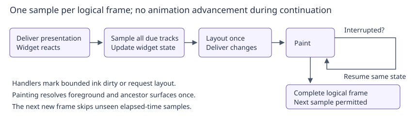

# Widget animation registry

Status: proposed. The [animation survey](../../animation_framework_survey.md)
records current use cases and comparisons. Widget classes can combine this
service with [Presentation notifications](../implemented/presentation_registry_design.md),
but the animation API does not depend on that service.

## Objective

Provide a small shared mechanism for driving widget animations from elapsed
time, with explicit control and safe widget lifetime handling.

## Motivation

A tab indicator moves between selections; an expandable list changes height;
a spinner repeats indefinitely. Each needs regular updates, but their current
timing mechanisms differ. Some schedule private callbacks, while others advance
state during painting or measurement. The latter makes motion speed depend on
how often layout or paint happens rather than how much time has passed.

A second problem is coordinating those updates. Three timers can wake the same
application separately even though the display will paint their results together.
A shared frame driver can update all due animations before one layout and paint.
It should supply timing and common interpolation, while leaving the meaning of
those values with the widget: changing a height and changing a color are different
operations even when both use a fraction from zero to one.

## Background

[ApplicationContext](../../../src/roo_windows/core/application_context.h) borrows
the Environment scheduler. The existing application ticker runs on that scheduler.
The [event-driven redesign](../in_progress/display_event_driven_input_design.md)
replaces reliance on periodic dispatch with explicit deadlines. New animations
must publish their next deadline from the outset, so removing the fallback tick
does not stop an animation after its first frame.

[Interrupted painting](../implemented/interrupted_paint_continuation_design.md)
can spread one logical frame across multiple drawing attempts. A logical frame
is one consistent set of widget values; continuing its paint must not advance
those values midway through the screen.

Existing click animation also handles gesture confirmation and semantic action
delivery after final paint. Those are more than timing concerns and stay in its
current controller. Existing scroll physics already has a time-based model;
it needs frame opportunities, not replacement by a fixed easing curve.

## Requirements

1. Drive finite, repeating, reversing, and custom-time motion independently of
   the number of measurements or paint attempts.
2. Support several animations on one widget and interruption by new input.
3. Apply due updates together before layout, preserving interrupted-frame state.
4. Stop scheduling when there is no runnable animation, using the context scheduler.
5. Let widget classes choose presentation, reduced-motion, and geometry policies.
6. Remove destroyed targets safely, including during another widget's update.
7. Keep ordinary Widget instances unchanged in size; minimize shared RAM, code
   size, and new infrastructure, with no ordinary-frame allocation.

## Design Overview

A **channel** names one independently controlled behavior on a widget. Its key
is `(Widget*, uint16_t tag)`. For example, ScrollableTabs can use tag 0 for the
selection underline and tag 1 for scrolling the tab strip. Different widgets
can both use tag 0: tags are local to a widget, not globally unique names.

A **track** is the registry's stored playback state for a channel. Starting a
track copies a small **specification** describing how time produces values.
A **sample** contains the resulting value and elapsed time. The widget receives
it through virtual `onAnimationFrame(tag, sample)` and applies it to its own
properties. One channel can update several coupled properties; separate channels
are for behaviors that need independent control.

There are two specification kinds. A **value track** interpolates between two
numbers and can repeat or reverse. A **custom-time track** supplies elapsed time
without interpreting it. The first covers an expanding list; the second covers
existing scroll physics or a Material spinner's multi-segment waveform.

The context owns one eager registry. It uses the existing small hash map for
tracks, and contributes one earliest deadline to the application ticker. The
ticker samples all due tracks before layout. There is no timer per track and
no drawing inside the registry. Widgets retain their existing surface ownership
and theme responsibilities.

A progress indicator combines the services explicitly: its presentation hook
starts a custom-time track when shown and cancels it when hidden. An animation
that must continue while hidden can simply do so. This separation satisfies the
policy requirement without hidden/detach settings in every animation record.



## Design Details

### Channels and virtual dispatch

An animation behavior normally belongs to a class, just like its painting or
layout behavior. Use protected virtual no-op hooks on Widget for frame updates
and completion. Widget already has a vtable: two additional slots cost about
eight bytes of shared table storage per concrete class on a 32-bit target, but
zero bytes per instance. Stored function pointers would require callback fields
in each track, static casting thunks, and another dispatch convention. Subclassing
is sufficient for class-specific customization in this initial API.

Tags are small integers. A base class publishes the upper end of its reserved
range; a derived class starts its own tags there and delegates unrecognized tags
to the base hook. This requires coordination within an inheritance hierarchy,
which already shares member names and other behavior. It avoids a static object
and pointer for every global tag. The key is usually eight bytes on a 32-bit ABI
because pointer alignment pads the two-byte tag; it is not claimed to be six.

Controls take `Widget&` and a tag, and always refer to the **current** track on
that channel. Starting the same channel replaces it after validating the new
specification. Invalid input leaves the old track intact. There is no public
instance handle in v1. For a list, “reverse my current expansion” is exactly the
operation wanted; it need not remember which start invocation created it.

This also removes registry IDs and generation counters. Their previous purpose
was to reject a handle from another registry, or one retained after a slot had
been reused. Without public instance handles or reusable slots, that problem
does not exist. Each operation checks that the target belongs to this context.
Callers must keep the Widget reference alive, as with other widget APIs; an old
asynchronous command is not automatically safe to apply to a new channel. Such
application work needs the existing lifetime discipline, not a borrowed pointer
wrapped in an animation handle.

### Playback: from time to a useful value

Consider expanding a panel from height 20 to 100 over 200 ms. At 50 ms the raw
fraction is u=50/200=0.25. Linear interpolation gives 20+(100−20)·0.25=40.
This is useful for motion intended to have constant speed.

**Easing** changes the fraction before interpolation. Quadratic ease-out uses
E(u)=1−(1−u)²: the same 50 ms gives E=0.4375 and height 55. It moves quickly at
first and settles gently near the destination, useful after a tab selection.
Quadratic ease-in uses u², useful for accelerating departures. Smoothstep,
3u²−2u³, starts and ends with zero slope, useful when both endpoints should feel
settled. These inexpensive presets are shared pure functions, not objects stored
per widget. Easing does not change the duration or endpoints.

Cubic Bezier easing specifies a custom curve using control points (x1,y1) and
(x2,y2), with endpoints (0,0) and (1,1). Material motion specifications use such
curves, so supporting it avoids several almost-identical private evaluators.
Time u is the curve's x coordinate; the implementation solves for its parameter
then evaluates y. Use 16 bisection steps and Horner evaluation, with exact
endpoints. Validate x controls in [0,1], y controls in [−4,4], all finite. Values
outside the y interval [0,1] permit intentional overshoot; the receiving widget
clamps properties that cannot overshoot. Bezier costs more than the presets,
so use a preset when it expresses the desired motion. Its target cost is a gate.

A value track has endpoints, a leg duration D, an initial delay, a leg count,
playback mode, easing, and a minimum sample interval. A **leg** is one traversal
between endpoints. Restart mode repeats from the first endpoint; reverse mode
alternates direction. Thus two reverse legs give 20→100→20, while one leg gives
20→100. A zero leg count means indefinite repetition.

After the initial delay, let t be active elapsed time. For D>0, the leg index is
floor(t/D) and its raw fraction is (t mod D)/D. At a finite animation's end use
the last leg with fraction 1, so the exact final endpoint is delivered. On odd
reverse legs the directed fraction is 1−E(u); otherwise it is E(u). The value is
from+(to−from)·fraction. Delay occurs once, not before every repetition. Exact
interior boundaries start the next leg; no repeat callback is synthesized.

Finite zero-duration tracks deliver their terminal value after the delay.
Infinite zero-duration tracks are invalid. Validate finite endpoints, nonnegative
durations/delay/interval, enum values, and representable total duration before
changing a channel. This avoids overflow in duration arithmetic.

Custom-time tracks have only a minimum interval. Their sample contains active
elapsed time and delta since the last delivered sample; scalar/fraction/leg
fields are zero and terminal is false. The first delta is zero. A spinner derives
phase with elapsed modulo its period; analytical scroll physics evaluates its
own state. Missed frames produce one current sample, not a loop replaying missed
steps. Numerical physics clients must bound their own integration work.

All time comes from `roo_time::Uptime` and `Duration`, using signed 64-bit
microsecond differences internally. No Arduino millis clock or private timer is
introduced. Month-long uptime does not wrap a 32-bit millisecond counter here.
No start/replacement counter or wrap-triggered CHECK exists in this design.

### Controls and completion

Control methods update playback intent immediately but deliver no frame hook
synchronously. The next eligible logical frame applies the changed value. This
prevents setters from unexpectedly entering widget update code recursively.

| Operation | Semantics |
| --- | --- |
| start | Validate and replace this channel; active time starts at its first frame opportunity |
| cancel | Remove silently, preserving the last applied widget property |
| pause | Freeze active time at the call; repeated pause does nothing |
| resume | Continue that time from now; does not restart |
| restart | Reset time and first-sample state, retaining whether manually paused |
| seek(t) | Set nonnegative active time including delay, clamped to a finite end; deliver one sample even if paused |
| retarget(to,D) | Start one new value leg from the last applied value to the new endpoint, with no delay; retain easing and paused state |
| finish | Request the exact endpoint for a finite value track, overriding pause for that delivery |

Seek does not itself complete a track. A running track sought to its endpoint
finishes on the following naturally driven frame; a paused one waits for resume
or finish. Restart/retarget discard pending completion. Retarget before the first
sample uses the old `from` value. It preserves position, not velocity; physics
clients retain their own velocity in widget-specific state.

On natural completion or explicit finish, deliver the terminal frame hook,
then remove the track and invoke `onAnimationFinished(tag, reason)` only if that
hook did not cancel, replace, or otherwise control the channel. Removal happens
before the completion hook, allowing it to start a successor on the same tag.
Cancellation and destruction never invoke completion. Custom-time clients cancel
when their own model settles.

Completion means **the final value was applied**, not that its pixels reached
the display. For example, the list can finalize its expansion state here because
layout and paint still follow. A callback that removes the widget immediately
cannot promise that its terminal appearance was seen. Final-paint semantic
completion remains with existing click/transient machinery; a generic final-paint
fence is intentionally excluded from the first API. None of the planned migrations
requires it, and it would add record state and difficult hidden/continuation
completion rules to every implementation.

### Driving frames without periodic polling

There is one application ticker, scheduled on `context.scheduler()`. The registry
exposes core-only `nextFrameDeadline()` and a bounded frame-dispatch interface
described below. No runnable track
means `Uptime::Max()`. Start, resume, seek, restart, retarget, and finish ask the
ticker to reconsider the earliest deadline through a context-bound Application
pointer. Starting on a standalone context without a frame driver returns
`kNoFrameDriver`; a constructed Application supplies the driver even before
start, so manual `Application::refresh()` works.

A due track counts as frame work even when no widget is dirty yet: its hook
can produce that dirtiness. A new track requests an immediate frame opportunity. That anchors active time;
a nonzero delay then contributes exactly its expiry deadline, not a sequence of
polls. After a sample, the next deadline is the earlier of the sample interval
boundary and finite completion. Paused tracks contribute none except a requested
seek/finish sample. A zero interval means the next permitted display frame,
not a same-timestamp rescheduling loop. The default interval is 20 ms.

The event-driven ticker aggregates these deadlines with input, gesture timeout,
and delayed-paint deadlines. The display's existing 20 ms normal-frame spacing
is a throttle: a due animation too early for painting is deferred to that paint
boundary. A 33 ms animation interval can therefore run at 33 ms when the display
is otherwise idle; it is not forced onto a periodic 20 ms grid. Other painting
or slow drawing can delay it. Intervals are minimum spacing, not guaranteed FPS.

On a new logical frame, after input/deferred work, deliver pending presentation
changes, apply due animation samples with one timestamp, then update layout and
paint. Presentation changes from layout are delivered afterward without a second
animation pass. Existing click ordering stays unchanged: its current phase is
not silently moved by adding this new pre-layout pass.

A frame hook's dirty/layout requests are consumed by this frame. They must not
schedule another immediate animation pass. Core dispatch distinguishes work
produced before the current paint from ordinary invalidation still outstanding
after paint, as required by the event-driven redesign. It publishes the next
animation deadline when collecting work at the end of dispatch.

During a paint continuation, do not sample animations. Resume the retained values
and request immediate paint continuation until complete. Ignore overdue animation
deadlines while that continuation owns the frame; after completion, sample the
current time at the next permitted new frame, skipping unseen intermediate
values. Controls can queue new intent meanwhile, but cannot change the retained
sample. Direct widget semantic changes retain the existing invalidation rules.
Cancellation of the last track can leave one already scheduled ticker wake; that
wake observes no work and stops. It must not recreate periodic polling.

The event-driven Phase 5 `requestAnimationFrameAt()` helper remains useful for
unmigrated paint-driven and click animations. New registry consumers do not use
it. Removing the fallback still requires auditing every legacy animation source;
introducing this registry alone does not complete that migration.

### Presentation is a widget policy

An animation can be useful while detached: an owner might prepare a transition
before attachment. Another widget should cancel immediately when it leaves a
page. A third should pause and continue at its old position. Putting a hidden
policy into every track makes these class-specific choices look like a universal
animation eligibility rule and introduces a dependency between the services.

Instead, the widget subscribes to presentation updates and issues ordinary
controls. For example, a spinner cancels on hidden/detached and restarts when
presented. A settling panel pauses on hidden and resumes on presented. Its hook
can inspect `detached_since_delivery` to reset even after a detach/reattach in
one event. The registry itself never queries presentation and has no suspension
policy fields. Destroyed widgets are still canceled by core cleanup regardless
of subscription.

Geometry and reduced motion are also local decisions. The spinner requires
nonempty bounds as well as presentation; it reconciles these conditions in both
its layout and presentation hooks. An expanding list must not suppress itself
merely because its starting height is zero. A widget with both user pause and
presentation pause stores its own reasons and resumes only when both clear.
This small amount of component state is preferable to imposing every possible
pause reason on all tracks.

### Safe map iteration during widget code

A frame hook can delete another animated widget, replace itself, or start a new
channel. A map iterator or reference can then become invalid. This is the problem
that requires additional dispatch state; ordinary hash lookup is not the problem.

Use `FlatSmallHashMap<ChannelKey, Track, ChannelHash>` for ownership and lookup.
At the start of a pass, copy keys into a reusable snapshot vector. Before each
hook, find the key again and copy its sample to the stack. Retain no map iterator
or Track reference across widget code. New tracks are not added to the current
snapshot and first run on the next frame.

Whenever a control changes a channel during dispatch, invalidate its matching
snapshot item, including the current item, before mutating the map. Cancel-all
for a destroyed widget invalidates all its snapshot items before erasing tracks.
After a hook returns, its snapshot item's validity determines whether terminal
completion is still allowed. A replaced track at the same key cannot inherit
that old completion. No generation or monotonically increasing pass ID is needed:
validity belongs only to the current pass and is rebuilt next time.

Reserve snapshot storage during start, before publishing the track. Growth from
a callback can reallocate the vector, so retain only its numeric index across
calls; the pass length stays fixed. The same technique is used for presentation
notifications. Recheck pending presentation changes between animation hooks, so
a preceding hook hiding another widget allows that widget's own policy to run
before its animation update. The core interface makes that sequencing explicit: `beginFrame(now)` builds the
snapshot and stores one timestamp; `dispatchNext()` processes one snapshot item
(including any completion) and reports whether items remain; `endFrame()` clears
the dispatch state. Application delivers pending presentation changes between
those calls, without retaining a target pointer itself. This is frame orchestration,
not an animation API dependency; registry-only tests use the same bounded loop
without a presentation service. Registration during dispatch never extends the
snapshot length. The stored timestamp and cursor are included in the service
budget.

All operations run on the UI thread. Hooks must not recursively paint, refresh,
dispatch, or run the scheduler, and must not destroy the Application on its own
dispatch stack. Defer that destruction through `scheduler().scheduleNow(...)`
and keep the Application alive until then. `executeInUIThread()` is not a
deferral primitive when already on the UI thread. Widget deletion is supported;
code must not access a widget after deleting it.

### Ownership, painting, and resource costs

Store the registry by value in ApplicationContext. Its empty map and snapshot
allocate no element storage. Budget **96 bytes** for the service and **4 bytes**
for the context's borrowed Application driver on the audited 32-bit ABI. Lazy
construction could save roughly 92 bytes in an unused context, at the expense
of a pointer, allocation/header overhead once used, branches, and conditional
shutdown. Together with the presentation service's 96-byte ceiling, eager shared
control costs at most 196 bytes per context. Choose this predictable lifetime
for services expected in normal applications; do not add fields to every Widget.
These are ceilings to verify, not measured sizes.

A Track stores its copied spec, elapsed/anchor/last-sample times, last applied
value, and compact control flags. Budget Track at 128 bytes, channel key at eight,
and snapshot item at 12 on the 32-bit target. Allocated payload is approximately
137b + 12c bytes, where **b** is map bucket count and **c** is snapshot capacity,
plus alignment/allocator overhead. For example b=11,c=4 is about 1555 bytes.
Unused buckets store space for the value too: a flat map is familiar and fast,
but its load factor has a meaningful cost for large records. Report actual
bucket capacities at each workload; do not multiply Track size only by live count.

Let **a** be active track count. Building a snapshot and scanning deadlines cost
O(b+a); each control lookup is expected O(1). Ordinary frames do not walk widget
ancestors. Invalidating snapshot entries for a control during dispatch costs
O(a). If all a hooks control another channel, the pathological cost is O(a²).
At 16 tracks this is at most 256 key comparisons, not 256 easing evaluations.
This straightforward safety technique avoids persistent IDs and a custom slot
allocator. Benchmark this mutation-heavy case explicitly. Hash collisions can
also degrade lookup; this is expected constant time, not a hard constant bound.
Retained capacity makes b reflect previous high-water usage, not only live count.

Use the collection's standard allocation behavior. Growth/registration can
allocate; ordinary sampling, pause/resume, cancellation, and painting cannot.
Do not compact the map on frame or cancellation paths. Reserve snapshot capacity
when registering, and retain it between passes. Core Widget destruction cancels
all channels through `tryContext()`. Derived destructors cancel earlier when
needed. Moving an animated widget requires canceling first. Application stops
the ticker and registries before destroying window/tasks; context stop is
idempotent and expires the lifetime handle only afterward. No teardown hooks run.

The registry never paints or owns a surface. Frame hooks update widget fields
and request bounded invalidation or `requestLayout()`. A height change uses the
normal old/new layout invalidation; moving ink includes old and new decoration
bounds. Unchanged quantized output need not dirty anything. Existing `paint()`
reads state and follows foreground-first exclusion, without preclearing the
background. Nonsurface progress/icons still rely on ancestor surfaces.

### Migration coverage and boundaries

The framework is useful only if it replaces real timing machinery. Each row
below is a required migration or a precise scope boundary, not an assertion that
all components reduce RAM. Links point to the current implementations; the
phases below specify removal work and validation.

| Consumer | Track and retained domain state | Delivery |
| --- | --- | --- |
| [ExpandablePanel](../../../src/roo_windows/material3/list/list.cpp) | Value fraction; retain requested expansion and child measurement | Phase 4 |
| [HorizontalPageHost](../../../src/roo_windows/containers/horizontal_page_host.cpp) | Value page position; retain gesture/slot/cache and settled-index semantics | Phase 5 |
| [Tabs](../../../src/roo_windows/material3/tabs/tabs.cpp) | Value fraction for all indicator edges; retain geometry | Phase 6 |
| [SimpleScrollablePanel](../../../src/roo_windows/containers/scrollable_panel.cpp) | Custom time; retain existing physics and one-shot scrollbar hiding | Phases 7–8 |
| ScrollableTabs | Independent custom-time scroll and value indicator channels | Phase 9 |
| [Material switch](../../../src/roo_windows/material3/switch/switch.cpp), [legacy switch](../../../src/roo_windows/widgets/switch.cpp) | Value thumb motion; click feedback stays separate | Phase 10 |
| [ToggleIconButton](../../../src/roo_windows/material3/button/toggle_icon_button.cpp) | Value selection morph; click-driven morph remains | Phase 11 |
| [Legacy ProgressBar](../../../src/roo_windows/widgets/progress_bar.cpp) | Custom-time repeating phase; retain integer/sentinel API | Phase 12 |
| [TextFieldEditor/TextField](../../../src/roo_windows/widgets/text_field.cpp) | Slow custom-time caret; retain editor binding and password-mask deadline | Phase 13 |
| [SnackbarHost/Presenter](../../../src/roo_windows/material3/snackbar/snackbar.cpp) | Value entry/exit; retain request queue and semantic timeout | Phases 14–15 |
| [Material progress indicators](material3_progress_indicators_design.md) | Custom-time Material waveforms | P2.3, three component commits already specified in that design; required before P2.3 closes |

No existing non-click visual animation in this inventory is deferred as
infeasible. Widgets that merely render ClickAnimation samples, including ordinary
buttons and click state layers, stay unchanged. ToggleIconButton and switches
contain independent motion as well, so excluding click machinery does not exclude
those entire classes. Menus/dialogs have no independent opening animation in the
surveyed code; adding one would be a new feature, not migration debt.

Keyboard auto-repeat, delayed password masking, scrollbar hiding and snackbar
readable timeout remain scheduler work. They change semantic state at a deadline
rather than animate between values. A cursor blink belongs here because it is a
repeated visual state; its long minimum interval avoids treating it as a 50 Hz
animation. The final audit searches the full source tree for timers, time reads,
and paint/measurement self-dirtying to catch drivers omitted from this inventory.

Two existing owners are not Widgets: TextFieldEditor and SnackbarPresenter.
They do not require arbitrary callback pointers. Their existing TextField and
SnackbarHost provide virtual hooks forwarding to the owner under the existing
binding/lifetime rules. Physics similarly needs no new registry feature: one
custom-time track supplies a consistent local clock to the retained model.
The missing notification for snackbar modality is real and is explicitly added
in Phase 14 instead of quietly preserving an animation polling loop.

## Proposed API

Place types in `core/animation_types.h` and service in `core/animation_registry.h`.
The sketch includes stored fields to make resource accounting reviewable; full
public declarations require documented units, defaults, and error behavior.

```cpp
using AnimationTag = uint16_t;
enum class AnimationStatus : uint8_t {
  kOk, kNotFound, kInvalidSpec, kUnsupported, kNoFrameDriver
};
enum class AnimationFinishReason : uint8_t { kCompleted, kForced };
enum class AnimationKind : uint8_t { kValue, kCustomTime };
enum class Playback : uint8_t { kRestart, kReverse };
enum class EasingKind : uint8_t {
  kLinear, kQuadraticIn, kQuadraticOut, kSmoothstep, kCubicBezier
};
struct Easing {
  EasingKind kind;
  float x1, y1, x2, y2; // Used only for cubic Bezier.
};
struct AnimationSpec {
  roo_time::Duration duration, delay, minimum_interval;
  float from, to;
  Easing easing;
  uint32_t legs; // 0 repeats indefinitely.
  AnimationKind kind;
  Playback playback;
  static AnimationSpec value(float from, float to, roo_time::Duration);
  static AnimationSpec customTime();
};
struct AnimationSample {
  roo_time::Duration elapsed, delta;
  float fraction, value;
  uint64_t leg;
  bool reverse, terminal;
};
class Widget {
 protected:
  virtual void onAnimationFrame(AnimationTag, const AnimationSample&) {}
  virtual void onAnimationFinished(AnimationTag, AnimationFinishReason) {}
  // No new fields. AnimationRegistry is a friend.
};
class AnimationRegistry {
 public:
  AnimationStatus start(Widget&, AnimationTag, const AnimationSpec&);
  AnimationStatus cancel(Widget&, AnimationTag);
  AnimationStatus pause(Widget&, AnimationTag);
  AnimationStatus resume(Widget&, AnimationTag);
  AnimationStatus restart(Widget&, AnimationTag);
  AnimationStatus seek(Widget&, AnimationTag, roo_time::Duration);
  AnimationStatus retarget(Widget&, AnimationTag, float, roo_time::Duration);
  AnimationStatus finish(Widget&, AnimationTag);
  bool contains(const Widget&, AnimationTag) const;
  void clearTarget(Widget&); // Silent; also used by Widget destruction.
 private:
  struct ChannelKey { Widget* target; AnimationTag tag; };
  struct Track {
    AnimationSpec spec;
    roo_time::Uptime anchor;
    roo_time::Duration elapsed_at_anchor, last_sample_elapsed;
    float last_value;
    uint8_t flags; // paused, anchored, sampled, seek pending, finish pending.
  };
  struct DispatchItem { ChannelKey key; bool valid; };
  ApplicationContext& context_;
  roo_collections::FlatSmallHashMap<ChannelKey, Track, ChannelHash> tracks_;
  std::vector<DispatchItem> dispatch_;
  roo_time::Uptime frame_time_;
  size_t next_item_;
  bool dispatching_, stopped_;
  // Core-only nextFrameDeadline(), beginFrame(now), dispatchNext(),
  // endFrame(), stop().
};
// ApplicationContext owns AnimationRegistry animations_ and borrows
// Application* frame_driver_; accessor: AnimationRegistry& animations().
```

Defaults are one value leg, no delay, linear easing, and 20 ms minimum interval.
`customTime()` clears unused value fields; reject contradictory value-only
settings for a custom track. Custom tracks reject retarget/finish. Missing or
wrong-context channels return kNotFound; invalid specs return kInvalidSpec.
Stopped services reject start and treat controls as not found. Allocation failure
follows existing roo collection conventions rather than claiming recoverability.
No default-tag overload is needed: `0` is explicit and inexpensive.

For example, an expandable panel starts
`animations().start(*this, kExpansion, AnimationSpec::value(fraction_, 1, duration))`.
Its frame hook checks the tag, assigns `sample.value` to `fraction_`, and requests
layout when the measured height changes. A second input uses retarget to head
back toward zero from the last applied fraction. Paint remains independent of
elapsed-time calculations.

## Implementation Plan

Follow [embedded C++](../../../.github/instructions/embedded-cpp-code-authoring.instructions.md)
and [widget authoring](../../../.github/instructions/roo-windows-widget-authoring.instructions.md).
Each phase is one commit with its tests and examples/docs. Presentation is needed
for consumers that subscribe, not for the registry or its pure timing tests.

### Phase 1: evaluation

**Commit: `Define time-based animation samples and easing`.** Add specification
validation and pure evaluators, with documented formulas. Test exact endpoints,
reverse parity, finite/infinite and zero duration, nonfinite inputs, overflow,
month-long uptime, and Bezier error below 0.5 pixel at 568 px extent. No start API
is exposed yet.

### Phase 2: shared driver and safe dispatch

**Commit: `Drive widget animation channels from explicit frame deadlines`.** Add
the eager map-backed service, virtual hooks, snapshot mutation safety, finite
and custom-time start/cancel, completion, teardown, and ticker integration.
Add a two-channel catalog example. Test callback replacement/deletion/growth,
independent applications, empty-registry sleep, initial delay, manual refresh,
and paint continuation with the periodic fallback disabled in a test fixture.
Run focused ASan/UBSan and existing click/continuation tests. Unimplemented
controls and repeat modes return kUnsupported without changing state; do not
silently accept them.

### Phase 3: controls

**Commit: `Add animation playback and interruption controls`.** Enable repetition,
reverse, pause/resume, restart, seek, finish, and retarget with catalog controls.
Cover invalid replacement, callback control suppressing stale completion,
seek-to-end behavior, large time jumps, and steady-allocation checks. All API
semantics must work before migrating a production widget.

### Phase 4: layout and presentation consumer

**Commit: `Animate expandable lists through the shared registry`.** Replace
ExpandablePanel's measurement-count advancement with elapsed-time values. Use
its presentation hook for pause on hidden, resume on presented, and cancellation
on detach (snap to requested final state on subsequent presentation). Preserve
its public API and duration. Update list documentation/example; test zero-height
start, rapid reversal, navigation detach/reattach, old/new bounds and patterned
ancestors with existing list tests and goldens. Progress integration remains P2.3.

### Phase 5: page settling

**Commit: `Drive horizontal page settling with a value track`.** Migrate
HorizontalPageHost to one 180 ms quadratic ease-out position track with its
existing 10 ms minimum interval (the display throttle still applies). Remove
its Executable base, scheduler reference, notification ID, start/end timestamps,
and rescheduling methods. Keep target/settled indices, active slots, page caches,
and gesture admission. The frame hook applies page position and existing bounded
position/layout invalidation. Completion performs existing index settlement and
notification, as its last action because user code can delete the host.

A new drag cancels at the last applied position. New programmatic settling starts
from that position; page replacement cancels before detaching children. Hidden
hosts pause; on re-presentation resume; detachment cancels and silently reconciles
to the selected target before reuse. No semantic callback runs inside presentation
delivery. Update page-host design/example. Test drag interruption, slot recycling,
rapid target changes, callback deletion, hidden resume, and slow display with page
host state/rendering tests and goldens.

### Phase 6: tab indicator

**Commit: `Animate tab indicator geometry through a tagged value track`.** Use
Tabs' base-class `kIndicator` tag for a 0→1, 200 ms quadratic ease-out track,
retaining the 10 ms minimum interval. Its sample interpolates all rectangle edges
together; the widget keeps start/current/target rectangles because the registry
does not own geometry. Remove indicator timestamps and its ticket/reschedule path.
A new selection captures the current rectangle and replaces the fraction track.
Layout changes update the target rectangle as today. Hidden or detached tabs
cancel and snap to the selected item's geometry without invoking application code.

Reserve and document the tag range for ScrollableTabs. Until Phase 9 its scroll
Executable path remains; no indicator callback is routed through it. Update tabs
example/design and test rapid selection, resize, RTL, selected item removal,
patterned-background restoration and unchanged click activation timing.

### Phase 7: reusable physics time input

**Commit: `Give scroll motion an explicit duration-based clock`.** Change the
shared scroll_motion evaluator's timestamp parameters and stored timestamps from
platform-width unsigned long to signed 64-bit millisecond values. Keep fling,
resistance, spring-back and programmatic equations unchanged. Temporarily adapt
existing callers with Uptime milliseconds so this commit builds independently.
Test trajectories, phase transitions and long-uptime arithmetic in the pure
motion tests; record the state-size delta. Document that all times in one motion
must share an epoch. This closes the clock decision before the consumers migrate.

### Phase 8: scrollable panel motion

**Commit: `Drive scrollable panel physics from custom-time samples`.** On fling,
spring release, or programmatic motion, initialize the existing model at time
zero and start a custom-time track at the existing 10 ms interval. Feed sample
elapsed milliseconds to tick; model-internal spring transitions keep that same
epoch. Cancel when needs_tick becomes false. New touch-down cancels the track
before handing control to the drag model. A replacement motion resets both model
and track to zero; do not mix wall-clock timestamps with track elapsed time.

Remove the motion scheduling branch from SimpleScrollablePanel. Keep a single
one-shot for delayed scrollbar hiding, scheduled at the existing hide deadline;
this is delayed semantic work, not an animation. It must not tick physics. Hidden
or detached panels cancel motion and clamp to legal current geometry; hide the
scrollbar and cancel its pending hide ticket. They do not resume a stale fling.
Preserve child ownership and overscroll drawing. Update scrolling example/design;
test fling-to-spring, drag interruption, geometry changes, hide deadline, and no
wakes after settling with motion and scrollable-panel suites.

### Phase 9: scrollable tabs and concurrent channels

**Commit: `Drive tab-strip scrolling alongside indicator animation`.** Apply the
same custom-time clock convention to ScrollableTabs' `kScroll` tag, outside the
base Tabs tag range. Forward other frame/finish/presentation hooks to Tabs.
Remove scroll_notification_id, scheduler reference and remaining Executable
inheritance once neither tabs class needs them. Keep the motion model and the
selected-item visibility policy. Selection can start the indicator and scrolling
channels concurrently; interrupting drag cancels only scrolling. Hidden/detached
strips cancel physics and clamp, while the base hook snaps the indicator.

Update the tabs example to exercise simultaneous selection/scrolling. Test both
channels on one frame, independent cancellation, repeated ensure-visible calls,
RTL, re-layout and click behavior. This is the required multi-channel acceptance
case, not an optional future migration.

### Phase 10: switch thumb motion

**Commit: `Move Material and legacy switch motion out of paint`.** Migrate both
switch classes' local thumb transitions to value tracks, preserving 100 ms
Material and 120 ms legacy durations and their existing animated versus immediate
setter behavior. Keep logical on/off state and a compact applied thumb fraction;
remove masked timestamps, elapsed helpers and animation-only paint self-dirtying.
Retarget rapid toggles from the current fraction. Hidden/detached switches cancel
and snap to logical state. Click feedback, activation ordering and overlay focus
remain with ClickAnimation; overlay geometry reads the same applied fraction as
paint. Update both examples and run switch unit/golden coverage, including programmatic
setters, rapid toggles, zoom, shadow restoration and click coexistence. Record idle
size and active-record cost rather than assuming a memory saving.

### Phase 11: toggle-icon selection morph

**Commit: `Drive toggle-icon selection morph with a value track`.** Migrate only
the independent 100 ms selection-transition clock. Keep the existing from-pressed
choice and class-specific corner interpolation; use a sampled 0→1 fraction in
place of the masked timestamp. Retain the rendering precedence of click-driven
morph, pressed appearance, then selection morph. The selection clock continues
while click appearance takes precedence, matching current elapsed-time behavior;
it does not take over the click controller. Hidden/detached widgets cancel and
snap to selected rest geometry. Remove selection-only paint advancement, keeping
bounded surface invalidation in the frame hook. Update toggle-icon example/design
and test programmatic selection, release-to-rest, click overlap, rapid selection
and restoration of shrinking corners.

### Phase 12: legacy progress

**Commit: `Drive legacy progress marquee from shared elapsed time`.** Preserve
ProgressBar's integer/sentinel public API, dimensions and colors. Replace millis
in paint with a stored phase derived from custom-time elapsed modulo 1424 ms,
retaining its existing waveform calculation. Subscribe while indeterminate;
hidden/detached/empty bounds cancel, and re-presentation starts at phase zero.
Remove paintWidgetContents when its only purpose was to self-dirty the marquee.
Add deterministic phase and background-restoration tests and update its example.
Document the intentional change from global-uptime phase to per-presentation
phase. Material progress remains a separate component, not an API replacement.

### Phase 13: caret blinking

**Commit: `Drive the active text caret with a sparse animation track`.** The
shared TextFieldEditor is not a Widget; register the channel on its currently
bound TextField, whose frame hook forwards internally to that editor only while
it is still the bound target. Keep cursor-on state in the shared editor, avoiding
per-field animation storage. Use a custom-time interval equal to the existing
blink half-period, and derive on/off from elapsed parity. Focus acquisition and
editing restart at visible phase zero; focus loss, unbinding, hiding or detachment
cancel before releasing the target. Rebinding cancels the old field's channel.

Remove cursor_blinker and last_cursor_shown_time. Keep the one-shot last-glyph
hider: password masking is a deadline, not repeated motion. Update editor docs
and the text example. Test focus transfer across tasks, restart on editing,
missed blink boundaries, hide/show, target destruction, and no 20 ms polling for
a slow caret. Existing password-reveal timing must remain unchanged.

### Phase 14: snackbar pause notifications

**Commit: `Notify snackbar hosts when transient activity changes`.** Snackbar's
current 20 ms loop also discovers modal and focus changes. Removing only its
motion calculations would leave that poll in place. Add narrowly scoped opt-in
activity observation to TransientPresentationSlot: a borrowed Widget key in a
FlatSmallHashMap and a protected no-op `onTransientActivityChanged(bool)` hook.
Observe/unobserve are idempotent and require attachment to the same window.
Core subtree detachment removes affected registrations before unlinking; Widget
destruction also removes its registration while the root is reachable. A
reattached host subscribes again when it has a current request.
Notify only changes in hasActivePresentation, after admission/release state is
consistent. Coalesce through application dispatch and use a retained pointer
snapshot with unsubscribe invalidation, as in presentation delivery. Hooks run
before the animation pass, cannot invoke application callbacks or mutate the
hierarchy, and shutdown clears registrations silently. No periodic timer is added.
Budget 96 bytes of slot control and nine bytes per allocated observer bucket
plus snapshot storage; include this separately in the final target report.

SnackbarHost registers only while it has a current request. Its presentation and
layout hooks handle visibility and empty target geometry. Internal action/dismiss
button subclasses forward onFocusChanged to their owning snackbar to update
readable-time pause immediately, then delegate to the base hook. Keep these as
internal subclass hooks, without adding a general focus-listener service. Document
these contracts in the transient and snackbar designs in this commit. Test modal
open/close/replacement, focused button removal, unsubscribe/destruction and pause
with no recurring wake. This is an explicit migration prerequisite, not an
assumption that presentation notifications include modality or focus.

### Phase 15: snackbar motion and timeout separation

**Commit: `Separate snackbar animation tracks from readable-time deadlines`.**
Register a value track on SnackbarHost, whose hooks forward to its owned presenter.
Use offset 1→0 over 150 ms for entry and current offset→1 over 100 ms for exit,
linear at 20 ms minimum spacing. Starting exit during entry deliberately starts
from the applied offset instead of jumping to zero. Remove phase_ms, last_ms and
the 20 ms scheduling loop. Keep queue ownership, phase, offset, dismiss reason
and request lifetime logic in the presenter. Completion of entry starts readable
time; completion of exit invokes the existing finish path as the last action,
since its callback can delete the host. Applied completion matches the current
exit path, which already finishes before painting the terminal offscreen pose;
no generic final-paint fence is required.

Keep one semantic timeout executable with remaining readable duration and an
Uptime anchor. Arm it only during unpaused visible phase, at the full remaining
4 s/10 s deadline; persistent requests have none. Before each pause transition,
subtract elapsed eligible time once and cancel the deadline; resume arms the
remaining duration. Modal/hidden/empty conditions pause both motion and readable
time; action/dismiss focus pauses only readable time. The hooks from Phase 14
reconcile these reasons. Expiry requests exit after reconciling current state;
a newly expired timeout never invokes application code from a lifecycle hook.
Detach keeps the existing synchronous queue cancellation contract. Replacement,
disable-animation and destruction cancel the channel and deadline before queue
callbacks. Preserve the presenter's lifetime guard and terminal-call discipline.

Update snackbar design/example and run queue, focus, modal, animation-disable,
replacement, callback-deletes-host, obstacle and paint-cleanup tests/goldens.
Explicitly test long hidden/modal intervals with zero repeated timer executions,
remaining-time resume and exit during entry. One deadline remains for semantic
timeout; no private frame driver remains.

### Phase 16: resource and migration acceptance

**Commit: `Record animation framework resource costs`.** Measure 0/1/4/16/64 tracks,
actual bucket counts, retained capacity, map churn, mutation-heavy callbacks,
linear/Bezier CPU, object text+rodata and compiler stack evidence. Require the
stated sizeof ceilings, zero ordinary-frame allocations, at most 16 KiB new
registry/evaluator text+rodata, at most 384 bytes in a new dispatch stack frame,
and under 2 ms for 16-track evaluation including worst-case snapshot invalidation
on the Phase 1 target (excluding widget work/paint). Cross-build without RTTI or
exceptions. Failures require correction or a reviewed design amendment, not an
undocumented container substitution. Record baseline and commands in a report. Include the consumer deletion inventory,
per-class idle sizeof deltas, peak active heap, and before/after linked text+rodata
for the same mixed-widget application. Show removed executable bases, scheduler
references, tickets, timestamps and paint-time update paths separately from new
widget properties, lifecycle hooks and shared registry costs. Centralization is
not proof of a RAM or flash reduction: switches in particular previously used
only a packed timestamp. Report increases explicitly.

Require every existing non-click visual driver in the migration table to be
removed, all listed semantic timers to be documented, and zero recurring
animation-originated wakes in a settled application without caret/spinner or
semantic timed work. The application-wide touch-poll fallback is owned by the
separate event-driven-input design and is not an animation wake. The Phase 16
target review replaces the original nonpositive migration-size hypothesis with
a 16 KiB text+rodata ceiling for the complete mixed-widget fixture against a
baseline already linking the registry. The measured 14,478-byte increase and
its attribution are recorded in the
[acceptance report](../../animation_registry_acceptance.md); centralization is
not presented as a flash saving. A failed code-size gate requires simplification
or another reviewed budget amendment, not a claim that fewer source lines
suffice. Do not move the design to implemented with an unfinished migration
hidden in Future Work.

## Testing Plan

Pure timing tests establish playback semantics. Registry tests exercise mutation,
lifetime, deadlines, and stopped behavior. Slow-display tests verify frozen
continuations. Each migration runs its component tests and examples, including concurrent
scroll/indicator channels, click coexistence, text binding, and snackbar timeout
semantics. A mixed-widget fixture validates shared scheduling, hidden/settled
idleness, and bounded paint writes. Target comparisons verify removed consumer
machinery as well as shared RAM, code size, stack and CPU costs.

## Caveats

### Rejected Alternatives

#### One animation per widget

This gives the smallest key and simplest hook. ScrollableTabs already has two
independent motions, so the restriction would force helper widgets or a second
private scheduler. A small integer tag adds little and solves that concrete case.

#### Function callbacks and global tags

Function pointers are useful for runtime-selected behavior and independently
composable helpers; globally unique tags avoid inheritance coordination. Here
behavior is class-defined, virtual hooks match the widget authoring pattern,
and integer tags keep identity local. We accept explicit base/derived tag-range
coordination instead of storing redundant callbacks and static tag objects.

#### Stable slots, generation handles, and custom pools

Stable slots permit direct indexed access and avoid flat-map spare-value storage.
Generation handles can reject old asynchronous commands. They also require
slot/free-list lifetime rules, cross-registry identity, generation exhaustion
policy, and more API state. Current widgets want to control their current named
behavior. A familiar small hash map plus a per-pass snapshot solves the actual
mutation problem without permanent IDs or wrap checks. Its bucket RAM and rare
quadratic snapshot invalidation are explicit costs, not free improvements.

#### Embedded track objects or lazy services

An embedded track offers deterministic storage and no registration allocation,
but every capable widget pays even when idle. A lazy shared service saves unused
context RAM but complicates access/lifetime for a feature expected in most apps.
Eager services with sparse records keep base widgets unchanged and make ownership
ordinary. Measurements include empty applications so that this tradeoff remains
visible.

#### Registry-owned presentation policies

Built-in pause/restart policies make simple spinner setup shorter and can prevent
forgotten cleanup. They also couple two services and need exceptions for hidden
work, geometry-driven expansion, and multiple pause reasons. Explicit widget
hooks keep these decisions where their meaning is known. The cost is a small
amount of lifecycle code in participating classes, demonstrated by the consumers.

#### Final-paint completion, timelines, and property reflection

These enable sophisticated sequencing and binding. Final-paint completion is
particularly valuable before a semantic action removes a widget. Existing click
machinery already supplies that contract; the planned generic consumers only
need applied-value completion. Defer these features rather than requiring every
implementation to handle completion fences, property lifetimes, and composition
graphs before it can animate a list.

#### A scheduler executable per track

Private timers offer independent cadence and straightforward local code. They
also duplicate scheduling state and can update values between pieces of one
paint. Shared deadline collection and one pre-layout pass fit this display's
coherent-frame requirement, while retaining per-track minimum intervals.

## Future Work

Click migration requires a separate final-paint/gesture design. Existing non-click
visual drivers are covered by the required implementation phases above; new menu,
dialog and animated-icon transitions are future features. Semantic deadlines
remain with their owning components. Add instance
handles, physics helpers, timelines, or runtime callback adapters only when a
consumer demonstrates a need that the smaller API cannot express.
