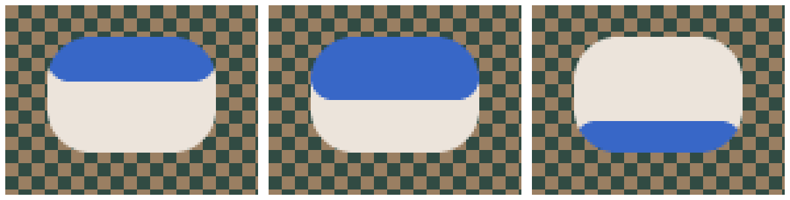

# Sparse rounded child clipping prototype

## Result

A scrolling row can meet its container's rounded edge with smooth coverage,
while its ordinary paint code runs once. This prototype is on
`prototype/rounded-child-clipping`. It implements the output interception idea
from the conversation.



The pictures are actual test output. The selected row has its own rounded
corners; the parent clips both its flat fill and its antialiased decoration.
The checkerboard remains visible through fractional coverage.

## How it works

The [existing renderer](../implemented/paint_context_design.md) traverses
foreground first, retains translucent decorations as overlays, and excludes
settled pixels from subsequent output. The prototype adds three decisions to
that path:

| Parent coverage | Child output |
| --- | --- |
| Zero | Discard it. |
| Full | Forward it through the existing renderer. |
| Fractional | Accumulate its color in a sparse boundary array. |

The array contains unmasked content. Suppose a selected row contributes color
`S` with its own coverage `b`, over panel color `P`. The saved boundary color
becomes `C = b*S + (1-b)*P`. When the backdrop `B` arrives, parent coverage `a`
is applied once: `a*C + (1-a)*B`. Multiplying each child contribution by `a`
independently would give a different result where layers overlap.

[The implementation](../../../src/roo_windows/core/rounded_clip.cpp) wraps
`DisplayOutput`, so ordinary streamed writes, sparse pixels, and rectangles
all use the same rule. Fully covered rectangles bypass boundary processing.
Cached row geometry distinguishes exterior, fractional, and opaque pixels
without a square root in the output routing path. Geometry setup uses the
same coverage routine as `Decoration`.

Child decorations are deferred raster overlays, so output interception alone
would miss them. Registering an overlay also samples its fractional boundary
contributions into the array. Its retained raster wrapper then contributes
only to fully covered interior pixels. This samples raster data; it does not
call a child's paint function again.

When a container finishes, one retained decoration resolves its boundary
colors over the panel background, then applies the existing outline and shadow
rasterization. It stays deferred until the lower scene supplies the backdrop.
Boundary pixels therefore reach the display only with their settled color.
Nested rounded containers use the same rule: each completed inner boundary
becomes a contribution to the enclosing scope.

On a fresh logical paint, clean contributors are marked for reconstruction
as the traversal reaches them. There is no preliminary traversal of the
children. Interrupted paints retain colors, overlays, and completed child
progress. A mutation between attempts conservatively restarts the image;
previous output belongs to the superseded scene.

## Trying it

Material 3 `MenuPanel` opts in on this branch. An ordinary container opts in by
overriding `clipsChildrenToRoundedBounds()`; its border supplies the radii and
outline. No changes are needed to the children.

The [scrolling example](../../../examples/material3/menus/rounded_scrolling/rounded_scrolling.ino)
uses selected Material rows over a patterned backdrop. Run from `roo_windows`:

```sh
bazel run //examples/material3/menus/rounded_scrolling:rounded_scrolling
```

Drag the list vertically. The example is included in the existing Material 3
example build group. Its emulator build has been checked; touchscreen behavior
on physical hardware has not been measured.

## RAM

Colors and geometry scale with corner radius, rather than panel area. These
are measured capacities for four equal radii, without an outline:

| Radius | Color bytes | Geometry + color capacity |
| ---: | ---: | ---: |
| 8 | 112 | 292 |
| 16 | 320 | 660 |
| 24 | 512 | 1,012 |
| 32 | 624 | 1,284 |
| 64 | 1,344 | 2,644 |

These figures are **not the total renderer overhead**. The ESP32 RISC-V
cross-compiler measured the following object sizes:

| Item | Bytes |
| --- | ---: |
| Nullable pointer in retained `ClipperState` | 4 |
| Shared arena, allocated when rounded clipping is first used | 56 |
| Record per retained rounded container | 76 |
| Replacement decoration per rounded container | 100 |
| Raster wrapper for a child overlay that meets a clip edge | 24 |
| Output adapter on the stack per active rounded scope | 40 |

The replacement decoration includes the ordinary surface decoration data; its
size is not a net delta against the old decoration pool.

The target compiler's `-Os -fstack-usage` report gives 128 bytes for the mixed
rectangle routine, plus its callees. Its initial implementation used 368 bytes;
direct emission of coalesced runs removed the large temporary batch. These are
individual function frames, not a complete worst-case paint stack measurement.

Arena vectors also retain their pointer capacity. Radius 16 requires 836 bytes
for its arrays, record, and replacement decoration, before the shared arena,
pointer slots, allocation metadata, and extra exclusion rectangles. `Widget`
remains 24 bytes and `Container` 44 bytes on that ABI, unchanged from the base
commit. The [size probe](../../../benchmarks/rounded_child_clip_size_probe.cpp)
records the measured types.

For simplicity, clipped exclusions are coalesced horizontal runs in the
existing rectangle list. This adds up to O(radius) rectangle entries for a
rectangle crossing a corner; each box costs 8 bytes, plus vector spare capacity.
Many overlapping widgets can multiply that cost. A compact shape-aware
exclusion representation is a useful next optimization.

The arena and geometry/color arrays retain their peak capacities for reuse.
First use or increased requirements can allocate. Reusing unchanged boundary
geometry allocates nothing in the dedicated test. There is no full framebuffer,
corner-square color buffer, or area-sized coverage mask.

## CPU and allocations

The resource test uses a 240×160 ARGB8888 memory display, a 192×128 panel with
radius 16, and five rounded rows. It invalidates the whole panel for 200
measured refreshes after warming the renderer. These are host CPU measurements;
they exclude a physical display bus and are not ESP32 timing estimates.

Three isolated runs using thread CPU time produced:

| Run | Clipping off (µs/frame) | Clipping on (µs/frame) | Added CPU (µs/frame) |
| ---: | ---: | ---: | ---: |
| 1 | 73.00 | 101.53 | 28.53 |
| 2 | 105.35 | 124.27 | 18.92 |
| 3 | 68.13 | 102.22 | 34.09 |

The median times are about 73 and 102 µs/frame. Treat these as a small host
characterization, not a stable performance guarantee; even CPU time varies
with processor frequency and cache state. The test prints wall time separately.
Mixed fills coalesce opaque scanline runs and visit only fractional samples;
fully exterior spans are dropped without scanning their pixels. Geometry setup
still scans corner regions (O(radius²)), but reuses unchanged geometry.

The first refresh requested 1,696 bytes in 18 allocations without clipping,
and 3,596 bytes in 33 allocations with clipping. This is cumulative requested
memory during that call, not retained heap or peak RAM. Both warmed paths made
one existing 480-byte allocation per frame. The prototype added no warmed
allocations in this scene; this is not a general allocation-free renderer claim.

To reproduce the optimized measurement:

```sh
bazel test //:rounded_child_clip_resource_test -c opt \
  --per_file_copt='external/roo_testing.*/.*@-Wno-error=stringop-truncation' \
  --runs_per_test=3 --local_test_jobs=1 --test_output=all
```

The warning override is needed for an existing `roo_testing` Wi-Fi shim warning
with this host GCC. It does not change the prototype code.

## Validation and limits

[Pixel tests](../../../test/rounded_child_clip_test.cpp) compare every output
pixel with independently composed parent and child raster layers. They allow
two 8-bit color levels for blend rounding. They also count child paint calls
and physical display writes. Covered cases include scrolling, nested clips,
a higher sibling, descendant press feedback, a patterned backdrop, all six
output entry points, translucent overlays, outlines (including an outline
matching the fill), shadows, clean foreground reconstruction, continuation,
and mutation during continuation. Geometry tests
include asymmetric radii, fractional outlines, and very small bounds.

The tests assert one child paint per completed scene and no repeated physical
writes for a scene's settled pixels, including unchanged continuation attempts.
Test output includes PPM frames used for the illustration above.

Validation completed:

- All 102 root regression test targets passed in the optimized build.
- The final span/stack optimization and matching-outline fix passed the six
  focused clipping, resource, menu, menu-golden, decoration, and overlay targets.
- The clipping and menu targets passed with AddressSanitizer.
- The scrolling example compiled for the emulator and is in example build coverage.
- The new routing implementation compiled with the ESP32 RISC-V compiler using
  `-fno-exceptions -fno-rtti`; object sizes and selected stack frames were measured.

The sanitizer command is:

```sh
bazel test //:rounded_child_clip_test //:material3_menu_test --config=asan
```

The reviewed cascading-menu golden changes five pixels by one ARGB4444
quantization step following the changed composition path. The other menu golden
is unchanged.

This is a prototype with a deliberately narrow supported contract:

- Use an opaque, enabled clipping owner with feedback on its children. Owner
  ripple and disabled-group composition remain unsupported.
- The rounded scope clips all descendant output, including children marked
  `kUnclipped`. Escaping content should live outside that scope in this version.
- Direct writes follow the widget-authoring opaque-output contract; arbitrary
  destination-dependent blend operations are outside the prototype.
- Blit caching and immediate child-shadow shortcuts are disabled inside a
  rounded scope. They need separate integration before those optimizations can
  be retained.
- A mutation during an interrupted paint restarts the image. Selective
  continuation repair for captured boundary colors is future work.
- Allocation failure behavior follows the existing vector/new usage. A bounded
  pool or explicit RAM budget has not been added.

The next engineering step is to measure real scrolling menus on the target
board, especially exclusion-list growth and display command overhead. The
current prototype establishes single traversal and smooth composition, while
keeping the remaining costs visible.
