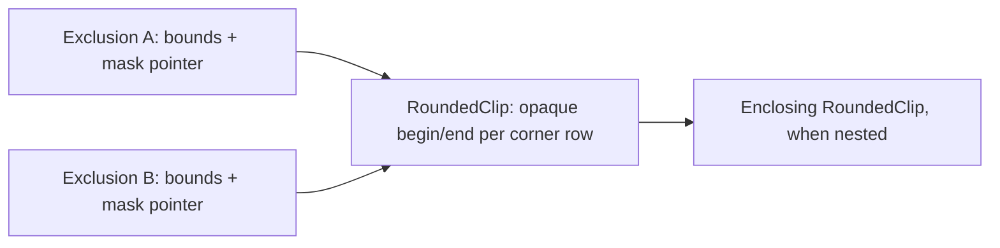

# Sparse rounded child clipping prototype

The [production plan](../in_progress/rounded_child_clipping_design.md) tracks
remaining work. P0 integrates this prototype with synchronous refreshes on
2026-10-05: traversal checkpoints and interruption repair are removed. Historical
measurements below identify the earlier implementation; current costs are in
[Synchronous integration](#synchronous-integration),
[Bounded subtraction P1](#bounded-subtraction-p1), and
[Owner effects P4](#owner-effects-p4).

## Result

A scrolling row can meet its container's rounded edge with smooth coverage,
while its ordinary paint code runs once. Direct children explicitly marked
`ParentClipMode::kUnclipped` can now escape that rounded edge: the container
paints them as a foreground group before its clipped children and surface. The
same unclipped-above-clipped stacking rule applies to containers without
rounded clipping.


The pictures are actual test output. The selected row has its own rounded
corners; the parent clips both its flat fill and its antialiased decoration.
The checkerboard remains visible through fractional coverage.

## How it works

The [existing renderer](../implemented/paint_context_design.md) traverses
foreground first, retains translucent decorations as overlays, and excludes
settled pixels from subsequent output. The prototype adds three decisions to
that path:

| Parent coverage | Child output |
| --- | --- |
| Zero | Discard it. |
| Full | Forward it through the existing renderer. |
| Fractional | Accumulate its color in a sparse boundary array. |

The array contains unmasked content. Suppose a selected row contributes color
`S` with its own coverage `b`, over panel color `P`. The saved boundary color
becomes `C = b*S + (1-b)*P`. When the backdrop `B` arrives, parent coverage `a`
is applied once: `a*C + (1-a)*B`. Multiplying each child contribution by `a`
independently would give a different result where layers overlap.

[The implementation](../../../src/roo_windows/core/rounded_clip.cpp) wraps
`DisplayOutput`, so ordinary streamed writes, sparse pixels, and rectangles
all use the same rule. Fully covered rectangles bypass boundary processing.
Cached row geometry distinguishes exterior, fractional, and opaque pixels
without a square root in the output routing path. Geometry setup uses the
same coverage routine as `Decoration`.

Child decorations are deferred raster overlays, so output interception alone
would miss them. Registering an overlay also samples its fractional boundary
contributions into the array. Its retained raster wrapper then contributes
only to fully covered interior pixels. This samples raster data; it does not
call a child's paint function again.

When a container finishes, one retained decoration resolves its boundary
colors over the panel background, then applies the existing outline and shadow
rasterization. It stays deferred until the lower scene supplies the backdrop.
Boundary pixels therefore reach the display only with their settled color.
Nested rounded containers use the same rule: each completed inner boundary
becomes a contribution to the enclosing scope.

Each paint reconstructs clean contributors as the traversal reaches them.
There is no preliminary traversal or replay. RoundedRepaintScope covers the
owner's complete traversal, so both clipped children and clean unclipped
foreground overlays supply their contributions. Composition records remain
alive until the paint finishes; the next paint clears descriptors and colors
while reusing capacity.

Record preparation is separate from activation. The unclipped group uses the
incoming ancestor context, then a scoped adapter activates this owner's mask for
the clipped group and later for the surface. Scope exit restores output and
mask. Local loops finish both groups in one synchronous refresh, with no saved
phase, child cursor, fresh flag, or publication checkpoint.

## Compact exclusions

The first prototype expanded an exclusion crossing a corner into O(radius)
rectangles. A menu with many child draws could therefore retain many copies of
the same curved edge. Exclusions now keep the original rectangle plus a pointer
to the rounded scope's existing opaque spans. All exclusions in that scope
share the same geometry:



On row `y`, the excluded interval is the intersection of the rectangle's
horizontal extent and each enclosing mask's opaque interval. The straight
middle has an implicit full-width interval. Only fully opaque pixels belong
to this mask; fractional edge pixels still use the boundary composition above.
The mask therefore adds no aliased boundary and no extra child traversal.

[`ExclusionUnion`](../../../src/roo_windows/core/exclusion.h) and
[`ExclusionFilter`](../../../src/roo_windows/core/exclusion_filter.h) live in
`roo_windows`. Their rectangular paths are adapted from `roo_display`'s existing
filter; `roo_display` has no new rounded-corner API. Rectangles entirely inside
the opaque region keep the ordinary representation.

Pruning keeps the existing tail-folding strategy, with cheap conservative tests:

- A new ordinary rectangle removes older masked entries whose bounding boxes
  it contains.
- A new masked entry first checks the candidate's bounding box. It only removes
  a candidate when all four corners of that box are opaque in every enclosing
  mask. A failed test keeps the candidate; there is no row-by-row containment
  search between curved shapes.
- Overlay pruning uses the same proof, so an overlay touching an antialiased
  corner survives.

Output queries reject unrelated bounding boxes before reading row geometry.
Streamed pixels use cached visible/excluded runs. Sparse pixels query the same
union. Uniform rectangle output uses recursive subtraction:

1. Subtract all ordinary rectangle exclusions with the original recursive
   splitting algorithm.
2. For each remaining piece, find the next intersecting masked bounding box.
   Split off up to four exterior rectangles and check them against later masks.
3. Inside that bounding box, discard regions proven fully opaque. Otherwise,
   read this mask's opaque interval row by row, skipping its constant middle
   as one band. Combine consecutive equal clipped intervals before proceeding.
4. Pass each surviving rectangle to the remaining masks. Emit it through the
   shared buffered writer when no exclusions remain.


The previous implementation also skipped horizontal runs, but each run searched
the entire exclusion union. A small mask could split wide free regions into
many bands. Recursive subtraction keeps those exterior regions intact, and
only reads row geometry inside mask bounds. Every recursive call advances to
the next exclusion; earlier exclusions are already absent from the piece.
The pieces are disjoint, preserving one write per settled pixel. Antialiased
pixels still use the boundary composition above.

There is one buffered writer per input batch, outside the recursion. Pieces
are passed directly down the call stack and never stored in an exclusion or
scratch vector. Stack depth grows with intersecting exclusions; the scanline
loop is iterative, so neither panel height nor corner radius adds stack levels.
Empty clipped intervals coalesce too, so a fully unmasked region inside a
bounding box can pass to later masks as one rectangle.

Masked descriptors live for one complete paint. At the next paint the clipper
clears old descriptors and cached composition inputs before reusing geometry.
There is no between-attempt invalidation or repair path.

## Trying it

Material 3 `MenuPanel` opts in. An ordinary container opts in by
overriding `clipsChildrenToRoundedBounds()`; its border supplies the radii and
outline. A direct child uses `ParentClipMode::kUnclipped` when it must overhang
its immediate parent's boundary and stack above clipped siblings. Containers
accepting configurable direct children return true from
`mayHaveUnclippedChildren()`; fixed all-clipped components retain one scan.

Menus retain horizontal gutters, while their top and bottom padding scrolls
with the rows. The viewport spans the panel's full height, allowing moving
rows to reach its rounded edge. The initial prototype kept a stationary 4 dp
inset around this viewport, which largely hid the new clipping in real menus,
including **Add network → Security** in `roo_windows_wifi`. At the start and
end of the list, the original padding remains visible. This layout adjustment
adds no per-instance state.

The [scrolling example](../../../examples/material3/menus/rounded_scrolling/rounded_scrolling.ino)
uses selected Material rows over a patterned backdrop and an unclipped status
marker inserted below the scrolling body in collection order. Run from
`roo_windows`:

```sh
bazel run //examples/material3/menus/rounded_scrolling:rounded_scrolling
```

Drag the list vertically, press its footer for owner ripple feedback, and use
Pause/Resume schedule to change disabled styling. The example is included in
the existing Material 3 example build group. Its emulator build has been checked; touchscreen behavior
on physical hardware has not been measured.

## RAM

Colors and geometry scale with corner radius, rather than panel area. These
are measured capacities for four equal radii, without an outline:

| Radius | Color bytes | Geometry + color capacity |
| ---: | ---: | ---: |
| 8 | 112 | 292 |
| 16 | 320 | 660 |
| 24 | 512 | 1,012 |
| 32 | 624 | 1,284 |
| 64 | 1,344 | 2,644 |

These figures are **not the total renderer overhead**. The ESP32 RISC-V
cross-compiler measured the following object sizes:

| Item | Bytes |
| --- | ---: |
| Nullable pointer in retained `ClipperState` | 4 |
| Shared arena, allocated when rounded clipping is first used | 80 |
| Record per retained rounded container | 84 |
| Replacement decoration per rounded container | 100 |
| Raster wrapper for a child overlay that meets a clip edge | 24 |
| Output adapter on the stack per active rounded scope | 40 |
| Ordinary exclusion | 8 |
| Masked exclusion (bounds + shared mask pointer) | 12 |
| Exclusion union on the clipper output stack | 16 |

The replacement decoration includes the ordinary surface decoration data; its
size is not a net delta against the old decoration pool.

The target compiler's `-Os -fstack-usage` report gives 128 bytes for
`RoundedClipOutput::fillRect`, plus its callees. Its initial implementation used
368 bytes; direct emission of coalesced runs removed the large temporary batch.
The exclusion filter's `writeRects` and `fillRects` frames measure 464 and 304
bytes, respectively, versus 448 and 304 in the original rectangular filter.
They include the existing buffered writers. Recursive ordinary subtraction uses
80 bytes per call; masked subtraction uses 96 bytes for colored rectangles and
80 bytes for uniform fills. These are individual function frames, not a complete
worst-case paint stack measurement. Intersecting exclusions can accumulate
multiple frames; no row-sized temporary array or extra heap storage is used.

Arena vectors also retain their pointer capacity. Radius 16 requires 844 bytes
for its arrays, record, and replacement decoration, before the shared arena,
pointer slots, allocation metadata, and exclusion descriptors. `Widget`
remains 24 bytes and `Container` 44 bytes on that ABI, unchanged from the base
commit. The [size probe](../../../benchmarks/rounded_child_clip_size_probe.cpp)
records the measured types.

A corner-crossing rectangle now adds one 12-byte descriptor, independent of
radius. The existing row geometry is shared, including enclosing masks for
nested scopes. The bounded working list can hold another 12-byte copy for each
masked exclusion relevant to the current draw. Both vectors retain spare
capacity; allocation metadata is additional.

Relative to the original prototype, the optional arena grows from 56 to 80
bytes for those two vectors. `ClipperState` remains 240 bytes, and no fields are
added to `Widget` or `Container`. The union on the clipper output stack grows
by 8 bytes; its filter remains 44 bytes. Ordinary exclusion records remain
8 bytes and require no optional arena.

Historically, grouped continuation replaced the record's completion byte with a one-byte
phase and adds a 32-bit child cursor. Alignment grows the target record from 76
to 84 bytes, exactly the accepted 8-byte limit. `Widget` remains 24 bytes,
`Container` 44 bytes, and `ClipperState` 240 bytes. The `Container` vtable grows
from 440 to 444 bytes for the capability entry; every emitted derived-container
vtable likewise carries one additional 4-byte slot.

With `-Os`, the target `container.cpp` translation unit grows from 9,706 to
10,995 text bytes. This is an object-file comparison before linker garbage
collection, so it includes every traversal variant whether a final firmware
uses it or not. The reusable
[probe script](../../../benchmarks/rounded_child_clip_size_probe.sh) reports the
object, vtable, function, and stack symbols.

The arena and geometry/color arrays retain their peak capacities for reuse.
First use or increased requirements can allocate. Reusing unchanged boundary
geometry allocates nothing in the dedicated test. There is no full framebuffer,
corner-square color buffer, or area-sized coverage mask.

## CPU and allocations

### Rounded clipping baseline

The resource test uses a 240×160 ARGB8888 memory display, a 192×128 panel with
radius 16, and five rounded rows. It invalidates the whole panel for 200
measured refreshes after warming the renderer. These are host CPU measurements;
they exclude a physical display bus and are not ESP32 timing estimates.

Three isolated runs using thread CPU time produced:

| Run | Clipping off (µs/frame) | Clipping on (µs/frame) | Added CPU (µs/frame) |
| ---: | ---: | ---: | ---: |
| 1 | 106.21 | 120.00 | 13.79 |
| 2 | 98.88 | 124.73 | 25.85 |
| 3 | 125.40 | 146.35 | 20.95 |

The median times are about 106 and 125 µs/frame with recursive masked subtraction
and equal-span coalescing.
Treat these as a small host characterization, not a stable performance guarantee;
even CPU time varies with processor frequency and cache state. The test prints
wall time separately.
Mixed fills coalesce opaque scanline runs and visit only fractional samples;
fully exterior spans are dropped without scanning their pixels. Geometry setup
still scans corner regions (O(radius²)), but reuses unchanged geometry.

The first refresh requested 1,696 bytes in 18 allocations without clipping,
and 2,844 bytes in 31 allocations with clipping. This is cumulative requested
memory during that call, not retained heap or peak RAM. Both warmed paths made
one existing 480-byte allocation per frame. The prototype added no warmed
allocations in this scene, and the test now asserts that clipping adds no warmed
allocations or requested bytes. This is not a general allocation-free renderer
claim.

To reproduce the optimized measurement:

```sh
bazel test //:rounded_child_clip_resource_test -c opt \
  --per_file_copt='external/roo_testing.*/.*@-Wno-error=stringop-truncation' \
  --runs_per_test=3 --local_test_jobs=1 --test_output=all
```

The warning override is needed for an existing `roo_testing` Wi-Fi shim warning
with this host GCC. It does not change the prototype code.

### Grouped traversal

The phase-3 resource matrix uses the same 240×160 memory display and a 192×128
radius-16 owner, with 0, 8, or 32 four-pixel-high direct children. Each scenario
warms ten frames, then measures five 400-frame thread-CPU batches. The table is
the median result across three isolated test processes; each process already
reports the median of its five batches. The pre-grouping column uses commit
`bffbe0a7` with the same geometry and batching.

| Children | Pre-grouping all clipped | Guaranteed clipped | Grouped all clipped | Grouped all unclipped | Grouped mixed |
| ---: | ---: | ---: | ---: | ---: | ---: |
| 0 | 24.81 µs | 25.34 µs | 25.58 µs | 25.52 µs | 27.21 µs |
| 8 | 25.67 µs | 27.19 µs | 28.04 µs | 18.52 µs | 23.90 µs |
| 32 | 28.78 µs | 29.83 µs | 29.84 µs | 11.11 µs | 20.97 µs |

The guaranteed-clipped path is 2.1%, 5.9%, and 3.6% above the pre-grouping
branch for 0, 8, and 32 children. The grouped all-clipped path is 3.1%, 9.2%,
and 3.7% above that branch. All-unclipped and mixed results are lower because
some or all child output bypasses rounded boundary capture; they do not measure
the filtered-loop cost in isolation. These host measurements exclude a display
bus and are not ESP32 timing estimates.

Every warmed scenario made zero allocations and requested zero heap bytes. The
first all-clipped refresh made the same number of allocations as the
pre-grouping branch and requested exactly 8 more bytes, matching the retained
record growth. The resource test also proves, over 2,000 frames per scenario,
one capability query per traversal, exactly `n` indexed paint visits on the
guaranteed-clipped path, exactly `2n` on grouped paths, and exactly one paint per
child. A real `MenuPanel` is checked to retain the guaranteed-clipped path.

Target stack frames changed as follows:

| Function | Pre-grouping | Grouped implementation |
| --- | ---: | ---: |
| `Container::paintChildren()` | 96 bytes | 16-byte dispatcher |
| Non-rounded grouped child loop | included above | 112 bytes |
| Rounded grouped child loop | included above | 144 bytes |
| Exact touch search | 64 bytes | 96 bytes |
| Sloppy touch search | 64 bytes | 96 bytes |
| Reverse invalidation | 80 bytes | 96 bytes |

These are individual `-fstack-usage` frames rather than a summed worst-case
call chain. To reproduce the target ABI, code, and stack report with the local
ESP32-C3 toolchain:

```sh
benchmarks/rounded_child_clip_size_probe.sh \
  /path/to/riscv32-esp-elf-g++ \
  /path/to/riscv32-esp-elf-nm \
  /path/to/riscv32-esp-elf-size
```

## Synchronous integration

Production-plan P0 merges the prototype through 8a61b433 with the synchronous
refresh change from 15a71e91. Local loops replace the rounded phase/cursor;
fresh/publication flags and resume constructors are removed. A scoped
reconstruction flag preserves clean clipped and unclipped contributors.
Descriptors are fresh for every paint, while geometry and buffer capacity are
reused. The former round-repair branch is outside this integration.

The ESP32-C3 probe, GCC 14.2.0 with -Os, -fno-exceptions and -fno-rtti, reports:

| Object | Prototype I9 | Synchronous integration |
| --- | ---: | ---: |
| Widget | 24 B | 24 B |
| Container | 44 B | 44 B |
| ClipperState | 240 B | 240 B |
| RoundedClip | 84 B | 72 B |
| Optional rounded arena | 80 B | 80 B |
| Masked exclusion | 12 B | 12 B |

Radius-16 geometry/color capacity remains 660 B; including the rounded record
and replacement decoration gives 832 B before arena/vector/allocation overhead.
The container object file contains 10,545 text bytes. Individual traversal
frames are 144 B for rounded children, 112 B for ordinary grouped children,
and 16 B for the paintChildren dispatcher. These are compiler frames, not
maximum call-chain stack measurements. This standalone ABI probe uses local
roo dependencies, including roo_display d1000f9.

Synchronous regressions cover slow children finishing in one refresh, changes
between refreshes, old mask/overlay cleanup before capacity reuse, and damage
raised during painting surviving until the next refresh. They retain the
existing independent pixel oracle, grouped traversal counts, write-count
checks, and warmed allocation matrix.

Validation of the synchronous integration:

- All 103 root test targets pass in the optimized build, including the pixel,
  grouped traversal, single-write, and warmed-allocation checks. The rounded
  scrolling example builds. These use the declared roo_display 3.3.2 dependency.
- rounded_child_clip_test, masked_exclusion_test, paint_context_test, and
  application_test pass with AddressSanitizer.
- roo_windows_wifi's material3_flow_test, material3_config_form_test,
  material3_edit_network_test, and material3_resource_test pass; its
  network_settings example builds. This consumer uses its existing local
  roo_windows and roo_display overrides (roo_display d1000f9).

The optimized builds suppress the existing external roo_testing GCC
stringop-truncation diagnostic with
`--per_file_copt='external/roo_testing.*/.*@-Wno-error=stringop-truncation'`.
No on-device scrolling or maximum call-chain stack measurements were performed.

## Bounded subtraction P1

P1 caps ordinary and masked subtraction at eight live subtraction frames in
total. Budget exhaustion switches the remaining rectangle to iterative union
membership and constant-band queries, using the existing buffered writer.
Earlier exclusions can be queried again because subdivision has already
removed their pixels. There are no retained fragments or row-sized arrays.
The existing bulk paths and masked corner-span coalescing remain in use before
the limit; fallback also forwards whole visible rectangles and straight bands.

The [size probe](../../../benchmarks/rounded_child_clip_size_probe.sh) now
compiles a [filter probe](../../../benchmarks/exclusion_filter_stack_probe.cpp)
and mask helpers with GCC -fcallgraph-info=su, -Os, -fno-exceptions, and
-fno-rtti. The probe now pins -march=rv32imc_zicsr_zifencei and -mabi=ilp32
for ESP32-C3; earlier probes used the compiler's default ISA with the same ABI. Its [stack report](../../../benchmarks/exclusion_filter_stack_report.py)
sums compiler frames along every reachable filter call chain, permitting at
most eight live subtraction helpers across both kinds. It includes dispatch,
fallback, membership queries, the existing buffered writer, and writer output
helpers. It conservatively sums tail-call frames too. The selected RV32 libc
memset object is checked for stack-register use and external references;
unmeasured callees and unbounded cycles fail the probe.

ESP32-C3 GCC 14.2.0, using local roo_display d1000f9, reports:

| Item | P0 | P1 |
| --- | ---: | ---: |
| ExclusionFilter | 44 B | 44 B |
| ExclusionUnion | 16 B | 16 B |
| RoundedClip / Widget / Container | 72 / 24 / 44 B | 72 / 24 / 44 B |
| Filter probe object text | 5,994 B | 7,236 B |
| fillRects filter-stack bound | Unbounded with descriptor count | 1,504 B |
| writeRects filter-stack bound | Unbounded with descriptor count | 1,664 B |

The object comparison compiles the same probe against P0's exclusion headers
from c5adbea8 and the P1 headers, both with the pinned ESP32-C3 flags.
The 1,242-byte text increase includes both
buffered writer specializations; it is an object-file comparison, not a linked
firmware size delta. Allocation tests report zero allocations for repeated
deep mixed-list filtering, including its first draw after geometry setup.

Both stack bounds are below the 2 KiB acceptance gate. These are conservative
compiler call-chain bounds, not measured device high-water marks. The wrapped
DisplayOutput, its device driver, and callers above the filter are excluded;
complete renderer stack and on-device CPU time remain P8 work. Mask ancestry
is traversed iteratively, so it changes query time without adding stack frames.

The new coverage matrix forces budgets 0, 1, and 8 with ordinary-only,
masked-only, and mixed lists of 0/1/8/64/256 descriptors. Independent coverage
checks include nested masks, asymmetric radii, fractional outlines, negative
and offscreen bounds, and exact colors and single writes from both rectangle
methods. Separate cases verify the shared ordinary-to-masked budget, the
default eight-frame cutoff, preserved full-height strips, union coverage,
signed-coordinate limits, and large-list fragmented streams through all six
output methods. Existing exterior-rectangle and corner-coalescing tests remain.

Validation commands (from roo_windows):

```sh
bazel test //:all -c opt --jobs=8 \
  --per_file_copt='external/roo_testing.*/.*@-Wno-error=stringop-truncation' \
  --test_output=errors
bazel test //:masked_exclusion_test //:rounded_child_clip_test --config=asan \
  --test_output=errors
benchmarks/rounded_child_clip_size_probe.sh \
  /path/to/riscv32-esp-elf-g++ /path/to/riscv32-esp-elf-nm \
  /path/to/riscv32-esp-elf-size
```

All 103 root test targets pass, including the allocation and grouped traversal
checks. Both masked_exclusion_test and rounded_child_clip_test pass with ASan.
Host validation uses the existing local roo_display override at d1000f9.

## Owner effects P4

Implemented on 2026-10-05, based on P1 commit `baf5c3ab`, in five commits:

1. [6a947b0c](https://github.com/dejwk/roo_windows/commit/6a947b0c) extracts existing paint helpers without changing rendering.
2. [f7fae558](https://github.com/dejwk/roo_windows/commit/f7fae558) introduces PaintEffect and its focused tests without renderer integration.
3. [f23122a7](https://github.com/dejwk/roo_windows/commit/f23122a7) adds optional rasterizer inputs and tests while existing callers retain their defaults.
4. [b9a509b9](https://github.com/dejwk/roo_windows/commit/b9a509b9) enables consistent owner effects and the blit safety guard, with rendering regression tests.
5. P4e adds the resource checks, scrolling example, and this report.

The existing local `roo_display` override at `d1000f9` is preserved and remains
uncommitted. The [production design](../in_progress/rounded_child_clipping_design.md#owner-interaction-effects)
describes effect ordering and retained snapshot lifetime, and its
[P4 implementation steps](../in_progress/rounded_child_clipping_design.md#p4-complete-owner-effect-composition)
record each commit's scope and validation. The five existing focused targets
pass at each preparation step, alongside the new tests introduced there.
The history split preserves the completed runtime source exactly.

Owner tint, ripple, and disabled styling now reach direct interior pixels,
fractional boundary colors, deferred foreground, and outlines. Unclipped
children inherit styling while bypassing the immediate owner's geometry.
Ordinary owners share this effect path, keeping their interiors consistent
with rounded owners. Effect records borrow the existing shared ripple for the
duration of the synchronous paint. Raw cache copies are conservatively
rejected under an active ancestor effect, including unclipped children; safe rounded interior
copying remains P5/P6.

### Pixel and lifetime coverage

The [primitive tests](../../../test/paint_effect_test.cpp) check color semantics,
bounds, and chain limits independently of the renderer. The
[rasterizer tests](../../../test/paint_effect_rasterizer_test.cpp) cover optional
effects and resolved outlines before renderer integration.

The [owner-effect reference tests](../../../test/rounded_owner_effect_test.cpp)
compose complete child layers independently of routing, masks, and sparse
storage. Existing Decoration geometry supplies shape coverage. ARGB8888 checks
allow two channel units for composition rounding; RGB565 checks allow one
channel code after final quantization. Coverage includes:

- Owner tint, active ripple, and disabled styling; child tint/ripple/disablement.
- Nested owners, translucent deferred foreground, and immediate-parent clip
  escape while retaining ancestor masks and styling.
- Asymmetric corners, fractional outlines, shadows, and state changes across
  successive complete refreshes.
- One selected-child paint and no more than one physical write per pixel.
- Ordinary/rounded owner interior equivalence, shared-ripple routing, and
  effect-arena reuse on a following paint.

The [cache regression](../../../test/horizontal_page_host_render_test.cpp)
first proves that an unclipped child can copy without an effect, then verifies
that inherited styling disables copying and matches a full repaint.

### Retained storage on ESP32-C3 ABI

Measured with esp-rv32/2507 GCC, `-march=rv32imc_zicsr_zifencei -mabi=ilp32`,
GNU++17, `-Os -fno-exceptions -fno-rtti`, using the
[size/frame probe](../../../benchmarks/rounded_child_clip_size_probe.sh).
These are object sizes; vector elements, spare capacity, and allocator headers
are additional.

| Object | P1 baseline | P4 |
| --- | ---: | ---: |
| Widget | 24 B | 24 B |
| Container | 44 B | 44 B |
| ClipperState | 240 B | 240 B |
| Optional rounded/effect arena | 80 B | 96 B |
| RoundedClip | 72 B | 68 B |
| RoundedDecoration | 100 B | 104 B |
| RoundedOverlay | 24 B | 28 B |
| PaintEffect | — | 20 B per retained effect |
| PaintEffectStack | — | 12 B per paint-local adapter |
| PressOverlay | One 44 B scratch in ClipperState | Same shared 44 B scratch |

Each effect-arena vector element adds a 4 B pointer slot on this ABI. With $S$
live effects, records cost $20S$ bytes plus vector capacity and allocator
overhead. Capacity is retained at its high-water mark. Ripples reuse the inline
`PressOverlay` and allocate no record. An otherwise ordinary window needs the
lazy 96 B arena on first styled paint; unchanged widgets gain no fields. P4
therefore preserves the baseline 44 B shared press storage.

The warmed resource scene contains two rounded owners and eight pressed child
surfaces, split between clipped and unclipped groups. Those pressed states use
flat overlays; the ripple style activates the one click animation supported by
the input model. Every style (inert, flat tint, ripple, disabled) must retain
zero allocations over 100 forced paints after warm-up. A focused first-use
check also requires ripple configuration to allocate nothing. Effect records
are reused at the arena's high-water mark.

### Stack measurement

The target probe reports individual compiler frames for effect evaluation and
routing. Current measurements are listed under [bulk effect composition](#bulk-effect-composition).
P1's independent filter-only bounds remain 1,504 B for fill rectangles and
1,664 B for write rectangles. Effect scratch is outside that filter-only bound.

The [full-paint host probe](../../../benchmarks/rounded_owner_effect_stack_test.cpp)
uses a caller-owned pthread stack, fills it before thread creation, and reads
its high-water mark after joining. It exercises complete synchronous refreshes,
including traversal, allocation/arena maintenance, mask routing, exclusions,
composition, and an ARGB8888 offscreen driver. The origin is a local variable
in the refresh caller; thread startup also touches the stack, so the probe
reports an empty-thread floor separately. It adds no instrumentation to the
renderer.

Before bulk effect composition, an optimized x86-64 run measured a 1,879 B empty-thread floor and the following
maximums across inert, tint, ripple, and disabled outer-owner states. Nested
owners remain pressed in the depth-two and depth-four scenes:

| Rounded owner depth | Observed complete paint high-water |
| --- | ---: |
| 1 | 4,999 B |
| 2 | 5,955 B |
| 4 | 7,751 B |

These workload measurements include the actual host call chain, but are not
ESP32 stack budgets or worst-case proofs. Widget nesting, driver stack, compiler
inlining, and first-use allocation can change the maximum. P8 still requires
the target-board high-water measurement with its real driver and menu tree.
Do not run the raw-stack probe under ASan: sanitizer instrumentation changes
the stack model. Its explicit target is separate from ordinary regression runs.

Reproduce the resource checks from the canonical repository:

```sh
bazel test //:rounded_child_clip_resource_test \
  //:rounded_owner_effect_stack_test -c opt --test_output=all \
  --per_file_copt='external/roo_testing.*/.*@-Wno-error=stringop-truncation'
```

Validation covers all 106 root regression targets plus the explicit full-stack
probe (107 targets total), six affected ASan targets, and the RV32 size/frame
probe with exceptions and RTTI disabled. No golden images change.

The rounded-scrolling example now has a tappable footer for owner feedback and
a separate pause/resume button for disabled styling. Its emulator build is
checked; interactive hardware validation remains manual.

## Bulk effect composition

The P4b primitive uses plain retained `PaintEffect` records and a non-owning
`PaintEffectStack` for a chosen ancestor slice. Raster reads produce a tint;
application modulates RGB once with that resolved tint, preserving source
coverage and integer rounding. P4c routes optional overlay effects through
bulk reads, while P4d connects retained scopes to the renderer. These changes
are folded into the original stages, rather than a separate follow-up stage.

Rectangles retain uniformity across layers, blend partial flat scopes in row
spans, and call ripple rectangle reads per tile. Scattered point batches gather
surviving coordinates for indexed blending. Fixed scratch replaces repeated
per-pixel chain traversal; no allocations or additional child passes are used.
A paint-local adapter serves the clipper's foreground stack. Deferred wrappers
retain only their existing scope pointers.

The [manual CPU benchmark](../../../benchmarks/paint_effect_rect_benchmark.cpp)
checks exact pixel equivalence before timing. It covers flat/ripple effects,
full/partial scopes, uniform/varying sources, 8×8 and 64×32 queries, and chain
depths one and four. Its scalar reference walks the chain for every varying
pixel. Results use median thread CPU time over five batches with identical
source preparation, pinned to one CPU core without concurrent builds. They
describe host execution, not device timing guarantees.

| 8×8 workload, four scopes | Scalar reference | Bulk path |
| --- | ---: | ---: |
| Varying source, full flat | 1.891 µs | 0.155 µs |
| Varying source, partial flat | 1.545 µs | 0.938 µs |
| Varying source, partial ripple | 1.661 µs | 1.010 µs |
| Tint raster, partial flat | 1.079 µs | 0.733 µs |

Uniform-source/full-flat calls already needed only one chain query; this path
remains constant in rectangle area. Small dispatch overhead can dominate such
nanosecond-scale calls. The improvements concern materialized pixels and
spatially varying chains. Modulation uses `roo_display`'s SourceAtop scalar and
bulk operators, including their configured blending precision.

Reproduce with `bazel run //:paint_effect_rect_benchmark -c opt`.

On ESP32-C3, the scope record shrinks from 24 to 20 B and the paint-local
stack adapter occupies 12 B. Widget, Container, RoundedOverlay, the 240 B
ClipperState, and the 96 B optional arena retain the sizes reported above. The
RV32 probe reports individual frames of 384 B for tile composition, 352 B for
rectangle reads, and 336 B for
rectangle application, 464 B for point reads, and 304 B for point application.
Caller/callee buffers coexist; these figures must not be mistaken for complete
paint-stack bounds. The fixed scratch trades stack space for fewer dispatches.
The filter-only 1,504/1,664 B gates still pass; target-board acceptance remains P8.

The current host stack probe observed maxima of 7,639/5,987/7,783 B at rounded
depths 1/2/4, including an unusually high disabled-style sample at depth one.
These are workload observations, sensitive to thread/runtime behavior, rather
than a monotonic depth bound. The warmed resource scene still reports zero
allocations in every style. Its first inert paint requests 3,032 B in 41
allocations; adding a flat outer owner requests one 32 B record on this host.
Timing from the full regression run is intentionally omitted because other
build/test processes were running concurrently.

Focused tests verify ripple call counts, exclusive chain slices, partial flat
scopes, opaque ancestors that restore uniformity, sentinel storage for compact
results, transparent source RGB, and rejection of masked-out spans. Existing
reference scenes check antialiasing and single physical writes. No golden
images change.

## Validation and limits

[Pixel tests](../../../test/rounded_child_clip_test.cpp) compare every output
pixel with independently composed parent and child raster layers. They allow
two 8-bit color levels for blend rounding. They also count child paint calls
and physical display writes. Covered cases include scrolling, nested clips,
opaque and translucent unclipped overhangs, interleaved group order,
restoration and clip-mode changes, exact versus sloppy touch precedence, a
higher sibling, descendant press feedback, a patterned backdrop, all six output
entry points, translucent overlays, outlines (including an outline matching the
fill), shadows, clean foreground reconstruction, slow children in both groups,
changes between refreshes, and damage raised while painting. Geometry tests
include asymmetric radii, fractional outlines, and very small bounds.

The tests assert one child paint per completed scene and no repeated physical
writes for settled pixels within each synchronous paint.
Test output includes PPM frames used for the illustration above.

The [masked-exclusion tests](../../../test/masked_exclusion_test.cpp) exercise all
six output paths against a coverage oracle, nested and asymmetric geometry,
fractional outlines, disconnected intervals, conservative pruning, and fresh
paint cleanup after deferred sources have been destroyed. They verify that 20
corner-crossing exclusions stay 20 shared descriptors at radii 8 through 64. A display-command test checks that two uniform side strips
remain two tall rectangles. Additional
[subdivision tests](../../../test/masked_exclusion_subdivision_test.cpp) verify
that large exterior regions stay whole, equal corner spans coalesce, and
ordinary, overlapping, and nested masked exclusions preserve pixel colors and
single writes across both rectangle output methods. Blit tests compare incremental
rendering with a complete repaint when masks belong to descendants or foreground siblings.

Validation completed for recursive subtraction and span coalescing:

- All 103 root regression test targets passed in the optimized build.
- The masked-exclusion and rounded-clipping targets passed with AddressSanitizer.
- The Wi-Fi flow and configuration-form tests passed, and the network-settings
  example compiled for the emulator.
- The routing implementation compiled with the ESP32 RISC-V compiler using
  `-fno-exceptions -fno-rtti`; object sizes and selected stack frames were measured.

The sanitizer command is:

```sh
bazel test //:masked_exclusion_test //:rounded_child_clip_test --config=asan
```

Menu goldens already include the earlier scrolling-viewport adjustment. The
compact exclusion representation preserves those images, including the Wi-Fi
Security dropdown.

The rounded compositor retains these deliberately narrow constraints:

- Use a surface whose background resolves to an opaque color. Owner tint,
  ripple, and disabled styling are supported, including inherited effects on
  deferred foreground. Arbitrary transparent groups remain unsupported.
- An unclipped direct child escapes only its immediate parent's mask. Its whole
  subtree stays in that local foreground group and continues to obey rounded
  ancestors.
- Direct writes follow the widget-authoring opaque-output contract; arbitrary
  destination-dependent blend operations are outside the prototype.
- Blit caching and immediate child-shadow shortcuts are disabled inside a
  rounded scope. Blit caching also bypasses reuse when masked exclusions from
  foreground siblings or cached descendants are present. Its rectangular
  safety proof needs separate integration with masks.
- Allocation failure behavior follows the existing vector/new usage. A bounded
  pool or explicit RAM budget has not been added.

The next engineering step is to measure real scrolling menus on the target
board, especially display command overhead and peak descriptor capacity with
many overlapping widgets. Retained exclusions no longer expand with radius;
corner output commands and geometry setup still depend on radius.
