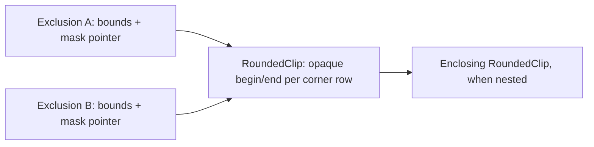

# Sparse rounded child clipping prototype

## Result

A scrolling row can meet its container's rounded edge with smooth coverage,
while its ordinary paint code runs once. This prototype is on
`prototype/rounded-child-clipping`. It implements the output interception idea
from the conversation.


The pictures are actual test output. The selected row has its own rounded
corners; the parent clips both its flat fill and its antialiased decoration.
The checkerboard remains visible through fractional coverage.

## How it works

The [existing renderer](../implemented/paint_context_design.md) traverses
foreground first, retains translucent decorations as overlays, and excludes
settled pixels from subsequent output. The prototype adds three decisions to
that path:

| Parent coverage | Child output |
| --- | --- |
| Zero | Discard it. |
| Full | Forward it through the existing renderer. |
| Fractional | Accumulate its color in a sparse boundary array. |

The array contains unmasked content. Suppose a selected row contributes color
`S` with its own coverage `b`, over panel color `P`. The saved boundary color
becomes `C = b*S + (1-b)*P`. When the backdrop `B` arrives, parent coverage `a`
is applied once: `a*C + (1-a)*B`. Multiplying each child contribution by `a`
independently would give a different result where layers overlap.

[The implementation](../../../src/roo_windows/core/rounded_clip.cpp) wraps
`DisplayOutput`, so ordinary streamed writes, sparse pixels, and rectangles
all use the same rule. Fully covered rectangles bypass boundary processing.
Cached row geometry distinguishes exterior, fractional, and opaque pixels
without a square root in the output routing path. Geometry setup uses the
same coverage routine as `Decoration`.

Child decorations are deferred raster overlays, so output interception alone
would miss them. Registering an overlay also samples its fractional boundary
contributions into the array. Its retained raster wrapper then contributes
only to fully covered interior pixels. This samples raster data; it does not
call a child's paint function again.

When a container finishes, one retained decoration resolves its boundary
colors over the panel background, then applies the existing outline and shadow
rasterization. It stays deferred until the lower scene supplies the backdrop.
Boundary pixels therefore reach the display only with their settled color.
Nested rounded containers use the same rule: each completed inner boundary
becomes a contribution to the enclosing scope.

On a fresh logical paint, clean contributors are marked for reconstruction
as the traversal reaches them. There is no preliminary traversal of the
children. Interrupted paints retain colors, overlays, and completed child
progress. A mutation between attempts conservatively restarts the image;
previous output belongs to the superseded scene.

## Compact exclusions

The first prototype expanded an exclusion crossing a corner into O(radius)
rectangles. A menu with many child draws could therefore retain many copies of
the same curved edge. Exclusions now keep the original rectangle plus a pointer
to the rounded scope's existing opaque spans. All exclusions in that scope
share the same geometry:



On row `y`, the excluded interval is the intersection of the rectangle's
horizontal extent and each enclosing mask's opaque interval. The straight
middle has an implicit full-width interval. Only fully opaque pixels belong
to this mask; fractional edge pixels still use the boundary composition above.
The mask therefore adds no aliased boundary and no extra child traversal.

[`ExclusionUnion`](../../../src/roo_windows/core/exclusion.h) and
[`ExclusionFilter`](../../../src/roo_windows/core/exclusion_filter.h) live in
`roo_windows`. Their rectangular paths are adapted from `roo_display`'s existing
filter; `roo_display` has no new rounded-corner API. Rectangles entirely inside
the opaque region keep the ordinary representation.

Pruning keeps the existing tail-folding strategy, with cheap conservative tests:

- A new ordinary rectangle removes older masked entries whose bounding boxes
  it contains.
- A new masked entry first checks the candidate's bounding box. It only removes
  a candidate when all four corners of that box are opaque in every enclosing
  mask. A failed test keeps the candidate; there is no row-by-row containment
  search between curved shapes.
- Overlay pruning uses the same proof, so an overlay touching an antialiased
  corner survives.

Output queries reject unrelated bounding boxes before reading row geometry.
Streamed pixels use cached visible/excluded runs. Uniform rectangle fills emit
visible rectangles over bands where spans stay constant, retaining tall side
strips through the straight middle. Corner bands can still produce multiple
display commands, but those fragments are emitted directly and never retained
as exclusions. Sparse pixels query the same union. Queries scan active exclusion
records and, for relevant masked records, their enclosing mask chains; they do
not scan corner pixels to establish membership.

Unchanged paint continuations retain descriptors and their geometry. A
rectangular invalidation can split a descriptor's bounding box into at most four
fragments, all sharing its original mask. This supports exclusion bookkeeping;
selective repair of captured boundary colors remains outside the prototype.

## Trying it

Material 3 `MenuPanel` opts in on this branch. An ordinary container opts in by
overriding `clipsChildrenToRoundedBounds()`; its border supplies the radii and
outline. No changes are needed to the children.

Menus retain horizontal gutters, while their top and bottom padding scrolls
with the rows. The viewport spans the panel's full height, allowing moving
rows to reach its rounded edge. The initial prototype kept a stationary 4 dp
inset around this viewport, which largely hid the new clipping in real menus,
including **Add network → Security** in `roo_windows_wifi`. At the start and
end of the list, the original padding remains visible. This layout adjustment
adds no per-instance state.

The [scrolling example](../../../examples/material3/menus/rounded_scrolling/rounded_scrolling.ino)
uses selected Material rows over a patterned backdrop. Run from `roo_windows`:

```sh
bazel run //examples/material3/menus/rounded_scrolling:rounded_scrolling
```

Drag the list vertically. The example is included in the existing Material 3
example build group. Its emulator build has been checked; touchscreen behavior
on physical hardware has not been measured.

## RAM

Colors and geometry scale with corner radius, rather than panel area. These
are measured capacities for four equal radii, without an outline:

| Radius | Color bytes | Geometry + color capacity |
| ---: | ---: | ---: |
| 8 | 112 | 292 |
| 16 | 320 | 660 |
| 24 | 512 | 1,012 |
| 32 | 624 | 1,284 |
| 64 | 1,344 | 2,644 |

These figures are **not the total renderer overhead**. The ESP32 RISC-V
cross-compiler measured the following object sizes:

| Item | Bytes |
| --- | ---: |
| Nullable pointer in retained `ClipperState` | 4 |
| Shared arena, allocated when rounded clipping is first used | 80 |
| Record per retained rounded container | 76 |
| Replacement decoration per rounded container | 100 |
| Raster wrapper for a child overlay that meets a clip edge | 24 |
| Output adapter on the stack per active rounded scope | 40 |
| Ordinary exclusion | 8 |
| Masked exclusion (bounds + shared mask pointer) | 12 |
| Exclusion union on the clipper output stack | 16 |

The replacement decoration includes the ordinary surface decoration data; its
size is not a net delta against the old decoration pool.

The target compiler's `-Os -fstack-usage` report gives 128 bytes for
`RoundedClipOutput::fillRect`, plus its callees. Its initial implementation used
368 bytes; direct emission of coalesced runs removed the large temporary batch.
The exclusion filter's `writeRects` and `fillRects` frames measure 512 and 384
bytes, respectively, versus 448 and 304 in the original rectangular filter.
They include the existing buffered writers. These are individual function
frames, not a complete worst-case paint stack measurement.

Arena vectors also retain their pointer capacity. Radius 16 requires 836 bytes
for its arrays, record, and replacement decoration, before the shared arena,
pointer slots, allocation metadata, and exclusion descriptors. `Widget`
remains 24 bytes and `Container` 44 bytes on that ABI, unchanged from the base
commit. The [size probe](../../../benchmarks/rounded_child_clip_size_probe.cpp)
records the measured types.

A corner-crossing rectangle now adds one 12-byte descriptor, independent of
radius. The existing row geometry is shared, including enclosing masks for
nested scopes. The bounded working list can hold another 12-byte copy for each
masked exclusion relevant to the current draw. Both vectors retain spare
capacity; allocation metadata is additional.

Relative to the original prototype, the optional arena grows from 56 to 80
bytes for those two vectors. `ClipperState` remains 240 bytes, and no fields are
added to `Widget` or `Container`. The union on the clipper output stack grows
by 8 bytes; its filter remains 44 bytes. Ordinary exclusion records remain
8 bytes and require no optional arena.

The arena and geometry/color arrays retain their peak capacities for reuse.
First use or increased requirements can allocate. Reusing unchanged boundary
geometry allocates nothing in the dedicated test. There is no full framebuffer,
corner-square color buffer, or area-sized coverage mask.

## CPU and allocations

The resource test uses a 240×160 ARGB8888 memory display, a 192×128 panel with
radius 16, and five rounded rows. It invalidates the whole panel for 200
measured refreshes after warming the renderer. These are host CPU measurements;
they exclude a physical display bus and are not ESP32 timing estimates.

Three isolated runs using thread CPU time produced:

| Run | Clipping off (µs/frame) | Clipping on (µs/frame) | Added CPU (µs/frame) |
| ---: | ---: | ---: | ---: |
| 1 | 101.94 | 113.28 | 11.34 |
| 2 | 78.37 | 148.73 | 70.36 |
| 3 | 74.53 | 116.68 | 42.15 |

The median times are about 78 and 117 µs/frame with compact masked exclusions.
Treat these as a small host characterization, not a stable performance guarantee;
even CPU time varies with processor frequency and cache state. The test prints
wall time separately.
Mixed fills coalesce opaque scanline runs and visit only fractional samples;
fully exterior spans are dropped without scanning their pixels. Geometry setup
still scans corner regions (O(radius²)), but reuses unchanged geometry.

The first refresh requested 1,696 bytes in 18 allocations without clipping,
and 2,844 bytes in 31 allocations with clipping. This is cumulative requested
memory during that call, not retained heap or peak RAM. Both warmed paths made
one existing 480-byte allocation per frame. The prototype added no warmed
allocations in this scene, and the test now asserts that clipping adds no warmed
allocations or requested bytes. This is not a general allocation-free renderer
claim.

To reproduce the optimized measurement:

```sh
bazel test //:rounded_child_clip_resource_test -c opt \
  --per_file_copt='external/roo_testing.*/.*@-Wno-error=stringop-truncation' \
  --runs_per_test=3 --local_test_jobs=1 --test_output=all
```

The warning override is needed for an existing `roo_testing` Wi-Fi shim warning
with this host GCC. It does not change the prototype code.

## Validation and limits

[Pixel tests](../../../test/rounded_child_clip_test.cpp) compare every output
pixel with independently composed parent and child raster layers. They allow
two 8-bit color levels for blend rounding. They also count child paint calls
and physical display writes. Covered cases include scrolling, nested clips,
a higher sibling, descendant press feedback, a patterned backdrop, all six
output entry points, translucent overlays, outlines (including an outline
matching the fill), shadows, clean foreground reconstruction, continuation,
and mutation during continuation. Geometry tests
include asymmetric radii, fractional outlines, and very small bounds.

The tests assert one child paint per completed scene and no repeated physical
writes for a scene's settled pixels, including unchanged continuation attempts.
Test output includes PPM frames used for the illustration above.

The [masked-exclusion tests](../../../test/masked_exclusion_test.cpp) exercise all
six output paths against a coverage oracle, nested and asymmetric geometry,
fractional outlines, disconnected intervals, conservative pruning, and resumed
paints. They verify that 20 corner-crossing exclusions stay 20 shared descriptors
at radii 8 through 64. A display-command test checks that two uniform side strips
remain two tall rectangles. Blit tests compare incremental rendering with a
complete repaint when masks belong to descendants or foreground siblings.

Validation completed for compact exclusions:

- All 103 root regression test targets passed in the optimized build.
- The masked-exclusion and rounded-clipping targets passed with AddressSanitizer.
- The Wi-Fi flow and configuration-form tests passed, and the network-settings
  example compiled for the emulator.
- The routing implementation compiled with the ESP32 RISC-V compiler using
  `-fno-exceptions -fno-rtti`; object sizes and selected stack frames were measured.

The sanitizer command is:

```sh
bazel test //:masked_exclusion_test //:rounded_child_clip_test --config=asan
```

Menu goldens already include the earlier scrolling-viewport adjustment. The
compact exclusion representation preserves those images, including the Wi-Fi
Security dropdown.

This is a prototype with a deliberately narrow supported contract:

- Use an opaque, enabled clipping owner with feedback on its children. Owner
  ripple and disabled-group composition remain unsupported.
- The rounded scope clips all descendant output, including children marked
  `kUnclipped`. Escaping content should live outside that scope in this version.
- Direct writes follow the widget-authoring opaque-output contract; arbitrary
  destination-dependent blend operations are outside the prototype.
- Blit caching and immediate child-shadow shortcuts are disabled inside a
  rounded scope. Blit caching also bypasses reuse when masked exclusions from
  foreground siblings or cached descendants are present. Its rectangular
  safety proof needs separate integration with masks.
- A mutation during an interrupted paint restarts the image. Selective
  continuation repair for captured boundary colors is future work.
- Allocation failure behavior follows the existing vector/new usage. A bounded
  pool or explicit RAM budget has not been added.

The next engineering step is to measure real scrolling menus on the target
board, especially display command overhead and peak descriptor capacity with
many overlapping widgets. Retained exclusions no longer expand with radius;
corner output commands and geometry setup still depend on radius.
