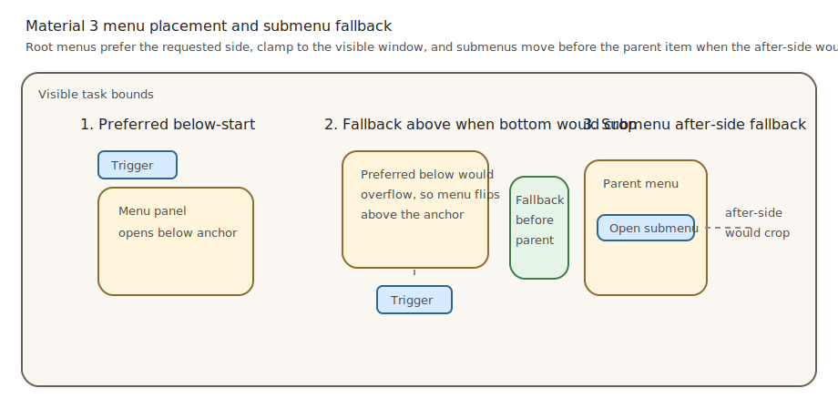

# Roo Windows Material 3 Menus Design

## Objective

Add a Material Design 3 menu family to `roo_windows` that is suitable for:

- overflow menus,
- context menus,
- text-field and select menus,
- single-select and multi-select menus,
- cascading submenus on larger screens,
- grouped menus with gaps or dividers,
- and reuse of shared Material 3 row primitives already introduced by the
  list design.

The result is a temporary popup menu system with Material 3 baseline and
expressive vertical variants, not a restyled wrapper around the legacy
`roo_windows::menu::Menu` composite.

## Motivation

`roo_windows` already has a legacy menu composite, but it is not a Material 3
menu surface. It does not model anchored popup placement, expressive vertical
menu styling, grouped gaps, submenu chains, menu-specific dismissal rules, or
the selected and active states now defined by Material 3.

The existing [material3_lists_design.md](material3_lists_design.md) document
already reserved menu reuse as the first follow-up consumer of the shared row
model. This document closes the remaining menu-specific decisions so menus can
ship as a coherent Material 3 family instead of as a one-off list skin.

## Background

### Current Status in `roo_windows`

As of 2026-05, the relevant current pieces are:

- the legacy [`menu::Menu`](../src/roo_windows/composites/menu/menu.h), which
  subclasses `Activity` and builds a titled menu from `ScrollablePanel` plus
  `VerticalLayout`,
- the landed Material 3 list substrate in
  [`material3/list/list.h`](../src/roo_windows/material3/list/list.h), which
  already provides `ListItem`, `ListEntry`, `StandardListItem`, `ListRow`, and
  `List`,
- popup task infrastructure in [`Application`](../src/roo_windows/core/application.h),
  [`Task`](../src/roo_windows/core/task.h), and
  [`Activity`](../src/roo_windows/core/activity.h),
- and a full-screen-presentation path for temporary surfaces such as the
  keyboard popup.

What does not exist yet:

- no Material 3 menu surface under `roo_windows/material3`,
- no anchored popup overlay that dismisses on outside press without becoming a
  dialog,
- no submenu chain controller,
- no menu-specific row context for active-submenu or vibrant selected states,
- no grouped expressive gap treatment,
- and no Material 3 example or test target covering popup menus.

### Material 3 Sources

This document is aligned against the Material 3 menu documentation:

- [Overview](https://m3.material.io/components/menus/overview)
- [Specs](https://m3.material.io/components/menus/specs)
- [Guidelines](https://m3.material.io/components/menus/guidelines)

The important signals for this design are:

- new designs favor expressive vertical menus over baseline menus,
- expressive menus support `standard` and `vibrant` color styles,
- gaps and dividers both group items, but gaps are not used in scrollable
  menus,
- menus are temporary popup surfaces positioned relative to a trigger or
  context anchor,
- submenus open beside the parent item without overlapping it,
- single-select and multi-select menus are both supported,
- and menu slots must preserve the menu's one-action-per-row interaction model.

### Relationship to the Material 3 List Design

The list design already made three decisions that this menu design keeps:

1. `ListItem` remains the shared content abstraction for slotted text and
   widgets.
2. `ListEntry` remains the shared row primitive for binding, measuring,
   layout, and standard text widget management.
3. Menu-specific popup behavior stays outside `material3::List`.

This document therefore does not force menus through `material3::List`.
Instead, it reuses the list item and row primitives while introducing a menu
overlay, menu group sequencing, and menu-specific visual context.

### Local Framework Context

The popup and ownership hooks that matter most here already exist:

- `Application::addPopupTask(...)` and `Application::addPopupTaskFloating()`
  create popup-layer tasks above regular tasks and below dialogs.
- `Task::enterActivity(...)` and `Activity::getPreferredPlacement(...)` already
  support non-full-screen activity placement.
- popup tasks are not dialogs, so they do not automatically scrim the window
  or become modal.
- there is currently no bottom-sheet primitive in `roo_windows`.

Those facts drive two design choices:

1. Menus use popup tasks, not dialogs.
2. Compact-window bottom-sheet adaptation stays out of the initial menu API.

### Embedded Authoring Constraints

The canonical widget guidance in
[roo-windows-widget-authoring.instructions.md](../.github/instructions/roo-windows-widget-authoring.instructions.md)
applies directly here:

- optimize for RAM first,
- keep base widgets cheap,
- avoid per-instance `std::function` or speculative policy fields,
- keep temporary popup semantics off the base row type when only menus need
  them,
- and avoid allocations on hot paint, scroll, hover, and animation paths.

Menus multiply row cost just like lists do, but menus also add temporary popup
state. The common menu path therefore has to keep per-row storage close to the
existing `ListEntry` budget and move popup-chain behavior into menu-level
objects that only exist while a menu is open.

## Requirements

### Functional Requirements

1. Support both Material 3 baseline menus and expressive vertical menus.
2. Support expressive `standard` and `vibrant` color styles.
3. Support anchored popup menus opened from buttons, icon buttons, text fields,
   and arbitrary context anchors.
4. Support grouped menus with either a divider or a small gap between groups.
5. Support scrollable menus with a persistent scrollbar when content does not
   fit.
6. Support disabled, hovered, focused, pressed, selected, and active-submenu
   row states.
7. Support submenu chains where the child menu opens beside the parent item and
   does not overlap it.
8. Support both single-select and multi-select menu behavior.
9. Support menu rows with headline text, optional supporting text, leading
   visuals, trailing visuals, shortcut text, badges, and submenu arrows.
10. Keep the trigger visually pressed while the root menu chain is open.
11. Dismiss the menu chain on outside press, explicit back/escape, or leaf
    invocation according to the selected menu policy.
12. Keep the menu row interaction model to one action per row.

### Memory and Allocation Requirements

1. Reuse the existing list item and row substrate instead of introducing a
   second general slotted-row framework.
2. Keep base per-row menu RAM close to the current `ListEntry` budget.
3. Keep menu action dispatch virtual; do not add per-row `std::function`
   storage to the baseline item path.
4. Keep popup-chain state on the temporary menu overlay or menu activity,
   not on every row.
5. Make optional conveniences such as shortcut text, badges, and submenu
   arrows pay only when the corresponding item uses them.
6. Avoid heap allocation on row paint, layout, hover, and scroll paths.
7. Document the approximate per-instance RAM cost of the base menu activity,
   menu group, menu row, and convenience item path.

### Placement and Interaction Requirements

1. Position menus relative to a task-local anchor rectangle.
2. Prefer the requested side, but automatically fall back above, below, before,
   or after the anchor when the preferred placement would be cropped.
3. Clamp the final menu rectangle to the task's visible bounds with a fixed
   viewport margin.
4. Open submenus beside the parent row without overlapping the parent row.
5. Keep grouped gaps out of scrollable menus; use dividers instead when the
   menu becomes scrollable.
6. Route outside taps to chain dismissal without turning menus into modal
   dialogs.
7. Keep root-trigger pressed indication out of per-widget stored state.

### Content and Accessibility Requirements

1. Reuse the shared `ListItem` slot model for headline text, supporting text,
   and leading or trailing visuals.
2. Allow menu-specific trailing content such as shortcut text, badges, and a
   submenu chevron without widening the shared `ListItem` slot contract.
3. Keep interactive elements in slots decorative or passive; menu rows remain
   the only actionable target.
4. Support disabled items without removing them from the menu.
5. Keep menu text to the lightweight one-line path by default and only pay for
   heavier text handling when a menu item explicitly opts into supporting text
   or wrapping.

## Design Overview

### Scope

In scope:

- popup Material 3 menus,
- baseline and expressive vertical variants,
- grouped and scrollable menus,
- submenu chains,
- shared row reuse with menu-specific row visuals,
- and a baseline convenience item for common command menus.

Out of scope:

- automatic bottom-sheet adaptation on compact windows,
- autocomplete or filterable menus,
- density variants,
- and recycled menu virtualization for very long data sets.

### Core Structure

The menu family is a three-layer stack:

1. `material3::Menu` is a popup `Activity` that owns temporary presentation
   state: anchor, trigger reference, child submenu chain, and dismissal.
2. An internal full-screen `MenuOverlay` widget is the activity contents. It
   intercepts outside presses, keeps the presentation task full-screen, and
   hosts one anchored `MenuPanel` child.
3. `MenuPanel` owns the menu surface, optional `ScrollablePanel`, and one or
   more `MenuGroup` children. Each `MenuGroup` sequences `MenuEntry` rows.

This split keeps popup behavior and menu ownership on temporary menu objects,
while row measurement, slot binding, and shared text widgets continue to live
close to the existing list row substrate.

### Key Decisions

1. Menus do not reuse `material3::List` directly. `List` owns list-specific
   row grouping, divider, and selection propagation that does not match menu
   grouping or popup behavior.
2. Menus do reuse `ListItem` and `ListEntry`. `MenuItem` derives from
   `ListItem`, and `MenuEntry` derives from `ListEntry`.
3. Each open menu level uses one full-screen popup task. The menu surface is a
   child inside that task, not the task bounds themselves. That makes outside
   dismissal reliable and keeps submenu chain behavior local to the menu
   family.
4. Trigger pressed indication is implemented as a presenter-owned overlay pin,
   not as a new persistent state bit on every `Widget`.
5. The baseline convenience path uses virtual item hooks for invocation and a
   menu-owned checkmark indicator for selection. It does not embed checkbox,
   radio, or switch widgets inside menu rows.
6. Gap grouping is expressive-only and non-scrollable-only. If a menu would
   otherwise scroll, grouped gaps are coerced to dividers.

## Design Details

### Popup Overlay and Placement

Each visible menu is hosted in a full-screen popup task. Its `Activity`
contents are a full-screen `MenuOverlay` widget that lays out one `MenuPanel`
child at the resolved anchored rectangle.

That architecture does three things at once:

- it gives the overlay a full-screen hit target for outside dismissal,
- it keeps the actual menu surface a normal child widget with normal clipping,
  elevation, and scroll behavior,
- and it avoids making popup task bounds themselves part of the menu-layout
  API.

The placement algorithm operates on four rectangles:

- anchor rectangle $A$ in task-local coordinates,
- measured menu rectangle size $(w, h)$,
- task-visible bounds $V$,
- and a fixed viewport margin $m$.

The root menu computes candidate origins in preference order. For a left-to-
right below-start menu those candidates are:

$$
P_0 = (A.left, A.bottom + 1)
$$

$$
P_1 = (A.right - w + 1, A.bottom + 1)
$$

$$
P_2 = (A.left, A.top - h)
$$

$$
P_3 = (A.right - w + 1, A.top - h)
$$

The first candidate that fits fully inside $V$ wins. If none fits fully, the
best candidate on the preferred side is clamped to the visible bounds:

$$
x = \operatorname{clamp}(x_c, V.left + m, V.right - m - w + 1)
$$

$$
y = \operatorname{clamp}(y_c, V.top + m, V.bottom - m - h + 1)
$$

Submenus use the same scoring rule, but their primary candidates are side
placements relative to the parent row rectangle and include a fixed gutter so
the child surface does not overlap the row that opened it.



### Surface Ownership

The popup surface is owned by `MenuPanel`, not by the individual rows.

That follows the widget authoring distinction between surface-owning and
non-surface widgets:

- `MenuPanel` owns the outer popup surface, shadow, outline, and scrollable
  container behavior.
- `MenuEntry` paints row-local content and row-local state layers inside that
  popup surface.
- the full-screen `MenuOverlay` is not surface-owning; it exists to own hit
  testing and layout for the popup panel.

This matters because expressive menus have a strong outer popup shape and only
selected or active rows receive inner shape treatment. The outer menu surface
therefore belongs to the panel, not to a stacked list of row surfaces.

### Content Model

The shared content contract stays anchored on `ListItem`.

`MenuItem` is a narrow extension of `ListItem` with menu semantics:

- enabled state,
- selected state,
- optional child submenu,
- and virtual invocation.

The baseline convenience path is `StandardMenuItem`, which stores:

- headline text,
- optional supporting text,
- optional leading widget,
- optional trailing helper cluster,
- selected and enabled bits,
- and an optional non-owning submenu pointer.

`StandardMenuItem` does not widen the shared row-slot contract. Instead,
menu-specific trailing content such as shortcut text, badges, trailing icons,
and submenu arrows are composed into one internal trailing helper widget when
those features are present. Rows that do not use those features do not pay for
that helper.

`MenuEntry` reuses `ListEntry` for binding, text-slot widget management,
measurement, and main-slot layout. It adds only menu-specific visual logic and
typed convenience wrappers such as `setMenuItem(MenuItem&)`.

### Menu Row Visual Context

The menu row does not use `ListEntryVisualContext` directly. It uses a
menu-specific packed context resolved by `MenuGroup`:

- variant: baseline or vertical,
- color style: standard or vibrant,
- group position: single, first, middle, or last,
- enabled,
- selected,
- pressed,
- focused,
- hovered,
- active-submenu,
- divider visibility,
- and divider insets.

Only menu rows pay for this extra context.

That context supports the following visual rules:

- baseline menus use flat list-like rows with divider-led grouping,
- expressive vertical menus keep the outer popup rounded and use row-local
  selected or active shape treatment inside the menu,
- vibrant menus resolve selected rows against tertiary roles,
- standard menus stay surface-based,
- disabled rows retain their slot structure but suppress action and use the
  disabled token mapping,
- and active submenu rows use the focused or active shape treatment even when
  they are not selected.

### Grouping, Scrolling, and Selection

`MenuGroup` owns one contiguous sequence of rows. `MenuPanel` stacks groups and
applies one separator between adjacent groups.

Grouping rules are closed as follows:

1. `MenuSeparatorMode::kGap` is allowed only for expressive vertical menus that
   fit without scrolling.
2. `MenuSeparatorMode::kDivider` is allowed for both baseline and vertical
   menus.
3. If the resolved menu height exceeds the available viewport height,
   `MenuPanel` wraps the group stack in `ScrollablePanel`, shows a persistent
   scrollbar, and coerces group separators to dividers.

Selection rules are also closed:

1. Single-select menus dismiss the chain after a leaf invocation updates the
   selected row.
2. Multi-select menus keep the chain open after selection changes.
3. Selection is indicated by a menu-owned checkmark plus the selected row
   color treatment.
4. Baseline menu selection does not instantiate embedded checkbox, radio, or
   switch widgets.

### Submenu Chain Behavior

Submenus are opened by leaf rows that expose a non-null child menu pointer.

The chain behavior is:

1. Opening a submenu keeps the parent menu open and marks the opener row as
   active.
2. Only one child submenu can be open from a given menu at a time.
3. Opening a new submenu from the same parent closes the previous child chain
   first.
4. Dismissing a submenu returns focus and active styling to its parent menu.
5. Outside press dismisses the entire chain from root to leaf.
6. Back or escape dismisses only the deepest open menu first.
7. Hover and focus state can move within an already open submenu chain, but
   submenu opening remains invocation-driven in the first implementation.

This keeps touch behavior predictable and avoids requiring a hover-only
interaction model on embedded targets that primarily use touch.

### Trigger Press Retention

Material 3 expects the root trigger to stay visually pressed while the menu
chain is open.

This design implements that without changing base widget storage. The root menu
presentation layer registers the trigger widget with a new menu-only press-pin
helper owned by `MainWindow`. While registered, that helper paints the existing
press overlay over the trigger bounds during the root window paint pass. When
the root menu chain closes, the pin is removed.

No widget instances gain extra fields for this feature.

### Per-Instance Footprint Budget

Using the same 32-bit ESP32 assumptions as
[material3_lists_design.md](material3_lists_design.md), the intended baseline
budgets are:

| Type | Approx. RAM | Notes |
|------|------------:|-------|
| `Menu` | ~40-48 B | anchor rect pointer or value, trigger pointer, child-chain pointers, compact policy bits; temporary only while menu exists |
| `MenuOverlay` | ~48 B | one child pointer plus compact dismissal and placement state |
| `MenuPanel` | ~56-68 B plus optional scroll wrapper storage | popup surface, group-stack child pointers, and compact separator policy |
| `MenuGroup` | ~56-64 B plus vector capacity | one row-pointer vector and compact group policy; no selection vector |
| `MenuEntry` | ~88 B | `ListEntry` budget plus packed menu visual context |
| `StandardMenuItem` | ~60-72 B | shared text views, selected or enabled bits, submenu pointer, and optional trailing helper pointer |
| trailing helper cluster | ~24-40 B when present | paid only by items that use shortcut text, badge, trailing icon, or submenu arrow |

The key rule is that submenu-chain and popup-overlay behavior stay on temporary
menu objects, while the common row path stays close to the existing `ListEntry`
cost.

## Proposed API

### Baseline Types

```cpp
namespace roo_windows::material3 {

enum class MenuVariant : uint8_t {
  kBaseline,
  kVertical,
};

enum class MenuColorStyle : uint8_t {
  kStandard,
  kVibrant,
};

enum class MenuSeparatorMode : uint8_t {
  kNone,
  kDivider,
  kGap,
};

enum class MenuSelectionIndicator : uint8_t {
  kNone,
  kCheckmark,
};

struct MenuAnchor {
  Rect bounds;
  bool right_to_left = false;

  static MenuAnchor FromWidget(const Widget& widget);
  static MenuAnchor FromRect(const Rect& rect, bool right_to_left = false);
};

struct MenuPolicy {
  MenuVariant variant = MenuVariant::kVertical;
  MenuColorStyle color_style = MenuColorStyle::kStandard;
  MenuSeparatorMode separator_mode = MenuSeparatorMode::kNone;
  SelectionMode selection_mode = SelectionMode::kNone;
  MenuSelectionIndicator selection_indicator =
      MenuSelectionIndicator::kCheckmark;
  bool dismiss_on_leaf_invoke = true;
  bool dismiss_on_outside_press = true;
};

class Menu;

class MenuItem : public ListItem {
 public:
  virtual bool isEnabled() const { return true; }
  virtual bool isSelected() const { return false; }
  virtual Menu* submenu() const { return nullptr; }
  virtual void onInvoked(Menu& owner) {}
};

struct StandardMenuItemInit {
  roo_display::StringView headline = {};
  roo_display::StringView supporting = {};
  Widget* leading = nullptr;
  roo_display::StringView shortcut = {};
  Widget* badge = nullptr;
  Widget* trailing_icon = nullptr;
  bool enabled = true;
  bool selected = false;
};

class StandardMenuItem : public MenuItem {
 public:
  explicit StandardMenuItem(const StandardMenuItemInit& init = {});

  void setSelected(bool selected);
  void setEnabled(bool enabled);
  void setSubmenu(Menu* submenu);
};

class MenuEntry : public ListEntry {
 public:
  explicit MenuEntry(ApplicationContext& context);

  void setMenuItem(MenuItem& item);
  MenuItem* menuItem();
  const MenuItem* menuItem() const;
};

template <typename Item>
class MenuRow : public MenuEntry {
 public:
  template <typename... Args>
  explicit MenuRow(ApplicationContext& context, Args&&... args);

  Item& item();
  const Item& item() const;
};

class MenuGroup : public Container {
 public:
  explicit MenuGroup(ApplicationContext& context);

  void add(MenuEntry& entry);
  void add(std::unique_ptr<MenuEntry> entry);
  void clear();
};

class Menu : public Activity {
 public:
  explicit Menu(ApplicationContext& context);

  void setPolicy(const MenuPolicy& policy);
  void setAnchor(const MenuAnchor& anchor);
  void setTrigger(Widget* trigger);
  void addGroup(MenuGroup& group);
  void addGroup(std::unique_ptr<MenuGroup> group);
  void clearGroups();
  void show(Application& app);
  void dismissChain();

  Widget& getContents() override;
  roo_display::Box getPreferredPlacement(const Task& task) override;
};

}  // namespace roo_windows::material3
```

### API Notes

The chosen public shape intentionally keeps menus close to the current
framework vocabulary:

- menus are still activities rather than special dialogs,
- grouping is explicit instead of encoded as magic separator rows,
- and action dispatch is virtual rather than callback-heavy.

`Menu::show(Application&)` opens the menu in a popup task and retains the root
trigger press overlay if a trigger has been supplied. If `show()` is called
before the baseline popup implementation lands, the interim behavior is to emit
`LOG(WARNING) << "Unimplemented: Material 3 menu presentation"` and perform no
presentation work. No partial menu tree is shown in that state.

## Implementation Plan

Authoring reference:
[roo-windows-code-authoring/SKILL.md](../.github/skills/roo-windows-code-authoring/SKILL.md)
and
[roo-windows-widget-authoring.instructions.md](../.github/instructions/roo-windows-widget-authoring.instructions.md).

### Phase 1: Core Menu Types and Build Skeleton

Code slice:

1. Add the baseline public declarations for `MenuPolicy`, `MenuAnchor`,
   `MenuItem`, `MenuEntry`, `MenuGroup`, and `Menu` under
   `src/roo_windows/material3/menu/`.
2. Keep `show()` as a non-presenting stub with a single warning log until the
   overlay and popup task flow land.
3. Add a compile-only smoke test and wire the new source set into Bazel.

Proposed commit message:

> Material 3 menus Phase 1: add core menu declarations.
>
> Introduce the baseline Material 3 menu types and build wiring while keeping
> presentation stubbed behind a warning until the popup overlay exists.

Validation: run `bazel test //:material3_menu_smoke_test`.

### Phase 2: Popup Overlay and Trigger Pin

Code slice:

1. Implement the full-screen `MenuOverlay` and anchored `MenuPanel`.
2. Present menus in popup tasks and resolve anchored placement in
   `Menu::getPreferredPlacement(...)`.
3. Add the root-trigger press-pin helper in `MainWindow` and integrate it with
   menu show or dismiss lifecycle.
4. Add behavior tests for outside dismissal and trigger pressed retention.

Proposed commit message:

> Material 3 menus Phase 2: add anchored popup overlay.
>
> Present Material 3 menus in popup tasks through a full-screen overlay,
> anchored panel layout, outside dismissal, and root-trigger pressed overlay
> retention.

Validation: run `bazel test //:material3_menu_test`.

### Phase 3: Shared Row Reuse and Baseline Command Items

Code slice:

1. Implement `MenuEntry` on top of `ListEntry`.
2. Add `MenuItem`, `StandardMenuItem`, and `MenuRow<Item>`.
3. Add the internal trailing helper cluster for shortcut text, badges,
   trailing icons, and submenu arrows.
4. Add a small example menu with disabled items and shortcut text.

Proposed commit message:

> Material 3 menus Phase 3: add shared row and command item path.
>
> Reuse the list row substrate for Material 3 menu rows and add the baseline
> command-menu convenience item with lightweight trailing helpers.

Validation: run `bazel test //:material3_menu_test` and build the new menu
example target.

### Phase 4: Grouping, Scrolling, and Baseline Goldens

Code slice:

1. Implement `MenuGroup` sequencing and group-separator policy.
2. Add scroll wrapping with divider coercion when menu content exceeds the
   viewport.
3. Add baseline and expressive golden coverage for grouped, scrollable, and
   disabled menus.

Proposed commit message:

> Material 3 menus Phase 4: add grouping and scroll behavior.
>
> Implement menu groups, separator policy, scroll fallback, and goldens for
> baseline and expressive grouped menus.

Validation: run `bazel test //:material3_menu_golden_test`.

### Phase 5: Selection and Leaf Dismissal Policy

Code slice:

1. Implement selected-state propagation, menu-owned checkmark rendering, and
   single-select or multi-select behavior.
2. Apply vibrant selected color treatment for expressive menus.
3. Add tests for single-select dismissal and multi-select stay-open behavior.

Proposed commit message:

> Material 3 menus Phase 5: add selection policy.
>
> Add menu-owned selected state, checkmark indicators, and dismissal behavior
> for single-select and multi-select menus.

Validation: run `bazel test //:material3_menu_test`.

### Phase 6: Submenu Chains and Active State

Code slice:

1. Implement child submenu presentation, active-parent-row styling, and
   deepest-first back or escape dismissal.
2. Add placement fallback from after to before when side overflow occurs.
3. Add golden and interaction coverage for two-level submenu chains.

Proposed commit message:

> Material 3 menus Phase 6: add submenu chains.
>
> Support cascading submenus with anchored side placement, active-row styling,
> and chain-aware dismissal behavior.

Validation: run `bazel test //:material3_menu_test` and
`bazel test //:material3_menu_golden_test`.

### Phase 7: Examples, Migration Note, and Legacy Interop

Code slice:

1. Add `examples/material3/menus/menus.ino` covering overflow, context,
   grouped, scrollable, and submenu cases.
2. Add a short migration note from `roo_windows::menu::Menu` to
   `material3::Menu` in the example or docs.
3. Keep the legacy menu composite intact; do not silently rewrite it in this
   phase.

Proposed commit message:

> Material 3 menus Phase 7: add examples and migration note.
>
> Add a Material 3 menu example set and document migration from the legacy
> menu composite without removing the old API.

Validation: run `bazel test //:material3_menu_test` and build the menu example
under emulation.

## Testing Plan

### Unit and Behavior Tests

Add `material3_menu_test` coverage for:

- anchor placement selection and clamping,
- separator coercion from gap to divider under scrolling,
- outside dismissal,
- single-select and multi-select behavior,
- disabled-row non-invocation,
- submenu open and close sequencing,
- and deepest-first back or escape dismissal.

### Golden and Rendering Tests

Add `material3_menu_golden_test` coverage for:

- baseline standard menu,
- expressive standard menu,
- expressive vibrant selected menu,
- grouped vertical menu with a gap,
- grouped scrollable menu with divider fallback,
- disabled rows,
- and active-submenu row styling.

### Interaction and Integration Tests

Integration coverage should exercise:

- opening from an icon-button anchor,
- opening from a text-field anchor,
- context-menu placement near window edges,
- root-trigger pressed retention while the menu chain is visible,
- and example compilation under the emulation harness.

## Caveats

### Rejected Alternatives

#### Reusing `material3::List` Directly as the Menu Container

This was rejected because `List` owns list-specific sequencing and visual rules:
selected-run behavior, list divider policy, and segmented grouping. Menus need
popup-owned outer shape, gap-vs-divider group treatment, submenu active state,
and chain dismissal. Stretching `List` to cover those rules would either bloat
the list context or force menu policy into a list class that does not own it.

#### Per-Item `std::function` Action Storage

This was rejected because it adds avoidable per-item RAM, complicates lifetime
rules for submenu chains, and conflicts with the repository's pay-for-what-you-
use guidance. Virtual invocation on `MenuItem` keeps the common path cheap and
matches existing widget patterns.

#### Presenting Menus as Dialogs

This was rejected because dialogs are modal, scrim the window, and center
their content. Material 3 menus are contextual popup surfaces that stay tied to
their trigger or context anchor and dismiss on outside interaction without
becoming modal dialogs.

### Accepted Trade-Offs

1. Each open menu level pays for a full-screen popup task and overlay widget.
   That is higher menu-level overhead than a bare floating surface, but it
   makes outside dismissal, trigger retention, and submenu chains correct
   without widening base widget state.
2. `StandardMenuItem` duplicates some descriptor storage that also exists in
   `StandardListItem`. That duplication is acceptable because menus need a
   different convenience surface and the duplication stays off the shared row
   base types.

## Future Work

1. Add an adaptive presenter that can intentionally swap `material3::Menu` for
   a bottom-sheet surface on compact windows once `roo_windows` has a bottom-
   sheet primitive.
2. Add filtered or autocomplete menus on top of the same overlay and group
   stack.
3. Add density tuning if the project later needs web-style compact menu
   spacing.