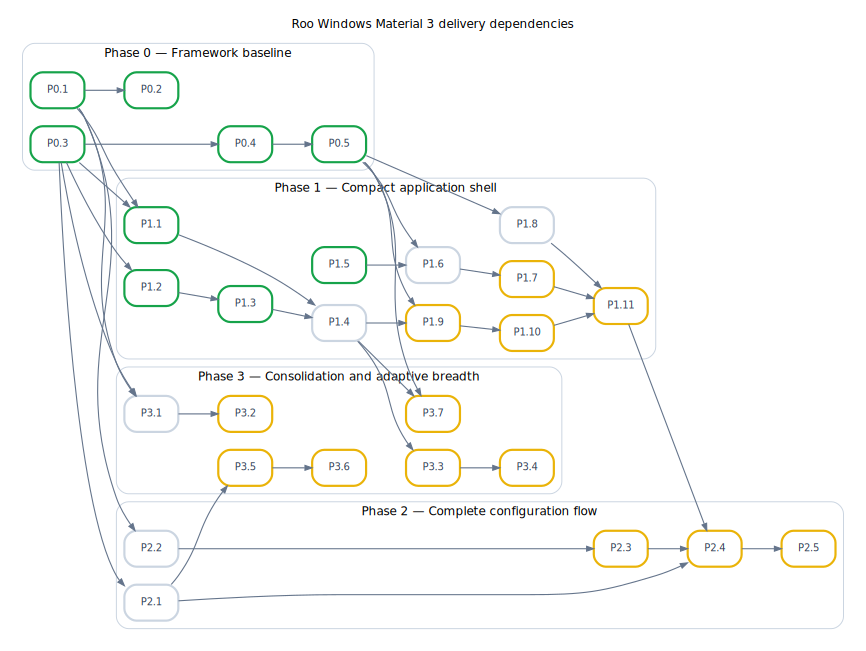

# Roo Windows Material 3 Roadmap

## Status

Living roadmap. Revisit it when a phase exit condition is met or a foundation
design exposes a materially different dependency. Component design documents
remain the source of truth for API and implementation details.

## Objective

Make `roo_windows` a dependable platform for complete embedded applications
that use Material Design 3, while keeping framework core independent of M3 and
respecting RAM, flash, stack, allocation, and invalidation constraints.

The roadmap favors end-to-end capability over component-count parity. A flow
that can navigate, edit, validate, confirm, save, and report progress is more
valuable than several additional isolated widgets.

## Current Assessment

The repository has broad **design coverage**, but substantially narrower
**implemented and integrated coverage**. Those are different kinds of progress.

### Foundation designs

The main framework contracts with checked-in design coverage are:

- [paint_context_design.md](design/implemented/paint_context_design.md)
- [surface_widget_refactor_design.md](design/implemented/surface_widget_refactor_design.md)
- [visual_overflow_design.md](design/in_progress/visual_overflow_design.md)
- [widget_event_dispatch_design.md](design/implemented/widget_event_dispatch_design.md)
- [gesture_arbitration_ownership_design.md](design/implemented/gesture_arbitration_ownership_design.md)
- [text_system_design.md](design/in_progress/text_system_design.md)
- [non_touch_input_design.md](design/implemented/non_touch_input_design.md)
- [horizontal_page_host_design.md](design/implemented/horizontal_page_host_design.md)
- [application_navigation_back_behavior_design.md](design/implemented/application_navigation_back_behavior_design.md)
- [transient_presenter_lifetime_design.md](design/in_progress/transient_presenter_lifetime_design.md)
- [transient_presentation_pins_design.md](design/in_progress/transient_presentation_pins_design.md)

This list is not evidence that every cross-component contract is complete.
In particular, the transient-presentation-pins design is a narrow paint-only
mechanism for escaping ancestor clipping. It defines registration, layer
ordering, invalidation, and limited pin teardown behavior; it does not define a
general lifetime contract for interactive menus, sheets, dialogs, or queued
snackbars. The shared transient slot and legacy-dialog adoption are
implemented, but menu and snackbar adoption remain, and modal sheets do not
yet exist. Component designs therefore still make different caller-owned and
borrowed-lifetime assumptions, and some permit a visible presenter to hold an
anchor, content reference, listener, or text view that the caller must keep
valid.

Event dispatch, gesture ownership, and the non-touch keyboard path are
implemented. The interactive-transient slot and legacy-dialog migration are
also implemented. Phase 0 therefore has one remaining deliverable: retain the
supported-target theme baseline. Unfinished component adoption and optional
foundation extensions are scheduled beside their first consumer below; they do
not keep the implemented framework contracts open.

### Theme migration is complete; target evidence remains

[theme_color_tokens_design.md](design/implemented/theme_color_tokens_design.md) defines a
design-system-independent framework theme plus an exact M3 theme. Generic
widgets now use `FrameworkTheme`; M3 widgets resolve their colors through
`material3::Theme`. The legacy `ColorRole`, `ColorTheme`, state-opacity, and
reverse-lookup APIs have been removed.

Therefore, theme work is no longer a Phase 0 implementation prerequisite.
The remaining work is to retain target measurements and regression coverage
for the new ownership boundary without expanding core into an M3-shaped
vocabulary or adding per-widget RAM.

### Component coverage

Designs already cover the shell and many major families, including scaffold,
app bars, navigation bar/rail/drawer, toolbars, tabs, lists, menus, sheets,
dialogs, snackbar, buttons, FABs, badge, sliders, text fields, and date/time
pickers. The app-bar/search-entry component family is implemented and covered
by focused unit tests and an example; its planned golden and scaffold
integration coverage remain. The list family is implemented through Phase 11,
with menu reuse still outstanding. The remaining shell families are largely
design work or integration work.

Several source families still lack matching design documents:

- [card](../src/roo_windows/material3/card/flex_card.h)
- [checkbox](../src/roo_windows/material3/checkbox/checkbox.h)
- [radio button](../src/roo_windows/material3/radio_button/radio_button.h)
- [switch](../src/roo_windows/material3/switch/switch.h)

Those gaps matter for consolidation, but they do not block the compact shell or
configuration-flow slices below.

## How to Read the Delivery Plan

Each row below is one deliverable. Rows are ordered; a dependency names only an
earlier row, so completing a later component can never be a prerequisite for an
earlier phase.

State applies to the row, not to every phase of the linked design. Hover an
icon for its label:


The grey-ring state has not started and has no remaining dependency blockers.
The yellow-clock state has not started and has at least one unfinished
dependency. The blue state has started but is incomplete. The green-check
state has satisfied the row's completion check.

A **Missing design** row is a required deliverable. Implementation does not
start until that design is reviewed and filed under `docs/design/proposed/`.
A row may be completed while linking an in-progress design when it deliberately
covers only an implemented phase of that design; later adoption is then listed
as a separate row beside the component that needs it.

Phase exits are simple: every row in the phase shows the green check, and the
stated reference target passes. Target evidence validates completed work; it
does not silently add new implementation scope.

## Dependency Graph

Nodes link to their roadmap rows; hover a node to see its deliverable. Arrows
point from prerequisite to dependent. The DOT source retains every declared
dependency; `tred` removes transitive arrows from the rendered graph. Edit
[`material3_roadmap_dependencies.dot`](material3_roadmap_dependencies.dot) and
regenerate the SVG with:

```sh
tred docs/material3_roadmap_dependencies.dot | \
  dot -Tsvg -o docs/material3_roadmap_dependencies.svg
```



## Delivery Rules

1. Finish a shared primitive before the first component that consumes it.
2. Put component adoption in the component's phase, not in the foundation
   phase that introduced the primitive.
3. Keep framework abstractions design-system-independent and M3 behavior in
   `roo_windows::material3`.
4. Require RAM, flash, stack, allocation, invalidation, and input-path evidence
   at the exit of the phase that introduces the relevant behavior.
5. Deliver the smallest end-to-end application slice; catalog parity is not a
   release gate.

## Phase 0: Close the Framework Baseline

Phase 0 contains no Material component integration. It can be completed using
the framework, existing widgets, synthetic presenters, and target measurements.

| ID | Deliverable | State | Design | Depends on | Completion check |
| --- | --- | --- | --- | --- | --- |
| <a id="p0-1"></a>[P0.1](#p0-1) | Theme ownership split |  | [Theme color tokens](design/implemented/theme_color_tokens_design.md) | — | `FrameworkTheme` and `material3::Theme` are separate, legacy color-role APIs are absent, and host regression tests pass. |
| <a id="p0-2"></a>[P0.2](#p0-2) | Supported-target baseline for the theme split |  | [Target baseline](material3_target_baseline.md); evidence required by [Theme color tokens](design/implemented/theme_color_tokens_design.md) | P0.1 | Check in `docs/material3_target_baseline.md` recording board, toolchain, build flags, `.text`/`.rodata`/`.data`/`.bss`, theme-object and representative-widget sizes, stack method/result, and a target screenshot or golden comparison. |
| <a id="p0-3"></a>[P0.3](#p0-3) | Keyboard/focus framework |  | [Non-touch input](design/implemented/non_touch_input_design.md) | — | Key acquisition, lifecycle-safe focus, traversal, control operation, structured navigation, and hardware text entry are covered by the implemented design tests. |
| <a id="p0-4"></a>[P0.4](#p0-4) | Semantic Back/Escape routing |  | [Application navigation and back behavior](design/implemented/application_navigation_back_behavior_design.md) | P0.3 | UI and hardware Back/Escape share the semantic request path; transient precedence, focus-derived routing, task fallback, and editor fallback are tested. |
| <a id="p0-5"></a>[P0.5](#p0-5) | Interactive-transient slot and dialog lifetime migration |  | Phases 1 and the dialog part of Phase 2 in [Transient presenter lifetime](design/in_progress/transient_presenter_lifetime_design.md) | P0.4 | Slot occupancy, replacement reentrancy, Back policy, host/presenter destruction, detach-before-completion, and legacy-dialog adoption tests pass. Menu, sheet, and snackbar adoption are explicitly later rows. |

Phase 0 exits when P0.1–P0.5 show the green check. No scaffold, M3 menu, M3 dialog,
sheet, snackbar, or text-field implementation is part of this exit.

## Phase 1: Build the Compact Application Shell

Rows in this phase are the implementation sequence. A row with no dependency
on the immediately preceding row may be developed in parallel, but it must be
complete before the first row that depends on it.

| ID | Deliverable | State | Design | Depends on | Completion check |
| --- | --- | --- | --- | --- | --- |
| <a id="p1-1"></a>[P1.1](#p1-1) | Finish app-bar component verification |  | [App bars and search surfaces](design/in_progress/material3_app_bars_design.md) | P0.1, P0.3 | `material3_app_bar_golden_test` covers title variants, standalone search, and flat/scrolled search app bars; the unit test and example pass. Animated area ripples cover child paint in rounded-surface decoration bands without escaping rounded corners. Scaffold integration remains P1.4. |
| <a id="p1-2"></a>[P1.2](#p1-2) | Amend the navigation-bar design for keyboard operation |  | Revise [Navigation bar](design/implemented/material3_navigation_bar_design.md) | P0.3 | The design explicitly defines Tab entry/exit, arrow-key movement, selection versus focus, Enter/Space activation, disabled destinations, focus restoration, and tests using the implemented focus manager. |
| <a id="p1-3"></a>[P1.3](#p1-3) | Implement compact navigation bar |  | [Navigation bar](design/implemented/material3_navigation_bar_design.md) | P1.2 | Design Phases 1–5 are complete: fixed destinations, selection and reselection, badges, keyboard behavior, unit/golden tests, and example coverage. This is the compact navigation mode required by the reference shell. |
| <a id="p1-4"></a>[P1.4](#p1-4) | Implement the compact `LayoutScaffold` slice |  | [Layout scaffold](design/proposed/material3_layout_scaffold_design.md) | P1.1, P1.3 | Implement design Phases 1–2 and the compact consumer from Phase 5: top app bar, body, bottom navigation, FAB/snackbar insets, RTL, tests, and one example. `PaneLayout` and `GridLayout` remain deferred design phases and do not block this row. |
| <a id="p1-5"></a>[P1.5](#p1-5) | Implement the shared presentation-pin host |  | Phase 1 of [Transient presentation pins](design/in_progress/transient_presentation_pins_design.md) | — | Root-stage registration, ordering, old/new-bounds invalidation, hide/unregister, anchor teardown, and window teardown tests pass. Slider adoption is also complete; keyboard-highlighter migration remains deferred and does not block this row. |
| <a id="p1-6"></a>[P1.6](#p1-6) | Reconcile menu ownership and input design |  | Revise [Menus](design/proposed/material3_menus_design.md) against Phase 3 of [Transient presenter lifetime](design/in_progress/transient_presenter_lifetime_design.md), Phase 12 of [Lists](design/in_progress/material3_lists_design.md), and P1.5 | P0.3–P0.5, P1.5 | Remove retained trigger/widget pointers in favor of copied anchor geometry and presenter-owned pin data; define one registered root per menu chain, deepest-first Back, focus restoration, list-row reuse, and keyboard semantics. Resolve these contracts in the design before code starts. |
| <a id="p1-7"></a>[P1.7](#p1-7) | Implement Material 3 menus |  | Menu design reconciled by P1.6 | P1.6 | Complete the reconciled menu phases; pass placement, pin, lifetime, keyboard, list reuse, submenu, golden, and example tests. |
| <a id="p1-8"></a>[P1.8](#p1-8) | Implement basic Material 3 dialogs |  | Phases 1–2 of [Dialogs](design/proposed/material3_dialogs_design.md) | P0.4, P0.5 | Basic/alert dialogs use the existing transient slot, detach content before completion, restore focus, handle Back/Escape, and pass unit and golden tests. Full-screen dialogs are deferred. |
| <a id="p1-9"></a>[P1.9](#p1-9) | Reconcile snackbar queue ownership design |  | Revise [Snackbar](design/proposed/material3_snackbar_design.md) against Phase 4 of [Transient presenter lifetime](design/in_progress/transient_presenter_lifetime_design.md) | P0.5, P1.4 | Replace queued non-owning text views and independent listener pointers with bounded owned payloads or self-cancelling registered request nodes; define overflow, completion, teardown, and allocation policy before code starts. |
| <a id="p1-10"></a>[P1.10](#p1-10) | Implement snackbar widget, presenter, and queue |  | Snackbar design reconciled by P1.9 | P0.3, P1.9 | Complete the reconciled snackbar phases; placement follows scaffold insets, and timeout/action/replacement/overflow/host-teardown tests plus goldens and example pass. |
| <a id="p1-11"></a>[P1.11](#p1-11) | Integrate the compact settings shell |  | No new design; integration of P1.4, P1.7, P1.8, and P1.10 | P1.4, P1.7, P1.8, P1.10 | One example/test application navigates multiple settings screens, opens a menu, confirms or cancels in a dialog, restores focus, handles touch and keyboard Back/Escape, and reports the result with a snackbar without application-local popup or Back routing. |

Phase 1 exits when P1.1–P1.11 show the green check and the P1.11 application passes on
one supported compact target. Modal sheets are not a shell prerequisite because
the reference flow uses the basic dialog path; sheet adoption is P3.7.

## Phase 2: Deliver a Complete Configuration Flow

The reference deliverable is the Wi-Fi configuration design. It does not
require multiline editing, chips, or a focused-search subsystem, so those are
not hidden prerequisites for this phase.

| ID | Deliverable | State | Design | Depends on | Completion check |
| --- | --- | --- | --- | --- | --- |
| <a id="p2-1"></a>[P2.1](#p2-1) | Implement single-line Material 3 text fields |  | [Text fields](design/proposed/material3_text_fields_design.md) | P0.3 | Complete design Phases 1–5: generalize the shared editor target, implement filled/outlined fields, cursor/selection/horizontal scrolling, error/supporting text, secure entry, keyboard traversal, tests, goldens, and example. Multiline and IME composition are not in this design. |
| <a id="p2-2"></a>[P2.2](#p2-2) | Design progress indicators |  | **Missing design:** create `docs/design/proposed/material3_progress_indicators_design.md` | P0.1 | Reviewed design defines determinate/indeterminate linear and circular variants, animation scheduling and cancellation, visibility/teardown behavior, reduced-motion policy, tokens, RAM/flash budgets, tests, and implementation phases. |
| <a id="p2-3"></a>[P2.3](#p2-3) | Implement progress indicators |  | Design produced by P2.2 | P2.2 | Implement the reviewed phases and pass unit, golden, animation-lifecycle, bounded-invalidation, and target-cost checks. |
| <a id="p2-4"></a>[P2.4](#p2-4) | Implement the Material 3 Wi-Fi configuration flow |  | [Wi-Fi configuration](design/proposed/material3_wifi_configuration_design.md) | P1.11, P2.1, P2.3 | Complete design Phases 1–5: controller adapter, recycled network rows, root/details/saved screens, editable credential and network forms, validation, progress/cancellation, integration tests, goldens, and example. Unsupported backend capabilities remain explicitly disabled or read-only. |
| <a id="p2-5"></a>[P2.5](#p2-5) | Verify the configuration flow on target |  | No new design; acceptance of P2.4 | P2.4 | On one supported target, record RAM/flash/stack deltas and demonstrate scan, secured-network edit, invalid input, connect progress, cancellation, success/failure snackbar, touch operation, and keyboard traversal. |

Phase 2 exits when P2.1–P2.5 show the green check. The flow must use the shared
components above and contain no Wi-Fi-local editor, progress widget, popup
lifetime mechanism, or Back dispatcher.

## Phase 3: Consolidate and Add Adaptive Breadth

| ID | Deliverable | State | Design | Depends on | Completion check |
| --- | --- | --- | --- | --- | --- |
| <a id="p3-1"></a>[P3.1](#p3-1) | Specify the existing card, checkbox, radio-button, and switch families |  | **Missing designs:** add one reviewed design document per family | P0.1, P0.3 | Each design records current API/behavior, M3 tokens, input semantics, size budget, tests, and any concrete migration delta; documents move to `implemented/` only when code matches them. |
| <a id="p3-2"></a>[P3.2](#p3-2) | Reconcile existing control implementations with P3.1 |  | Designs produced by P3.1 | P3.1 | All identified deltas are implemented; host/golden/keyboard tests pass; no legacy theme or component-local input path remains. |
| <a id="p3-3"></a>[P3.3](#p3-3) | Design adaptive navigation orchestration |  | **Missing design:** define route ownership and breakpoint-driven switching across bar, rail, and drawer | P1.4 | Reviewed design names the route-state owner, maps compact/medium/expanded presentations, defines focus transfer and Back behavior, and forbids navigation widgets from owning route history. |
| <a id="p3-4"></a>[P3.4](#p3-4) | Implement adaptive navigation |  | P3.3 plus existing [Navigation rail](design/proposed/material3_navigation_rail_design.md) and [Navigation drawer](design/proposed/material3_navigation_drawer_design.md) designs | P3.3 | Bar, rail, and drawer present the same route state across size changes; focus and selection survive transitions; compact-to-expanded integration and target tests pass. |
| <a id="p3-5"></a>[P3.5](#p3-5) | Design multiline editing and composition |  | **Missing design:** create a shared editable-text follow-on covering multiline layout, constrained scrolling, IME/composition policy, selection, validation hooks, and ownership | P2.1 | Reviewed design separates framework editor behavior from M3 chrome and includes memory, allocation, invalidation, input, and test budgets. |
| <a id="p3-6"></a>[P3.6](#p3-6) | Implement multiline Material 3 text fields |  | Design produced by P3.5 | P3.5 | Shared editor and M3 field follow-on are implemented with multiline, composition, scrolling, validation, keyboard, lifecycle, golden, and target-cost coverage. |
| <a id="p3-7"></a>[P3.7](#p3-7) | Implement modal sheets and adopt transient lifetime |  | [Sheets](design/proposed/material3_sheets_design.md) and the remaining sheet part of Phase 2 in [Transient presenter lifetime](design/in_progress/transient_presenter_lifetime_design.md) | P0.5, P1.4 | Sheet design Phases 1–3 are implemented; modal wrappers use the transient slot, detach content/scrim before completion, restore focus, and pass gesture, Back, lifetime, golden, and target tests. |

Phase 3 exits when P3.1–P3.7 show the green check and one application changes among
bar, rail, and drawer without changing route state.

## Phase 4: Demand-Driven Backlog

Phase 4 is not a committed sequence and has no aggregate exit condition. Move
one candidate into a numbered delivery phase only when a concrete application
needs it; at that point, add explicit design, dependency, and completion rows
before implementation starts.

| Candidate | Existing design status | Known prerequisite before scheduling |
| --- | --- | --- |
| Date and time pickers | Proposed designs exist | P2.1 text fields and P1.8 dialogs; confirm localization and target-size requirements. |
| Toolbars, FABs, extended FABs, split buttons, and button groups | Proposed designs exist | Implement the proposed icon-button design first and select a concrete consuming flow. |
| Chips | No local design | Name a concrete filter/selection consumer, then add a chips design covering only its required variants and shared selection semantics. |
| Focused/expanded search | No complete local design | Add an explicit search-workflow design covering query ownership, suggestions/results, focus, Back, and presentation lifetime. |
| Tooltips and pointer-specific affordances | No complete local design | Define pointer/hover routing and tooltip lifetime before component APIs. |
| Dense data/table surfaces and richer selection | No local design | Name a concrete data model and embedded target budget before design. |
| Predictive Back | Deferred by the implemented Back design | Schedule only for a target compatibility requirement; preserve semantic Back as the commit path. |

## Tracking and Review

Use the IDs in this document in issues and commits. Give a row the green-check
state only when its completion check is satisfied; do not derive roadmap status
from the containing directory of a design document. Record target evidence in
the row's named report or acceptance artifact. Review the roadmap when a phase
exits or when a reviewed design changes a listed dependency. Whenever a row's
state or dependencies change, update the DOT source and regenerate the SVG in
the same change.

## Position on the Plan

The original emphasis on shells and forms remains sound. The delivery plan now
distinguishes a completed framework contract from adoption by a future
component, makes missing designs first-class tasks, and assigns integration to
the phase that owns the consuming component. This keeps phase dependencies
one-way while still judging progress through end-to-end slices and target
measurements.
